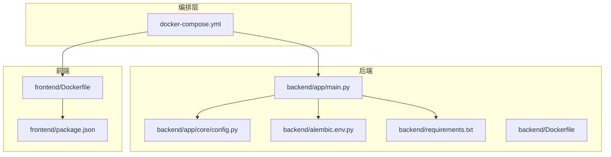
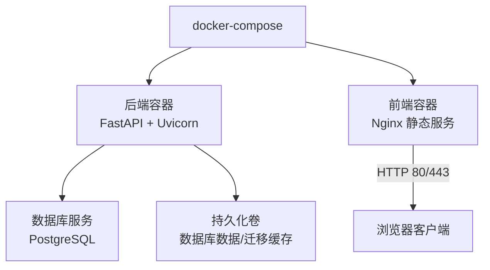
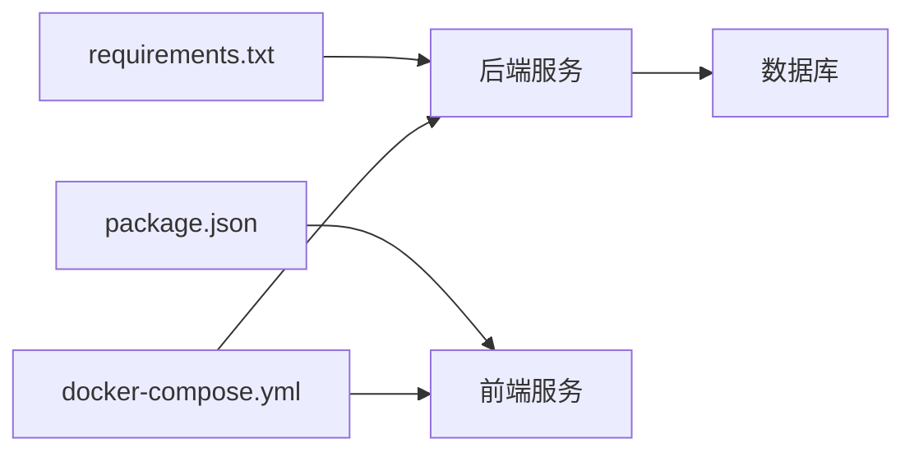

# 安装部署问题

<cite>
**本文引用的文件**   
- [docker-compose.yml](file://docker-compose.yml)
- [backend/Dockerfile](file://backend/Dockerfile)
- [frontend/Dockerfile](file://frontend/Dockerfile)
- [backend/app/main.py](file://backend/app/main.py)
- [backend/app/core/config.py](file://backend/app/core/config.py)
- [backend/alembic.ini](file://backend/alembic.ini)
- [backend/alembic/env.py](file://backend/alembic/env.py)
- [backend/requirements.txt](file://backend/requirements.txt)
- [frontend/package.json](file://frontend/package.json)
- [dev.sh](file://dev.sh)
- [dev.ps1](file://dev.ps1)
</cite>

## 目录
1. [简介](#简介)
2. [项目结构](#项目结构)
3. [核心组件](#核心组件)
4. [架构总览](#架构总览)
5. [详细组件分析](#详细组件分析)
6. [依赖关系分析](#依赖关系分析)
7. [性能注意事项](#性能注意事项)
8. [故障排查指南](#故障排查指南)
9. [结论](#结论)
10. [附录](#附录)

## 简介
本指南面向Talos平台的安装与部署，聚焦容器启动失败、Python与Node.js依赖问题、数据库初始化失败、环境变量配置错误等常见问题的诊断与修复。文档基于仓库中的Docker编排、后端配置、迁移脚本与前后端构建脚本进行系统性说明，并提供可操作的步骤与排错清单。

## 项目结构
- 后端：FastAPI应用、Alembic数据迁移、依赖管理（requirements.txt）、Docker镜像构建
- 前端：Vue/Vite工程、Nginx静态服务、依赖管理（package.json）、Docker镜像构建
- 编排：docker-compose统一编排前后端与服务依赖
- 开发脚本：dev.sh（Linux/macOS）与 dev.ps1（Windows PowerShell）用于本地快速启动

图表来源
- [docker-compose.yml](file://docker-compose.yml)
- [backend/app/main.py](file://backend/app/main.py)
- [backend/app/core/config.py](file://backend/app/core/config.py)
- [backend/alembic/env.py](file://backend/alembic/env.py)
- [backend/requirements.txt](file://backend/requirements.txt)
- [frontend/package.json](file://frontend/package.json)
- [backend/Dockerfile](file://backend/Dockerfile)
- [frontend/Dockerfile](file://frontend/Dockerfile)

章节来源
- [docker-compose.yml](file://docker-compose.yml)
- [backend/Dockerfile](file://backend/Dockerfile)
- [frontend/Dockerfile](file://frontend/Dockerfile)
- [backend/app/main.py](file://backend/app/main.py)
- [backend/app/core/config.py](file://backend/app/core/config.py)
- [backend/alembic/env.py](file://backend/alembic/env.py)
- [backend/requirements.txt](file://backend/requirements.txt)
- [frontend/package.json](file://frontend/package.json)

## 核心组件
- 容器编排：通过docker-compose定义服务、网络、卷、端口映射与环境变量
- 后端服务：FastAPI应用入口、配置加载、数据库连接与迁移执行
- 前端服务：静态资源构建与Nginx托管
- 数据迁移：Alembic负责表结构变更与版本管理

章节来源
- [docker-compose.yml](file://docker-compose.yml)
- [backend/app/main.py](file://backend/app/main.py)
- [backend/app/core/config.py](file://backend/app/core/config.py)
- [backend/alembic/env.py](file://backend/alembic/env.py)
- [backend/alembic.ini](file://backend/alembic.ini)
- [backend/requirements.txt](file://backend/requirements.txt)
- [frontend/package.json](file://frontend/package.json)

## 架构总览
下图展示容器化部署的关键交互：编排器驱动后端与前端镜像，后端连接数据库并执行迁移，前端由Nginx提供静态页面。

图表来源
- [docker-compose.yml](file://docker-compose.yml)
- [backend/app/main.py](file://backend/app/main.py)
- [frontend/Dockerfile](file://frontend/Dockerfile)

## 详细组件分析

### 容器启动失败的常见原因与解决
- 端口冲突
  - 现象：容器启动后立即退出或报错“地址已在使用”
  - 排查：检查宿主机端口占用；核对docker-compose中端口映射是否与其他服务冲突
  - 解决：修改端口映射或释放被占用的端口；确认防火墙规则允许访问
  - 参考位置：[docker-compose.yml](file://docker-compose.yml)

- 权限不足
  - 现象：容器内写入卷失败、无法绑定特权端口、运行时报权限拒绝
  - 排查：检查挂载目录的宿主权限；确认非root用户运行时的UID/GID设置
  - 解决：调整目录权限或使用具备相应权限的用户；避免在容器内以root运行敏感操作
  - 参考位置：[docker-compose.yml](file://docker-compose.yml)、[backend/Dockerfile](file://backend/Dockerfile)、[frontend/Dockerfile](file://frontend/Dockerfile)

- 镜像拉取失败
  - 现象：docker compose up时报拉取超时或认证失败
  - 排查：网络连通性、代理设置、私有仓库鉴权、镜像名称与标签是否正确
  - 解决：配置代理或更换镜像源；校验登录状态与仓库权限；修正镜像名/标签
  - 参考位置：[docker-compose.yml](file://docker-compose.yml)

- 健康检查失败
  - 现象：容器标记为不健康导致编排器重启或停止
  - 排查：检查健康检查命令与目标端口；确认应用启动完成后再暴露端口
  - 解决：调整健康检查间隔与重试次数；确保后端服务监听正确端口
  - 参考位置：[docker-compose.yml](file://docker-compose.yml)

章节来源
- [docker-compose.yml](file://docker-compose.yml)
- [backend/Dockerfile](file://backend/Dockerfile)
- [frontend/Dockerfile](file://frontend/Dockerfile)

### Python依赖安装问题诊断
- 常见问题
  - 编译依赖缺失（如系统级库、C扩展头文件）
  - 包版本冲突或wheel不可用
  - 网络受限导致下载失败
- 诊断步骤
  - 使用requirements.txt进行离线或在线安装，观察具体失败包
  - 检查系统依赖是否满足（例如libpq-dev、openssl等）
  - 切换镜像源或启用缓存加速
- 修复建议
  - 补齐系统依赖后重新安装Python包
  - 固定已知兼容的版本组合
  - 在Docker构建阶段预装依赖以减少运行时问题
- 参考位置：[backend/requirements.txt](file://backend/requirements.txt)、[backend/Dockerfile](file://backend/Dockerfile)

章节来源
- [backend/requirements.txt](file://backend/requirements.txt)
- [backend/Dockerfile](file://backend/Dockerfile)

### Node.js包管理问题诊断
- 常见问题
  - npm/yarn/pnpm锁文件不一致导致安装失败
  - 网络受限或镜像源不可达
  - 构建工具链缺失（如node-gyp、python环境）
- 诊断步骤
  - 清理缓存后重新安装依赖，定位具体失败包
  - 检查package.json脚本与构建命令
  - 验证Node版本与引擎要求匹配
- 修复建议
  - 使用一致的包管理器与锁定文件
  - 配置国内镜像源或代理
  - 安装必要的系统构建依赖
- 参考位置：[frontend/package.json](file://frontend/package.json)、[frontend/Dockerfile](file://frontend/Dockerfile)

章节来源
- [frontend/package.json](file://frontend/package.json)
- [frontend/Dockerfile](file://frontend/Dockerfile)

### 数据库初始化失败处理
- 连接配置
  - 现象：连接超时、认证失败、SSL握手失败
  - 排查：核对数据库主机、端口、用户名、密码、数据库名；检查网络可达性与防火墙
  - 修复：修正连接参数；必要时开启SSL并配置证书路径
  - 参考位置：[backend/app/core/config.py](file://backend/app/core/config.py)、[docker-compose.yml](file://docker-compose.yml)

- 迁移错误
  - 现象：Alembic迁移失败、表不存在、约束冲突
  - 排查：查看迁移日志与错误堆栈；确认当前版本与期望版本一致
  - 修复：回滚到稳定版本后重放迁移；修复迁移脚本逻辑；确保数据库用户具备DDL权限
  - 参考位置：[backend/alembic/env.py](file://backend/alembic/env.py)、[backend/alembic.ini](file://backend/alembic.ini)

- 数据卷与初始化
  - 现象：首次启动无数据或重复启动数据异常
  - 排查：检查数据卷是否已初始化；确认初始化脚本执行顺序
  - 修复：清理无效卷后重新初始化；确保初始化脚本幂等
  - 参考位置：[docker-compose.yml](file://docker-compose.yml)

章节来源
- [backend/app/core/config.py](file://backend/app/core/config.py)
- [backend/alembic/env.py](file://backend/alembic/env.py)
- [backend/alembic.ini](file://backend/alembic.ini)
- [docker-compose.yml](file://docker-compose.yml)

### 环境变量配置错误排查
- 配置文件格式
  - 现象：解析失败、键值对丢失、注释未生效
  - 排查：检查文件格式（如YAML/JSON/ENV）语法；确认键名大小写与分隔符
  - 修复：修正格式错误；使用标准模板生成配置
  - 参考位置：[backend/app/core/config.py](file://backend/app/core/config.py)

- 路径设置
  - 现象：找不到配置文件或资源文件
  - 排查：检查相对路径与绝对路径；确认容器工作目录与挂载点
  - 修复：统一使用绝对路径或在容器内设置正确的WORKDIR
  - 参考位置：[backend/app/core/config.py](file://backend/app/core/config.py)

- 权限问题
  - 现象：读取配置失败、写入日志失败
  - 排查：检查文件权限与用户上下文；确认容器用户有读/写权限
  - 修复：调整文件或目录权限；使用只读挂载配置
  - 参考位置：[docker-compose.yml](file://docker-compose.yml)

章节来源
- [backend/app/core/config.py](file://backend/app/core/config.py)
- [docker-compose.yml](file://docker-compose.yml)

### 不同操作系统下的特殊注意事项
- Windows
  - 注意PowerShell脚本编码与换行符；使用dev.ps1时确保执行策略允许
  - Docker Desktop需启用WSL2后端以获得更好的文件系统性能
  - 路径分隔符与大小写敏感性差异可能导致资源加载失败
  - 参考位置：[dev.ps1](file://dev.ps1)

- Linux/macOS
  - 注意shell脚本执行权限；使用dev.sh前赋予可执行权限
  - 某些系统库（如libssl、libpq）需要预先安装
  - 参考位置：[dev.sh](file://dev.sh)

章节来源
- [dev.ps1](file://dev.ps1)
- [dev.sh](file://dev.sh)

## 依赖关系分析
- 后端依赖：Python包（requirements.txt）、系统库、数据库驱动
- 前端依赖：Node.js生态包（package.json）、构建工具链
- 编排依赖：Docker与docker-compose、镜像源与网络可达性

图表来源
- [backend/requirements.txt](file://backend/requirements.txt)
- [frontend/package.json](file://frontend/package.json)
- [docker-compose.yml](file://docker-compose.yml)

章节来源
- [backend/requirements.txt](file://backend/requirements.txt)
- [frontend/package.json](file://frontend/package.json)
- [docker-compose.yml](file://docker-compose.yml)

## 性能注意事项
- 数据库连接池：合理设置最大连接数与超时，避免连接耗尽
- 镜像构建缓存：分层优化Dockerfile，减少重复构建时间
- 前端构建：使用并行构建与缓存策略，降低冷启动耗时
- 资源限制：为容器设置CPU与内存上限，防止资源争用

## 故障排查指南
- 容器启动失败
  - 查看容器日志与编排器事件
  - 检查端口占用与健康检查
  - 验证镜像拉取与网络代理
  - 参考位置：[docker-compose.yml](file://docker-compose.yml)

- Python依赖问题
  - 定位失败包与系统依赖
  - 切换镜像源与缓存策略
  - 参考位置：[backend/requirements.txt](file://backend/requirements.txt)、[backend/Dockerfile](file://backend/Dockerfile)

- Node.js依赖问题
  - 清理缓存与锁文件一致性
  - 检查构建工具链与Node版本
  - 参考位置：[frontend/package.json](file://frontend/package.json)、[frontend/Dockerfile](file://frontend/Dockerfile)

- 数据库初始化失败
  - 核对连接参数与网络可达性
  - 检查迁移版本与权限
  - 参考位置：[backend/app/core/config.py](file://backend/app/core/config.py)、[backend/alembic/env.py](file://backend/alembic/env.py)、[backend/alembic.ini](file://backend/alembic.ini)

- 环境变量配置错误
  - 校验格式与路径
  - 检查权限与挂载点
  - 参考位置：[backend/app/core/config.py](file://backend/app/core/config.py)、[docker-compose.yml](file://docker-compose.yml)

- 快速修复清单
  - 释放端口或修改映射
  - 修正镜像名/标签与鉴权
  - 补齐系统依赖后重装Python/Node包
  - 回滚迁移并重放
  - 修正环境变量格式与路径
  - 调整容器权限与只读挂载

章节来源
- [docker-compose.yml](file://docker-compose.yml)
- [backend/requirements.txt](file://backend/requirements.txt)
- [backend/Dockerfile](file://backend/Dockerfile)
- [frontend/package.json](file://frontend/package.json)
- [frontend/Dockerfile](file://frontend/Dockerfile)
- [backend/app/core/config.py](file://backend/app/core/config.py)
- [backend/alembic/env.py](file://backend/alembic/env.py)
- [backend/alembic.ini](file://backend/alembic.ini)

## 结论
通过系统化地检查容器编排、依赖安装、数据库初始化与环境变量配置，可以快速定位并修复Talos平台在安装与部署阶段的常见问题。建议在生产环境采用严格的配置管理与依赖锁定策略，结合健康检查与日志监控提升稳定性。

## 附录
- 常用命令参考
  - 启动服务：使用编排器启动所有服务
  - 查看日志：按服务维度查看容器日志
  - 进入容器：调试容器内环境与依赖
  - 执行迁移：手动触发Alembic迁移
- 参考位置
  - [docker-compose.yml](file://docker-compose.yml)
  - [backend/alembic/env.py](file://backend/alembic/env.py)
  - [backend/alembic.ini](file://backend/alembic.ini)