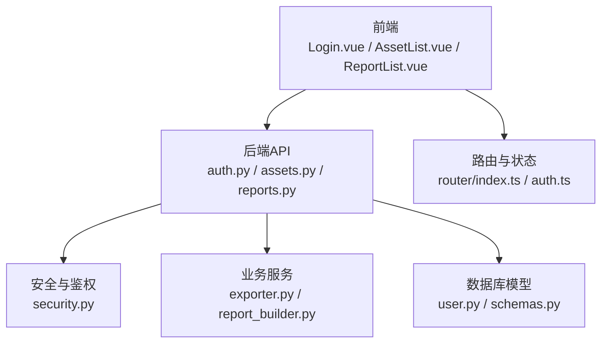
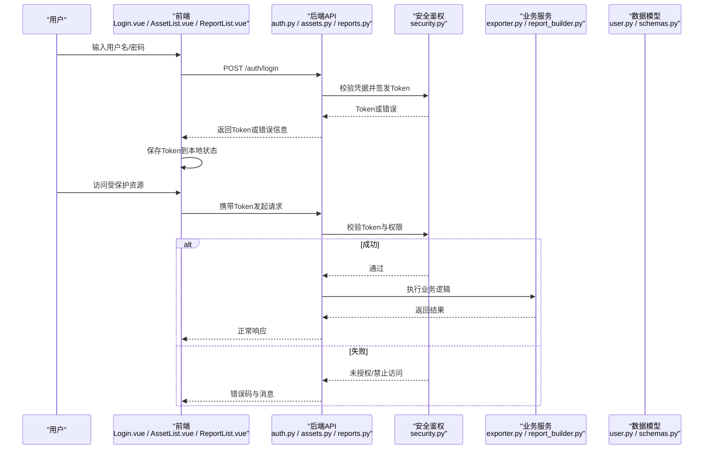
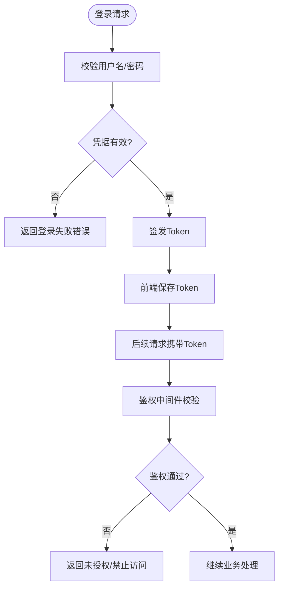
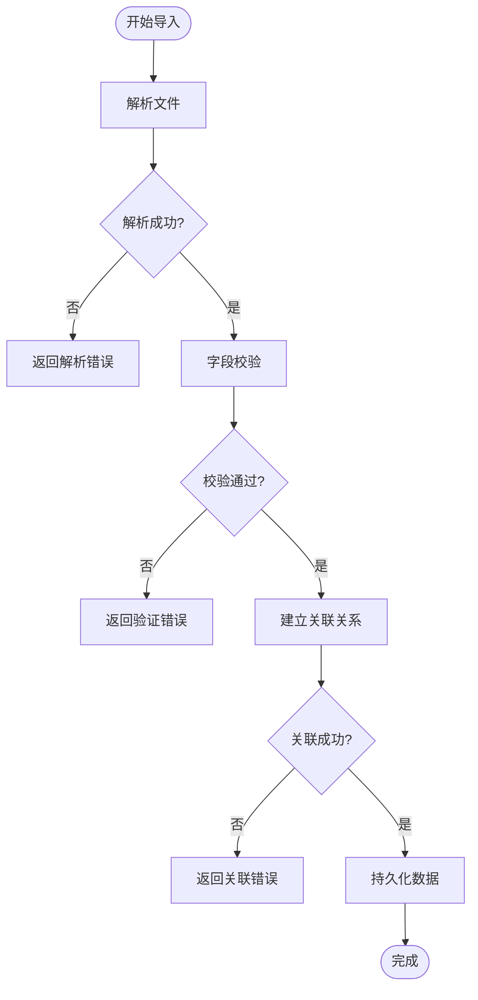
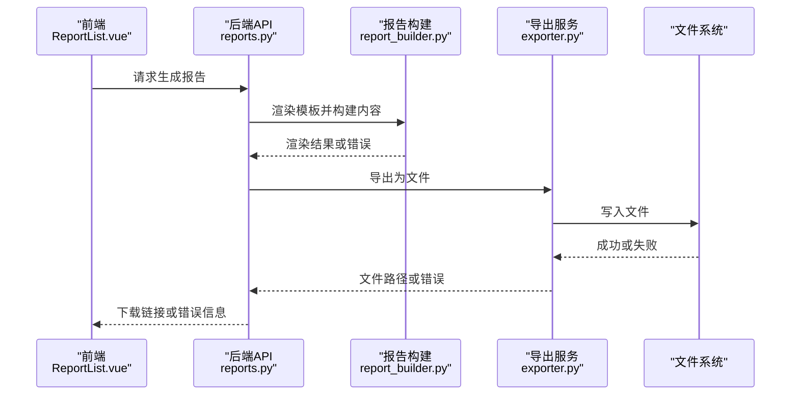
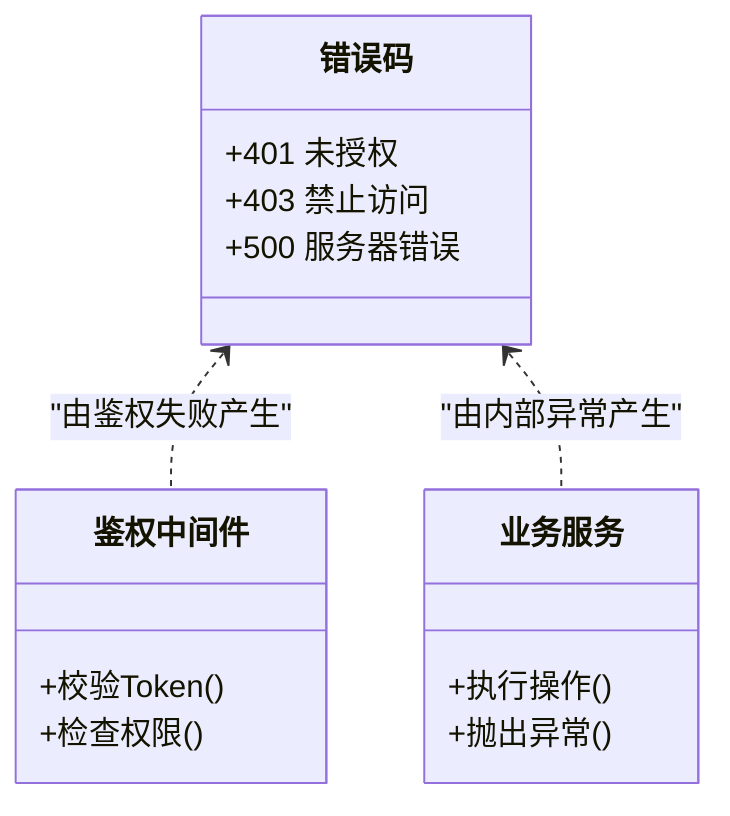
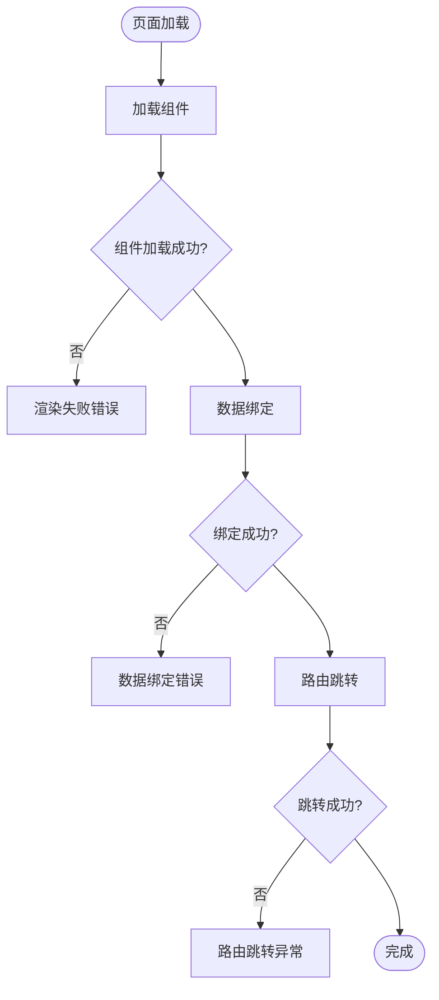
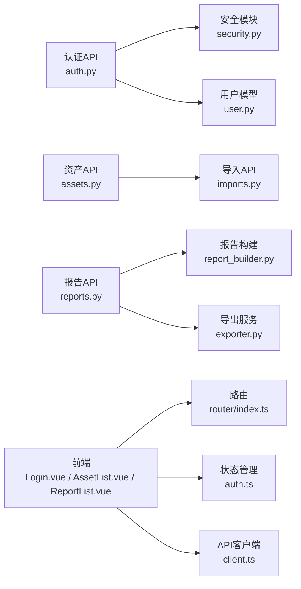

# 常见错误解决方案

<cite>
**本文引用的文件**   
- [backend/app/main.py](file://backend/app/main.py)
- [backend/app/api/v1/auth.py](file://backend/app/api/v1/auth.py)
- [backend/app/core/security.py](file://backend/app/core/security.py)
- [backend/app/api/v1/assets.py](file://backend/app/api/v1/assets.py)
- [backend/app/api/v1/imports.py](file://backend/app/api/v1/imports.py)
- [backend/app/services/exporter.py](file://backend/app/services/exporter.py)
- [backend/app/services/report_builder.py](file://backend/app/services/report_builder.py)
- [backend/app/models/user.py](file://backend/app/models/user.py)
- [backend/app/schemas.py](file://backend/app/schemas.py)
- [frontend/src/router/index.ts](file://frontend/src/router/index.ts)
- [frontend/src/stores/auth.ts](file://frontend/src/stores/auth.ts)
- [frontend/src/views/Login.vue](file://frontend/src/views/Login.vue)
- [frontend/src/views/AssetList.vue](file://frontend/src/views/AssetList.vue)
- [frontend/src/views/ReportList.vue](file://frontend/src/views/ReportList.vue)
- [frontend/src/api/client.ts](file://frontend/src/api/client.ts)
</cite>

## 目录
1. [简介](#简介)
2. [项目结构](#项目结构)
3. [核心组件](#核心组件)
4. [架构总览](#架构总览)
5. [详细组件分析](#详细组件分析)
6. [依赖关系分析](#依赖关系分析)
7. [性能注意事项](#性能注意事项)
8. [故障排查指南](#故障排查指南)
9. [结论](#结论)
10. [附录](#附录)

## 简介
本手册聚焦Talos平台在用户认证、资产管理、报告生成与导出、API接口以及前端界面等模块的常见错误，提供快速定位与解决步骤。内容基于仓库中的后端API、服务层、模型与前端路由、状态管理、视图组件进行梳理，帮助运维与开发人员高效排障。

## 项目结构
- 后端采用模块化分层：入口应用、API路由、核心安全与配置、数据模型、业务服务、异步任务等。
- 前端基于Vue生态：路由、状态管理（认证）、页面组件、API客户端封装。
- 关键路径：
  - 认证流程：前端登录页 -> API鉴权 -> Token签发与校验
  - 资产管理：导入、校验、持久化、关联关系维护
  - 报告导出：模板渲染、文件写入、存储策略
  - 前端路由与权限：登录后跳转、受保护路由守卫

**图表来源** 
- [backend/app/api/v1/auth.py](file://backend/app/api/v1/auth.py)
- [backend/app/core/security.py](file://backend/app/core/security.py)
- [backend/app/services/exporter.py](file://backend/app/services/exporter.py)
- [backend/app/services/report_builder.py](file://backend/app/services/report_builder.py)
- [backend/app/models/user.py](file://backend/app/models/user.py)
- [backend/app/schemas.py](file://backend/app/schemas.py)
- [frontend/src/router/index.ts](file://frontend/src/router/index.ts)
- [frontend/src/stores/auth.ts](file://frontend/src/stores/auth.ts)
- [frontend/src/views/Login.vue](file://frontend/src/views/Login.vue)
- [frontend/src/views/AssetList.vue](file://frontend/src/views/AssetList.vue)
- [frontend/src/views/ReportList.vue](file://frontend/src/views/ReportList.vue)

**章节来源**
- [backend/app/main.py](file://backend/app/main.py)
- [frontend/src/router/index.ts](file://frontend/src/router/index.ts)

## 核心组件
- 认证与安全
  - 登录接口负责验证凭据并签发Token；中间件负责请求级鉴权与权限校验。
  - 常见问题：登录失败、权限不足、Token过期。
- 资产管理
  - 资产导入涉及数据解析、字段校验、关联关系处理与持久化。
  - 常见问题：导入失败、数据验证错误、关联关系异常。
- 报告生成与导出
  - 模板渲染、文件生成、存储落盘与下载。
  - 常见问题：模板渲染错误、文件权限问题、存储空间不足。
- API接口
  - 统一错误码与响应格式，便于前端拦截与提示。
  - 常见问题：401未授权、403禁止访问、500服务器错误。
- 前端界面
  - 路由守卫、状态管理、组件渲染与数据绑定。
  - 常见问题：组件渲染失败、数据绑定错误、路由跳转异常。

**章节来源**
- [backend/app/api/v1/auth.py](file://backend/app/api/v1/auth.py)
- [backend/app/core/security.py](file://backend/app/core/security.py)
- [backend/app/api/v1/assets.py](file://backend/app/api/v1/assets.py)
- [backend/app/api/v1/imports.py](file://backend/app/api/v1/imports.py)
- [backend/app/services/exporter.py](file://backend/app/services/exporter.py)
- [backend/app/services/report_builder.py](file://backend/app/services/report_builder.py)
- [frontend/src/stores/auth.ts](file://frontend/src/stores/auth.ts)
- [frontend/src/router/index.ts](file://frontend/src/router/index.ts)

## 架构总览
下图展示认证、资产、报告导出的端到端调用链与关键错误点。

**图表来源** 
- [backend/app/api/v1/auth.py](file://backend/app/api/v1/auth.py)
- [backend/app/core/security.py](file://backend/app/core/security.py)
- [backend/app/services/exporter.py](file://backend/app/services/exporter.py)
- [backend/app/services/report_builder.py](file://backend/app/services/report_builder.py)
- [backend/app/models/user.py](file://backend/app/models/user.py)
- [backend/app/schemas.py](file://backend/app/schemas.py)
- [frontend/src/views/Login.vue](file://frontend/src/views/Login.vue)
- [frontend/src/stores/auth.ts](file://frontend/src/stores/auth.ts)

## 详细组件分析

### 认证相关错误与解决
- 登录失败
  - 可能原因：用户名不存在、密码错误、账户被锁定、外部依赖不可用。
  - 排查步骤：检查日志中认证失败的堆栈；确认用户记录是否存在且状态正常；核对密码哈希算法一致性。
  - 解决措施：重置密码、解锁账户、修复依赖服务连接。
- 权限不足
  - 可能原因：角色不匹配、资源权限未授予、租户隔离限制。
  - 排查步骤：查看当前用户的角色与资源映射；确认权限规则是否覆盖目标资源。
  - 解决措施：调整角色分配、补充资源权限、修正租户上下文。
- Token过期
  - 可能原因：Token有效期设置过短、刷新机制缺失、时钟不同步。
  - 排查步骤：检查Token签发时间与有效期；确认前端是否在过期前刷新；核对系统时间同步。
  - 解决措施：延长有效期、实现自动刷新、校准服务器时间。

**图表来源** 
- [backend/app/api/v1/auth.py](file://backend/app/api/v1/auth.py)
- [backend/app/core/security.py](file://backend/app/core/security.py)
- [frontend/src/stores/auth.ts](file://frontend/src/stores/auth.ts)

**章节来源**
- [backend/app/api/v1/auth.py](file://backend/app/api/v1/auth.py)
- [backend/app/core/security.py](file://backend/app/core/security.py)
- [frontend/src/stores/auth.ts](file://frontend/src/stores/auth.ts)

### 资产管理常见错误与解决
- 资产导入失败
  - 可能原因：文件格式不支持、字段缺失、编码异常、大小超限。
  - 排查步骤：检查导入文件的结构与编码；查看导入服务的解析日志；确认文件大小限制。
  - 解决措施：修正文件格式与字段、调整大小限制、修复编码。
- 数据验证错误
  - 可能原因：必填项缺失、类型不符、唯一性冲突、枚举值非法。
  - 排查步骤：对照数据模型与Schema定义；定位具体字段校验失败位置。
  - 解决措施：补全必填项、修正数据类型、去重或更新冲突记录、使用合法枚举值。
- 关联关系异常
  - 可能原因：外键约束失败、关联对象不存在、循环引用。
  - 排查步骤：检查关联表的外键与索引；确认关联对象已存在且可访问。
  - 解决措施：先创建关联对象、修正引用ID、避免循环依赖。

**图表来源** 
- [backend/app/api/v1/assets.py](file://backend/app/api/v1/assets.py)
- [backend/app/api/v1/imports.py](file://backend/app/api/v1/imports.py)
- [backend/app/schemas.py](file://backend/app/schemas.py)

**章节来源**
- [backend/app/api/v1/assets.py](file://backend/app/api/v1/assets.py)
- [backend/app/api/v1/imports.py](file://backend/app/api/v1/imports.py)
- [backend/app/schemas.py](file://backend/app/schemas.py)

### 报告生成与导出问题排查
- 模板渲染错误
  - 可能原因：模板变量缺失、语法错误、模板文件损坏。
  - 排查步骤：检查模板引擎日志；确认变量注入完整；验证模板语法。
  - 解决措施：补齐变量、修正语法、替换损坏模板。
- 文件权限问题
  - 可能原因：输出目录无写权限、容器用户权限不足、挂载卷权限错误。
  - 排查步骤：检查文件系统权限；确认运行用户与目录所有者；验证Docker挂载权限。
  - 解决措施：修正目录权限、调整运行用户、修复挂载配置。
- 存储空间不足
  - 可能原因：磁盘空间耗尽、临时目录过大、清理策略缺失。
  - 排查步骤：监控磁盘使用率；检查临时目录占用；评估清理策略。
  - 解决措施：扩容磁盘、清理临时文件、优化生成策略。

**图表来源** 
- [backend/app/services/report_builder.py](file://backend/app/services/report_builder.py)
- [backend/app/services/exporter.py](file://backend/app/services/exporter.py)
- [frontend/src/views/ReportList.vue](file://frontend/src/views/ReportList.vue)

**章节来源**
- [backend/app/services/report_builder.py](file://backend/app/services/report_builder.py)
- [backend/app/services/exporter.py](file://backend/app/services/exporter.py)
- [frontend/src/views/ReportList.vue](file://frontend/src/views/ReportList.vue)

### API接口常见错误码与解决
- 401 未授权
  - 触发条件：缺少Token、Token无效或过期。
  - 解决措施：重新登录获取新Token；确保请求头携带正确Authorization；检查Token刷新逻辑。
- 403 禁止访问
  - 触发条件：权限不足、角色不匹配、资源隔离限制。
  - 解决措施：提升用户角色或授予相应权限；检查租户上下文；确认资源访问规则。
- 500 服务器错误
  - 触发条件：内部异常、依赖服务不可用、数据不一致。
  - 解决措施：查看后端日志定位异常；修复依赖服务；校验数据一致性；必要时回滚变更。

**图表来源** 
- [backend/app/core/security.py](file://backend/app/core/security.py)
- [backend/app/schemas.py](file://backend/app/schemas.py)

**章节来源**
- [backend/app/core/security.py](file://backend/app/core/security.py)
- [backend/app/schemas.py](file://backend/app/schemas.py)

### 前端界面常见错误与处理
- 组件渲染失败
  - 可能原因：依赖库缺失、样式未加载、组件初始化异常。
  - 排查步骤：检查浏览器控制台错误；确认静态资源路径；查看组件生命周期钩子。
  - 解决措施：安装依赖、修正资源路径、修复初始化逻辑。
- 数据绑定错误
  - 可能原因：数据结构不匹配、异步数据未就绪、响应式更新失效。
  - 排查步骤：对比接口返回与组件期望结构；增加空值保护；确认响应式声明。
  - 解决措施：适配数据结构、增加默认值、修正响应式更新方式。
- 路由跳转异常
  - 可能原因：路由未注册、导航守卫拦截、参数传递错误。
  - 排查步骤：检查路由表配置；确认守卫逻辑；核对路由参数类型。
  - 解决措施：补充路由注册、调整守卫条件、修正参数传递。

**图表来源** 
- [frontend/src/views/Login.vue](file://frontend/src/views/Login.vue)
- [frontend/src/views/AssetList.vue](file://frontend/src/views/AssetList.vue)
- [frontend/src/router/index.ts](file://frontend/src/router/index.ts)
- [frontend/src/stores/auth.ts](file://frontend/src/stores/auth.ts)

**章节来源**
- [frontend/src/views/Login.vue](file://frontend/src/views/Login.vue)
- [frontend/src/views/AssetList.vue](file://frontend/src/views/AssetList.vue)
- [frontend/src/router/index.ts](file://frontend/src/router/index.ts)
- [frontend/src/stores/auth.ts](file://frontend/src/stores/auth.ts)

### 国际化与本地化问题
- 常见问题
  - 语言包未加载、翻译键缺失、动态切换失效。
- 排查步骤
  - 检查语言包引入顺序与路径；确认翻译键是否存在；验证切换逻辑是否正确更新全局状态。
- 解决措施
  - 修正资源路径、补充缺失翻译键、确保状态更新触发UI刷新。

[本节为通用指导，不直接分析具体文件]

## 依赖关系分析
- 认证依赖安全模块与用户模型；资产导入依赖解析与校验服务；报告导出依赖模板构建与文件服务。
- 前端依赖路由与状态管理，API客户端统一处理请求与错误。

**图表来源** 
- [backend/app/api/v1/auth.py](file://backend/app/api/v1/auth.py)
- [backend/app/core/security.py](file://backend/app/core/security.py)
- [backend/app/models/user.py](file://backend/app/models/user.py)
- [backend/app/api/v1/assets.py](file://backend/app/api/v1/assets.py)
- [backend/app/api/v1/imports.py](file://backend/app/api/v1/imports.py)
- [backend/app/services/report_builder.py](file://backend/app/services/report_builder.py)
- [backend/app/services/exporter.py](file://backend/app/services/exporter.py)
- [frontend/src/router/index.ts](file://frontend/src/router/index.ts)
- [frontend/src/stores/auth.ts](file://frontend/src/stores/auth.ts)
- [frontend/src/api/client.ts](file://frontend/src/api/client.ts)

**章节来源**
- [backend/app/api/v1/auth.py](file://backend/app/api/v1/auth.py)
- [backend/app/core/security.py](file://backend/app/core/security.py)
- [backend/app/models/user.py](file://backend/app/models/user.py)
- [backend/app/api/v1/assets.py](file://backend/app/api/v1/assets.py)
- [backend/app/api/v1/imports.py](file://backend/app/api/v1/imports.py)
- [backend/app/services/report_builder.py](file://backend/app/services/report_builder.py)
- [backend/app/services/exporter.py](file://backend/app/services/exporter.py)
- [frontend/src/router/index.ts](file://frontend/src/router/index.ts)
- [frontend/src/stores/auth.ts](file://frontend/src/stores/auth.ts)
- [frontend/src/api/client.ts](file://frontend/src/api/client.ts)

## 性能注意事项
- 认证鉴权尽量缓存用户权限，减少重复查询。
- 资产导入支持分批处理与增量更新，避免大事务锁表。
- 报告生成采用异步队列与流式写入，降低内存峰值。
- 前端对大数据列表启用虚拟滚动与分页加载。

[本节为通用指导，不直接分析具体文件]

## 故障排查指南
- 认证失败
  - 检查登录接口日志与用户状态；确认Token签发与校验逻辑；核对前端保存与携带Token的方式。
- 权限不足
  - 查看角色与资源映射；确认租户隔离策略；检查鉴权中间件的权限判断逻辑。
- 导入失败
  - 检查文件格式与字段映射；查看解析与校验日志；确认外键与关联对象存在。
- 报告导出失败
  - 检查模板变量与语法；确认输出目录权限与磁盘空间；查看导出服务日志。
- 前端错误
  - 打开浏览器控制台查看错误堆栈；检查网络请求与响应；确认路由与状态管理逻辑。

**章节来源**
- [backend/app/api/v1/auth.py](file://backend/app/api/v1/auth.py)
- [backend/app/core/security.py](file://backend/app/core/security.py)
- [backend/app/api/v1/assets.py](file://backend/app/api/v1/assets.py)
- [backend/app/api/v1/imports.py](file://backend/app/api/v1/imports.py)
- [backend/app/services/exporter.py](file://backend/app/services/exporter.py)
- [backend/app/services/report_builder.py](file://backend/app/services/report_builder.py)
- [frontend/src/router/index.ts](file://frontend/src/router/index.ts)
- [frontend/src/stores/auth.ts](file://frontend/src/stores/auth.ts)
- [frontend/src/api/client.ts](file://frontend/src/api/client.ts)

## 结论
通过对认证、资产、报告导出、API与前端等关键模块的错误模式与解决步骤进行系统化整理，可在实际运维与开发中快速定位问题并采取有效措施。建议结合日志监控与自动化告警，进一步提升系统的稳定性与可观测性。

[本节为总结性内容，不直接分析具体文件]

## 附录
- 常用命令与工具
  - 查看后端日志：根据部署环境使用日志收集工具。
  - 检查磁盘与权限：使用系统命令查看文件系统状态。
  - 前端调试：使用浏览器开发者工具与网络面板。
- 参考文件
  - 认证与安全：[backend/app/api/v1/auth.py](file://backend/app/api/v1/auth.py)、[backend/app/core/security.py](file://backend/app/core/security.py)
  - 资产与导入：[backend/app/api/v1/assets.py](file://backend/app/api/v1/assets.py)、[backend/app/api/v1/imports.py](file://backend/app/api/v1/imports.py)
  - 报告导出：[backend/app/services/exporter.py](file://backend/app/services/exporter.py)、[backend/app/services/report_builder.py](file://backend/app/services/report_builder.py)
  - 前端路由与状态：[frontend/src/router/index.ts](file://frontend/src/router/index.ts)、[frontend/src/stores/auth.ts](file://frontend/src/stores/auth.ts)

[本节为附录信息，不直接分析具体文件]