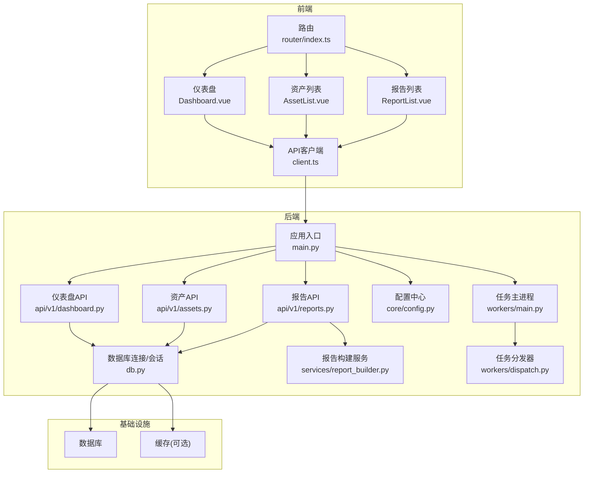
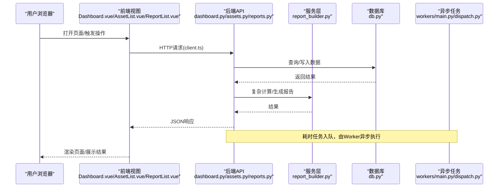
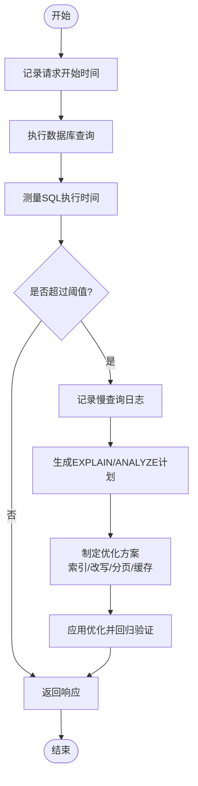
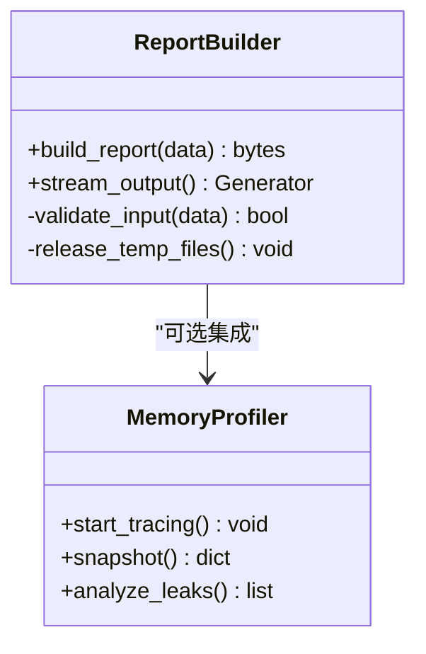
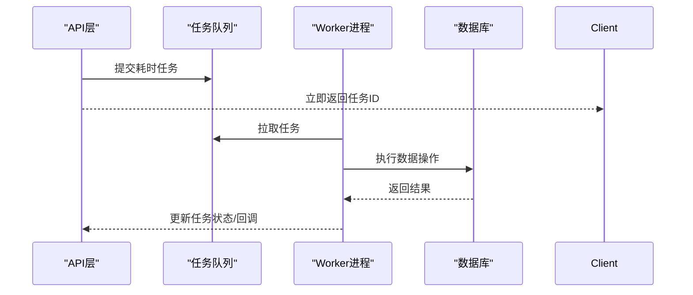
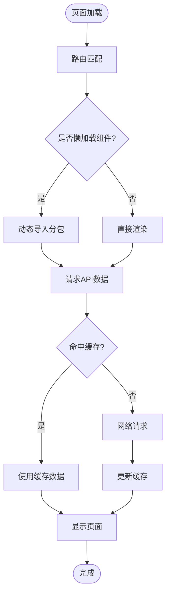
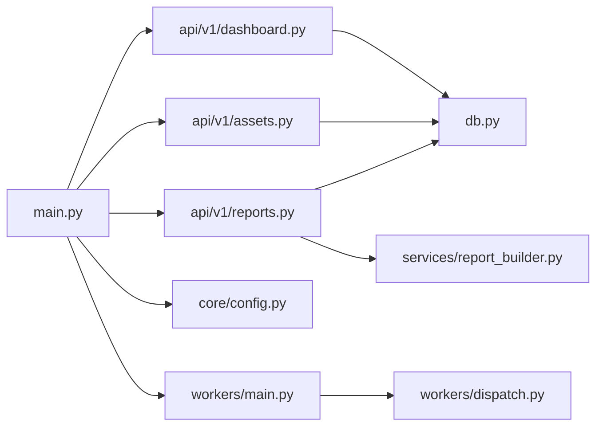

# 性能问题

<cite>
**本文引用的文件**   
- [backend/app/main.py](file://backend/app/main.py)
- [backend/app/db.py](file://backend/app/db.py)
- [backend/app/core/config.py](file://backend/app/core/config.py)
- [backend/app/api/v1/dashboard.py](file://backend/app/api/v1/dashboard.py)
- [backend/app/api/v1/assets.py](file://backend/app/api/v1/assets.py)
- [backend/app/api/v1/reports.py](file://backend/app/api/v1/reports.py)
- [backend/app/services/report_builder.py](file://backend/app/services/report_builder.py)
- [backend/app/workers/main.py](file://backend/app/workers/main.py)
- [backend/app/workers/dispatch.py](file://backend/app/workers/dispatch.py)
- [frontend/src/router/index.ts](file://frontend/src/router/index.ts)
- [frontend/src/views/Dashboard.vue](file://frontend/src/views/Dashboard.vue)
- [frontend/src/views/AssetList.vue](file://frontend/src/views/AssetList.vue)
- [frontend/src/views/ReportList.vue](file://frontend/src/views/ReportList.vue)
- [frontend/src/api/client.ts](file://frontend/src/api/client.ts)
- [frontend/package.json](file://frontend/package.json)
- [frontend/vite.config.ts](file://frontend/vite.config.ts)
- [docker-compose.yml](file://docker-compose.yml)
</cite>

## 目录
1. [简介](#简介)
2. [项目结构](#项目结构)
3. [核心组件](#核心组件)
4. [架构总览](#架构总览)
5. [详细组件分析](#详细组件分析)
6. [依赖关系分析](#依赖关系分析)
7. [性能注意事项](#性能注意事项)
8. [故障排查指南](#故障排查指南)
9. [结论](#结论)
10. [附录](#附录)

## 简介
本指南面向Talos平台（后端FastAPI + 前端Vue/Vite）的性能问题排查与优化，覆盖慢查询识别与优化、内存使用诊断、CPU瓶颈定位、前端加载性能优化、监控指标配置与解读，以及压力测试与基准测试实施方法。文档以仓库实际代码为依据，提供可操作的步骤、可视化流程图和关键文件路径引用，帮助读者快速定位并解决问题。

## 项目结构
Talos采用前后端分离架构：
- 后端：FastAPI应用，包含API路由、数据库访问、服务层、异步任务调度等模块。
- 前端：Vue 3 + Vite构建，包含路由、视图组件、API客户端等。
- 部署：通过Docker Compose编排服务。

**图表来源** 
- [backend/app/main.py](file://backend/app/main.py)
- [backend/app/db.py](file://backend/app/db.py)
- [backend/app/core/config.py](file://backend/app/core/config.py)
- [backend/app/api/v1/dashboard.py](file://backend/app/api/v1/dashboard.py)
- [backend/app/api/v1/assets.py](file://backend/app/api/v1/assets.py)
- [backend/app/api/v1/reports.py](file://backend/app/api/v1/reports.py)
- [backend/app/services/report_builder.py](file://backend/app/services/report_builder.py)
- [backend/app/workers/main.py](file://backend/app/workers/main.py)
- [backend/app/workers/dispatch.py](file://backend/app/workers/dispatch.py)
- [frontend/src/router/index.ts](file://frontend/src/router/index.ts)
- [frontend/src/views/Dashboard.vue](file://frontend/src/views/Dashboard.vue)
- [frontend/src/views/AssetList.vue](file://frontend/src/views/AssetList.vue)
- [frontend/src/views/ReportList.vue](file://frontend/src/views/ReportList.vue)
- [frontend/src/api/client.ts](file://frontend/src/api/client.ts)

**章节来源**
- [backend/app/main.py](file://backend/app/main.py)
- [backend/app/db.py](file://backend/app/db.py)
- [backend/app/core/config.py](file://backend/app/core/config.py)
- [backend/app/api/v1/dashboard.py](file://backend/app/api/v1/dashboard.py)
- [backend/app/api/v1/assets.py](file://backend/app/api/v1/assets.py)
- [backend/app/api/v1/reports.py](file://backend/app/api/v1/reports.py)
- [backend/app/services/report_builder.py](file://backend/app/services/report_builder.py)
- [backend/app/workers/main.py](file://backend/app/workers/main.py)
- [backend/app/workers/dispatch.py](file://backend/app/workers/dispatch.py)
- [frontend/src/router/index.ts](file://frontend/src/router/index.ts)
- [frontend/src/views/Dashboard.vue](file://frontend/src/views/Dashboard.vue)
- [frontend/src/views/AssetList.vue](file://frontend/src/views/AssetList.vue)
- [frontend/src/views/ReportList.vue](file://frontend/src/views/ReportList.vue)
- [frontend/src/api/client.ts](file://frontend/src/api/client.ts)

## 核心组件
- 应用入口与中间件：统一请求处理、日志、错误捕获、CORS/认证等。
- API层：按功能域划分（仪表盘、资产、报告等），负责参数校验、调用服务层。
- 数据访问层：数据库连接池、会话管理、事务控制。
- 服务层：复杂业务逻辑封装（如报告构建）。
- 异步任务：后台任务调度与执行，避免阻塞HTTP请求。
- 前端路由与视图：页面导航、数据获取与渲染。
- 配置中心：环境变量与运行时配置。

**章节来源**
- [backend/app/main.py](file://backend/app/main.py)
- [backend/app/api/v1/dashboard.py](file://backend/app/api/v1/dashboard.py)
- [backend/app/api/v1/assets.py](file://backend/app/api/v1/assets.py)
- [backend/app/api/v1/reports.py](file://backend/app/api/v1/reports.py)
- [backend/app/db.py](file://backend/app/db.py)
- [backend/app/services/report_builder.py](file://backend/app/services/report_builder.py)
- [backend/app/workers/main.py](file://backend/app/workers/main.py)
- [backend/app/workers/dispatch.py](file://backend/app/workers/dispatch.py)
- [backend/app/core/config.py](file://backend/app/core/config.py)
- [frontend/src/router/index.ts](file://frontend/src/router/index.ts)
- [frontend/src/views/Dashboard.vue](file://frontend/src/views/Dashboard.vue)
- [frontend/src/views/AssetList.vue](file://frontend/src/views/AssetList.vue)
- [frontend/src/views/ReportList.vue](file://frontend/src/views/ReportList.vue)
- [frontend/src/api/client.ts](file://frontend/src/api/client.ts)

## 架构总览
下图展示从前端到后端的完整请求链路，包括数据库访问与异步任务调度的交互点。

**图表来源** 
- [frontend/src/views/Dashboard.vue](file://frontend/src/views/Dashboard.vue)
- [frontend/src/views/AssetList.vue](file://frontend/src/views/AssetList.vue)
- [frontend/src/views/ReportList.vue](file://frontend/src/views/ReportList.vue)
- [frontend/src/api/client.ts](file://frontend/src/api/client.ts)
- [backend/app/api/v1/dashboard.py](file://backend/app/api/v1/dashboard.py)
- [backend/app/api/v1/assets.py](file://backend/app/api/v1/assets.py)
- [backend/app/api/v1/reports.py](file://backend/app/api/v1/reports.py)
- [backend/app/services/report_builder.py](file://backend/app/services/report_builder.py)
- [backend/app/db.py](file://backend/app/db.py)
- [backend/app/workers/main.py](file://backend/app/workers/main.py)
- [backend/app/workers/dispatch.py](file://backend/app/workers/dispatch.py)

## 详细组件分析

### 慢查询识别与优化（数据库索引、查询计划、连接池）
- 识别方法
  - 在API层对关键接口添加请求耗时统计与SQL执行时间记录，结合结构化日志输出。
  - 使用数据库慢查询日志与EXPLAIN/ANALYZE分析查询计划，关注全表扫描、临时表、文件排序等。
  - 针对高频热点接口建立基线，对比变更后的执行时间与计划变化。
- 优化策略
  - 索引设计：为WHERE、JOIN、ORDER BY、GROUP BY字段建立合适索引；避免过度索引导致写放大。
  - 查询重构：减少SELECT *，按需投影字段；拆分复杂子查询；合理使用分页与限制返回量。
  - 连接池调优：根据并发与数据库容量调整最大连接数、空闲超时、连接回收策略。
  - 读写分离与缓存：读多写少场景引入缓存或只读副本，降低主库压力。
- 关键实现位置
  - 数据库会话与连接管理：[backend/app/db.py](file://backend/app/db.py)
  - 配置项（连接池大小、超时等）：[backend/app/core/config.py](file://backend/app/core/config.py)
  - 典型查询接口：仪表盘、资产、报告相关API：[backend/app/api/v1/dashboard.py](file://backend/app/api/v1/dashboard.py)、[backend/app/api/v1/assets.py](file://backend/app/api/v1/assets.py)、[backend/app/api/v1/reports.py](file://backend/app/api/v1/reports.py)

**图表来源** 
- [backend/app/api/v1/dashboard.py](file://backend/app/api/v1/dashboard.py)
- [backend/app/api/v1/assets.py](file://backend/app/api/v1/assets.py)
- [backend/app/api/v1/reports.py](file://backend/app/api/v1/reports.py)
- [backend/app/db.py](file://backend/app/db.py)
- [backend/app/core/config.py](file://backend/app/core/config.py)

**章节来源**
- [backend/app/db.py](file://backend/app/db.py)
- [backend/app/core/config.py](file://backend/app/core/config.py)
- [backend/app/api/v1/dashboard.py](file://backend/app/api/v1/dashboard.py)
- [backend/app/api/v1/assets.py](file://backend/app/api/v1/assets.py)
- [backend/app/api/v1/reports.py](file://backend/app/api/v1/reports.py)

### 内存使用问题诊断（泄漏检测、GC监控、大对象处理）
- 诊断工具与方法
  - Python内存剖析：使用tracemalloc、memory_profiler定位增长热点与泄漏点。
  - GC监控：启用gc日志，观察频繁Full GC导致的停顿与内存峰值。
  - 大对象处理：流式读取/写入、分块处理、及时释放引用，避免一次性加载大文件。
- 实践建议
  - 在服务层对大数据集进行分页与迭代处理，避免累积到内存。
  - 对临时变量与作用域内对象及时del或重新赋值，缩短生命周期。
  - 合理设置Python解释器与进程模型（Gunicorn/uwsgi worker数量与内存上限）。
- 关键实现位置
  - 应用入口与进程模型：[backend/app/main.py](file://backend/app/main.py)
  - 报告构建等大对象处理：[backend/app/services/report_builder.py](file://backend/app/services/report_builder.py)

**图表来源** 
- [backend/app/services/report_builder.py](file://backend/app/services/report_builder.py)
- [backend/app/main.py](file://backend/app/main.py)

**章节来源**
- [backend/app/main.py](file://backend/app/main.py)
- [backend/app/services/report_builder.py](file://backend/app/services/report_builder.py)

### CPU性能瓶颈定位（热点代码、并发优化、异步任务调度）
- 定位方法
  - 使用cProfile/py-spy对热点函数采样，识别CPU密集型代码。
  - 分析线程/进程竞争与锁等待，减少串行化瓶颈。
  - 将CPU密集任务迁移至异步队列或独立Worker进程，避免阻塞事件循环。
- 优化策略
  - 算法优化：减少不必要的计算与重复I/O，利用缓存与预计算。
  - 并发模型：合理设置Worker数量与线程池大小，避免上下文切换开销。
  - 异步调度：使用消息队列（如Redis/RabbitMQ）解耦生产与消费，提升吞吐。
- 关键实现位置
  - 应用入口与中间件：[backend/app/main.py](file://backend/app/main.py)
  - 任务调度与执行：[backend/app/workers/main.py](file://backend/app/workers/main.py)、[backend/app/workers/dispatch.py](file://backend/app/workers/dispatch.py)

**图表来源** 
- [backend/app/api/v1/reports.py](file://backend/app/api/v1/reports.py)
- [backend/app/workers/main.py](file://backend/app/workers/main.py)
- [backend/app/workers/dispatch.py](file://backend/app/workers/dispatch.py)
- [backend/app/db.py](file://backend/app/db.py)

**章节来源**
- [backend/app/main.py](file://backend/app/main.py)
- [backend/app/workers/main.py](file://backend/app/workers/main.py)
- [backend/app/workers/dispatch.py](file://backend/app/workers/dispatch.py)

### 前端页面加载性能优化（资源压缩、懒加载、缓存策略）
- 资源压缩与打包
  - 使用Vite默认优化（Tree-shaking、代码分割、压缩），确保生产构建最小化。
  - 图片与静态资源启用CDN与缓存头，减少回源。
- 懒加载与路由级分包
  - 对非首屏组件使用动态导入，延迟加载以降低初始包体积。
- 缓存策略
  - 浏览器缓存：合理设置ETag/Cache-Control，避免重复下载。
  - 服务端缓存：对热点数据使用Redis缓存，减少数据库压力。
- 关键实现位置
  - 路由与视图：[frontend/src/router/index.ts](file://frontend/src/router/index.ts)、[frontend/src/views/Dashboard.vue](file://frontend/src/views/Dashboard.vue)、[frontend/src/views/AssetList.vue](file://frontend/src/views/AssetList.vue)、[frontend/src/views/ReportList.vue](file://frontend/src/views/ReportList.vue)
  - API客户端：[frontend/src/api/client.ts](file://frontend/src/api/client.ts)
  - 构建配置：[frontend/vite.config.ts](file://frontend/vite.config.ts)、[frontend/package.json](file://frontend/package.json)

**图表来源** 
- [frontend/src/router/index.ts](file://frontend/src/router/index.ts)
- [frontend/src/views/Dashboard.vue](file://frontend/src/views/Dashboard.vue)
- [frontend/src/views/AssetList.vue](file://frontend/src/views/AssetList.vue)
- [frontend/src/views/ReportList.vue](file://frontend/src/views/ReportList.vue)
- [frontend/src/api/client.ts](file://frontend/src/api/client.ts)
- [frontend/vite.config.ts](file://frontend/vite.config.ts)
- [frontend/package.json](file://frontend/package.json)

**章节来源**
- [frontend/src/router/index.ts](file://frontend/src/router/index.ts)
- [frontend/src/views/Dashboard.vue](file://frontend/src/views/Dashboard.vue)
- [frontend/src/views/AssetList.vue](file://frontend/src/views/AssetList.vue)
- [frontend/src/views/ReportList.vue](file://frontend/src/views/ReportList.vue)
- [frontend/src/api/client.ts](file://frontend/src/api/client.ts)
- [frontend/vite.config.ts](file://frontend/vite.config.ts)
- [frontend/package.json](file://frontend/package.json)

## 依赖关系分析
后端各模块之间的依赖与职责边界清晰，API层依赖服务层与数据访问层，任务调度与Worker进程解耦业务逻辑。

**图表来源** 
- [backend/app/main.py](file://backend/app/main.py)
- [backend/app/api/v1/dashboard.py](file://backend/app/api/v1/dashboard.py)
- [backend/app/api/v1/assets.py](file://backend/app/api/v1/assets.py)
- [backend/app/api/v1/reports.py](file://backend/app/api/v1/reports.py)
- [backend/app/db.py](file://backend/app/db.py)
- [backend/app/services/report_builder.py](file://backend/app/services/report_builder.py)
- [backend/app/core/config.py](file://backend/app/core/config.py)
- [backend/app/workers/main.py](file://backend/app/workers/main.py)
- [backend/app/workers/dispatch.py](file://backend/app/workers/dispatch.py)

**章节来源**
- [backend/app/main.py](file://backend/app/main.py)
- [backend/app/api/v1/dashboard.py](file://backend/app/api/v1/dashboard.py)
- [backend/app/api/v1/assets.py](file://backend/app/api/v1/assets.py)
- [backend/app/api/v1/reports.py](file://backend/app/api/v1/reports.py)
- [backend/app/db.py](file://backend/app/db.py)
- [backend/app/services/report_builder.py](file://backend/app/services/report_builder.py)
- [backend/app/core/config.py](file://backend/app/core/config.py)
- [backend/app/workers/main.py](file://backend/app/workers/main.py)
- [backend/app/workers/dispatch.py](file://backend/app/workers/dispatch.py)

## 性能注意事项
- 数据库
  - 始终检查慢查询日志与EXPLAIN计划，避免全表扫描与临时表。
  - 合理设计索引，避免过多索引影响写性能。
  - 连接池大小与超时需与数据库容量匹配，防止连接耗尽。
- 内存
  - 对大对象采用流式处理，避免一次性加载。
  - 监控GC行为，减少频繁Full GC。
  - 及时释放引用，缩短对象生命周期。
- CPU
  - 使用性能剖析定位热点函数，优先优化算法复杂度。
  - 将CPU密集任务移至Worker进程，避免阻塞事件循环。
  - 合理设置并发度，避免上下文切换开销过大。
- 前端
  - 启用懒加载与代码分割，减小首屏包体积。
  - 使用CDN与缓存策略，减少网络请求与重复下载。
  - 监控前端性能指标（FCP、LCP、TTI等）。

[本节为通用指导，不直接分析具体文件]

## 故障排查指南
- 慢查询排查流程
  - 开启慢查询日志与SQL执行时间统计。
  - 使用EXPLAIN/ANALYZE分析查询计划，识别全表扫描与低效操作。
  - 调整索引与查询语句，回归验证效果。
- 内存泄漏排查流程
  - 使用tracemalloc/memory_profiler抓取快照，定位增长热点。
  - 检查大对象生命周期与作用域，及时释放引用。
  - 监控GC日志，评估Full GC频率与停顿时间。
- CPU瓶颈排查流程
  - 使用cProfile/py-spy采样热点函数。
  - 分析线程/进程竞争与锁等待，减少串行化。
  - 将耗时任务迁移至Worker进程，解耦HTTP请求。
- 前端加载问题排查流程
  - 检查网络面板，识别大资源与重复请求。
  - 启用懒加载与分包，减少首屏体积。
  - 配置缓存头与CDN，提升命中率。

**章节来源**
- [backend/app/db.py](file://backend/app/db.py)
- [backend/app/core/config.py](file://backend/app/core/config.py)
- [backend/app/api/v1/dashboard.py](file://backend/app/api/v1/dashboard.py)
- [backend/app/api/v1/assets.py](file://backend/app/api/v1/assets.py)
- [backend/app/api/v1/reports.py](file://backend/app/api/v1/reports.py)
- [backend/app/services/report_builder.py](file://backend/app/services/report_builder.py)
- [backend/app/workers/main.py](file://backend/app/workers/main.py)
- [backend/app/workers/dispatch.py](file://backend/app/workers/dispatch.py)
- [frontend/src/router/index.ts](file://frontend/src/router/index.ts)
- [frontend/src/views/Dashboard.vue](file://frontend/src/views/Dashboard.vue)
- [frontend/src/views/AssetList.vue](file://frontend/src/views/AssetList.vue)
- [frontend/src/views/ReportList.vue](file://frontend/src/views/ReportList.vue)
- [frontend/src/api/client.ts](file://frontend/src/api/client.ts)
- [frontend/vite.config.ts](file://frontend/vite.config.ts)
- [frontend/package.json](file://frontend/package.json)

## 结论
通过系统化的慢查询优化、内存与CPU诊断、前端加载优化与监控指标配置，Talos平台的性能问题可被快速定位与解决。建议在开发阶段即引入性能基线与回归测试，持续监控关键指标，确保系统在扩容与迭代过程中保持稳定与高效。

[本节为总结性内容，不直接分析具体文件]

## 附录
- 监控指标配置与解读
  - 响应时间：P50/P95/P99分位，异常值需关联慢查询与GC日志。
  - 吞吐量：QPS与并发连接数，评估连接池与Worker规模。
  - 错误率：HTTP状态码分布与异常堆栈，定位上游依赖问题。
- 压力测试与基准测试
  - 使用Locust/JMeter模拟高并发场景，逐步加压并观察指标。
  - 定义基准用例（CRUD、报表生成、批量导入），对比优化前后差异。
  - 结合分布式部署（Docker Compose）进行端到端压测。

**章节来源**
- [docker-compose.yml](file://docker-compose.yml)
- [backend/app/main.py](file://backend/app/main.py)
- [backend/app/core/config.py](file://backend/app/core/config.py)
- [frontend/package.json](file://frontend/package.json)
- [frontend/vite.config.ts](file://frontend/vite.config.ts)