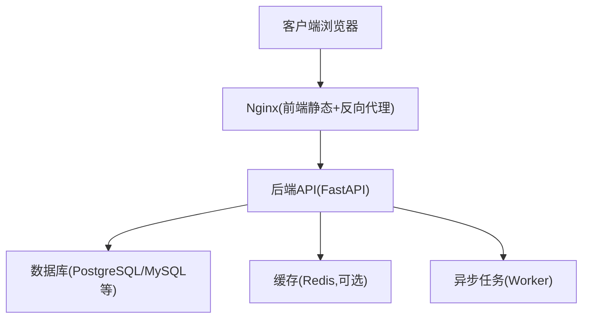
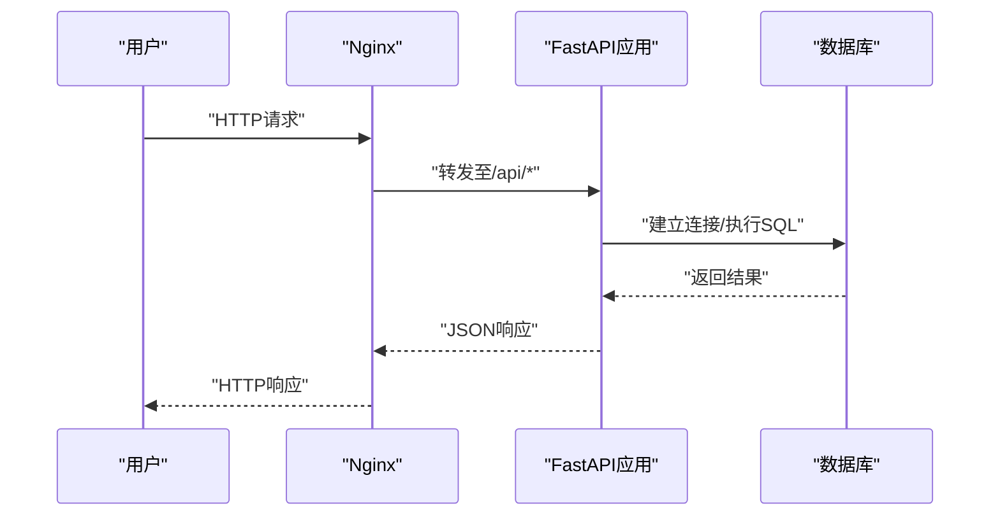
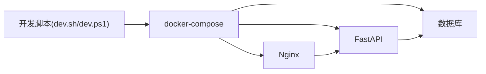

# 故障排查

<cite>
**本文引用的文件**   
- [docker-compose.yml](file://docker-compose.yml)
- [backend/app/main.py](file://backend/app/main.py)
- [backend/app/core/config.py](file://backend/app/core/config.py)
- [backend/alembic.ini](file://backend/alembic.ini)
- [backend/alembic/env.py](file://backend/alembic/env.py)
- [backend/app/db.py](file://backend/app/db.py)
- [frontend/nginx.conf](file://frontend/nginx.conf)
- [dev.sh](file://dev.sh)
- [dev.ps1](file://dev.ps1)
</cite>

## 目录
1. [简介](#简介)
2. [项目结构](#项目结构)
3. [核心组件](#核心组件)
4. [架构总览](#架构总览)
5. [详细组件分析](#详细组件分析)
6. [依赖关系分析](#依赖关系分析)
7. [性能注意事项](#性能注意事项)
8. [故障排查指南](#故障排查指南)
9. [结论](#结论)
10. [附录](#附录)

## 简介
本指南面向Talos平台的安装、部署与运维人员，聚焦常见问题的定位与解决。内容覆盖端口冲突、权限问题、依赖缺失、数据库连接与迁移失败、日志查看与分析、性能诊断（CPU、内存、慢查询）、网络连接（DNS、防火墙、SSL）、监控告警配置与解读、备份恢复与灾难恢复流程，以及社区支持与问题反馈渠道。文档以仓库中的实际配置文件和代码为依据，提供可操作的步骤与排错思路。

## 项目结构
Talos采用前后端分离与容器化部署：
- 后端：FastAPI应用、Alembic数据迁移、异步任务工作进程
- 前端：Vue/Vite构建产物由Nginx静态托管并反向代理到后端
- 编排：docker-compose统一启动各服务（后端、数据库、缓存等）

图表来源
- [docker-compose.yml](file://docker-compose.yml)
- [frontend/nginx.conf](file://frontend/nginx.conf)
- [backend/app/main.py](file://backend/app/main.py)

章节来源
- [docker-compose.yml](file://docker-compose.yml)
- [frontend/nginx.conf](file://frontend/nginx.conf)
- [backend/app/main.py](file://backend/app/main.py)

## 核心组件
- 后端入口与路由：FastAPI主应用加载配置、注册路由、中间件与生命周期钩子
- 配置中心：集中管理数据库连接、密钥、外部服务地址等环境变量
- 数据库层：连接池、会话管理、迁移脚本执行
- 迁移系统：Alembic版本管理与数据变更
- 反向代理：Nginx负责静态资源与API转发、HTTPS终止
- 编排：docker-compose定义服务、网络、卷、健康检查与重启策略

章节来源
- [backend/app/main.py](file://backend/app/main.py)
- [backend/app/core/config.py](file://backend/app/core/config.py)
- [backend/app/db.py](file://backend/app/db.py)
- [backend/alembic.ini](file://backend/alembic.ini)
- [backend/alembic/env.py](file://backend/alembic/env.py)
- [frontend/nginx.conf](file://frontend/nginx.conf)
- [docker-compose.yml](file://docker-compose.yml)

## 架构总览
下图展示请求从浏览器到后端再到数据库的完整路径，以及Nginx的反向代理作用。

图表来源
- [frontend/nginx.conf](file://frontend/nginx.conf)
- [backend/app/main.py](file://backend/app/main.py)
- [backend/app/db.py](file://backend/app/db.py)

## 详细组件分析

### 后端应用与配置
- 应用启动时读取配置，初始化数据库连接、路由与中间件
- 关键配置项包括数据库URL、JWT密钥、跨域设置、日志级别等
- 异常处理与错误码在API层统一返回，便于前端与运维识别

章节来源
- [backend/app/main.py](file://backend/app/main.py)
- [backend/app/core/config.py](file://backend/app/core/config.py)

### 数据库连接与迁移
- 连接参数通过配置注入，支持连接池与重试
- Alembic用于管理数据库模式变更，env.py中定义引擎与目标元数据
- 常见问题：连接超时、认证失败、迁移锁、版本不一致

章节来源
- [backend/app/db.py](file://backend/app/db.py)
- [backend/alembic.ini](file://backend/alembic.ini)
- [backend/alembic/env.py](file://backend/alembic/env.py)

### Nginx反向代理与静态资源
- 将前端静态资源与API请求分离，提升性能与安全性
- HTTPS证书挂载、上游服务转发、超时与缓冲参数影响稳定性

章节来源
- [frontend/nginx.conf](file://frontend/nginx.conf)

### 容器编排与服务依赖
- docker-compose定义服务间网络、卷挂载、环境变量与健康检查
- 服务启动顺序与依赖关系直接影响可用性

章节来源
- [docker-compose.yml](file://docker-compose.yml)

## 依赖关系分析
- 后端依赖数据库、缓存（可选）、消息队列（可选）
- Nginx依赖后端API服务与静态资源目录
- 开发脚本提供一键启动与调试能力

图表来源
- [docker-compose.yml](file://docker-compose.yml)
- [dev.sh](file://dev.sh)
- [dev.ps1](file://dev.ps1)

章节来源
- [docker-compose.yml](file://docker-compose.yml)
- [dev.sh](file://dev.sh)
- [dev.ps1](file://dev.ps1)

## 性能注意事项
- 数据库连接池大小与超时时间需根据负载调优
- Nginx的worker进程数、缓冲区与超时参数影响并发与延迟
- 后端日志级别在生产环境建议设置为INFO或WARNING，避免过多DEBUG输出
- 使用数据库慢查询日志与APM工具定位热点SQL与瓶颈接口

[本节为通用指导，不直接分析具体文件]

## 故障排查指南

### 安装与部署问题
- 端口冲突
  - 现象：服务无法启动或访问被拒绝
  - 排查：检查docker-compose端口映射、宿主机端口占用；确认Nginx监听端口未被占用
  - 解决：修改端口映射或释放冲突端口；验证容器内服务对外暴露端口
- 权限问题
  - 现象：写入日志或数据目录失败、容器启动报错
  - 排查：检查卷挂载路径权限、用户UID/GID一致性
  - 解决：调整目录权限或使用相同运行用户；确保只读卷不被写入
- 依赖缺失
  - 现象：应用启动失败、模块导入错误
  - 排查：检查requirements与镜像构建过程；确认环境变量是否齐全
  - 解决：补齐依赖包、重新构建镜像；校验环境变量注入

章节来源
- [docker-compose.yml](file://docker-compose.yml)
- [frontend/nginx.conf](file://frontend/nginx.conf)
- [backend/app/core/config.py](file://backend/app/core/config.py)

### 数据库连接与迁移失败
- 连接失败
  - 现象：应用启动时报连接错误或超时
  - 排查：核对数据库URL、用户名密码、主机名与端口；检查数据库服务状态与网络连通性
  - 解决：修正连接参数；确保数据库服务已就绪且允许远程连接
- 迁移失败
  - 现象：Alembic升级失败、版本不一致或锁未释放
  - 排查：查看迁移日志；检查alembic_version表；确认当前分支与迁移脚本一致
  - 解决：回滚到稳定版本后重新升级；清理锁文件；必要时手动修复版本记录
- 连接池耗尽
  - 现象：高并发下出现连接超时或请求堆积
  - 排查：观察数据库连接数与等待队列；检查是否有长事务或未关闭连接
  - 解决：增大连接池上限、优化SQL与事务范围、增加超时与重试策略

章节来源
- [backend/app/db.py](file://backend/app/db.py)
- [backend/alembic.ini](file://backend/alembic.ini)
- [backend/alembic/env.py](file://backend/alembic/env.py)

### 日志查看与分析
- 应用日志
  - 位置：容器标准输出或挂载的日志卷；可通过docker logs查看
  - 关键信息：错误堆栈、请求ID、耗时、数据库操作与异常码
- 数据库日志
  - 位置：数据库容器日志或持久化目录；开启慢查询日志定位性能问题
  - 关键信息：慢查询SQL、锁等待、连接数峰值
- Nginx日志
  - 位置：容器内的access.log与error.log；可通过docker logs或挂载卷查看
  - 关键信息：上游5xx错误、超时、SSL握手失败、域名解析失败

章节来源
- [frontend/nginx.conf](file://frontend/nginx.conf)
- [backend/app/main.py](file://backend/app/main.py)
- [docker-compose.yml](file://docker-compose.yml)

### 性能问题诊断
- CPU占用过高
  - 方法：使用top/htop或容器监控查看进程CPU；定位热点接口与SQL
  - 优化：索引优化、分页与限流、减少同步阻塞调用
- 内存泄漏
  - 方法：监控RSS与GC行为；抓取堆快照分析对象增长
  - 优化：避免大对象常驻内存、及时释放资源、限制请求体大小
- 慢查询分析
  - 方法：开启慢查询日志，结合EXPLAIN分析执行计划
  - 优化：添加合适索引、改写JOIN与子查询、避免全表扫描

[本节为通用指导，不直接分析具体文件]

### 网络连接问题
- DNS解析失败
  - 现象：域名无法解析导致连接失败
  - 排查：在容器内执行nslookup或dig；检查DNS服务器配置
  - 解决：修正DNS配置或使用IP直连；确保容器网络可达
- 防火墙与安全组
  - 现象：端口不通或服务不可达
  - 排查：检查宿主机与云平台安全组规则；确认端口放行
  - 解决：开放必要端口（如80/443/后端端口）；最小化原则配置
- SSL证书问题
  - 现象：HTTPS握手失败或证书过期
  - 排查：查看Nginx错误日志；检查证书链与有效期
  - 解决：更新证书；确保域名与证书匹配；正确配置CA链

章节来源
- [frontend/nginx.conf](file://frontend/nginx.conf)
- [docker-compose.yml](file://docker-compose.yml)

### 监控告警配置与解读
- 指标采集
  - 后端：暴露Prometheus指标端点（如适用），采集QPS、错误率、延迟分位
  - 数据库：连接数、慢查询、锁等待、I/O吞吐
  - Nginx：请求量、上游错误率、带宽与连接数
- 告警规则
  - 阈值设定：错误率超过阈值、延迟P95升高、数据库连接池耗尽
  - 通知渠道：邮件、企业微信、Slack等
- 看板与追踪
  - 使用Grafana可视化指标；结合分布式追踪定位链路瓶颈

[本节为通用指导，不直接分析具体文件]

### 备份恢复与灾难恢复
- 数据备份
  - 数据库：定期逻辑或物理备份；保留多版本与异地副本
  - 文件与配置：静态资源、证书、配置文件纳入备份
- 恢复流程
  - 停止写入服务；恢复数据与配置；验证完整性；逐步恢复服务
- 演练与预案
  - 定期进行恢复演练；制定RTO/RPO目标；完善回滚策略

[本节为通用指导，不直接分析具体文件]

### 社区支持与问题反馈
- 提交Issue：描述环境、复现步骤、日志与期望结果
- 参与讨论：加入社区频道，分享经验与最佳实践
- 贡献代码：遵循贡献规范，提交PR并附测试用例

[本节为通用指导，不直接分析具体文件]

## 结论
通过系统化排查与标准化流程，可快速定位并解决Talos平台在部署、运行与演进过程中的常见问题。建议结合日志、监控与演练，持续优化稳定性与性能。

## 附录
- 常用命令
  - 查看服务日志：docker logs <服务名>
  - 进入容器：docker exec -it <容器名> /bin/sh
  - 重启服务：docker-compose restart <服务名>
- 参考脚本
  - 开发启动：dev.sh、dev.ps1

章节来源
- [dev.sh](file://dev.sh)
- [dev.ps1](file://dev.ps1)
- [docker-compose.yml](file://docker-compose.yml)