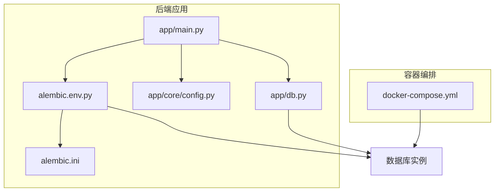
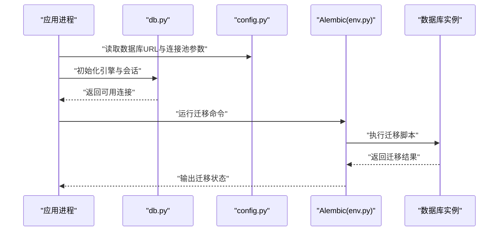
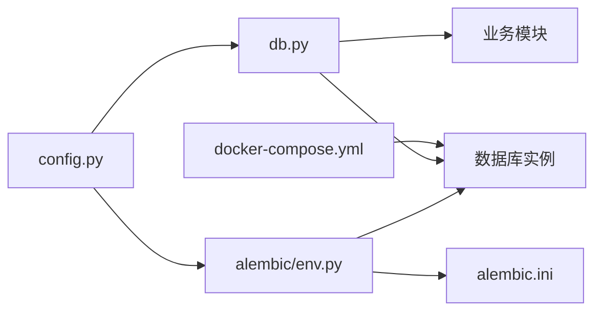

# 数据库问题

<cite>
**本文引用的文件**   
- [backend/app/db.py](file://backend/app/db.py)
- [backend/alembic.ini](file://backend/alembic.ini)
- [backend/alembic/env.py](file://backend/alembic/env.py)
- [backend/app/core/config.py](file://backend/app/core/config.py)
- [docker-compose.yml](file://docker-compose.yml)
</cite>

## 目录
1. [简介](#简介)
2. [项目结构](#项目结构)
3. [核心组件](#核心组件)
4. [架构总览](#架构总览)
5. [详细组件分析](#详细组件分析)
6. [依赖关系分析](#依赖关系分析)
7. [性能注意事项](#性能注意事项)
8. [故障排查指南](#故障排查指南)
9. [结论](#结论)
10. [附录](#附录)

## 简介
本指南面向Talos平台在生产与测试环境中遇到的数据库相关问题，聚焦以下主题：
- 连接池问题的诊断与修复（连接数限制、超时、泄漏）
- 数据迁移失败的恢复流程（版本回滚、一致性检查、脚本修复）
- 慢查询分析与优化（EXPLAIN、索引重建、查询重写）
- 数据备份与恢复（全量、增量、灾难恢复）
- 数据库性能监控配置（慢查询日志、锁等待、空间使用）
- 数据损坏修复与一致性校验方法

本指南以代码级事实为依据，结合通用最佳实践，提供可操作的步骤与图示。

## 项目结构
后端采用FastAPI + Alembic进行数据模型与迁移管理，数据库连接与引擎配置集中在应用层模块中；容器编排通过docker-compose统一管理服务与数据库实例。

图表来源
- [backend/app/db.py](file://backend/app/db.py)
- [backend/alembic/env.py](file://backend/alembic/env.py)
- [backend/alembic.ini](file://backend/alembic.ini)
- [backend/app/core/config.py](file://backend/app/core/config.py)
- [docker-compose.yml](file://docker-compose.yml)

章节来源
- [backend/app/db.py](file://backend/app/db.py)
- [backend/alembic/env.py](file://backend/alembic/env.py)
- [backend/alembic.ini](file://backend/alembic.ini)
- [backend/app/core/config.py](file://backend/app/core/config.py)
- [docker-compose.yml](file://docker-compose.yml)

## 核心组件
- 数据库连接与引擎：负责创建SQLAlchemy引擎、会话工厂、连接池参数与生命周期管理。
- 迁移系统：Alembic环境初始化、迁移脚本执行、版本控制与回滚。
- 配置中心：集中读取数据库URL、连接池大小、超时等关键参数。
- 容器编排：定义数据库服务、环境变量、端口映射与卷挂载，影响连接行为与持久化。

章节来源
- [backend/app/db.py](file://backend/app/db.py)
- [backend/alembic/env.py](file://backend/alembic/env.py)
- [backend/alembic.ini](file://backend/alembic.ini)
- [backend/app/core/config.py](file://backend/app/core/config.py)
- [docker-compose.yml](file://docker-compose.yml)

## 架构总览
下图展示从应用启动到数据库连接的典型路径，以及迁移执行的入口点。

图表来源
- [backend/app/db.py](file://backend/app/db.py)
- [backend/app/core/config.py](file://backend/app/core/config.py)
- [backend/alembic/env.py](file://backend/alembic/env.py)

## 详细组件分析

### 数据库连接与连接池（db.py）
- 职责
  - 构建SQLAlchemy引擎并设置连接池参数（如最大连接数、超时、回收策略）。
  - 提供会话工厂，确保请求级事务的开启与提交/回滚。
  - 处理连接异常与重试逻辑，避免瞬时失败导致服务不可用。
- 常见问题定位
  - 连接数耗尽：检查最大连接数配置是否低于并发峰值；观察数据库侧的最大连接限制。
  - 连接超时：调整连接获取超时与语句执行超时；确认网络延迟与数据库负载。
  - 连接泄漏：确保每个请求都正确关闭会话；在异常分支也进行清理。
- 建议优化
  - 根据并发与数据库能力合理设置pool_size与max_overflow。
  - 启用连接健康检查（如ping），缩短失效连接发现时间。
  - 对长事务进行拆分，减少连接占用时长。

章节来源
- [backend/app/db.py](file://backend/app/db.py)

### 迁移系统与版本管理（env.py, alembic.ini）
- 职责
  - 初始化Alembic环境，加载数据库URL与目标元数据。
  - 执行up/down迁移，记录版本历史，支持批量回滚。
  - 通过alembic.ini指定脚本目录、版本存储位置等。
- 失败恢复流程
  - 识别失败阶段：查看迁移日志与错误堆栈，定位具体脚本。
  - 安全回滚：按版本逐步down至稳定点，验证数据一致性。
  - 修复脚本：修正DDL/DML后重新执行up，必要时加入幂等性保护。
  - 一致性检查：核对表结构、约束、序列与默认值是否符合预期。
- 最佳实践
  - 迁移脚本保持幂等与可重入，避免重复执行破坏数据。
  - 大表变更分批次执行，降低锁竞争与回滚成本。
  - 在预生产环境充分演练迁移与回滚流程。

章节来源
- [backend/alembic/env.py](file://backend/alembic/env.py)
- [backend/alembic.ini](file://backend/alembic.ini)

### 配置中心（config.py）
- 职责
  - 统一读取数据库连接字符串、连接池大小、超时、SSL等参数。
  - 为db.py与Alembic提供一致的配置来源，便于环境隔离。
- 关键项
  - DATABASE_URL：包含协议、主机、端口、库名、用户与密码。
  - POOL_SIZE/MAX_OVERFLOW：控制连接池容量与溢出上限。
  - CONNECT_TIMEOUT/STATEMENT_TIMEOUT：控制连接与语句超时。
- 建议
  - 将敏感信息放入环境变量或密钥管理服务。
  - 不同环境（开发/测试/生产）使用独立配置文件或变量前缀。

章节来源
- [backend/app/core/config.py](file://backend/app/core/config.py)

### 容器编排（docker-compose.yml）
- 职责
  - 定义数据库服务镜像、端口映射、环境变量与数据卷。
  - 管理应用与数据库的网络连通性与重启策略。
- 影响点
  - 端口暴露与防火墙规则决定外部访问能力。
  - 数据卷挂载决定持久化与备份策略。
  - 资源限制（CPU/内存）影响数据库性能与连接稳定性。

章节来源
- [docker-compose.yml](file://docker-compose.yml)

## 依赖关系分析
- 应用依赖配置中心获取数据库连接参数。
- db.py基于配置创建引擎与会话，供业务模块使用。
- Alembic通过env.py读取配置并执行迁移脚本。
- docker-compose协调应用与数据库的运行环境与网络。

图表来源
- [backend/app/core/config.py](file://backend/app/core/config.py)
- [backend/app/db.py](file://backend/app/db.py)
- [backend/alembic/env.py](file://backend/alembic/env.py)
- [backend/alembic.ini](file://backend/alembic.ini)
- [docker-compose.yml](file://docker-compose.yml)

## 性能注意事项
- 连接池调优
  - 评估并发峰值与平均查询耗时，设定合理的pool_size与max_overflow。
  - 避免长事务持有连接过久，必要时拆分为短事务。
- 查询优化
  - 使用EXPLAIN分析执行计划，关注全表扫描、临时表与文件排序。
  - 针对高频过滤与JOIN字段建立合适索引，定期统计与重建。
  - 重写复杂子查询为JOIN或CTE，减少中间结果集。
- 监控与告警
  - 开启慢查询日志，设定阈值并定期分析Top N慢查询。
  - 监控锁等待与死锁事件，及时定位阻塞源。
  - 跟踪表空间与索引增长，规划扩容与归档策略。

[本节为通用指导，不直接分析具体文件]

## 故障排查指南

### 连接池问题诊断与解决
- 症状
  - 应用报错“无法获取连接”或“连接池耗尽”。
  - 请求响应变慢，出现大量超时。
- 排查步骤
  - 检查当前活跃连接数与最大连接限制。
  - 审查连接获取与释放路径，确认无未关闭会话。
  - 分析慢查询与长事务，定位占用连接的重型操作。
- 解决方案
  - 调整连接池参数（pool_size、max_overflow、超时）。
  - 增加数据库最大连接数或横向扩展只读副本。
  - 引入连接健康检查与自动重试机制。

章节来源
- [backend/app/db.py](file://backend/app/db.py)
- [backend/app/core/config.py](file://backend/app/core/config.py)

### 数据迁移失败恢复流程
- 常见原因
  - 脚本语法错误、约束冲突、数据不一致、权限不足。
- 恢复步骤
  - 停止新写入，锁定受影响对象。
  - 回滚至最近稳定版本，验证数据完整性。
  - 修复迁移脚本，补充幂等性保护与条件判断。
  - 在预生产环境复测通过后，再在生产执行。
- 一致性检查
  - 对比迁移前后表结构、约束、序列与默认值。
  - 抽样校验关键字段的数据范围与关联关系。

章节来源
- [backend/alembic/env.py](file://backend/alembic/env.py)
- [backend/alembic.ini](file://backend/alembic.ini)

### 慢查询分析与优化
- 分析方法
  - 使用EXPLAIN/AutoExplain查看执行计划，识别瓶颈。
  - 收集慢查询日志，按耗时与频率排序。
- 优化手段
  - 为高频过滤、排序与JOIN字段添加或重建索引。
  - 重写低效SQL，避免SELECT *、隐式类型转换与函数包裹列。
  - 分页与分批处理大数据集，减少单次负载。
- 验证与回归
  - 在测试环境验证优化效果，确保业务语义不变。
  - 上线后持续监控指标，防止退化。

章节来源
- [backend/app/db.py](file://backend/app/db.py)

### 数据备份与恢复
- 全量备份
  - 定期导出完整数据库快照，保留多份历史版本。
  - 校验备份完整性与可恢复性。
- 增量备份
  - 启用WAL/二进制日志，按时间点恢复。
  - 制定RPO/RTO目标，设计恢复演练计划。
- 灾难恢复
  - 准备异地容灾与快速切换流程。
  - 明确恢复顺序与依赖关系，最小化停机时间。

[本节为通用指导，不直接分析具体文件]

### 性能监控配置
- 慢查询日志
  - 开启并设置阈值，定期导出与分析Top N。
- 锁等待监控
  - 采集锁等待队列与阻塞链，定位热点行与长事务。
- 空间使用监控
  - 跟踪表与索引大小增长趋势，预警磁盘压力。
- 工具与仪表
  - 使用数据库内置视图与第三方监控集成，形成看板与告警。

[本节为通用指导，不直接分析具体文件]

### 数据损坏修复与一致性校验
- 检测
  - 扫描索引与表的一致性，修复损坏页或索引。
  - 校验外键约束与引用完整性。
- 修复
  - 使用官方修复工具或重建受损对象。
  - 从可靠备份恢复受损部分，避免二次损坏。
- 校验
  - 对关键字段进行哈希比对与抽样校验。
  - 建立周期性一致性任务，持续保障数据质量。

[本节为通用指导，不直接分析具体文件]

## 结论
通过对连接池、迁移系统、配置与容器编排的系统性分析，结合慢查询优化、备份恢复与监控配置的最佳实践，可显著提升Talos平台的数据库稳定性与可维护性。建议在预生产环境充分演练各类故障场景，完善SOP与自动化脚本，确保快速定位与恢复。

[本节为总结性内容，不直接分析具体文件]

## 附录
- 常用命令参考（示例）
  - 查看连接池状态与活动会话
  - 执行迁移与回滚
  - 开启慢查询日志与分析Top N
  - 备份与恢复流程命令
- 相关文档链接
  - SQLAlchemy连接池文档
  - Alembic迁移指南
  - 数据库性能调优手册

[本节为补充信息，不直接分析具体文件]