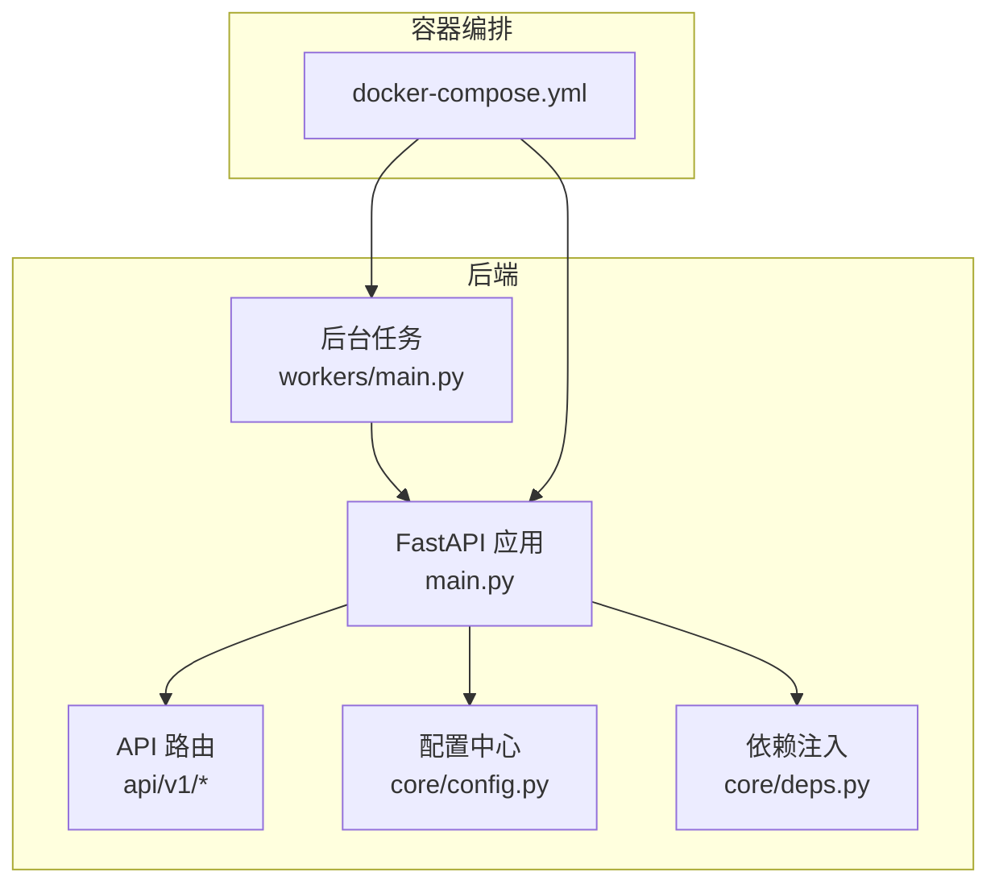
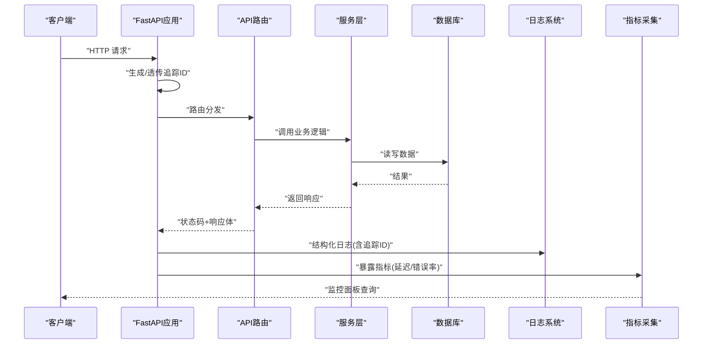
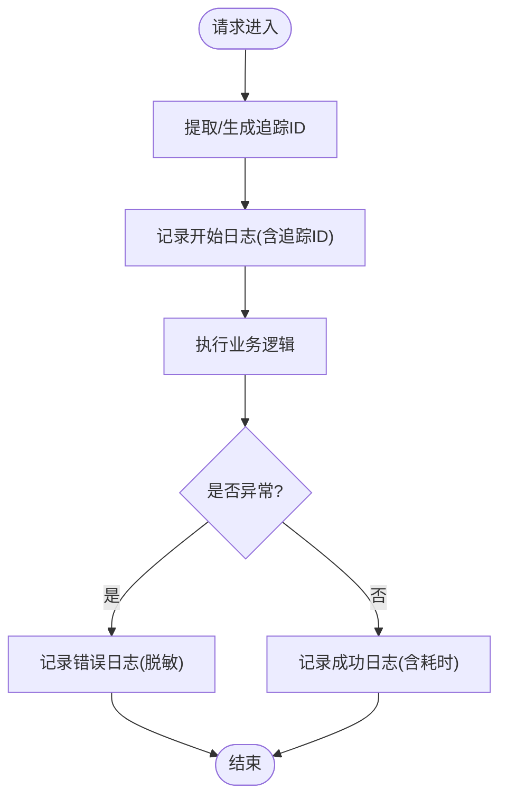
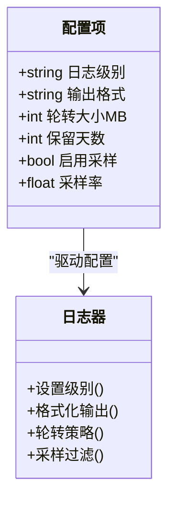
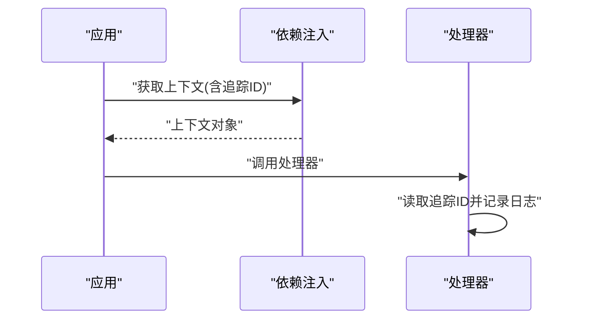
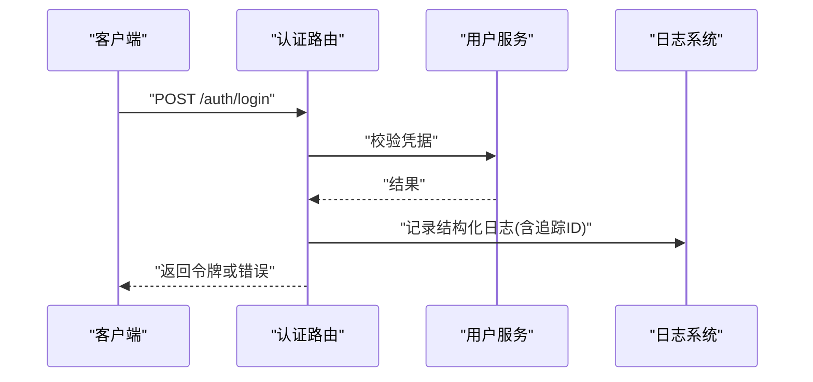
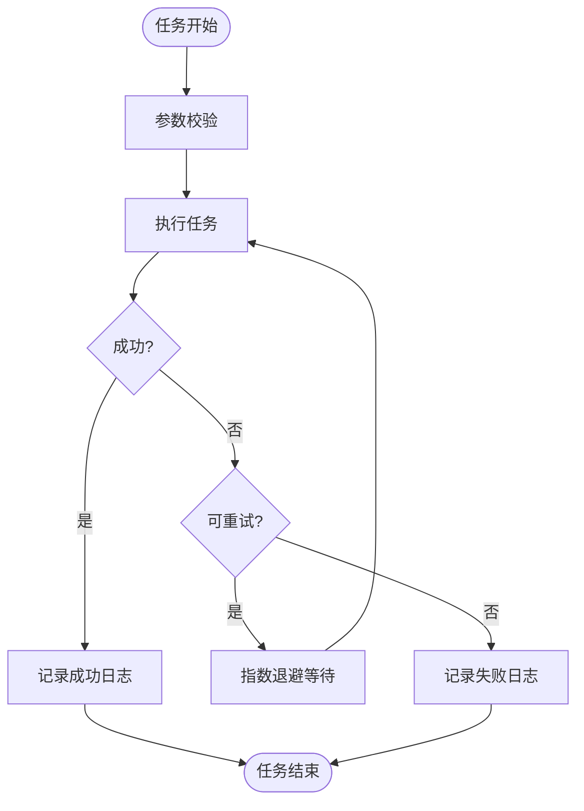
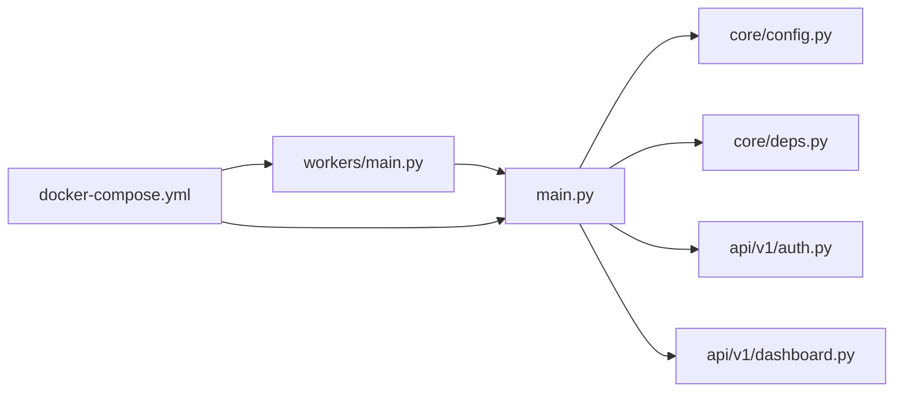

# 日志监控

<cite>
**本文引用的文件**   
- [backend/app/main.py](file://backend/app/main.py)
- [backend/app/core/config.py](file://backend/app/core/config.py)
- [backend/app/core/deps.py](file://backend/app/core/deps.py)
- [backend/app/api/v1/auth.py](file://backend/app/api/v1/auth.py)
- [backend/app/api/v1/dashboard.py](file://backend/app/api/v1/dashboard.py)
- [backend/app/workers/main.py](file://backend/app/workers/main.py)
- [docker-compose.yml](file://docker-compose.yml)
</cite>

## 目录
1. [简介](#简介)
2. [项目结构](#项目结构)
3. [核心组件](#核心组件)
4. [架构总览](#架构总览)
5. [详细组件分析](#详细组件分析)
6. [依赖关系分析](#依赖关系分析)
7. [性能考虑](#性能考虑)
8. [故障排查指南](#故障排查指南)
9. [结论](#结论)
10. [附录](#附录)

## 简介
本指南面向Talos平台的日志与监控实践，覆盖后端应用日志配置与管理、结构化日志规范、日志收集与分析工具集成（ELK Stack、Prometheus、Grafana）、关键监控指标定义与告警规则、日志搜索与定位技巧，以及日志安全与敏感信息脱敏。文档基于仓库中的后端FastAPI应用、工作进程与容器编排配置进行梳理，并提供可操作的落地建议。

## 项目结构
Talos平台采用前后端分离架构：
- 后端：Python FastAPI应用，包含API路由、服务层、数据模型、数据库迁移与工作进程。
- 前端：Vue + TypeScript，通过API与后端交互。
- 容器编排：使用docker-compose统一编排后端、前端与可能的监控/日志组件。

**图表来源** 
- [backend/app/main.py](file://backend/app/main.py)
- [backend/app/core/config.py](file://backend/app/core/config.py)
- [backend/app/core/deps.py](file://backend/app/core/deps.py)
- [backend/app/workers/main.py](file://backend/app/workers/main.py)
- [docker-compose.yml](file://docker-compose.yml)

**章节来源**
- [backend/app/main.py](file://backend/app/main.py)
- [backend/app/core/config.py](file://backend/app/core/config.py)
- [backend/app/core/deps.py](file://backend/app/core/deps.py)
- [backend/app/workers/main.py](file://backend/app/workers/main.py)
- [docker-compose.yml](file://docker-compose.yml)

## 核心组件
- 应用入口与中间件：FastAPI应用初始化、请求生命周期钩子、异常处理与日志记录。
- 配置管理：集中化环境变量与运行时配置，支撑日志级别、输出格式、采样率等开关。
- 依赖注入：数据库连接、外部服务客户端的创建与销毁，便于在请求上下文中注入追踪ID。
- API路由：各业务模块的请求处理，统一结构化日志输出与错误码标准化。
- 工作进程：异步任务执行，独立日志流与错误上报。

**章节来源**
- [backend/app/main.py](file://backend/app/main.py)
- [backend/app/core/config.py](file://backend/app/core/config.py)
- [backend/app/core/deps.py](file://backend/app/core/deps.py)
- [backend/app/api/v1/auth.py](file://backend/app/api/v1/auth.py)
- [backend/app/api/v1/dashboard.py](file://backend/app/api/v1/dashboard.py)
- [backend/app/workers/main.py](file://backend/app/workers/main.py)

## 架构总览
下图展示从HTTP请求到日志输出的端到端流程，包括追踪ID生成、结构化日志写入、指标采集与告警联动。

**图表来源** 
- [backend/app/main.py](file://backend/app/main.py)
- [backend/app/api/v1/auth.py](file://backend/app/api/v1/auth.py)
- [backend/app/api/v1/dashboard.py](file://backend/app/api/v1/dashboard.py)
- [backend/app/core/deps.py](file://backend/app/core/deps.py)

## 详细组件分析

### 应用入口与中间件（日志与追踪）
- 请求生命周期：在进入请求时生成或提取追踪ID，附加到上下文；在响应阶段记录耗时、状态码与关键路径信息。
- 异常处理：捕获未处理异常，输出结构化错误日志，避免堆栈泄露敏感信息。
- 健康检查：提供健康探针接口，便于编排系统与监控平台探测服务可用性。

**图表来源** 
- [backend/app/main.py](file://backend/app/main.py)

**章节来源**
- [backend/app/main.py](file://backend/app/main.py)

### 配置管理（日志级别、输出格式、轮转）
- 日志级别：通过环境变量控制根日志器与各模块级别，支持调试、信息、警告、错误等级别切换。
- 输出格式：统一JSON结构化输出，包含时间戳、级别、模块、消息、追踪ID、用户标识、请求ID等字段。
- 日志轮转：按大小或时间切分，保留固定周期与数量，避免磁盘占满。
- 采样策略：在高吞吐场景下对DEBUG/INFO级别进行采样，降低IO压力。

**图表来源** 
- [backend/app/core/config.py](file://backend/app/core/config.py)

**章节来源**
- [backend/app/core/config.py](file://backend/app/core/config.py)

### 依赖注入（追踪ID与上下文）
- 追踪ID注入：在请求开始时注入追踪ID，供后续所有组件读取并写入日志。
- 资源管理：数据库连接、缓存客户端等在请求生命周期内创建与释放，确保日志中可关联资源ID。
- 上下文隔离：每个请求独立的上下文，避免并发污染。

**图表来源** 
- [backend/app/core/deps.py](file://backend/app/core/deps.py)

**章节来源**
- [backend/app/core/deps.py](file://backend/app/core/deps.py)

### API路由（结构化日志与错误标准化）
- 认证路由：记录登录尝试、失败原因、IP与用户代理，遵循最小必要原则，避免记录密码等敏感信息。
- 仪表盘路由：记录查询条件、返回条数、耗时，便于性能分析与容量规划。
- 错误标准化：统一错误码、错误消息模板，便于前端提示与监控告警。

**图表来源** 
- [backend/app/api/v1/auth.py](file://backend/app/api/v1/auth.py)
- [backend/app/api/v1/dashboard.py](file://backend/app/api/v1/dashboard.py)

**章节来源**
- [backend/app/api/v1/auth.py](file://backend/app/api/v1/auth.py)
- [backend/app/api/v1/dashboard.py](file://backend/app/api/v1/dashboard.py)

### 工作进程（异步任务日志）
- 任务调度：接收队列任务，执行耗时操作，记录任务ID、输入摘要、执行状态与耗时。
- 错误重试：对可重试错误进行指数退避重试，记录重试次数与最终失败原因。
- 资源清理：任务完成后释放临时资源，避免泄漏。

**图表来源** 
- [backend/app/workers/main.py](file://backend/app/workers/main.py)

**章节来源**
- [backend/app/workers/main.py](file://backend/app/workers/main.py)

## 依赖关系分析
- 应用入口依赖配置与依赖注入模块，API路由依赖服务层与数据库。
- 工作进程与应用共享配置与日志器，但拥有独立的执行上下文。
- 容器编排统一管理环境变量与服务间通信，便于集中式日志与指标采集。

**图表来源** 
- [backend/app/main.py](file://backend/app/main.py)
- [backend/app/core/config.py](file://backend/app/core/config.py)
- [backend/app/core/deps.py](file://backend/app/core/deps.py)
- [backend/app/api/v1/auth.py](file://backend/app/api/v1/auth.py)
- [backend/app/api/v1/dashboard.py](file://backend/app/api/v1/dashboard.py)
- [backend/app/workers/main.py](file://backend/app/workers/main.py)
- [docker-compose.yml](file://docker-compose.yml)

**章节来源**
- [backend/app/main.py](file://backend/app/main.py)
- [backend/app/core/config.py](file://backend/app/core/config.py)
- [backend/app/core/deps.py](file://backend/app/core/deps.py)
- [backend/app/api/v1/auth.py](file://backend/app/api/v1/auth.py)
- [backend/app/api/v1/dashboard.py](file://backend/app/api/v1/dashboard.py)
- [backend/app/workers/main.py](file://backend/app/workers/main.py)
- [docker-compose.yml](file://docker-compose.yml)

## 性能考虑
- 日志级别与采样：生产环境默认INFO级别，对DEBUG/INFO进行采样，减少IO开销。
- 结构化输出：使用JSON格式，避免字符串拼接，提升解析效率。
- 异步写入：将日志写入改为异步队列，降低请求阻塞。
- 指标采集：使用轻量级指标库，避免频繁GC与锁竞争。
- 资源限制：为日志与指标组件设置合理的内存与CPU限制，防止影响主业务。

[本节为通用指导，不直接分析具体文件]

## 故障排查指南
- 快速定位：通过追踪ID在多个服务与组件间串联日志，缩小问题范围。
- 正则与多条件：结合时间范围、级别、模块、追踪ID进行组合查询，提高检索效率。
- 错误标准化：统一错误码与消息模板，便于自动化告警与统计。
- 脱敏验证：检查日志中是否包含密码、密钥、个人身份信息，必要时增加脱敏过滤器。
- 健康探针：通过健康检查接口确认服务状态，结合指标面板观察异常趋势。

**章节来源**
- [backend/app/api/v1/auth.py](file://backend/app/api/v1/auth.py)
- [backend/app/api/v1/dashboard.py](file://backend/app/api/v1/dashboard.py)
- [backend/app/workers/main.py](file://backend/app/workers/main.py)

## 结论
通过统一的日志配置、结构化输出、追踪ID贯穿与指标采集，Talos平台可实现高效的日志管理与监控。结合ELK Stack、Prometheus与Grafana，能够构建完整的可观测性体系，支撑故障快速定位与性能优化。建议在开发阶段即落实日志规范与脱敏策略，在生产环境持续优化采样与轮转策略，保障系统稳定性与安全性。

[本节为总结性内容，不直接分析具体文件]

## 附录

### 结构化日志字段规范
- 基础字段：时间戳、级别、模块、消息、追踪ID、用户标识、请求ID、版本。
- 业务字段：操作类型、资源ID、状态码、耗时、错误码、错误消息。
- 安全字段：IP地址、用户代理、来源区域（可选），禁止记录敏感信息。

### 日志轮转与保留策略
- 按大小轮转：单文件最大N MB，保留M个历史文件。
- 按时间轮转：每日或每小时切分，保留N天。
- 压缩归档：对过期日志进行压缩存储，降低空间占用。

### ELK Stack集成要点
- Filebeat采集：部署Filebeat收集容器stdout/stderr，转发至Logstash或Elasticsearch。
- Logstash处理：解析JSON、添加字段、脱敏敏感信息。
- Elasticsearch索引：按日期分片，设置映射与保留策略。
- Kibana可视化：创建仪表板与告警规则，支持追踪ID检索。

### Prometheus与Grafana集成要点
- 指标暴露：在FastAPI应用中暴露/metrics端点，采集延迟、错误率、QPS等。
- 抓取配置：Prometheus定期抓取指标，设置合理抓取间隔。
- Grafana仪表板：展示系统资源、应用性能、业务指标，配置阈值告警。

### 告警规则示例
- 错误率超过阈值：如5分钟内错误率>5%触发告警。
- 响应时间P95过高：如P95>2秒持续5分钟触发告警。
- 资源使用过高：如CPU>80%、内存>90%持续5分钟触发告警。
- 业务指标异常：如订单失败率>1%触发告警。

### 日志搜索技巧
- 正则表达式：用于匹配特定模式，如错误堆栈、异常类型。
- 多条件组合：级别、模块、追踪ID、时间范围联合查询。
- 时间筛选：选择最近1小时、24小时或自定义时间段。
- 聚合统计：按模块、错误码、用户维度统计日志分布。

### 敏感信息脱敏
- 自动脱敏：对密码、密钥、身份证号、手机号等进行掩码替换。
- 白名单机制：允许特定字段不被脱敏，需严格审批。
- 审计日志：记录脱敏策略变更与访问行为。

[本节为通用指导，不直接分析具体文件]