# 网络连接问题

<cite>
**本文引用的文件**
- [docker-compose.yml](file://docker-compose.yml)
- [backend/app/main.py](file://backend/app/main.py)
- [backend/app/core/config.py](file://backend/app/core/config.py)
- [frontend/nginx.conf](file://frontend/nginx.conf)
- [frontend/vite.config.ts](file://frontend/vite.config.ts)
- [frontend/src/api/client.ts](file://frontend/src/api/client.ts)
</cite>

## 目录
1. [简介](#简介)
2. [项目结构](#项目结构)
3. [核心组件](#核心组件)
4. [架构总览](#架构总览)
5. [详细组件分析](#详细组件分析)
6. [依赖关系分析](#依赖关系分析)
7. [性能考虑](#性能考虑)
8. [故障排查指南](#故障排查指南)
9. [结论](#结论)
10. [附录](#附录)

## 简介
本指南面向Talos平台在生产与开发环境中的网络连接问题，聚焦跨域访问（CORS）、HTTPS/SSL证书、防火墙与安全组、DNS解析、网络抓包与流量分析、延迟与丢包监控等主题。文档结合仓库中的后端服务、前端构建与Nginx配置、容器编排文件进行系统性说明，提供从现象到根因的排查路径与可操作建议。

## 项目结构
Talos采用前后端分离架构：
- 后端：FastAPI应用，暴露REST API，运行于容器内。
- 前端：Vue/Vite构建产物，由Nginx静态托管，并通过反向代理转发至后端API。
- 容器编排：通过docker-compose统一启动前后端及相关依赖。

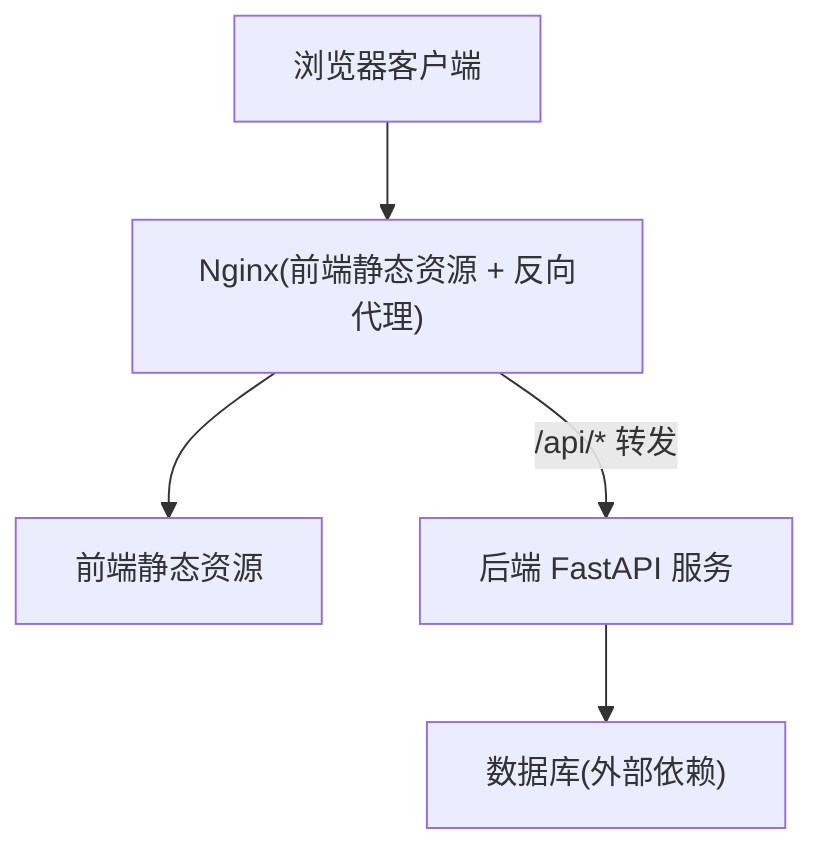

**图示来源**
- [docker-compose.yml](file://docker-compose.yml)
- [frontend/nginx.conf](file://frontend/nginx.conf)
- [backend/app/main.py](file://backend/app/main.py)

**章节来源**
- [docker-compose.yml](file://docker-compose.yml)
- [frontend/nginx.conf](file://frontend/nginx.conf)
- [backend/app/main.py](file://backend/app/main.py)

## 核心组件
- 后端服务（FastAPI）：负责业务API实现、安全策略、配置加载。
- 前端构建与代理（Vite/Nginx）：开发期本地代理、生产期静态资源与反向代理。
- 容器编排（Docker Compose）：端口映射、环境变量、服务间通信。

关键职责与网络相关点：
- CORS策略在后端启用与配置，决定浏览器跨域请求是否放行。
- Nginx作为反向代理，处理HTTPS终止、请求头透传、跨域响应头补充。
- Vite开发服务器用于本地调试，需正确配置代理以绕过同源限制。
- docker-compose定义服务端口、网络隔离与域名解析（内部DNS）。

**章节来源**
- [backend/app/main.py](file://backend/app/main.py)
- [backend/app/core/config.py](file://backend/app/core/config.py)
- [frontend/nginx.conf](file://frontend/nginx.conf)
- [frontend/vite.config.ts](file://frontend/vite.config.ts)
- [docker-compose.yml](file://docker-compose.yml)

## 架构总览
下图展示典型部署下的请求链路：浏览器访问Nginx，Nginx返回前端静态资源或转发API请求到后端；后端根据配置启用CORS并返回响应。

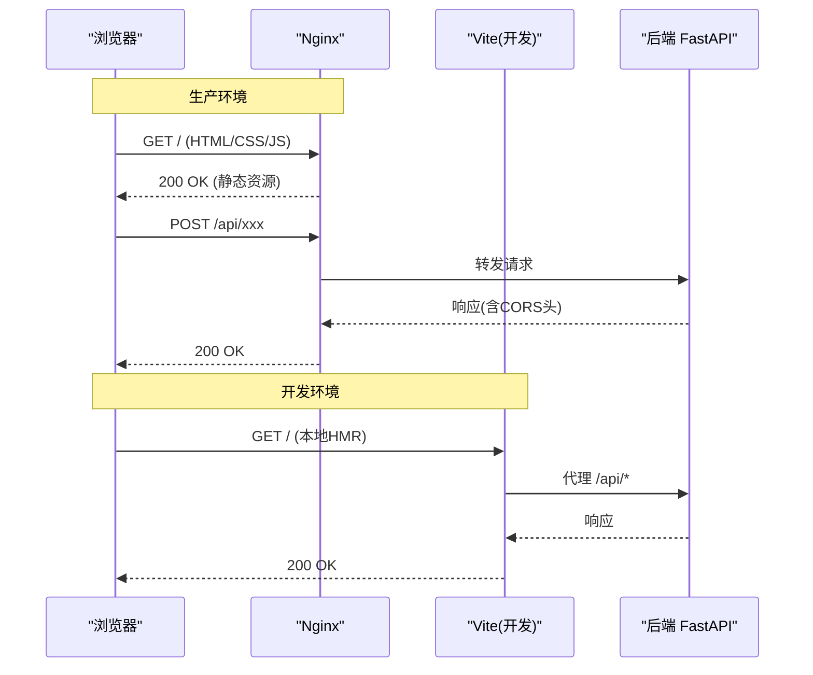

**图示来源**
- [frontend/nginx.conf](file://frontend/nginx.conf)
- [frontend/vite.config.ts](file://frontend/vite.config.ts)
- [backend/app/main.py](file://backend/app/main.py)

## 详细组件分析

### 后端FastAPI服务与CORS
- 作用：定义API路由、加载配置、启用CORS中间件，控制允许的来源、方法与头部。
- 常见问题：
  - 未启用CORS导致浏览器拦截跨域请求。
  - 允许的源列表不包含实际前端域名或协议+端口组合。
  - 预检请求OPTIONS未被正确处理。
- 排查要点：
  - 检查CORS配置项是否包含前端域名、协议与端口。
  - 确认请求方法、自定义头部在允许列表中。
  - 验证响应头中Access-Control-Allow-*是否正确设置。

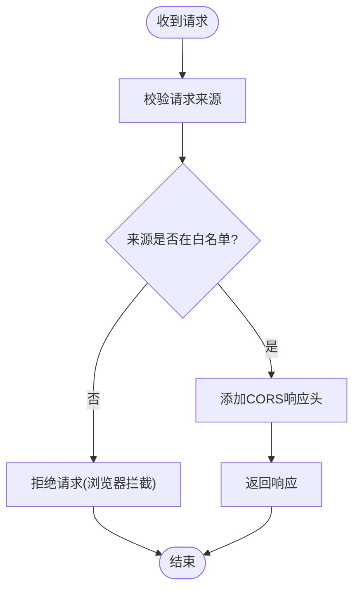

**图示来源**
- [backend/app/main.py](file://backend/app/main.py)
- [backend/app/core/config.py](file://backend/app/core/config.py)

**章节来源**
- [backend/app/main.py](file://backend/app/main.py)
- [backend/app/core/config.py](file://backend/app/core/config.py)

### Nginx反向代理与HTTPS
- 作用：对外提供HTTPS入口，终止TLS，将/api请求转发至后端；同时可补充必要的响应头。
- 常见问题：
  - HTTPS证书过期或域名不匹配。
  - 代理转发时丢失Host/X-Forwarded-*头导致后端鉴权失败。
  - 未开启必要的HTTP/2或TLS版本过旧。
- 排查要点：
  - 检查证书链完整性与有效期。
  - 确认proxy_pass目标地址与端口正确。
  - 验证proxy_set_header透传的头部字段。

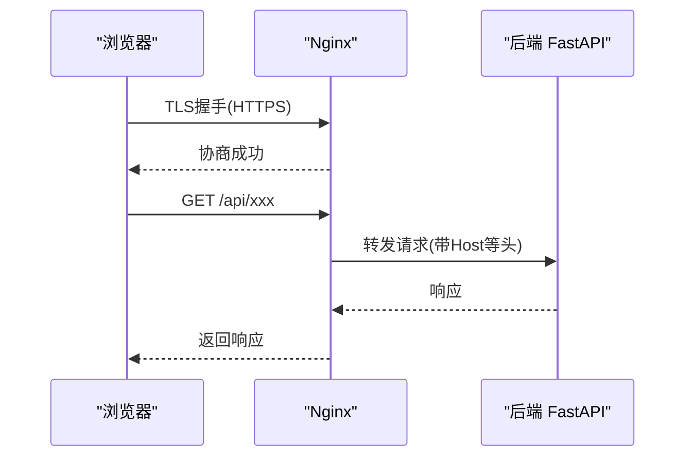

**图示来源**
- [frontend/nginx.conf](file://frontend/nginx.conf)

**章节来源**
- [frontend/nginx.conf](file://frontend/nginx.conf)

### Vite开发代理
- 作用：开发期将/api请求代理到后端，避免跨域问题。
- 常见问题：
  - 代理目标地址错误（端口/主机名）。
  - 未保留必要请求头。
- 排查要点：
  - 检查devServer.proxy配置的目标URL。
  - 确保前端页面访问的是开发服务器而非直接访问后端。

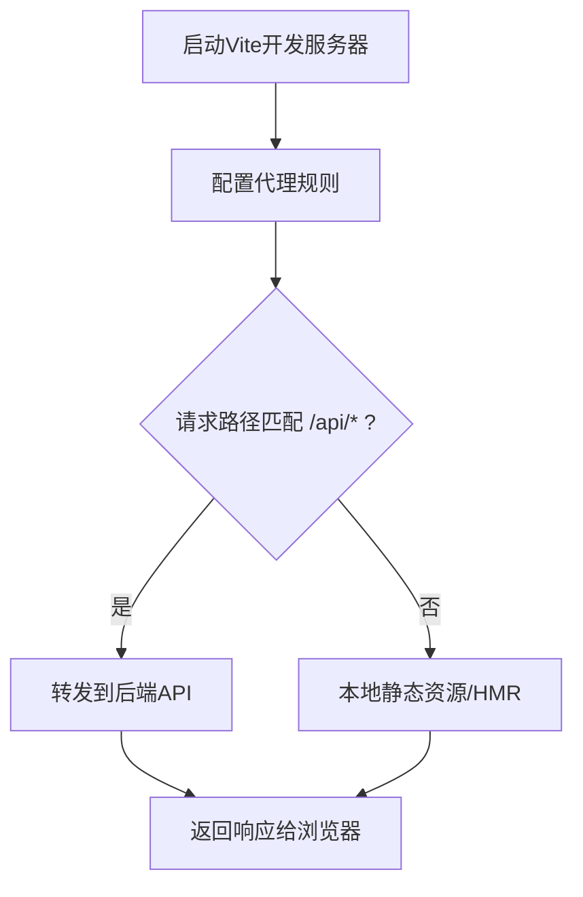

**图示来源**
- [frontend/vite.config.ts](file://frontend/vite.config.ts)

**章节来源**
- [frontend/vite.config.ts](file://frontend/vite.config.ts)

### 前端API客户端
- 作用：封装HTTP调用，设置基础URL、超时、认证头等。
- 常见问题：
  - 基础URL指向错误（开发/生产不一致）。
  - 未携带必要认证头导致后端拒绝。
- 排查要点：
  - 检查client初始化时的baseURL与环境变量。
  - 确认请求拦截器是否正确附加令牌。

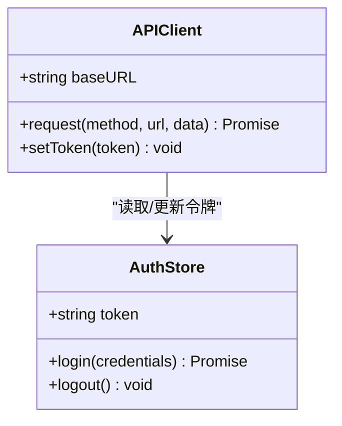

**图示来源**
- [frontend/src/api/client.ts](file://frontend/src/api/client.ts)

**章节来源**
- [frontend/src/api/client.ts](file://frontend/src/api/client.ts)

### Docker Compose编排
- 作用：定义服务、端口映射、环境变量、网络与依赖关系。
- 常见问题：
  - 端口冲突或未映射导致外部不可达。
  - 服务间网络隔离导致无法解析彼此名称。
  - 环境变量缺失导致后端CORS或代理配置异常。
- 排查要点：
  - 检查ports映射与服务端口一致性。
  - 确认depends_on与healthcheck顺序。
  - 验证环境变量注入到各服务。

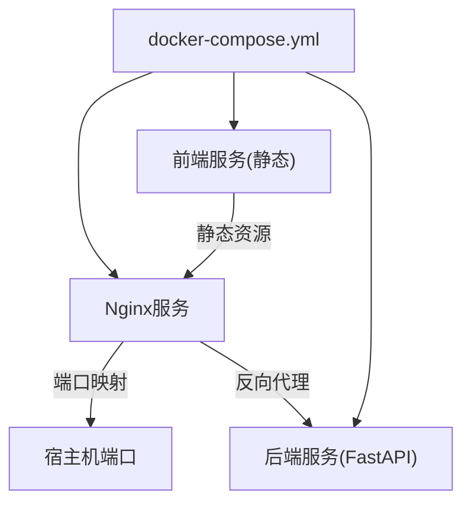

**图示来源**
- [docker-compose.yml](file://docker-compose.yml)

**章节来源**
- [docker-compose.yml](file://docker-compose.yml)

## 依赖关系分析
- 前端依赖Nginx进行静态资源托管与反向代理。
- 后端依赖配置模块加载CORS与运行时参数。
- 容器编排统一管理服务生命周期与网络拓扑。

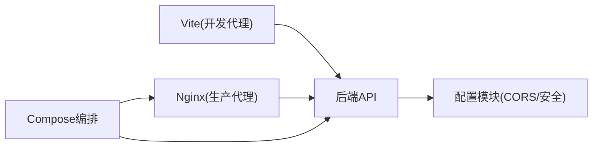

**图示来源**
- [frontend/vite.config.ts](file://frontend/vite.config.ts)
- [frontend/nginx.conf](file://frontend/nginx.conf)
- [backend/app/core/config.py](file://backend/app/core/config.py)
- [docker-compose.yml](file://docker-compose.yml)

**章节来源**
- [frontend/vite.config.ts](file://frontend/vite.config.ts)
- [frontend/nginx.conf](file://frontend/nginx.conf)
- [backend/app/core/config.py](file://backend/app/core/config.py)
- [docker-compose.yml](file://docker-compose.yml)

## 性能考虑
- 合理设置CORS白名单，避免不必要的预检请求。
- 使用HTTP/2与TLS优化握手时间。
- 对静态资源启用缓存与压缩。
- 后端接口限流与连接池管理，避免雪崩。

[本节为通用指导，无需特定文件引用]

## 故障排查指南

### 跨域访问（CORS）问题诊断与解决
- 现象：浏览器控制台出现“跨域”错误或预检失败。
- 步骤：
  - 确认前端访问域名、协议与端口与后端CORS白名单一致。
  - 检查请求方法与自定义头部是否在允许范围内。
  - 查看响应头是否包含正确的Access-Control-Allow-*。
  - 若使用Nginx，确保未覆盖后端CORS头。
  - 开发期使用Vite代理避免跨域。

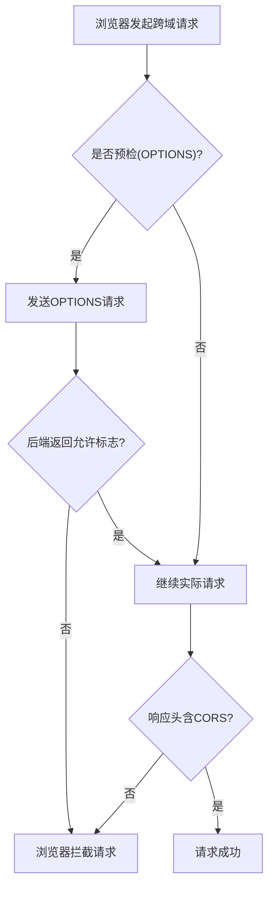

**图示来源**
- [backend/app/main.py](file://backend/app/main.py)
- [backend/app/core/config.py](file://backend/app/core/config.py)
- [frontend/nginx.conf](file://frontend/nginx.conf)

**章节来源**
- [backend/app/main.py](file://backend/app/main.py)
- [backend/app/core/config.py](file://backend/app/core/config.py)
- [frontend/nginx.conf](file://frontend/nginx.conf)

### HTTPS与SSL证书问题排查
- 现象：浏览器提示证书无效、域名不匹配或加密协议错误。
- 步骤：
  - 检查证书有效期与完整链。
  - 确认Nginx配置的server_name与实际访问域名一致。
  - 验证TLS版本与密码套件兼容性。
  - 检查证书文件路径与权限。
  - 使用浏览器开发者工具查看握手过程。

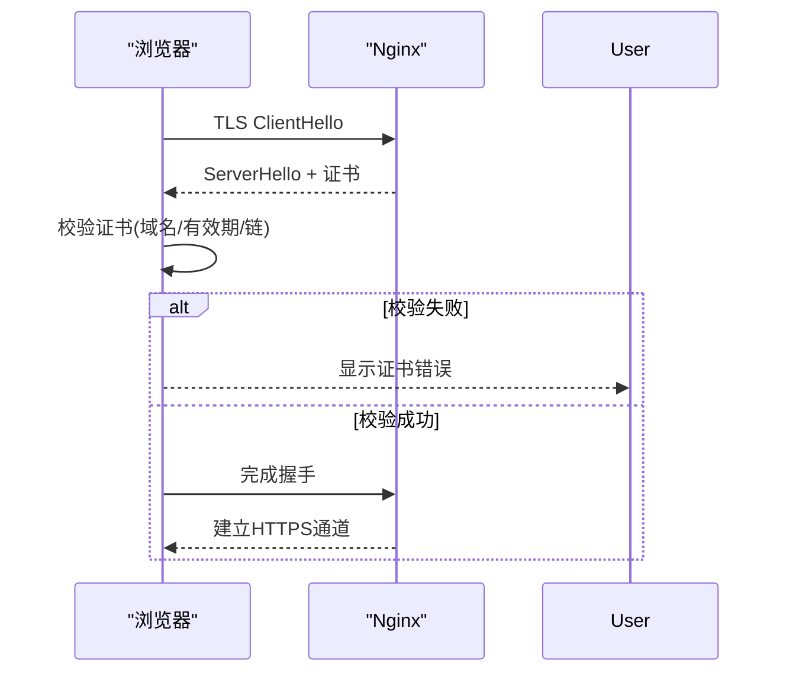

**图示来源**
- [frontend/nginx.conf](file://frontend/nginx.conf)

**章节来源**
- [frontend/nginx.conf](file://frontend/nginx.conf)

### 防火墙与安全组规则检查
- 现象：外部无法访问服务或端口不通。
- 步骤：
  - 检查系统防火墙（如iptables/firewalld）是否放行端口。
  - 检查云服务商安全组入站规则是否开放对应端口。
  - 确认容器端口映射与宿主端口一致。
  - 验证网络隔离策略（子网ACL、NAT）。

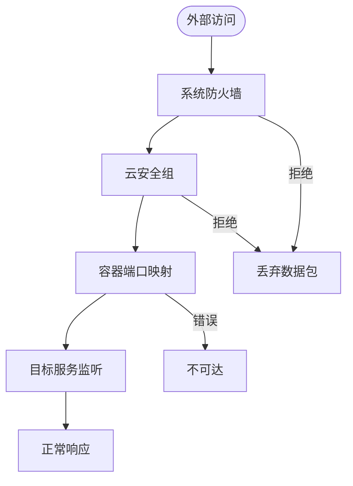

[本节为通用指导，无需特定文件引用]

### DNS解析问题诊断
- 现象：域名无法解析或解析延迟高。
- 步骤：
  - 使用nslookup/dig/host检查记录类型与权威服务器。
  - 检查CDN与负载均衡器的CNAME/A记录。
  - 验证本地hosts或系统DNS缓存。
  - 观察解析耗时与重试行为。

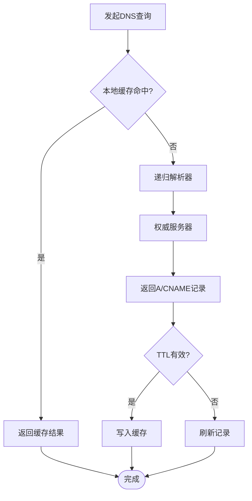

[本节为通用指导，无需特定文件引用]

### 网络抓包与流量分析
- 工具：Wireshark、tcpdump。
- 常用命令与过滤：
  - tcpdump抓取指定端口：tcp port 80 or tcp port 443。
  - 过滤特定IP：host 192.168.1.100。
  - 仅捕获HTTP请求：http.request。
  - 导出pcap供Wireshark分析。
- 分析要点：
  - 观察TCP三次握手与TLS握手过程。
  - 检查重传与RTT变化。
  - 定位丢包与乱序。

[本节为通用指导，无需特定文件引用]

### 网络延迟与丢包率监控
- 指标：RTT、抖动、丢包率、带宽利用率。
- 方法：
  - ping/traceroute检测连通性与路径。
  - mtr综合测试延迟与丢包。
  - 使用APM或网络探针采集端到端指标。
  - 结合日志分析请求耗时分布。

[本节为通用指导，无需特定文件引用]

## 结论
通过对Talos平台的CORS、HTTPS、防火墙、DNS、抓包与延迟监控的系统化排查，能够快速定位并解决大多数网络连接问题。建议在开发与生产环境均建立完善的网络观测与告警机制，确保问题早发现、早恢复。

[本节为总结性内容，无需特定文件引用]

## 附录
- 常见错误码与含义：参考浏览器开发者工具与后端日志。
- 最佳实践：
  - 最小化CORS白名单，严格校验来源。
  - 使用现代TLS版本与强密码套件。
  - 统一代理与证书管理，避免多套配置。
  - 定期演练故障场景，完善应急预案。

[本节为补充信息，无需特定文件引用]