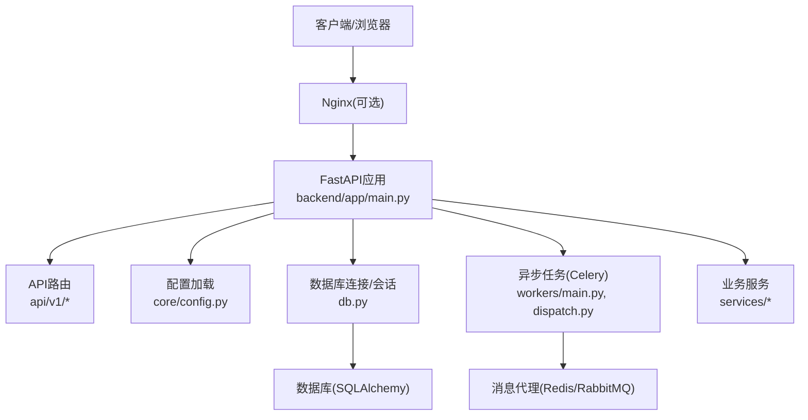
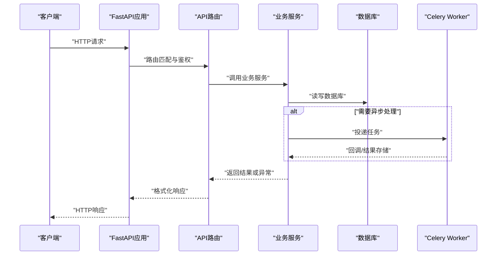
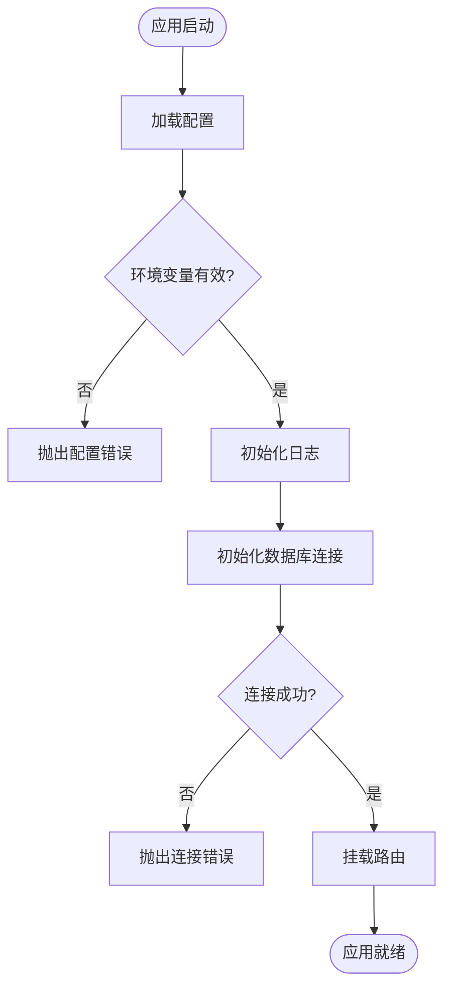
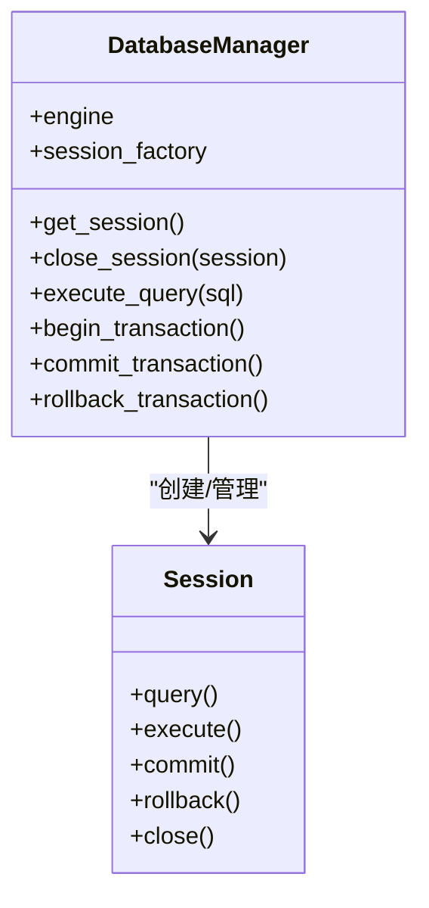
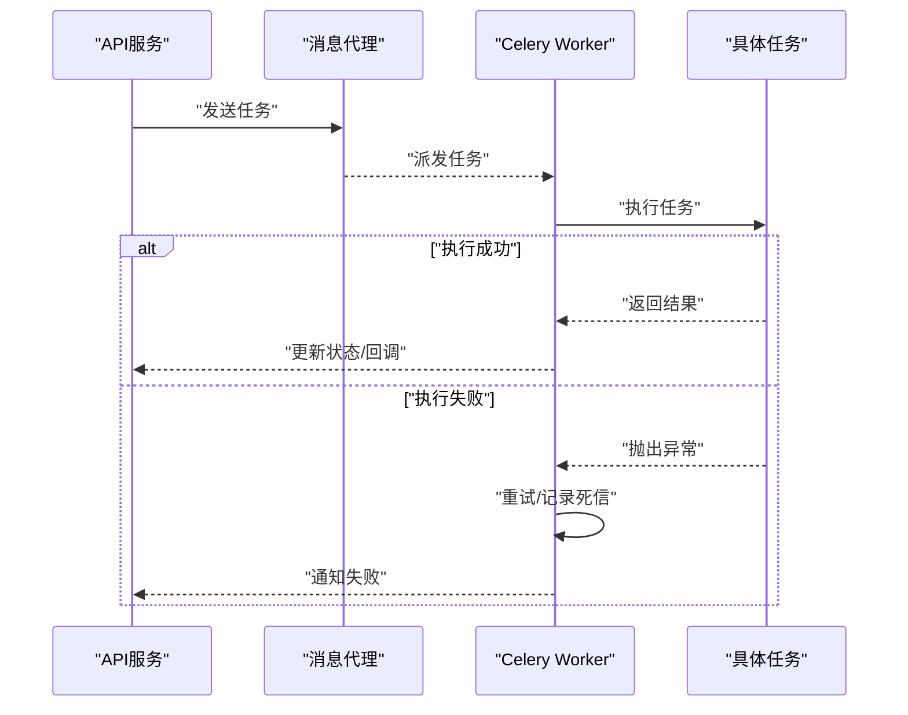
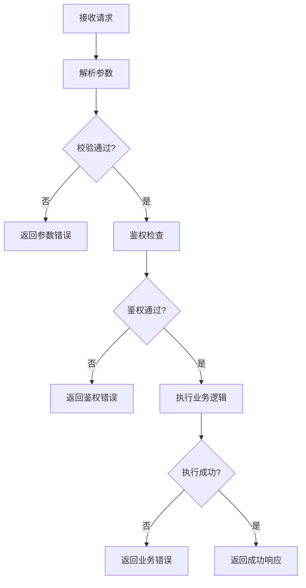
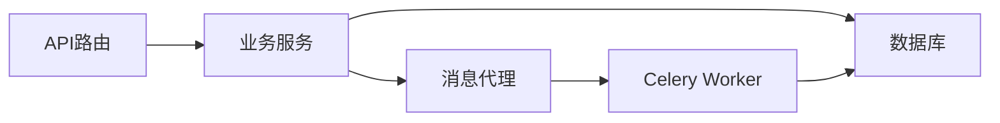

# 运行时错误

<cite>
**本文引用的文件**   
- [backend/app/main.py](file://backend/app/main.py)
- [backend/app/core/config.py](file://backend/app/core/config.py)
- [backend/app/db.py](file://backend/app/db.py)
- [backend/app/workers/main.py](file://backend/app/workers/main.py)
- [backend/app/workers/dispatch.py](file://backend/app/workers/dispatch.py)
- [backend/app/api/v1/auth.py](file://backend/app/api/v1/auth.py)
- [backend/app/api/v1/users.py](file://backend/app/api/v1/users.py)
- [backend/app/api/v1/assets.py](file://backend/app/api/v1/assets.py)
- [backend/app/api/v1/reports.py](file://backend/app/api/v1/reports.py)
- [backend/app/services/report_builder.py](file://backend/app/services/report_builder.py)
- [backend/app/services/exporter.py](file://backend/app/services/exporter.py)
- [backend/app/schemas.py](file://backend/app/schemas.py)
- [docker-compose.yml](file://docker-compose.yml)
- [dev.sh](file://dev.sh)
- [backend/requirements.txt](file://backend/requirements.txt)
</cite>

## 目录
1. [简介](#简介)
2. [项目结构](#项目结构)
3. [核心组件](#核心组件)
4. [架构总览](#架构总览)
5. [详细组件分析](#详细组件分析)
6. [依赖关系分析](#依赖关系分析)
7. [性能与稳定性考量](#性能与稳定性考量)
8. [故障排查指南](#故障排查指南)
9. [结论](#结论)
10. [附录](#附录)

## 简介
本指南面向Talos平台后端运行时的常见错误，提供系统化的诊断与排障方法。内容覆盖应用启动失败、模块导入错误、配置加载失败、服务依赖缺失、数据库连接问题（连接池耗尽、查询超时、事务锁等待）、异步任务执行失败（Celery worker状态、队列积压、内存溢出）、API请求处理异常（参数校验失败、业务逻辑错误、第三方调用异常），以及内存泄漏检测与CPU占用过高的分析方法，并包含热重载与开发模式下的调试技巧。

## 项目结构
后端采用FastAPI作为Web框架，Alembic进行数据库迁移，SQLAlchemy管理ORM与连接池，Celery负责异步任务。前端为Vue+Vite，通过Nginx反向代理与后端API通信。关键入口与职责如下：
- 应用入口与生命周期：后端主程序初始化、中间件注册、路由挂载
- 配置中心：环境变量与运行时配置加载
- 数据层：数据库连接、会话管理、迁移脚本
- 异步任务：Celery Worker与任务调度
- API层：REST接口定义、参数校验、业务编排
- 服务层：报告生成、导出等重计算或I/O密集型逻辑

**图示来源** 
- [backend/app/main.py](file://backend/app/main.py)
- [backend/app/core/config.py](file://backend/app/core/config.py)
- [backend/app/db.py](file://backend/app/db.py)
- [backend/app/workers/main.py](file://backend/app/workers/main.py)
- [backend/app/workers/dispatch.py](file://backend/app/workers/dispatch.py)
- [backend/app/api/v1/auth.py](file://backend/app/api/v1/auth.py)
- [backend/app/api/v1/users.py](file://backend/app/api/v1/users.py)
- [backend/app/api/v1/assets.py](file://backend/app/api/v1/assets.py)
- [backend/app/api/v1/reports.py](file://backend/app/api/v1/reports.py)
- [backend/app/services/report_builder.py](file://backend/app/services/report_builder.py)
- [backend/app/services/exporter.py](file://backend/app/services/exporter.py)

**章节来源**
- [backend/app/main.py](file://backend/app/main.py)
- [backend/app/core/config.py](file://backend/app/core/config.py)
- [backend/app/db.py](file://backend/app/db.py)
- [backend/app/workers/main.py](file://backend/app/workers/main.py)
- [backend/app/workers/dispatch.py](file://backend/app/workers/dispatch.py)
- [backend/app/api/v1/auth.py](file://backend/app/api/v1/auth.py)
- [backend/app/api/v1/users.py](file://backend/app/api/v1/users.py)
- [backend/app/api/v1/assets.py](file://backend/app/api/v1/assets.py)
- [backend/app/api/v1/reports.py](file://backend/app/api/v1/reports.py)
- [backend/app/services/report_builder.py](file://backend/app/services/report_builder.py)
- [backend/app/services/exporter.py](file://backend/app/services/exporter.py)

## 核心组件
- 应用入口与中间件：负责启动、日志、CORS、认证中间件、异常处理器、路由挂载
- 配置模块：集中读取环境变量、敏感信息、外部服务地址与连接参数
- 数据库层：连接池配置、会话生命周期、事务边界、慢查询与超时设置
- 异步任务：Celery Worker进程管理、任务分发、重试与死信队列
- API路由与校验：Pydantic模型校验、权限控制、错误码统一
- 业务服务：报告构建、导出、解析等耗时操作封装

**章节来源**
- [backend/app/main.py](file://backend/app/main.py)
- [backend/app/core/config.py](file://backend/app/core/config.py)
- [backend/app/db.py](file://backend/app/db.py)
- [backend/app/workers/main.py](file://backend/app/workers/main.py)
- [backend/app/workers/dispatch.py](file://backend/app/workers/dispatch.py)
- [backend/app/schemas.py](file://backend/app/schemas.py)

## 架构总览
下图展示一次典型API请求从进入FastAPI到数据库访问与服务调用的完整路径，以及可能的错误注入点。

**图示来源** 
- [backend/app/main.py](file://backend/app/main.py)
- [backend/app/api/v1/auth.py](file://backend/app/api/v1/auth.py)
- [backend/app/api/v1/reports.py](file://backend/app/api/v1/reports.py)
- [backend/app/services/report_builder.py](file://backend/app/services/report_builder.py)
- [backend/app/db.py](file://backend/app/db.py)
- [backend/app/workers/dispatch.py](file://backend/app/workers/dispatch.py)

## 详细组件分析

### 应用启动与配置加载
- 启动流程：加载配置、初始化日志、注册中间件、挂载路由、启动事件钩子（如数据库连接预热）
- 配置加载：从环境变量读取数据库URL、Redis/Celery Broker、JWT密钥、第三方服务端点；缺失或格式错误将导致启动失败
- 常见问题：
  - 模块导入错误：缺少依赖包、版本冲突、相对导入路径错误
  - 配置缺失：必需环境变量未设置、配置文件不可读、类型转换失败
  - 服务依赖缺失：数据库、消息代理、缓存服务未就绪

**图示来源** 
- [backend/app/main.py](file://backend/app/main.py)
- [backend/app/core/config.py](file://backend/app/core/config.py)
- [backend/app/db.py](file://backend/app/db.py)

**章节来源**
- [backend/app/main.py](file://backend/app/main.py)
- [backend/app/core/config.py](file://backend/app/core/config.py)
- [backend/app/db.py](file://backend/app/db.py)

### 数据库连接与连接池
- 连接池：基于SQLAlchemy引擎与池化策略，需合理设置最大连接数、回收时间、超时
- 会话管理：请求级会话生命周期，确保提交与关闭；避免会话泄露
- 常见问题：
  - 连接池耗尽：并发过高、长事务、未正确释放会话
  - 查询超时：慢查询、索引缺失、复杂JOIN
  - 事务锁等待：行锁/表锁竞争、长时间未提交的事务

**图示来源** 
- [backend/app/db.py](file://backend/app/db.py)

**章节来源**
- [backend/app/db.py](file://backend/app/db.py)

### 异步任务（Celery）
- Worker进程：多进程/多线程模型，任务消费与重试机制
- 任务分发：通过Broker（Redis/RabbitMQ）传递任务，支持优先级与延迟
- 常见问题：
  - Worker状态检查：进程崩溃、无可用Worker、队列堆积
  - 任务队列积压：消费者不足、任务耗时过长、资源争用
  - 内存溢出：大对象序列化、未释放引用、循环引用

**图示来源** 
- [backend/app/workers/main.py](file://backend/app/workers/main.py)
- [backend/app/workers/dispatch.py](file://backend/app/workers/dispatch.py)

**章节来源**
- [backend/app/workers/main.py](file://backend/app/workers/main.py)
- [backend/app/workers/dispatch.py](file://backend/app/workers/dispatch.py)

### API请求处理与校验
- 路由与校验：使用Pydantic模型对请求体、路径参数、查询参数进行强类型校验
- 权限与安全：JWT鉴权、角色授权、敏感字段脱敏
- 常见问题：
  - 参数验证失败：类型不匹配、必填字段缺失、枚举值非法
  - 业务逻辑错误：状态机不一致、权限不足、外部依赖异常
  - 第三方服务调用异常：网络超时、限流、证书错误

**图示来源** 
- [backend/app/api/v1/auth.py](file://backend/app/api/v1/auth.py)
- [backend/app/api/v1/users.py](file://backend/app/api/v1/users.py)
- [backend/app/api/v1/assets.py](file://backend/app/api/v1/assets.py)
- [backend/app/api/v1/reports.py](file://backend/app/api/v1/reports.py)
- [backend/app/schemas.py](file://backend/app/schemas.py)

**章节来源**
- [backend/app/api/v1/auth.py](file://backend/app/api/v1/auth.py)
- [backend/app/api/v1/users.py](file://backend/app/api/v1/users.py)
- [backend/app/api/v1/assets.py](file://backend/app/api/v1/assets.py)
- [backend/app/api/v1/reports.py](file://backend/app/api/v1/reports.py)
- [backend/app/schemas.py](file://backend/app/schemas.py)

### 业务服务（报告构建与导出）
- 报告构建：模板渲染、数据聚合、分页与流式输出
- 导出服务：文件生成、压缩、分片上传、进度跟踪
- 常见问题：
  - 内存峰值过高：一次性加载大量数据、未使用迭代器
  - I/O阻塞：同步文件写入、未使用异步I/O
  - 依赖缺失：模板库、PDF生成库未安装或版本不兼容

**章节来源**
- [backend/app/services/report_builder.py](file://backend/app/services/report_builder.py)
- [backend/app/services/exporter.py](file://backend/app/services/exporter.py)

## 依赖关系分析
- 外部依赖：数据库（PostgreSQL/MySQL）、消息代理（Redis/RabbitMQ）、缓存（Redis）、第三方API（邮件、对象存储）
- 内部依赖：API路由依赖服务层，服务层依赖数据库与会话，异步任务依赖Broker与共享状态
- 潜在循环依赖：应避免服务间互相import，使用依赖注入或事件解耦

**图示来源** 
- [backend/app/api/v1/auth.py](file://backend/app/api/v1/auth.py)
- [backend/app/api/v1/reports.py](file://backend/app/api/v1/reports.py)
- [backend/app/services/report_builder.py](file://backend/app/services/report_builder.py)
- [backend/app/db.py](file://backend/app/db.py)
- [backend/app/workers/dispatch.py](file://backend/app/workers/dispatch.py)

**章节来源**
- [backend/app/api/v1/auth.py](file://backend/app/api/v1/auth.py)
- [backend/app/api/v1/reports.py](file://backend/app/api/v1/reports.py)
- [backend/app/services/report_builder.py](file://backend/app/services/report_builder.py)
- [backend/app/db.py](file://backend/app/db.py)
- [backend/app/workers/dispatch.py](file://backend/app/workers/dispatch.py)

## 性能与稳定性考量
- 连接池调优：根据并发与查询时长调整max_overflow、pool_size、recycle
- 查询优化：添加索引、避免N+1查询、使用分页与投影
- 异步化：将耗时操作移至Celery，减少请求响应时间
- 监控与告警：记录慢查询、任务失败率、内存与CPU指标
- 弹性伸缩：水平扩展Worker与API实例，配合负载均衡

[本节为通用指导，无需特定文件来源]

## 故障排查指南

### 应用启动失败的诊断
- 模块导入错误
  - 检查依赖是否安装：确认requirements.txt中包已安装且版本兼容
  - 查看启动日志中的ImportError或ModuleNotFoundError
  - 修复相对导入路径或虚拟环境激活问题
- 配置加载失败
  - 核对必需环境变量是否设置（数据库URL、JWT密钥、Broker地址）
  - 检查配置文件权限与编码格式
  - 在启动前打印配置摘要以定位缺失项
- 服务依赖缺失
  - 确认数据库、Redis、消息代理服务可连通
  - 使用健康检查端点或手动ping测试
  - 在容器环境中检查docker-compose服务依赖顺序

**章节来源**
- [backend/app/main.py](file://backend/app/main.py)
- [backend/app/core/config.py](file://backend/app/core/config.py)
- [backend/requirements.txt](file://backend/requirements.txt)
- [docker-compose.yml](file://docker-compose.yml)

### 数据库连接问题排查
- 连接池耗尽
  - 观察连接数接近上限的警告日志
  - 检查是否存在长事务或未关闭的会话
  - 适当增大pool_size或缩短事务范围
- 查询超时
  - 启用慢查询日志，定位耗时SQL
  - 添加必要索引，优化JOIN与过滤条件
  - 使用EXPLAIN分析执行计划
- 事务锁等待
  - 查看锁等待与持有者，识别热点行
  - 拆分大事务，避免跨多个写操作
  - 使用SELECT FOR UPDATE时谨慎选择隔离级别

**章节来源**
- [backend/app/db.py](file://backend/app/db.py)

### 异步任务执行失败分析
- Celery Worker状态检查
  - 查看worker进程是否存活，日志是否有崩溃堆栈
  - 检查Broker连接是否正常，队列是否可消费
- 任务队列积压
  - 监控队列长度与消费速率，增加Worker数量
  - 优化任务粒度，避免单任务过大
  - 设置合理的重试策略与死信队列
- 内存溢出
  - 监控Worker内存使用，定位大对象或循环引用
  - 使用分块处理与流式I/O，避免一次性加载全部数据
  - 定期重启Worker防止内存碎片累积

**章节来源**
- [backend/app/workers/main.py](file://backend/app/workers/main.py)
- [backend/app/workers/dispatch.py](file://backend/app/workers/dispatch.py)

### API请求处理异常调试
- 请求参数验证失败
  - 检查Pydantic模型定义与输入数据一致性
  - 查看422错误详情，定位具体字段
  - 在前端增加表单校验以减少无效请求
- 业务逻辑错误
  - 在服务层增加详细日志，记录关键状态与输入
  - 使用断言与单元测试覆盖边界情况
  - 引入领域事件或状态机明确流转规则
- 第三方服务调用异常
  - 设置超时与重试，记录HTTP状态码与响应体
  - 实现熔断与降级策略，避免雪崩
  - 使用Mock服务进行本地调试

**章节来源**
- [backend/app/api/v1/auth.py](file://backend/app/api/v1/auth.py)
- [backend/app/api/v1/users.py](file://backend/app/api/v1/users.py)
- [backend/app/api/v1/assets.py](file://backend/app/api/v1/assets.py)
- [backend/app/api/v1/reports.py](file://backend/app/api/v1/reports.py)
- [backend/app/schemas.py](file://backend/app/schemas.py)

### 内存泄漏检测与CPU占用过高分析
- 内存泄漏检测
  - 使用tracemalloc或memory_profiler定位增长热点
  - 检查全局变量、闭包捕获、未释放的文件句柄
  - 在压测环境下观察内存曲线，识别缓慢增长
- CPU占用过高
  - 使用cProfile或py-spy分析热点函数
  - 优化算法复杂度，避免重复计算
  - 将CPU密集任务移至Worker或外部服务

[本节为通用指导，无需特定文件来源]

### 热重载与开发模式调试技巧
- 热重载
  - 使用uvicorn --reload或开发脚本自动重载代码变更
  - 注意静态资源与模板文件的刷新策略
- 开发模式
  - 开启详细日志与SQL语句打印
  - 使用pytest与工厂函数构造测试数据
  - 借助docker-compose一键拉起依赖服务

**章节来源**
- [dev.sh](file://dev.sh)
- [docker-compose.yml](file://docker-compose.yml)

## 结论
通过系统化地理解应用启动、配置加载、数据库连接、异步任务与API处理的完整链路，结合日志、监控与工具链，可以快速定位并解决Talos平台的运行时错误。建议在开发与生产环境均建立完善的错误上报与告警机制，持续优化性能与稳定性。

[本节为总结性内容，无需特定文件来源]

## 附录
- 常用命令
  - 启动应用：参考dev.sh脚本
  - 运行迁移：使用alembic命令
  - 启动Worker：celery -A workers.main worker --loglevel=info
- 关键配置文件
  - 环境变量：.env或容器环境变量
  - 依赖清单：backend/requirements.txt
  - 编排文件：docker-compose.yml

**章节来源**
- [dev.sh](file://dev.sh)
- [backend/requirements.txt](file://backend/requirements.txt)
- [docker-compose.yml](file://docker-compose.yml)