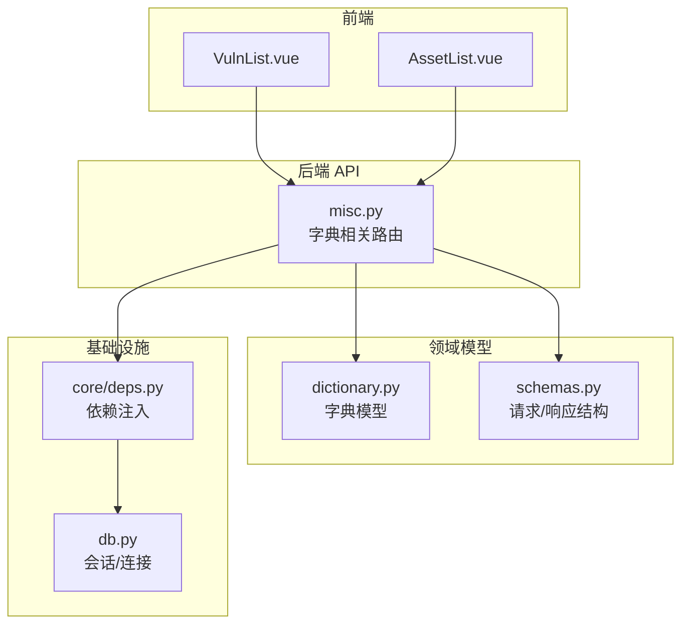
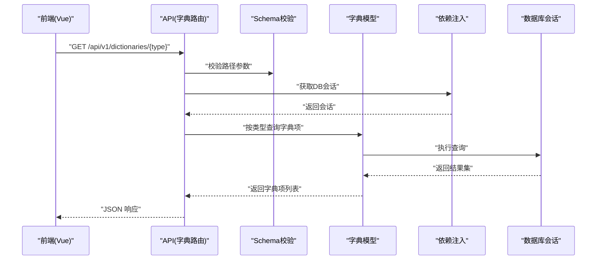
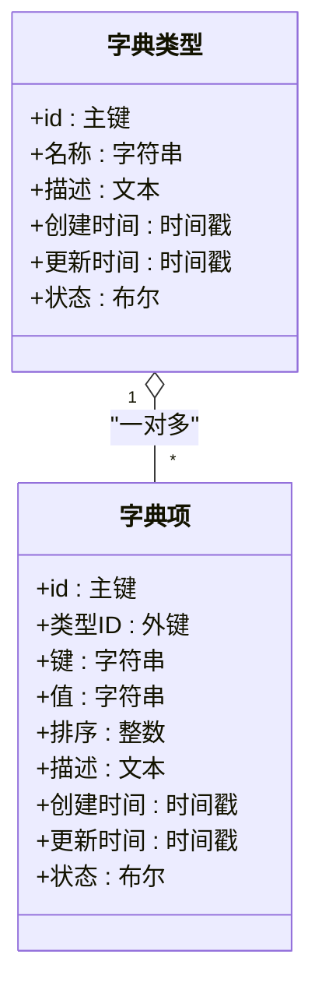
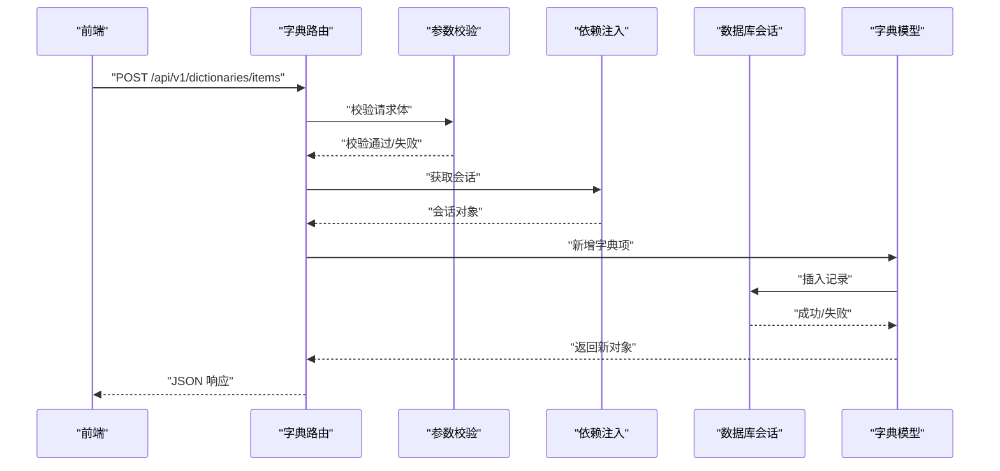
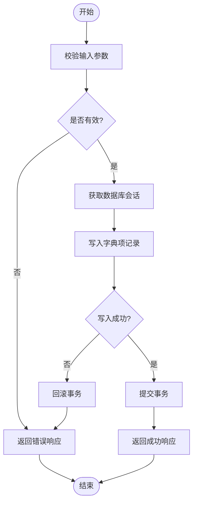
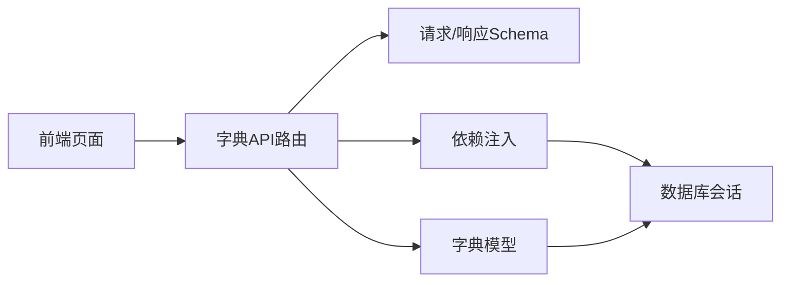

# 字典模型

<cite>
**本文引用的文件**   
- [backend/app/models/dictionary.py](file://backend/app/models/dictionary.py)
- [backend/app/api/v1/misc.py](file://backend/app/api/v1/misc.py)
- [backend/app/schemas.py](file://backend/app/schemas.py)
- [backend/app/db.py](file://backend/app/db.py)
- [backend/app/core/deps.py](file://backend/app/core/deps.py)
- [frontend/src/views/VulnList.vue](file://frontend/src/views/VulnList.vue)
- [frontend/src/views/AssetList.vue](file://frontend/src/views/AssetList.vue)
</cite>

## 目录
1. [简介](#简介)
2. [项目结构](#项目结构)
3. [核心组件](#核心组件)
4. [架构总览](#架构总览)
5. [详细组件分析](#详细组件分析)
6. [依赖分析](#依赖分析)
7. [性能考虑](#性能考虑)
8. [故障排查指南](#故障排查指南)
9. [结论](#结论)
10. [附录](#附录)

## 简介
本文件围绕“字典模型”展开，系统性梳理该功能在系统中的定位、数据模型设计、API 接口与前后端交互流程，以及常见问题的排查方法。目标是帮助开发者快速理解并正确使用字典能力，包括字典项的增删改查、字典类型管理以及在漏洞与资产等模块中的引用方式。

## 项目结构
字典模型位于后端 models 层，通过 API v1 暴露 REST 接口，前端在漏洞列表与资产列表等页面中调用相关接口以获取或维护字典数据。数据库访问由 db 层提供，依赖注入由 core/deps 统一处理。

图表来源
- [backend/app/api/v1/misc.py](file://backend/app/api/v1/misc.py)
- [backend/app/models/dictionary.py](file://backend/app/models/dictionary.py)
- [backend/app/schemas.py](file://backend/app/schemas.py)
- [backend/app/db.py](file://backend/app/db.py)
- [backend/app/core/deps.py](file://backend/app/core/deps.py)
- [frontend/src/views/VulnList.vue](file://frontend/src/views/VulnList.vue)
- [frontend/src/views/AssetList.vue](file://frontend/src/views/AssetList.vue)

章节来源
- [backend/app/models/dictionary.py](file://backend/app/models/dictionary.py)
- [backend/app/api/v1/misc.py](file://backend/app/api/v1/misc.py)
- [backend/app/schemas.py](file://backend/app/schemas.py)
- [backend/app/db.py](file://backend/app/db.py)
- [backend/app/core/deps.py](file://backend/app/core/deps.py)
- [frontend/src/views/VulnList.vue](file://frontend/src/views/VulnList.vue)
- [frontend/src/views/AssetList.vue](file://frontend/src/views/AssetList.vue)

## 核心组件
- 字典模型：定义字典类型与字典项的数据结构与关系，支撑系统内多处枚举型数据的集中管理。
- 字典 API：提供字典类型与字典项的查询、新增、更新、删除等接口，供前端调用。
- 数据模式（Schemas）：定义请求体与响应体的字段约束，保证接口契约一致性。
- 数据库与会话：封装数据库连接与会话生命周期管理，确保事务安全与资源释放。
- 依赖注入：为路由与业务逻辑提供统一的数据库会话与配置访问方式。

章节来源
- [backend/app/models/dictionary.py](file://backend/app/models/dictionary.py)
- [backend/app/api/v1/misc.py](file://backend/app/api/v1/misc.py)
- [backend/app/schemas.py](file://backend/app/schemas.py)
- [backend/app/db.py](file://backend/app/db.py)
- [backend/app/core/deps.py](file://backend/app/core/deps.py)

## 架构总览
字典模型采用典型的分层架构：前端通过 HTTP 调用后端 API；API 层负责参数校验与权限控制；模型层负责数据持久化；数据访问层提供会话与事务支持；依赖注入贯穿各层以解耦。

图表来源
- [backend/app/api/v1/misc.py](file://backend/app/api/v1/misc.py)
- [backend/app/schemas.py](file://backend/app/schemas.py)
- [backend/app/models/dictionary.py](file://backend/app/models/dictionary.py)
- [backend/app/core/deps.py](file://backend/app/core/deps.py)
- [backend/app/db.py](file://backend/app/db.py)

## 详细组件分析

### 字典模型类图

图表来源
- [backend/app/models/dictionary.py](file://backend/app/models/dictionary.py)

章节来源
- [backend/app/models/dictionary.py](file://backend/app/models/dictionary.py)

### 字典 API 序列图（以查询为例）

图表来源
- [backend/app/api/v1/misc.py](file://backend/app/api/v1/misc.py)
- [backend/app/schemas.py](file://backend/app/schemas.py)
- [backend/app/models/dictionary.py](file://backend/app/models/dictionary.py)
- [backend/app/core/deps.py](file://backend/app/core/deps.py)
- [backend/app/db.py](file://backend/app/db.py)

章节来源
- [backend/app/api/v1/misc.py](file://backend/app/api/v1/misc.py)
- [backend/app/schemas.py](file://backend/app/schemas.py)
- [backend/app/models/dictionary.py](file://backend/app/models/dictionary.py)

### 字典项新增流程图

图表来源
- [backend/app/api/v1/misc.py](file://backend/app/api/v1/misc.py)
- [backend/app/db.py](file://backend/app/db.py)

章节来源
- [backend/app/api/v1/misc.py](file://backend/app/api/v1/misc.py)
- [backend/app/db.py](file://backend/app/db.py)

### 前端使用场景
- 漏洞列表页：加载字典类型与字典项，用于筛选与展示。
- 资产列表页：根据字典项渲染资产属性下拉框或标签。

章节来源
- [frontend/src/views/VulnList.vue](file://frontend/src/views/VulnList.vue)
- [frontend/src/views/AssetList.vue](file://frontend/src/views/AssetList.vue)

## 依赖分析
- 路由层依赖 Schema 进行参数校验，依赖依赖注入获取数据库会话，最终调用模型完成数据操作。
- 模型层依赖数据库会话进行 CRUD 操作，并通过外键关联字典类型与字典项。
- 前端依赖后端 API 提供的 JSON 数据结构，保持字段命名一致。

图表来源
- [backend/app/api/v1/misc.py](file://backend/app/api/v1/misc.py)
- [backend/app/schemas.py](file://backend/app/schemas.py)
- [backend/app/core/deps.py](file://backend/app/core/deps.py)
- [backend/app/db.py](file://backend/app/db.py)
- [backend/app/models/dictionary.py](file://backend/app/models/dictionary.py)

章节来源
- [backend/app/api/v1/misc.py](file://backend/app/api/v1/misc.py)
- [backend/app/schemas.py](file://backend/app/schemas.py)
- [backend/app/core/deps.py](file://backend/app/core/deps.py)
- [backend/app/db.py](file://backend/app/db.py)
- [backend/app/models/dictionary.py](file://backend/app/models/dictionary.py)

## 性能考虑
- 查询优化：对常用查询字段建立索引（如字典类型、键），减少全表扫描。
- 分页与过滤：列表接口应支持分页与条件过滤，避免一次性返回大量数据。
- 缓存策略：对于静态字典数据，可在应用层增加短期缓存，降低数据库压力。
- 事务边界：将写操作限制在最小事务范围内，缩短锁持有时间。

[本节为通用指导，不直接分析具体文件]

## 故障排查指南
- 参数校验失败：检查请求体字段是否符合 Schema 定义，确认必填字段与数据类型。
- 数据库连接异常：确认数据库连接串、网络连通性与权限设置。
- 事务回滚：查看日志中的异常堆栈，定位插入/更新失败原因（唯一约束冲突、外键约束等）。
- 前端数据为空：核对 API 返回码与数据结构，确认前端是否正确解析响应。

章节来源
- [backend/app/schemas.py](file://backend/app/schemas.py)
- [backend/app/db.py](file://backend/app/db.py)
- [backend/app/api/v1/misc.py](file://backend/app/api/v1/misc.py)

## 结论
字典模型通过集中化的类型与项管理，提升了系统内枚举数据的可维护性与一致性。配合清晰的 API 契约与依赖注入机制，前后端协作顺畅。建议在生产环境引入索引、分页与缓存策略，进一步提升性能与稳定性。

[本节为总结性内容，不直接分析具体文件]

## 附录
- 术语说明
  - 字典类型：一组相关字典项的分类标识。
  - 字典项：具体的键值对，表示某类型下的一个选项。
- 扩展建议
  - 增加国际化字段，支持多语言显示。
  - 增加版本控制，便于历史回溯与迁移。
  - 增加审计字段（创建人、修改人），提升可追溯性。

[本节为补充信息，不直接分析具体文件]