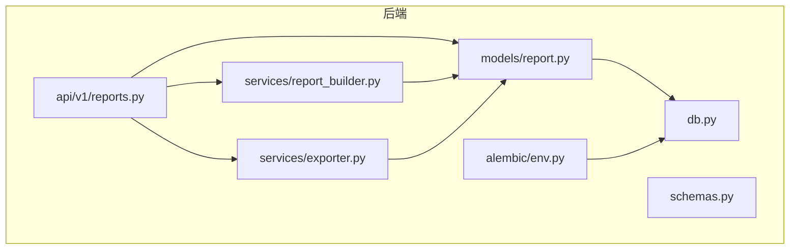
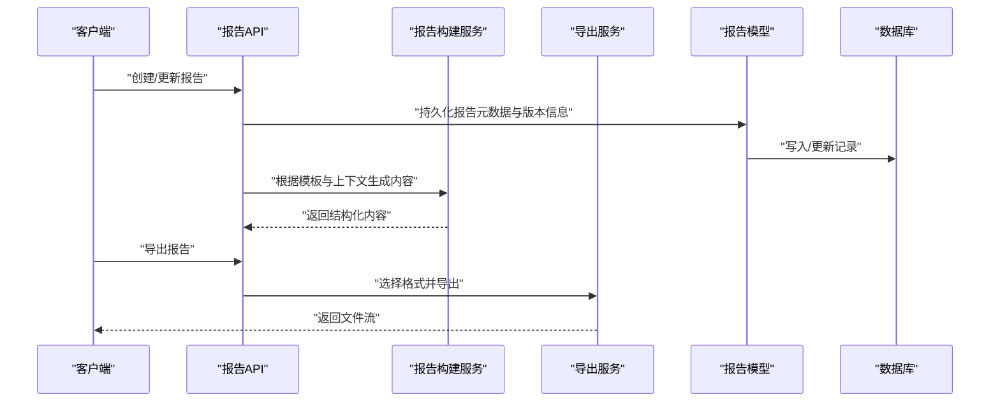
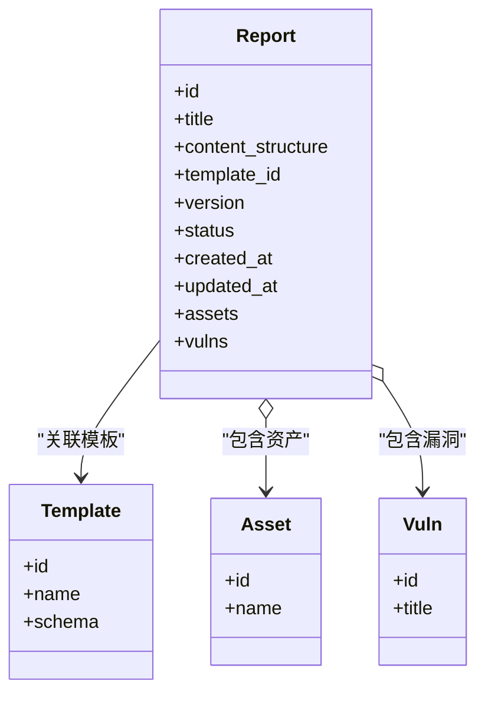
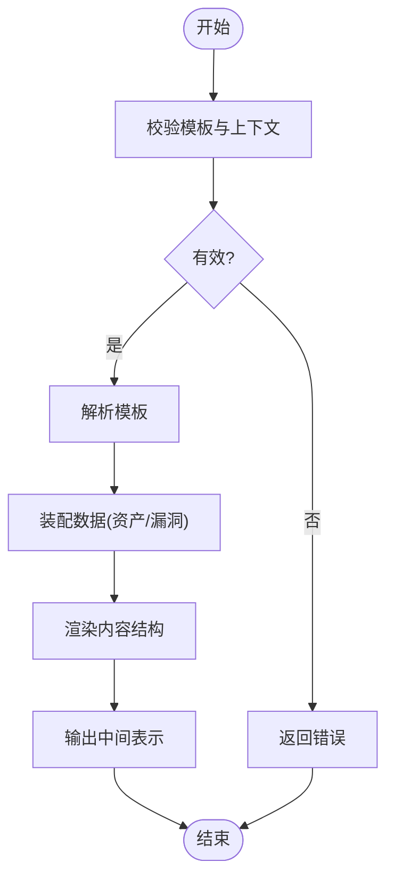
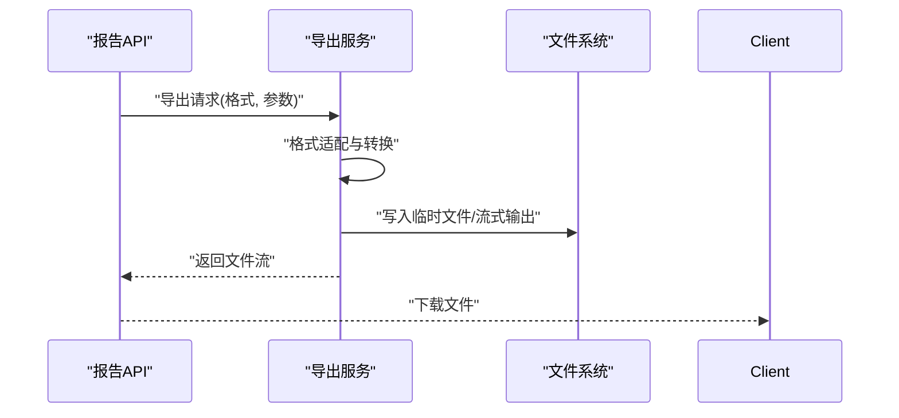
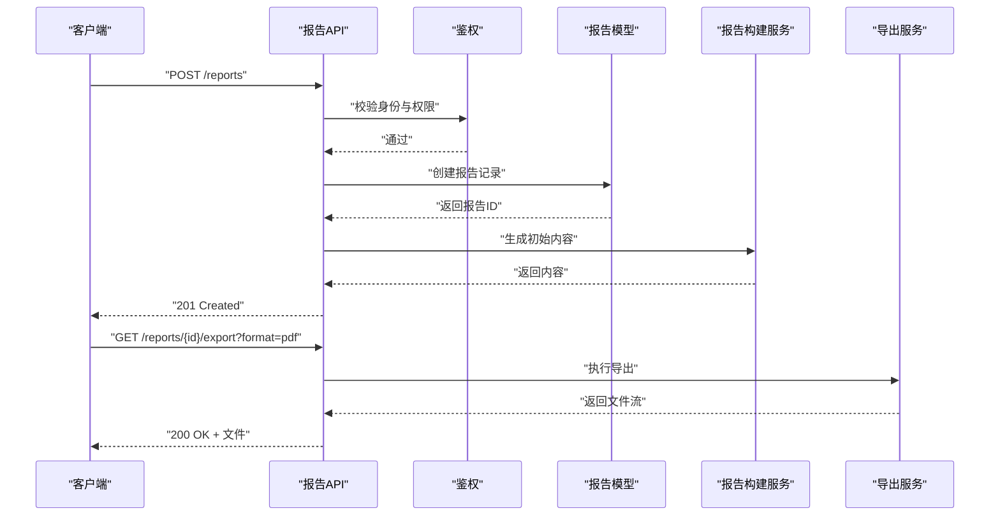
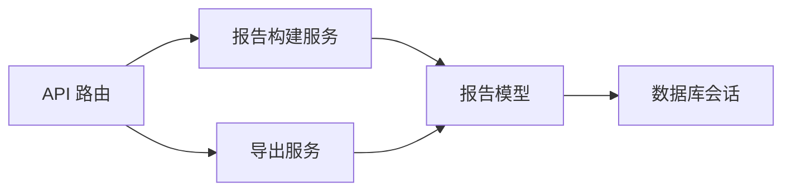

# 报告模型设计

<cite>
**本文引用的文件**   
- [backend/app/models/report.py](file://backend/app/models/report.py)
- [backend/app/api/v1/reports.py](file://backend/app/api/v1/reports.py)
- [backend/app/services/report_builder.py](file://backend/app/services/report_builder.py)
- [backend/app/services/exporter.py](file://backend/app/services/exporter.py)
- [backend/app/schemas.py](file://backend/app/schemas.py)
- [backend/app/db.py](file://backend/app/db.py)
- [backend/alembic/env.py](file://backend/alembic/env.py)
</cite>

## 目录
1. [简介](#简介)
2. [项目结构](#项目结构)
3. [核心组件](#核心组件)
4. [架构总览](#架构总览)
5. [详细组件分析](#详细组件分析)
6. [依赖关系分析](#依赖关系分析)
7. [性能考虑](#性能考虑)
8. [故障排查指南](#故障排查指南)
9. [结论](#结论)
10. [附录](#附录)

## 简介
本文件围绕“报告模型”进行系统化文档化，覆盖报告表的结构定义、与资产和漏洞的关联关系、报告生成流程、版本控制机制、存储策略、内容格式支持与导出数据结构设计，以及完整性约束、权限控制和访问限制。同时提供报告生成、编辑、导出的数据处理流程与性能优化建议，帮助读者从业务到实现全面理解报告子系统。

## 项目结构
后端采用分层架构：数据模型位于 models，API 路由在 api/v1，服务层在 services，数据库会话与迁移在 db.py 与 alembic。报告相关的关键文件如下：
- 数据模型：report.py
- API 接口：reports.py
- 报告构建服务：report_builder.py
- 导出服务：exporter.py
- Pydantic 模式：schemas.py
- 数据库会话：db.py
- Alembic 环境：alembic/env.py

图表来源
- [backend/app/models/report.py](file://backend/app/models/report.py)
- [backend/app/api/v1/reports.py](file://backend/app/api/v1/reports.py)
- [backend/app/services/report_builder.py](file://backend/app/services/report_builder.py)
- [backend/app/services/exporter.py](file://backend/app/services/exporter.py)
- [backend/app/schemas.py](file://backend/app/schemas.py)
- [backend/app/db.py](file://backend/app/db.py)
- [backend/alembic/env.py](file://backend/alembic/env.py)

章节来源
- [backend/app/models/report.py](file://backend/app/models/report.py)
- [backend/app/api/v1/reports.py](file://backend/app/api/v1/reports.py)
- [backend/app/services/report_builder.py](file://backend/app/services/report_builder.py)
- [backend/app/services/exporter.py](file://backend/app/services/exporter.py)
- [backend/app/schemas.py](file://backend/app/schemas.py)
- [backend/app/db.py](file://backend/app/db.py)
- [backend/alembic/env.py](file://backend/alembic/env.py)

## 核心组件
- 报告模型（Report）：承载报告的标题、内容结构、模板关联、版本管理、状态、时间戳等核心字段；维护与资产、漏洞的关联关系。
- 报告构建服务（ReportBuilder）：负责按模板与上下文数据组装报告内容，处理多格式输出。
- 导出服务（Exporter）：统一封装导出逻辑，支持多种文件格式与流式下载。
- API 路由（Reports）：暴露报告创建、查询、更新、删除、版本操作与导出接口。
- 数据模式（Schemas）：定义请求/响应结构与校验规则。
- 数据库会话（DB）：提供异步会话管理与事务边界。
- 迁移环境（Alembic）：管理数据库结构演进。

章节来源
- [backend/app/models/report.py](file://backend/app/models/report.py)
- [backend/app/services/report_builder.py](file://backend/app/services/report_builder.py)
- [backend/app/services/exporter.py](file://backend/app/services/exporter.py)
- [backend/app/api/v1/reports.py](file://backend/app/api/v1/reports.py)
- [backend/app/schemas.py](file://backend/app/schemas.py)
- [backend/app/db.py](file://backend/app/db.py)
- [backend/alembic/env.py](file://backend/alembic/env.py)

## 架构总览
报告子系统遵循“API -> 服务 -> 模型 -> 数据库”的分层调用链。报告构建与导出通过服务层解耦，便于扩展新格式或新数据源。

图表来源
- [backend/app/api/v1/reports.py](file://backend/app/api/v1/reports.py)
- [backend/app/services/report_builder.py](file://backend/app/services/report_builder.py)
- [backend/app/services/exporter.py](file://backend/app/services/exporter.py)
- [backend/app/models/report.py](file://backend/app/models/report.py)
- [backend/app/db.py](file://backend/app/db.py)

## 详细组件分析

### 报告模型（Report）
- 字段设计要点
  - 标题：报告名称，用于展示与检索。
  - 内容结构：以结构化方式描述章节、段落、表格等，便于渲染与导出。
  - 模板关联：绑定报告模板，决定整体布局与样式。
  - 版本管理：版本号、快照、变更摘要，支持回滚与对比。
  - 状态：草稿、已发布、归档等生命周期状态。
  - 时间戳：创建、更新时间，审计追踪。
  - 关联关系：与资产、漏洞的多对多或一对多关系，支撑报告内容的聚合。
- 完整性约束
  - 必填字段校验（如标题、模板ID）。
  - 唯一性约束（如报告编号或标题+模板组合）。
  - 外键约束（模板、资产、漏洞存在性）。
  - 版本号递增与不可变历史快照。
- 权限与访问控制
  - 基于角色的访问控制（RBAC），区分查看、编辑、发布、导出权限。
  - 资源级隔离（仅允许访问所属团队/项目的报告）。
  - 敏感字段脱敏与审计日志。

图表来源
- [backend/app/models/report.py](file://backend/app/models/report.py)

章节来源
- [backend/app/models/report.py](file://backend/app/models/report.py)

### 报告构建服务（ReportBuilder）
- 职责
  - 读取模板与上下文数据（资产、漏洞、扫描结果等）。
  - 填充内容结构，生成中间表示（如 JSON 或 HTML）。
  - 支持多阶段构建（草稿预览、最终版生成）。
- 关键流程
  - 输入校验：模板有效性、数据完整性。
  - 模板解析：解析模板变量与片段。
  - 数据装配：聚合资产与漏洞信息，去重与排序。
  - 输出生成：产出结构化内容，供导出服务使用。

图表来源
- [backend/app/services/report_builder.py](file://backend/app/services/report_builder.py)

章节来源
- [backend/app/services/report_builder.py](file://backend/app/services/report_builder.py)

### 导出服务（Exporter）
- 职责
  - 统一导出入口，支持 PDF、DOCX、HTML、Markdown 等格式。
  - 将中间表示转换为目标格式，处理分页、页眉页脚、图片嵌入等。
  - 提供流式下载与临时文件清理。
- 关键流程
  - 选择格式与参数。
  - 转换中间表示为目标格式。
  - 生成文件流并返回。

图表来源
- [backend/app/services/exporter.py](file://backend/app/services/exporter.py)

章节来源
- [backend/app/services/exporter.py](file://backend/app/services/exporter.py)

### API 路由（Reports）
- 端点概览
  - 创建报告：接收模板ID、初始内容与版本信息。
  - 查询报告：列表、详情、版本历史。
  - 更新报告：增量更新与全量替换。
  - 删除报告：软删除或硬删除。
  - 导出报告：指定格式与范围。
- 权限控制
  - 鉴权中间件校验用户身份与角色。
  - 资源级授权检查（是否拥有该报告的编辑/导出权限）。
- 错误处理
  - 参数校验失败返回 422。
  - 资源不存在返回 404。
  - 权限不足返回 403。
  - 内部错误返回 500 并记录日志。

图表来源
- [backend/app/api/v1/reports.py](file://backend/app/api/v1/reports.py)
- [backend/app/services/report_builder.py](file://backend/app/services/report_builder.py)
- [backend/app/services/exporter.py](file://backend/app/services/exporter.py)

章节来源
- [backend/app/api/v1/reports.py](file://backend/app/api/v1/reports.py)

### 数据模式（Schemas）
- 作用
  - 定义请求体与响应体的字段类型、默认值与校验规则。
  - 确保前后端数据契约一致，减少非法输入。
- 典型模式
  - 报告创建/更新模式：标题、模板ID、内容结构、版本信息等。
  - 导出模式：格式枚举、范围过滤、附加选项。
  - 错误模式：统一错误码与消息。

章节来源
- [backend/app/schemas.py](file://backend/app/schemas.py)

### 数据库与会话（DB）
- 作用
  - 提供异步会话管理，确保事务边界与连接池配置。
  - 为模型层提供统一的 CRUD 操作上下文。
- 关键点
  - 连接超时与重试策略。
  - 慢查询监控与日志。
  - 读写分离（可选）与缓存策略（可选）。

章节来源
- [backend/app/db.py](file://backend/app/db.py)

### 迁移环境（Alembic）
- 作用
  - 管理数据库结构的版本化演进。
  - 自动生成与执行迁移脚本，保证环境一致性。
- 关键点
  - 迁移脚本幂等性与回滚能力。
  - 数据迁移与结构迁移分离。

章节来源
- [backend/alembic/env.py](file://backend/alembic/env.py)

## 依赖关系分析
- 模块耦合
  - API 层依赖服务层与模型层，服务层依赖模型层与外部格式库。
  - 导出服务与构建服务解耦，便于独立扩展。
- 外部依赖
  - 模板引擎（如 Jinja2）。
  - 文档生成库（如 python-docx、weasyprint）。
  - 对象存储（可选，用于导出文件暂存）。
- 潜在循环依赖
  - 避免服务层直接导入 API 层，保持单向依赖。

图表来源
- [backend/app/api/v1/reports.py](file://backend/app/api/v1/reports.py)
- [backend/app/services/report_builder.py](file://backend/app/services/report_builder.py)
- [backend/app/services/exporter.py](file://backend/app/services/exporter.py)
- [backend/app/models/report.py](file://backend/app/models/report.py)
- [backend/app/db.py](file://backend/app/db.py)

章节来源
- [backend/app/api/v1/reports.py](file://backend/app/api/v1/reports.py)
- [backend/app/services/report_builder.py](file://backend/app/services/report_builder.py)
- [backend/app/services/exporter.py](file://backend/app/services/exporter.py)
- [backend/app/models/report.py](file://backend/app/models/report.py)
- [backend/app/db.py](file://backend/app/db.py)

## 性能考虑
- 构建与导出
  - 使用流式处理减少内存占用。
  - 缓存模板解析结果与常用数据片段。
  - 并行构建多个章节或子报告。
- 数据库
  - 合理索引（标题、模板ID、状态、时间戳）。
  - 分页与懒加载关联数据。
  - 批量写入与更新，减少事务开销。
- 并发与队列
  - 将耗时任务（如大型报告导出）放入异步队列。
  - 限流与熔断保护后端稳定性。
- 存储
  - 大文件导出使用对象存储，避免本地磁盘瓶颈。
  - 定期清理临时文件与过期版本快照。

[本节为通用指导，不直接分析具体文件]

## 故障排查指南
- 常见问题
  - 模板解析失败：检查模板语法与变量映射。
  - 导出失败：确认格式库安装与依赖，检查输入数据完整性。
  - 权限错误：核对用户角色与资源归属。
  - 数据库错误：检查连接池、事务与约束冲突。
- 调试手段
  - 启用详细日志与请求追踪。
  - 使用测试用例复现问题。
  - 检查 Alembic 迁移状态与数据库结构一致性。

章节来源
- [backend/app/api/v1/reports.py](file://backend/app/api/v1/reports.py)
- [backend/app/services/report_builder.py](file://backend/app/services/report_builder.py)
- [backend/app/services/exporter.py](file://backend/app/services/exporter.py)
- [backend/app/db.py](file://backend/app/db.py)
- [backend/alembic/env.py](file://backend/alembic/env.py)

## 结论
报告模型设计以清晰的领域模型为核心，通过服务层解耦构建与导出逻辑，结合完善的权限控制与版本管理机制，满足安全、可追溯与可扩展的需求。建议在后续迭代中持续优化性能与用户体验，完善监控与告警体系。

[本节为总结性内容，不直接分析具体文件]

## 附录
- 术语表
  - 报告：针对特定主题生成的结构化文档。
  - 模板：定义报告布局与样式的蓝图。
  - 版本：报告的历史快照，支持回滚与对比。
  - 导出：将报告内容转换为特定格式的文件。
- 参考文件
  - 模型定义：[backend/app/models/report.py](file://backend/app/models/report.py)
  - API 接口：[backend/app/api/v1/reports.py](file://backend/app/api/v1/reports.py)
  - 构建服务：[backend/app/services/report_builder.py](file://backend/app/services/report_builder.py)
  - 导出服务：[backend/app/services/exporter.py](file://backend/app/services/exporter.py)
  - 数据模式：[backend/app/schemas.py](file://backend/app/schemas.py)
  - 数据库会话：[backend/app/db.py](file://backend/app/db.py)
  - 迁移环境：[backend/alembic/env.py](file://backend/alembic/env.py)