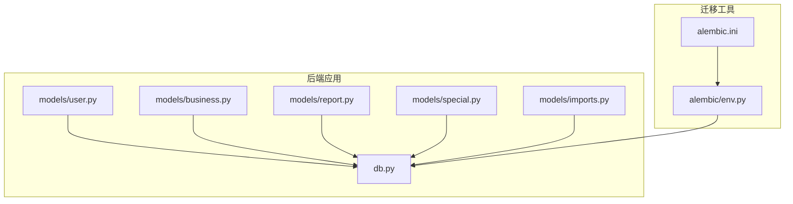
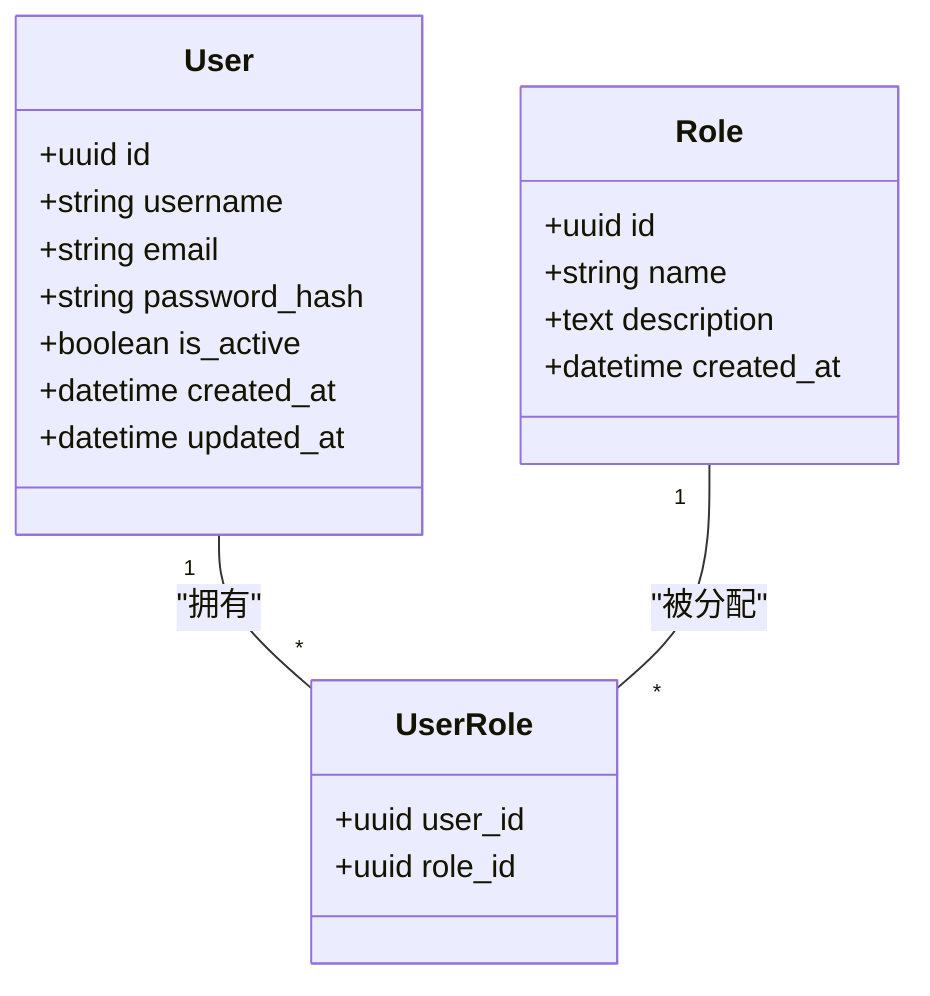
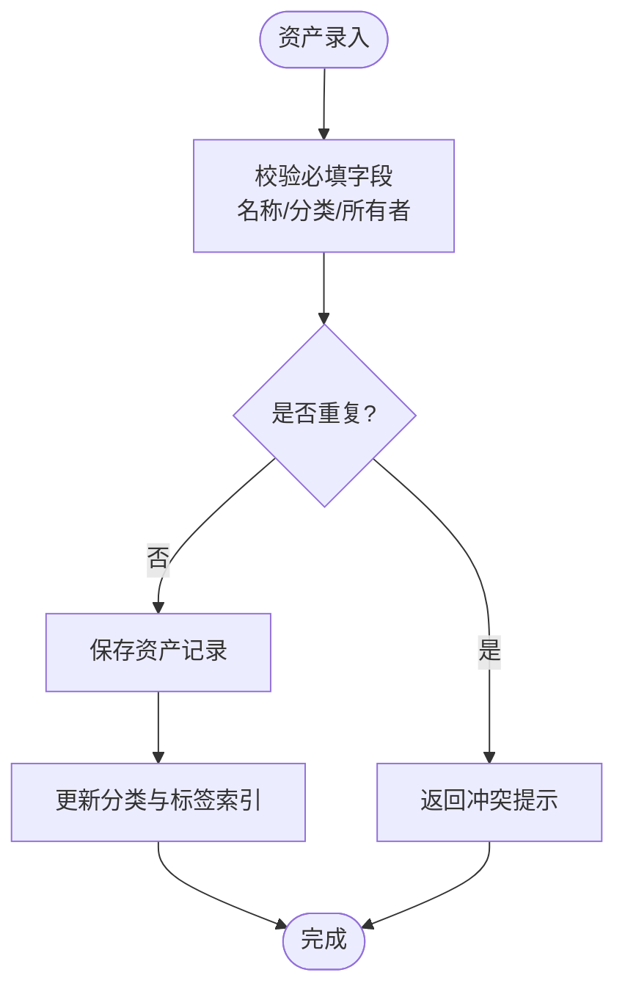
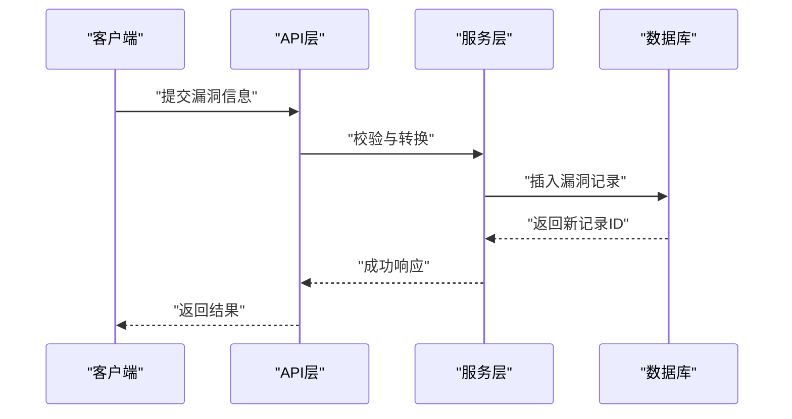
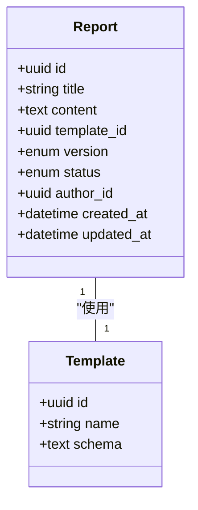
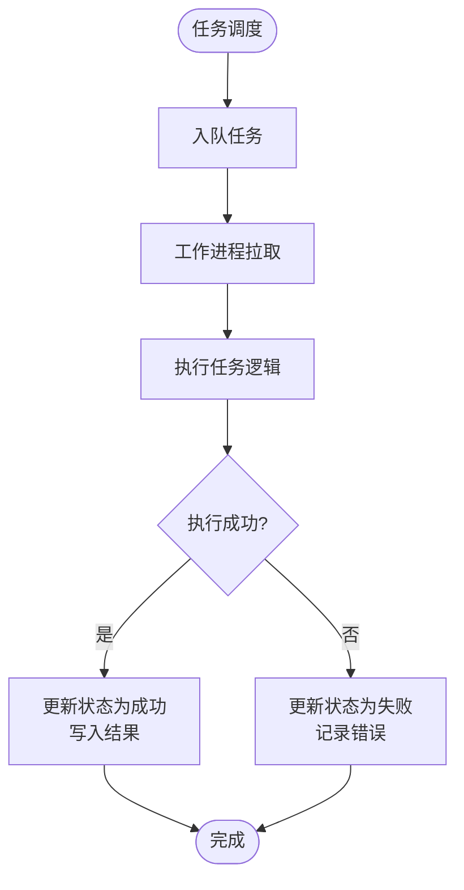
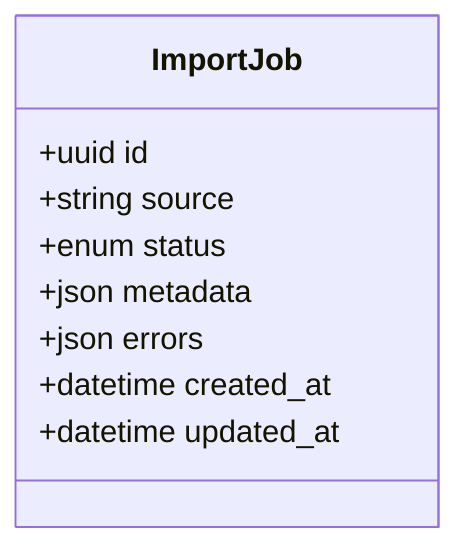
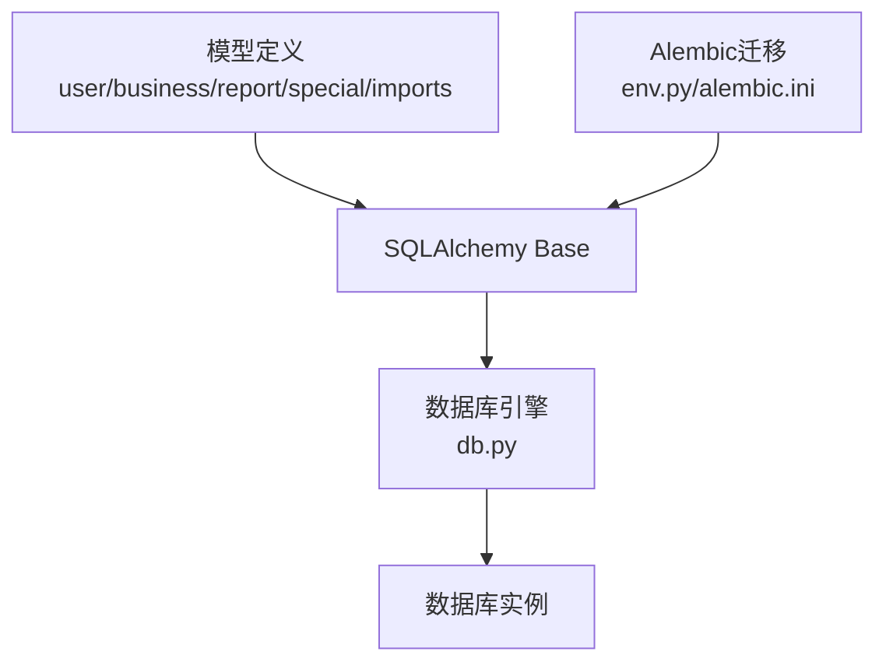

# 数据库设计

<cite>
**本文引用的文件**   
- [backend/app/models/user.py](file://backend/app/models/user.py)
- [backend/app/models/business.py](file://backend/app/models/business.py)
- [backend/app/models/report.py](file://backend/app/models/report.py)
- [backend/app/models/special.py](file://backend/app/models/special.py)
- [backend/app/models/imports.py](file://backend/app/models/imports.py)
- [backend/app/db.py](file://backend/app/db.py)
- [backend/alembic/env.py](file://backend/alembic/env.py)
- [backend/alembic.ini](file://backend/alembic.ini)
</cite>

## 目录
1. [简介](#简介)
2. [项目结构](#项目结构)
3. [核心组件](#核心组件)
4. [架构总览](#架构总览)
5. [详细组件分析](#详细组件分析)
6. [依赖关系分析](#依赖关系分析)
7. [性能考虑](#性能考虑)
8. [故障排查指南](#故障排查指南)
9. [结论](#结论)
10. [附录](#附录)

## 简介
本文件面向Talos项目的数据库模型设计与实现，系统性梳理用户、资产、漏洞、报告与特殊任务等核心数据表的结构定义、字段类型、约束条件、索引设计与关系映射。同时覆盖会话管理、分类体系、标签系统、版本管理与迁移策略，帮助读者快速理解并正确使用该数据库模型。

## 项目结构
后端采用SQLAlchemy作为ORM，Alembic进行数据库迁移管理。模型定义集中在backend/app/models目录下，数据库连接与引擎配置在backend/app/db.py中，迁移脚本由Alembic驱动。



**图示来源**
- [backend/app/models/user.py](file://backend/app/models/user.py)
- [backend/app/models/business.py](file://backend/app/models/business.py)
- [backend/app/models/report.py](file://backend/app/models/report.py)
- [backend/app/models/special.py](file://backend/app/models/special.py)
- [backend/app/models/imports.py](file://backend/app/models/imports.py)
- [backend/app/db.py](file://backend/app/db.py)
- [backend/alembic/env.py](file://backend/alembic/env.py)
- [backend/alembic.ini](file://backend/alembic.ini)

**章节来源**
- [backend/app/db.py](file://backend/app/db.py)
- [backend/alembic/env.py](file://backend/alembic/env.py)
- [backend/alembic.ini](file://backend/alembic.ini)

## 核心组件
- 用户模型：包含用户基本信息、角色权限、认证与会话相关字段，支持多角色与权限控制。
- 资产模型：描述业务资产属性、分类体系、标签系统与关联关系，便于资产盘点与风险归集。
- 漏洞模型：记录安全信息、严重程度、修复建议、状态跟踪与复测结果，支撑漏洞生命周期管理。
- 报告模型：承载报告内容结构、模板关联、版本管理与发布流程，支持多版本演进。
- 特殊任务模型：定义任务类型、执行状态、结果存储与调度信息，用于异步或定时任务编排。
- 导入模型：记录外部数据导入的元数据、解析状态与错误信息，保障导入可追溯。

**章节来源**
- [backend/app/models/user.py](file://backend/app/models/user.py)
- [backend/app/models/business.py](file://backend/app/models/business.py)
- [backend/app/models/report.py](file://backend/app/models/report.py)
- [backend/app/models/special.py](file://backend/app/models/special.py)
- [backend/app/models/imports.py](file://backend/app/models/imports.py)

## 架构总览
下图展示各模型之间的主要关系与依赖，体现用户、资产、漏洞、报告与任务的数据流转与关联。

```mermaid
erDiagram
USER {
uuid id PK
string username UK
string email UK
string password_hash
boolean is_active
timestamp created_at
timestamp updated_at
}
ROLE {
uuid id PK
string name UK
text description
timestamp created_at
}
USER_ROLE {
uuid user_id FK
uuid role_id FK
primary key (user_id, role_id)
}
ASSET {
uuid id PK
string name
text description
string category
json tags
uuid owner_id FK
timestamp created_at
timestamp updated_at
}
VULN {
uuid id PK
string title
text description
string severity
text remediation
enum status
json evidence
uuid asset_id FK
timestamp created_at
timestamp updated_at
}
REPORT {
uuid id PK
string title
text content
uuid template_id FK
enum version
enum status
uuid author_id FK
timestamp created_at
timestamp updated_at
}
SPECIAL_TASK {
uuid id PK
string type
enum status
json payload
json result
timestamp scheduled_at
timestamp started_at
timestamp finished_at
}
IMPORT_JOB {
uuid id PK
string source
enum status
json metadata
json errors
timestamp created_at
timestamp updated_at
}
USER ||--o{ USER_ROLE : "拥有"
ROLE ||--o{ USER_ROLE : "被分配"
USER ||--o{ ASSET : "拥有"
ASSET ||--o{ VULN : "包含"
USER ||--o{ REPORT : "创建"
```

**图示来源**
- [backend/app/models/user.py](file://backend/app/models/user.py)
- [backend/app/models/business.py](file://backend/app/models/business.py)
- [backend/app/models/report.py](file://backend/app/models/report.py)
- [backend/app/models/special.py](file://backend/app/models/special.py)
- [backend/app/models/imports.py](file://backend/app/models/imports.py)

## 详细组件分析

### 用户模型（User）
- 字段说明
  - 标识与基础信息：用户ID、用户名、邮箱、密码哈希、活跃状态、时间戳。
  - 角色与权限：通过多对多关系与角色表关联，支持细粒度权限控制。
  - 会话管理：可通过独立会话表或令牌表维护登录态与过期策略（具体实现以模型为准）。
- 约束与索引
  - 用户名与邮箱唯一性约束，避免重复注册。
  - 常用查询字段建立索引（如用户名、邮箱、活跃状态）。
- 关系映射
  - 与角色表多对多；与资产一对多（所有者）；与报告一对多（作者）。



**图示来源**
- [backend/app/models/user.py](file://backend/app/models/user.py)

**章节来源**
- [backend/app/models/user.py](file://backend/app/models/user.py)

### 资产模型（Asset）
- 字段说明
  - 业务属性：名称、描述、分类、标签（JSON）、所有者（用户ID）。
  - 时间戳：创建与更新时间，便于审计与追踪。
- 约束与索引
  - 名称唯一性或组合唯一（按分类），避免重复资产。
  - 分类与标签字段建立合适索引以提升检索性能。
- 关系映射
  - 与用户一对多（所有者）；与漏洞一对多（归属资产）。



**图示来源**
- [backend/app/models/business.py](file://backend/app/models/business.py)

**章节来源**
- [backend/app/models/business.py](file://backend/app/models/business.py)

### 漏洞模型（Vuln）
- 字段说明
  - 安全信息：标题、描述、严重级别、修复建议、证据（JSON）。
  - 状态跟踪：当前状态（如新建、处理中、已修复、已关闭）。
  - 关联关系：归属资产（外键），便于风险聚合与统计。
- 约束与索引
  - 严重级别枚举约束，确保一致性。
  - 状态与资产ID建立索引，提升列表与筛选性能。
- 关系映射
  - 与资产多对一；可与报告多对多（引用漏洞案例）。



**图示来源**
- [backend/app/models/business.py](file://backend/app/models/business.py)

**章节来源**
- [backend/app/models/business.py](file://backend/app/models/business.py)

### 报告模型（Report）
- 字段说明
  - 内容结构：标题、正文内容（富文本或结构化JSON）、模板ID、版本号、状态。
  - 版本管理：支持多版本迭代，保留历史版本以便回溯。
  - 作者关联：创建者为用户ID，便于责任追踪。
- 约束与索引
  - 版本号与报告ID组合唯一，保证版本不冲突。
  - 状态与作者ID建立索引，优化查询。
- 关系映射
  - 与用户一对多（作者）；与模板一对一（模板ID）。



**图示来源**
- [backend/app/models/report.py](file://backend/app/models/report.py)

**章节来源**
- [backend/app/models/report.py](file://backend/app/models/report.py)

### 特殊任务模型（SpecialTask）
- 字段说明
  - 任务类型：字符串标识任务类别（如扫描、导出、同步）。
  - 执行状态：待执行、运行中、成功、失败等。
  - 结果存储：payload与result为JSON，灵活承载输入输出。
  - 时间戳：计划执行时间、开始时间、结束时间，便于监控与排障。
- 约束与索引
  - 状态与类型建立索引，提升任务调度与查询效率。
- 关系映射
  - 通常无强外键关联，通过payload中的ID间接关联业务实体。



**图示来源**
- [backend/app/models/special.py](file://backend/app/models/special.py)

**章节来源**
- [backend/app/models/special.py](file://backend/app/models/special.py)

### 导入模型（ImportJob）
- 字段说明
  - 来源与状态：source标识数据来源，status表示解析与导入进度。
  - 元数据与错误：metadata记录导入上下文，errors存储解析异常。
  - 时间戳：创建与更新时间，便于审计。
- 约束与索引
  - 来源与批次号组合唯一，避免重复导入。
  - 状态与创建时间索引，提升队列查询效率。



**图示来源**
- [backend/app/models/imports.py](file://backend/app/models/imports.py)

**章节来源**
- [backend/app/models/imports.py](file://backend/app/models/imports.py)

## 依赖关系分析
- ORM与数据库连接
  - SQLAlchemy引擎与会话由db.py统一管理，所有模型通过Base声明式基类继承。
- 迁移管理
  - Alembic通过env.py加载模型元数据，依据alembic.ini配置生成与执行迁移脚本。
- 模型间耦合
  - 用户与角色多对多，资产与漏洞一对多，报告与用户一对多，任务与业务实体弱关联。



**图示来源**
- [backend/app/db.py](file://backend/app/db.py)
- [backend/alembic/env.py](file://backend/alembic/env.py)
- [backend/alembic.ini](file://backend/alembic.ini)

**章节来源**
- [backend/app/db.py](file://backend/app/db.py)
- [backend/alembic/env.py](file://backend/alembic/env.py)
- [backend/alembic.ini](file://backend/alembic.ini)

## 性能考虑
- 索引策略
  - 高频查询字段（用户名、邮箱、资产分类、漏洞状态、报告作者）建立索引。
  - JSON字段按需使用函数索引或生成列，避免全表扫描。
- 分页与过滤
  - 列表接口默认分页，结合状态与时间范围过滤，减少数据传输量。
- 事务与锁
  - 批量导入与报告版本更新使用事务，必要时加行级锁防止并发冲突。
- 缓存与异步
  - 热点数据（如分类字典、标签集合）可缓存；任务型操作走异步队列，降低主线程阻塞。

[本节为通用指导，不涉及具体文件分析]

## 故障排查指南
- 常见错误
  - 唯一约束冲突：用户名、邮箱、资产名称重复导致插入失败。
  - 外键约束失败：删除资产或用户时存在子记录未清理。
  - 枚举值非法：严重级别、状态字段传入不在允许范围内的值。
- 定位方法
  - 查看数据库日志与Alembic迁移日志，确认DDL变更是否正确。
  - 检查导入任务的errors字段，定位解析异常与数据质量问题。
  - 使用慢查询分析与EXPLAIN语句，优化高延迟查询。
- 恢复策略
  - 回滚最近一次迁移，修正数据后重新执行。
  - 清理脏数据与重试导入任务，确保幂等性。

**章节来源**
- [backend/alembic/env.py](file://backend/alembic/env.py)
- [backend/alembic.ini](file://backend/alembic.ini)

## 结论
Talos数据库模型围绕用户、资产、漏洞、报告与特殊任务构建，强调完整性约束、关系清晰与可扩展性。通过Alembic进行版本化迁移，配合合理的索引与事务策略，保障系统在复杂业务场景下的稳定性与性能。建议在后续迭代中持续完善枚举字典、扩展JSON字段语义，并加强导入与任务模块的可观测性。

[本节为总结性内容，不涉及具体文件分析]

## 附录
- 数据完整性约束
  - 唯一性：用户名、邮箱、资产名称（按分类）、报告版本号。
  - 非空性：核心字段（如标题、描述、严重级别、状态）强制非空。
  - 外键：资产所有者、漏洞归属资产、报告作者、模板ID等。
- 业务规则验证
  - 资产分类与标签需符合预定义字典。
  - 漏洞状态流转遵循既定顺序（新建→处理中→已修复→已关闭）。
  - 报告版本递增且不可回退至旧版本覆盖。
- 迁移策略与版本管理
  - 每次DDL变更生成独立迁移脚本，命名规范清晰。
  - 环境隔离（开发/测试/生产）分别维护迁移历史。
  - 回滚方案与数据修复脚本配套准备。

[本节为补充说明，不涉及具体文件分析]