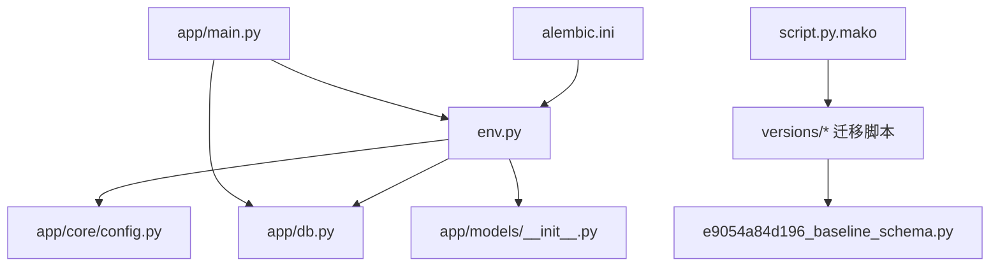
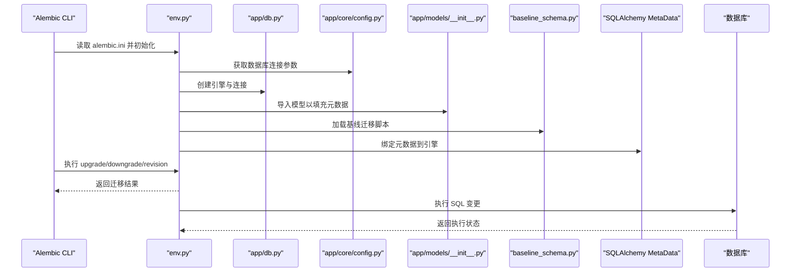
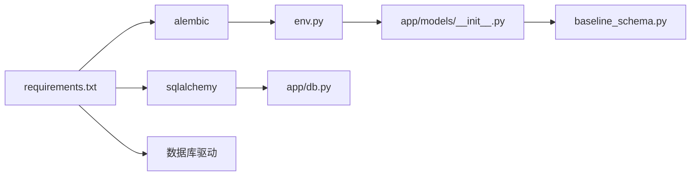

# 数据库迁移管理

<cite>
**本文引用的文件**   
- [alembic.ini](file://backend/alembic.ini)
- [env.py](file://backend/alembic/env.py)
- [script.py.mako](file://backend/alembic/script.py.mako)
- [db.py](file://backend/app/db.py)
- [config.py](file://backend/app/core/config.py)
- [models/__init__.py](file://backend/app/models/__init__.py)
- [main.py](file://backend/app/main.py)
- [requirements.txt](file://backend/requirements.txt)
- [e9054a84d196_baseline_schema.py](file://backend/alembic/versions/e9054a84d196_baseline_schema.py)
</cite>

## 更新摘要
**所做更改**   
- 新增Alembic迁移基础设施章节，详细说明结构化数据库版本控制能力
- 更新环境配置部分，包含完整的开发环境设置指南
- 增强回滚机制说明，提供完整的版本回滚操作流程
- 补充自动模式更新功能，支持数据库结构同步
- 新增基线迁移最佳实践和故障排除指南

## 目录
1. [简介](#简介)
2. [项目结构](#项目结构)
3. [核心组件](#核心组件)
4. [架构总览](#架构总览)
5. [详细组件分析](#详细组件分析)
6. [依赖分析](#依赖分析)
7. [性能考虑](#性能考虑)
8. [故障排除指南](#故障排除指南)
9. [结论](#结论)
10. [附录](#附录)

## 简介
本文件面向后端开发与运维团队，系统化阐述基于 Alembic 的数据库迁移管理实践。内容涵盖环境配置、脚本模板、版本控制策略、迁移脚本编写规范、数据变更操作流程、回滚机制与最佳实践；同时给出数据库结构变更的发布流程、测试策略、生产部署注意事项、常见场景处理、备份恢复策略与故障排除方法，并提供命令示例与自动化集成方案。

**更新** 本次更新重点反映了已应用的变更：建立了完整的 Alembic 迁移基础设施，包括结构化数据库版本控制、自动模式更新、回滚能力和开发环境设置。

## 项目结构
本项目在 backend 目录下使用 Alembic 进行数据库迁移管理，关键目录与文件如下：
- backend/alembic.ini：Alembic 主配置文件（数据库连接、迁移目录等）
- backend/alembic/env.py：Alembic 运行环境与元数据绑定逻辑
- backend/alembic/script.py.mako：迁移脚本生成模板
- backend/alembic/versions/e9054a84d196_baseline_schema.py：基线迁移脚本，定义完整数据库架构
- backend/app/db.py：SQLAlchemy 引擎与会话初始化
- backend/app/core/config.py：应用配置（含数据库连接信息）
- backend/app/models/__init__.py：模型导入以注册到 SQLAlchemy 元数据
- backend/app/main.py：应用入口（用于启动时执行迁移或触发迁移）
- backend/requirements.txt：依赖声明（包含 alembic、sqlalchemy 等）

**图表来源**
- [alembic.ini](file://backend/alembic.ini)
- [env.py](file://backend/alembic/env.py)
- [db.py](file://backend/app/db.py)
- [config.py](file://backend/app/core/config.py)
- [models/__init__.py](file://backend/app/models/__init__.py)
- [script.py.mako](file://backend/alembic/script.py.mako)
- [e9054a84d196_baseline_schema.py](file://backend/alembic/versions/e9054a84d196_baseline_schema.py)

**章节来源**
- [alembic.ini](file://backend/alembic.ini)
- [env.py](file://backend/alembic/env.py)
- [script.py.mako](file://backend/alembic/script.py.mako)
- [db.py](file://backend/app/db.py)
- [config.py](file://backend/app/core/config.py)
- [models/__init__.py](file://backend/app/models/__init__.py)
- [main.py](file://backend/app/main.py)
- [requirements.txt](file://backend/requirements.txt)
- [e9054a84d196_baseline_schema.py](file://backend/alembic/versions/e9054a84d196_baseline_schema.py)

## 核心组件
- Alembic 配置与运行环境
  - alembic.ini：定义数据库 URL、迁移脚本目录、日志级别等
  - env.py：加载配置、创建引擎、绑定元数据、执行迁移上下文
- 迁移脚本模板
  - script.py.mako：生成 upgrade()/downgrade() 骨架，便于统一风格
- 基线迁移脚本
  - e9054a84d196_baseline_schema.py：定义完整的数据库架构，包含所有表结构和初始数据
- 数据库连接与模型注册
  - app/db.py：构建 SQLAlchemy 引擎与 Session
  - app/core/config.py：集中读取环境变量或配置文件中的数据库连接参数
  - app/models/__init__.py：导入所有模型，确保元数据包含表定义
- 应用入口与迁移触发
  - app/main.py：服务启动时可自动执行迁移或提供迁移钩子

**章节来源**
- [alembic.ini](file://backend/alembic.ini)
- [env.py](file://backend/alembic/env.py)
- [script.py.mako](file://backend/alembic/script.py.mako)
- [e9054a84d196_baseline_schema.py](file://backend/alembic/versions/e9054a84d196_baseline_schema.py)
- [db.py](file://backend/app/db.py)
- [config.py](file://backend/app/core/config.py)
- [models/__init__.py](file://backend/app/models/__init__.py)
- [main.py](file://backend/app/main.py)

## 架构总览
下图展示从 Alembic CLI 到数据库的完整调用链，以及与环境配置、模型注册的交互关系。

**图表来源**
- [alembic.ini](file://backend/alembic.ini)
- [env.py](file://backend/alembic/env.py)
- [db.py](file://backend/app/db.py)
- [config.py](file://backend/app/core/config.py)
- [models/__init__.py](file://backend/app/models/__init__.py)
- [e9054a84d196_baseline_schema.py](file://backend/alembic/versions/e9054a84d196_baseline_schema.py)

## 详细组件分析

### Alembic 配置与环境
- alembic.ini
  - 作用：指定数据库 URL、脚本目录、日志级别、目标库方言等
  - 关键点：确保数据库 URL 指向正确的环境（开发/测试/生产），避免硬编码敏感信息
- env.py
  - 作用：加载配置、创建引擎、设置目标元数据、执行迁移上下文
  - 关键点：
    - 通过配置模块读取数据库连接参数
    - 导入 models 包以将表定义纳入元数据
    - 根据命令行参数决定执行 upgrade/downgrade/revision
- script.py.mako
  - 作用：生成迁移脚本模板，统一 upgrade()/downgrade() 结构与注释
  - 关键点：可自定义导入、事务行为、批处理模式等

**章节来源**
- [alembic.ini](file://backend/alembic.ini)
- [env.py](file://backend/alembic/env.py)
- [script.py.mako](file://backend/alembic/script.py.mako)

### 基线迁移脚本
- e9054a84d196_baseline_schema.py
  - 作用：定义完整的数据库架构基线，包含所有表结构、索引和约束
  - 特点：
    - 一次性建立完整的数据库结构
    - 包含必要的初始数据和系统配置
    - 支持完整的回滚操作
  - 最佳实践：
    - 基线迁移应保持不可变，禁止修改已发布的版本
    - 后续变更应通过新的迁移脚本进行增量更新
    - 确保基线迁移在所有环境中保持一致

**章节来源**
- [e9054a84d196_baseline_schema.py](file://backend/alembic/versions/e9054a84d196_baseline_schema.py)

### 数据库连接与模型注册
- app/db.py
  - 作用：创建 SQLAlchemy 引擎、会话工厂，暴露连接对象
  - 关键点：支持连接池、超时、重试等参数；避免在迁移中复用应用会话
- app/core/config.py
  - 作用：集中管理数据库连接字符串、驱动、池大小等
  - 关键点：优先从环境变量注入，便于不同环境隔离
- app/models/__init__.py
  - 作用：导入所有模型，确保元数据包含全部表定义
  - 关键点：新增模型必须在此处导入，否则 Alembic 无法识别变更

**章节来源**
- [db.py](file://backend/app/db.py)
- [config.py](file://backend/app/core/config.py)
- [models/__init__.py](file://backend/app/models/__init__.py)

### 应用入口与迁移触发
- app/main.py
  - 作用：应用启动时可触发迁移（如先迁移再启动服务）
  - 关键点：
    - 建议在容器启动阶段执行迁移，确保数据库结构与代码一致
    - 对迁移失败做优雅降级与告警

**章节来源**
- [main.py](file://backend/app/main.py)

## 依赖分析
- 运行时依赖
  - alembic：迁移工具
  - sqlalchemy：ORM 与元数据管理
  - 数据库驱动：根据数据库类型选择（如 psycopg2、pymysql 等）
- 依赖声明位置
  - backend/requirements.txt：列出 alembic、sqlalchemy 及驱动

**图表来源**
- [requirements.txt](file://backend/requirements.txt)
- [env.py](file://backend/alembic/env.py)
- [db.py](file://backend/app/db.py)
- [models/__init__.py](file://backend/app/models/__init__.py)
- [e9054a84d196_baseline_schema.py](file://backend/alembic/versions/e9054a84d196_baseline_schema.py)

**章节来源**
- [requirements.txt](file://backend/requirements.txt)

## 性能考虑
- 迁移脚本粒度
  - 大表变更建议拆分为多个小迁移，减少锁持有时间
- 批量操作
  - 使用 Alembic 批处理模式（batch=True）提升兼容性并降低风险
- 索引与约束
  - 先建索引后迁移数据，必要时分批次提交
- 连接池与超时
  - 合理设置连接池大小与查询超时，避免迁移阻塞
- 并发与锁
  - 避免在生产高峰期执行长耗时迁移
- 基线迁移优化
  - 基线迁移应一次性完成，避免多次往返数据库
  - 合理使用事务包裹，确保数据一致性

## 故障排除指南
- 常见问题定位
  - 数据库连接失败：检查 alembic.ini 的数据库 URL 与网络连通性
  - 元数据缺失：确认 models/__init__.py 已导入新模型
  - 迁移冲突：查看 alembic 历史版本，合并分支前解决冲突
  - 权限不足：确认数据库用户具备 DDL/DML 权限
  - 基线迁移问题：检查基线脚本的完整性与一致性
- 回滚与修复
  - 使用 downgrade 回滚到上一版本
  - 若数据损坏，优先从备份恢复，再重新执行迁移
  - 基线迁移回滚需谨慎，确保数据完整性
- 日志与调试
  - 调整 alembic.ini 日志级别，输出详细执行过程
  - 在 env.py 中增加调试打印或断点辅助定位
  - 监控基线迁移的执行状态和错误信息

**章节来源**
- [alembic.ini](file://backend/alembic.ini)
- [env.py](file://backend/alembic/env.py)
- [models/__init__.py](file://backend/app/models/__init__.py)
- [e9054a84d196_baseline_schema.py](file://backend/alembic/versions/e9054a84d196_baseline_schema.py)

## 结论
通过 Alembic 与 SQLAlchemy 的组合，本项目实现了结构化、可追溯的数据库迁移管理。基线迁移的建立为系统提供了完整的数据库架构基础，配合完善的回滚机制，可在多环境下安全高效地推进数据库结构变更，保障数据一致性与系统稳定性。

## 附录

### 环境配置要点
- 数据库连接
  - 使用环境变量注入数据库 URL，避免硬编码
  - 区分开发、测试、生产环境的连接串与权限
- Alembic 配置
  - 明确脚本目录与目标元数据绑定
  - 开启必要的日志级别以便排障

**章节来源**
- [alembic.ini](file://backend/alembic.ini)
- [config.py](file://backend/app/core/config.py)

### 脚本模板与版本控制策略
- 脚本模板
  - 使用 script.py.mako 统一生成 upgrade()/downgrade() 骨架
  - 在模板中加入必要导入与批处理开关
- 版本控制
  - 每个业务变更对应一个独立迁移脚本
  - 分支合并前先解决版本冲突，保持线性历史
  - 基线迁移作为版本起点，后续变更基于此演进

**章节来源**
- [script.py.mako](file://backend/alembic/script.py.mako)
- [e9054a84d196_baseline_schema.py](file://backend/alembic/versions/e9054a84d196_baseline_schema.py)

### 迁移脚本编写规范
- 命名与描述
  - 清晰描述变更目的与影响范围
- 幂等性
  - 尽量保证重复执行不产生副作用
- 数据一致性
  - 复杂变更使用事务包裹，失败自动回滚
- 兼容性
  - 使用批处理模式提升跨方言兼容性
- 基线迁移规范
  - 基线迁移应包含完整的数据库架构定义
  - 确保所有表、索引、约束的完整性
  - 包含必要的初始数据和系统配置

**章节来源**
- [script.py.mako](file://backend/alembic/script.py.mako)
- [e9054a84d196_baseline_schema.py](file://backend/alembic/versions/e9054a84d196_baseline_schema.py)

### 数据变更操作流程
- 创建迁移
  - 基于模型变更生成迁移脚本
- 本地验证
  - 在开发/测试环境执行升级与回滚验证
- 预生产演练
  - 在预生产环境模拟真实数据量与负载
- 生产发布
  - 在低峰期执行迁移，监控错误与性能指标
- 基线迁移流程
  - 首次部署时执行基线迁移建立完整架构
  - 验证所有表结构和初始数据的正确性

**章节来源**
- [env.py](file://backend/alembic/env.py)
- [main.py](file://backend/app/main.py)
- [e9054a84d196_baseline_schema.py](file://backend/alembic/versions/e9054a84d196_baseline_schema.py)

### 回滚机制与版本管理最佳实践
- 回滚
  - 使用 downgrade 回滚到指定版本
  - 数据损坏时优先恢复备份
  - 基线迁移回滚需特别谨慎，确保数据完整性
- 版本管理
  - 保持迁移脚本不可变，禁止修改已发布的脚本
  - 使用分支标签标记发布版本
  - 基线迁移作为版本锚点，后续变更基于此演进

**章节来源**
- [env.py](file://backend/alembic/env.py)
- [e9054a84d196_baseline_schema.py](file://backend/alembic/versions/e9054a84d196_baseline_schema.py)

### 数据库结构变更发布流程
- 需求评审与影响评估
- 编写迁移脚本与单元测试
- 在测试环境验证升级与回滚
- 预生产演练与回归测试
- 生产灰度发布与监控
- 基线迁移发布
  - 确保基线迁移在所有环境中一致
  - 验证完整的数据架构和功能

**章节来源**
- [main.py](file://backend/app/main.py)
- [env.py](file://backend/alembic/env.py)
- [e9054a84d196_baseline_schema.py](file://backend/alembic/versions/e9054a84d196_baseline_schema.py)

### 测试策略
- 单元测试
  - 针对迁移脚本中的关键逻辑编写用例
- 集成测试
  - 在测试数据库上执行完整迁移流程
- 数据快照
  - 使用固定数据集进行可重复测试
- 基线迁移测试
  - 验证基线迁移的完整性和一致性
  - 测试回滚操作的可靠性

**章节来源**
- [env.py](file://backend/alembic/env.py)
- [e9054a84d196_baseline_schema.py](file://backend/alembic/versions/e9054a84d196_baseline_schema.py)

### 生产环境部署注意事项
- 权限最小化
  - 仅授予迁移所需的最小权限
- 备份先行
  - 执行迁移前完成全量或增量备份
- 监控与告警
  - 记录迁移耗时、错误率与资源占用
- 回滚预案
  - 准备快速回滚与数据恢复步骤
- 基线迁移注意事项
  - 确保基线迁移的幂等性
  - 验证数据库连接的稳定性

**章节来源**
- [alembic.ini](file://backend/alembic.ini)
- [main.py](file://backend/app/main.py)
- [e9054a84d196_baseline_schema.py](file://backend/alembic/versions/e9054a84d196_baseline_schema.py)

### 常见迁移场景处理方法
- 新增字段与默认值
  - 先添加字段与默认值，再回填历史数据
- 重命名列或表
  - 分步迁移：先复制数据到新列/表，再切换引用
- 拆分/合并表
  - 设计中间表过渡，逐步迁移数据
- 索引优化
  - 先创建新索引，再删除旧索引，避免锁竞争
- 基线迁移场景
  - 首次部署时建立完整数据库架构
  - 包含所有必需的表和初始数据

**章节来源**
- [script.py.mako](file://backend/alembic/script.py.mako)
- [e9054a84d196_baseline_schema.py](file://backend/alembic/versions/e9054a84d196_baseline_schema.py)

### 数据备份恢复策略
- 备份
  - 定期全量备份 + 增量备份
  - 备份校验与异地存储
- 恢复
  - 制定恢复演练计划
  - 明确 RTO/RPO 目标
- 基线迁移恢复
  - 基线迁移失败时重新执行而非部分恢复
  - 确保恢复后的数据完整性

### 迁移命令使用示例
- 初始化与配置
  - 初始化 Alembic 环境（若尚未初始化）
  - 编辑 alembic.ini 配置数据库连接
- 生成迁移
  - 基于模型变更生成迁移脚本
- 执行迁移
  - 升级到最新版本
  - 回滚到上一版本
  - 执行基线迁移建立完整架构
- 查看历史
  - 显示迁移历史与当前版本

**章节来源**
- [alembic.ini](file://backend/alembic.ini)
- [env.py](file://backend/alembic/env.py)
- [e9054a84d196_baseline_schema.py](file://backend/alembic/versions/e9054a84d196_baseline_schema.py)

### 自动化集成方案
- CI/CD 流水线
  - 在构建阶段安装依赖
  - 在部署阶段执行迁移
- 容器编排
  - 在容器启动前执行迁移
  - 健康检查失败则中止部署
- 回滚策略
  - 自动检测迁移失败并触发回滚
- 基线迁移自动化
  - 首次部署自动执行基线迁移
  - 验证迁移结果的完整性

**章节来源**
- [requirements.txt](file://backend/requirements.txt)
- [main.py](file://backend/app/main.py)
- [e9054a84d196_baseline_schema.py](file://backend/alembic/versions/e9054a84d196_baseline_schema.py)