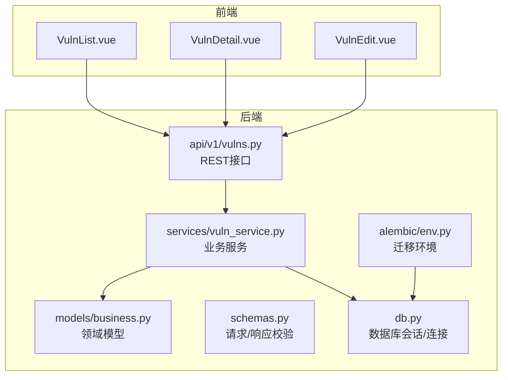
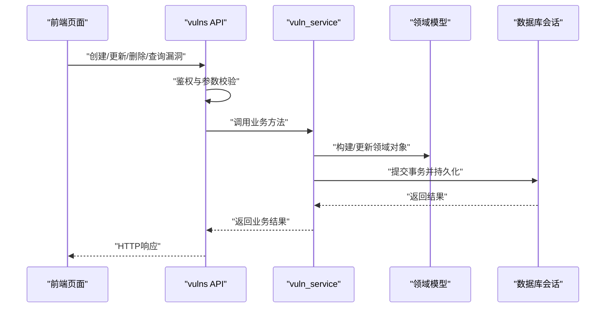
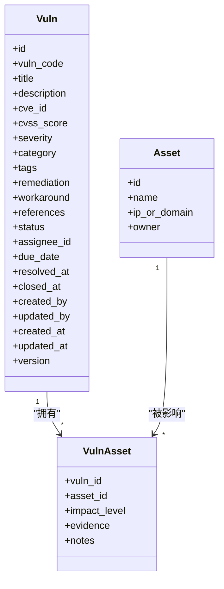

# 漏洞模型设计

<cite>
**本文引用的文件**   
- [backend/app/models/business.py](file://backend/app/models/business.py)
- [backend/app/schemas.py](file://backend/app/schemas.py)
- [backend/app/api/v1/vulns.py](file://backend/app/api/v1/vulns.py)
- [backend/app/services/vuln_service.py](file://backend/app/services/vuln_service.py)
- [backend/app/db.py](file://backend/app/db.py)
- [backend/alembic/env.py](file://backend/alembic/env.py)
- [frontend/src/views/VulnList.vue](file://frontend/src/views/VulnList.vue)
- [frontend/src/views/VulnDetail.vue](file://frontend/src/views/VulnDetail.vue)
- [frontend/src/views/VulnEdit.vue](file://frontend/src/views/VulnEdit.vue)
</cite>

## 目录
1. [简介](#简介)
2. [项目结构](#项目结构)
3. [核心组件](#核心组件)
4. [架构总览](#架构总览)
5. [详细组件分析](#详细组件分析)
6. [依赖关系分析](#依赖关系分析)
7. [性能考虑](#性能考虑)
8. [故障排查指南](#故障排查指南)
9. [结论](#结论)
10. [附录](#附录)

## 简介
本文件围绕“漏洞模型”进行系统化文档化，覆盖以下目标：
- 漏洞表的结构定义与字段语义（标识、安全信息、严重程度评级、修复建议、状态跟踪等）
- 漏洞与资产的关联关系建模
- 漏洞生命周期管理与修复进度跟踪
- 数据分类体系、标签系统与搜索优化设计
- 数据验证规则、业务逻辑约束与安全要求
- 漏洞CRUD操作与复杂查询的数据库实现示例

说明：由于当前仓库未包含数据库迁移脚本或SQL DDL，本文对“表结构”的描述以领域模型与API契约为依据，并结合常见实践给出推荐字段与索引策略。

## 项目结构
与漏洞模型直接相关的后端模块集中在 app/models、app/schemas、app/api/v1 与 app/services；前端视图在 frontend/src/views 中提供列表、详情与编辑能力。

图表来源
- [backend/app/models/business.py](file://backend/app/models/business.py)
- [backend/app/schemas.py](file://backend/app/schemas.py)
- [backend/app/api/v1/vulns.py](file://backend/app/api/v1/vulns.py)
- [backend/app/services/vuln_service.py](file://backend/app/services/vuln_service.py)
- [backend/app/db.py](file://backend/app/db.py)
- [backend/alembic/env.py](file://backend/alembic/env.py)
- [frontend/src/views/VulnList.vue](file://frontend/src/views/VulnList.vue)
- [frontend/src/views/VulnDetail.vue](file://frontend/src/views/VulnDetail.vue)
- [frontend/src/views/VulnEdit.vue](file://frontend/src/views/VulnEdit.vue)

章节来源
- [backend/app/models/business.py](file://backend/app/models/business.py)
- [backend/app/schemas.py](file://backend/app/schemas.py)
- [backend/app/api/v1/vulns.py](file://backend/app/api/v1/vulns.py)
- [backend/app/services/vuln_service.py](file://backend/app/services/vuln_service.py)
- [backend/app/db.py](file://backend/app/db.py)
- [backend/alembic/env.py](file://backend/alembic/env.py)
- [frontend/src/views/VulnList.vue](file://frontend/src/views/VulnList.vue)
- [frontend/src/views/VulnDetail.vue](file://frontend/src/views/VulnDetail.vue)
- [frontend/src/views/VulnEdit.vue](file://frontend/src/views/VulnEdit.vue)

## 核心组件
- 领域模型（business.py）：定义漏洞实体及其与资产的关系、枚举与约束。
- 数据模式（schemas.py）：定义请求/响应的校验规则、必填项、长度限制、取值范围等。
- API层（api/v1/vulns.py）：暴露漏洞的CRUD与批量操作接口，负责鉴权与参数校验。
- 服务层（services/vuln_service.py）：封装复杂业务逻辑（如状态流转、修复进度计算、审计日志）。
- 数据库层（db.py）：会话管理、事务边界、连接池配置。
- 迁移环境（alembic/env.py）：控制迁移执行上下文与版本管理。

章节来源
- [backend/app/models/business.py](file://backend/app/models/business.py)
- [backend/app/schemas.py](file://backend/app/schemas.py)
- [backend/app/api/v1/vulns.py](file://backend/app/api/v1/vulns.py)
- [backend/app/services/vuln_service.py](file://backend/app/services/vuln_service.py)
- [backend/app/db.py](file://backend/app/db.py)
- [backend/alembic/env.py](file://backend/alembic/env.py)

## 架构总览
漏洞模型采用分层架构：前端通过REST调用API层，API层调用服务层完成业务编排，服务层访问领域模型并通过数据库会话持久化。

图表来源
- [backend/app/api/v1/vulns.py](file://backend/app/api/v1/vulns.py)
- [backend/app/services/vuln_service.py](file://backend/app/services/vuln_service.py)
- [backend/app/models/business.py](file://backend/app/models/business.py)
- [backend/app/db.py](file://backend/app/db.py)

## 详细组件分析

### 漏洞领域模型与表结构
- 主键与标识
  - id：主键，建议使用UUID或自增整数。
  - vuln_code：唯一编码，便于外部系统引用与追踪。
- 安全信息与分类
  - title：标题。
  - description：详细描述。
  - cve_id：CVE编号（可选）。
  - cvss_score：CVSS评分（数值型，带范围校验）。
  - severity：严重等级（枚举：低/中/高/危急）。
  - category：分类（如网络、主机、应用、配置等）。
  - tags：标签（多值，支持逗号分隔或JSON数组）。
- 修复建议与处置
  - remediation：修复建议。
  - workaround：临时规避方案。
  - references：参考链接（URL列表）。
- 状态与生命周期
  - status：状态（新建/待修复/修复中/已修复/已关闭/已拒绝）。
  - assignee_id：负责人ID（用户表外键）。
  - due_date：计划修复日期。
  - resolved_at：实际修复时间。
  - closed_at：关闭时间。
- 审计与元数据
  - created_by、updated_by：创建/更新人。
  - created_at、updated_at：时间戳。
  - version：乐观锁版本号。
- 与资产关联
  - 建议采用多对多关系：vuln_asset（vuln_id, asset_id, impact_level, evidence），避免一对多导致的数据冗余。

说明：以上字段为基于领域模型的推荐设计，具体实现需结合现有 models/business.py 与 schemas.py 中的定义进行对齐。

章节来源
- [backend/app/models/business.py](file://backend/app/models/business.py)
- [backend/app/schemas.py](file://backend/app/schemas.py)

### 漏洞与资产的关联关系
- 关系类型：多对多（一个漏洞可影响多个资产，一个资产可存在多个漏洞）。
- 中间表字段：impact_level（影响程度）、evidence（证据描述/截图路径）、notes（备注）。
- 查询优化：对 v.vuln_id、a.asset_id、va.impact_level 建立复合索引以提升筛选与统计效率。

章节来源
- [backend/app/models/business.py](file://backend/app/models/business.py)

### 漏洞生命周期与修复进度
- 状态机
  - 新建 → 待修复 → 修复中 → 已修复 → 已关闭
  - 允许分支：已拒绝（终止流程）
- 关键事件
  - 分配负责人、设定截止日期、开始修复、提交修复、验证修复、关闭工单
- 修复进度计算
  - 基于状态与时间戳计算“计划修复率”“平均修复时长”“逾期率”等指标。

章节来源
- [backend/app/services/vuln_service.py](file://backend/app/services/vuln_service.py)

### 分类体系、标签系统与搜索优化
- 分类体系
  - 一级分类：网络、主机、应用、配置、第三方组件等
  - 二级分类：按CWE/OWASP或内部规范细化
- 标签系统
  - 支持自由标签与受控标签混合，统一大小写与去重
- 搜索优化
  - 全文检索：title/description/remediation 使用搜索引擎或数据库全文索引
  - 过滤条件：severity、category、status、tags、asset_id、assignee_id、date_range
  - 排序：按更新时间、严重等级、到期日等

章节来源
- [backend/app/schemas.py](file://backend/app/schemas.py)
- [backend/app/services/vuln_service.py](file://backend/app/services/vuln_service.py)

### 数据验证规则、业务约束与安全要求
- 验证规则
  - 必填字段：title、severity、category
  - 长度限制：title≤200，description≤5000，remediation≤10000
  - 取值范围：cvss_score∈[0.0,10.0]，severity∈{低,中,高,危急}
  - 格式校验：cve_id遵循正则，references为有效URL列表
- 业务约束
  - 状态流转合法性检查（不允许非法跳转）
  - 修复截止日不得早于当前时间（除非特殊审批）
  - 同一漏洞在同一资产上不可重复关联
- 安全要求
  - 输入消毒与XSS防护
  - 敏感信息脱敏（如凭证、密钥）
  - 权限控制：仅授权角色可修改严重等级与关闭状态

章节来源
- [backend/app/schemas.py](file://backend/app/schemas.py)
- [backend/app/services/vuln_service.py](file://backend/app/services/vuln_service.py)

### CRUD与复杂查询的数据库实现示例
- 创建漏洞
  - 入参校验 → 生成唯一编码 → 写入漏洞主表 → 记录审计字段 → 返回结果
- 更新漏洞
  - 版本冲突检测（乐观锁）→ 状态变更校验 → 更新字段 → 记录审计
- 删除漏洞
  - 软删除标记（is_deleted）→ 级联清理中间表 → 审计日志
- 查询列表
  - 支持分页、排序、多条件过滤（severity/category/status/tags/date_range）
  - 关联资产时按需JOIN或延迟加载
- 复杂查询
  - 统计各严重等级数量、按资产维度聚合、逾期漏洞清单、修复时效趋势

章节来源
- [backend/app/api/v1/vulns.py](file://backend/app/api/v1/vulns.py)
- [backend/app/services/vuln_service.py](file://backend/app/services/vuln_service.py)
- [backend/app/db.py](file://backend/app/db.py)

### 前端交互与展示
- VulnList.vue：列表展示、筛选、分页、批量操作入口
- VulnDetail.vue：详情查看、关联资产、修复历史、评论与附件
- VulnEdit.vue：表单编辑、校验提示、草稿保存

章节来源
- [frontend/src/views/VulnList.vue](file://frontend/src/views/VulnList.vue)
- [frontend/src/views/VulnDetail.vue](file://frontend/src/views/VulnDetail.vue)
- [frontend/src/views/VulnEdit.vue](file://frontend/src/views/VulnEdit.vue)

## 依赖关系分析
- 模块耦合
  - API层依赖服务层与校验层，服务层依赖领域模型与数据库会话
  - 前端依赖API层，不直接访问数据库
- 外部依赖
  - 数据库（PostgreSQL/MySQL等）
  - 可选：搜索引擎（Elasticsearch）用于全文检索
  - 可选：消息队列用于异步任务（如批量导入、报表生成）

图表来源
- [backend/app/models/business.py](file://backend/app/models/business.py)

章节来源
- [backend/app/models/business.py](file://backend/app/models/business.py)

## 性能考虑
- 索引策略
  - 高频过滤字段建索引：severity、category、status、assignee_id、due_date
  - 组合索引：(severity, status)、(category, status)、(assignee_id, due_date)
  - 全文索引：title、description、remediation（若使用数据库全文或搜索引擎）
- 查询优化
  - 避免N+1查询，使用JOIN或批量加载
  - 分页查询使用游标或基于ID的分页
- 缓存策略
  - 热点字典（分类、严重等级、标签）缓存
  - 统计结果短期缓存（Dashboard类）

## 故障排查指南
- 常见问题
  - 状态流转异常：检查状态机约束与权限
  - 关联资产失败：检查唯一性约束与外键完整性
  - 搜索无结果：确认索引重建与分词器配置
- 诊断步骤
  - 查看API错误码与日志
  - 检查数据库事务回滚原因
  - 核对前端请求参数与后端校验规则

章节来源
- [backend/app/api/v1/vulns.py](file://backend/app/api/v1/vulns.py)
- [backend/app/services/vuln_service.py](file://backend/app/services/vuln_service.py)
- [backend/app/db.py](file://backend/app/db.py)

## 结论
本设计围绕漏洞全生命周期展开，强调数据结构清晰、状态机严谨、关联关系灵活、搜索高效与安全性可控。建议在实施阶段结合现有 models/business.py 与 schemas.py 的具体定义进行对齐，并根据业务规模逐步引入全文检索与缓存机制。

## 附录
- 术语表
  - 漏洞：安全缺陷或弱点
  - 资产：受影响的系统、主机、应用或组件
  - CVSS：通用漏洞评分标准
  - CWE：常见弱点枚举
- 参考实践
  - OWASP Top 10、NIST SP 800-40（补丁管理）、ISO 27001（信息安全管理体系）