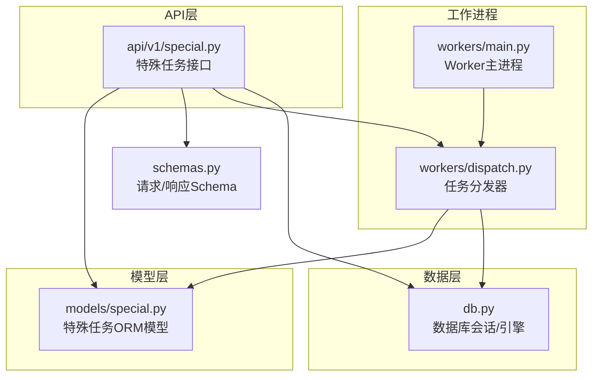
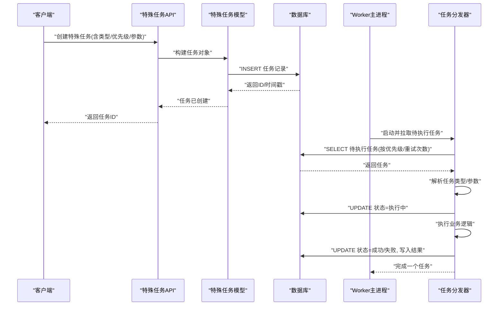
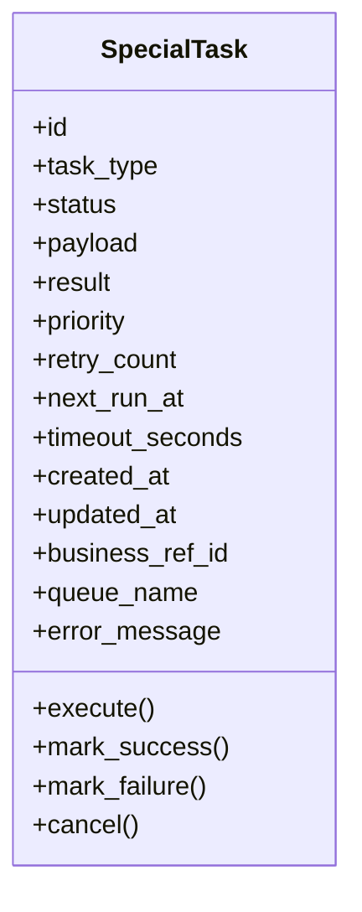
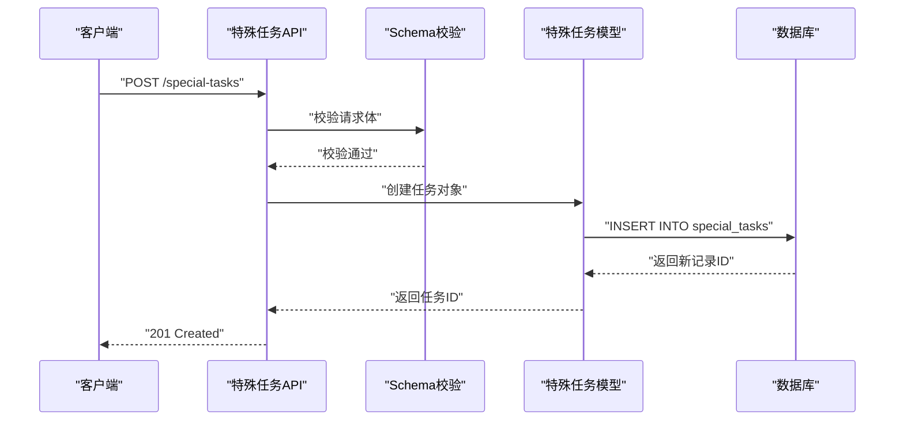
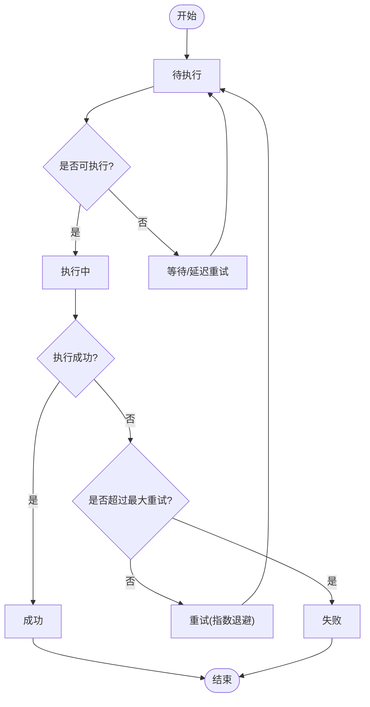
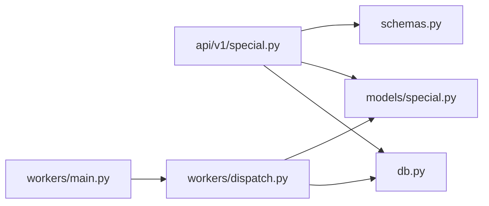

# 特殊任务模型设计

<cite>
**本文引用的文件**   
- [special.py](file://backend/app/models/special.py)
- [special.py](file://backend/app/api/v1/special.py)
- [dispatch.py](file://backend/app/workers/dispatch.py)
- [main.py](file://backend/app/workers/main.py)
- [db.py](file://backend/app/db.py)
- [schemas.py](file://backend/app/schemas.py)
</cite>

## 目录
1. [简介](#简介)
2. [项目结构](#项目结构)
3. [核心组件](#核心组件)
4. [架构总览](#架构总览)
5. [详细组件分析](#详细组件分析)
6. [依赖关系分析](#依赖关系分析)
7. [性能考虑](#性能考虑)
8. [故障排查指南](#故障排查指南)
9. [结论](#结论)
10. [附录](#附录)

## 简介
本文件围绕“特殊任务”模型进行系统化文档化，覆盖表结构设计、字段语义、状态机、结果持久化、调度与执行流程、优先级与重试策略、并发控制与资源管理，以及创建/执行/监控的数据库操作示例与优化建议。目标是让具备不同技术背景的读者都能理解并正确使用该模型。

## 项目结构
与特殊任务相关的代码主要分布在后端模块中：
- 数据模型定义位于 models/special.py
- API 接口定义位于 api/v1/special.py
- 任务调度与分发位于 workers/dispatch.py 与 workers/main.py
- 数据库会话与连接配置位于 db.py
- 请求/响应数据结构定义位于 schemas.py

图表来源
- [special.py](file://backend/app/api/v1/special.py)
- [special.py](file://backend/app/models/special.py)
- [dispatch.py](file://backend/app/workers/dispatch.py)
- [main.py](file://backend/app/workers/main.py)
- [db.py](file://backend/app/db.py)
- [schemas.py](file://backend/app/schemas.py)

章节来源
- [special.py](file://backend/app/models/special.py)
- [special.py](file://backend/app/api/v1/special.py)
- [dispatch.py](file://backend/app/workers/dispatch.py)
- [main.py](file://backend/app/workers/main.py)
- [db.py](file://backend/app/db.py)
- [schemas.py](file://backend/app/schemas.py)

## 核心组件
- 特殊任务模型（ORM）：定义任务表结构与字段约束，包括任务类型、执行状态、结果存储、调度信息等。
- 任务API：提供任务的创建、查询、更新、删除等HTTP接口，负责参数校验与权限控制。
- Worker与调度器：从队列或轮询获取待执行任务，按优先级与策略分发给具体执行器，维护执行状态与结果。
- Schema定义：统一输入输出结构，确保API契约稳定与可验证。
- 数据库访问：封装会话生命周期、事务边界、索引与查询优化。

章节来源
- [special.py](file://backend/app/models/special.py)
- [special.py](file://backend/app/api/v1/special.py)
- [dispatch.py](file://backend/app/workers/dispatch.py)
- [main.py](file://backend/app/workers/main.py)
- [schemas.py](file://backend/app/schemas.py)
- [db.py](file://backend/app/db.py)

## 架构总览
特殊任务系统采用“API + ORM + Worker/Dispatcher + DB”的分层架构。API接收请求并持久化任务；Worker进程异步消费任务，驱动状态机流转，并将结果写回数据库。

图表来源
- [special.py](file://backend/app/api/v1/special.py)
- [special.py](file://backend/app/models/special.py)
- [dispatch.py](file://backend/app/workers/dispatch.py)
- [main.py](file://backend/app/workers/main.py)
- [db.py](file://backend/app/db.py)

## 详细组件分析

### 特殊任务模型（ORM）
- 任务类型：用于区分不同业务场景的任务类别，便于路由到对应执行器。
- 执行状态：描述任务生命周期，如待执行、执行中、成功、失败、取消等。
- 结果存储：保存任务执行结果或错误信息，支持大文本或结构化数据。
- 调度信息：包含优先级、重试次数、下次执行时间、超时、队列标识等。
- 关联关系：与业务流程实体建立外键或引用，保证数据一致性与可追溯性。
- 完整性约束：非空、唯一性、检查约束、默认值、级联策略等。
- 并发控制：通过状态机与行级锁避免重复执行与竞态条件。
- 资源管理：限制结果大小、清理过期任务、分页与索引优化。

章节来源
- [special.py](file://backend/app/models/special.py)

#### 类图（概念映射）

图表来源
- [special.py](file://backend/app/models/special.py)

### 任务API（创建/查询/更新/删除）
- 创建任务：接收任务类型、参数、优先级等，校验后写入数据库，返回任务ID。
- 查询任务：支持按状态、类型、时间范围、业务关联ID过滤，分页返回。
- 更新任务：允许在特定状态下修改调度信息（如重试间隔、优先级）。
- 删除任务：仅允许删除已完成或失败的任务，防止误删进行中任务。
- 权限控制：基于用户角色或令牌鉴权，限制敏感操作。

章节来源
- [special.py](file://backend/app/api/v1/special.py)
- [schemas.py](file://backend/app/schemas.py)

#### 序列图（任务创建）

图表来源
- [special.py](file://backend/app/api/v1/special.py)
- [schemas.py](file://backend/app/schemas.py)
- [special.py](file://backend/app/models/special.py)
- [db.py](file://backend/app/db.py)

### Worker与调度器（执行与状态机）
- Worker主进程：启动多个工作协程，监听任务源（队列或轮询），处理异常与优雅退出。
- 任务分发器：根据任务类型选择执行器，按优先级排序，处理重试与退避策略。
- 状态机流转：待执行 → 执行中 → 成功/失败/取消，确保幂等与一致性。
- 结果持久化：将执行结果或错误信息写回数据库，支持大对象分片或外部存储链接。
- 资源管理：限制并发度、设置超时、释放锁、清理临时资源。

章节来源
- [dispatch.py](file://backend/app/workers/dispatch.py)
- [main.py](file://backend/app/workers/main.py)
- [special.py](file://backend/app/models/special.py)

#### 流程图（任务执行状态机）

图表来源
- [dispatch.py](file://backend/app/workers/dispatch.py)
- [special.py](file://backend/app/models/special.py)

### 结果数据持久化机制
- 小结果：直接存储在任务表的 result 字段（JSON/文本）。
- 大结果：使用外部对象存储（如S3/OSS），数据库中仅存引用路径与元数据。
- 版本化：支持多次执行结果的归档与对比。
- 清理策略：按保留天数或大小阈值定期清理历史结果。

章节来源
- [special.py](file://backend/app/models/special.py)

### 任务数据的分类体系与优先级管理
- 分类体系：按 task_type 划分，例如报告生成、数据导入、漏洞扫描等。
- 优先级：数值越小优先级越高，支持动态调整与队列隔离。
- 队列隔离：不同业务域使用不同 queue_name，避免相互阻塞。

章节来源
- [special.py](file://backend/app/models/special.py)
- [dispatch.py](file://backend/app/workers/dispatch.py)

### 失败重试策略
- 重试次数：由 retry_count 与最大重试上限控制。
- 退避策略：指数退避或固定间隔，避免雪崩。
- 死信队列：超过最大重试的任务进入死信队列，供人工干预。

章节来源
- [dispatch.py](file://backend/app/workers/dispatch.py)
- [special.py](file://backend/app/models/special.py)

### 完整性约束、并发控制与资源管理
- 完整性约束：非空字段、唯一约束（如业务引用+类型）、检查约束（状态枚举）。
- 并发控制：使用行级锁或乐观锁（版本号）避免重复执行；执行中标记防重入。
- 资源管理：限制结果大小、设置超时、清理僵尸任务、分页与索引优化。

章节来源
- [special.py](file://backend/app/models/special.py)
- [db.py](file://backend/app/db.py)

### 任务创建、执行、监控的数据库操作示例
- 创建任务：INSERT 任务记录，设置初始状态为待执行，写入优先级与调度信息。
- 执行任务：SELECT FOR UPDATE 锁定任务，更新状态为执行中，执行业务逻辑后更新结果与状态。
- 监控查询：按状态、类型、时间范围聚合统计，支持分页与导出。
- 清理历史：DELETE 过期任务与结果，归档至冷存储。

章节来源
- [special.py](file://backend/app/models/special.py)
- [db.py](file://backend/app/db.py)

## 依赖关系分析
- API 依赖 Schema 进行参数校验，依赖 ORM 进行数据持久化。
- Worker 依赖 ORM 读取与更新任务，依赖 DB 会话管理。
- 模型依赖数据库引擎与会话，确保事务与连接池配置正确。

图表来源
- [special.py](file://backend/app/api/v1/special.py)
- [schemas.py](file://backend/app/schemas.py)
- [special.py](file://backend/app/models/special.py)
- [dispatch.py](file://backend/app/workers/dispatch.py)
- [main.py](file://backend/app/workers/main.py)
- [db.py](file://backend/app/db.py)

章节来源
- [special.py](file://backend/app/api/v1/special.py)
- [schemas.py](file://backend/app/schemas.py)
- [special.py](file://backend/app/models/special.py)
- [dispatch.py](file://backend/app/workers/dispatch.py)
- [main.py](file://backend/app/workers/main.py)
- [db.py](file://backend/app/db.py)

## 性能考虑
- 索引设计：对常用查询字段（状态、类型、业务关联ID、创建时间）建立索引。
- 分页与投影：只返回必要字段，减少网络传输与内存占用。
- 批量操作：批量插入/更新任务，降低事务开销。
- 连接池：合理配置数据库连接池大小与超时，避免连接耗尽。
- 结果存储：大结果走外部存储，数据库仅存引用，提升读写性能。
- 任务拆分：将长耗时任务拆分为子任务，提高并行度与可观测性。

[本节为通用性能建议，不直接分析具体文件]

## 故障排查指南
- 任务未执行：检查队列/轮询是否正常，Worker进程是否存活，任务状态是否为待执行。
- 执行失败：查看错误消息与重试次数，确认依赖服务可用性，检查超时与资源限制。
- 结果缺失：确认结果持久化逻辑是否执行，外部存储是否可达，权限是否正确。
- 性能问题：分析慢查询与索引命中，检查连接池与并发度，评估结果大小与清理策略。

章节来源
- [dispatch.py](file://backend/app/workers/dispatch.py)
- [special.py](file://backend/app/models/special.py)
- [db.py](file://backend/app/db.py)

## 结论
特殊任务模型通过清晰的表结构、严格的状态机、完善的调度与结果持久化机制，支撑了复杂业务流程的异步化处理。合理的分类与优先级管理、健壮的重试策略、严格的完整性与并发控制，确保了系统的稳定性与可扩展性。结合索引优化、连接池管理与结果存储策略，可在高负载下保持良好性能。

[本节为总结性内容，不直接分析具体文件]

## 附录
- 术语说明：任务类型、执行状态、结果存储、调度信息、优先级、重试策略、死信队列等。
- 最佳实践：明确任务边界、幂等设计、可观测性埋点、灰度发布与回滚策略。
- 扩展方向：引入分布式锁、任务编排、指标采集与告警、审计日志与合规。

[本节为补充信息，不直接分析具体文件]