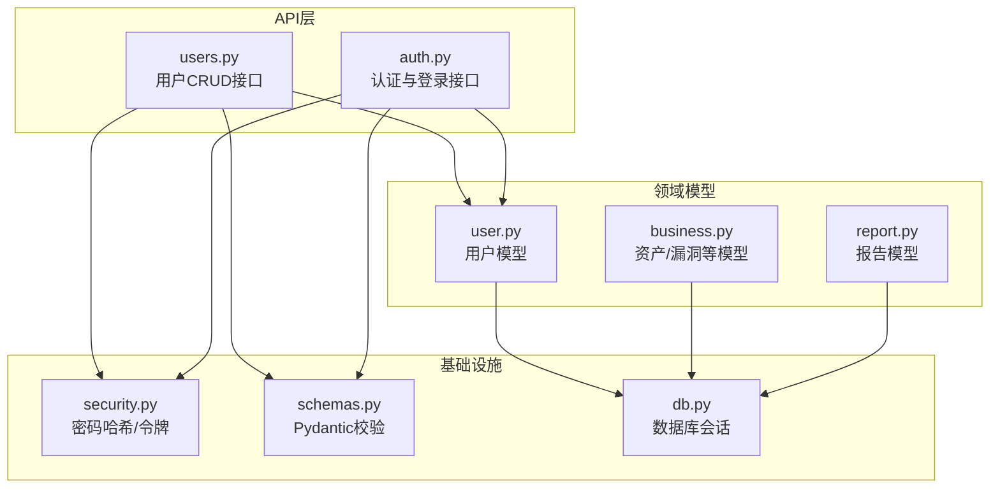
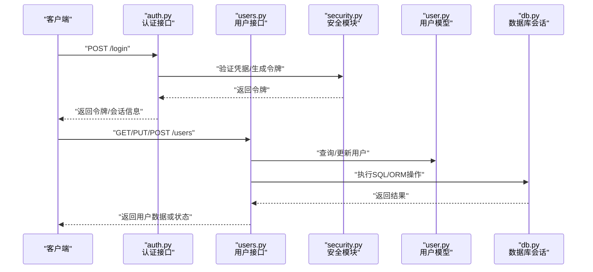
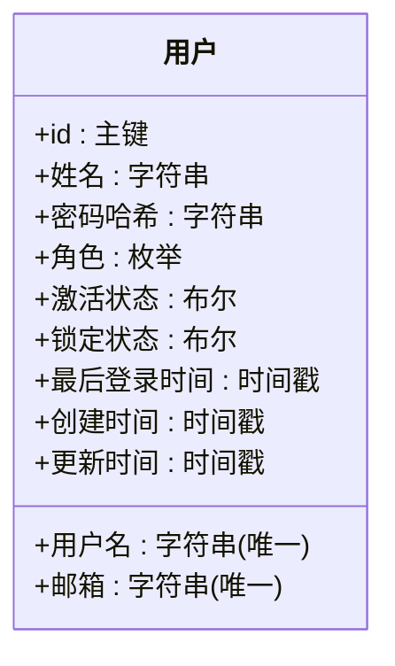
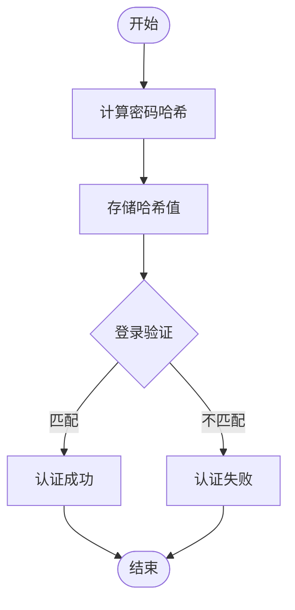
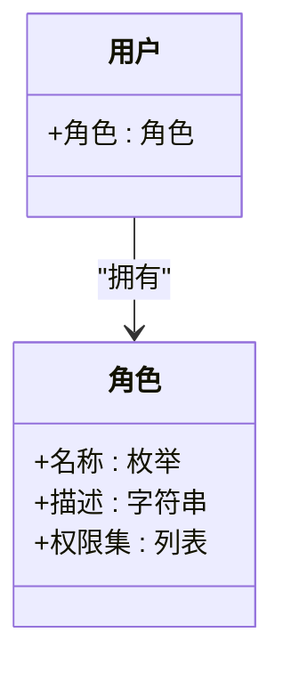
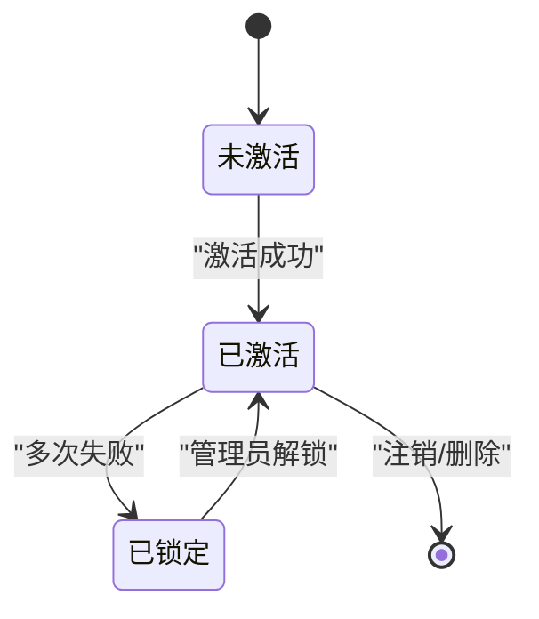
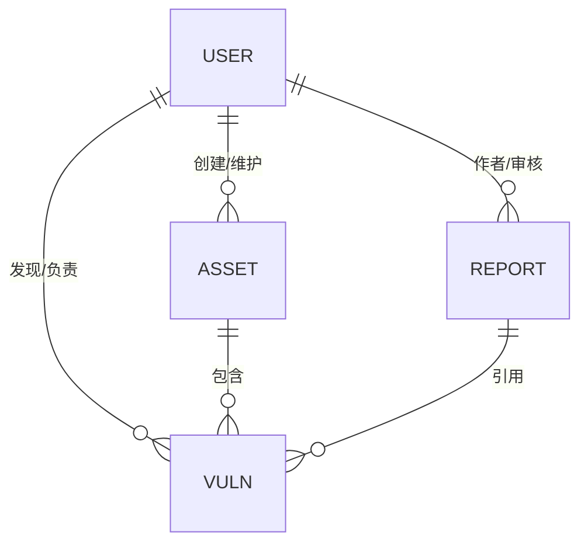
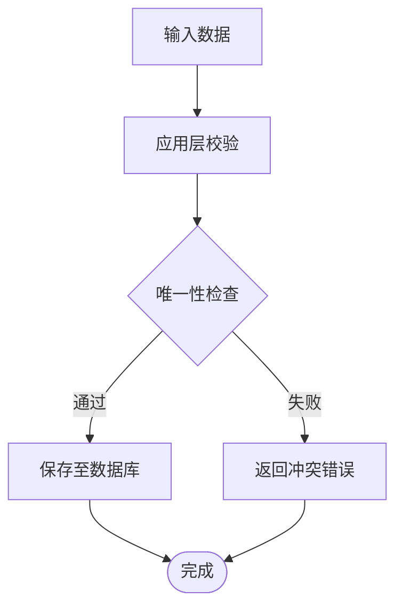
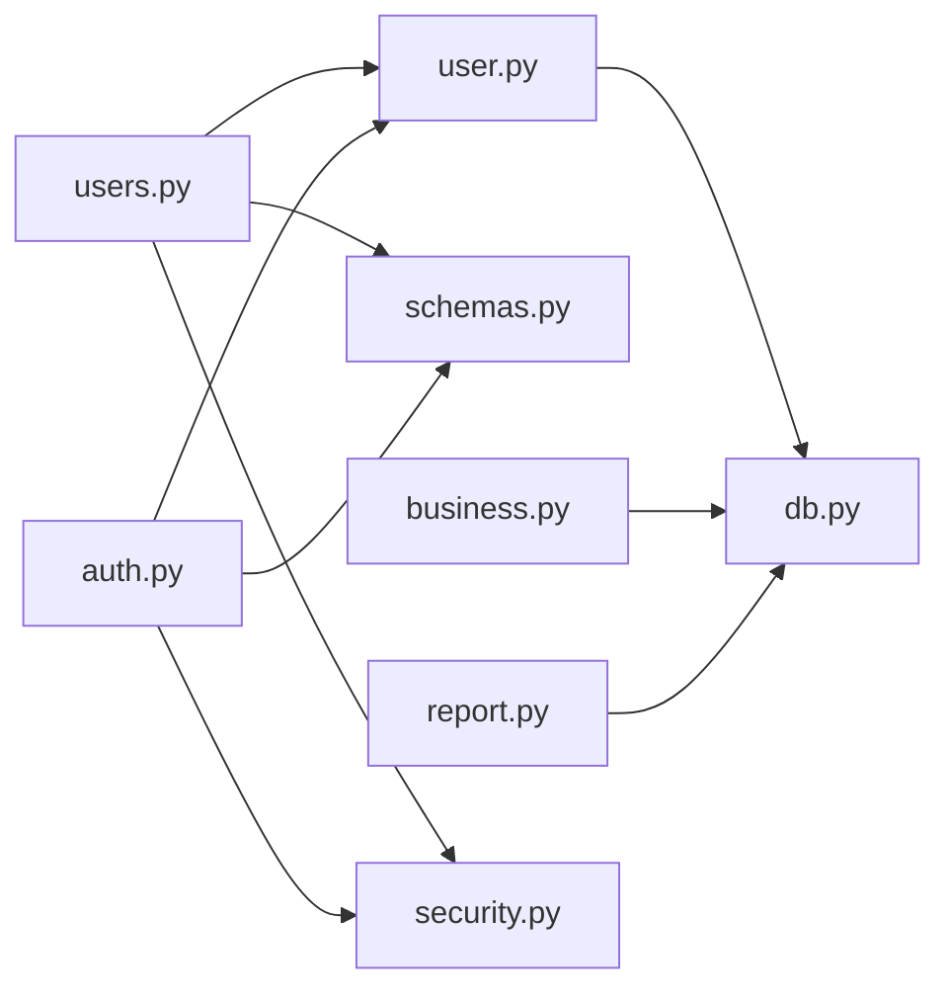

# 用户模型设计

<cite>
**本文引用的文件**   
- [backend/app/models/user.py](file://backend/app/models/user.py)
- [backend/app/api/v1/users.py](file://backend/app/api/v1/users.py)
- [backend/app/api/v1/auth.py](file://backend/app/api/v1/auth.py)
- [backend/app/core/security.py](file://backend/app/core/security.py)
- [backend/app/schemas.py](file://backend/app/schemas.py)
- [backend/app/db.py](file://backend/app/db.py)
- [backend/app/models/business.py](file://backend/app/models/business.py)
- [backend/app/models/report.py](file://backend/app/models/report.py)
</cite>

## 目录
1. [简介](#简介)
2. [项目结构](#项目结构)
3. [核心组件](#核心组件)
4. [架构总览](#架构总览)
5. [详细组件分析](#详细组件分析)
6. [依赖关系分析](#依赖关系分析)
7. [性能考虑](#性能考虑)
8. [故障排查指南](#故障排查指南)
9. [结论](#结论)
10. [附录](#附录)

## 简介
本文件聚焦于 Talos 后端中的“用户模型”设计与实现，涵盖用户表结构、密码加密存储、角色与权限、账户状态与会话管理、最后登录时间跟踪、数据验证与唯一性约束、以及与资产/漏洞/报告等实体的关联关系。文档同时提供面向开发者的最佳实践与常见问题的排障建议，帮助读者快速理解并安全地扩展用户相关功能。

## 项目结构
与用户模型相关的代码主要位于 backend/app 目录下：
- 数据模型定义：backend/app/models/user.py
- API 路由与控制器：backend/app/api/v1/users.py、backend/app/api/v1/auth.py
- 安全与密码处理：backend/app/core/security.py
- Pydantic 校验与序列化：backend/app/schemas.py
- 数据库会话与连接：backend/app/db.py
- 业务实体（资产、漏洞、报告）模型：backend/app/models/business.py、backend/app/models/report.py

图表来源
- [backend/app/api/v1/users.py](file://backend/app/api/v1/users.py)
- [backend/app/api/v1/auth.py](file://backend/app/api/v1/auth.py)
- [backend/app/models/user.py](file://backend/app/models/user.py)
- [backend/app/models/business.py](file://backend/app/models/business.py)
- [backend/app/models/report.py](file://backend/app/models/report.py)
- [backend/app/core/security.py](file://backend/app/core/security.py)
- [backend/app/schemas.py](file://backend/app/schemas.py)
- [backend/app/db.py](file://backend/app/db.py)

章节来源
- [backend/app/models/user.py](file://backend/app/models/user.py)
- [backend/app/api/v1/users.py](file://backend/app/api/v1/users.py)
- [backend/app/api/v1/auth.py](file://backend/app/api/v1/auth.py)
- [backend/app/core/security.py](file://backend/app/core/security.py)
- [backend/app/schemas.py](file://backend/app/schemas.py)
- [backend/app/db.py](file://backend/app/db.py)
- [backend/app/models/business.py](file://backend/app/models/business.py)
- [backend/app/models/report.py](file://backend/app/models/report.py)

## 核心组件
- 用户模型（ORM 实体）：定义用户表结构与字段约束，包含用户名、邮箱、姓名、密码哈希、角色、状态、最后登录时间等。
- 安全模块：负责密码哈希与验证、访问令牌生成与校验。
- 认证接口：处理登录、令牌签发、会话生命周期控制。
- 用户管理接口：提供用户的增删改查、状态切换、角色更新等操作。
- 数据校验：通过 Pydantic Schema 对输入进行严格校验，确保唯一性与格式正确。
- 数据库会话：统一使用异步会话管理事务与查询。

章节来源
- [backend/app/models/user.py](file://backend/app/models/user.py)
- [backend/app/core/security.py](file://backend/app/core/security.py)
- [backend/app/api/v1/auth.py](file://backend/app/api/v1/auth.py)
- [backend/app/api/v1/users.py](file://backend/app/api/v1/users.py)
- [backend/app/schemas.py](file://backend/app/schemas.py)
- [backend/app/db.py](file://backend/app/db.py)

## 架构总览
下图展示了从客户端到数据库的用户相关请求流程，包括认证与用户管理的典型调用链。

图表来源
- [backend/app/api/v1/auth.py](file://backend/app/api/v1/auth.py)
- [backend/app/api/v1/users.py](file://backend/app/api/v1/users.py)
- [backend/app/core/security.py](file://backend/app/core/security.py)
- [backend/app/models/user.py](file://backend/app/models/user.py)
- [backend/app/db.py](file://backend/app/db.py)

## 详细组件分析

### 用户模型（ORM）字段与约束
- 基本信息字段
  - 用户名：唯一标识，通常要求唯一且不可重复注册。
  - 邮箱：用于通知与找回，需唯一且符合邮箱格式。
  - 姓名：显示名，便于界面展示。
- 安全相关字段
  - 密码哈希：不存储明文密码，采用强哈希算法（如 bcrypt/argon2）。
  - 密码重置令牌：用于密码重置流程的临时令牌。
- 角色与权限
  - 角色字段：如管理员、普通用户等，用于控制访问权限。
  - 权限集合：可扩展为更细粒度的权限列表。
- 账户状态与控制
  - 激活状态：标记账户是否已激活。
  - 锁定状态：失败次数过多时临时锁定。
  - 最后登录时间：记录最近一次成功登录时间，用于审计与安全策略。
- 审计与元数据
  - 创建时间、更新时间：记录数据生命周期。
  - 软删除标记：可选，支持逻辑删除。

图表来源
- [backend/app/models/user.py](file://backend/app/models/user.py)

章节来源
- [backend/app/models/user.py](file://backend/app/models/user.py)

### 密码加密存储与验证
- 密码哈希
  - 使用安全的哈希算法对用户密码进行单向加密。
  - 禁止在日志、错误消息中输出任何敏感信息。
- 密码验证
  - 登录时比对输入的明文密码与数据库中存储的哈希值。
  - 失败时返回通用错误提示，避免泄露账号是否存在的信息。
- 密码重置
  - 生成一次性令牌，设置过期时间，限制使用次数。
  - 重置成功后清除令牌并记录审计事件。

图表来源
- [backend/app/core/security.py](file://backend/app/core/security.py)

章节来源
- [backend/app/core/security.py](file://backend/app/core/security.py)

### 角色与权限管理
- 角色定义
  - 管理员：拥有系统级权限，可管理用户、配置与资源。
  - 普通用户：仅具备基础操作权限。
- 权限控制
  - 基于角色的访问控制（RBAC），在接口层校验用户角色。
  - 可扩展为基于资源的细粒度权限。
- 变更审计
  - 角色变更需记录审计日志，防止越权操作。

图表来源
- [backend/app/models/user.py](file://backend/app/models/user.py)

章节来源
- [backend/app/models/user.py](file://backend/app/models/user.py)

### 账户状态与会话管理
- 激活状态
  - 新用户注册后需通过邮件或管理员操作激活。
  - 未激活账户无法登录或受限访问。
- 锁定机制
  - 连续登录失败达到阈值后自动锁定，需管理员解锁。
- 最后登录时间
  - 每次成功登录后更新最后登录时间，用于审计与活跃度统计。
- 会话管理
  - 使用令牌（JWT）或服务器端会话存储，设置过期时间与刷新策略。
  - 登出时销毁令牌或会话，确保安全性。

图表来源
- [backend/app/models/user.py](file://backend/app/models/user.py)
- [backend/app/api/v1/auth.py](file://backend/app/api/v1/auth.py)

章节来源
- [backend/app/models/user.py](file://backend/app/models/user.py)
- [backend/app/api/v1/auth.py](file://backend/app/api/v1/auth.py)

### 用户与资产、漏洞、报告的关联关系
- 资产（Business/Asset）
  - 归属关系：资产可由用户创建或维护，建立外键关联。
  - 权限控制：仅资产所有者或管理员可编辑。
- 漏洞（Vulnerability）
  - 发现者/负责人：漏洞可由用户发现或指派给特定用户处理。
  - 状态流转：根据用户角色决定可执行的操作。
- 报告（Report）
  - 作者/审核人：报告由用户生成，可能涉及多人协作。
  - 版本与审计：记录修改历史与责任人。

图表来源
- [backend/app/models/business.py](file://backend/app/models/business.py)
- [backend/app/models/report.py](file://backend/app/models/report.py)
- [backend/app/models/user.py](file://backend/app/models/user.py)

章节来源
- [backend/app/models/business.py](file://backend/app/models/business.py)
- [backend/app/models/report.py](file://backend/app/models/report.py)
- [backend/app/models/user.py](file://backend/app/models/user.py)

### 数据验证规则与唯一性约束
- 用户名与邮箱唯一性
  - 数据库层面添加唯一索引，防止重复注册。
  - 应用层在写入前进行预检查，提升用户体验。
- 格式校验
  - 邮箱必须符合标准格式。
  - 密码长度与复杂度要求（大小写、数字、特殊字符）。
- 状态与角色校验
  - 激活状态与锁定状态的转换需满足业务规则。
  - 角色变更需具备相应权限。

图表来源
- [backend/app/schemas.py](file://backend/app/schemas.py)
- [backend/app/db.py](file://backend/app/db.py)

章节来源
- [backend/app/schemas.py](file://backend/app/schemas.py)
- [backend/app/db.py](file://backend/app/db.py)

### 用户CRUD操作的数据库查询示例与最佳实践
- 创建用户
  - 校验输入数据，生成密码哈希，设置默认角色与状态。
  - 使用事务确保一致性，捕获唯一性冲突异常。
- 读取用户
  - 按ID或邮箱查询，避免全表扫描。
  - 分页与过滤条件优化查询性能。
- 更新用户
  - 增量更新，避免覆盖非敏感字段。
  - 记录变更审计日志。
- 删除用户
  - 优先软删除，保留历史数据。
  - 清理关联数据或迁移所有权。

最佳实践
- 使用参数化查询与 ORM，防止 SQL 注入。
- 对敏感字段进行脱敏输出。
- 对高频查询建立合适索引（用户名、邮箱、状态）。
- 使用连接池与异步会话提高并发性能。

章节来源
- [backend/app/api/v1/users.py](file://backend/app/api/v1/users.py)
- [backend/app/db.py](file://backend/app/db.py)

## 依赖关系分析
用户模型与认证、安全、业务实体之间的依赖如下：

图表来源
- [backend/app/api/v1/users.py](file://backend/app/api/v1/users.py)
- [backend/app/api/v1/auth.py](file://backend/app/api/v1/auth.py)
- [backend/app/models/user.py](file://backend/app/models/user.py)
- [backend/app/schemas.py](file://backend/app/schemas.py)
- [backend/app/db.py](file://backend/app/db.py)
- [backend/app/models/business.py](file://backend/app/models/business.py)
- [backend/app/models/report.py](file://backend/app/models/report.py)
- [backend/app/core/security.py](file://backend/app/core/security.py)

章节来源
- [backend/app/api/v1/users.py](file://backend/app/api/v1/users.py)
- [backend/app/api/v1/auth.py](file://backend/app/api/v1/auth.py)
- [backend/app/models/user.py](file://backend/app/models/user.py)
- [backend/app/schemas.py](file://backend/app/schemas.py)
- [backend/app/db.py](file://backend/app/db.py)
- [backend/app/models/business.py](file://backend/app/models/business.py)
- [backend/app/models/report.py](file://backend/app/models/report.py)
- [backend/app/core/security.py](file://backend/app/core/security.py)

## 性能考虑
- 索引优化
  - 为用户名、邮箱、激活状态等常用查询字段建立索引。
- 查询优化
  - 使用选择性字段投影，减少数据传输量。
  - 分页加载用户列表，避免一次性拉取大量数据。
- 缓存策略
  - 对热点用户信息（如角色、状态）进行短期缓存。
- 并发与锁
  - 使用乐观锁或行级锁避免竞态条件。
  - 合理设置连接池大小与超时时间。

[本节为通用性能指导，不直接分析具体文件]

## 故障排查指南
- 登录失败
  - 检查密码哈希是否正确生成与比对。
  - 查看账户是否被锁定或未激活。
  - 确认令牌签发与校验逻辑无误。
- 唯一性冲突
  - 检查用户名与邮箱的唯一性约束。
  - 捕获并返回明确的冲突错误码。
- 权限不足
  - 核对用户角色与接口权限映射。
  - 审查中间件或装饰器的权限校验逻辑。
- 性能问题
  - 分析慢查询日志，定位缺失索引或低效查询。
  - 监控数据库连接池使用情况。

章节来源
- [backend/app/api/v1/auth.py](file://backend/app/api/v1/auth.py)
- [backend/app/api/v1/users.py](file://backend/app/api/v1/users.py)
- [backend/app/core/security.py](file://backend/app/core/security.py)

## 结论
Talos 的用户模型围绕安全性、可维护性与扩展性进行设计。通过严格的字段约束、安全的密码存储、完善的角色权限体系以及清晰的关联关系，支撑了资产、漏洞与报告等业务场景。遵循本文的最佳实践与排障建议，可在保证安全的前提下高效迭代用户相关功能。

[本节为总结性内容，不直接分析具体文件]

## 附录
- 术语说明
  - RBAC：基于角色的访问控制
  - JWT：JSON Web Token
  - ORM：对象关系映射
- 参考文件
  - 用户模型定义：backend/app/models/user.py
  - 认证接口：backend/app/api/v1/auth.py
  - 用户管理接口：backend/app/api/v1/users.py
  - 安全模块：backend/app/core/security.py
  - 数据校验：backend/app/schemas.py
  - 数据库会话：backend/app/db.py
  - 业务实体：backend/app/models/business.py、backend/app/models/report.py

[本节为补充信息，不直接分析具体文件]