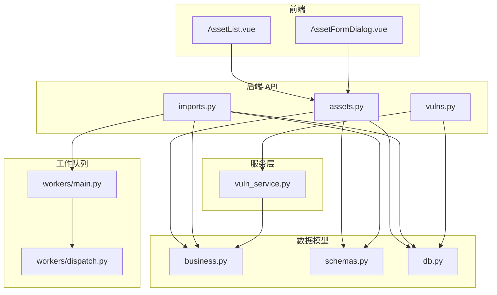
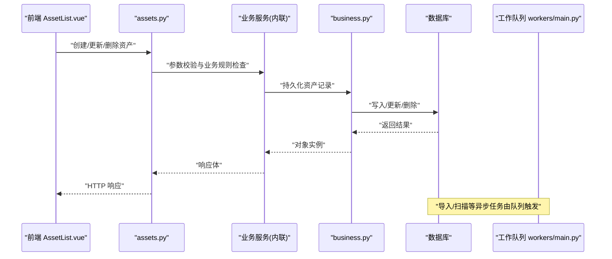
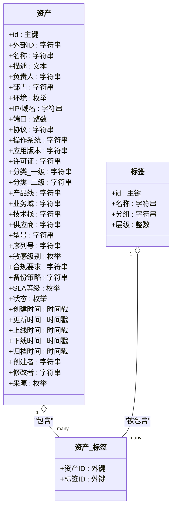
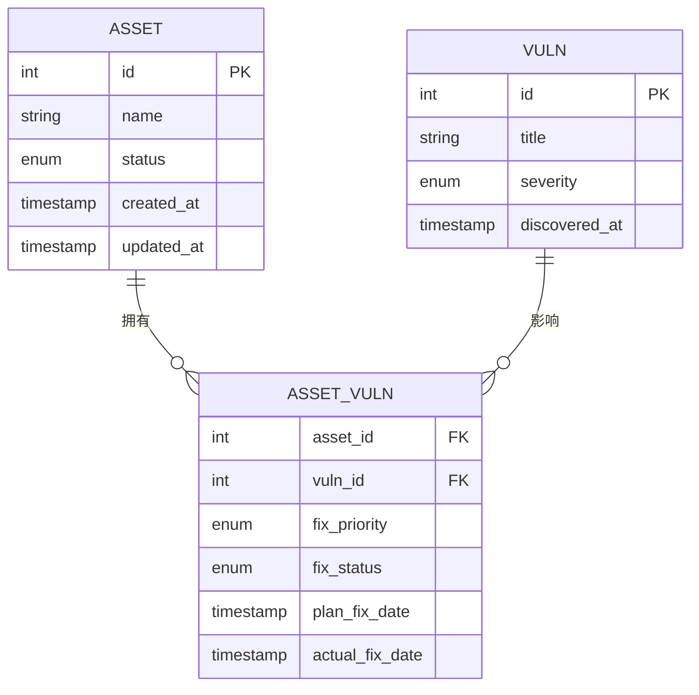
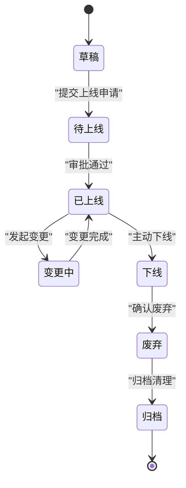
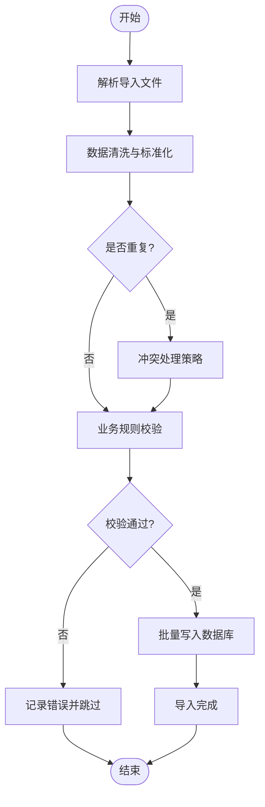
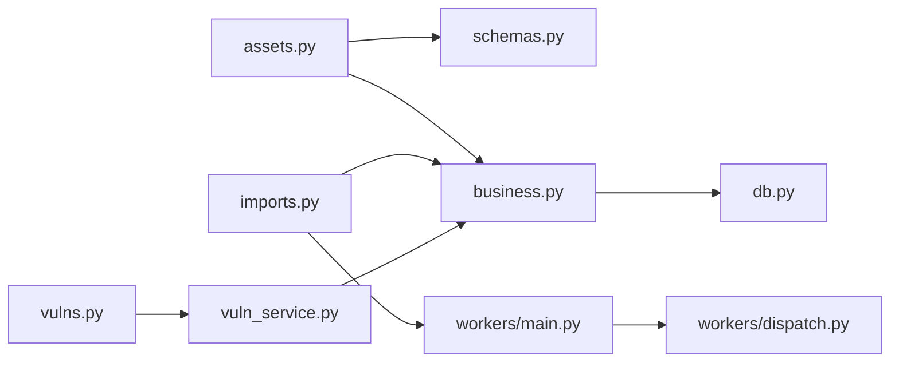

# 资产模型设计

<cite>
**本文引用的文件**   
- [backend/app/models/business.py](file://backend/app/models/business.py)
- [backend/app/api/v1/assets.py](file://backend/app/api/v1/assets.py)
- [backend/app/api/v1/imports.py](file://backend/app/api/v1/imports.py)
- [backend/app/schemas.py](file://backend/app/schemas.py)
- [backend/app/db.py](file://backend/app/db.py)
- [backend/app/workers/main.py](file://backend/app/workers/main.py)
- [backend/app/workers/dispatch.py](file://backend/app/workers/dispatch.py)
- [backend/app/services/vuln_service.py](file://backend/app/services/vuln_service.py)
- [backend/app/api/v1/vulns.py](file://backend/app/api/v1/vulns.py)
- [frontend/src/views/AssetList.vue](file://frontend/src/views/AssetList.vue)
- [frontend/src/components/AssetFormDialog.vue](file://frontend/src/components/AssetFormDialog.vue)
</cite>

## 目录
1. [简介](#简介)
2. [项目结构](#项目结构)
3. [核心组件](#核心组件)
4. [架构总览](#架构总览)
5. [详细组件分析](#详细组件分析)
6. [依赖关系分析](#依赖关系分析)
7. [性能考虑](#性能考虑)
8. [故障排查指南](#故障排查指南)
9. [结论](#结论)
10. [附录](#附录)

## 简介
本文件围绕“资产模型”进行系统化文档化，覆盖资产表的结构定义（标识信息、业务属性、分类体系、标签系统）、资产与漏洞的关联关系、生命周期与状态跟踪、完整性约束与一致性保证、导入/更新/删除的数据处理流程，以及查询优化策略与索引设计建议。目标是让具备不同技术背景的读者都能理解并正确使用该模型。

## 项目结构
后端采用 FastAPI + SQLAlchemy 的典型分层：
- API 层：路由与请求校验
- 服务层：业务逻辑编排
- 数据模型层：ORM 模型与数据库迁移
- 工作队列：异步任务调度与执行
- 前端：Vue + TypeScript，提供资产列表与表单交互

图表来源
- [backend/app/api/v1/assets.py](file://backend/app/api/v1/assets.py)
- [backend/app/api/v1/imports.py](file://backend/app/api/v1/imports.py)
- [backend/app/api/v1/vulns.py](file://backend/app/api/v1/vulns.py)
- [backend/app/services/vuln_service.py](file://backend/app/services/vuln_service.py)
- [backend/app/models/business.py](file://backend/app/models/business.py)
- [backend/app/schemas.py](file://backend/app/schemas.py)
- [backend/app/db.py](file://backend/app/db.py)
- [backend/app/workers/main.py](file://backend/app/workers/main.py)
- [backend/app/workers/dispatch.py](file://backend/app/workers/dispatch.py)

章节来源
- [backend/app/models/business.py](file://backend/app/models/business.py)
- [backend/app/api/v1/assets.py](file://backend/app/api/v1/assets.py)
- [backend/app/api/v1/imports.py](file://backend/app/api/v1/imports.py)
- [backend/app/schemas.py](file://backend/app/schemas.py)
- [backend/app/db.py](file://backend/app/db.py)
- [backend/app/workers/main.py](file://backend/app/workers/main.py)
- [backend/app/workers/dispatch.py](file://backend/app/workers/dispatch.py)
- [backend/app/services/vuln_service.py](file://backend/app/services/vuln_service.py)
- [backend/app/api/v1/vulns.py](file://backend/app/api/v1/vulns.py)
- [frontend/src/views/AssetList.vue](file://frontend/src/views/AssetList.vue)
- [frontend/src/components/AssetFormDialog.vue](file://frontend/src/components/AssetFormDialog.vue)

## 核心组件
- 资产模型（ORM）：定义资产主表字段、约束与关系映射，包括标识、业务属性、分类、标签等。
- 资产 API：提供资产的增删改查接口，负责入参校验与事务控制。
- 导入服务：批量导入资产，支持去重、冲突处理与回滚。
- 资产-漏洞关联：通过中间表或外键建立多对多/一对多关系，支撑风险统计与联动展示。
- 工作队列：异步处理导入、扫描结果入库、指标计算等耗时操作。
- 前端视图：资产列表与编辑表单，驱动 API 调用与状态同步。

章节来源
- [backend/app/models/business.py](file://backend/app/models/business.py)
- [backend/app/api/v1/assets.py](file://backend/app/api/v1/assets.py)
- [backend/app/api/v1/imports.py](file://backend/app/api/v1/imports.py)
- [backend/app/services/vuln_service.py](file://backend/app/services/vuln_service.py)
- [backend/app/workers/main.py](file://backend/app/workers/main.py)
- [backend/app/workers/dispatch.py](file://backend/app/workers/dispatch.py)
- [frontend/src/views/AssetList.vue](file://frontend/src/views/AssetList.vue)
- [frontend/src/components/AssetFormDialog.vue](file://frontend/src/components/AssetFormDialog.vue)

## 架构总览
资产模型贯穿“前端界面 → API → 服务 → ORM → 数据库”，并通过工作队列处理异步任务。资产与漏洞的关联由服务层协调，确保数据一致性与审计可追溯。

图表来源
- [backend/app/api/v1/assets.py](file://backend/app/api/v1/assets.py)
- [backend/app/models/business.py](file://backend/app/models/business.py)
- [backend/app/workers/main.py](file://backend/app/workers/main.py)

## 详细组件分析

### 资产模型（ORM）结构
- 标识信息
  - 唯一标识：建议使用自增主键或 UUID，确保全局唯一且不可变。
  - 外部引用：可选字段用于对接第三方系统的 ID，便于溯源。
- 业务属性
  - 名称、描述、负责人、部门、环境（生产/测试/预发）、地域/机房、IP/域名、端口、协议、操作系统、应用版本、许可证信息等。
  - 敏感级别、合规要求、备份策略、SLA 等级等。
- 分类体系
  - 一级/二级分类、产品线、业务域、技术栈、供应商/厂商、型号/序列号等。
  - 可通过枚举或字典表实现，便于统一维护与扩展。
- 标签系统
  - 多对多标签：支持动态标签，便于灵活筛选与聚合。
  - 标签分组与层级：可按组织维度划分，避免命名冲突。
- 生命周期与状态
  - 状态机：草稿、待上线、已上线、变更中、下线、废弃、归档等。
  - 时间戳：创建、更新时间、上线时间、下线时间、归档时间等。
- 审计与追踪
  - 创建者、修改者、来源（手动录入/导入/自动发现）。
  - 变更记录：关键属性变更历史快照或增量日志。

图表来源
- [backend/app/models/business.py](file://backend/app/models/business.py)

章节来源
- [backend/app/models/business.py](file://backend/app/models/business.py)

### 资产与漏洞的关联关系
- 关联模式
  - 多对多：一个资产存在多个漏洞，一个漏洞影响多个资产。
  - 中间表：记录资产ID、漏洞ID、发现时间、修复优先级、修复状态、责任人、计划修复时间、实际修复时间等。
- 风险聚合
  - 按资产维度汇总漏洞数量、严重等级分布、修复率、平均修复时长等。
- 联动更新
  - 漏洞修复后，自动更新资产的风险评分与状态；必要时触发重新评估流程。

图表来源
- [backend/app/models/business.py](file://backend/app/models/business.py)
- [backend/app/services/vuln_service.py](file://backend/app/services/vuln_service.py)

章节来源
- [backend/app/services/vuln_service.py](file://backend/app/services/vuln_service.py)
- [backend/app/api/v1/vulns.py](file://backend/app/api/v1/vulns.py)

### 资产生命周期管理与状态跟踪
- 状态流转
  - 草稿 → 待上线 → 已上线 → 变更中 → 下线 → 废弃 → 归档
  - 每个状态转换需满足前置条件（如审批、配置校验、依赖检查）。
- 事件与审计
  - 每次状态变更记录操作人、原因、时间戳，形成审计轨迹。
- 自动化
  - 结合工作队列，定时巡检资产健康度与合规性，自动推进状态或告警。

图表来源
- [backend/app/models/business.py](file://backend/app/models/business.py)

章节来源
- [backend/app/models/business.py](file://backend/app/models/business.py)

### 数据完整性约束与业务规则验证
- 完整性约束
  - 必填字段：名称、环境、状态等。
  - 唯一性：名称+环境组合唯一，或外部ID唯一。
  - 外键约束：分类、标签、负责人等实体存在性校验。
- 业务规则
  - 状态转换合法性校验（如仅“已上线”允许变更）。
  - 资源可用性校验（IP/端口格式、端口范围、协议匹配）。
  - 合规性校验（敏感级别与备份策略、SLA 等级匹配）。
- 一致性保证
  - 使用数据库事务包裹导入/更新/删除操作，失败时回滚。
  - 并发控制：乐观锁（版本号）或行级锁，防止覆盖写。

章节来源
- [backend/app/api/v1/assets.py](file://backend/app/api/v1/assets.py)
- [backend/app/schemas.py](file://backend/app/schemas.py)
- [backend/app/db.py](file://backend/app/db.py)

### 资产导入、更新、删除数据处理流程
- 导入流程
  - 接收文件（CSV/Excel/JSON），解析为结构化数据。
  - 数据清洗：去重、格式标准化、枚举值映射。
  - 冲突处理：根据策略（跳过/覆盖/合并）处理重复记录。
  - 批量写入：分批插入，失败重试与错误报告。
  - 异步处理：通过工作队列执行，避免阻塞 API。
- 更新流程
  - 增量更新：仅更新变更字段，减少 IO。
  - 版本控制：记录变更历史，支持回滚。
- 删除流程
  - 软删除：标记状态为“废弃/归档”，保留审计。
  - 级联处理：清理关联数据（如临时缓存、索引）。

图表来源
- [backend/app/api/v1/imports.py](file://backend/app/api/v1/imports.py)
- [backend/app/workers/main.py](file://backend/app/workers/main.py)
- [backend/app/workers/dispatch.py](file://backend/app/workers/dispatch.py)

章节来源
- [backend/app/api/v1/imports.py](file://backend/app/api/v1/imports.py)
- [backend/app/workers/main.py](file://backend/app/workers/main.py)
- [backend/app/workers/dispatch.py](file://backend/app/workers/dispatch.py)

### 前端交互与数据绑定
- 资产列表
  - 分页、排序、筛选（分类、标签、状态、环境等）。
  - 批量操作：批量更新状态、批量打标签。
- 资产表单
  - 字段校验：必填、格式、范围。
  - 实时提示：重复检测、依赖冲突提示。
  - 提交反馈：成功/失败消息与错误定位。

章节来源
- [frontend/src/views/AssetList.vue](file://frontend/src/views/AssetList.vue)
- [frontend/src/components/AssetFormDialog.vue](file://frontend/src/components/AssetFormDialog.vue)

## 依赖关系分析
- 模块耦合
  - API 层依赖 schemas 进行入参校验，依赖 models 进行数据持久化。
  - 服务层封装复杂业务逻辑，隔离 API 与 ORM 的直接耦合。
  - 工作队列解耦耗时任务，提高 API 响应速度。
- 外部依赖
  - 数据库：SQLAlchemy 会话管理、连接池、事务控制。
  - 文件解析：CSV/Excel/JSON 解析库。
  - 消息队列：Celery/RQ 等（根据 workers 实现选择）。

图表来源
- [backend/app/api/v1/assets.py](file://backend/app/api/v1/assets.py)
- [backend/app/api/v1/imports.py](file://backend/app/api/v1/imports.py)
- [backend/app/api/v1/vulns.py](file://backend/app/api/v1/vulns.py)
- [backend/app/services/vuln_service.py](file://backend/app/services/vuln_service.py)
- [backend/app/models/business.py](file://backend/app/models/business.py)
- [backend/app/schemas.py](file://backend/app/schemas.py)
- [backend/app/db.py](file://backend/app/db.py)
- [backend/app/workers/main.py](file://backend/app/workers/main.py)
- [backend/app/workers/dispatch.py](file://backend/app/workers/dispatch.py)

章节来源
- [backend/app/api/v1/assets.py](file://backend/app/api/v1/assets.py)
- [backend/app/api/v1/imports.py](file://backend/app/api/v1/imports.py)
- [backend/app/api/v1/vulns.py](file://backend/app/api/v1/vulns.py)
- [backend/app/services/vuln_service.py](file://backend/app/services/vuln_service.py)
- [backend/app/models/business.py](file://backend/app/models/business.py)
- [backend/app/schemas.py](file://backend/app/schemas.py)
- [backend/app/db.py](file://backend/app/db.py)
- [backend/app/workers/main.py](file://backend/app/workers/main.py)
- [backend/app/workers/dispatch.py](file://backend/app/workers/dispatch.py)

## 性能考虑
- 查询优化
  - 常用过滤字段加索引：环境、状态、分类、标签、IP/域名。
  - 复合索引：环境+状态、分类+产品线、标签+状态。
  - 全文检索：名称、描述、备注等字段使用搜索引擎（Elasticsearch）或数据库全文索引。
- 读写分离
  - 读多写少场景下，启用只读副本分担查询压力。
- 缓存策略
  - 热点数据（分类、标签字典）缓存到 Redis，降低数据库访问。
  - 列表页分页结果短期缓存，提升加载速度。
- 批量操作
  - 导入/更新采用批量插入与 UPSERT，减少往返次数。
  - 大事务拆分小批次，避免锁竞争与内存溢出。
- 异步处理
  - 耗时任务（导入、扫描、报表生成）放入队列，非阻塞响应。

[本节为通用指导，不直接分析具体文件]

## 故障排查指南
- 导入失败
  - 检查文件格式与编码，确认必填字段与枚举值正确。
  - 查看错误日志，定位冲突记录与失败原因。
  - 重试机制：失败记录单独输出，支持局部重试。
- 状态异常
  - 检查状态转换规则与前置条件，确认权限与审批流。
  - 审计日志：查看最近一次变更的操作人与原因。
- 关联不一致
  - 校验资产-漏洞中间表的外键约束，修复孤儿记录。
  - 重新计算风险指标，确保与最新漏洞状态一致。
- 性能问题
  - 慢查询分析：定位未命中索引的 SQL，补充索引或改写查询。
  - 连接池监控：观察连接数与等待时间，调整池大小。

章节来源
- [backend/app/api/v1/imports.py](file://backend/app/api/v1/imports.py)
- [backend/app/models/business.py](file://backend/app/models/business.py)
- [backend/app/db.py](file://backend/app/db.py)

## 结论
资产模型以清晰的字段定义、严格的约束与灵活的分类/标签体系为基础，配合完善的生命周期管理与审计追踪，支撑了资产全生命周期的数字化管理。通过工作队列与缓存策略，系统在导入与查询性能上具备良好表现。建议在后续迭代中持续优化索引设计与查询路径，完善风险聚合与自动化运维能力。

[本节为总结性内容，不直接分析具体文件]

## 附录
- 术语表
  - 资产：可被管理的 IT 资源实体，如服务器、应用、数据库等。
  - 标签：用于分类与筛选的元数据，支持多级与分组。
  - 状态机：描述资产生命周期各状态的转换规则。
- 参考实现
  - 资产 CRUD：assets.py
  - 导入流程：imports.py 与 workers
  - 漏洞关联：vuln_service.py 与 vulns.py
  - 数据模型：business.py
  - 请求校验：schemas.py
  - 数据库会话：db.py

[本节为补充信息，不直接分析具体文件]