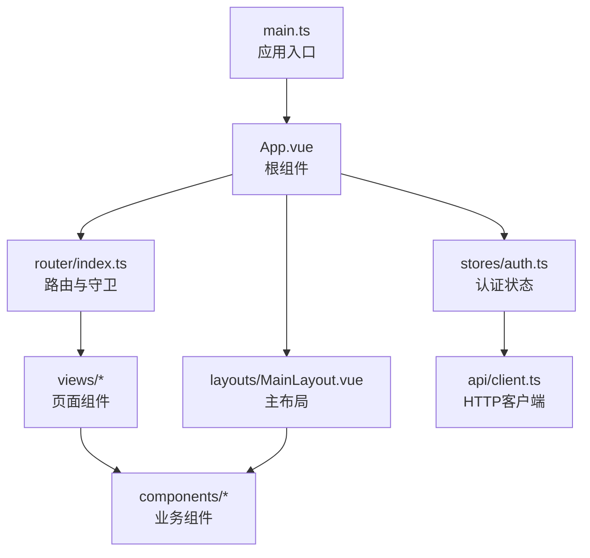
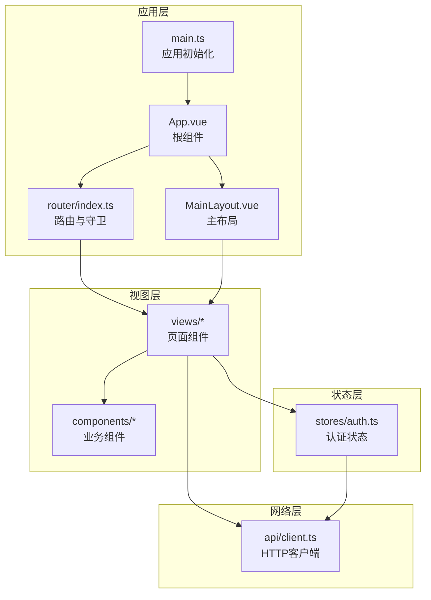
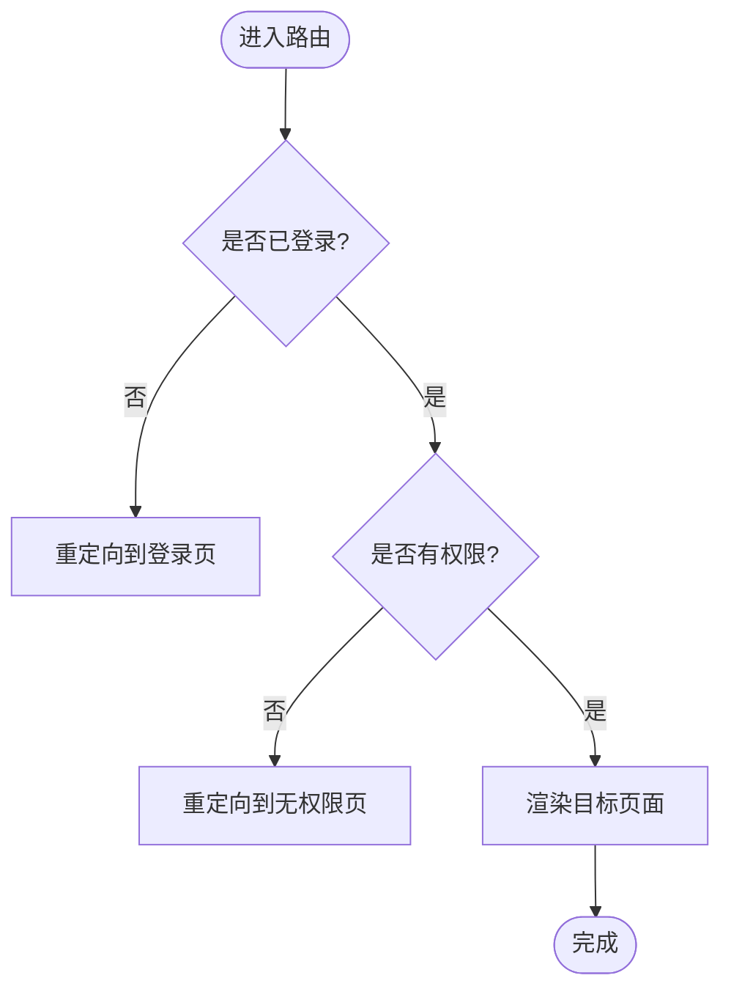
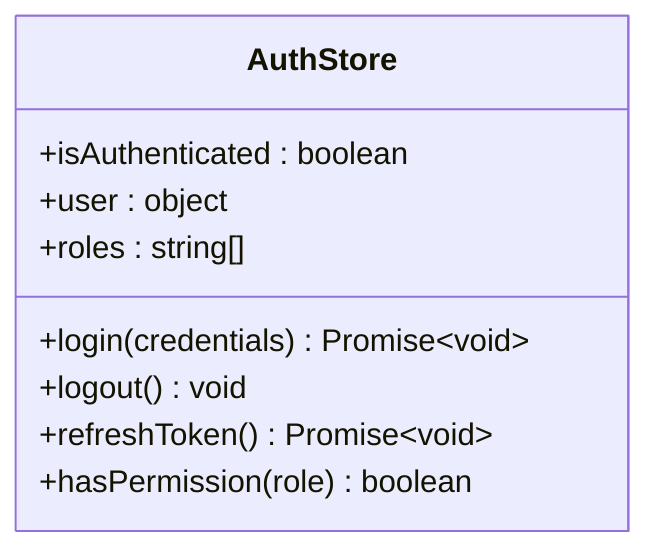
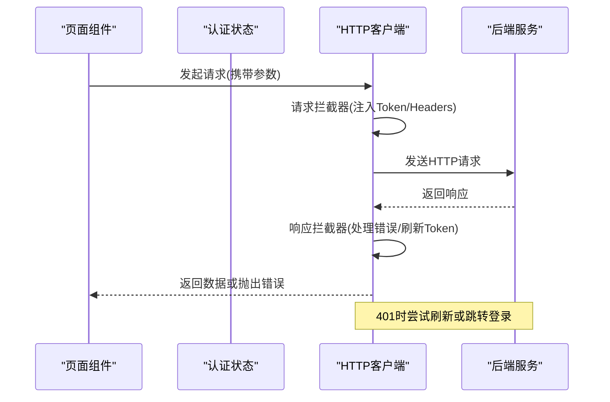
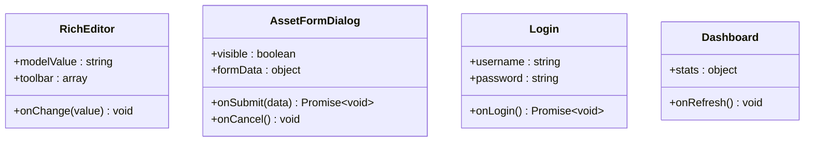
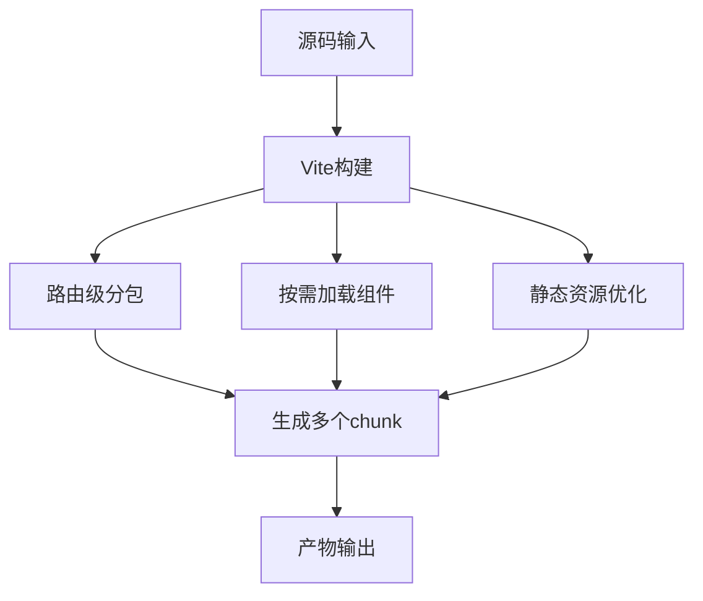
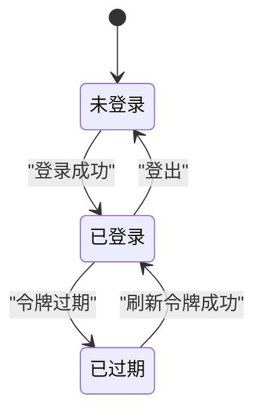
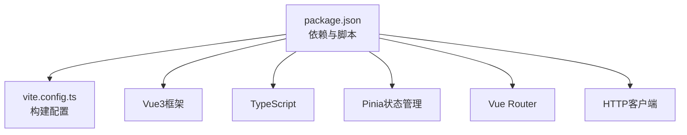

# 前端架构

<cite>
**本文引用的文件**   
- [frontend/src/main.ts](file://frontend/src/main.ts)
- [frontend/src/App.vue](file://frontend/src/App.vue)
- [frontend/src/router/index.ts](file://frontend/src/router/index.ts)
- [frontend/src/layouts/MainLayout.vue](file://frontend/src/layouts/MainLayout.vue)
- [frontend/src/stores/auth.ts](file://frontend/src/stores/auth.ts)
- [frontend/src/api/client.ts](file://frontend/src/api/client.ts)
- [frontend/src/views/Login.vue](file://frontend/src/views/Login.vue)
- [frontend/src/views/Dashboard.vue](file://frontend/src/views/Dashboard.vue)
- [frontend/src/components/RichEditor.vue](file://frontend/src/components/RichEditor.vue)
- [frontend/src/components/AssetFormDialog.vue](file://frontend/src/components/AssetFormDialog.vue)
- [frontend/vite.config.ts](file://frontend/vite.config.ts)
- [frontend/package.json](file://frontend/package.json)
</cite>

## 目录
1. [简介](#简介)
2. [项目结构](#项目结构)
3. [核心组件](#核心组件)
4. [架构总览](#架构总览)
5. [详细组件分析](#详细组件分析)
6. [依赖关系分析](#依赖关系分析)
7. [性能考虑](#性能考虑)
8. [故障排查指南](#故障排查指南)
9. [结论](#结论)
10. [附录](#附录)

## 简介
本文件面向Talos前端工程，系统性梳理基于Vue3 + TypeScript + Vite的单页应用(SPA)架构。内容涵盖路由与页面组织、状态管理(Pinia)、API客户端封装与HTTP拦截器、组件化与UI库集成、构建优化与代码分割、以及安全相关实现（JWT令牌管理与权限控制）。文档同时提供组件层次图与状态流转图，帮助读者快速理解并高效扩展系统。

## 项目结构
前端采用按功能域划分的目录组织方式：
- src/main.ts：应用入口，初始化Vue实例、插件与全局配置
- src/App.vue：根组件，承载布局与路由出口
- src/router/index.ts：路由定义与导航守卫
- src/layouts/MainLayout.vue：主布局容器
- src/stores/auth.ts：认证状态Pinia Store
- src/api/client.ts：HTTP客户端封装与请求/响应拦截
- src/views/*：页面级视图组件
- src/components/*：可复用业务组件
- vite.config.ts：Vite构建配置（含代理、分包策略等）
- package.json：依赖与脚本

**图表来源** 
- [frontend/src/main.ts](file://frontend/src/main.ts)
- [frontend/src/App.vue](file://frontend/src/App.vue)
- [frontend/src/router/index.ts](file://frontend/src/router/index.ts)
- [frontend/src/layouts/MainLayout.vue](file://frontend/src/layouts/MainLayout.vue)
- [frontend/src/stores/auth.ts](file://frontend/src/stores/auth.ts)
- [frontend/src/api/client.ts](file://frontend/src/api/client.ts)

**章节来源**
- [frontend/src/main.ts](file://frontend/src/main.ts)
- [frontend/src/App.vue](file://frontend/src/App.vue)
- [frontend/src/router/index.ts](file://frontend/src/router/index.ts)
- [frontend/src/layouts/MainLayout.vue](file://frontend/src/layouts/MainLayout.vue)
- [frontend/src/stores/auth.ts](file://frontend/src/stores/auth.ts)
- [frontend/src/api/client.ts](file://frontend/src/api/client.ts)

## 核心组件
- 应用入口与初始化：在入口文件中完成Vue实例创建、插件注册（如路由、状态管理）、样式与全局配置挂载。
- 根组件与布局：根组件负责挂载路由出口与全局布局；主布局统一侧边栏、头部、内容区与消息通知区域。
- 路由与导航：集中式路由表，配合导航守卫实现鉴权与访问控制。
- 状态管理：使用Pinia管理认证态、用户信息、权限集合等全局状态。
- API客户端：统一的HTTP客户端封装，内置请求/响应拦截器，处理Token注入、错误码统一处理与重试策略。
- 页面与组件：页面组件聚焦数据加载与交互编排；通用组件聚焦展示与表单行为。

**章节来源**
- [frontend/src/main.ts](file://frontend/src/main.ts)
- [frontend/src/App.vue](file://frontend/src/App.vue)
- [frontend/src/router/index.ts](file://frontend/src/router/index.ts)
- [frontend/src/layouts/MainLayout.vue](file://frontend/src/layouts/MainLayout.vue)
- [frontend/src/stores/auth.ts](file://frontend/src/stores/auth.ts)
- [frontend/src/api/client.ts](file://frontend/src/api/client.ts)

## 架构总览
下图展示了前端整体架构与关键模块的交互关系，包括路由、布局、状态、API客户端与页面/组件之间的调用路径。

**图表来源** 
- [frontend/src/main.ts](file://frontend/src/main.ts)
- [frontend/src/App.vue](file://frontend/src/App.vue)
- [frontend/src/router/index.ts](file://frontend/src/router/index.ts)
- [frontend/src/layouts/MainLayout.vue](file://frontend/src/layouts/MainLayout.vue)
- [frontend/src/stores/auth.ts](file://frontend/src/stores/auth.ts)
- [frontend/src/api/client.ts](file://frontend/src/api/client.ts)

## 详细组件分析

### 路由与页面组织
- 路由定义：集中式路由表，包含登录、仪表盘、资产、漏洞、报告、导入等模块的路径与组件映射。
- 导航守卫：在路由进入前校验认证态与权限，未登录或无权限时重定向至登录或403页面。
- 页面组件：每个业务模块一个或多个页面组件，负责数据获取、表单提交与结果展示。

**图表来源** 
- [frontend/src/router/index.ts](file://frontend/src/router/index.ts)
- [frontend/src/stores/auth.ts](file://frontend/src/stores/auth.ts)

**章节来源**
- [frontend/src/router/index.ts](file://frontend/src/router/index.ts)
- [frontend/src/views/Login.vue](file://frontend/src/views/Login.vue)
- [frontend/src/views/Dashboard.vue](file://frontend/src/views/Dashboard.vue)

### 状态管理（Pinia）
- 认证状态：存储用户身份、令牌、过期时间与权限集合，提供登录、登出、刷新令牌等方法。
- 状态持久化：将关键状态持久化到本地存储，提升刷新后的用户体验。
- 跨组件共享：通过useAuth组合式API在各组件中读取与更新认证状态。

**图表来源** 
- [frontend/src/stores/auth.ts](file://frontend/src/stores/auth.ts)

**章节来源**
- [frontend/src/stores/auth.ts](file://frontend/src/stores/auth.ts)

### API客户端与HTTP拦截器
- 客户端封装：统一请求方法、基础URL、超时与重试策略。
- 请求拦截器：自动注入Authorization头（JWT），附加追踪ID与时间戳。
- 响应拦截器：统一处理成功与失败分支，对401进行令牌刷新或强制登出，对业务错误码进行提示。
- 错误处理：将后端错误转换为前端友好提示，支持全局错误收集与上报。

**图表来源** 
- [frontend/src/api/client.ts](file://frontend/src/api/client.ts)
- [frontend/src/stores/auth.ts](file://frontend/src/stores/auth.ts)

**章节来源**
- [frontend/src/api/client.ts](file://frontend/src/api/client.ts)
- [frontend/src/stores/auth.ts](file://frontend/src/stores/auth.ts)

### 组件化开发与UI库集成
- 组件分层：页面组件负责编排与数据流；业务组件负责具体交互与展示。
- UI库集成：通过主题与样式变量统一风格，按需引入组件以提升打包体积。
- 富文本编辑器：RichEditor组件封装常用编辑能力，提供工具栏与内容同步。
- 表单弹窗：AssetFormDialog组件封装资产新增/编辑流程，支持校验与回调。

**图表来源** 
- [frontend/src/components/RichEditor.vue](file://frontend/src/components/RichEditor.vue)
- [frontend/src/components/AssetFormDialog.vue](file://frontend/src/components/AssetFormDialog.vue)
- [frontend/src/views/Login.vue](file://frontend/src/views/Login.vue)
- [frontend/src/views/Dashboard.vue](file://frontend/src/views/Dashboard.vue)

**章节来源**
- [frontend/src/components/RichEditor.vue](file://frontend/src/components/RichEditor.vue)
- [frontend/src/components/AssetFormDialog.vue](file://frontend/src/components/AssetFormDialog.vue)
- [frontend/src/views/Login.vue](file://frontend/src/views/Login.vue)
- [frontend/src/views/Dashboard.vue](file://frontend/src/views/Dashboard.vue)

### 构建优化与代码分割
- 分包策略：按路由与模块维度拆分chunk，减少首屏体积。
- 懒加载：页面组件与大型第三方库按需加载，提升初始渲染速度。
- 资源优化：静态资源压缩、图片优化与缓存策略配置。
- 开发体验：热更新、类型检查与ESLint规则集成。

**图表来源** 
- [frontend/vite.config.ts](file://frontend/vite.config.ts)
- [frontend/package.json](file://frontend/package.json)

**章节来源**
- [frontend/vite.config.ts](file://frontend/vite.config.ts)
- [frontend/package.json](file://frontend/package.json)

### 安全相关实现（JWT与权限）
- 令牌管理：登录成功后保存JWT，设置过期时间，支持自动刷新。
- 权限控制：基于角色/权限的访问控制，结合路由守卫与组件级指令。
- 安全最佳实践：避免敏感信息泄露，启用HTTPS，限制CORS与CSRF防护。

**图表来源** 
- [frontend/src/stores/auth.ts](file://frontend/src/stores/auth.ts)
- [frontend/src/api/client.ts](file://frontend/src/api/client.ts)

**章节来源**
- [frontend/src/stores/auth.ts](file://frontend/src/stores/auth.ts)
- [frontend/src/api/client.ts](file://frontend/src/api/client.ts)

## 依赖关系分析
前端依赖主要由Vue生态与构建工具组成，包括Vue3、TypeScript、Vite、Pinia、路由与HTTP客户端等。依赖版本与脚本命令由package.json统一管理。

**图表来源** 
- [frontend/package.json](file://frontend/package.json)
- [frontend/vite.config.ts](file://frontend/vite.config.ts)

**章节来源**
- [frontend/package.json](file://frontend/package.json)
- [frontend/vite.config.ts](file://frontend/vite.config.ts)

## 性能考虑
- 首屏优化：路由级懒加载、关键CSS内联、字体与图标按需加载。
- 运行时优化：虚拟列表、防抖节流、请求合并与缓存。
- 监控与诊断：错误上报、性能指标采集与日志记录。
- 构建产物：Tree-shaking、代码压缩与资源哈希缓存。

[本节为通用指导，不直接分析具体文件]

## 故障排查指南
- 登录异常：检查认证状态与令牌有效性，确认后端接口可达与CORS配置。
- 权限问题：核对路由守卫与组件级权限逻辑，确认用户角色与权限集合。
- 网络错误：查看HTTP拦截器的错误处理分支，定位具体错误码与提示信息。
- 构建失败：检查依赖版本冲突与TS类型错误，清理缓存后重试。

**章节来源**
- [frontend/src/stores/auth.ts](file://frontend/src/stores/auth.ts)
- [frontend/src/api/client.ts](file://frontend/src/api/client.ts)
- [frontend/src/router/index.ts](file://frontend/src/router/index.ts)

## 结论
Talos前端以Vue3 + TypeScript + Vite为核心技术栈，采用模块化与组件化设计，结合Pinia与统一HTTP客户端实现清晰的状态管理与网络层抽象。通过路由守卫与权限控制保障安全性，借助构建优化与懒加载提升性能。该架构具备良好的可扩展性与可维护性，适合持续迭代与安全加固。

[本节为总结性内容，不直接分析具体文件]

## 附录
- 术语说明：SPA、Pinia、JWT、CORS、Tree-shaking等
- 参考链接：官方文档与最佳实践

[本节为补充信息，不直接分析具体文件]