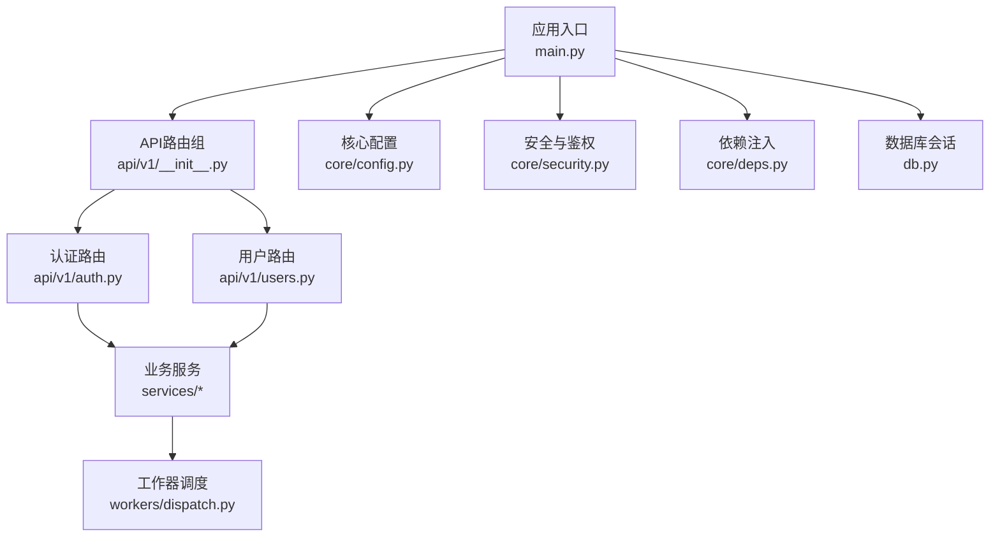
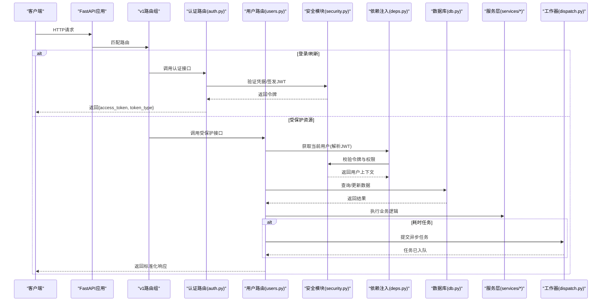
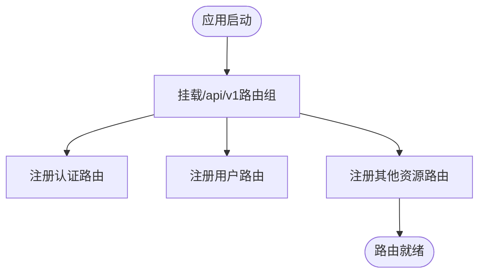
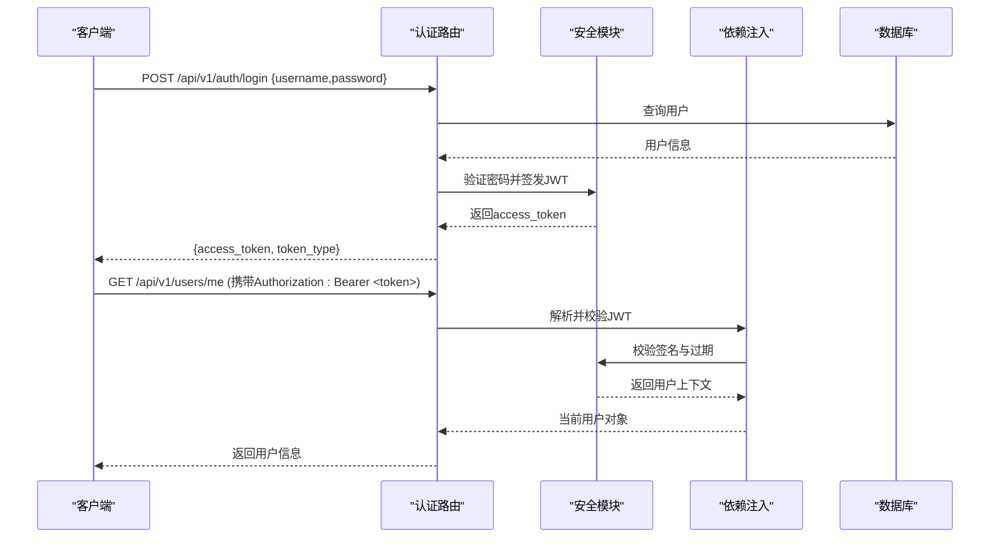
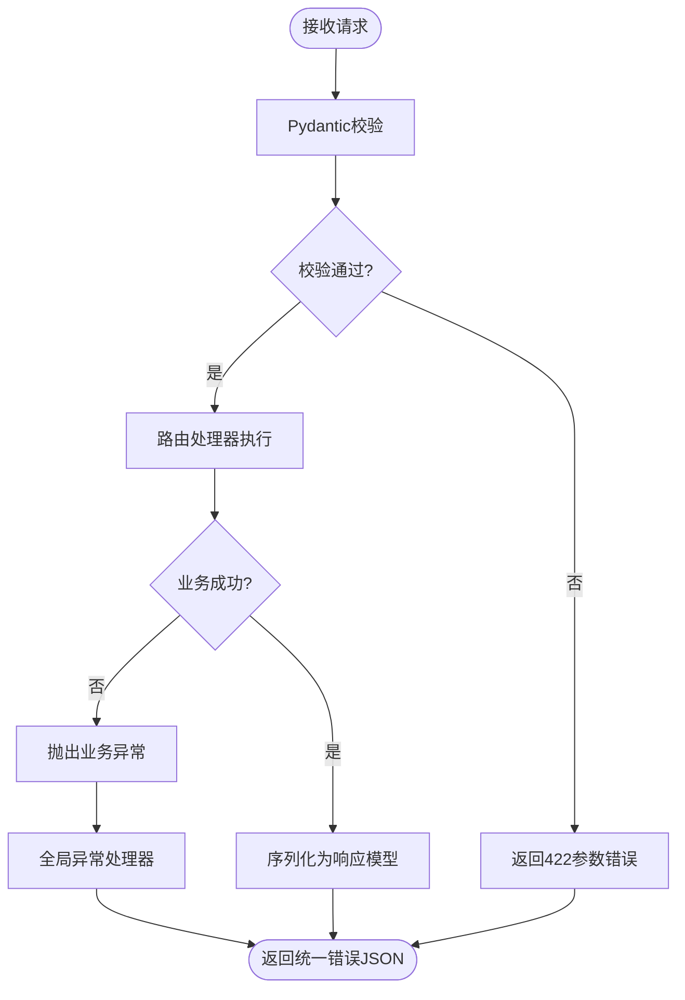
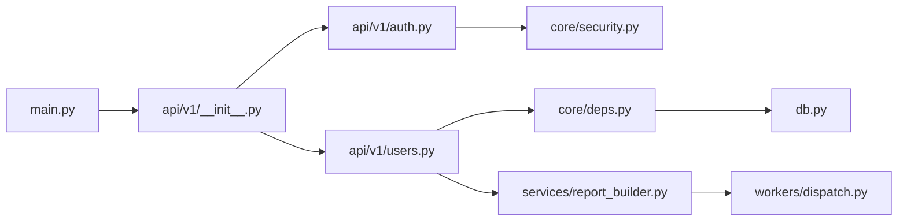

# API设计架构

<cite>
**本文引用的文件**   
- [backend/app/main.py](file://backend/app/main.py)
- [backend/app/api/v1/__init__.py](file://backend/app/api/v1/__init__.py)
- [backend/app/api/v1/auth.py](file://backend/app/api/v1/auth.py)
- [backend/app/api/v1/users.py](file://backend/app/api/v1/users.py)
- [backend/app/core/config.py](file://backend/app/core/config.py)
- [backend/app/core/security.py](file://backend/app/core/security.py)
- [backend/app/core/deps.py](file://backend/app/core/deps.py)
- [backend/app/schemas.py](file://backend/app/schemas.py)
- [backend/app/db.py](file://backend/app/db.py)
- [backend/app/models/user.py](file://backend/app/models/user.py)
- [backend/app/services/report_builder.py](file://backend/app/services/report_builder.py)
- [backend/app/workers/dispatch.py](file://backend/app/workers/dispatch.py)
- [backend/requirements.txt](file://backend/requirements.txt)
</cite>

## 目录
1. [简介](#简介)
2. [项目结构](#项目结构)
3. [核心组件](#核心组件)
4. [架构总览](#架构总览)
5. [详细组件分析](#详细组件分析)
6. [依赖关系分析](#依赖关系分析)
7. [性能考虑](#性能考虑)
8. [故障排查指南](#故障排查指南)
9. [结论](#结论)
10. [附录](#附录)

## 简介
本文件面向Talos后端API的设计与实现，聚焦FastAPI路由组织、API版本管理、请求处理流程、中间件配置、RESTful规范、认证授权（JWT）、文档自动生成（OpenAPI/Swagger）、统一验证与错误处理模式。通过分层解析与可视化图示，帮助读者快速理解并扩展系统。

## 项目结构
后端采用按功能域划分的模块化结构：
- app/main.py：应用入口、全局中间件、CORS、挂载API路由、启动参数
- app/api/v1：API v1路由集合，按资源划分模块（auth、users等）
- app/core：配置、安全、依赖注入等横切能力
- app/models：数据库模型
- app/schemas：Pydantic数据模型（请求/响应）
- app/services：业务服务层
- app/workers：异步任务调度
- app/db.py：数据库连接与会话管理

图表来源
- [backend/app/main.py](file://backend/app/main.py)
- [backend/app/api/v1/__init__.py](file://backend/app/api/v1/__init__.py)
- [backend/app/api/v1/auth.py](file://backend/app/api/v1/auth.py)
- [backend/app/api/v1/users.py](file://backend/app/api/v1/users.py)
- [backend/app/core/config.py](file://backend/app/core/config.py)
- [backend/app/core/security.py](file://backend/app/core/security.py)
- [backend/app/core/deps.py](file://backend/app/core/deps.py)
- [backend/app/db.py](file://backend/app/db.py)
- [backend/app/services/report_builder.py](file://backend/app/services/report_builder.py)
- [backend/app/workers/dispatch.py](file://backend/app/workers/dispatch.py)

章节来源
- [backend/app/main.py](file://backend/app/main.py)
- [backend/app/api/v1/__init__.py](file://backend/app/api/v1/__init__.py)

## 核心组件
- FastAPI应用与中间件：在应用入口中注册CORS、异常处理器、日志、监控等中间件，统一跨域与安全策略。
- API版本管理：通过前缀将v1路由挂载到/api/v1，便于后续演进至v2而不破坏兼容。
- 依赖注入：使用FastAPI的Depends提供数据库会话、当前用户、权限校验等共享能力。
- 安全与认证：基于JWT的令牌签发与校验，结合依赖注入完成用户身份解析与权限控制。
- 数据模型与序列化：Pydantic schemas定义请求体与响应结构，自动完成校验与序列化。
- 数据库访问：集中式会话管理，配合Alembic进行迁移。
- 服务层与工作器：复杂或耗时操作下沉至服务层与异步任务队列，避免阻塞HTTP请求。

章节来源
- [backend/app/main.py](file://backend/app/main.py)
- [backend/app/core/deps.py](file://backend/app/core/deps.py)
- [backend/app/core/security.py](file://backend/app/core/security.py)
- [backend/app/schemas.py](file://backend/app/schemas.py)
- [backend/app/db.py](file://backend/app/db.py)

## 架构总览
下图展示从客户端请求到响应返回的关键路径，包括认证、鉴权、业务处理与异步任务。

图表来源
- [backend/app/main.py](file://backend/app/main.py)
- [backend/app/api/v1/__init__.py](file://backend/app/api/v1/__init__.py)
- [backend/app/api/v1/auth.py](file://backend/app/api/v1/auth.py)
- [backend/app/api/v1/users.py](file://backend/app/api/v1/users.py)
- [backend/app/core/security.py](file://backend/app/core/security.py)
- [backend/app/core/deps.py](file://backend/app/core/deps.py)
- [backend/app/db.py](file://backend/app/db.py)
- [backend/app/services/report_builder.py](file://backend/app/services/report_builder.py)
- [backend/app/workers/dispatch.py](file://backend/app/workers/dispatch.py)

## 详细组件分析

### API版本管理与路由组织
- 版本策略：所有公开API以/api/v1为前缀，便于未来平滑升级到v2。
- 路由组织：按资源拆分模块（auth、users等），在v1聚合挂载，保持高内聚低耦合。
- 挂载方式：在应用入口集中挂载各子路由，确保统一的中间件与异常处理生效。

图表来源
- [backend/app/main.py](file://backend/app/main.py)
- [backend/app/api/v1/__init__.py](file://backend/app/api/v1/__init__.py)

章节来源
- [backend/app/main.py](file://backend/app/main.py)
- [backend/app/api/v1/__init__.py](file://backend/app/api/v1/__init__.py)

### RESTful API设计规范
- 资源命名：使用名词复数形式作为资源标识，如/users、/assets、/reports。
- HTTP方法：GET读取、POST创建、PUT全量更新、PATCH部分更新、DELETE删除。
- 状态码：遵循标准语义，如200成功、201创建、400参数错误、401未认证、403无权限、404不存在、500服务器错误。
- 错误响应格式：统一JSON结构，包含code、message、detail等字段，便于前端一致处理。
- 分页与过滤：列表接口支持分页参数与过滤条件，返回元数据与数据数组。

章节来源
- [backend/app/api/v1/auth.py](file://backend/app/api/v1/auth.py)
- [backend/app/api/v1/users.py](file://backend/app/api/v1/users.py)
- [backend/app/schemas.py](file://backend/app/schemas.py)

### 认证与授权机制（JWT）
- 登录流程：客户端提交用户名/密码，服务端校验后签发JWT访问令牌。
- 令牌校验：受保护接口通过依赖注入解析Authorization头中的Bearer令牌，校验签名与过期时间。
- 权限控制：基于角色或资源的细粒度权限检查，未通过则返回403。
- 会话管理：无状态设计，令牌即会话；必要时可结合黑名单或短期令牌+刷新令牌策略。

图表来源
- [backend/app/api/v1/auth.py](file://backend/app/api/v1/auth.py)
- [backend/app/core/security.py](file://backend/app/core/security.py)
- [backend/app/core/deps.py](file://backend/app/core/deps.py)
- [backend/app/db.py](file://backend/app/db.py)

章节来源
- [backend/app/api/v1/auth.py](file://backend/app/api/v1/auth.py)
- [backend/app/core/security.py](file://backend/app/core/security.py)
- [backend/app/core/deps.py](file://backend/app/core/deps.py)

### 请求验证、数据序列化与异常处理
- 请求验证：使用Pydantic schemas对请求体、查询参数、路径参数进行强类型校验，自动返回422错误。
- 数据序列化：响应模型统一封装，确保字段可见性与默认值。
- 异常处理：全局异常处理器捕获业务异常与系统异常，转换为统一JSON格式。

图表来源
- [backend/app/schemas.py](file://backend/app/schemas.py)
- [backend/app/main.py](file://backend/app/main.py)

章节来源
- [backend/app/schemas.py](file://backend/app/schemas.py)
- [backend/app/main.py](file://backend/app/main.py)

### 数据库与会话管理
- 会话工厂：集中创建与关闭数据库会话，确保每次请求独立事务。
- 依赖注入：通过Depends提供session给各路由与服务，避免重复初始化。
- 迁移管理：使用Alembic进行数据库版本管理，保证结构变更可追溯。

章节来源
- [backend/app/db.py](file://backend/app/db.py)
- [backend/app/core/deps.py](file://backend/app/core/deps.py)

### 服务层与工作器
- 服务层：将复杂业务逻辑抽离到services，提高可测试性与复用性。
- 异步任务：耗时操作（如报告生成、导入导出）通过工作器调度，避免阻塞HTTP响应。

章节来源
- [backend/app/services/report_builder.py](file://backend/app/services/report_builder.py)
- [backend/app/workers/dispatch.py](file://backend/app/workers/dispatch.py)

## 依赖关系分析
- 外部依赖：FastAPI、Uvicorn、Pydantic、SQLAlchemy、Alembic、JWT库等。
- 内部依赖：路由依赖安全与依赖注入模块；服务依赖数据库与会话；工作器依赖消息队列或后台任务框架。

图表来源
- [backend/app/main.py](file://backend/app/main.py)
- [backend/app/api/v1/__init__.py](file://backend/app/api/v1/__init__.py)
- [backend/app/api/v1/auth.py](file://backend/app/api/v1/auth.py)
- [backend/app/api/v1/users.py](file://backend/app/api/v1/users.py)
- [backend/app/core/security.py](file://backend/app/core/security.py)
- [backend/app/core/deps.py](file://backend/app/core/deps.py)
- [backend/app/db.py](file://backend/app/db.py)
- [backend/app/services/report_builder.py](file://backend/app/services/report_builder.py)
- [backend/app/workers/dispatch.py](file://backend/app/workers/dispatch.py)

章节来源
- [backend/requirements.txt](file://backend/requirements.txt)

## 性能考虑
- 连接池与超时：合理配置数据库连接池大小与超时，避免连接耗尽。
- 缓存策略：热点数据使用内存缓存（如Redis）降低数据库压力。
- 异步化：I/O密集型与CPU密集型任务分离，使用异步任务队列提升吞吐。
- 序列化优化：减少不必要的字段传输，按需返回数据。
- 限流与熔断：对敏感接口实施限流，防止滥用与雪崩。

[本节为通用指导，不直接分析具体文件]

## 故障排查指南
- 常见错误码：
  - 400：请求体缺失或格式错误（由Pydantic校验触发）
  - 401：未提供或无效令牌（JWT校验失败）
  - 403：权限不足（角色或资源权限不满足）
  - 404：资源不存在
  - 500：服务器内部错误（需查看日志定位）
- 调试建议：
  - 启用详细日志，记录请求ID、用户ID、关键步骤耗时
  - 使用OpenAPI文档验证接口契约
  - 通过单元测试覆盖边界条件与异常路径

章节来源
- [backend/app/main.py](file://backend/app/main.py)
- [backend/app/core/security.py](file://backend/app/core/security.py)

## 结论
Talos后端API采用清晰的模块化与分层设计，结合FastAPI的依赖注入与Pydantic校验，实现了高内聚、低耦合、易扩展的RESTful服务。JWT认证与统一错误处理提升了安全性与可维护性。通过服务层与异步工作器，系统具备良好的性能与可扩展性。建议在后续迭代中持续完善权限模型、监控指标与自动化测试覆盖率。

[本节为总结性内容，不直接分析具体文件]

## 附录
- OpenAPI/Swagger集成：FastAPI默认提供/docs与/redoc端点，可在开发环境启用调试模式以便在线调试。
- 环境变量与配置：敏感配置（如JWT密钥、数据库URL）应通过环境变量注入，避免硬编码。
- 部署建议：使用容器化部署，结合反向代理（Nginx）与进程管理器（Gunicorn/Uvicorn workers）。

[本节为补充说明，不直接分析具体文件]