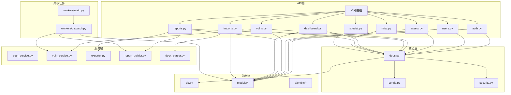
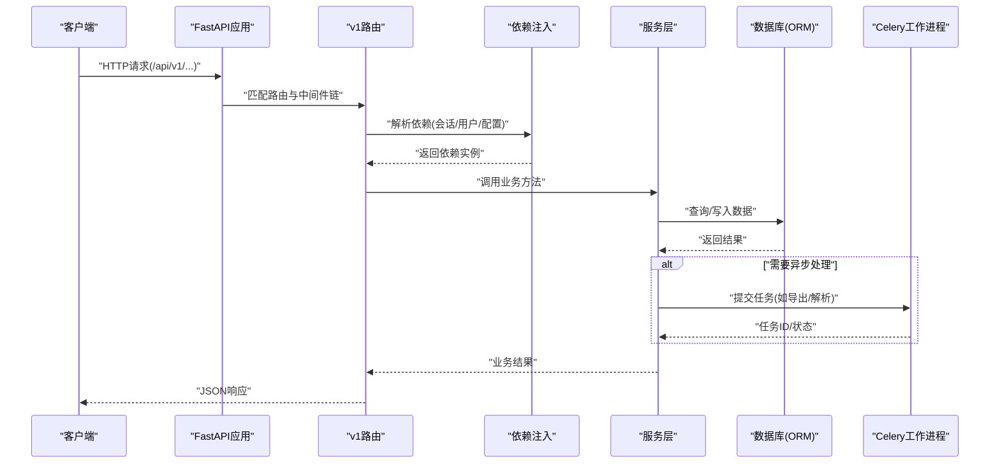
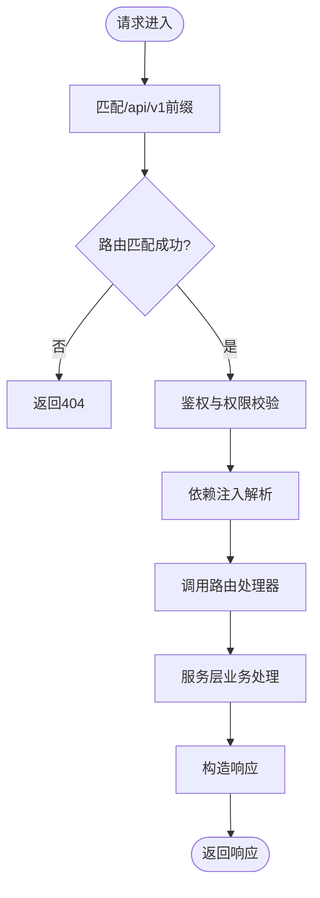
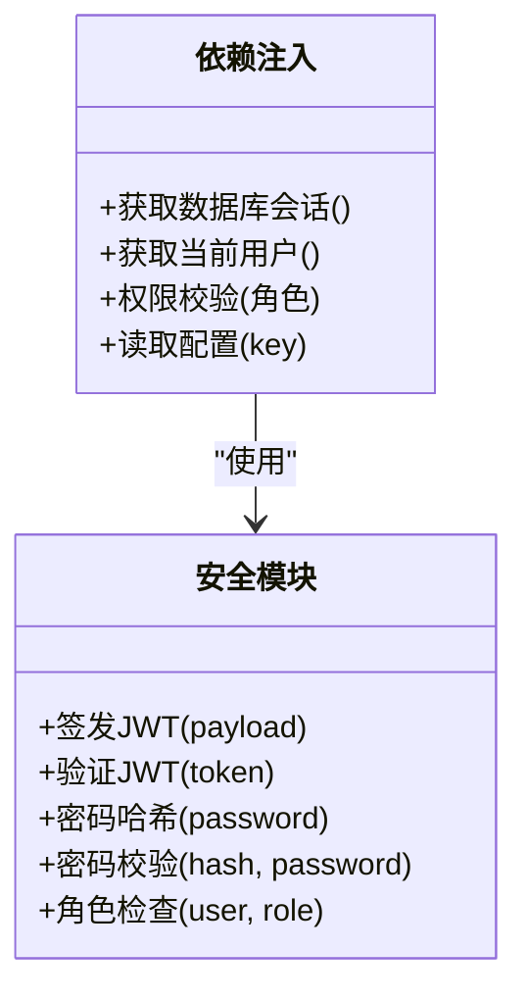
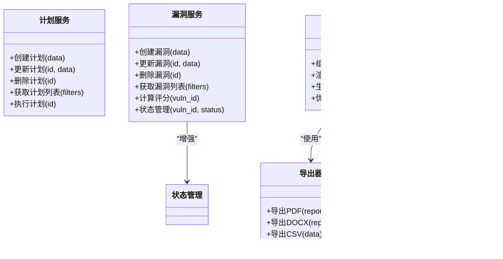
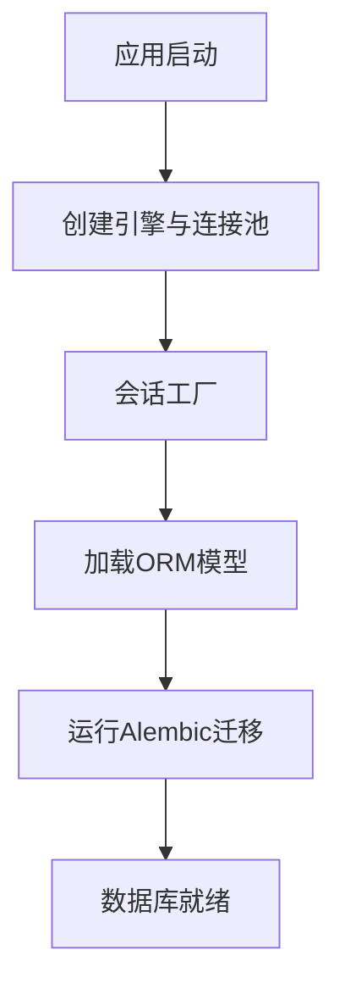
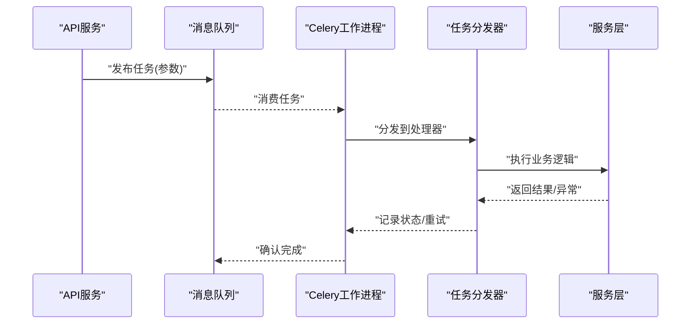
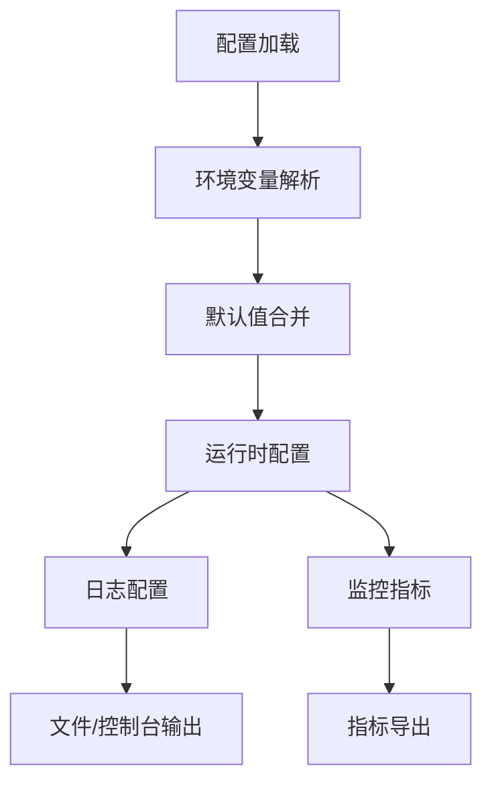
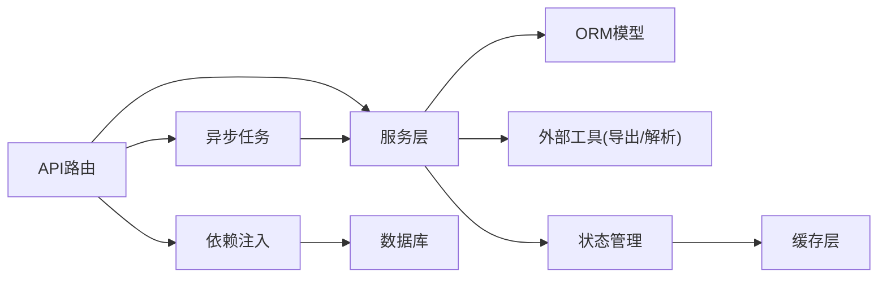

# 后端架构

<cite>
**本文引用的文件**   
- [backend/app/main.py](file://backend/app/main.py)
- [backend/app/api/v1/__init__.py](file://backend/app/api/v1/__init__.py)
- [backend/app/api/v1/auth.py](file://backend/app/api/v1/auth.py)
- [backend/app/api/v1/users.py](file://backend/app/api/v1/users.py)
- [backend/app/api/v1/assets.py](file://backend/app/api/v1/assets.py)
- [backend/app/api/v1/vulns.py](file://backend/app/api/v1/vulns.py)
- [backend/app/api/v1/reports.py](file://backend/app/api/v1/reports.py)
- [backend/app/api/v1/dashboard.py](file://backend/app/api/v1/dashboard.py)
- [backend/app/api/v1/imports.py](file://backend/app/api/v1/imports.py)
- [backend/app/api/v1/misc.py](file://backend/app/api/v1/misc.py)
- [backend/app/api/v1/special.py](file://backend/app/api/v1/special.py)
- [backend/app/core/config.py](file://backend/app/core/config.py)
- [backend/app/core/deps.py](file://backend/app/core/deps.py)
- [backend/app/core/security.py](file://backend/app/core/security.py)
- [backend/app/db.py](file://backend/app/db.py)
- [backend/app/models/__init__.py](file://backend/app/models/__init__.py)
- [backend/app/models/business.py](file://backend/app/models/business.py)
- [backend/app/models/user.py](file://backend/app/models/user.py)
- [backend/app/models/report.py](file://backend/app/models/report.py)
- [backend/app/models/imports.py](file://backend/app/models/imports.py)
- [backend/app/models/special.py](file://backend/app/models/special.py)
- [backend/app/services/plan_service.py](file://backend/app/services/plan_service.py)
- [backend/app/services/vuln_service.py](file://backend/app/services/vuln_service.py)
- [backend/app/services/exporter.py](file://backend/app/services/exporter.py)
- [backend/app/services/report_builder.py](file://backend/app/services/report_builder.py)
- [backend/app/services/docx_parser.py](file://backend/app/services/docx_parser.py)
- [backend/app/workers/main.py](file://backend/app/workers/main.py)
- [backend/app/workers/dispatch.py](file://backend/app/workers/dispatch.py)
- [backend/alembic/env.py](file://backend/alembic/env.py)
- [backend/alembic.ini](file://backend/alembic.ini)
</cite>

## 更新摘要
**所做更改**   
- 更新了服务层业务逻辑封装部分，反映文档解析器改进和报告构建器优化
- 增强了漏洞服务状态管理相关描述
- 改进了异步任务处理架构说明，包括Celery工作进程调度策略升级
- 更新了依赖关系分析和性能考量部分

## 目录
1. [简介](#简介)
2. [项目结构](#项目结构)
3. [核心组件](#核心组件)
4. [架构总览](#架构总览)
5. [详细组件分析](#详细组件分析)
6. [依赖关系分析](#依赖关系分析)
7. [性能考量](#性能考量)
8. [故障排查指南](#故障排查指南)
9. [结论](#结论)
10. [附录](#附录)

## 简介
本文件面向Talos后端的架构与实现，聚焦FastAPI应用的结构设计、路由组织、中间件配置、依赖注入机制、API版本管理策略与请求处理流程；深入解析服务层业务逻辑封装（计划服务、漏洞服务等）；说明数据库连接管理与ORM使用模式；阐述异步任务处理架构（Celery工作进程调度与错误处理）；并覆盖配置管理、日志记录、监控指标等横切关注点。文档同时提供后端组件交互图与数据处理流程图，帮助读者快速理解系统全貌与关键路径。

## 项目结构
后端采用分层与模块化组织：
- API层：按功能划分的路由模块，统一在v1版本下暴露REST接口
- 核心层：配置、依赖注入、安全校验等横切能力
- 模型层：基于SQLAlchemy的ORM模型定义
- 服务层：业务逻辑封装，解耦API与数据访问
- 工作进程：Celery异步任务执行与分发
- 迁移：Alembic数据库迁移脚本与环境配置

**图表来源** 
- [backend/app/main.py](file://backend/app/main.py)
- [backend/app/api/v1/__init__.py](file://backend/app/api/v1/__init__.py)
- [backend/app/core/config.py](file://backend/app/core/config.py)
- [backend/app/core/deps.py](file://backend/app/core/deps.py)
- [backend/app/core/security.py](file://backend/app/core/security.py)
- [backend/app/db.py](file://backend/app/db.py)
- [backend/app/models/__init__.py](file://backend/app/models/__init__.py)
- [backend/app/services/plan_service.py](file://backend/app/services/plan_service.py)
- [backend/app/services/vuln_service.py](file://backend/app/services/vuln_service.py)
- [backend/app/services/report_builder.py](file://backend/app/services/report_builder.py)
- [backend/app/services/docx_parser.py](file://backend/app/services/docx_parser.py)
- [backend/app/workers/main.py](file://backend/app/workers/main.py)
- [backend/app/workers/dispatch.py](file://backend/app/workers/dispatch.py)
- [backend/alembic/env.py](file://backend/alembic/env.py)

**章节来源**
- [backend/app/main.py](file://backend/app/main.py)
- [backend/app/api/v1/__init__.py](file://backend/app/api/v1/__init__.py)

## 核心组件
- FastAPI应用入口与中间件：应用初始化、全局异常处理、CORS、请求日志、限流等横切能力集中配置
- API路由组织：v1版本前缀统一挂载，各功能域路由文件独立维护，便于扩展与维护
- 依赖注入：通过FastAPI的Depends实现数据库会话、认证用户、权限校验、配置读取等共享依赖
- 服务层：将复杂业务逻辑从路由中抽离，形成可测试、可复用的服务模块
- ORM与数据库：SQLAlchemy引擎与会话管理，结合Alembic进行迁移
- 异步任务：Celery工作进程负责耗时操作（报告生成、导入解析等），支持重试与错误处理

**章节来源**
- [backend/app/core/deps.py](file://backend/app/core/deps.py)
- [backend/app/core/config.py](file://backend/app/core/config.py)
- [backend/app/db.py](file://backend/app/db.py)
- [backend/app/api/v1/__init__.py](file://backend/app/api/v1/__init__.py)

## 架构总览
下图展示从HTTP请求到响应返回的整体流程，包括鉴权、依赖注入、服务调用、数据库访问与异步任务触发。

**图表来源** 
- [backend/app/main.py](file://backend/app/main.py)
- [backend/app/api/v1/__init__.py](file://backend/app/api/v1/__init__.py)
- [backend/app/core/deps.py](file://backend/app/core/deps.py)
- [backend/app/db.py](file://backend/app/db.py)
- [backend/app/workers/main.py](file://backend/app/workers/main.py)

## 详细组件分析

### API路由与版本管理
- v1路由组统一挂载于/api/v1前缀，所有接口遵循REST风格命名规范
- 各功能域路由文件职责清晰：认证、用户、资产、漏洞、报告、仪表板、导入、杂项、特殊接口
- 版本演进策略：新增版本时创建v2路由组，保持向后兼容，逐步迁移旧接口

**图表来源** 
- [backend/app/api/v1/__init__.py](file://backend/app/api/v1/__init__.py)
- [backend/app/api/v1/auth.py](file://backend/app/api/v1/auth.py)
- [backend/app/api/v1/users.py](file://backend/app/api/v1/users.py)
- [backend/app/api/v1/assets.py](file://backend/app/api/v1/assets.py)
- [backend/app/api/v1/vulns.py](file://backend/app/api/v1/vulns.py)
- [backend/app/api/v1/reports.py](file://backend/app/api/v1/reports.py)
- [backend/app/api/v1/dashboard.py](file://backend/app/api/v1/dashboard.py)
- [backend/app/api/v1/imports.py](file://backend/app/api/v1/imports.py)
- [backend/app/api/v1/misc.py](file://backend/app/api/v1/misc.py)
- [backend/app/api/v1/special.py](file://backend/app/api/v1/special.py)

**章节来源**
- [backend/app/api/v1/__init__.py](file://backend/app/api/v1/__init__.py)
- [backend/app/api/v1/auth.py](file://backend/app/api/v1/auth.py)
- [backend/app/api/v1/users.py](file://backend/app/api/v1/users.py)
- [backend/app/api/v1/assets.py](file://backend/app/api/v1/assets.py)
- [backend/app/api/v1/vulns.py](file://backend/app/api/v1/vulns.py)
- [backend/app/api/v1/reports.py](file://backend/app/api/v1/reports.py)
- [backend/app/api/v1/dashboard.py](file://backend/app/api/v1/dashboard.py)
- [backend/app/api/v1/imports.py](file://backend/app/api/v1/imports.py)
- [backend/app/api/v1/misc.py](file://backend/app/api/v1/misc.py)
- [backend/app/api/v1/special.py](file://backend/app/api/v1/special.py)

### 依赖注入与安全
- 依赖注入涵盖数据库会话、当前用户、权限检查、配置读取等
- 安全模块提供JWT签发与验证、密码哈希、角色权限判断
- 通过Depends组合多个依赖，保证单一职责与可测试性

**图表来源** 
- [backend/app/core/deps.py](file://backend/app/core/deps.py)
- [backend/app/core/security.py](file://backend/app/core/security.py)

**章节来源**
- [backend/app/core/deps.py](file://backend/app/core/deps.py)
- [backend/app/core/security.py](file://backend/app/core/security.py)

### 服务层业务逻辑封装
- 计划服务：负责测试计划的CRUD、状态流转、关联资源管理
- 漏洞服务：负责漏洞条目管理、分类、标签、评分计算，增强状态管理机制
- 报告构建器：聚合多源数据生成报告内容，优化模板渲染性能
- 导出器：将数据导出为多种格式（如PDF/DOCX）
- Docx解析器：解析上传的Word文档，提取结构化信息，改进解析准确性

**更新** 服务层经过增强，包括文档解析器的改进、报告构建器的优化以及漏洞服务状态管理的增强

**图表来源** 
- [backend/app/services/plan_service.py](file://backend/app/services/plan_service.py)
- [backend/app/services/vuln_service.py](file://backend/app/services/vuln_service.py)
- [backend/app/services/report_builder.py](file://backend/app/services/report_builder.py)
- [backend/app/services/exporter.py](file://backend/app/services/exporter.py)
- [backend/app/services/docx_parser.py](file://backend/app/services/docx_parser.py)

**章节来源**
- [backend/app/services/plan_service.py](file://backend/app/services/plan_service.py)
- [backend/app/services/vuln_service.py](file://backend/app/services/vuln_service.py)
- [backend/app/services/report_builder.py](file://backend/app/services/report_builder.py)
- [backend/app/services/exporter.py](file://backend/app/services/exporter.py)
- [backend/app/services/docx_parser.py](file://backend/app/services/docx_parser.py)

### 数据库连接管理与ORM使用
- SQLAlchemy引擎与会话池配置，支持连接复用与事务管理
- 模型定义按领域划分，包含用户、业务实体、报告、导入、特殊实体等
- Alembic用于数据库迁移，env.py与配置文件驱动迁移流程

**图表来源** 
- [backend/app/db.py](file://backend/app/db.py)
- [backend/app/models/__init__.py](file://backend/app/models/__init__.py)
- [backend/app/models/business.py](file://backend/app/models/business.py)
- [backend/app/models/user.py](file://backend/app/models/user.py)
- [backend/app/models/report.py](file://backend/app/models/report.py)
- [backend/app/models/imports.py](file://backend/app/models/imports.py)
- [backend/app/models/special.py](file://backend/app/models/special.py)
- [backend/alembic/env.py](file://backend/alembic/env.py)
- [backend/alembic.ini](file://backend/alembic.ini)

**章节来源**
- [backend/app/db.py](file://backend/app/db.py)
- [backend/app/models/__init__.py](file://backend/app/models/__init__.py)
- [backend/app/models/business.py](file://backend/app/models/business.py)
- [backend/app/models/user.py](file://backend/app/models/user.py)
- [backend/app/models/report.py](file://backend/app/models/report.py)
- [backend/app/models/imports.py](file://backend/app/models/imports.py)
- [backend/app/models/special.py](file://backend/app/models/special.py)
- [backend/alembic/env.py](file://backend/alembic/env.py)
- [backend/alembic.ini](file://backend/alembic.ini)

### 异步任务处理架构（Celery）
- 工作进程主入口负责初始化Broker、Worker与任务注册
- 任务分发器根据事件类型路由到具体处理函数
- 支持重试、超时、错误回调与监控指标上报
- **更新** 异步任务处理经过升级，包括更好的错误处理和调度策略

**图表来源** 
- [backend/app/workers/main.py](file://backend/app/workers/main.py)
- [backend/app/workers/dispatch.py](file://backend/app/workers/dispatch.py)

**章节来源**
- [backend/app/workers/main.py](file://backend/app/workers/main.py)
- [backend/app/workers/dispatch.py](file://backend/app/workers/dispatch.py)

### 配置管理、日志与监控
- 配置管理：集中化环境变量与默认值，支持多环境切换
- 日志记录：结构化日志输出，包含请求ID、用户上下文、耗时统计
- 监控指标：健康检查端点、性能指标采集、错误率统计

**图表来源** 
- [backend/app/core/config.py](file://backend/app/core/config.py)

**章节来源**
- [backend/app/core/config.py](file://backend/app/core/config.py)

## 依赖关系分析
- API路由依赖服务层，服务层依赖ORM模型与外部工具
- 依赖注入贯穿整个链路，确保松耦合与高内聚
- 异步任务与同步API通过消息队列解耦，提升系统吞吐
- **更新** 服务层增强后的依赖关系更加清晰，状态管理和服务间通信得到优化

**图表来源** 
- [backend/app/api/v1/__init__.py](file://backend/app/api/v1/__init__.py)
- [backend/app/core/deps.py](file://backend/app/core/deps.py)
- [backend/app/db.py](file://backend/app/db.py)
- [backend/app/workers/main.py](file://backend/app/workers/main.py)
- [backend/app/services/vuln_service.py](file://backend/app/services/vuln_service.py)

**章节来源**
- [backend/app/api/v1/__init__.py](file://backend/app/api/v1/__init__.py)
- [backend/app/core/deps.py](file://backend/app/core/deps.py)
- [backend/app/db.py](file://backend/app/db.py)
- [backend/app/workers/main.py](file://backend/app/workers/main.py)
- [backend/app/services/vuln_service.py](file://backend/app/services/vuln_service.py)

## 性能考量
- 连接池：合理设置数据库连接池大小，避免连接耗尽
- 缓存：热点数据引入缓存层（如Redis）减少数据库压力
- 异步化：将耗时操作（报告生成、文件解析）放入异步任务
- 分页与过滤：API层实现分页与查询优化，减少数据传输量
- 监控：通过指标与日志定位瓶颈，持续优化
- **更新** 服务层优化包括文档解析器性能改进和报告构建器缓存策略优化

[本节为通用指导，不直接分析具体文件]

## 故障排查指南
- 常见错误：数据库连接失败、JWT验证失败、任务执行超时
- 日志定位：查看请求日志中的错误堆栈与上下文信息
- 任务重试：检查任务队列积压情况，调整并发与重试策略
- 健康检查：通过健康端点确认服务状态与依赖可用性
- **更新** 新增服务层状态管理相关的故障排查步骤

**章节来源**
- [backend/app/core/security.py](file://backend/app/core/security.py)
- [backend/app/workers/dispatch.py](file://backend/app/workers/dispatch.py)
- [backend/app/services/vuln_service.py](file://backend/app/services/vuln_service.py)

## 结论
Talos后端采用清晰的层次化架构与模块化设计，通过FastAPI的依赖注入与服务层封装实现高内聚低耦合。数据库与ORM管理完善，异步任务架构提升系统吞吐。配置、日志与监控等横切关注点得到统一处理，便于运维与扩展。**更新** 经过增强的服务层提供了更好的状态管理和性能优化，进一步提升了系统的稳定性和可扩展性。建议持续优化性能与可观测性，确保系统稳定高效运行。

[本节为总结性内容，不直接分析具体文件]

## 附录
- 术语表：FastAPI、SQLAlchemy、Alembic、Celery、JWT等
- 部署清单：环境变量、依赖包、容器镜像构建步骤
- 开发指南：本地启动、调试技巧、测试用例编写

[本节为补充信息，不直接分析具体文件]