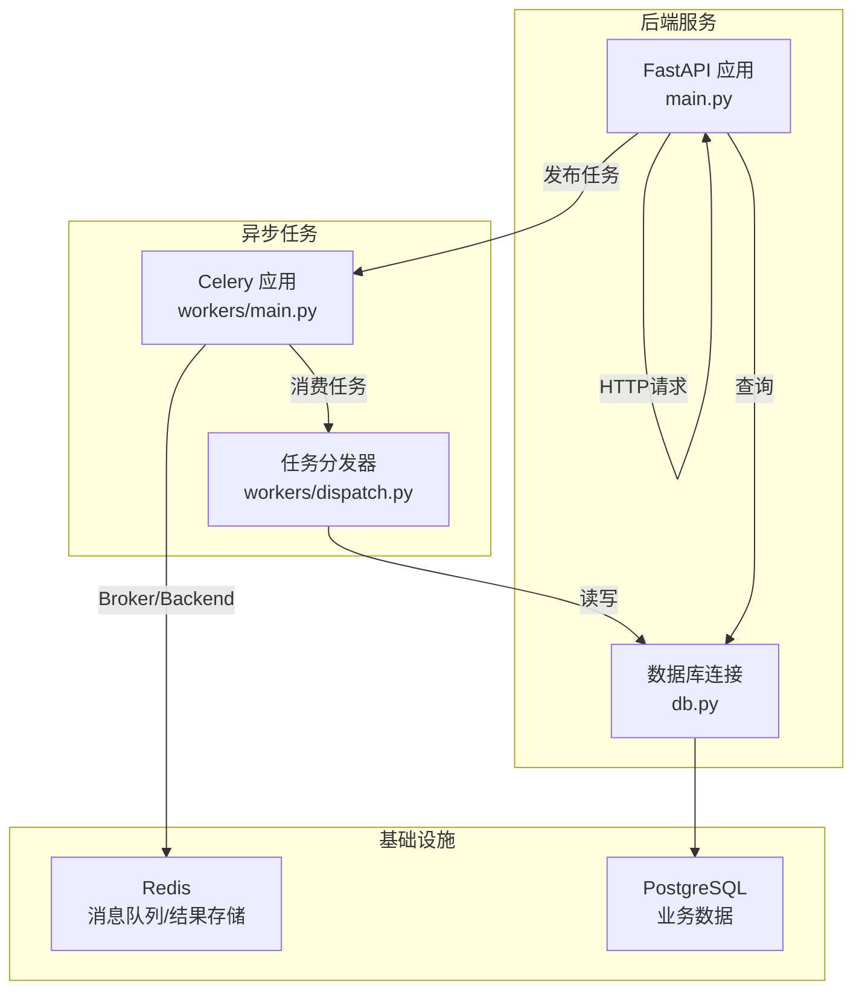
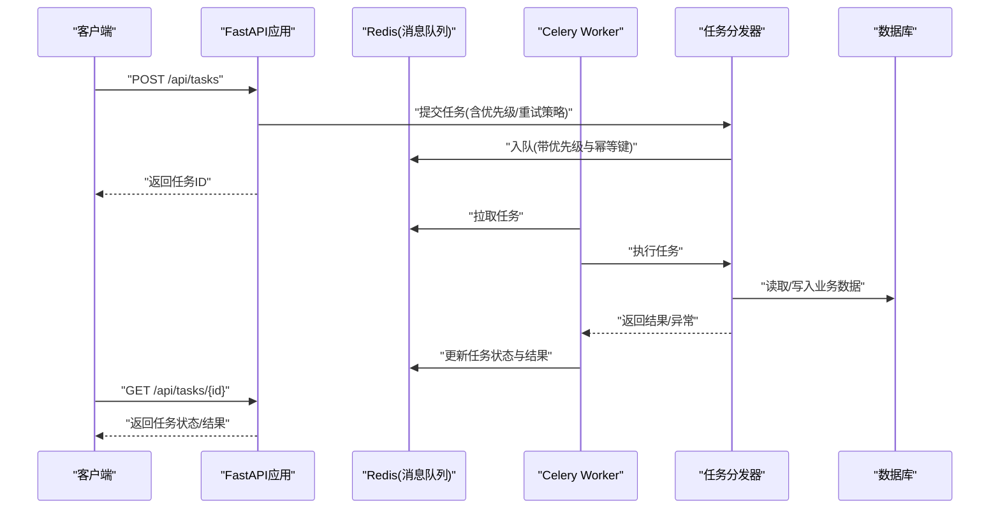
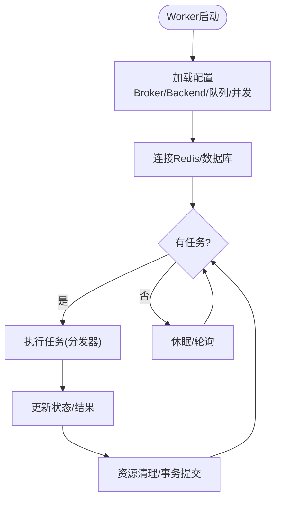
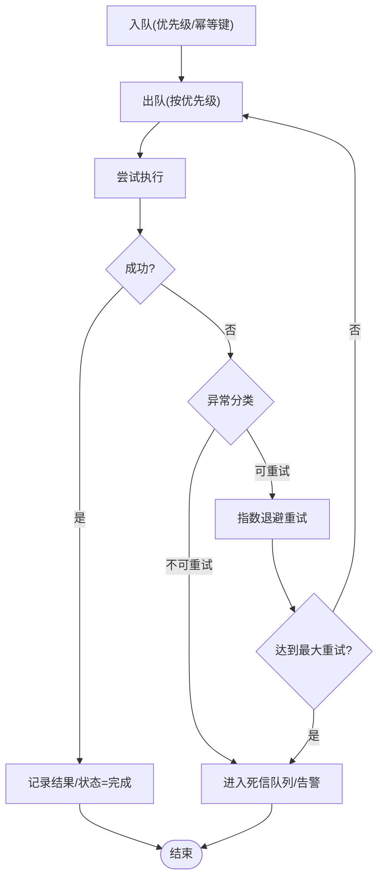
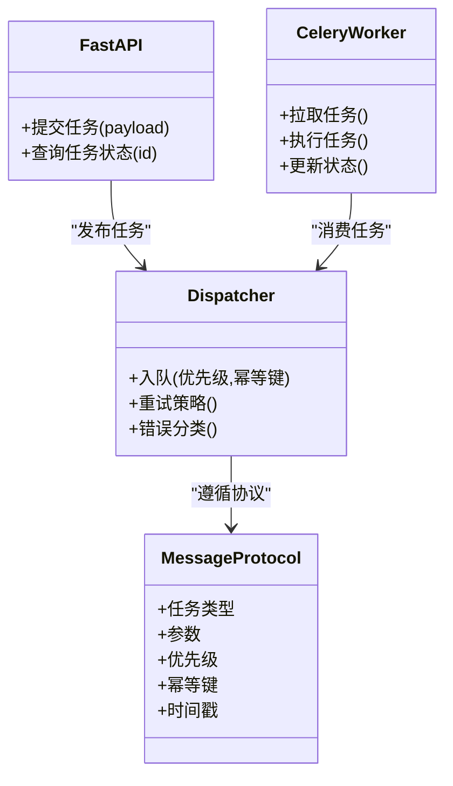
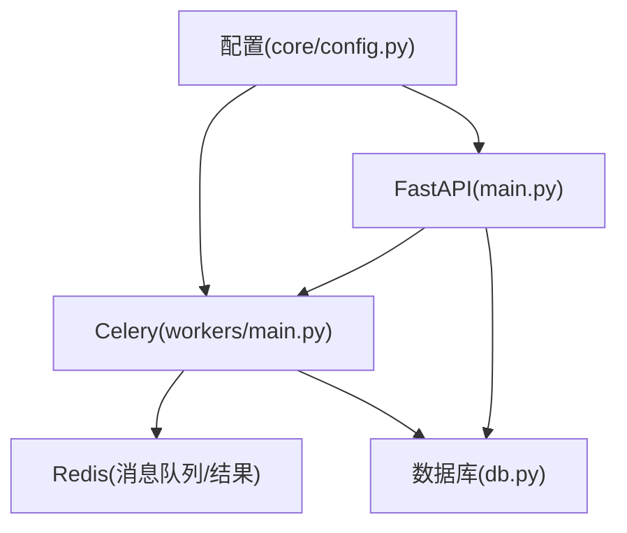

# 异步任务处理

<cite>
**本文引用的文件**   
- [backend/app/main.py](file://backend/app/main.py)
- [backend/app/workers/main.py](file://backend/app/workers/main.py)
- [backend/app/workers/dispatch.py](file://backend/app/workers/dispatch.py)
- [backend/app/core/config.py](file://backend/app/core/config.py)
- [backend/app/db.py](file://backend/app/db.py)
- [backend/requirements.txt](file://backend/requirements.txt)
- [docker-compose.yml](file://docker-compose.yml)
</cite>

## 目录
1. [简介](#简介)
2. [项目结构](#项目结构)
3. [核心组件](#核心组件)
4. [架构总览](#架构总览)
5. [详细组件分析](#详细组件分析)
6. [依赖关系分析](#依赖关系分析)
7. [性能考虑](#性能考虑)
8. [故障排查指南](#故障排查指南)
9. [结论](#结论)
10. [附录](#附录)

## 简介
本文件面向Talos项目的异步任务处理架构，重点解析基于Celery的工作进程设计模式与实现要点。内容涵盖：
- 任务调度策略、消息队列配置与分布式处理机制
- 任务分发器的职责边界、优先级管理、重试与错误恢复
- 异步任务的监控与调试（状态跟踪、性能分析、日志收集）
- 主应用与工作进程的解耦设计（事件总线模式、消息协议约定）
- 生产环境关键考量（超时、资源清理、内存管理）
- 异步处理流程图与故障恢复策略

## 项目结构
后端采用FastAPI作为HTTP服务入口，异步任务通过Celery工作进程执行，二者通过消息队列解耦。关键目录与职责如下：
- backend/app/main.py：FastAPI应用启动、路由注册、中间件与生命周期钩子
- backend/app/workers/main.py：Celery应用初始化、Broker/Backend配置、Worker启动参数
- backend/app/workers/dispatch.py：任务分发器，负责任务入队、优先级、重试与错误处理
- backend/app/core/config.py：集中式配置（包括Celery相关设置）
- backend/app/db.py：数据库连接与会话管理
- docker-compose.yml：编排Redis（消息队列）、PostgreSQL（持久化）与后端服务

**图表来源** 
- [backend/app/main.py](file://backend/app/main.py)
- [backend/app/workers/main.py](file://backend/app/workers/main.py)
- [backend/app/workers/dispatch.py](file://backend/app/workers/dispatch.py)
- [backend/app/db.py](file://backend/app/db.py)
- [docker-compose.yml](file://docker-compose.yml)

**章节来源**
- [backend/app/main.py](file://backend/app/main.py)
- [backend/app/workers/main.py](file://backend/app/workers/main.py)
- [backend/app/workers/dispatch.py](file://backend/app/workers/dispatch.py)
- [backend/app/core/config.py](file://backend/app/core/config.py)
- [backend/app/db.py](file://backend/app/db.py)
- [docker-compose.yml](file://docker-compose.yml)

## 核心组件
- FastAPI应用（main.py）：提供REST接口，接收用户请求并将耗时操作以任务形式提交至Celery，避免阻塞HTTP响应。
- Celery应用（workers/main.py）：初始化Celery实例，加载Broker与Backend配置，定义Worker运行参数（并发、预取、内存限制等）。
- 任务分发器（dispatch.py）：封装任务入队逻辑，统一处理优先级、重试、幂等键、错误分类与回调。
- 配置中心（core/config.py）：集中管理环境变量与默认值，确保多环境一致性。
- 数据库层（db.py）：提供会话管理与事务边界，保证任务执行中的数据一致性。

**章节来源**
- [backend/app/main.py](file://backend/app/main.py)
- [backend/app/workers/main.py](file://backend/app/workers/main.py)
- [backend/app/workers/dispatch.py](file://backend/app/workers/dispatch.py)
- [backend/app/core/config.py](file://backend/app/core/config.py)
- [backend/app/db.py](file://backend/app/db.py)

## 架构总览
整体采用“HTTP服务 + 异步任务”的解耦架构：
- 请求侧：FastAPI仅做参数校验与任务派发，不执行业务计算。
- 任务侧：Celery Worker从Redis拉取任务，按优先级与并发策略执行，结果写回Redis或数据库。
- 可观测性：通过Celery监控工具与结构化日志采集任务状态、耗时与异常。

**图表来源** 
- [backend/app/main.py](file://backend/app/main.py)
- [backend/app/workers/main.py](file://backend/app/workers/main.py)
- [backend/app/workers/dispatch.py](file://backend/app/workers/dispatch.py)
- [backend/app/db.py](file://backend/app/db.py)
- [docker-compose.yml](file://docker-compose.yml)

## 详细组件分析

### 任务调度与消息队列配置
- Broker与Backend：使用Redis作为消息代理与结果后端，支持高吞吐与低延迟。
- Worker参数：合理设置并发数、预取数量、内存上限、软/硬超时，避免OOM与长尾任务阻塞。
- 队列划分：可按业务域拆分队列（如导入、报告生成、扫描），结合优先级路由到不同消费者。

**图表来源** 
- [backend/app/workers/main.py](file://backend/app/workers/main.py)
- [backend/app/workers/dispatch.py](file://backend/app/workers/dispatch.py)
- [backend/app/core/config.py](file://backend/app/core/config.py)

**章节来源**
- [backend/app/workers/main.py](file://backend/app/workers/main.py)
- [backend/app/core/config.py](file://backend/app/core/config.py)

### 任务分发器实现（优先级、重试、错误恢复）
- 优先级管理：在入队时指定优先级字段，Broker按优先级出队；对热点任务可单独设置高优先级队列。
- 重试机制：根据异常类型区分重试策略（指数退避、最大重试次数、死信队列）。
- 幂等性：通过幂等键避免重复执行导致的数据不一致。
- 错误分类：将可恢复异常与不可恢复异常分类，分别走重试或告警流程。

**图表来源** 
- [backend/app/workers/dispatch.py](file://backend/app/workers/dispatch.py)

**章节来源**
- [backend/app/workers/dispatch.py](file://backend/app/workers/dispatch.py)

### 主应用与任务解耦（事件总线与消息协议）
- 事件总线模式：FastAPI仅负责发布任务事件，不关心具体执行细节；Worker订阅并处理。
- 消息协议约定：统一的Payload结构（任务类型、参数、优先级、幂等键、时间戳），便于版本演进与兼容性。
- 状态同步：通过结果后端或数据库表维护任务状态，供前端轮询或WebSocket推送。

**图表来源** 
- [backend/app/main.py](file://backend/app/main.py)
- [backend/app/workers/main.py](file://backend/app/workers/main.py)
- [backend/app/workers/dispatch.py](file://backend/app/workers/dispatch.py)

**章节来源**
- [backend/app/main.py](file://backend/app/main.py)
- [backend/app/workers/main.py](file://backend/app/workers/main.py)
- [backend/app/workers/dispatch.py](file://backend/app/workers/dispatch.py)

### 监控与调试
- 任务状态跟踪：通过结果后端查询任务状态（pending、started、success、failure、retrying）。
- 性能分析：记录任务开始/结束时间、CPU/内存占用，识别慢任务与瓶颈。
- 日志收集：结构化日志（JSON）包含任务ID、阶段、耗时、异常堆栈，便于聚合与检索。
- 工具建议：使用Celery Flower进行可视化监控，结合Prometheus/Grafana采集指标。

**章节来源**
- [backend/app/workers/main.py](file://backend/app/workers/main.py)
- [backend/app/workers/dispatch.py](file://backend/app/workers/dispatch.py)

### 超时处理、资源清理与内存管理
- 超时策略：设置软超时用于优雅中断，硬超时强制终止；对长任务分片执行。
- 资源清理：确保数据库事务提交/回滚、文件句柄关闭、临时文件删除。
- 内存管理：限制Worker内存上限，避免GC压力过大；大对象序列化前评估大小。

**章节来源**
- [backend/app/workers/main.py](file://backend/app/workers/main.py)
- [backend/app/workers/dispatch.py](file://backend/app/workers/dispatch.py)

## 依赖关系分析
- 外部依赖：Redis（消息队列/结果存储）、PostgreSQL（业务数据）
- 内部模块：FastAPI、Celery、数据库会话管理、配置中心
- 部署编排：Docker Compose统一管理服务依赖与网络

**图表来源** 
- [backend/app/main.py](file://backend/app/main.py)
- [backend/app/workers/main.py](file://backend/app/workers/main.py)
- [backend/app/db.py](file://backend/app/db.py)
- [backend/app/core/config.py](file://backend/app/core/config.py)
- [docker-compose.yml](file://docker-compose.yml)

**章节来源**
- [backend/requirements.txt](file://backend/requirements.txt)
- [docker-compose.yml](file://docker-compose.yml)

## 性能考虑
- 队列隔离：按业务域拆分队列，避免热点任务阻塞其他任务。
- 并发与预取：根据CPU核数与I/O特性调整Worker并发与预取数量。
- 批处理：对可合并的任务进行批量处理，降低队列开销。
- 缓存与去重：利用幂等键与结果缓存减少重复计算。
- 背压与限流：在高负载下限制入队速率，保护系统稳定性。

[本节为通用指导，无需特定文件引用]

## 故障排查指南
- 常见问题定位：
  - 任务未执行：检查Broker连接、Worker是否启动、队列是否正确绑定。
  - 任务失败：查看异常堆栈、重试次数、死信队列。
  - 性能问题：分析慢任务、锁竞争、数据库慢查询。
- 诊断步骤：
  - 启用详细日志与结构化输出
  - 使用监控面板观察队列长度、消费速率、错误率
  - 复现问题并抓取上下文（任务ID、参数、时间戳）
- 恢复策略：
  - 重启Worker、扩容实例
  - 清理堆积任务或迁移到备用队列
  - 修复数据后重新入队

**章节来源**
- [backend/app/workers/main.py](file://backend/app/workers/main.py)
- [backend/app/workers/dispatch.py](file://backend/app/workers/dispatch.py)

## 结论
Talos的异步任务处理通过FastAPI与Celery解耦，借助Redis实现高吞吐与可靠的消息传递。任务分发器统一了优先级、重试与错误处理策略，配合完善的监控与日志体系，满足生产环境的稳定性与可观测性要求。建议在后续迭代中持续优化队列隔离、批处理与资源管理，进一步提升系统性能与鲁棒性。

[本节为总结性内容，无需特定文件引用]

## 附录
- 部署清单：确保Redis与PostgreSQL可用，配置正确的Broker/Backend URL
- 环境变量：集中管理于配置中心，避免硬编码
- 扩展建议：引入消息压缩、任务审计、权限控制与多租户隔离

[本节为补充信息，无需特定文件引用]