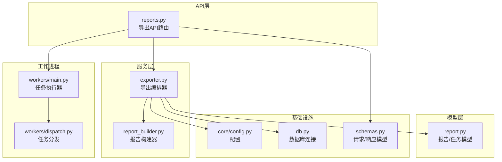
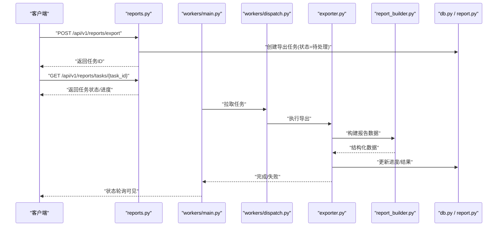
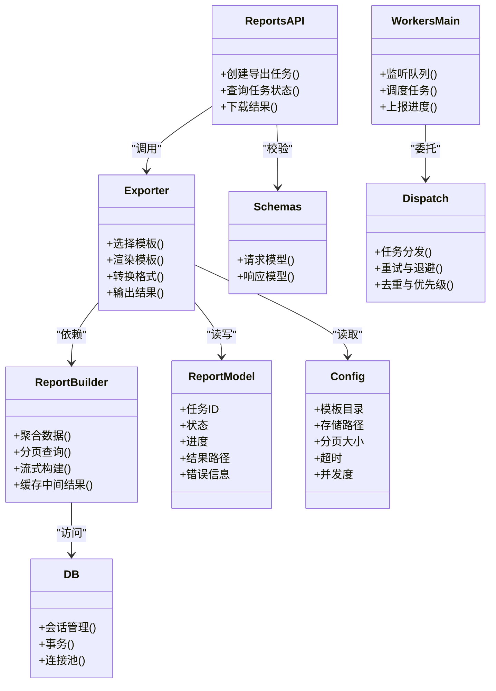

# 导出服务

<cite>
**本文引用的文件**   
- [backend/app/api/v1/reports.py](file://backend/app/api/v1/reports.py)
- [backend/app/services/exporter.py](file://backend/app/services/exporter.py)
- [backend/app/services/report_builder.py](file://backend/app/services/report_builder.py)
- [backend/app/models/report.py](file://backend/app/models/report.py)
- [backend/app/workers/main.py](file://backend/app/workers/main.py)
- [backend/app/workers/dispatch.py](file://backend/app/workers/dispatch.py)
- [backend/app/core/config.py](file://backend/app/core/config.py)
- [backend/app/db.py](file://backend/app/db.py)
- [backend/app/schemas.py](file://backend/app/schemas.py)
</cite>

## 目录
1. [简介](#简介)
2. [项目结构](#项目结构)
3. [核心组件](#核心组件)
4. [架构总览](#架构总览)
5. [详细组件分析](#详细组件分析)
6. [依赖关系分析](#依赖关系分析)
7. [性能考量](#性能考量)
8. [故障排查指南](#故障排查指南)
9. [结论](#结论)
10. [附录](#附录)

## 简介
本文件面向Talos后端导出服务，系统性阐述报告生成、数据导出与格式转换的核心能力。内容覆盖支持的导出格式（PDF、Word、Excel、JSON等）、模板引擎与样式定制、异步任务管理（进度跟踪、失败重试）、大数据量处理优化（分页查询、流式处理、内存管理）、模板管理、字段映射与国际化支持，以及API调用示例、参数配置与错误处理模式。文档以代码为依据，结合架构图与流程图帮助读者快速理解并高效使用导出服务。

## 项目结构
导出相关功能主要位于后端模块：
- API层：提供导出相关的HTTP接口，接收请求、校验参数、调度异步任务、返回任务状态。
- 服务层：封装报告构建、数据聚合、格式转换、模板渲染等核心逻辑。
- 模型层：定义报告实体、导出任务状态等数据模型。
- 工作进程：负责执行耗时导出任务，支持任务分发、重试与进度上报。
- 配置与数据库：集中管理导出相关配置项与数据库连接。

图表来源
- [backend/app/api/v1/reports.py](file://backend/app/api/v1/reports.py)
- [backend/app/services/exporter.py](file://backend/app/services/exporter.py)
- [backend/app/services/report_builder.py](file://backend/app/services/report_builder.py)
- [backend/app/models/report.py](file://backend/app/models/report.py)
- [backend/app/workers/main.py](file://backend/app/workers/main.py)
- [backend/app/workers/dispatch.py](file://backend/app/workers/dispatch.py)
- [backend/app/core/config.py](file://backend/app/core/config.py)
- [backend/app/db.py](file://backend/app/db.py)
- [backend/app/schemas.py](file://backend/app/schemas.py)

章节来源
- [backend/app/api/v1/reports.py](file://backend/app/api/v1/reports.py)
- [backend/app/services/exporter.py](file://backend/app/services/exporter.py)
- [backend/app/services/report_builder.py](file://backend/app/services/report_builder.py)
- [backend/app/models/report.py](file://backend/app/models/report.py)
- [backend/app/workers/main.py](file://backend/app/workers/main.py)
- [backend/app/workers/dispatch.py](file://backend/app/workers/dispatch.py)
- [backend/app/core/config.py](file://backend/app/core/config.py)
- [backend/app/db.py](file://backend/app/db.py)
- [backend/app/schemas.py](file://backend/app/schemas.py)

## 核心组件
- 导出API（reports.py）
  - 职责：接收导出请求、参数校验、创建导出任务、轮询任务状态、下载结果。
  - 关键点：统一错误码、限流与权限控制、异步任务ID回传。
- 导出编排器（exporter.py）
  - 职责：协调数据获取、模板渲染、格式转换、结果落盘或流式输出。
  - 关键点：多格式策略、模板选择、字段映射、国际化语言包加载。
- 报告构建器（report_builder.py）
  - 职责：将业务数据组装为模板所需的数据结构，驱动模板引擎渲染。
  - 关键点：数据清洗、分页聚合、缓存中间结果、异常隔离。
- 报告模型（report.py）
  - 职责：定义报告与导出任务持久化结构（如任务ID、状态、格式、参数、结果路径）。
  - 关键点：状态机（待处理/进行中/成功/失败）、重试计数、错误信息。
- 工作进程（workers/main.py, dispatch.py）
  - 职责：消费任务队列、执行导出流程、更新任务状态、失败重试与退避。
  - 关键点：并发控制、资源清理、进度上报、可观测性指标。
- 配置与数据库（core/config.py, db.py）
  - 职责：加载导出相关配置（如最大页数、超时、存储路径、模板目录），维护DB会话。
  - 关键点：环境变量注入、连接池、事务边界。
- 请求/响应模型（schemas.py）
  - 职责：定义导出请求参数、任务状态、错误响应结构。
  - 关键点：字段校验、默认值、枚举约束。

章节来源
- [backend/app/api/v1/reports.py](file://backend/app/api/v1/reports.py)
- [backend/app/services/exporter.py](file://backend/app/services/exporter.py)
- [backend/app/services/report_builder.py](file://backend/app/services/report_builder.py)
- [backend/app/models/report.py](file://backend/app/models/report.py)
- [backend/app/workers/main.py](file://backend/app/workers/main.py)
- [backend/app/workers/dispatch.py](file://backend/app/workers/dispatch.py)
- [backend/app/core/config.py](file://backend/app/core/config.py)
- [backend/app/db.py](file://backend/app/db.py)
- [backend/app/schemas.py](file://backend/app/schemas.py)

## 架构总览
导出服务采用“API + 异步工作进程”的解耦架构。API仅做轻量校验与任务入队，实际导出由工作进程完成，确保高吞吐与稳定性。报告构建器与导出编排器通过模板引擎与格式转换器协作，支持多种输出格式与样式定制。

图表来源
- [backend/app/api/v1/reports.py](file://backend/app/api/v1/reports.py)
- [backend/app/workers/main.py](file://backend/app/workers/main.py)
- [backend/app/workers/dispatch.py](file://backend/app/workers/dispatch.py)
- [backend/app/services/exporter.py](file://backend/app/services/exporter.py)
- [backend/app/services/report_builder.py](file://backend/app/services/report_builder.py)
- [backend/app/models/report.py](file://backend/app/models/report.py)
- [backend/app/db.py](file://backend/app/db.py)

## 详细组件分析

### 导出API（reports.py）
- 功能要点
  - 接收导出请求，校验参数（格式、模板、过滤条件、分页大小等）。
  - 创建导出任务记录，返回任务ID供后续轮询。
  - 提供任务状态查询接口，包含进度、错误信息、结果下载链接。
- 关键设计
  - 统一错误响应结构与HTTP状态码。
  - 基于任务ID的状态查询，避免重复计算。
  - 可选限流与鉴权拦截。

章节来源
- [backend/app/api/v1/reports.py](file://backend/app/api/v1/reports.py)
- [backend/app/schemas.py](file://backend/app/schemas.py)

### 导出编排器（exporter.py）
- 功能要点
  - 根据请求参数选择模板与格式转换器。
  - 协调数据获取、模板渲染、格式转换与结果输出。
  - 支持流式输出（大文件）与本地/远程存储。
- 关键设计
  - 策略模式：按格式切换渲染器（PDF/Word/Excel/JSON）。
  - 模板引擎：支持变量替换、片段复用、样式定制。
  - 字段映射：将业务字段映射到模板占位符，支持别名与格式化。
  - 国际化：根据语言参数加载对应文案。

章节来源
- [backend/app/services/exporter.py](file://backend/app/services/exporter.py)
- [backend/app/core/config.py](file://backend/app/core/config.py)

### 报告构建器（report_builder.py）
- 功能要点
  - 从数据库或外部源聚合数据，进行清洗与转换。
  - 按模板需求组织数据结构，支持分页与增量构建。
  - 缓存中间结果，减少重复IO与计算。
- 关键设计
  - 分页查询：按页拉取数据，合并为完整数据集。
  - 流式处理：对超大报表按需生成片段，降低内存峰值。
  - 异常隔离：单页失败不影响整体，支持局部重试。

章节来源
- [backend/app/services/report_builder.py](file://backend/app/services/report_builder.py)
- [backend/app/db.py](file://backend/app/db.py)

### 报告模型（report.py）
- 功能要点
  - 定义导出任务实体：任务ID、格式、模板、参数、状态、进度、结果路径、错误信息、重试次数。
  - 状态机：待处理→进行中→成功/失败；失败可进入重试。
- 关键设计
  - 原子更新：状态与进度更新需保证一致性。
  - 审计字段：创建时间、更新时间、操作人。

章节来源
- [backend/app/models/report.py](file://backend/app/models/report.py)

### 工作进程（workers/main.py, dispatch.py）
- 功能要点
  - 主进程监听任务队列，分发给具体处理器。
  - 任务分发器负责任务去重、优先级、重试与退避。
  - 执行过程中定期上报进度，失败时记录错误并触发重试。
- 关键设计
  - 并发控制：限制同时执行的导出任务数。
  - 资源清理：临时文件与连接释放。
  - 可观测性：日志、指标与告警埋点。

章节来源
- [backend/app/workers/main.py](file://backend/app/workers/main.py)
- [backend/app/workers/dispatch.py](file://backend/app/workers/dispatch.py)

### 配置与数据库（core/config.py, db.py）
- 功能要点
  - 集中管理导出相关配置：模板目录、存储路径、分页大小、超时、并发度、重试策略。
  - 数据库连接与会话管理，确保事务安全。
- 关键设计
  - 环境变量优先，配置文件兜底。
  - 连接池与慢查询监控。

章节来源
- [backend/app/core/config.py](file://backend/app/core/config.py)
- [backend/app/db.py](file://backend/app/db.py)

### 请求/响应模型（schemas.py）
- 功能要点
  - 定义导出请求参数：格式、模板、过滤条件、分页、语言、样式选项。
  - 定义任务状态响应：状态、进度、错误、结果URL。
- 关键设计
  - 严格校验与默认值，减少无效请求。
  - 枚举约束，防止非法参数。

章节来源
- [backend/app/schemas.py](file://backend/app/schemas.py)

## 依赖关系分析
导出服务内部依赖清晰，API与服务层解耦，工作进程独立运行，配置与数据库作为基础设施支撑。

图表来源
- [backend/app/api/v1/reports.py](file://backend/app/api/v1/reports.py)
- [backend/app/services/exporter.py](file://backend/app/services/exporter.py)
- [backend/app/services/report_builder.py](file://backend/app/services/report_builder.py)
- [backend/app/models/report.py](file://backend/app/models/report.py)
- [backend/app/workers/main.py](file://backend/app/workers/main.py)
- [backend/app/workers/dispatch.py](file://backend/app/workers/dispatch.py)
- [backend/app/core/config.py](file://backend/app/core/config.py)
- [backend/app/db.py](file://backend/app/db.py)
- [backend/app/schemas.py](file://backend/app/schemas.py)

章节来源
- [backend/app/api/v1/reports.py](file://backend/app/api/v1/reports.py)
- [backend/app/services/exporter.py](file://backend/app/services/exporter.py)
- [backend/app/services/report_builder.py](file://backend/app/services/report_builder.py)
- [backend/app/models/report.py](file://backend/app/models/report.py)
- [backend/app/workers/main.py](file://backend/app/workers/main.py)
- [backend/app/workers/dispatch.py](file://backend/app/workers/dispatch.py)
- [backend/app/core/config.py](file://backend/app/core/config.py)
- [backend/app/db.py](file://backend/app/db.py)
- [backend/app/schemas.py](file://backend/app/schemas.py)

## 性能考量
- 分页查询
  - 按页拉取数据，避免一次性加载全量数据导致内存溢出。
  - 合理设置分页大小，平衡网络往返与内存占用。
- 流式处理
  - 对大文件输出采用流式写入，边生成边写出，降低峰值内存。
  - 模板渲染阶段支持片段拼接，避免构造巨型对象。
- 内存管理
  - 及时释放临时文件与数据库连接。
  - 使用生成器与迭代器处理大数据集。
- 并发与限流
  - 工作进程并发度受配置限制，避免过载。
  - API层可对高频导出接口实施限流。
- 缓存与去重
  - 中间结果缓存，减少重复计算。
  - 相同参数的导出任务去重，直接复用已有结果。

[本节为通用性能指导，不直接分析具体文件]

## 故障排查指南
- 常见问题定位
  - 任务长时间无进展：检查工作进程是否运行、队列是否堆积、是否存在死锁或阻塞IO。
  - 导出失败：查看任务错误信息与堆栈，确认模板是否存在、字段映射是否正确、数据源是否可用。
  - 内存不足：检查分页大小与流式处理是否启用，评估数据量与模板复杂度。
- 重试机制
  - 失败任务自动重试，遵循指数退避策略。
  - 超过最大重试次数后标记失败，需人工介入。
- 日志与监控
  - 关键步骤打点日志，便于追踪问题链路。
  - 暴露健康检查与指标端点，用于告警与容量规划。

章节来源
- [backend/app/workers/main.py](file://backend/app/workers/main.py)
- [backend/app/workers/dispatch.py](file://backend/app/workers/dispatch.py)
- [backend/app/models/report.py](file://backend/app/models/report.py)

## 结论
Talos导出服务通过清晰的层次划分与异步化处理，实现了稳定高效的报告生成与数据导出能力。其模块化设计便于扩展新格式与新模板，配合分页与流式处理满足大数据量场景。建议在生产环境完善监控与告警，持续优化分页与缓存策略，保障高可用与高性能。

[本节为总结性内容，不直接分析具体文件]

## 附录

### 支持的导出格式与模板引擎
- 导出格式
  - PDF：适合打印与归档，支持页面布局与样式定制。
  - Word：便于编辑与二次加工，支持表格与图片嵌入。
  - Excel：适合数据分析与透视，支持多Sheet与公式。
  - JSON：适合程序集成与数据交换，支持结构化字段映射。
- 模板引擎
  - 变量替换与条件渲染。
  - 片段复用与嵌套模板。
  - 样式主题与字体配置。

章节来源
- [backend/app/services/exporter.py](file://backend/app/services/exporter.py)
- [backend/app/services/report_builder.py](file://backend/app/services/report_builder.py)

### 自定义字段映射与国际化
- 字段映射
  - 支持别名映射、格式化规则、默认值填充。
  - 动态字段：根据请求参数决定输出字段集合。
- 国际化
  - 按语言参数加载文案，支持复数与时区。
  - 模板内嵌多语言键，运行时解析。

章节来源
- [backend/app/services/exporter.py](file://backend/app/services/exporter.py)
- [backend/app/schemas.py](file://backend/app/schemas.py)

### 导出API调用示例与参数配置
- 典型流程
  - 发起导出请求，获得任务ID。
  - 轮询任务状态，直至成功或失败。
  - 下载结果文件或获取数据。
- 参数说明
  - 格式：pdf/docx/xlsx/json等。
  - 模板：模板名称或ID。
  - 过滤条件：时间范围、分类、标签等。
  - 分页：每页大小、页码。
  - 语言：zh/en等。
  - 样式：主题、字体、页眉页脚。
- 错误处理
  - 统一错误码与消息。
  - 重试策略与退避。

章节来源
- [backend/app/api/v1/reports.py](file://backend/app/api/v1/reports.py)
- [backend/app/schemas.py](file://backend/app/schemas.py)

### 异步任务管理与进度跟踪
- 任务生命周期
  - 创建→入队→执行→完成/失败。
- 进度上报
  - 阶段性进度百分比与当前步骤。
- 失败重试
  - 指数退避与最大重试次数。
  - 失败原因记录与人工干预入口。

章节来源
- [backend/app/workers/main.py](file://backend/app/workers/main.py)
- [backend/app/workers/dispatch.py](file://backend/app/workers/dispatch.py)
- [backend/app/models/report.py](file://backend/app/models/report.py)

### 大数据量处理优化策略
- 分页查询
  - 按页拉取，合并结果，避免内存峰值。
- 流式处理
  - 边生成边写出，降低内存占用。
- 内存管理
  - 及时释放资源，使用生成器与迭代器。
- 缓存与去重
  - 中间结果缓存，相同任务复用。

章节来源
- [backend/app/services/report_builder.py](file://backend/app/services/report_builder.py)
- [backend/app/services/exporter.py](file://backend/app/services/exporter.py)