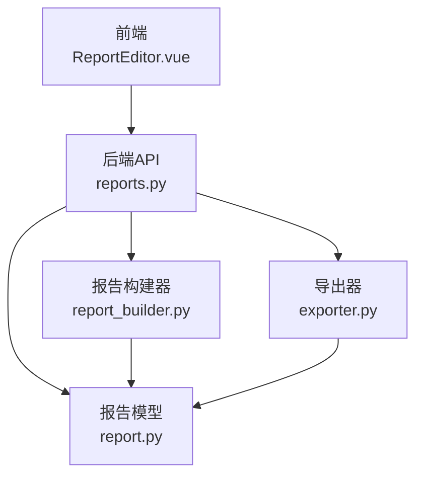
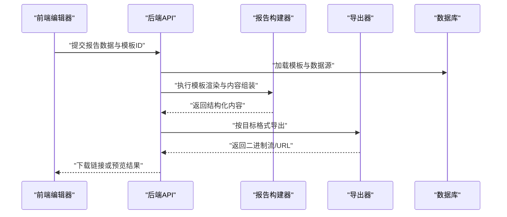
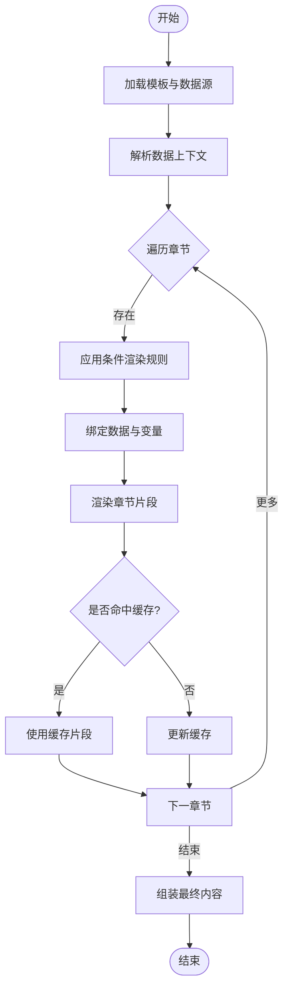
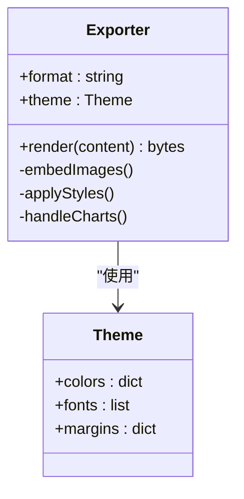
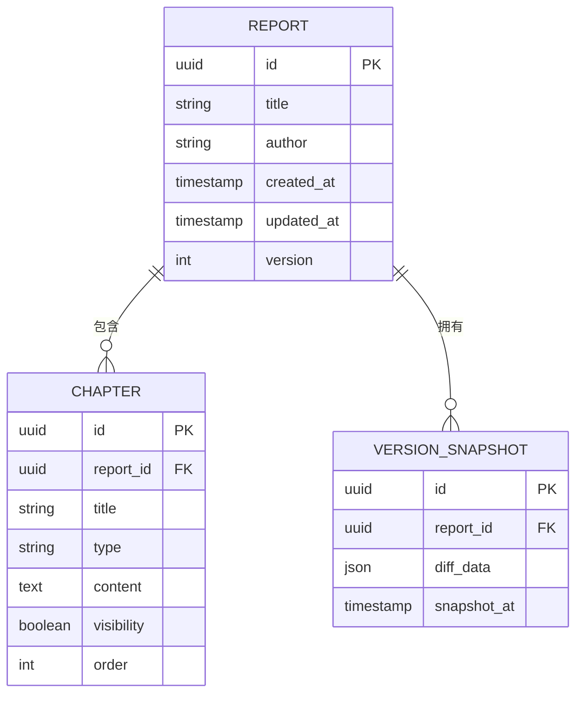
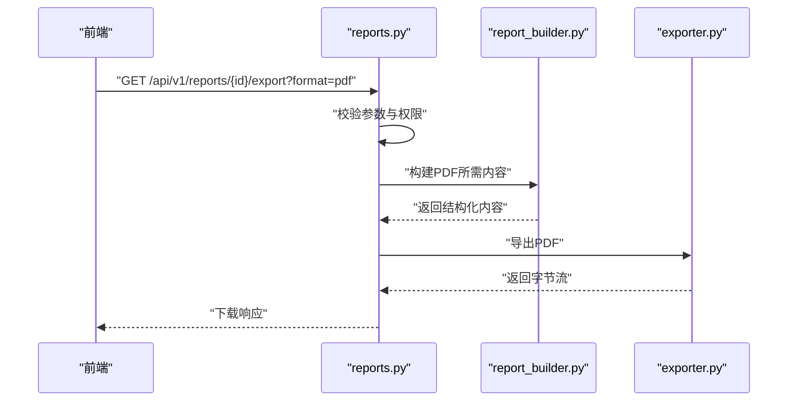
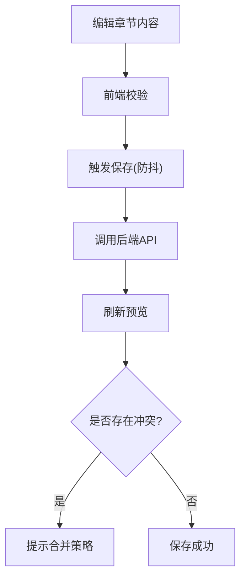
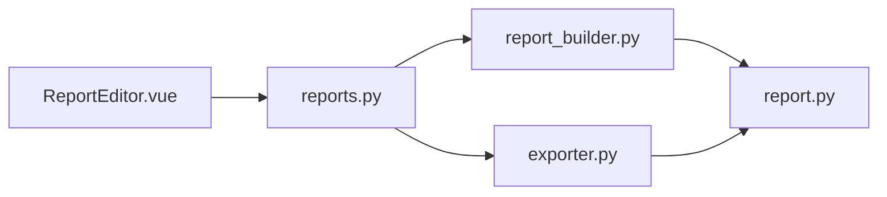

# 报告构建器

<cite>
**本文引用的文件**   
- [backend/app/services/report_builder.py](file://backend/app/services/report_builder.py)
- [backend/app/services/exporter.py](file://backend/app/services/exporter.py)
- [backend/app/models/report.py](file://backend/app/models/report.py)
- [backend/app/api/v1/reports.py](file://backend/app/api/v1/reports.py)
- [backend/app/main.py](file://backend/app/main.py)
- [frontend/src/views/ReportEditor.vue](file://frontend/src/views/ReportEditor.vue)
- [frontend/src/components/RichEditor.vue](file://frontend/src/components/RichEditor.vue)
- [frontend/src/api/client.ts](file://frontend/src/api/client.ts)
</cite>

## 目录
1. [简介](#简介)
2. [项目结构](#项目结构)
3. [核心组件](#核心组件)
4. [架构总览](#架构总览)
5. [详细组件分析](#详细组件分析)
6. [依赖关系分析](#依赖关系分析)
7. [性能考量](#性能考量)
8. [故障排查指南](#故障排查指南)
9. [结论](#结论)
10. [附录](#附录)

## 简介
本文件面向Talos项目的“报告构建器”子系统，系统性解析报告模板渲染、内容组装、图表生成等核心能力，并覆盖报告结构设计、章节管理、样式应用机制；同时说明动态内容插入、数据绑定与条件渲染逻辑；描述图表库集成、可视化组件与交互实现；并给出版本控制、差异对比、协作编辑支持的设计建议。文档兼顾技术深度与可读性，帮助开发者快速上手与扩展。

## 项目结构
后端采用FastAPI提供REST API，服务层负责报告构建与导出，模型层定义报告实体，前端使用Vue+TS进行编辑器与展示。关键路径：
- 后端服务：report_builder.py（构建）、exporter.py（导出）
- 数据模型：report.py（报告结构与版本）
- API路由：reports.py（创建、更新、导出、版本管理等）
- 前端编辑器：ReportEditor.vue（页面编排）、RichEditor.vue（富文本）
- 前端API客户端：client.ts（请求封装）

**图示来源** 
- [backend/app/api/v1/reports.py](file://backend/app/api/v1/reports.py)
- [backend/app/services/report_builder.py](file://backend/app/services/report_builder.py)
- [backend/app/services/exporter.py](file://backend/app/services/exporter.py)
- [backend/app/models/report.py](file://backend/app/models/report.py)
- [frontend/src/views/ReportEditor.vue](file://frontend/src/views/ReportEditor.vue)

**章节来源**
- [backend/app/main.py](file://backend/app/main.py)
- [backend/app/api/v1/reports.py](file://backend/app/api/v1/reports.py)
- [backend/app/services/report_builder.py](file://backend/app/services/report_builder.py)
- [backend/app/services/exporter.py](file://backend/app/services/exporter.py)
- [backend/app/models/report.py](file://backend/app/models/report.py)
- [frontend/src/views/ReportEditor.vue](file://frontend/src/views/ReportEditor.vue)
- [frontend/src/components/RichEditor.vue](file://frontend/src/components/RichEditor.vue)
- [frontend/src/api/client.ts](file://frontend/src/api/client.ts)

## 核心组件
- 报告构建器（report_builder.py）
  - 职责：将模板与数据源合并，执行章节装配、动态插值、条件渲染，产出结构化报告内容。
  - 关键点：模板引擎选择（如Jinja2或自定义）、变量解析、循环与分支、错误回退策略。
- 导出器（exporter.py）
  - 职责：将构建好的内容序列化为目标格式（如DOCX/PDF），处理样式映射、分页、页眉页脚、图表嵌入。
  - 关键点：样式表注入、图片/图表资源打包、字体与编码兼容。
- 报告模型（report.py）
  - 职责：定义报告元数据、章节树、版本快照、变更历史、权限与协作标记。
  - 关键点：版本化字段、差异字段、协作状态机。
- API层（reports.py）
  - 职责：暴露创建、更新、预览、导出、版本切换、差异对比、协作操作接口。
  - 关键点：输入校验、权限控制、异步任务调度（可选）。
- 前端编辑器（ReportEditor.vue + RichEditor.vue）
  - 职责：可视化编排报告结构、拖拽章节、实时预览、富文本编辑、图表配置。
  - 关键点：双向数据绑定、增量保存、冲突检测、协作光标。

**章节来源**
- [backend/app/services/report_builder.py](file://backend/app/services/report_builder.py)
- [backend/app/services/exporter.py](file://backend/app/services/exporter.py)
- [backend/app/models/report.py](file://backend/app/models/report.py)
- [backend/app/api/v1/reports.py](file://backend/app/api/v1/reports.py)
- [frontend/src/views/ReportEditor.vue](file://frontend/src/views/ReportEditor.vue)
- [frontend/src/components/RichEditor.vue](file://frontend/src/components/RichEditor.vue)

## 架构总览
整体采用前后端分离架构，前端通过REST调用后端API完成报告的编辑、构建与导出。构建过程遵循“模板-数据-渲染-导出”的流水线。

**图示来源** 
- [backend/app/api/v1/reports.py](file://backend/app/api/v1/reports.py)
- [backend/app/services/report_builder.py](file://backend/app/services/report_builder.py)
- [backend/app/services/exporter.py](file://backend/app/services/exporter.py)
- [backend/app/models/report.py](file://backend/app/models/report.py)

## 详细组件分析

### 报告构建器（report_builder.py）
- 模板渲染
  - 支持变量替换、循环遍历、条件分支、过滤器与格式化。
  - 错误处理：缺失变量默认值、渲染失败回退到占位符。
- 内容组装
  - 章节树构建：根节点-子节点层级，支持折叠/展开状态。
  - 动态插入：根据数据源类型自动选择渲染器（文本、表格、图表）。
  - 条件渲染：基于业务规则（如风险等级、资产类型）决定章节可见性。
- 数据绑定
  - 统一数据上下文对象，包含全局变量与局部作用域。
  - 延迟求值：按需加载大数据块，避免内存峰值。
- 性能优化
  - 缓存已渲染片段，支持增量更新。
  - 并行渲染独立章节（线程/进程池）。

**图示来源** 
- [backend/app/services/report_builder.py](file://backend/app/services/report_builder.py)

**章节来源**
- [backend/app/services/report_builder.py](file://backend/app/services/report_builder.py)

### 导出器（exporter.py）
- 格式支持
  - DOCX：段落、表格、图片、页眉页脚、样式映射。
  - PDF：矢量图嵌入、字体子集化、分页控制。
- 样式应用
  - 主题CSS/样式表注入，支持暗色模式与品牌定制。
  - 章节标题级别映射至文档样式。
- 图表集成
  - 将SVG/PNG图表嵌入文档，保持分辨率与缩放。
  - 图表元数据（标题、单位、数据来源）随文档导出。
- 错误与回退
  - 资源缺失时降级为占位图。
  - 大文档分块导出，避免内存溢出。

**图示来源** 
- [backend/app/services/exporter.py](file://backend/app/services/exporter.py)

**章节来源**
- [backend/app/services/exporter.py](file://backend/app/services/exporter.py)

### 报告模型（report.py）
- 数据结构
  - 报告元数据：标题、作者、创建时间、版本。
  - 章节树：id、title、type、content、children、visibility。
  - 版本快照：diff字段、合并策略、冲突标记。
- 版本控制
  - 每次保存生成新版本，支持回滚与分支。
  - 差异对比：字段级diff，高亮变更。
- 协作支持
  - 用户锁定、编辑会话、实时同步（WebSocket可选）。
  - 权限模型：只读、编辑、管理员。

**图示来源** 
- [backend/app/models/report.py](file://backend/app/models/report.py)

**章节来源**
- [backend/app/models/report.py](file://backend/app/models/report.py)

### API层（reports.py）
- 接口设计
  - 创建报告：POST /api/v1/reports
  - 更新内容：PATCH /api/v1/reports/{id}
  - 预览渲染：GET /api/v1/reports/{id}/preview
  - 导出文件：GET /api/v1/reports/{id}/export?format=docx|pdf
  - 版本管理：GET/POST /api/v1/reports/{id}/versions
  - 差异对比：GET /api/v1/reports/{id}/diff?version_a=&version_b=
  - 协作操作：PUT /api/v1/reports/{id}/lock, WS /ws/reports/{id}
- 安全与校验
  - JWT鉴权、角色校验、输入Schema验证。
  - 防重放与限流（可选）。

**图示来源** 
- [backend/app/api/v1/reports.py](file://backend/app/api/v1/reports.py)
- [backend/app/services/report_builder.py](file://backend/app/services/report_builder.py)
- [backend/app/services/exporter.py](file://backend/app/services/exporter.py)

**章节来源**
- [backend/app/api/v1/reports.py](file://backend/app/api/v1/reports.py)

### 前端编辑器（ReportEditor.vue + RichEditor.vue）
- 功能特性
  - 可视化章节树：拖拽排序、嵌套、折叠。
  - 富文本编辑：语法高亮、公式、表格、超链接。
  - 实时预览：与后端渲染一致，支持缩放与打印。
  - 图表配置：选择图表类型、绑定数据源、设置样式。
- 数据绑定
  - Vue响应式对象与后端JSON Schema对齐。
  - 增量保存：防抖与乐观更新。
- 协作与冲突
  - 多用户光标显示、编辑冲突提示、合并策略。
  - 版本切换与差异高亮。

**图示来源** 
- [frontend/src/views/ReportEditor.vue](file://frontend/src/views/ReportEditor.vue)
- [frontend/src/components/RichEditor.vue](file://frontend/src/components/RichEditor.vue)
- [frontend/src/api/client.ts](file://frontend/src/api/client.ts)

**章节来源**
- [frontend/src/views/ReportEditor.vue](file://frontend/src/views/ReportEditor.vue)
- [frontend/src/components/RichEditor.vue](file://frontend/src/components/RichEditor.vue)
- [frontend/src/api/client.ts](file://frontend/src/api/client.ts)

## 依赖关系分析
- 模块耦合
  - API层依赖构建器与导出器，低耦合通过接口契约隔离。
  - 模型层被服务层与API层共同引用，需保持稳定。
- 外部依赖
  - 模板引擎（如Jinja2）、文档库（python-docx/pdfkit）、图表库（ECharts/Chart.js）。
- 潜在循环依赖
  - 确保服务层不反向依赖API层，模型层不依赖服务层。

**图示来源** 
- [backend/app/api/v1/reports.py](file://backend/app/api/v1/reports.py)
- [backend/app/services/report_builder.py](file://backend/app/services/report_builder.py)
- [backend/app/services/exporter.py](file://backend/app/services/exporter.py)
- [backend/app/models/report.py](file://backend/app/models/report.py)
- [frontend/src/views/ReportEditor.vue](file://frontend/src/views/ReportEditor.vue)

**章节来源**
- [backend/app/api/v1/reports.py](file://backend/app/api/v1/reports.py)
- [backend/app/services/report_builder.py](file://backend/app/services/report_builder.py)
- [backend/app/services/exporter.py](file://backend/app/services/exporter.py)
- [backend/app/models/report.py](file://backend/app/models/report.py)
- [frontend/src/views/ReportEditor.vue](file://frontend/src/views/ReportEditor.vue)

## 性能考量
- 构建阶段
  - 缓存热点章节，减少重复渲染。
  - 异步任务队列处理耗时导出（Celery/RQ）。
- 导出阶段
  - 分块生成大文档，流式响应降低内存占用。
  - 图表懒加载与压缩（WebP/SVG）。
- 前端优化
  - 虚拟滚动长列表章节。
  - 增量Diff计算，避免全量重绘。

[本节为通用指导，无需特定文件来源]

## 故障排查指南
- 常见错误
  - 模板变量缺失：检查数据上下文与默认值。
  - 导出失败：确认依赖库安装与资源路径。
  - 协作冲突：查看锁状态与合并日志。
- 调试技巧
  - 启用构建器日志，输出渲染中间态。
  - 前端网络面板检查API响应与Schema一致性。
  - 使用单元测试覆盖边界用例（空数据、超大章节）。

**章节来源**
- [backend/app/services/report_builder.py](file://backend/app/services/report_builder.py)
- [backend/app/services/exporter.py](file://backend/app/services/exporter.py)
- [backend/app/api/v1/reports.py](file://backend/app/api/v1/reports.py)

## 结论
Talos报告构建器以模块化设计实现模板渲染、内容组装与导出，结合前端可视化编辑器提供高效协作体验。通过版本控制与差异对比，保障多人编辑下的数据一致性。建议后续增强异步任务、缓存策略与图表交互，进一步提升性能与用户体验。

[本节为总结性内容，无需特定文件来源]

## 附录
- 模板开发指南
  - 变量命名规范、过滤器使用、条件语句最佳实践。
  - 章节模板复用与继承。
- 自定义组件开发
  - 后端渲染器插件接口、前端组件注册流程。
  - 图表组件数据绑定与事件回调。
- API使用示例
  - 创建报告、上传模板、触发导出、查询版本历史。
  - WebSocket协作订阅与消息协议。

[本节为补充信息，无需特定文件来源]