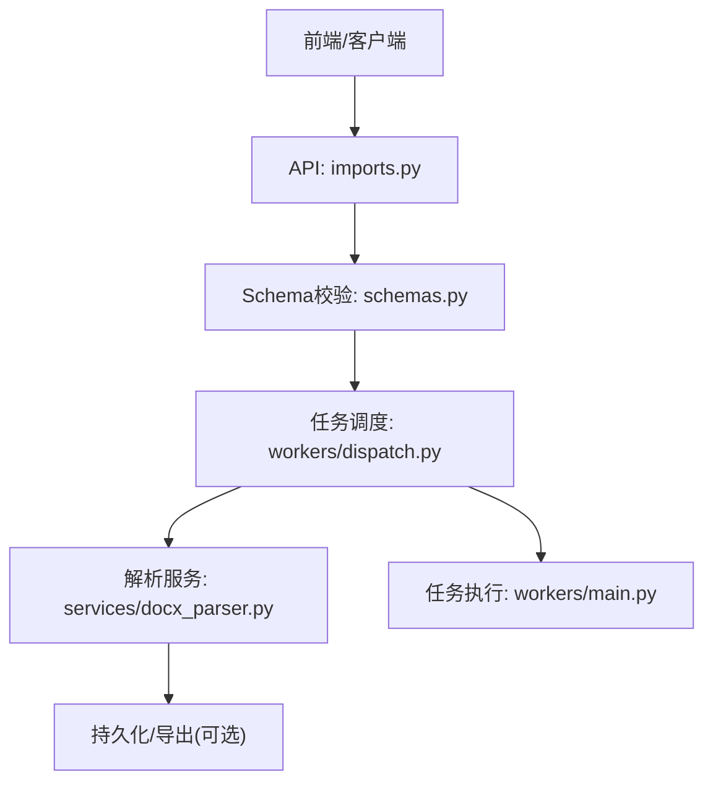
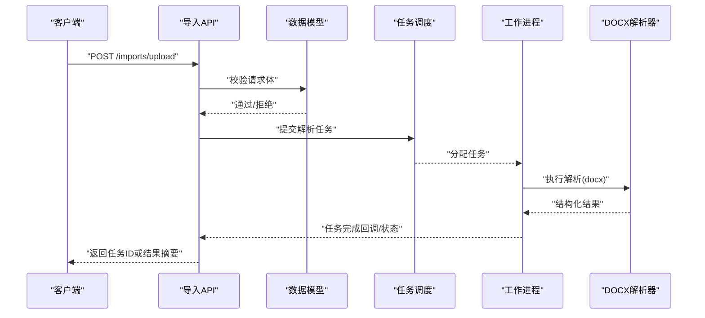
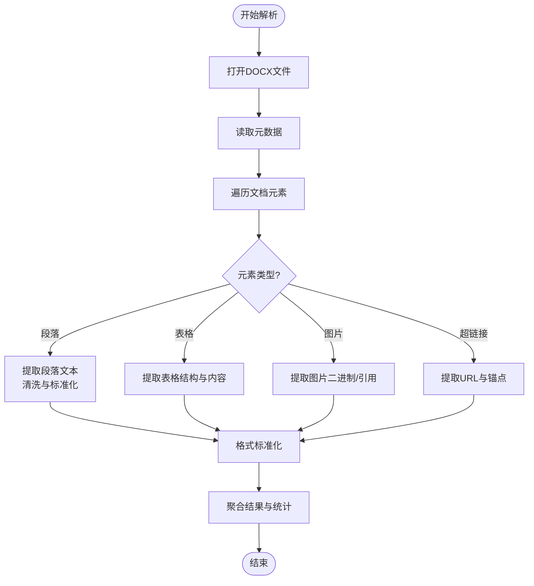
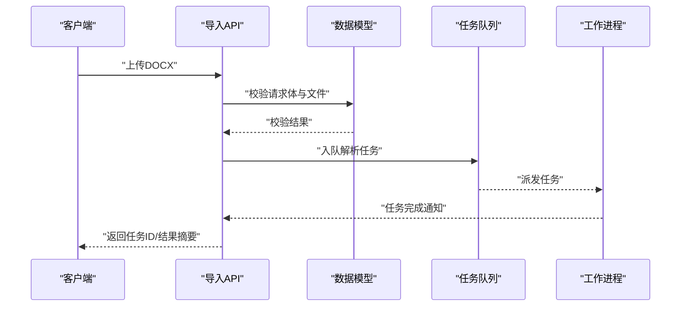
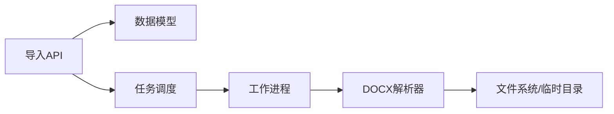

# 文档解析器

<cite>
**本文引用的文件**   
- [backend/app/services/docx_parser.py](file://backend/app/services/docx_parser.py)
- [backend/app/api/v1/imports.py](file://backend/app/api/v1/imports.py)
- [backend/app/schemas.py](file://backend/app/schemas.py)
- [backend/app/core/config.py](file://backend/app/core/config.py)
- [backend/app/workers/main.py](file://backend/app/workers/main.py)
- [backend/app/workers/dispatch.py](file://backend/app/workers/dispatch.py)
- [backend/tests/test_parser.py](file://backend/tests/test_parser.py)
</cite>

## 目录
1. [简介](#简介)
2. [项目结构](#项目结构)
3. [核心组件](#核心组件)
4. [架构总览](#架构总览)
5. [详细组件分析](#详细组件分析)
6. [依赖关系分析](#依赖关系分析)
7. [性能考虑](#性能考虑)
8. [故障排查指南](#故障排查指南)
9. [结论](#结论)
10. [附录](#附录)

## 简介
本文件面向Talos项目的文档解析器，聚焦Word文档（DOCX）的解析、内容提取与结构分析。文档涵盖以下主题：
- DOCX文件格式处理：段落、表格、图片、超链接、样式等元素的识别与抽取
- 文本清洗与格式标准化：编码转换、空白规范化、HTML/富文本清理
- 大文件处理优化：流式读取、分块处理、内存管理
- 错误恢复策略：异常捕获、降级策略、重试机制
- 自定义解析规则与插件扩展：可扩展的解析管线与规则注入
- 解析API调用示例、配置参数与输出格式说明

## 项目结构
后端服务中，文档解析相关代码主要位于 services、api、workers 与 schemas 模块：
- services/docx_parser.py：解析核心逻辑，负责DOCX内容抽取、结构化建模与清洗
- api/v1/imports.py：导入接口层，接收上传文件并触发解析流程
- schemas.py：请求/响应数据模型定义
- core/config.py：全局配置项（如并发、超时、路径等）
- workers/main.py 与 dispatch.py：异步任务调度与执行
- tests/test_parser.py：解析器单元测试

图表来源
- [backend/app/api/v1/imports.py](file://backend/app/api/v1/imports.py)
- [backend/app/schemas.py](file://backend/app/schemas.py)
- [backend/app/workers/dispatch.py](file://backend/app/workers/dispatch.py)
- [backend/app/workers/main.py](file://backend/app/workers/main.py)
- [backend/app/services/docx_parser.py](file://backend/app/services/docx_parser.py)

章节来源
- [backend/app/services/docx_parser.py](file://backend/app/services/docx_parser.py)
- [backend/app/api/v1/imports.py](file://backend/app/api/v1/imports.py)
- [backend/app/schemas.py](file://backend/app/schemas.py)
- [backend/app/core/config.py](file://backend/app/core/config.py)
- [backend/app/workers/main.py](file://backend/app/workers/main.py)
- [backend/app/workers/dispatch.py](file://backend/app/workers/dispatch.py)

## 核心组件
- 解析服务（docx_parser.py）
  - 负责打开DOCX、遍历文档树、抽取段落/表格/图片/元数据
  - 提供文本清洗、格式标准化、编码转换能力
  - 支持大文件分块与内存控制
  - 暴露统一的解析结果数据结构
- API层（imports.py）
  - 接收文件上传，进行基础校验
  - 将解析任务提交至工作队列
  - 返回任务ID或解析结果摘要
- 数据模型（schemas.py）
  - 定义导入请求体、解析结果结构、分页与错误信息
- 配置（config.py）
  - 解析器开关、并发度、超时、临时目录、日志级别等
- 工作进程（workers/main.py, dispatch.py）
  - 任务分发、执行、状态更新与失败重试

章节来源
- [backend/app/services/docx_parser.py](file://backend/app/services/docx_parser.py)
- [backend/app/api/v1/imports.py](file://backend/app/api/v1/imports.py)
- [backend/app/schemas.py](file://backend/app/schemas.py)
- [backend/app/core/config.py](file://backend/app/core/config.py)
- [backend/app/workers/main.py](file://backend/app/workers/main.py)
- [backend/app/workers/dispatch.py](file://backend/app/workers/dispatch.py)

## 架构总览
整体采用“API + 异步任务 + 解析服务”的分层架构：
- API层负责鉴权、校验与任务派发
- 工作进程负责长时间运行的解析任务，避免阻塞HTTP请求
- 解析服务封装DOCX处理细节，向上提供稳定接口

图表来源
- [backend/app/api/v1/imports.py](file://backend/app/api/v1/imports.py)
- [backend/app/schemas.py](file://backend/app/schemas.py)
- [backend/app/workers/dispatch.py](file://backend/app/workers/dispatch.py)
- [backend/app/workers/main.py](file://backend/app/workers/main.py)
- [backend/app/services/docx_parser.py](file://backend/app/services/docx_parser.py)

## 详细组件分析

### DOCX解析器（services/docx_parser.py）
- 功能要点
  - 打开并遍历DOCX文档树，识别段落、标题、列表、表格、图片、超链接、脚注等
  - 提取文档元数据（作者、创建时间、修订信息等）
  - 文本清洗：去除多余空白、统一换行、转义特殊字符
  - 格式标准化：将富文本转换为统一结构（如Markdown或JSON节点）
  - 编码转换：确保输出为UTF-8，兼容多语言
  - 大文件优化：分块读取、限制内存占用、延迟加载资源
  - 错误恢复：捕获解析异常，记录上下文，尝试降级输出可用片段
- 关键数据结构
  - 文档节点：段落、表格、图片、超链接、列表项等
  - 元数据对象：键值对形式的文档属性
  - 解析结果：包含结构化内容与统计信息（页数、字数、元素计数）
- 复杂度与性能
  - 时间复杂度近似O(N)，N为文档元素数量
  - 空间复杂度受内存限制，建议启用分块与惰性加载
  - 表格与图片提取可能带来额外I/O开销，需合理缓存

图表来源
- [backend/app/services/docx_parser.py](file://backend/app/services/docx_parser.py)

章节来源
- [backend/app/services/docx_parser.py](file://backend/app/services/docx_parser.py)

### 导入API（api/v1/imports.py）
- 职责
  - 接收文件上传，校验MIME类型与大小限制
  - 生成任务ID，写入任务队列
  - 返回任务状态查询接口
- 错误处理
  - 非法文件类型、过大文件、损坏文件等错误码与消息
- 集成点
  - 与schemas.py的数据模型绑定
  - 与workers/dispatch.py的任务调度对接

图表来源
- [backend/app/api/v1/imports.py](file://backend/app/api/v1/imports.py)
- [backend/app/schemas.py](file://backend/app/schemas.py)
- [backend/app/workers/dispatch.py](file://backend/app/workers/dispatch.py)
- [backend/app/workers/main.py](file://backend/app/workers/main.py)

章节来源
- [backend/app/api/v1/imports.py](file://backend/app/api/v1/imports.py)
- [backend/app/schemas.py](file://backend/app/schemas.py)

### 数据模型（schemas.py）
- 定义导入请求体字段：文件、选项（是否提取图片、是否保留样式等）
- 定义解析结果结构：段落数组、表格数组、图片列表、元数据对象
- 定义错误响应：错误码、错误信息、上下文提示

章节来源
- [backend/app/schemas.py](file://backend/app/schemas.py)

### 配置（core/config.py）
- 解析器开关与模式：同步/异步、调试模式
- 并发与线程池：最大解析并发、队列长度
- 超时与重试：解析超时、失败重试次数
- 存储路径：临时目录、输出目录、日志路径
- 安全限制：文件大小上限、允许的文件类型白名单

章节来源
- [backend/app/core/config.py](file://backend/app/core/config.py)

### 工作进程（workers/main.py, dispatch.py）
- 任务调度：从队列拉取任务，分配给工作进程
- 执行流程：调用解析服务，处理成功/失败回调
- 状态管理：任务状态（待处理、进行中、完成、失败）、进度上报
- 错误恢复：失败任务的重试与告警

章节来源
- [backend/app/workers/main.py](file://backend/app/workers/main.py)
- [backend/app/workers/dispatch.py](file://backend/app/workers/dispatch.py)

### 单元测试（tests/test_parser.py）
- 覆盖常见场景：空文档、纯文本、含表格与图片的文档
- 断言要点：段落数量、表格行列数、图片数量、元数据字段
- 边界用例：超大文件、损坏文件、编码异常

章节来源
- [backend/tests/test_parser.py](file://backend/tests/test_parser.py)

## 依赖关系分析
- 模块耦合
  - API层依赖schemas进行校验，依赖workers进行任务派发
  - 解析服务独立于API与workers，便于替换实现或扩展
- 外部依赖
  - DOCX处理库（如python-docx或类似库）
  - 任务队列（如Celery/RQ）
  - 文件系统与临时目录管理
- 潜在循环依赖
  - 确保解析服务不反向依赖API或workers
  - 使用接口抽象解耦任务调度与执行

图表来源
- [backend/app/api/v1/imports.py](file://backend/app/api/v1/imports.py)
- [backend/app/schemas.py](file://backend/app/schemas.py)
- [backend/app/workers/dispatch.py](file://backend/app/workers/dispatch.py)
- [backend/app/workers/main.py](file://backend/app/workers/main.py)
- [backend/app/services/docx_parser.py](file://backend/app/services/docx_parser.py)

章节来源
- [backend/app/api/v1/imports.py](file://backend/app/api/v1/imports.py)
- [backend/app/schemas.py](file://backend/app/schemas.py)
- [backend/app/workers/dispatch.py](file://backend/app/workers/dispatch.py)
- [backend/app/workers/main.py](file://backend/app/workers/main.py)
- [backend/app/services/docx_parser.py](file://backend/app/services/docx_parser.py)

## 性能考虑
- 大文件处理
  - 分块读取与惰性加载，避免一次性载入全部文档到内存
  - 表格与图片提取时采用流式处理，减少峰值内存
- 并发与队列
  - 合理设置解析并发度，避免CPU与I/O争用
  - 队列长度与消费者数量匹配，防止积压
- 缓存与复用
  - 对重复使用的模板或字典进行缓存
  - 图片与附件按需下载与缓存
- 监控与指标
  - 记录解析耗时、内存占用、错误率
  - 对慢任务与失败任务进行告警

[本节为通用指导，无需特定文件来源]

## 故障排查指南
- 常见问题
  - 文件类型不支持：检查MIME类型与白名单配置
  - 文件过大：调整大小限制与分块策略
  - 解析失败：查看任务日志与错误上下文
  - 内存溢出：降低并发、启用分块、增加堆内存
- 定位方法
  - 查看任务状态与进度
  - 检查临时目录与输出目录权限
  - 启用调试日志，捕获异常堆栈
- 恢复策略
  - 失败任务自动重试与退避
  - 部分成功时的增量解析与合并

章节来源
- [backend/app/api/v1/imports.py](file://backend/app/api/v1/imports.py)
- [backend/app/core/config.py](file://backend/app/core/config.py)
- [backend/app/workers/dispatch.py](file://backend/app/workers/dispatch.py)
- [backend/app/workers/main.py](file://backend/app/workers/main.py)
- [backend/app/services/docx_parser.py](file://backend/app/services/docx_parser.py)

## 结论
Talos文档解析器以清晰的模块化设计与异步任务调度，提供了稳定高效的DOCX解析能力。通过文本清洗、格式标准化与大文件优化，满足复杂文档的处理需求。结合可配置的解析规则与扩展机制，可在不同业务场景中灵活适配。

[本节为总结性内容，无需特定文件来源]

## 附录

### 解析API调用示例
- 上传DOCX并触发解析
  - 端点：POST /imports/upload
  - 请求体：包含文件与解析选项（如是否提取图片、是否保留样式）
  - 响应：任务ID与状态查询地址
- 查询任务状态
  - 端点：GET /imports/tasks/{task_id}
  - 响应：任务状态、进度、结果摘要或错误信息

章节来源
- [backend/app/api/v1/imports.py](file://backend/app/api/v1/imports.py)
- [backend/app/schemas.py](file://backend/app/schemas.py)

### 配置参数说明
- 解析器开关：启用/禁用解析服务
- 并发度：最大并行解析任务数
- 超时：单个任务解析超时时间
- 文件大小：允许的最大上传大小
- 临时目录：解析过程中的临时文件存放路径
- 日志级别：DEBUG/INFO/WARNING/ERROR

章节来源
- [backend/app/core/config.py](file://backend/app/core/config.py)

### 输出格式说明
- 结构化内容
  - 段落：文本与样式标记
  - 表格：行列结构与单元格内容
  - 图片：二进制数据或引用路径
  - 超链接：URL与显示文本
- 元数据
  - 作者、创建时间、修改时间、标题、主题等
- 统计信息
  - 段落数、表格数、图片数、字数、页数

章节来源
- [backend/app/schemas.py](file://backend/app/schemas.py)
- [backend/app/services/docx_parser.py](file://backend/app/services/docx_parser.py)