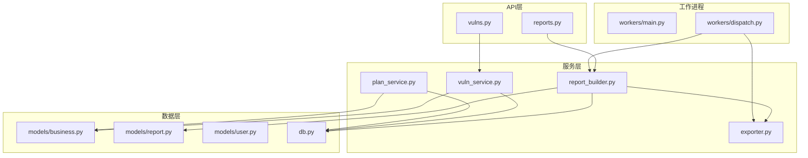
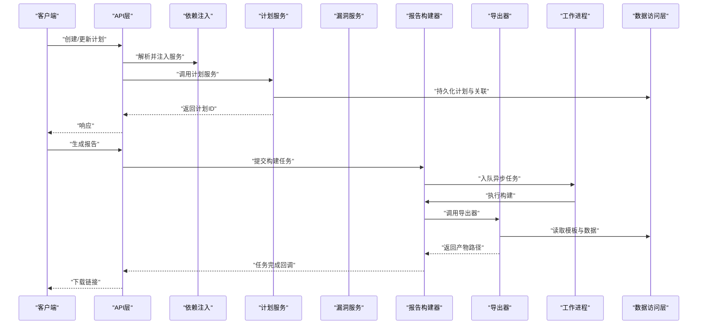
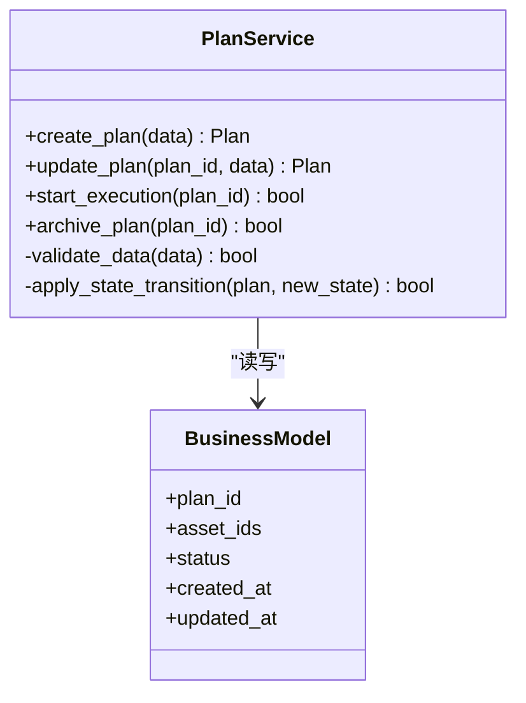
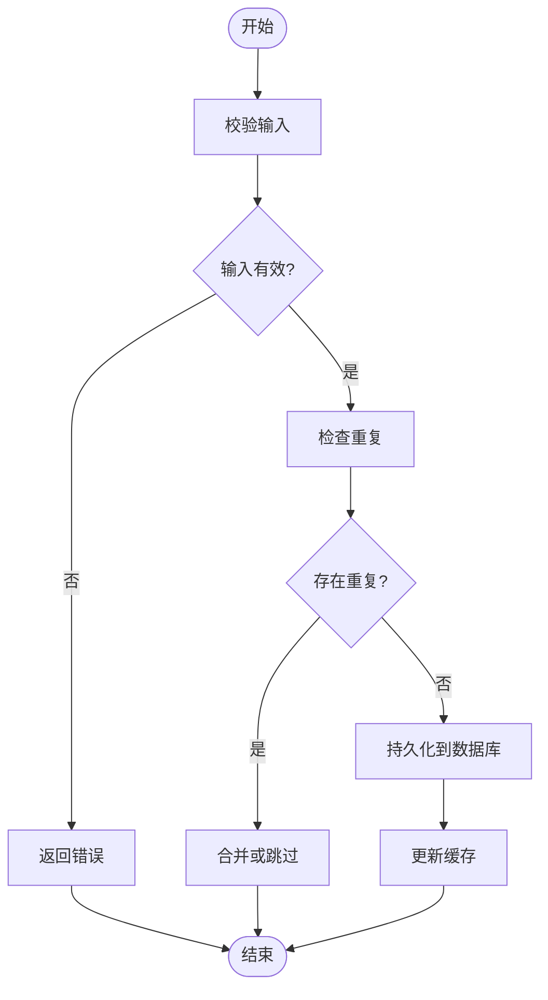
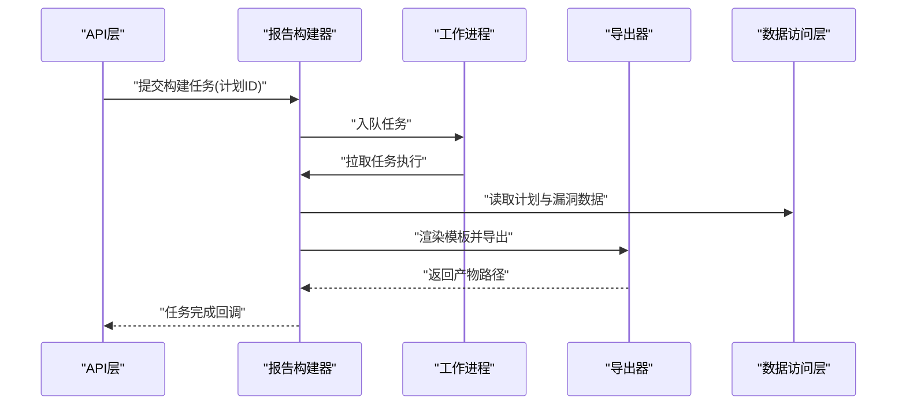
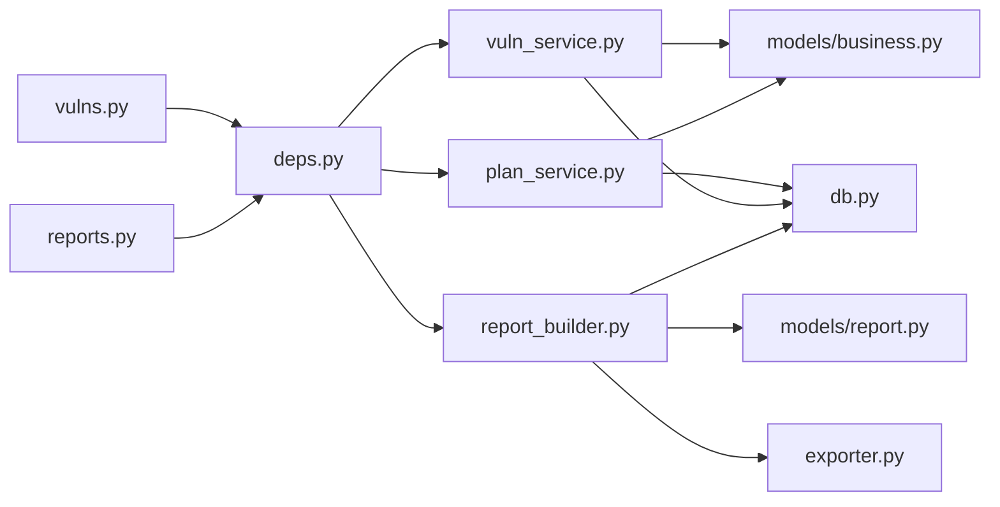

# 服务层架构

<cite>
**本文引用的文件**   
- [backend/app/main.py](file://backend/app/main.py)
- [backend/app/core/deps.py](file://backend/app/core/deps.py)
- [backend/app/db.py](file://backend/app/db.py)
- [backend/app/models/business.py](file://backend/app/models/business.py)
- [backend/app/models/report.py](file://backend/app/models/report.py)
- [backend/app/models/user.py](file://backend/app/models/user.py)
- [backend/app/schemas.py](file://backend/app/schemas.py)
- [backend/app/api/v1/reports.py](file://backend/app/api/v1/reports.py)
- [backend/app/api/v1/vulns.py](file://backend/app/api/v1/vulns.py)
- [backend/app/services/plan_service.py](file://backend/app/services/plan_service.py)
- [backend/app/services/vuln_service.py](file://backend/app/services/vuln_service.py)
- [backend/app/services/report_builder.py](file://backend/app/services/report_builder.py)
- [backend/app/services/exporter.py](file://backend/app/services/exporter.py)
- [backend/app/workers/main.py](file://backend/app/workers/main.py)
- [backend/app/workers/dispatch.py](file://backend/app/workers/dispatch.py)
</cite>

## 目录
1. [简介](#简介)
2. [项目结构](#项目结构)
3. [核心组件](#核心组件)
4. [架构总览](#架构总览)
5. [详细组件分析](#详细组件分析)
6. [依赖关系分析](#依赖关系分析)
7. [性能考量](#性能考量)
8. [故障排查指南](#故障排查指南)
9. [结论](#结论)
10. [附录](#附录)

## 简介
本文件聚焦Talos后端的服务层架构，围绕业务逻辑封装模式展开，重点解析计划服务、漏洞服务与报告构建器等核心模块的设计原则。文档将阐述服务层的职责分离、依赖注入、事务管理、数据访问抽象（ORM模型封装、查询优化、缓存策略）、服务间通信（事件驱动与异步处理），以及统一的错误处理、日志记录与监控指标实现思路。同时提供组件交互图与数据流转图，帮助读者快速理解系统结构与关键流程。

## 项目结构
Talos后端采用分层架构：API层负责请求路由与参数校验；服务层封装业务逻辑；数据访问层通过ORM模型与数据库交互；工作进程承担异步任务执行。核心目录如下：
- API层：按领域划分接口，如资产、用户、漏洞、报告等
- 服务层：计划服务、漏洞服务、报告构建器、导出器等
- 数据层：SQLAlchemy模型定义、数据库会话管理
- 工作进程：Celery或类似框架的任务调度与分发

图表来源
- [backend/app/api/v1/reports.py](file://backend/app/api/v1/reports.py)
- [backend/app/api/v1/vulns.py](file://backend/app/api/v1/vulns.py)
- [backend/app/services/plan_service.py](file://backend/app/services/plan_service.py)
- [backend/app/services/vuln_service.py](file://backend/app/services/vuln_service.py)
- [backend/app/services/report_builder.py](file://backend/app/services/report_builder.py)
- [backend/app/services/exporter.py](file://backend/app/services/exporter.py)
- [backend/app/models/business.py](file://backend/app/models/business.py)
- [backend/app/models/report.py](file://backend/app/models/report.py)
- [backend/app/models/user.py](file://backend/app/models/user.py)
- [backend/app/db.py](file://backend/app/db.py)
- [backend/app/workers/main.py](file://backend/app/workers/main.py)
- [backend/app/workers/dispatch.py](file://backend/app/workers/dispatch.py)

章节来源
- [backend/app/main.py](file://backend/app/main.py)
- [backend/app/core/deps.py](file://backend/app/core/deps.py)
- [backend/app/db.py](file://backend/app/db.py)

## 核心组件
- 计划服务（Plan Service）
  - 职责：编排测试计划生命周期，关联资产与漏洞项，维护计划状态机，协调报告生成触发。
  - 设计要点：基于领域模型的聚合根组织操作；对外暴露创建、更新、启动、归档等方法；内部使用事务边界保证一致性。
- 漏洞服务（Vuln Service）
  - 职责：漏洞条目CRUD、评分与分类、与资产关联、批量导入与去重。
  - 设计要点：查询条件组合与分页；对热点数据进行缓存；写路径采用乐观锁或版本字段避免并发冲突。
- 报告构建器（Report Builder）
  - 职责：聚合计划与漏洞数据，渲染模板，输出多格式（PDF/DOCX/HTML）。
  - 设计要点：模板引擎与数据映射解耦；导出过程异步化，支持进度回调与失败重试。
- 导出器（Exporter）
  - 职责：统一导出入口，适配不同格式的后端库，处理资源清理与异常回滚。
- 数据访问层（DB）
  - 职责：会话管理、连接池配置、事务上下文、通用查询封装。
- 工作进程（Workers）
  - 职责：接收任务队列消息，执行耗时任务（报告生成、批量导入），上报状态与指标。

章节来源
- [backend/app/services/plan_service.py](file://backend/app/services/plan_service.py)
- [backend/app/services/vuln_service.py](file://backend/app/services/vuln_service.py)
- [backend/app/services/report_builder.py](file://backend/app/services/report_builder.py)
- [backend/app/services/exporter.py](file://backend/app/services/exporter.py)
- [backend/app/db.py](file://backend/app/db.py)
- [backend/app/workers/main.py](file://backend/app/workers/main.py)
- [backend/app/workers/dispatch.py](file://backend/app/workers/dispatch.py)

## 架构总览
服务层采用“API→服务→数据访问”的清晰分层，结合工作进程进行异步处理。依赖注入贯穿API与服务层，确保可测试性与松耦合。事务在数据访问层集中管理，服务方法内划定事务边界。事件驱动用于跨服务通知（如计划完成触发报告生成）。

图表来源
- [backend/app/api/v1/reports.py](file://backend/app/api/v1/reports.py)
- [backend/app/api/v1/vulns.py](file://backend/app/api/v1/vulns.py)
- [backend/app/services/plan_service.py](file://backend/app/services/plan_service.py)
- [backend/app/services/vuln_service.py](file://backend/app/services/vuln_service.py)
- [backend/app/services/report_builder.py](file://backend/app/services/report_builder.py)
- [backend/app/services/exporter.py](file://backend/app/services/exporter.py)
- [backend/app/workers/main.py](file://backend/app/workers/main.py)
- [backend/app/workers/dispatch.py](file://backend/app/workers/dispatch.py)
- [backend/app/db.py](file://backend/app/db.py)

## 详细组件分析

### 计划服务（Plan Service）
- 职责边界
  - 计划实体聚合：计划基本信息、关联资产集合、状态变更。
  - 生命周期管理：草稿→待执行→执行中→已完成/已取消。
  - 与漏洞服务的协作：为计划绑定漏洞项，生成执行清单。
- 事务与一致性
  - 创建/更新计划时开启事务，确保计划与关联表原子写入。
  - 状态迁移使用幂等键，防止重复触发。
- 查询与缓存
  - 常用查询（按状态、时间范围）建立索引。
  - 热点计划信息可加入缓存，设置合理过期策略。

图表来源
- [backend/app/services/plan_service.py](file://backend/app/services/plan_service.py)
- [backend/app/models/business.py](file://backend/app/models/business.py)

章节来源
- [backend/app/services/plan_service.py](file://backend/app/services/plan_service.py)
- [backend/app/models/business.py](file://backend/app/models/business.py)

### 漏洞服务（Vuln Service）
- 职责边界
  - 漏洞条目CRUD、分类与严重等级管理。
  - 与资产的关联关系维护。
  - 批量导入与去重策略。
- 查询优化
  - 复杂筛选条件组合，使用预加载减少N+1。
  - 分页与排序字段索引。
- 并发控制
  - 写路径使用版本字段或行级锁。
  - 读路径允许最终一致性的缓存副本。

图表来源
- [backend/app/services/vuln_service.py](file://backend/app/services/vuln_service.py)
- [backend/app/models/business.py](file://backend/app/models/business.py)

章节来源
- [backend/app/services/vuln_service.py](file://backend/app/services/vuln_service.py)
- [backend/app/models/business.py](file://backend/app/models/business.py)

### 报告构建器（Report Builder）
- 职责边界
  - 聚合计划与漏洞数据，填充模板。
  - 多格式导出（PDF/DOCX/HTML）。
  - 异步任务编排与进度跟踪。
- 模板与数据映射
  - 模板引擎与数据模型解耦，便于扩展新模板。
  - 数据映射层负责规范化与格式化。
- 错误与重试
  - 构建失败自动重试，带退避策略。
  - 失败记录审计日志与告警。

图表来源
- [backend/app/services/report_builder.py](file://backend/app/services/report_builder.py)
- [backend/app/services/exporter.py](file://backend/app/services/exporter.py)
- [backend/app/workers/main.py](file://backend/app/workers/main.py)
- [backend/app/workers/dispatch.py](file://backend/app/workers/dispatch.py)
- [backend/app/db.py](file://backend/app/db.py)

章节来源
- [backend/app/services/report_builder.py](file://backend/app/services/report_builder.py)
- [backend/app/services/exporter.py](file://backend/app/services/exporter.py)
- [backend/app/workers/main.py](file://backend/app/workers/main.py)
- [backend/app/workers/dispatch.py](file://backend/app/workers/dispatch.py)

### 数据访问抽象层（DB与模型）
- 会话与连接池
  - 统一会话工厂，支持事务上下文管理器。
  - 连接池大小与超时配置，避免资源耗尽。
- ORM模型封装
  - 领域模型与表结构映射，包含基础字段与行为方法。
  - 常用查询封装为仓库方法，提升复用性。
- 查询优化
  - 使用selectin/joinedload减少N+1。
  - 分页查询限制返回字段，避免大对象传输。
- 缓存策略
  - 读多写少场景引入缓存（内存/Redis）。
  - 缓存失效策略与一致性保障（版本号或TTL）。

章节来源
- [backend/app/db.py](file://backend/app/db.py)
- [backend/app/models/business.py](file://backend/app/models/business.py)
- [backend/app/models/report.py](file://backend/app/models/report.py)
- [backend/app/models/user.py](file://backend/app/models/user.py)

### 工作进程与事件驱动
- 任务调度
  - 主进程注册任务处理器，监听队列。
  - 任务分发器根据类型路由到对应处理器。
- 事件驱动
  - 计划状态变更发布事件，订阅者执行后续动作（如生成报告）。
  - 事件总线解耦服务，提高可扩展性。
- 异步处理机制
  - 长耗时任务（报告生成、批量导入）异步执行。
  - 任务状态持久化，支持前端轮询或WebSocket推送。

章节来源
- [backend/app/workers/main.py](file://backend/app/workers/main.py)
- [backend/app/workers/dispatch.py](file://backend/app/workers/dispatch.py)

## 依赖关系分析
服务层通过依赖注入获取数据库会话与其他服务实例，降低耦合度。API层仅依赖服务接口，便于替换实现与单元测试。

图表来源
- [backend/app/api/v1/reports.py](file://backend/app/api/v1/reports.py)
- [backend/app/api/v1/vulns.py](file://backend/app/api/v1/vulns.py)
- [backend/app/core/deps.py](file://backend/app/core/deps.py)
- [backend/app/services/plan_service.py](file://backend/app/services/plan_service.py)
- [backend/app/services/vuln_service.py](file://backend/app/services/vuln_service.py)
- [backend/app/services/report_builder.py](file://backend/app/services/report_builder.py)
- [backend/app/services/exporter.py](file://backend/app/services/exporter.py)
- [backend/app/models/business.py](file://backend/app/models/business.py)
- [backend/app/models/report.py](file://backend/app/models/report.py)
- [backend/app/db.py](file://backend/app/db.py)

章节来源
- [backend/app/core/deps.py](file://backend/app/core/deps.py)
- [backend/app/api/v1/reports.py](file://backend/app/api/v1/reports.py)
- [backend/app/api/v1/vulns.py](file://backend/app/api/v1/vulns.py)

## 性能考量
- 数据库层面
  - 合理使用索引，覆盖高频查询条件。
  - 避免全表扫描与大对象传输，分页与投影字段。
  - 连接池调优，监控慢查询。
- 缓存策略
  - 热点数据缓存（计划详情、漏洞统计），设置合理TTL。
  - 缓存穿透与雪崩防护（布隆过滤器、随机过期）。
- 异步与并发
  - 长耗时任务异步化，提升API响应速度。
  - 任务队列扩容与消费者并行度调整。
- 资源管理
  - 文件导出临时文件清理，避免磁盘占用。
  - 内存使用监控，避免OOM。

[本节为通用指导，不直接分析具体文件]

## 故障排查指南
- 常见问题定位
  - 数据库连接失败：检查连接池配置与网络连通性。
  - 任务堆积：查看队列长度与消费者健康状态。
  - 报告生成失败：检查模板文件与依赖库版本。
- 日志与监控
  - 统一日志格式，包含请求ID与上下文。
  - 关键指标采集（QPS、延迟、错误率、队列深度）。
  - 告警规则设置（阈值与通知渠道）。
- 错误处理
  - 服务层捕获异常并转换为标准错误码。
  - 重试与降级策略，保障用户体验。

章节来源
- [backend/app/db.py](file://backend/app/db.py)
- [backend/app/workers/main.py](file://backend/app/workers/main.py)
- [backend/app/workers/dispatch.py](file://backend/app/workers/dispatch.py)

## 结论
Talos服务层通过清晰的职责分离、依赖注入与事务管理，实现了高内聚低耦合的业务封装。计划服务、漏洞服务与报告构建器各司其职，配合工作进程的事件驱动与异步处理，提升了系统的可扩展性与稳定性。数据访问层提供统一的ORM封装与查询优化，结合缓存策略满足性能需求。统一的错误处理、日志与监控为运维提供了有力支撑。

[本节为总结性内容，不直接分析具体文件]

## 附录
- 术语表
  - 计划：测试计划的抽象，包含资产与漏洞项集合。
  - 漏洞：安全漏洞条目，具有分类与严重等级。
  - 报告：由模板与数据生成的文档产物。
  - 工作进程：异步任务执行单元。
- 参考文件
  - API层：reports.py、vulns.py
  - 服务层：plan_service.py、vuln_service.py、report_builder.py、exporter.py
  - 数据层：business.py、report.py、user.py、db.py
  - 工作进程：main.py、dispatch.py

[本节为补充信息，不直接分析具体文件]