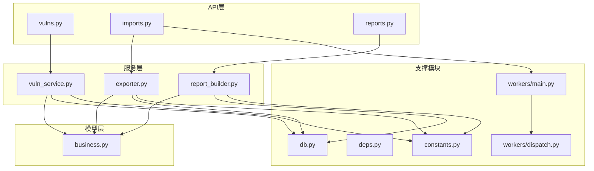
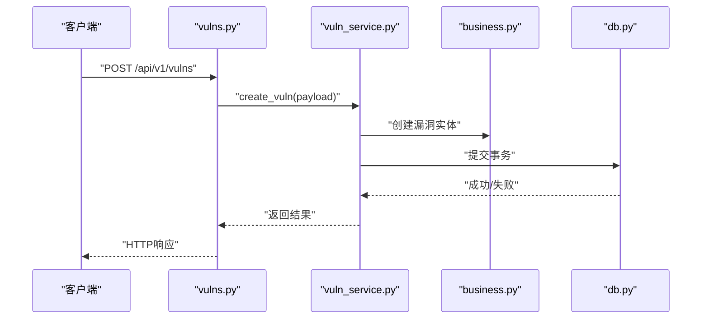
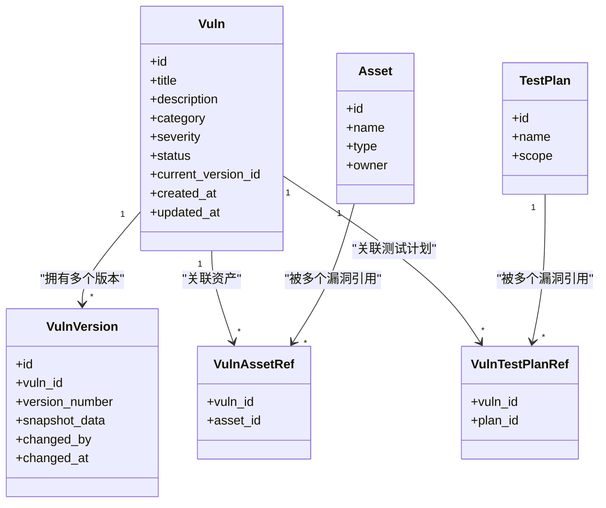
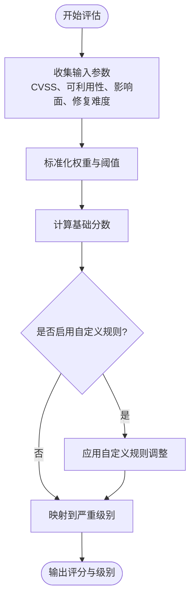
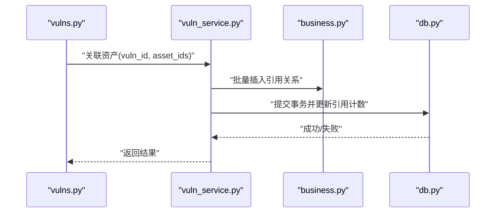
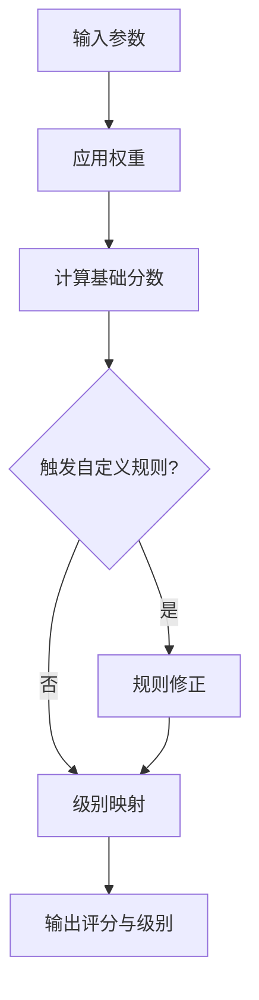
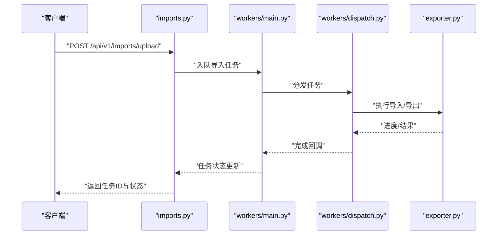
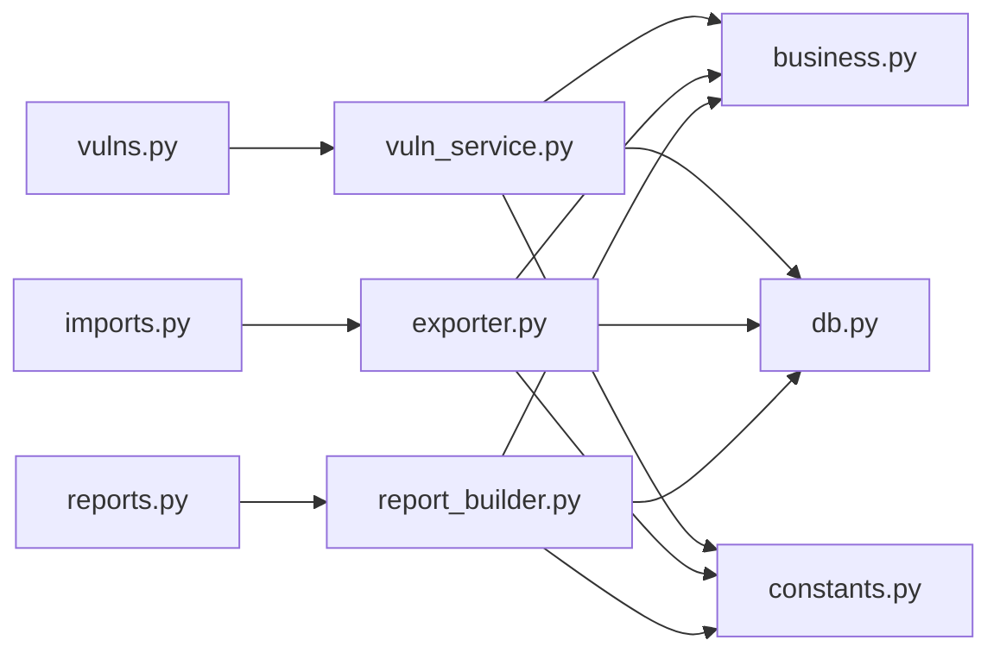

# 漏洞服务

<cite>
**本文档引用的文件**   
- [backend/app/api/v1/vulns.py](file://backend/app/api/v1/vulns.py)
- [backend/app/services/vuln_service.py](file://backend/app/services/vuln_service.py)
- [backend/app/models/business.py](file://backend/app/models/business.py)
- [backend/app/schemas.py](file://backend/app/schemas.py)
- [backend/app/db.py](file://backend/app/db.py)
- [backend/app/core/deps.py](file://backend/app/core/deps.py)
- [backend/app/api/v1/imports.py](file://backend/app/api/v1/imports.py)
- [backend/app/services/exporter.py](file://backend/app/services/exporter.py)
- [backend/app/workers/main.py](file://backend/app/workers/main.py)
- [backend/app/workers/dispatch.py](file://backend/app/workers/dispatch.py)
- [backend/app/constants.py](file://backend/app/constants.py)
- [backend/app/api/v1/reports.py](file://backend/app/api/v1/reports.py)
- [backend/app/services/report_builder.py](file://backend/app/services/report_builder.py)
</cite>

## 目录
1. [简介](#简介)
2. [项目结构](#项目结构)
3. [核心组件](#核心组件)
4. [架构总览](#架构总览)
5. [详细组件分析](#详细组件分析)
6. [依赖关系分析](#依赖关系分析)
7. [性能考量](#性能考量)
8. [故障排查指南](#故障排查指南)
9. [结论](#结论)
10. [附录](#附录)

## 简介
本文件面向Talos系统的“漏洞服务”，系统性阐述漏洞数据管理、分类体系与严重级别评估、版本控制与历史追踪、与资产和测试计划的关联（引用计数、级联删除、一致性）、评分与风险计算、自定义规则支持、批量导入导出、数据验证与性能优化策略，并提供查询接口、过滤条件与排序选项的使用示例。文档兼顾技术深度与可读性，帮助开发者与维护者快速理解并高效使用漏洞服务。

## 项目结构
围绕漏洞服务的后端代码主要分布在以下模块：
- API层：REST接口定义与请求路由
- 服务层：业务逻辑封装（增删改查、版本化、评分、导入导出）
- 模型层：数据库表结构与关系映射
- 数据校验层：Pydantic Schema
- 数据库连接与会话管理
- 异步任务与工作进程（导入导出等耗时操作）
- 常量与配置（枚举、默认值、阈值）

图表来源
- [backend/app/api/v1/vulns.py](file://backend/app/api/v1/vulns.py)
- [backend/app/services/vuln_service.py](file://backend/app/services/vuln_service.py)
- [backend/app/models/business.py](file://backend/app/models/business.py)
- [backend/app/schemas.py](file://backend/app/schemas.py)
- [backend/app/db.py](file://backend/app/db.py)
- [backend/app/core/deps.py](file://backend/app/core/deps.py)
- [backend/app/api/v1/imports.py](file://backend/app/api/v1/imports.py)
- [backend/app/services/exporter.py](file://backend/app/services/exporter.py)
- [backend/app/workers/main.py](file://backend/app/workers/main.py)
- [backend/app/workers/dispatch.py](file://backend/app/workers/dispatch.py)
- [backend/app/constants.py](file://backend/app/constants.py)
- [backend/app/api/v1/reports.py](file://backend/app/api/v1/reports.py)
- [backend/app/services/report_builder.py](file://backend/app/services/report_builder.py)

章节来源
- [backend/app/api/v1/vulns.py](file://backend/app/api/v1/vulns.py)
- [backend/app/services/vuln_service.py](file://backend/app/services/vuln_service.py)
- [backend/app/models/business.py](file://backend/app/models/business.py)
- [backend/app/schemas.py](file://backend/app/schemas.py)
- [backend/app/db.py](file://backend/app/db.py)
- [backend/app/core/deps.py](file://backend/app/core/deps.py)
- [backend/app/api/v1/imports.py](file://backend/app/api/v1/imports.py)
- [backend/app/services/exporter.py](file://backend/app/services/exporter.py)
- [backend/app/workers/main.py](file://backend/app/workers/main.py)
- [backend/app/workers/dispatch.py](file://backend/app/workers/dispatch.py)
- [backend/app/constants.py](file://backend/app/constants.py)
- [backend/app/api/v1/reports.py](file://backend/app/api/v1/reports.py)
- [backend/app/services/report_builder.py](file://backend/app/services/report_builder.py)

## 核心组件
- 漏洞数据模型与版本化：通过主表与版本表分离实现变更历史追踪；每次更新生成新版本记录，保留旧版本快照。
- 分类与严重级别：基于分类体系与严重级别枚举进行统一标注，支持按分类、级别筛选与统计。
- 评分与风险计算：结合CVSS或内部评分规则，考虑影响面、可被利用性、修复难度等维度，输出综合评分与风险等级。
- 关联关系：与资产、测试计划建立多对多或一对多关系，维护引用计数，确保级联删除与数据一致性。
- 批量导入导出：提供CSV/JSON等格式导入导出，支持异步任务队列处理大批量数据。
- 数据验证：通过Schema进行字段校验、约束检查与错误提示。
- 查询与过滤：支持按名称、分类、级别、状态、时间范围、标签等多维过滤与排序。

章节来源
- [backend/app/models/business.py](file://backend/app/models/business.py)
- [backend/app/schemas.py](file://backend/app/schemas.py)
- [backend/app/constants.py](file://backend/app/constants.py)
- [backend/app/services/vuln_service.py](file://backend/app/services/vuln_service.py)

## 架构总览
漏洞服务采用分层架构：API层暴露REST接口，服务层封装业务逻辑，模型层负责数据持久化，支撑模块提供数据库会话、依赖注入、常量定义与异步任务调度。

图表来源
- [backend/app/api/v1/vulns.py](file://backend/app/api/v1/vulns.py)
- [backend/app/services/vuln_service.py](file://backend/app/services/vuln_service.py)
- [backend/app/models/business.py](file://backend/app/models/business.py)
- [backend/app/db.py](file://backend/app/db.py)

## 详细组件分析

### 漏洞数据模型与版本控制
- 主表存储当前有效版本，版本表保存历史快照，包含版本号、变更时间、变更人、差异摘要等。
- 更新流程：读取当前版本 -> 构建新版本对象 -> 写入版本表 -> 更新主表指向最新版本 -> 维护引用计数。
- 回滚能力：支持将指定版本提升为当前版本，并记录回滚历史。

图表来源
- [backend/app/models/business.py](file://backend/app/models/business.py)

章节来源
- [backend/app/models/business.py](file://backend/app/models/business.py)

### 分类体系与严重级别评估
- 分类体系：涵盖网络、应用、系统、第三方组件等类别，支持扩展新分类。
- 严重级别：通常分为致命、高危、中危、低危、信息，用于快速定位风险优先级。
- 评估依据：结合CVSS向量、可利用性、影响面、修复成本等维度，由评分算法输出最终级别。

图表来源
- [backend/app/services/vuln_service.py](file://backend/app/services/vuln_service.py)
- [backend/app/constants.py](file://backend/app/constants.py)

章节来源
- [backend/app/services/vuln_service.py](file://backend/app/services/vuln_service.py)
- [backend/app/constants.py](file://backend/app/constants.py)

### 与资产、测试计划的关联关系
- 引用计数：每个关联关系维护引用计数，避免重复关联与资源泄漏。
- 级联删除：当资产或测试计划被删除时，清理相关引用并更新漏洞的关联计数。
- 一致性保证：在事务内完成关联关系的增删改，确保数据一致性。

图表来源
- [backend/app/api/v1/vulns.py](file://backend/app/api/v1/vulns.py)
- [backend/app/services/vuln_service.py](file://backend/app/services/vuln_service.py)
- [backend/app/models/business.py](file://backend/app/models/business.py)
- [backend/app/db.py](file://backend/app/db.py)

章节来源
- [backend/app/api/v1/vulns.py](file://backend/app/api/v1/vulns.py)
- [backend/app/services/vuln_service.py](file://backend/app/services/vuln_service.py)
- [backend/app/models/business.py](file://backend/app/models/business.py)
- [backend/app/db.py](file://backend/app/db.py)

### 评分算法与风险计算逻辑
- 输入维度：CVSS基础分、可利用性、影响面、修复难度、业务上下文。
- 权重配置：可通过常量或配置文件调整各维度权重。
- 自定义规则：支持正则匹配、关键字、分类特定规则进行分数修正。
- 输出：综合评分与风险等级（如高/中/低），并可导出为报告。

图表来源
- [backend/app/services/vuln_service.py](file://backend/app/services/vuln_service.py)
- [backend/app/constants.py](file://backend/app/constants.py)

章节来源
- [backend/app/services/vuln_service.py](file://backend/app/services/vuln_service.py)
- [backend/app/constants.py](file://backend/app/constants.py)

### 批量导入导出
- 导入：支持CSV/JSON格式，解析后批量入库，支持预览与校验。
- 导出：按条件筛选导出数据，支持分页与流式输出。
- 异步处理：通过工作进程处理大批量导入导出，避免阻塞API。

图表来源
- [backend/app/api/v1/imports.py](file://backend/app/api/v1/imports.py)
- [backend/app/workers/main.py](file://backend/app/workers/main.py)
- [backend/app/workers/dispatch.py](file://backend/app/workers/dispatch.py)
- [backend/app/services/exporter.py](file://backend/app/services/exporter.py)

章节来源
- [backend/app/api/v1/imports.py](file://backend/app/api/v1/imports.py)
- [backend/app/workers/main.py](file://backend/app/workers/main.py)
- [backend/app/workers/dispatch.py](file://backend/app/workers/dispatch.py)
- [backend/app/services/exporter.py](file://backend/app/services/exporter.py)

### 数据验证与Schema
- 字段类型与约束：必填、长度、格式、枚举值等。
- 自定义校验器：针对业务规则进行额外校验（如分类与级别的兼容性）。
- 错误提示：结构化错误信息，便于前端展示与调试。

章节来源
- [backend/app/schemas.py](file://backend/app/schemas.py)

### 查询接口、过滤条件与排序选项
- 查询接口：提供列表查询、详情获取、搜索接口。
- 过滤条件：名称、分类、级别、状态、时间范围、标签、作者等。
- 排序选项：按更新时间、评分、级别、名称等字段排序，支持升序/降序。
- 分页：支持页码与每页数量参数，提高大数据集查询性能。

章节来源
- [backend/app/api/v1/vulns.py](file://backend/app/api/v1/vulns.py)
- [backend/app/schemas.py](file://backend/app/schemas.py)

### 报告生成与风险汇总
- 报告模板：支持多种格式（PDF/Word/HTML），包含漏洞清单、评分分布、趋势图。
- 数据聚合：按分类、级别、资产维度汇总统计。
- 定时任务：定期生成报告并推送至指定渠道。

章节来源
- [backend/app/api/v1/reports.py](file://backend/app/api/v1/reports.py)
- [backend/app/services/report_builder.py](file://backend/app/services/report_builder.py)

## 依赖关系分析
- 模块耦合：API层依赖服务层，服务层依赖模型层与数据库连接，支撑模块提供通用能力。
- 外部依赖：数据库驱动、异步任务框架、文件解析库、报告生成库。
- 循环依赖：通过分层与接口隔离避免循环依赖。

图表来源
- [backend/app/api/v1/vulns.py](file://backend/app/api/v1/vulns.py)
- [backend/app/services/vuln_service.py](file://backend/app/services/vuln_service.py)
- [backend/app/models/business.py](file://backend/app/models/business.py)
- [backend/app/db.py](file://backend/app/db.py)
- [backend/app/constants.py](file://backend/app/constants.py)
- [backend/app/api/v1/imports.py](file://backend/app/api/v1/imports.py)
- [backend/app/services/exporter.py](file://backend/app/services/exporter.py)
- [backend/app/api/v1/reports.py](file://backend/app/api/v1/reports.py)
- [backend/app/services/report_builder.py](file://backend/app/services/report_builder.py)

章节来源
- [backend/app/api/v1/vulns.py](file://backend/app/api/v1/vulns.py)
- [backend/app/services/vuln_service.py](file://backend/app/services/vuln_service.py)
- [backend/app/models/business.py](file://backend/app/models/business.py)
- [backend/app/db.py](file://backend/app/db.py)
- [backend/app/constants.py](file://backend/app/constants.py)
- [backend/app/api/v1/imports.py](file://backend/app/api/v1/imports.py)
- [backend/app/services/exporter.py](file://backend/app/services/exporter.py)
- [backend/app/api/v1/reports.py](file://backend/app/api/v1/reports.py)
- [backend/app/services/report_builder.py](file://backend/app/services/report_builder.py)

## 性能考量
- 数据库索引：对常用查询字段（分类、级别、更新时间、状态）建立索引，提升查询效率。
- 分页与游标：大数据集查询使用分页与游标，减少内存占用。
- 批量操作：导入导出使用批量插入/更新，降低事务开销。
- 异步任务：耗时操作放入任务队列，避免阻塞请求线程。
- 缓存策略：对热点数据（如分类、级别字典）进行缓存，减少重复计算。
- 连接池：合理配置数据库连接池大小，避免连接耗尽。

[本节为通用指导，不直接分析具体文件]

## 故障排查指南
- 导入失败：检查文件格式、字段映射、校验规则；查看任务日志定位错误行。
- 关联不一致：检查引用计数与事务提交状态；确认级联删除逻辑是否正确执行。
- 评分异常：核对权重配置与自定义规则；验证输入参数的合法性。
- 查询缓慢：检查索引使用情况与SQL执行计划；优化过滤条件与排序字段。
- 报告生成失败：确认模板路径与权限；检查依赖库安装情况。

章节来源
- [backend/app/api/v1/imports.py](file://backend/app/api/v1/imports.py)
- [backend/app/services/exporter.py](file://backend/app/services/exporter.py)
- [backend/app/services/vuln_service.py](file://backend/app/services/vuln_service.py)
- [backend/app/api/v1/reports.py](file://backend/app/api/v1/reports.py)

## 结论
Talos漏洞服务通过分层架构与模块化设计，实现了完整的漏洞数据管理、分类与严重级别评估、版本控制与历史追踪、与资产和测试计划的关联管理、评分与风险计算、批量导入导出、数据验证与性能优化。其清晰的职责划分与可扩展的设计，为安全团队提供了高效、可靠的漏洞管理能力。

[本节为总结性内容，不直接分析具体文件]

## 附录
- 术语表：漏洞、版本、分类、严重级别、引用计数、级联删除、评分、风险等级、导入导出、Schema、异步任务。
- 最佳实践：
  - 更新漏洞时始终创建新版本，避免直接修改主表。
  - 批量操作使用事务包裹，确保一致性。
  - 自定义规则需经过充分测试，避免误判。
  - 监控导入导出任务状态，及时处理失败重试。

[本节为补充信息，不直接分析具体文件]