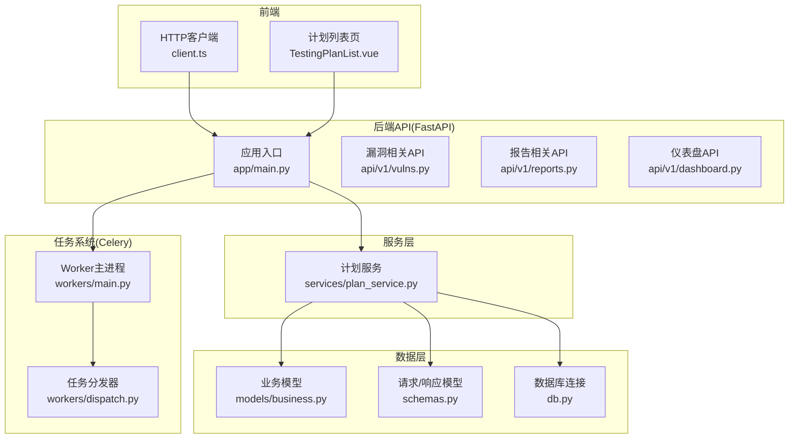
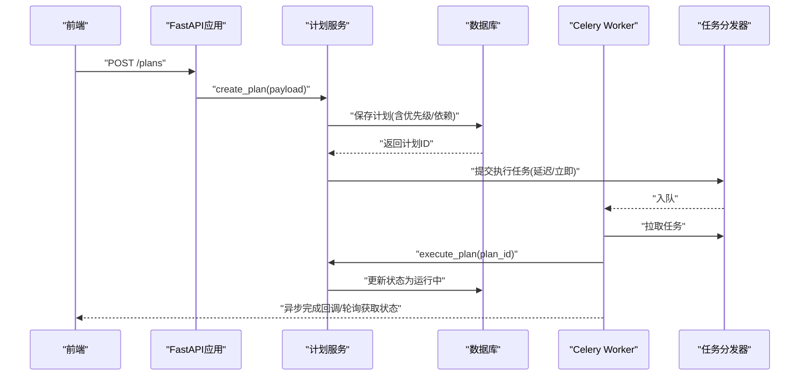
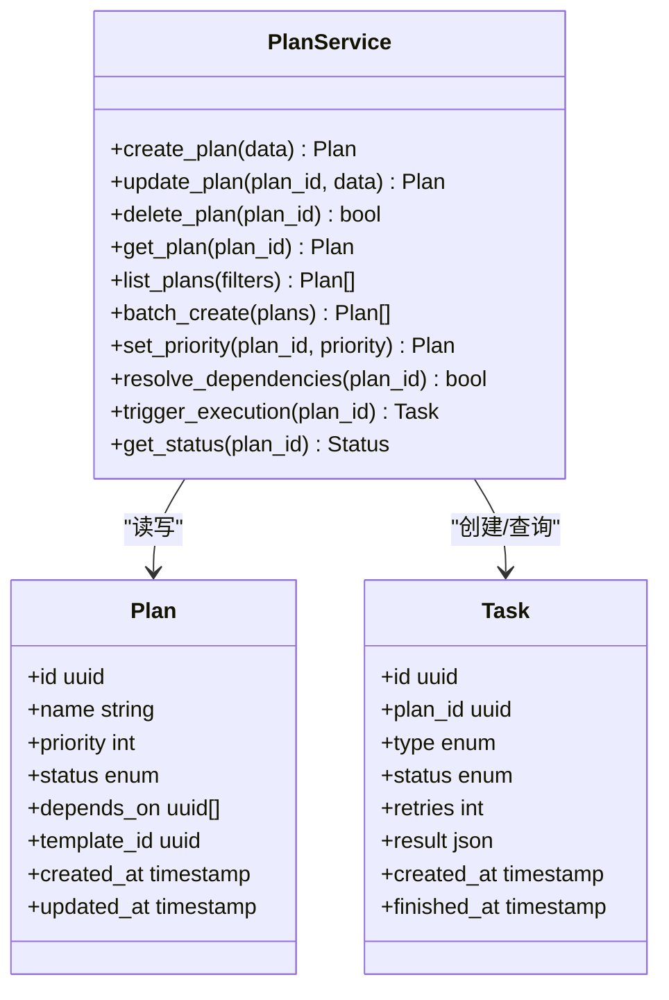
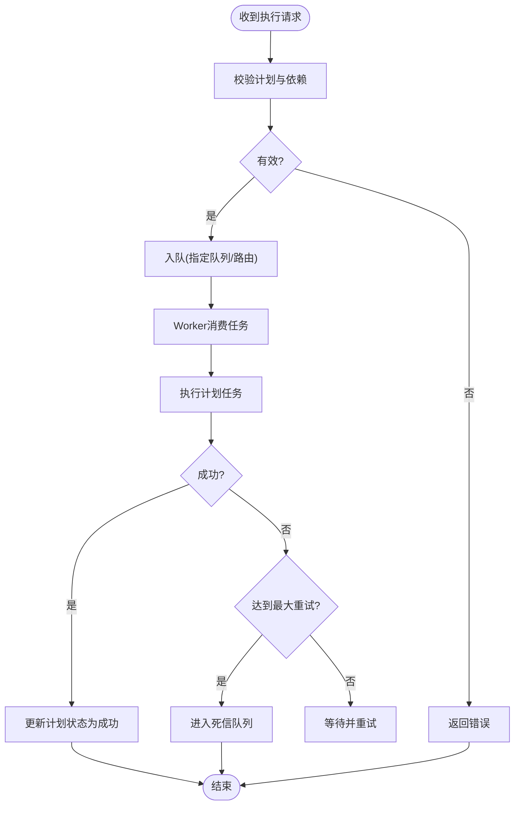
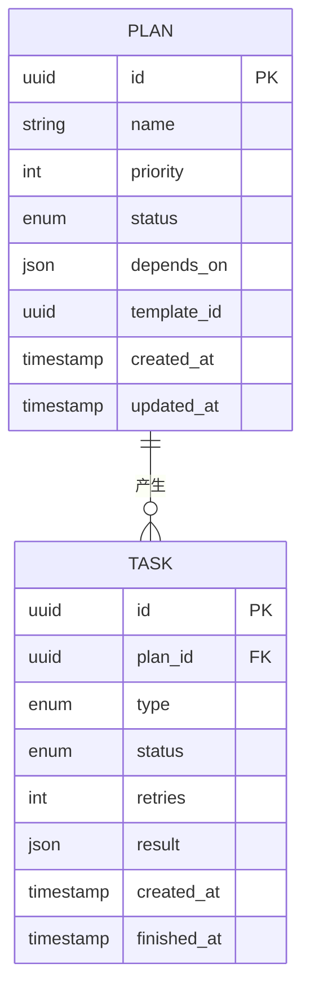
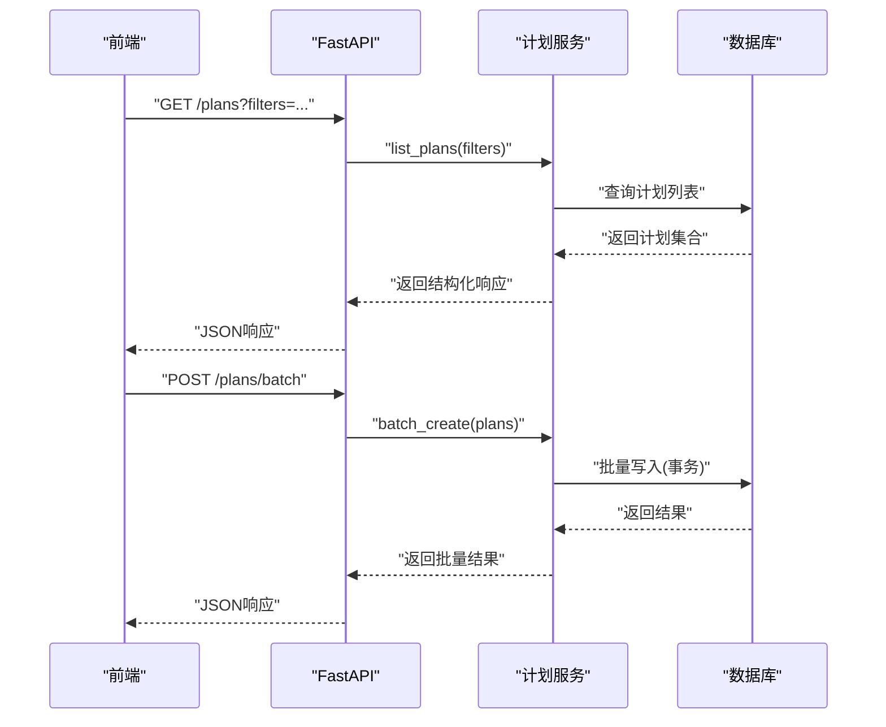
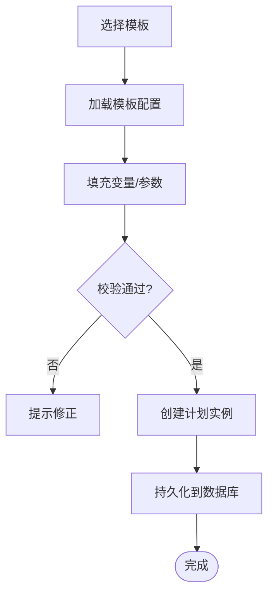
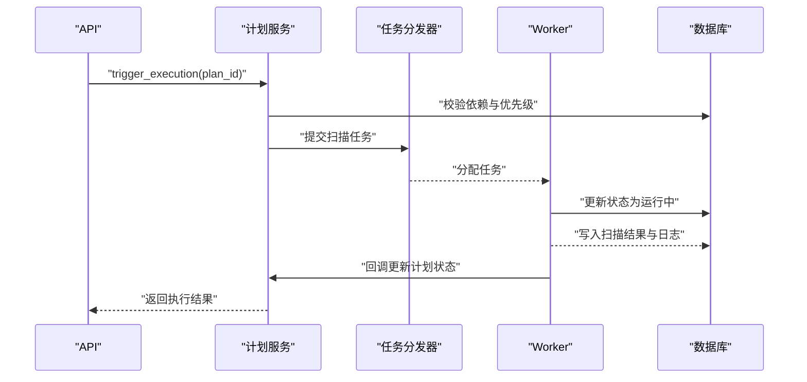
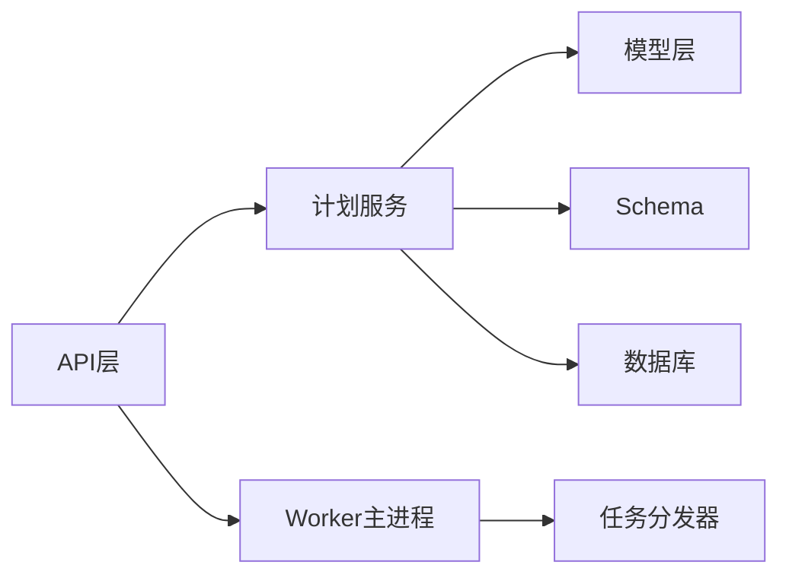

# 计划服务

<cite>
**本文档引用的文件**   
- [plan_service.py](file://backend/app/services/plan_service.py)
- [main.py](file://backend/app/main.py)
- [dispatch.py](file://backend/app/workers/dispatch.py)
- [main.py](file://backend/app/workers/main.py)
- [business.py](file://backend/app/models/business.py)
- [schemas.py](file://backend/app/schemas.py)
- [config.py](file://backend/app/core/config.py)
- [deps.py](file://backend/app/core/deps.py)
- [security.py](file://backend/app/core/security.py)
- [db.py](file://backend/app/db.py)
- [constants.py](file://backend/app/constants.py)
- [vulns.py](file://backend/app/api/v1/vulns.py)
- [reports.py](file://backend/app/api/v1/reports.py)
- [dashboard.py](file://backend/app/api/v1/dashboard.py)
- [client.ts](file://frontend/src/api/client.ts)
- [TestingPlanList.vue](file://frontend/src/views/TestingPlanList.vue)
</cite>

## 目录
1. [简介](#简介)
2. [项目结构](#项目结构)
3. [核心组件](#核心组件)
4. [架构总览](#架构总览)
5. [详细组件分析](#详细组件分析)
6. [依赖关系分析](#依赖关系分析)
7. [性能考虑](#性能考虑)
8. [故障排查指南](#故障排查指南)
9. [结论](#结论)
10. [附录](#附录)

## 简介
本文件面向Talos计划服务的开发者与使用者，系统性阐述测试计划管理、任务调度、执行状态跟踪等核心能力。文档覆盖计划的CRUD操作、优先级管理、依赖关系处理；解释计划与漏洞扫描任务的关联机制（任务队列集成、并发控制、重试策略）；描述计划执行的监控与日志记录；并给出计划模板管理、批量操作与性能优化策略。同时提供API调用示例与错误处理模式，帮助读者快速上手与排障。

## 项目结构
后端采用FastAPI + SQLAlchemy + Celery的典型分层：
- API层：REST接口定义与请求校验
- 服务层：业务逻辑封装（计划服务为核心）
- 模型层：数据库ORM映射
- 工作进程：Celery任务分发与执行
- 配置与安全：环境变量、认证与权限
- 前端：Vue + TypeScript，通过HTTP客户端调用后端API

**图表来源** 
- [main.py](file://backend/app/main.py)
- [plan_service.py](file://backend/app/services/plan_service.py)
- [business.py](file://backend/app/models/business.py)
- [schemas.py](file://backend/app/schemas.py)
- [dispatch.py](file://backend/app/workers/dispatch.py)
- [main.py](file://backend/app/workers/main.py)

**章节来源**
- [main.py](file://backend/app/main.py)
- [plan_service.py](file://backend/app/services/plan_service.py)
- [dispatch.py](file://backend/app/workers/dispatch.py)
- [main.py](file://backend/app/workers/main.py)

## 核心组件
- 计划服务（Plan Service）
  - 负责计划的创建、更新、删除、查询、批量操作、优先级与依赖关系处理、触发与状态同步。
- 任务分发器（Task Dispatcher）
  - 将计划执行转化为可调度任务，管理队列、并发与重试。
- 模型与Schema
  - 计划实体、任务实体、状态枚举、API请求/响应结构。
- 配置与安全
  - 环境变量、认证鉴权、权限控制。
- 数据库连接
  - ORM会话、事务管理、迁移。

**章节来源**
- [plan_service.py](file://backend/app/services/plan_service.py)
- [dispatch.py](file://backend/app/workers/dispatch.py)
- [business.py](file://backend/app/models/business.py)
- [schemas.py](file://backend/app/schemas.py)
- [config.py](file://backend/app/core/config.py)
- [deps.py](file://backend/app/core/deps.py)
- [security.py](file://backend/app/core/security.py)
- [db.py](file://backend/app/db.py)

## 架构总览
计划服务与任务系统的交互流程如下：
- 前端通过API发起计划创建/更新/删除等操作
- 服务层校验输入、持久化变更、必要时生成任务
- 任务分发器将执行任务入队，Worker消费并执行
- 执行过程中更新计划状态、记录日志，支持重试与失败回滚

**图表来源** 
- [main.py](file://backend/app/main.py)
- [plan_service.py](file://backend/app/services/plan_service.py)
- [dispatch.py](file://backend/app/workers/dispatch.py)
- [main.py](file://backend/app/workers/main.py)

## 详细组件分析

### 计划服务（Plan Service）
职责与要点：
- CRUD操作：创建、读取、更新、删除计划，支持按条件筛选与分页
- 优先级管理：基于数值或等级字段排序与调度
- 依赖关系处理：解析依赖图，确保前置计划完成后才执行当前计划
- 状态机：维护计划生命周期（待执行、运行中、成功、失败、已取消）
- 模板管理：从模板实例化计划，复用配置与参数
- 批量操作：批量创建/更新/删除，支持事务与部分失败回滚
- 与漏洞扫描任务关联：根据计划配置生成扫描任务，绑定目标资产与规则集

**图表来源** 
- [plan_service.py](file://backend/app/services/plan_service.py)
- [business.py](file://backend/app/models/business.py)
- [schemas.py](file://backend/app/schemas.py)

**章节来源**
- [plan_service.py](file://backend/app/services/plan_service.py)
- [business.py](file://backend/app/models/business.py)
- [schemas.py](file://backend/app/schemas.py)

### 任务分发器（Task Dispatcher）
职责与要点：
- 任务入队：根据计划类型与配置选择队列与路由键
- 并发控制：限制队列消费者数量与单任务最大并发
- 重试策略：指数退避、最大重试次数、死信队列
- 结果存储：任务执行结果与日志持久化
- 监控指标：队列长度、消费速率、失败率

**图表来源** 
- [dispatch.py](file://backend/app/workers/dispatch.py)
- [main.py](file://backend/app/workers/main.py)

**章节来源**
- [dispatch.py](file://backend/app/workers/dispatch.py)
- [main.py](file://backend/app/workers/main.py)

### 模型与Schema
- 计划模型：包含名称、优先级、状态、依赖列表、模板ID、时间戳等
- 任务模型：包含类型、状态、重试次数、结果、时间戳等
- Schema：定义API请求体与响应体的字段、校验规则与默认值

**图表来源** 
- [business.py](file://backend/app/models/business.py)
- [schemas.py](file://backend/app/schemas.py)

**章节来源**
- [business.py](file://backend/app/models/business.py)
- [schemas.py](file://backend/app/schemas.py)

### API层与前端集成
- API端点：计划CRUD、批量操作、状态查询、触发执行
- 前端页面：TestingPlanList.vue用于展示与管理计划
- HTTP客户端：client.ts封装请求、错误处理与重试

**图表来源** 
- [main.py](file://backend/app/main.py)
- [plan_service.py](file://backend/app/services/plan_service.py)
- [client.ts](file://frontend/src/api/client.ts)
- [TestingPlanList.vue](file://frontend/src/views/TestingPlanList.vue)

**章节来源**
- [main.py](file://backend/app/main.py)
- [client.ts](file://frontend/src/api/client.ts)
- [TestingPlanList.vue](file://frontend/src/views/TestingPlanList.vue)

### 计划模板管理
- 模板定义：预置的计划结构与参数
- 实例化：从模板创建计划，继承默认配置
- 版本控制：模板版本与计划实例的关联

**图表来源** 
- [plan_service.py](file://backend/app/services/plan_service.py)
- [business.py](file://backend/app/models/business.py)

**章节来源**
- [plan_service.py](file://backend/app/services/plan_service.py)
- [business.py](file://backend/app/models/business.py)

### 与漏洞扫描任务的关联机制
- 任务类型：根据计划配置选择扫描任务类型（如远程扫描、本地扫描）
- 目标绑定：将计划与资产、规则集、扫描参数关联
- 执行上下文：注入环境变量、凭据、超时设置
- 结果聚合：扫描结果与计划状态联动更新

**图表来源** 
- [plan_service.py](file://backend/app/services/plan_service.py)
- [dispatch.py](file://backend/app/workers/dispatch.py)
- [main.py](file://backend/app/workers/main.py)
- [business.py](file://backend/app/models/business.py)

**章节来源**
- [plan_service.py](file://backend/app/services/plan_service.py)
- [dispatch.py](file://backend/app/workers/dispatch.py)
- [main.py](file://backend/app/workers/main.py)
- [business.py](file://backend/app/models/business.py)

## 依赖关系分析
- 模块耦合
  - API层依赖服务层进行业务编排
  - 服务层依赖模型层与数据库连接
  - 任务分发器与工作进程解耦，通过消息队列通信
- 外部依赖
  - FastAPI框架、SQLAlchemy ORM、Celery任务队列
- 潜在循环依赖
  - 服务层不应直接依赖任务层，避免反向调用

**图表来源** 
- [main.py](file://backend/app/main.py)
- [plan_service.py](file://backend/app/services/plan_service.py)
- [dispatch.py](file://backend/app/workers/dispatch.py)
- [main.py](file://backend/app/workers/main.py)

**章节来源**
- [main.py](file://backend/app/main.py)
- [plan_service.py](file://backend/app/services/plan_service.py)
- [dispatch.py](file://backend/app/workers/dispatch.py)
- [main.py](file://backend/app/workers/main.py)

## 性能考虑
- 数据库层面
  - 合理使用索引（计划优先级、状态、依赖字段）
  - 批量操作使用事务减少IO开销
- 任务队列
  - 合理设置队列分区与路由键，避免热点
  - 调整消费者并发数与任务超时
- 缓存与幂等
  - 对只读查询引入缓存
  - 任务执行保证幂等，避免重复执行
- 资源隔离
  - 不同计划类型分配到独立队列，防止相互影响

[本节为通用指导，不直接分析具体文件]

## 故障排查指南
- 常见问题
  - 计划状态未更新：检查Worker是否正常运行、任务是否被消费
  - 依赖冲突：验证依赖图无环，前置计划已完成
  - 重试风暴：检查最大重试次数与退避策略
- 日志定位
  - 查看任务执行日志与数据库状态变更记录
  - 关注错误堆栈与异常码
- 恢复策略
  - 清理死信队列中的失败任务
  - 重新触发失败的计划或任务

**章节来源**
- [dispatch.py](file://backend/app/workers/dispatch.py)
- [main.py](file://backend/app/workers/main.py)
- [plan_service.py](file://backend/app/services/plan_service.py)

## 结论
Talos计划服务以清晰的分层架构与任务驱动的执行模型，实现了健壮的测试计划管理与漏洞扫描任务调度。通过优先级与依赖管理、模板化与批量操作、以及完善的监控与日志机制，能够满足复杂场景下的自动化测试需求。建议在生产环境中结合缓存、队列分区与资源隔离进一步优化性能与稳定性。

[本节为总结性内容，不直接分析具体文件]

## 附录
- API调用示例（概念性说明）
  - 创建计划：POST /plans，请求体包含名称、优先级、依赖列表、模板ID等
  - 更新计划：PUT /plans/{plan_id}，支持修改优先级与依赖
  - 删除计划：DELETE /plans/{plan_id}
  - 触发执行：POST /plans/{plan_id}/trigger
  - 查询状态：GET /plans/{plan_id}/status
- 错误处理模式
  - 参数校验错误：返回422，包含字段级错误信息
  - 依赖冲突：返回409，提示依赖未满足或存在环
  - 任务失败：返回500，附带重试建议与日志链接

[本节为概念性说明，不直接分析具体文件]