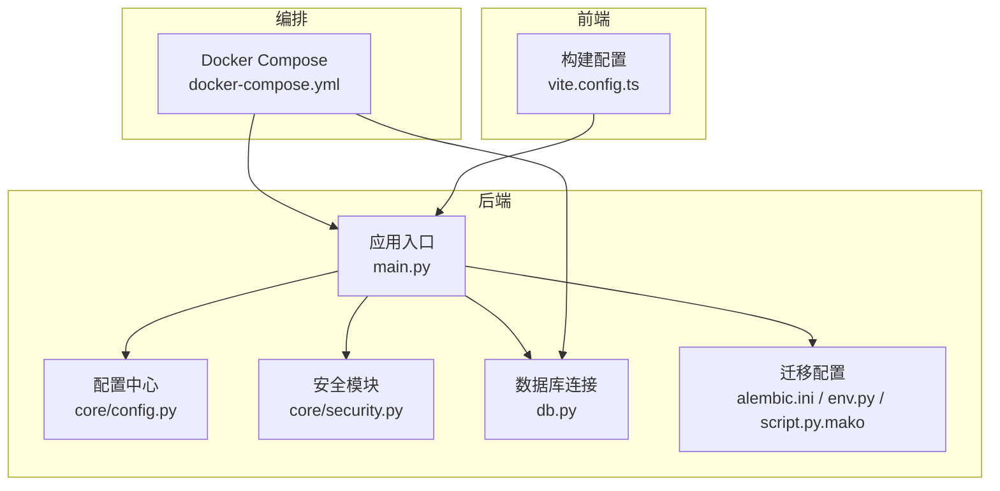
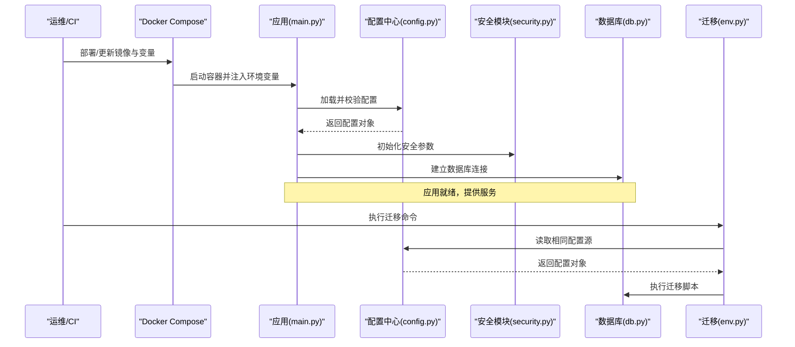
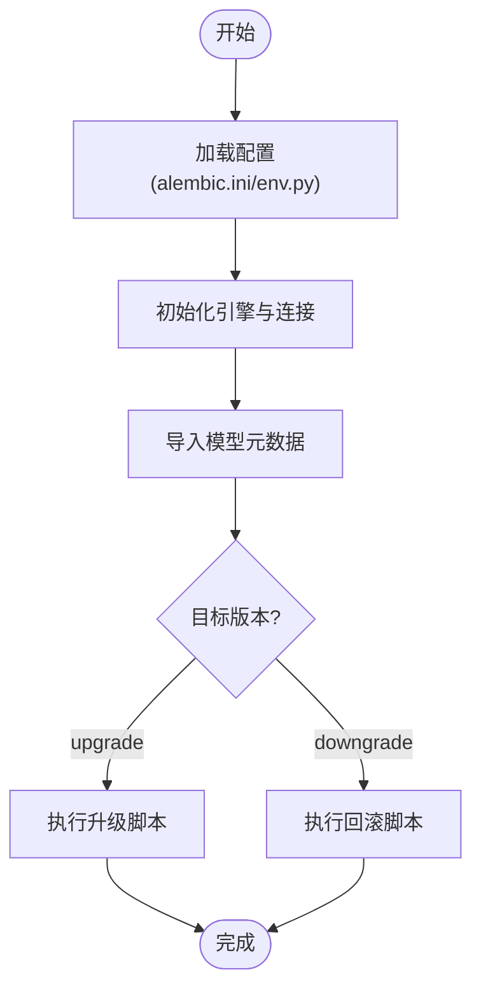
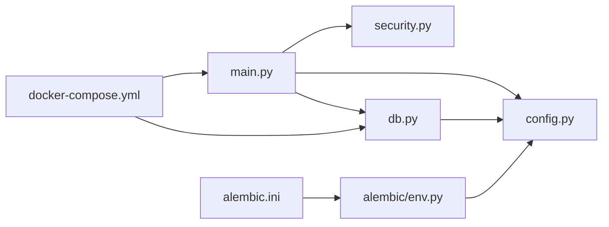

# 配置管理

<cite>
**本文引用的文件**   
- [backend/app/core/config.py](file://backend/app/core/config.py)
- [backend/app/core/security.py](file://backend/app/core/security.py)
- [backend/app/db.py](file://backend/app/db.py)
- [backend/alembic.ini](file://backend/alembic.ini)
- [backend/alembic/env.py](file://backend/alembic/env.py)
- [backend/alembic/script.py.mako](file://backend/alembic/script.py.mako)
- [backend/app/main.py](file://backend/app/main.py)
- [docker-compose.yml](file://docker-compose.yml)
- [frontend/vite.config.ts](file://frontend/vite.config.ts)
</cite>

## 目录
1. [简介](#简介)
2. [项目结构](#项目结构)
3. [核心组件](#核心组件)
4. [架构总览](#架构总览)
5. [详细组件分析](#详细组件分析)
6. [依赖关系分析](#依赖关系分析)
7. [性能考虑](#性能考虑)
8. [故障排查指南](#故障排查指南)
9. [结论](#结论)
10. [附录](#附录)

## 简介
本文件面向Talos项目的配置管理架构，系统性阐述应用配置的组织方式、环境变量与配置文件加载流程、配置校验与安全策略（加密密钥、数据库连接、第三方服务集成）、数据库迁移（Alembic）设置与版本管理、多环境差异与环境变量规范，以及配置热重载、审计与敏感信息保护等安全实践。文档同时提供架构图与部署指引，帮助开发与运维团队快速理解并正确落地配置方案。

## 项目结构
后端采用模块化组织，配置相关代码集中在 core 层与数据库初始化模块中；迁移由 Alembic 统一管理；前端通过构建配置暴露必要的运行时变量。关键路径如下：
- 后端配置与安全：backend/app/core/config.py、backend/app/core/security.py
- 数据库连接与模型：backend/app/db.py
- 迁移工具：backend/alembic.ini、backend/alembic/env.py、backend/alembic/script.py.mako
- 应用入口与生命周期：backend/app/main.py
- 容器编排与环境注入：docker-compose.yml
- 前端构建配置：frontend/vite.config.ts

图表来源
- [backend/app/main.py](file://backend/app/main.py)
- [backend/app/core/config.py](file://backend/app/core/config.py)
- [backend/app/core/security.py](file://backend/app/core/security.py)
- [backend/app/db.py](file://backend/app/db.py)
- [backend/alembic.ini](file://backend/alembic.ini)
- [backend/alembic/env.py](file://backend/alembic/env.py)
- [backend/alembic/script.py.mako](file://backend/alembic/script.py.mako)
- [frontend/vite.config.ts](file://frontend/vite.config.ts)
- [docker-compose.yml](file://docker-compose.yml)

章节来源
- [backend/app/core/config.py](file://backend/app/core/config.py)
- [backend/app/core/security.py](file://backend/app/core/security.py)
- [backend/app/db.py](file://backend/app/db.py)
- [backend/alembic.ini](file://backend/alembic.ini)
- [backend/alembic/env.py](file://backend/alembic/env.py)
- [backend/alembic/script.py.mako](file://backend/alembic/script.py.mako)
- [backend/app/main.py](file://backend/app/main.py)
- [frontend/vite.config.ts](file://frontend/vite.config.ts)
- [docker-compose.yml](file://docker-compose.yml)

## 核心组件
- 配置中心（core/config.py）
  - 负责统一加载环境变量与可选配置文件，提供强类型配置对象与默认值。
  - 支持按环境切换（开发/测试/生产），对敏感项进行最小化暴露。
  - 提供配置校验逻辑，确保必填项存在且格式合法。
- 安全模块（core/security.py）
  - 管理加密密钥、签名算法、令牌过期时间等安全参数。
  - 集中处理密码哈希、JWT签发与验证、敏感数据加解密接口。
- 数据库连接（db.py）
  - 基于配置中心提供的数据库连接串、池大小、超时等参数建立引擎与会话。
  - 封装连接重试、健康检查与事务上下文。
- 迁移配置（alembic.*）
  - alembic.ini 定义迁移脚本位置、SQLAlchemy URL 来源、日志级别等。
  - env.py 负责在迁移执行时加载配置、创建元数据与连接。
  - script.py.mako 为生成迁移模板，便于统一风格与必要注释。
- 应用入口（main.py）
  - 启动时加载配置、初始化安全模块、注册路由与中间件。
  - 提供健康检查端点与优雅关闭钩子。
- 前端构建（vite.config.ts）
  - 暴露仅客户端可见的构建期变量，避免将敏感后端配置泄露到前端。

章节来源
- [backend/app/core/config.py](file://backend/app/core/config.py)
- [backend/app/core/security.py](file://backend/app/core/security.py)
- [backend/app/db.py](file://backend/app/db.py)
- [backend/alembic.ini](file://backend/alembic.ini)
- [backend/alembic/env.py](file://backend/alembic/env.py)
- [backend/alembic/script.py.mako](file://backend/alembic/script.py.mako)
- [backend/app/main.py](file://backend/app/main.py)
- [frontend/vite.config.ts](file://frontend/vite.config.ts)

## 架构总览
下图展示配置从环境到应用的完整链路：容器编排注入环境变量，应用启动时由配置中心读取并校验，随后安全模块与数据库连接模块消费配置，迁移工具在独立流程中复用同一配置源。

图表来源
- [docker-compose.yml](file://docker-compose.yml)
- [backend/app/main.py](file://backend/app/main.py)
- [backend/app/core/config.py](file://backend/app/core/config.py)
- [backend/app/core/security.py](file://backend/app/core/security.py)
- [backend/app/db.py](file://backend/app/db.py)
- [backend/alembic/env.py](file://backend/alembic/env.py)

## 详细组件分析

### 配置中心（core/config.py）
- 职责
  - 统一环境变量解析与配置文件合并（如 .env）。
  - 提供强类型配置类，包含数据库、缓存、第三方服务、日志、特性开关等分组。
  - 实现配置校验（必填字段、范围、格式），失败时抛出明确异常。
- 设计要点
  - 使用只读视图对外暴露，防止运行时篡改。
  - 支持按环境前缀或命名空间区分不同环境的键名。
  - 对敏感字段提供“脱敏打印”能力，避免日志泄露。
- 典型用法
  - 应用启动时实例化一次，作为全局只读配置。
  - 其他模块通过依赖注入获取配置对象。

章节来源
- [backend/app/core/config.py](file://backend/app/core/config.py)

### 安全模块（core/security.py）
- 职责
  - 管理加密密钥、对称/非对称算法、JWT密钥与过期策略。
  - 提供密码哈希、令牌签发/校验、敏感数据加解密方法。
- 设计要点
  - 密钥来源于配置中心，禁止硬编码。
  - 支持密钥轮换时的兼容策略（如多密钥列表）。
  - 错误处理遵循最小信息泄露原则。
- 典型用法
  - 鉴权中间件调用令牌校验。
  - 业务服务调用加解密方法处理敏感输入输出。

章节来源
- [backend/app/core/security.py](file://backend/app/core/security.py)

### 数据库连接（db.py）
- 职责
  - 根据配置创建数据库引擎、会话工厂与连接池参数。
  - 提供健康检查、重试与事务上下文管理器。
- 设计要点
  - 连接字符串由配置中心提供，支持主从/读写分离扩展。
  - 连接池大小、超时、回收策略可配置。
  - 迁移与应用共享同一连接配置，保证一致性。
- 典型用法
  - 应用启动时初始化引擎与会话。
  - API层通过依赖注入获取会话。

章节来源
- [backend/app/db.py](file://backend/app/db.py)

### 迁移配置（Alembic）
- alembic.ini
  - 指定脚本目录、SQLAlchemy URL 来源、日志级别、批量操作开关等。
- env.py
  - 启动时加载配置，创建 SQLAlchemy 引擎与连接。
  - 导入模型元数据，执行目标版本迁移。
- script.py.mako
  - 迁移模板，统一生成迁移文件的头部注释与基本结构。
- 版本管理与回滚
  - 使用 alembic revision 生成变更脚本，alembic upgrade/downgrade 控制版本。
  - 建议为每个发布分支维护独立迁移历史，避免跨分支冲突。

图表来源
- [backend/alembic.ini](file://backend/alembic.ini)
- [backend/alembic/env.py](file://backend/alembic/env.py)
- [backend/alembic/script.py.mako](file://backend/alembic/script.py.mako)

章节来源
- [backend/alembic.ini](file://backend/alembic.ini)
- [backend/alembic/env.py](file://backend/alembic/env.py)
- [backend/alembic/script.py.mako](file://backend/alembic/script.py.mako)

### 应用入口（main.py）
- 职责
  - 初始化配置、安全模块、数据库连接。
  - 注册路由、中间件、异常处理器与监控指标。
  - 提供健康检查与优雅关闭。
- 设计要点
  - 启动顺序严格：配置→安全→数据库→路由。
  - 对关键步骤增加日志与告警埋点。
  - 支持热重载开关（仅限开发环境）。

章节来源
- [backend/app/main.py](file://backend/app/main.py)

### 前端构建配置（vite.config.ts）
- 职责
  - 暴露仅前端可用的构建期变量（如API基础地址、功能开关）。
  - 确保不将后端敏感配置编译进前端包。
- 设计要点
  - 使用环境变量前缀隔离前后端变量。
  - 在生产构建时移除调试信息与无用变量。

章节来源
- [frontend/vite.config.ts](file://frontend/vite.config.ts)

## 依赖关系分析
- 模块耦合
  - main.py 依赖 config.py、security.py、db.py。
  - db.py 依赖 config.py 提供的连接参数。
  - alembic 的 env.py 依赖 config.py 或同源的配置加载逻辑。
- 外部依赖
  - 数据库驱动、ORM、认证库、加密库等由 requirements.txt 管理。
  - 容器镜像与网络由 docker-compose.yml 编排。

图表来源
- [backend/app/main.py](file://backend/app/main.py)
- [backend/app/core/config.py](file://backend/app/core/config.py)
- [backend/app/core/security.py](file://backend/app/core/security.py)
- [backend/app/db.py](file://backend/app/db.py)
- [backend/alembic/env.py](file://backend/alembic/env.py)
- [backend/alembic.ini](file://backend/alembic.ini)
- [docker-compose.yml](file://docker-compose.yml)

章节来源
- [backend/app/main.py](file://backend/app/main.py)
- [backend/app/core/config.py](file://backend/app/core/config.py)
- [backend/app/core/security.py](file://backend/app/core/security.py)
- [backend/app/db.py](file://backend/app/db.py)
- [backend/alembic/env.py](file://backend/alembic/env.py)
- [backend/alembic.ini](file://backend/alembic.ini)
- [docker-compose.yml](file://docker-compose.yml)

## 性能考虑
- 配置加载
  - 启动时一次性加载并缓存，避免重复 I/O。
  - 大配置项按需懒加载。
- 数据库连接
  - 合理设置连接池大小与超时，避免连接耗尽。
  - 启用连接健康检查与自动重连。
- 安全计算
  - 哈希与加解密使用高效算法与合适轮数。
  - 避免在请求路径中进行重型计算。
- 迁移执行
  - 在大表上启用批量操作与并发限制，减少锁竞争。
  - 分阶段迁移，降低单次变更风险。

## 故障排查指南
- 常见配置问题
  - 缺失必填环境变量：检查容器注入与 .env 文件是否生效。
  - 数据库连接失败：核对连接串、端口、用户名密码与网络策略。
  - 迁移失败：确认目标版本与当前版本一致，查看迁移脚本依赖。
- 定位手段
  - 开启详细日志，关注配置加载与数据库连接阶段的错误堆栈。
  - 使用健康检查端点验证服务状态。
  - 在本地复现时，使用最小化配置集逐步排除干扰项。
- 恢复策略
  - 回滚至上一稳定版本镜像与迁移版本。
  - 临时降级功能（如关闭第三方服务集成）以保障核心可用性。

章节来源
- [backend/app/core/config.py](file://backend/app/core/config.py)
- [backend/app/db.py](file://backend/app/db.py)
- [backend/alembic/env.py](file://backend/alembic/env.py)

## 结论
Talos 的配置管理以“单一可信源”为核心，通过配置中心统一加载与校验，结合安全模块与数据库连接的解耦设计，实现了清晰、可维护、可扩展的配置体系。配合 Alembic 的版本化管理与 Docker Compose 的环境注入，能够在多环境下保持一致性与安全性。建议在后续迭代中持续完善配置审计、热重载与密钥轮换机制，进一步提升系统的可观测性与弹性。

## 附录

### 环境变量规范（建议）
- 命名约定
  - 全大写、下划线分隔，按模块前缀分组（如 APP_、DB_、SEC_）。
- 分类管理
  - 通用：APP_ENV、APP_DEBUG、LOG_LEVEL
  - 数据库：DB_HOST、DB_PORT、DB_NAME、DB_USER、DB_PASS、DB_POOL_SIZE
  - 安全：SEC_JWT_SECRET、SEC_ENCRYPTION_KEY、SEC_TOKEN_EXPIRE
  - 第三方：SMTP_*、S3_*、REDIS_*
- 安全要求
  - 敏感项不进入版本库，使用密钥管理服务或容器机密注入。
  - 日志中禁止输出明文敏感值。

### 多环境差异（建议）
- 开发环境
  - 开启调试与热重载，连接本地数据库与缓存。
- 测试环境
  - 使用隔离数据库与Mock第三方服务，启用更严格的校验。
- 生产环境
  - 关闭调试，启用最小权限与审计日志，使用高可用数据库与密钥管理。

### 配置热重载与审计（建议）
- 热重载
  - 仅在开发环境启用，生产环境通过滚动更新替换进程。
- 审计
  - 记录配置加载结果与变更事件（不含敏感值）。
  - 定期导出配置快照用于合规审查。

### 部署清单（示例）
- 镜像与版本
  - 固定后端与前端镜像标签，避免漂移。
- 环境变量
  - 通过 docker-compose.yml 或外部密钥系统注入。
- 迁移
  - 部署前执行迁移，失败则回滚镜像与数据。
- 健康检查
  - 配置探针与健康端点，确保流量切流安全。