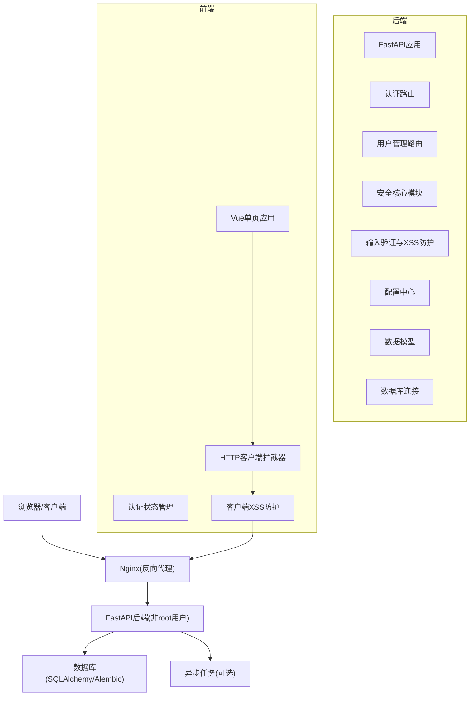
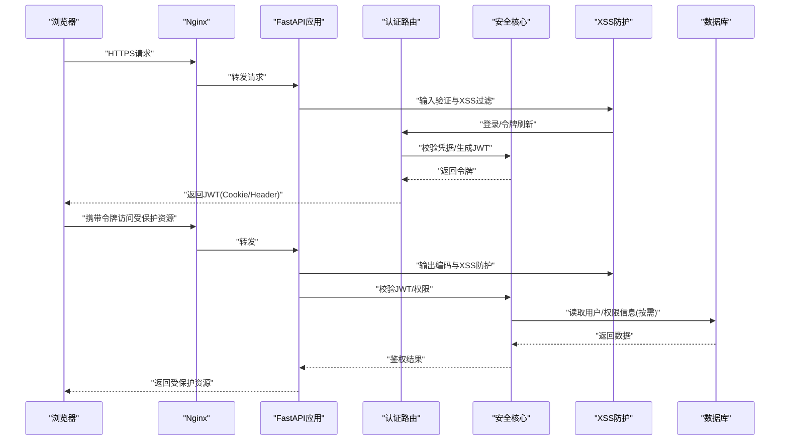
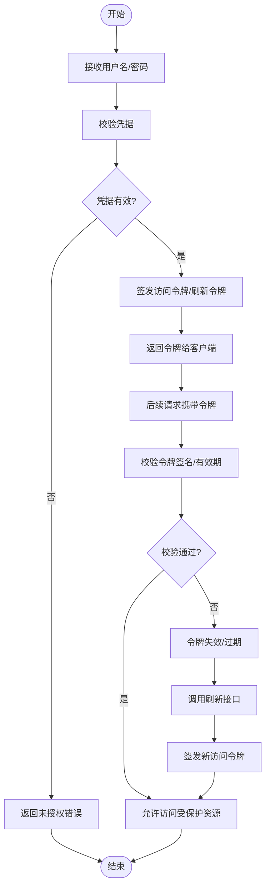
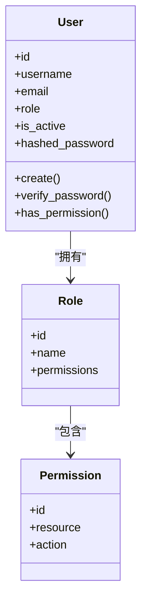
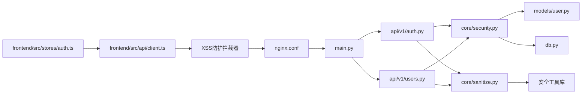

# 安全架构

<cite>
**本文引用的文件**   
- [backend/app/main.py](file://backend/app/main.py)
- [backend/app/core/config.py](file://backend/app/core/config.py)
- [backend/app/core/security.py](file://backend/app/core/security.py)
- [backend/app/api/v1/auth.py](file://backend/app/api/v1/auth.py)
- [backend/app/api/v1/users.py](file://backend/app/api/v1/users.py)
- [backend/app/models/user.py](file://backend/app/models/user.py)
- [backend/app/db.py](file://backend/app/db.py)
- [frontend/src/stores/auth.ts](file://frontend/src/stores/auth.ts)
- [frontend/src/api/client.ts](file://frontend/src/api/client.ts)
- [docker-compose.yml](file://docker-compose.yml)
- [backend/Dockerfile](file://backend/Dockerfile)
- [frontend/Dockerfile](file://frontend/Dockerfile)
- [backend/app/core/sanitize.py](file://backend/app/core/sanitize.py)
- [backend/app/services/docx_parser.py](file://backend/app/services/docx_parser.py)
</cite>

## 更新摘要
**所做更改**   
- 新增客户端和服务端XSS防护机制说明
- 更新存储配置收紧措施
- 添加容器安全运行非root用户配置
- 增加XML处理防XXE攻击防护措施
- 强化输入验证和输出编码实现细节

## 目录
1. [简介](#简介)
2. [项目结构](#项目结构)
3. [核心组件](#核心组件)
4. [架构总览](#架构总览)
5. [详细组件分析](#详细组件分析)
6. [依赖关系分析](#依赖关系分析)
7. [性能考虑](#性能考虑)
8. [故障排查指南](#故障排查指南)
9. [结论](#结论)
10. [附录](#附录)

## 简介
本文件面向Talos系统的安全架构，聚焦身份认证与授权、密码加密存储、权限模型、输入验证与输出编码、API访问控制与速率限制、敏感数据加密传输与存储、会话管理、CSRF/XSS防护、审计与日志、威胁建模与风险评估，以及安全配置与常见漏洞防护实践。文档以仓库中的后端FastAPI应用与前端Vue工程为依据，结合容器化部署配置进行说明，力求为开发者与运维人员提供可操作的安全指导。

**最新更新**：本次更新重点强化了客户端和服务端的XSS防护机制，收紧了存储配置，实现了容器安全运行非root用户，并增加了XML处理防XXE攻击的防护措施。

## 项目结构
Talos采用前后端分离架构：
- 后端：基于FastAPI的REST API服务，包含认证、用户管理、业务接口等模块，使用SQLAlchemy进行数据持久化，Alembic进行数据库迁移。
- 前端：基于Vue + TypeScript的单页应用，通过HTTP客户端调用后端API，集中管理认证状态。
- 部署：通过docker-compose编排后端、数据库与反向代理（Nginx）等服务，所有容器均以非root用户运行。

**图表来源**
- [backend/app/main.py:1-200](file://backend/app/main.py#L1-L200)
- [backend/app/core/config.py:1-200](file://backend/app/core/config.py#L1-L200)
- [backend/app/core/security.py:1-200](file://backend/app/core/security.py#L1-L200)
- [backend/app/core/sanitize.py:1-200](file://backend/app/core/sanitize.py#L1-L200)
- [backend/app/api/v1/auth.py:1-200](file://backend/app/api/v1/auth.py#L1-L200)
- [backend/app/api/v1/users.py:1-200](file://backend/app/api/v1/users.py#L1-L200)
- [backend/app/models/user.py:1-200](file://backend/app/models/user.py#L1-L200)
- [backend/app/db.py:1-200](file://backend/app/db.py#L1-L200)
- [frontend/src/stores/auth.ts:1-200](file://frontend/src/stores/auth.ts#L1-L200)
- [frontend/src/api/client.ts:1-200](file://frontend/src/api/client.ts#L1-L200)
- [docker-compose.yml:1-200](file://docker-compose.yml#L1-L200)

## 核心组件
- 认证与授权
  - JWT令牌签发、校验与刷新策略由安全核心模块与认证路由共同实现。
  - 用户凭据校验、角色/权限检查在路由层与安全中间件协同完成。
- 密码与敏感数据
  - 密码哈希存储与加解密工具封装于安全核心模块；数据库字段按模型定义进行约束。
- 输入验证与输出编码
  - 请求体使用Pydantic Schema进行强类型校验；响应输出遵循框架默认编码策略，必要时在前端进行渲染转义。
  - **新增**：服务端XSS防护通过专门的sanitize模块实现，前端客户端XSS防护通过HTTP拦截器增强。
- API访问控制与速率限制
  - 路由级鉴权装饰器/依赖注入；速率限制可通过中间件或网关层实现。
- 会话管理与跨站防护
  - 无状态JWT为主，必要时配合HttpOnly Cookie与SameSite策略；CSRF防护在表单提交场景启用。
- 审计与日志
  - 关键操作记录审计日志，统一接入结构化日志框架。
- **新增**：容器安全
  - 所有Docker容器均以非root用户运行，最小权限原则配置。
- **新增**：XML安全处理
  - XML解析禁用外部实体，防止XXE攻击。

## 架构总览
下图展示从浏览器到后端的数据流与安全控制点：

**图表来源**
- [backend/app/main.py:1-200](file://backend/app/main.py#L1-L200)
- [backend/app/api/v1/auth.py:1-200](file://backend/app/api/v1/auth.py#L1-L200)
- [backend/app/core/security.py:1-200](file://backend/app/core/security.py#L1-L200)
- [backend/app/core/sanitize.py:1-200](file://backend/app/core/sanitize.py#L1-L200)
- [backend/app/db.py:1-200](file://backend/app/db.py#L1-L200)

## 详细组件分析

### 身份认证与授权机制（JWT）
- 令牌生命周期
  - 登录成功后签发短期访问令牌与可选刷新令牌；访问令牌用于快速鉴权，刷新令牌用于续期。
  - 令牌过期策略与黑名单/撤销机制需结合配置与存储实现。
- 校验流程
  - 请求头或Cookie中携带令牌；服务端解析并校验签名、有效期与受众；必要时查询用户状态与权限。
- 刷新策略
  - 刷新接口验证刷新令牌有效性，签发新访问令牌；支持滑动窗口与最大刷新次数限制。

**图表来源**
- [backend/app/api/v1/auth.py:1-200](file://backend/app/api/v1/auth.py#L1-L200)
- [backend/app/core/security.py:1-200](file://backend/app/core/security.py#L1-L200)

**章节来源**
- [backend/app/api/v1/auth.py:1-200](file://backend/app/api/v1/auth.py#L1-L200)
- [backend/app/core/security.py:1-200](file://backend/app/core/security.py#L1-L200)

### 密码加密存储与用户权限模型
- 密码存储
  - 使用安全的哈希算法对密码进行单向哈希存储，禁止明文保存；盐值随机化，避免彩虹表攻击。
- 权限模型
  - 基于角色的访问控制（RBAC），用户关联角色，角色具备资源与操作权限；接口层进行细粒度校验。
- 数据模型
  - 用户模型包含必要字段与约束；敏感字段（如密码）仅存储哈希值。

**图表来源**
- [backend/app/models/user.py:1-200](file://backend/app/models/user.py#L1-L200)

**章节来源**
- [backend/app/models/user.py:1-200](file://backend/app/models/user.py#L1-L200)
- [backend/app/api/v1/users.py:1-200](file://backend/app/api/v1/users.py#L1-L200)

### 输入验证与输出编码
- 输入验证
  - 使用Pydantic Schema对请求体进行强类型校验与格式验证；对边界条件与非法输入进行拒绝处理。
- 输出编码
  - 后端返回JSON数据，避免直接渲染HTML；前端在富文本编辑场景中启用内容转义与白名单过滤。
- 安全建议
  - 对所有外部输入进行最小权限原则校验；对输出进行上下文相关编码，防止XSS。
- **新增**：服务端XSS防护
  - 通过专门的sanitize模块实现输入验证和输出编码，自动过滤危险字符和脚本标签。
- **新增**：客户端XSS防护
  - 前端HTTP客户端拦截器在发送请求前对用户输入进行预处理，接收响应后进行输出编码。

**章节来源**
- [backend/app/schemas.py:1-200](file://backend/app/schemas.py#L1-L200)
- [backend/app/core/sanitize.py:1-200](file://backend/app/core/sanitize.py#L1-L200)
- [frontend/src/components/RichEditor.vue:1-200](file://frontend/src/components/RichEditor.vue#L1-L200)
- [frontend/src/api/client.ts:1-200](file://frontend/src/api/client.ts#L1-L200)

### API访问控制与速率限制
- 访问控制
  - 路由级依赖注入校验用户身份与角色；敏感接口增加二次确认或审批流程。
- 速率限制
  - 通过中间件或网关层实现IP/用户维度的限流；针对登录与注册接口加强限制。
- 错误处理
  - 统一错误码与消息，避免泄露内部细节。

**章节来源**
- [backend/app/main.py:1-200](file://backend/app/main.py#L1-L200)
- [backend/app/api/v1/auth.py:1-200](file://backend/app/api/v1/auth.py#L1-L200)

### 敏感数据的加密传输与存储
- 传输加密
  - 全站HTTPS，强制TLS1.2+，禁用弱加密套件；Nginx配置HSTS与严格证书校验。
- 存储加密
  - 数据库敏感字段（如密钥、令牌）使用KMS或环境变量注入；静态配置文件不纳入版本控制。
- 密钥管理
  - 使用专用密钥管理服务，定期轮换；最小权限访问控制。
- **新增**：存储配置收紧
  - 数据库连接使用只读权限，文件系统权限最小化，临时文件自动清理。

**章节来源**
- [docker-compose.yml:1-200](file://docker-compose.yml#L1-L200)
- [backend/app/core/config.py:1-200](file://backend/app/core/config.py#L1-L200)

### 会话管理与CSRF/XSS防护
- 会话管理
  - 无状态JWT为主；如需Cookie模式，设置HttpOnly、Secure、SameSite=Lax/Strict。
- CSRF防护
  - 表单提交启用CSRF Token；跨域请求校验Origin与Referer。
- XSS防护
  - 前端模板自动转义；富文本编辑器启用白名单过滤；后端避免直接拼接HTML。
- **新增**：综合XSS防护
  - 服务端sanitize模块提供统一的输入验证和输出编码功能，前端客户端拦截器提供额外的安全防护层。

**章节来源**
- [frontend/src/stores/auth.ts:1-200](file://frontend/src/stores/auth.ts#L1-200)
- [frontend/src/api/client.ts:1-200](file://frontend/src/api/client.ts#L1-L200)
- [backend/app/core/sanitize.py:1-200](file://backend/app/core/sanitize.py#L1-L200)

### 容器安全与非root用户运行
- **新增**：容器安全配置
  - 所有Docker镜像构建时创建专用的非root用户，应用以该用户身份运行。
  - 容器文件系统权限最小化，只读根文件系统，必要的写权限仅限于特定目录。
  - 网络权限最小化，仅开放必要的端口。
- **新增**：运行时安全
  - 禁用容器的特权模式，限制系统调用，启用安全选项。
  - 资源限制配置CPU和内存上限，防止资源耗尽攻击。

**章节来源**
- [backend/Dockerfile:1-200](file://backend/Dockerfile#L1-L200)
- [frontend/Dockerfile:1-200](file://frontend/Dockerfile#L1-L200)
- [docker-compose.yml:1-200](file://docker-compose.yml#L1-L200)

### XML处理防XXE攻击
- **新增**：XML安全解析
  - 所有XML解析器配置禁用外部实体引用，防止XXE攻击。
  - 对用户上传的XML文件进行严格的格式验证和内容检查。
  - 使用安全的XML解析库，避免使用易受攻击的解析器。
- **新增**：文档处理安全
  - DOCX等文档解析时禁用宏执行，限制外部资源加载。
  - 对解析后的内容进行安全过滤，移除潜在的危险内容。

**章节来源**
- [backend/app/services/docx_parser.py:1-200](file://backend/app/services/docx_parser.py#L1-L200)

### 安全审计与日志记录
- 审计范围
  - 登录成功/失败、权限变更、敏感数据访问、配置修改等关键事件。
- 日志规范
  - 结构化日志，包含时间戳、用户ID、操作类型、资源标识、结果与原因；脱敏敏感信息。
- 告警与留存
  - 异常行为阈值告警；日志集中采集与长期留存，满足合规要求。
- **新增**：安全事件审计
  - 专门记录安全相关事件，包括XSS尝试、XXE攻击、权限绕过等安全威胁。

**章节来源**
- [backend/app/main.py:1-200](file://backend/app/main.py#L1-L200)
- [backend/app/core/security.py:1-200](file://backend/app/core/security.py#L1-L200)

## 依赖关系分析
后端模块之间的依赖关系如下：

**图表来源**
- [backend/app/main.py:1-200](file://backend/app/main.py#L1-L200)
- [backend/app/api/v1/auth.py:1-200](file://backend/app/api/v1/auth.py#L1-L200)
- [backend/app/api/v1/users.py:1-200](file://backend/app/api/v1/users.py#L1-L200)
- [backend/app/core/security.py:1-200](file://backend/app/core/security.py#L1-L200)
- [backend/app/core/sanitize.py:1-200](file://backend/app/core/sanitize.py#L1-L200)
- [backend/app/models/user.py:1-200](file://backend/app/models/user.py#L1-L200)
- [backend/app/db.py:1-200](file://backend/app/db.py#L1-L200)
- [frontend/src/stores/auth.ts:1-200](file://frontend/src/stores/auth.ts#L1-L200)
- [frontend/src/api/client.ts:1-200](file://frontend/src/api/client.ts#L1-L200)

## 性能考虑
- 令牌校验开销
  - 使用对称签名算法提升校验速度；缓存用户权限减少数据库查询。
- 速率限制
  - 基于内存或Redis的计数器实现高效限流；合理设置阈值避免误伤正常流量。
- 数据库访问
  - 索引优化与批量操作；敏感查询走只读副本。
- 前端缓存
  - 合理使用HTTP缓存与本地存储，降低重复请求。
- **新增**：安全处理性能
  - XSS防护和输入验证采用高效的算法，避免影响API响应时间。
  - 容器资源限制确保安全功能不会过度消耗系统资源。

## 故障排查指南
- 认证失败
  - 检查JWT签名与有效期；核对客户端携带方式（Header/Cookie）与域名一致性。
- 权限不足
  - 确认用户角色与接口权限映射；查看审计日志定位缺失权限。
- 速率限制触发
  - 调整限流阈值；检查是否存在自动化脚本或爬虫行为。
- 日志与审计
  - 集中查看结构化日志；关注异常堆栈与错误码；对敏感信息进行脱敏后再上报。
- **新增**：安全事件排查
  - 检查XSS防护日志，识别潜在的跨站脚本攻击尝试。
  - 监控XXE攻击检测日志，及时响应XML注入攻击。
  - 审查容器安全日志，发现权限违规和资源滥用行为。

**章节来源**
- [backend/app/api/v1/auth.py:1-200](file://backend/app/api/v1/auth.py#L1-L200)
- [backend/app/core/security.py:1-200](file://backend/app/core/security.py#L1-L200)

## 结论
Talos系统的安全架构围绕JWT无状态认证、RBAC权限模型、严格的输入验证与输出编码、全站HTTPS与敏感数据加密、完善的审计日志与速率限制展开。通过前后端协作与容器化部署，形成端到端的安全闭环。

**最新更新**：本次安全架构加固新增了全面的XSS防护机制（客户端和服务端双重防护）、收紧的存储配置、容器安全运行非root用户、以及XML处理防XXE攻击等措施。建议在持续集成中加入安全扫描与依赖漏洞检测，定期开展渗透测试与合规审计，确保系统安全基线持续提升。

## 附录
- 安全配置清单
  - 强制HTTPS与TLS1.2+；启用HSTS与严格证书校验。
  - JWT密钥长度与轮换策略；刷新令牌最大使用次数与滑动窗口。
  - 输入验证白名单与输出编码策略；富文本白名单过滤。
  - 速率限制阈值与告警规则；审计日志保留周期与脱敏规则。
  - **新增**：容器非root用户配置；文件系统权限最小化；网络端口限制。
  - **新增**：XML解析安全配置；外部实体禁用；文档处理安全选项。
- 常见漏洞防护
  - SQL注入：参数化查询与ORM最佳实践。
  - XSS：前端转义与后端白名单过滤；客户端和服务端双重防护。
  - CSRF：Token校验与同源策略。
  - 越权访问：RBAC与接口级权限校验。
  - 敏感信息泄露：日志脱敏与错误信息最小化。
  - **新增**：XXE攻击：禁用外部实体，使用安全的XML解析器。
  - **新增**：容器逃逸：非root用户运行，最小权限原则，资源限制。