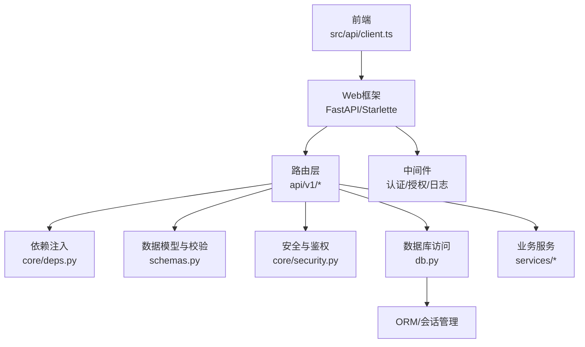
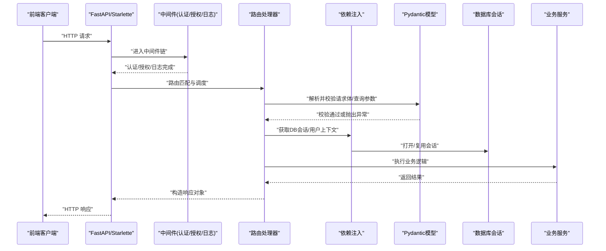
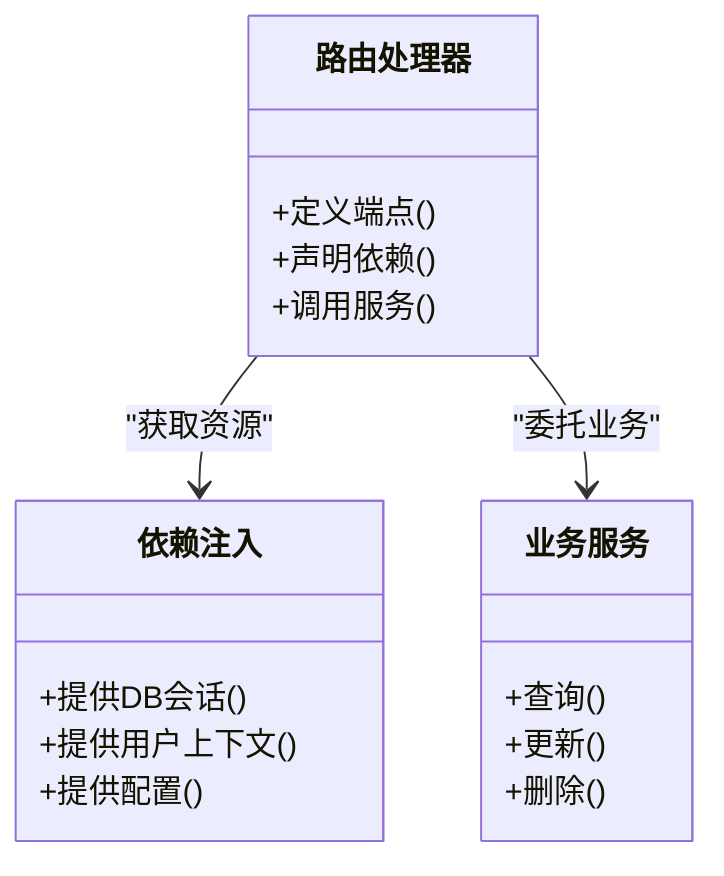
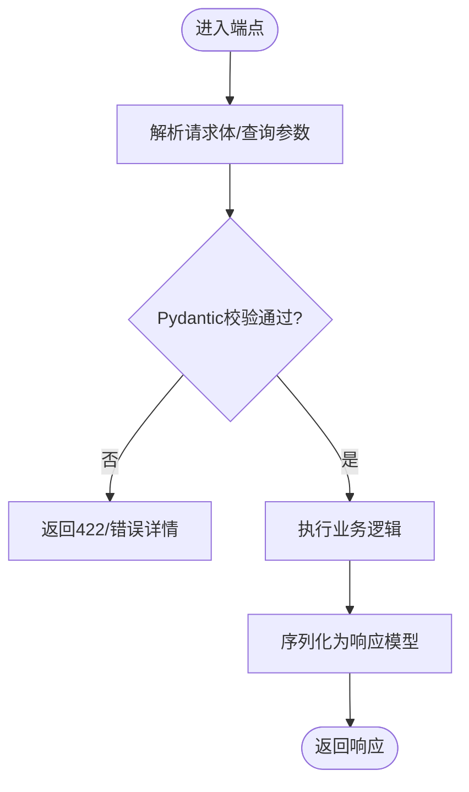
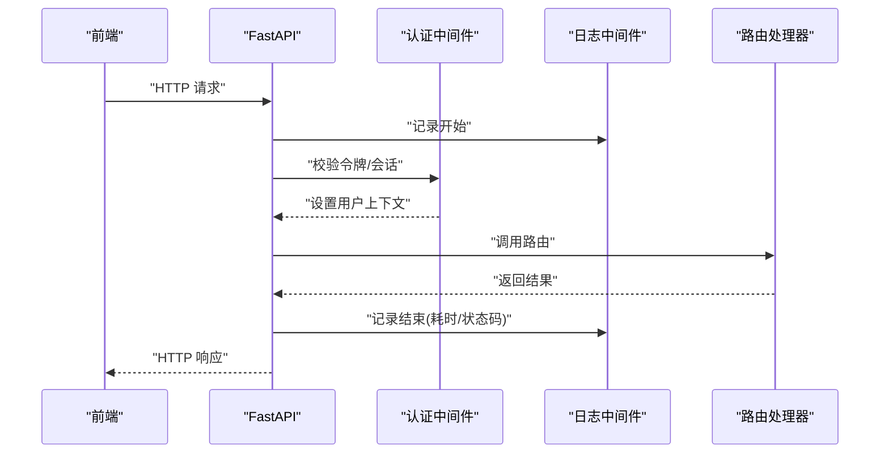
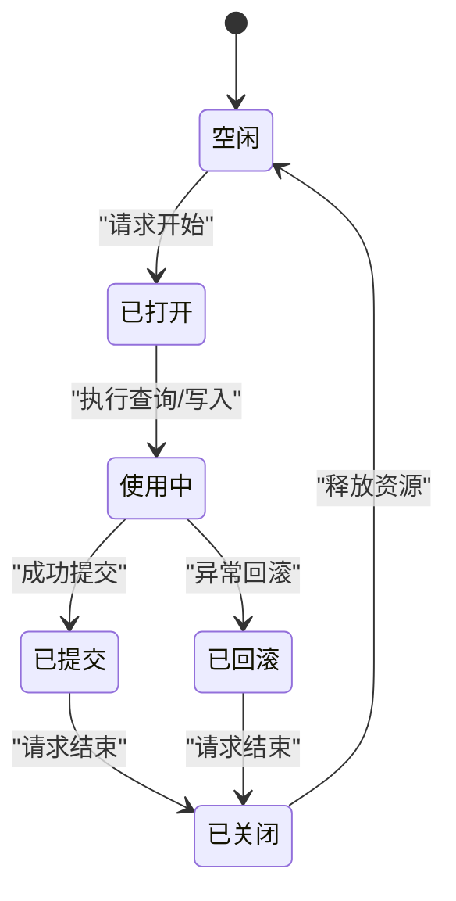
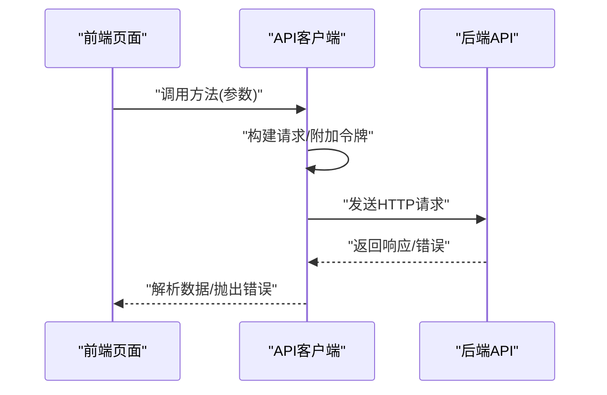
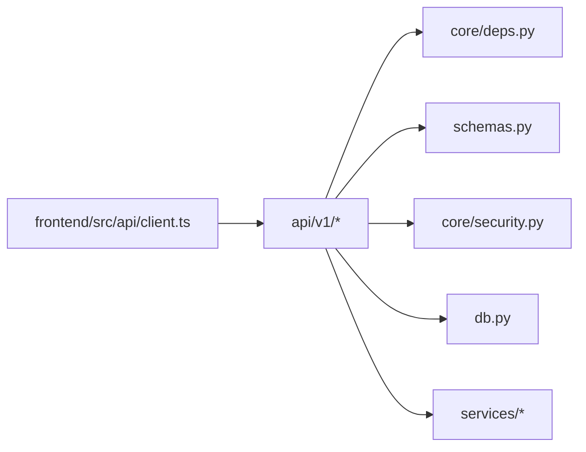

# API数据流

<cite>
**本文引用的文件**   
- [backend/app/main.py](file://backend/app/main.py)
- [backend/app/api/v1/auth.py](file://backend/app/api/v1/auth.py)
- [backend/app/api/v1/users.py](file://backend/app/api/v1/users.py)
- [backend/app/core/deps.py](file://backend/app/core/deps.py)
- [backend/app/core/security.py](file://backend/app/core/security.py)
- [backend/app/schemas.py](file://backend/app/schemas.py)
- [backend/app/db.py](file://backend/app/db.py)
- [frontend/src/api/client.ts](file://frontend/src/api/client.ts)
</cite>

## 目录
1. [简介](#简介)
2. [项目结构](#项目结构)
3. [核心组件](#核心组件)
4. [架构总览](#架构总览)
5. [详细组件分析](#详细组件分析)
6. [依赖关系分析](#依赖关系分析)
7. [性能考虑](#性能考虑)
8. [故障排查指南](#故障排查指南)
9. [结论](#结论)
10. [附录](#附录)

## 简介
本文件面向Talos系统的API数据流，系统化阐述HTTP请求从前端到后端的完整处理链路：路由解析、依赖注入、参数验证、业务处理、错误处理与响应序列化。重点说明Pydantic模型在请求体验证、查询参数处理与响应格式标准化中的作用；解释中间件在认证、授权与日志记录中的数据处理机制；并给出时序图与状态转换图，帮助读者建立端到端的数据流转心智模型。

## 项目结构
后端采用分层组织：入口应用、API路由、核心配置与安全、数据库访问、领域模型与服务、以及工作进程。前端通过TypeScript客户端发起HTTP请求，由后端FastAPI框架统一接收与分发。

**图示来源** 
- [backend/app/main.py](file://backend/app/main.py)
- [backend/app/api/v1/auth.py](file://backend/app/api/v1/auth.py)
- [backend/app/api/v1/users.py](file://backend/app/api/v1/users.py)
- [backend/app/core/deps.py](file://backend/app/core/deps.py)
- [backend/app/core/security.py](file://backend/app/core/security.py)
- [backend/app/schemas.py](file://backend/app/schemas.py)
- [backend/app/db.py](file://backend/app/db.py)
- [frontend/src/api/client.ts](file://frontend/src/api/client.ts)

**章节来源**
- [backend/app/main.py](file://backend/app/main.py)
- [backend/app/api/v1/auth.py](file://backend/app/api/v1/auth.py)
- [backend/app/api/v1/users.py](file://backend/app/api/v1/users.py)
- [backend/app/core/deps.py](file://backend/app/core/deps.py)
- [backend/app/core/security.py](file://backend/app/core/security.py)
- [backend/app/schemas.py](file://backend/app/schemas.py)
- [backend/app/db.py](file://backend/app/db.py)
- [frontend/src/api/client.ts](file://frontend/src/api/client.ts)

## 核心组件
- 应用入口与中间件：负责注册中间件、挂载路由、全局异常处理与生命周期钩子。
- API路由层：按功能域划分模块（auth、users等），定义RESTful端点，声明请求体与查询参数类型。
- 依赖注入：集中提供数据库会话、配置、安全上下文等共享资源。
- 数据模型与校验：使用Pydantic模型对请求体、查询参数与响应进行强类型约束与自动转换。
- 安全与鉴权：基于令牌或会话的认证与权限控制。
- 数据库访问：统一的会话管理与事务边界。
- 前端客户端：封装HTTP调用、错误处理与重试策略。

**章节来源**
- [backend/app/main.py](file://backend/app/main.py)
- [backend/app/api/v1/auth.py](file://backend/app/api/v1/auth.py)
- [backend/app/api/v1/users.py](file://backend/app/api/v1/users.py)
- [backend/app/core/deps.py](file://backend/app/core/deps.py)
- [backend/app/core/security.py](file://backend/app/core/security.py)
- [backend/app/schemas.py](file://backend/app/schemas.py)
- [backend/app/db.py](file://backend/app/db.py)
- [frontend/src/api/client.ts](file://frontend/src/api/client.ts)

## 架构总览
下图展示一次典型API调用的端到端流程：前端发起请求，经过Web框架与中间件，进入路由层，依赖注入获取DB会话与用户上下文，Pydantic完成参数校验，业务逻辑执行后返回结构化响应。

**图示来源** 
- [backend/app/main.py](file://backend/app/main.py)
- [backend/app/api/v1/auth.py](file://backend/app/api/v1/auth.py)
- [backend/app/api/v1/users.py](file://backend/app/api/v1/users.py)
- [backend/app/core/deps.py](file://backend/app/core/deps.py)
- [backend/app/core/security.py](file://backend/app/core/security.py)
- [backend/app/schemas.py](file://backend/app/schemas.py)
- [backend/app/db.py](file://backend/app/db.py)

## 详细组件分析

### 路由与依赖注入
- 路由层按功能域拆分，每个模块定义若干端点，明确方法、路径、响应模型与可选的查询参数。
- 依赖注入通过函数参数声明实现，常见包括数据库会话、当前用户、配置项等，避免硬编码与重复初始化。
- 建议将跨端点的通用逻辑（如分页、排序、过滤）抽取为可复用的依赖。

**图示来源** 
- [backend/app/api/v1/auth.py](file://backend/app/api/v1/auth.py)
- [backend/app/api/v1/users.py](file://backend/app/api/v1/users.py)
- [backend/app/core/deps.py](file://backend/app/core/deps.py)

**章节来源**
- [backend/app/api/v1/auth.py](file://backend/app/api/v1/auth.py)
- [backend/app/api/v1/users.py](file://backend/app/api/v1/users.py)
- [backend/app/core/deps.py](file://backend/app/core/deps.py)

### Pydantic模型与数据验证
- 请求体验证：使用Pydantic模型描述JSON结构、必填字段、默认值、范围与自定义校验器，确保输入合法。
- 查询参数处理：通过Query注解或模型派生类声明分页、过滤、排序等参数，支持类型转换与默认值。
- 响应标准化：定义响应模型，保证输出字段一致、类型稳定，便于前端消费与文档生成。

**图示来源** 
- [backend/app/schemas.py](file://backend/app/schemas.py)

**章节来源**
- [backend/app/schemas.py](file://backend/app/schemas.py)

### 中间件：认证、授权与日志
- 认证：解析令牌或会话，提取用户身份，写入请求上下文供后续依赖使用。
- 授权：基于角色或资源权限判断是否允许访问特定端点。
- 日志：记录请求ID、方法、路径、耗时、状态码与关键入参/出参，便于追踪与审计。

**图示来源** 
- [backend/app/main.py](file://backend/app/main.py)
- [backend/app/core/security.py](file://backend/app/core/security.py)

**章节来源**
- [backend/app/main.py](file://backend/app/main.py)
- [backend/app/core/security.py](file://backend/app/core/security.py)

### 数据库与会话管理
- 统一会话工厂：确保每次请求拥有独立会话，并在请求结束时正确关闭。
- 事务边界：在需要原子性的操作中使用事务包裹，失败时回滚，保证一致性。
- 连接池：合理配置最大连接数与超时，避免连接泄漏与耗尽。

**图示来源** 
- [backend/app/db.py](file://backend/app/db.py)

**章节来源**
- [backend/app/db.py](file://backend/app/db.py)

### 前端客户端与错误处理
- 请求封装：统一基础URL、超时、拦截器（添加令牌、错误处理）。
- 错误映射：将后端错误转换为前端友好的提示，支持重试与降级。
- 类型安全：结合TS接口与后端响应模型保持一致，减少运行时错误。

**图示来源** 
- [frontend/src/api/client.ts](file://frontend/src/api/client.ts)

**章节来源**
- [frontend/src/api/client.ts](file://frontend/src/api/client.ts)

## 依赖关系分析
- 松耦合：路由仅依赖抽象的依赖提供者与业务服务，降低模块间耦合。
- 内聚性：每个模块职责清晰，数据校验集中在Pydantic模型中，安全逻辑集中在security模块。
- 外部依赖：数据库驱动、ORM、加密库等通过依赖注入统一管理，便于替换与测试。

**图示来源** 
- [backend/app/api/v1/auth.py](file://backend/app/api/v1/auth.py)
- [backend/app/api/v1/users.py](file://backend/app/api/v1/users.py)
- [backend/app/core/deps.py](file://backend/app/core/deps.py)
- [backend/app/schemas.py](file://backend/app/schemas.py)
- [backend/app/core/security.py](file://backend/app/core/security.py)
- [backend/app/db.py](file://backend/app/db.py)
- [frontend/src/api/client.ts](file://frontend/src/api/client.ts)

**章节来源**
- [backend/app/api/v1/auth.py](file://backend/app/api/v1/auth.py)
- [backend/app/api/v1/users.py](file://backend/app/api/v1/users.py)
- [backend/app/core/deps.py](file://backend/app/core/deps.py)
- [backend/app/schemas.py](file://backend/app/schemas.py)
- [backend/app/core/security.py](file://backend/app/core/security.py)
- [backend/app/db.py](file://backend/app/db.py)
- [frontend/src/api/client.ts](file://frontend/src/api/client.ts)

## 性能考虑
- 连接与会话：合理设置连接池大小、会话生命周期与超时，避免阻塞与内存泄漏。
- 缓存策略：对读多写少的数据引入缓存（如Redis），减轻数据库压力。
- 异步处理：将耗时任务（如导入、报告生成）放入工作队列，提升吞吐。
- 序列化开销：精简响应字段，按需加载关联数据，避免N+1查询。
- 监控与指标：采集QPS、延迟、错误率与慢查询，持续优化。

[本节为通用指导，不直接分析具体文件]

## 故障排查指南
- 常见问题定位：
  - 参数校验失败：检查Pydantic模型字段类型、必填性与自定义校验规则。
  - 认证失败：确认令牌格式、有效期与签名算法，检查中间件顺序。
  - 数据库错误：查看连接池状态、事务回滚原因与SQL日志。
  - 响应不一致：核对响应模型字段命名与序列化选项。
- 调试建议：
  - 启用详细日志，记录请求ID、入参与出参摘要。
  - 使用健康检查端点验证依赖可用性（DB、缓存、消息队列）。
  - 在前端增加网络请求回放与错误堆栈收集。

**章节来源**
- [backend/app/schemas.py](file://backend/app/schemas.py)
- [backend/app/core/security.py](file://backend/app/core/security.py)
- [backend/app/db.py](file://backend/app/db.py)
- [frontend/src/api/client.ts](file://frontend/src/api/client.ts)

## 结论
Talos系统通过清晰的层次划分、严格的Pydantic校验、集中的依赖注入与中间件机制，构建了稳定高效的API数据流。前端客户端与后端模型协同，确保数据一致性与可维护性。建议在后续迭代中持续完善监控、缓存与异步处理能力，以支撑更高并发与更复杂的业务场景。

[本节为总结性内容，不直接分析具体文件]

## 附录
- 术语表：
  - 依赖注入：在运行时动态提供组件所需的外部资源。
  - Pydantic：用于数据校验与序列化的Python库。
  - 中间件：在请求处理前后执行的横切逻辑。
- 参考实践：
  - 将分页、排序、过滤作为通用依赖，提高复用性。
  - 使用响应模型统一输出结构，便于前端消费与文档生成。
  - 对敏感操作增加审计日志与幂等性保障。

[本节为补充信息，不直接分析具体文件]