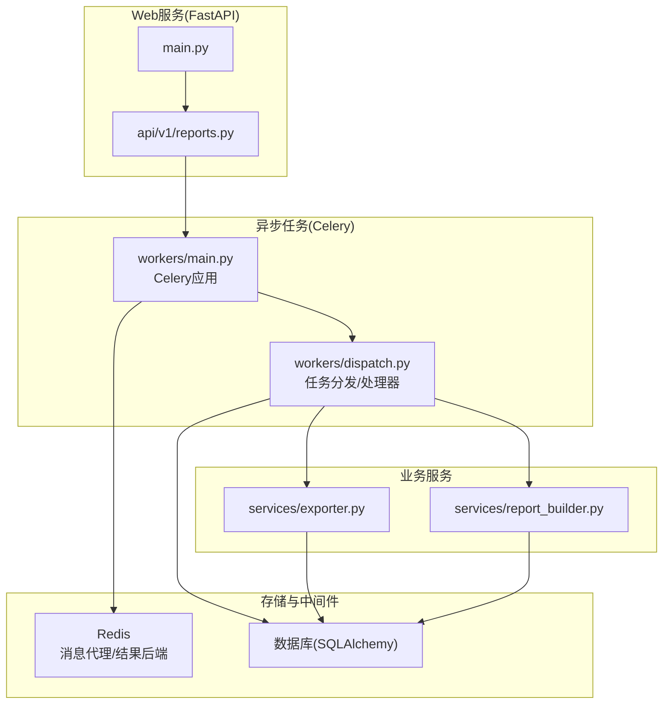
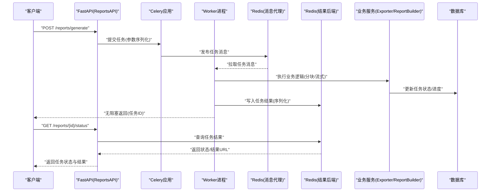
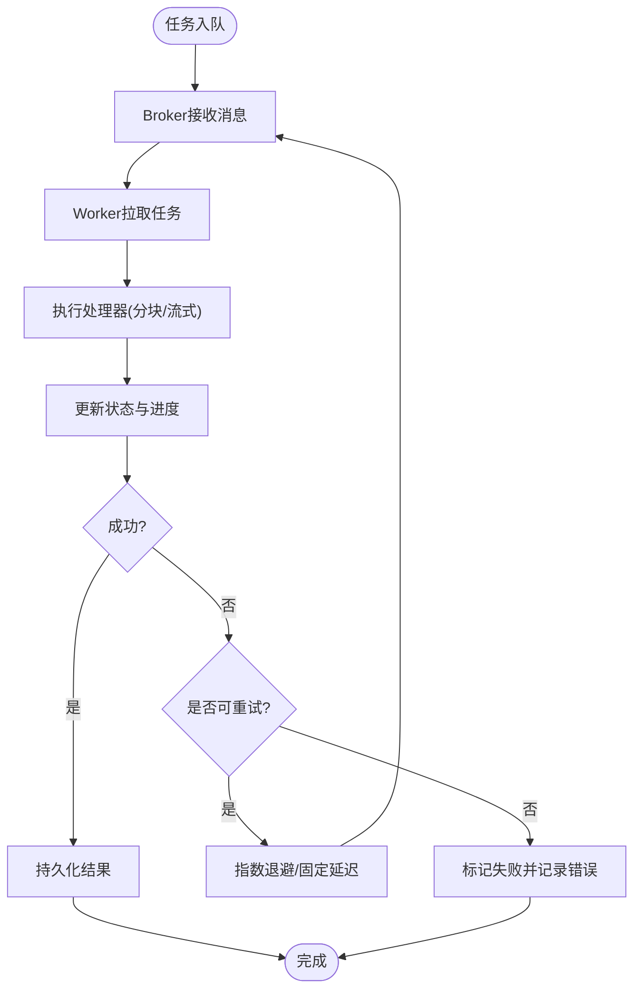
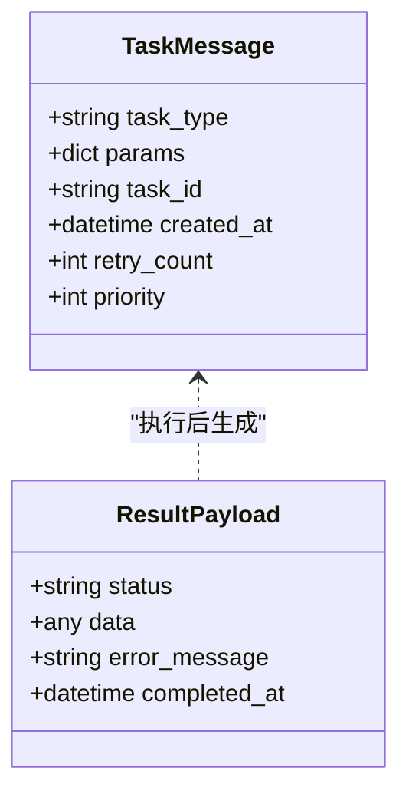
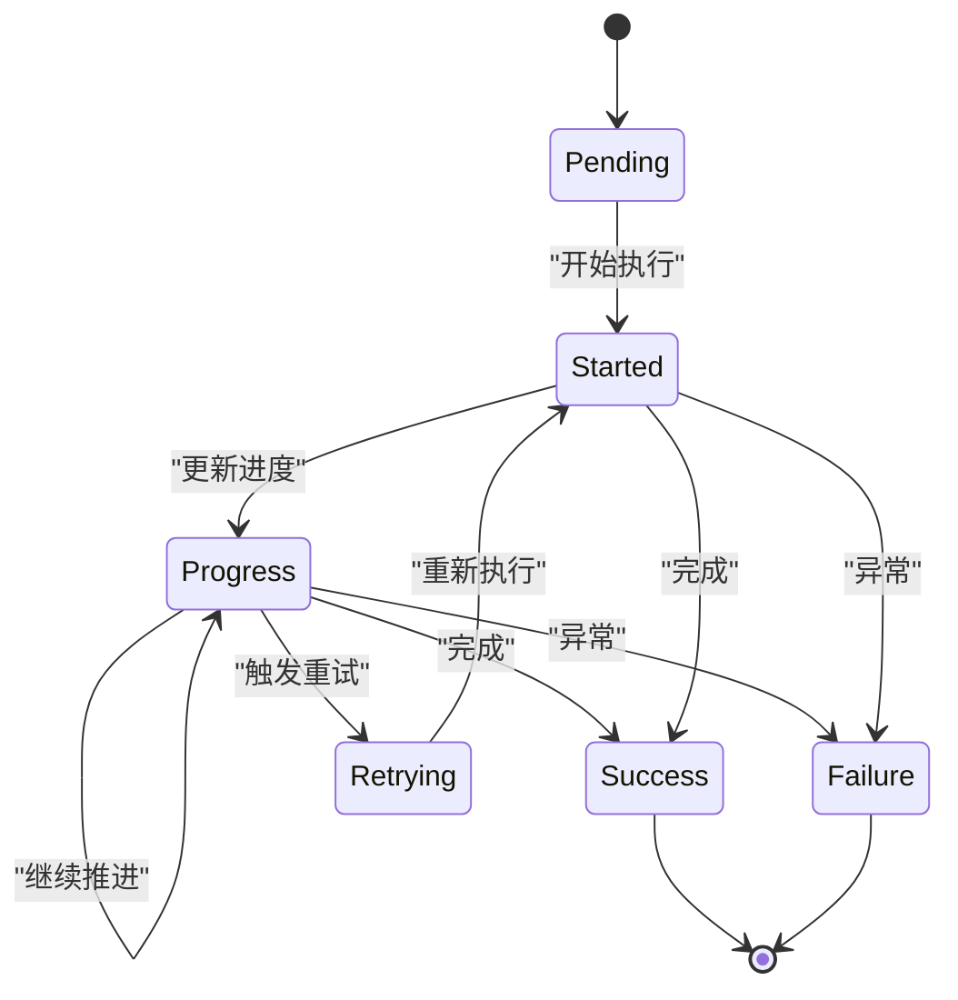
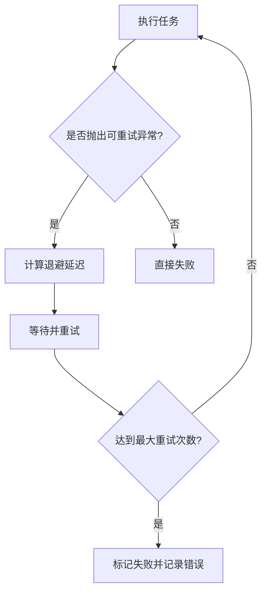
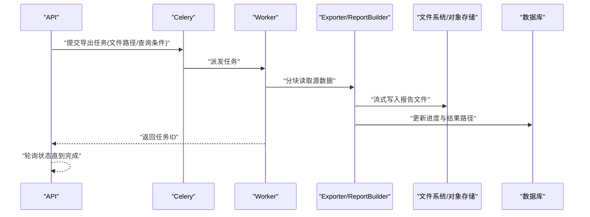
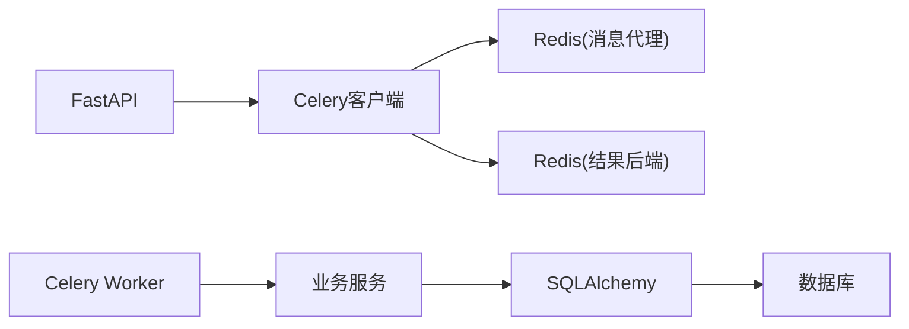

# 异步任务数据流

<cite>
**本文引用的文件**   
- [backend/app/main.py](file://backend/app/main.py)
- [backend/app/workers/main.py](file://backend/app/workers/main.py)
- [backend/app/workers/dispatch.py](file://backend/app/workers/dispatch.py)
- [backend/app/services/exporter.py](file://backend/app/services/exporter.py)
- [backend/app/services/report_builder.py](file://backend/app/services/report_builder.py)
- [backend/app/api/v1/reports.py](file://backend/app/api/v1/reports.py)
- [backend/app/models/report.py](file://backend/app/models/report.py)
- [backend/app/core/config.py](file://backend/app/core/config.py)
- [backend/app/db.py](file://backend/app/db.py)
- [backend/requirements.txt](file://backend/requirements.txt)
</cite>

## 目录
1. [简介](#简介)
2. [项目结构](#项目结构)
3. [核心组件](#核心组件)
4. [架构总览](#架构总览)
5. [详细组件分析](#详细组件分析)
6. [依赖分析](#依赖分析)
7. [性能考虑](#性能考虑)
8. [故障排查指南](#故障排查指南)
9. [结论](#结论)
10. [附录](#附录)

## 简介
本文件面向Talos系统的异步任务数据流，聚焦Celery异步任务的调度、执行与结果存储机制。文档涵盖：
- 任务队列的消息传递格式（参数序列化与结果反序列化）
- 任务状态跟踪与进度报告（生命周期管理与错误重试策略）
- 文件导出与报告生成的异步处理流程（大文件内存优化与分块处理）
- 任务调度的时序图与状态机图
- 具体任务定义与执行示例（以路径引用形式提供）

## 项目结构
后端采用FastAPI作为Web服务入口，Celery作为异步任务引擎，Redis作为消息代理与结果后端，SQLAlchemy+Alembic管理数据库模型与迁移。关键目录与职责：
- backend/app/main.py：FastAPI应用启动、中间件与路由注册
- backend/app/workers/*：Celery应用初始化、任务分发与处理器
- backend/app/services/*：业务服务层（导出器、报告构建器等）
- backend/app/api/v1/*：REST API接口（含报告相关接口）
- backend/app/models/*：数据库模型（如报告模型）
- backend/app/core/config.py：配置（包括Celery、数据库等）
- backend/app/db.py：数据库连接与会话管理
- backend/requirements.txt：Python依赖（包含Celery、Redis等）

**图表来源** 
- [backend/app/main.py](file://backend/app/main.py)
- [backend/app/workers/main.py](file://backend/app/workers/main.py)
- [backend/app/workers/dispatch.py](file://backend/app/workers/dispatch.py)
- [backend/app/services/exporter.py](file://backend/app/services/exporter.py)
- [backend/app/services/report_builder.py](file://backend/app/services/report_builder.py)
- [backend/app/api/v1/reports.py](file://backend/app/api/v1/reports.py)
- [backend/app/models/report.py](file://backend/app/models/report.py)
- [backend/app/core/config.py](file://backend/app/core/config.py)
- [backend/app/db.py](file://backend/app/db.py)

**章节来源**
- [backend/app/main.py](file://backend/app/main.py)
- [backend/app/workers/main.py](file://backend/app/workers/main.py)
- [backend/app/workers/dispatch.py](file://backend/app/workers/dispatch.py)
- [backend/app/services/exporter.py](file://backend/app/services/exporter.py)
- [backend/app/services/report_builder.py](file://backend/app/services/report_builder.py)
- [backend/app/api/v1/reports.py](file://backend/app/api/v1/reports.py)
- [backend/app/models/report.py](file://backend/app/models/report.py)
- [backend/app/core/config.py](file://backend/app/core/config.py)
- [backend/app/db.py](file://backend/app/db.py)
- [backend/requirements.txt](file://backend/requirements.txt)

## 核心组件
- FastAPI应用与API路由：负责接收请求、校验输入、调用异步任务并返回任务ID或状态查询端点
- Celery应用与Worker：负责任务调度、执行、重试、结果持久化
- 任务分发器：将不同业务场景的任务路由到对应处理器（如报告生成、文件导出）
- 业务服务层：实现具体的导出与报告构建逻辑，支持分块读取与流式写入
- 数据模型与数据库：持久化任务元数据、报告状态与结果位置
- 配置模块：集中管理Celery Broker/Backend、数据库连接、日志级别等

**章节来源**
- [backend/app/api/v1/reports.py](file://backend/app/api/v1/reports.py)
- [backend/app/workers/main.py](file://backend/app/workers/main.py)
- [backend/app/workers/dispatch.py](file://backend/app/workers/dispatch.py)
- [backend/app/services/exporter.py](file://backend/app/services/exporter.py)
- [backend/app/services/report_builder.py](file://backend/app/services/report_builder.py)
- [backend/app/models/report.py](file://backend/app/models/report.py)
- [backend/app/core/config.py](file://backend/app/core/config.py)
- [backend/app/db.py](file://backend/app/db.py)

## 架构总览
下图展示从HTTP请求触发到异步任务执行、结果落库与前端轮询的完整链路。

**图表来源** 
- [backend/app/api/v1/reports.py](file://backend/app/api/v1/reports.py)
- [backend/app/workers/main.py](file://backend/app/workers/main.py)
- [backend/app/workers/dispatch.py](file://backend/app/workers/dispatch.py)
- [backend/app/services/exporter.py](file://backend/app/services/exporter.py)
- [backend/app/services/report_builder.py](file://backend/app/services/report_builder.py)
- [backend/app/models/report.py](file://backend/app/models/report.py)
- [backend/app/core/config.py](file://backend/app/core/config.py)
- [backend/app/db.py](file://backend/app/db.py)

## 详细组件分析

### 任务调度与执行（Celery应用与Worker）
- Celery应用初始化：加载配置（Broker/Backend）、注册任务、设置并发与重试策略
- Worker进程：从Broker拉取任务，按优先级与队列分发到处理器
- 任务生命周期：PENDING → STARTED → PROGRESS → SUCCESS/FAILURE → RETRY（可循环）
- 结果存储：通过Backend持久化任务结果（JSON或二进制对象），支持过期策略

**图表来源** 
- [backend/app/workers/main.py](file://backend/app/workers/main.py)
- [backend/app/workers/dispatch.py](file://backend/app/workers/dispatch.py)
- [backend/app/core/config.py](file://backend/app/core/config.py)

**章节来源**
- [backend/app/workers/main.py](file://backend/app/workers/main.py)
- [backend/app/workers/dispatch.py](file://backend/app/workers/dispatch.py)
- [backend/app/core/config.py](file://backend/app/core/config.py)

### 任务队列消息格式（序列化与反序列化）
- 入队消息字段：任务类型、参数字典、唯一任务ID、时间戳、重试次数、优先级
- 参数序列化：使用JSON或MessagePack进行结构化参数编码；二进制内容（如文件路径/指针）避免直接嵌入，改为引用
- 结果反序列化：Worker读取结果后解码为Python对象，供上层API查询或回调使用
- 安全校验：对参数进行白名单校验，防止注入与越权访问

**图表来源** 
- [backend/app/workers/dispatch.py](file://backend/app/workers/dispatch.py)
- [backend/app/core/config.py](file://backend/app/core/config.py)

**章节来源**
- [backend/app/workers/dispatch.py](file://backend/app/workers/dispatch.py)
- [backend/app/core/config.py](file://backend/app/core/config.py)

### 任务状态跟踪与进度报告
- 状态枚举：pending、started、progress、success、failure、retrying
- 进度上报：在长耗时任务中周期性更新进度百分比与阶段描述
- 状态持久化：写入数据库与结果后端，确保跨进程一致性
- 前端轮询：通过任务ID查询状态，直至成功或失败

**图表来源** 
- [backend/app/models/report.py](file://backend/app/models/report.py)
- [backend/app/workers/dispatch.py](file://backend/app/workers/dispatch.py)

**章节来源**
- [backend/app/models/report.py](file://backend/app/models/report.py)
- [backend/app/workers/dispatch.py](file://backend/app/workers/dispatch.py)

### 错误重试策略
- 重试条件：网络超时、临时I/O错误、资源竞争
- 重试策略：指数退避（最小延迟、最大延迟、退避系数）、最大重试次数限制
- 失败处理：记录错误堆栈、降级策略（如部分导出）、告警通知

**图表来源** 
- [backend/app/workers/dispatch.py](file://backend/app/workers/dispatch.py)
- [backend/app/core/config.py](file://backend/app/core/config.py)

**章节来源**
- [backend/app/workers/dispatch.py](file://backend/app/workers/dispatch.py)
- [backend/app/core/config.py](file://backend/app/core/config.py)

### 文件导出与报告生成的异步处理
- 分块读取：按固定大小（如1MB）读取源文件，减少内存占用
- 流式处理：边读边写目标文件，避免一次性加载至内存
- 进度上报：每处理一个分块更新进度百分比
- 结果存储：生成报告后保存至对象存储或本地路径，并在数据库中记录结果URL

**图表来源** 
- [backend/app/services/exporter.py](file://backend/app/services/exporter.py)
- [backend/app/services/report_builder.py](file://backend/app/services/report_builder.py)
- [backend/app/models/report.py](file://backend/app/models/report.py)

**章节来源**
- [backend/app/services/exporter.py](file://backend/app/services/exporter.py)
- [backend/app/services/report_builder.py](file://backend/app/services/report_builder.py)
- [backend/app/models/report.py](file://backend/app/models/report.py)

### 任务定义与执行示例（路径引用）
- 任务定义：在任务分发器中注册任务类型与处理器映射
- 任务提交：API层构造参数并提交到Celery队列
- 任务执行：Worker拉取任务并调用对应处理器
- 结果查询：通过任务ID查询状态与结果

参考路径：
- [任务定义与注册](file://backend/app/workers/dispatch.py)
- [API提交任务](file://backend/app/api/v1/reports.py)
- [Worker执行与状态更新](file://backend/app/workers/dispatch.py)
- [结果查询接口](file://backend/app/api/v1/reports.py)

**章节来源**
- [backend/app/workers/dispatch.py](file://backend/app/workers/dispatch.py)
- [backend/app/api/v1/reports.py](file://backend/app/api/v1/reports.py)

## 依赖分析
- 外部依赖：Celery、Redis、SQLAlchemy、Alembic、FastAPI、Pydantic等
- 内部耦合：API层依赖Celery客户端；Worker依赖业务服务；服务层依赖数据库模型
- 潜在风险：Broker/Backend单点故障、数据库锁竞争、大文件内存溢出

**图表来源** 
- [backend/requirements.txt](file://backend/requirements.txt)
- [backend/app/core/config.py](file://backend/app/core/config.py)
- [backend/app/db.py](file://backend/app/db.py)

**章节来源**
- [backend/requirements.txt](file://backend/requirements.txt)
- [backend/app/core/config.py](file://backend/app/core/config.py)
- [backend/app/db.py](file://backend/app/db.py)

## 性能考虑
- 分块大小调优：根据内存上限与I/O吞吐调整分块大小（建议1~4MB）
- 并发度控制：Worker进程数与线程数匹配CPU核数与I/O特性
- 结果后端优化：启用压缩与过期策略，避免结果膨胀
- 数据库索引：为任务ID、状态、创建时间建立索引，提升查询效率
- 缓存热点：对频繁查询的状态结果引入短期缓存（如Redis）

[本节为通用指导，不直接分析具体文件]

## 故障排查指南
- 常见错误：Broker连接失败、权限不足、序列化异常、内存溢出
- 诊断步骤：检查Broker/Backend连通性、查看Worker日志、验证参数格式、监控内存使用
- 恢复策略：重启Worker、清理死锁任务、扩容实例、降级功能

**章节来源**
- [backend/app/workers/dispatch.py](file://backend/app/workers/dispatch.py)
- [backend/app/core/config.py](file://backend/app/core/config.py)

## 结论
Talos系统通过Celery实现了高可靠、可扩展的异步任务处理。结合分块流式处理与状态跟踪，能够有效支撑大文件导出与报告生成等重负载场景。建议在部署时关注Broker/Backend的高可用、Worker并发度与内存限制，以及数据库与对象存储的性能优化。

[本节为总结性内容，不直接分析具体文件]

## 附录
- 术语表：Broker（消息代理）、Backend（结果后端）、Worker（工作进程）、分块（Chunking）
- 最佳实践：参数白名单校验、幂等性设计、优雅退出与信号处理、监控与告警集成

[本节为概念性内容，不直接分析具体文件]