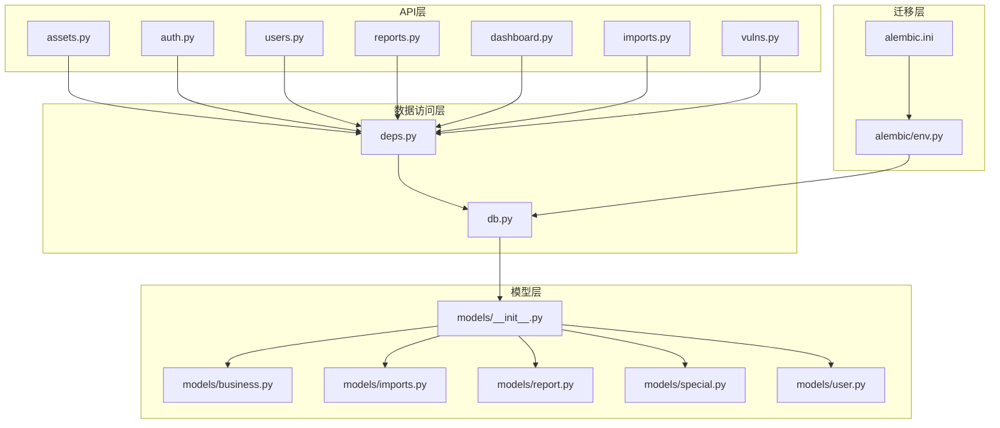
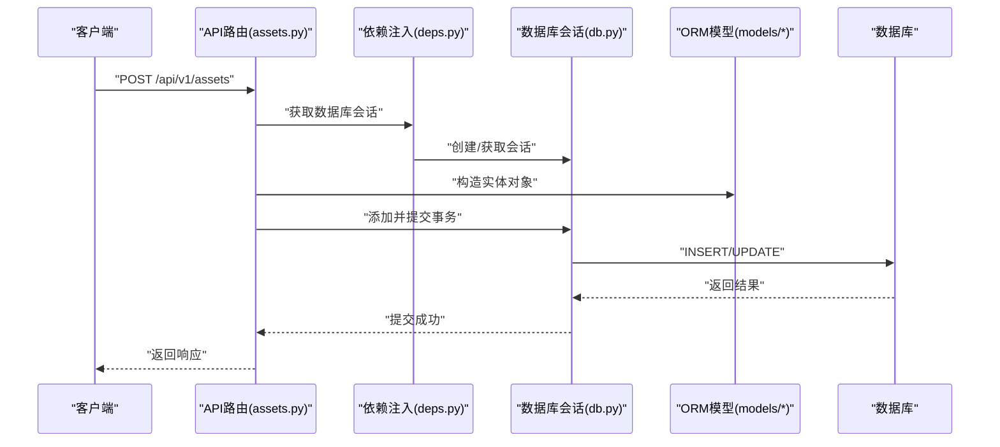
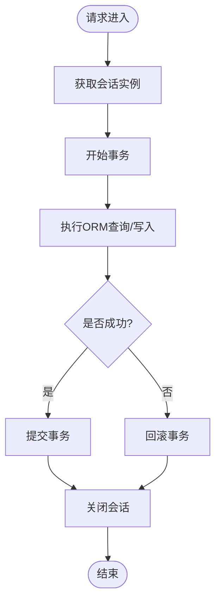
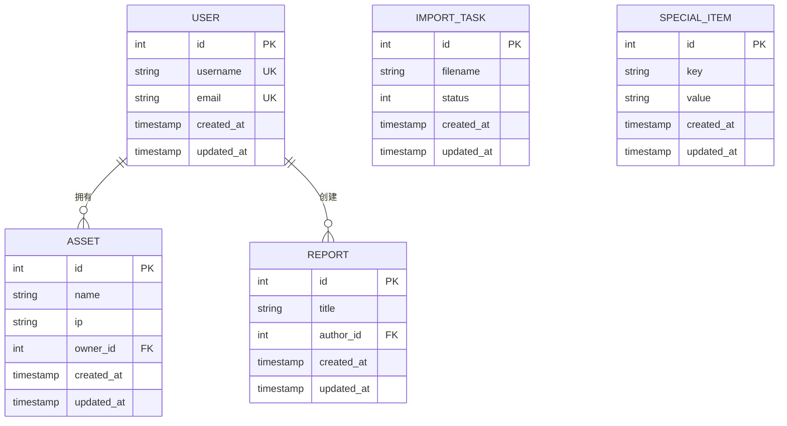
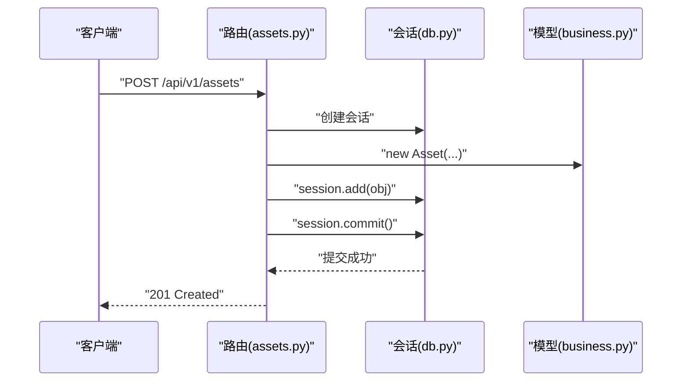
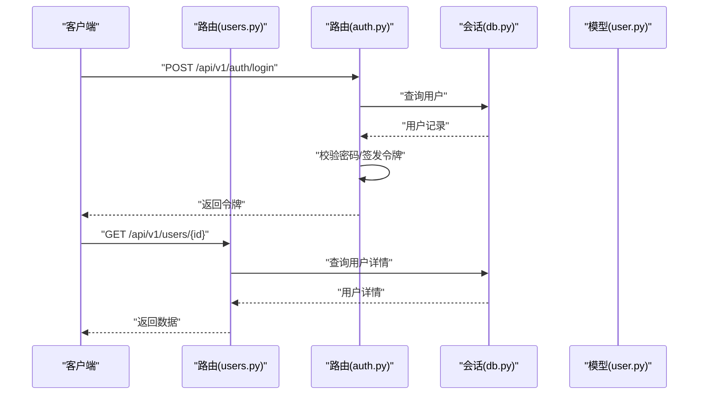
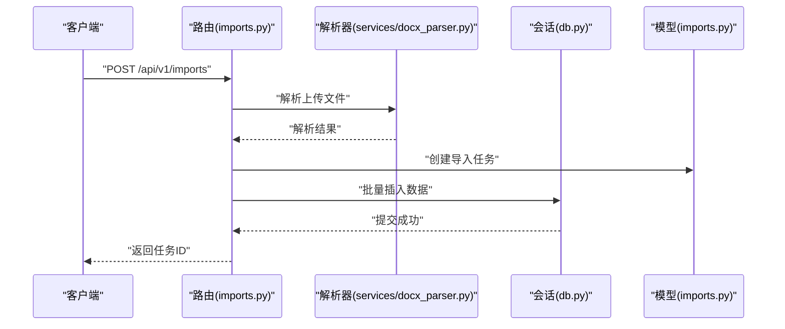
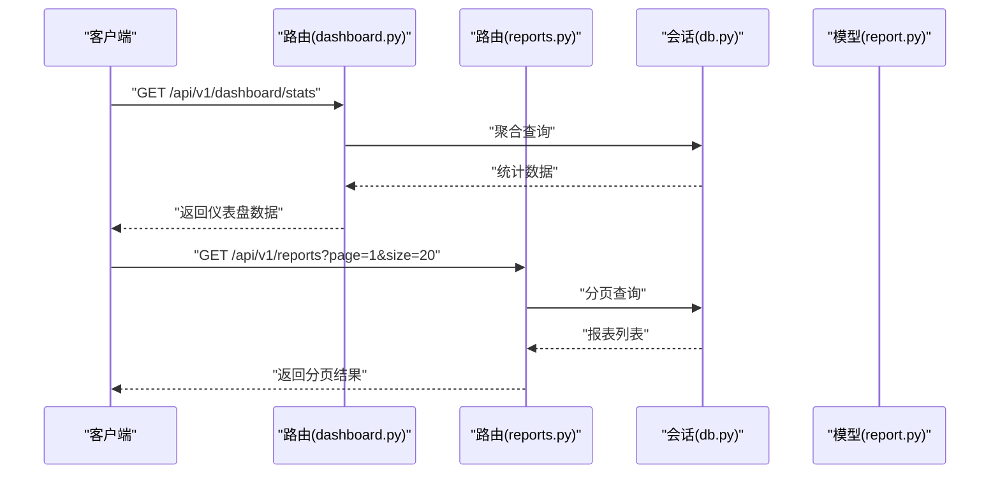
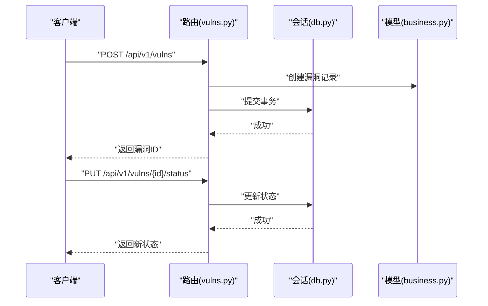
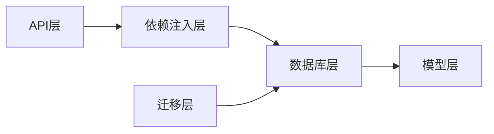

# 数据库数据流

<cite>
**本文档引用的文件**   
- [backend/app/db.py](file://backend/app/db.py)
- [backend/app/models/__init__.py](file://backend/app/models/__init__.py)
- [backend/app/models/business.py](file://backend/app/models/business.py)
- [backend/app/models/imports.py](file://backend/app/models/imports.py)
- [backend/app/models/report.py](file://backend/app/models/report.py)
- [backend/app/models/special.py](file://backend/app/models/special.py)
- [backend/app/models/user.py](file://backend/app/models/user.py)
- [backend/app/api/v1/assets.py](file://backend/app/api/v1/assets.py)
- [backend/app/api/v1/auth.py](file://backend/app/api/v1/auth.py)
- [backend/app/api/v1/dashboard.py](file://backend/app/api/v1/dashboard.py)
- [backend/app/api/v1/imports.py](file://backend/app/api/v1/imports.py)
- [backend/app/api/v1/reports.py](file://backend/app/api/v1/reports.py)
- [backend/app/api/v1/users.py](file://backend/app/api/v1/users.py)
- [backend/app/api/v1/vulns.py](file://backend/app/api/v1/vulns.py)
- [backend/app/core/deps.py](file://backend/app/core/deps.py)
- [backend/app/core/config.py](file://backend/app/core/config.py)
- [backend/alembic/env.py](file://backend/alembic/env.py)
- [backend/alembic.ini](file://backend/alembic.ini)
</cite>

## 目录
1. [简介](#简介)
2. [项目结构](#项目结构)
3. [核心组件](#核心组件)
4. [架构总览](#架构总览)
5. [详细组件分析](#详细组件分析)
6. [依赖关系分析](#依赖关系分析)
7. [性能考虑](#性能考虑)
8. [故障排查指南](#故障排查指南)
9. [结论](#结论)
10. [附录](#附录)

## 简介
本文件聚焦Talos系统的数据库数据流，围绕SQLAlchemy ORM的数据访问模式、事务与一致性、并发控制与锁策略、Alembic迁移流程与版本管理、缓存与性能优化进行系统化说明。文档同时提供时序图与ER关系图，并给出典型数据操作示例与最佳实践，帮助读者快速理解从API到持久化的完整链路。

## 项目结构
后端采用FastAPI + SQLAlchemy + Alembic的典型分层：
- API层：按业务域划分（assets、auth、users、reports等）
- 模型层：SQLAlchemy ORM模型定义与关系映射
- 服务层：复杂业务逻辑封装
- 数据访问层：数据库会话、连接池、查询构建
- 迁移层：Alembic脚本与环境配置

图表来源
- [backend/app/api/v1/assets.py](file://backend/app/api/v1/assets.py)
- [backend/app/api/v1/auth.py](file://backend/app/api/v1/auth.py)
- [backend/app/api/v1/users.py](file://backend/app/api/v1/users.py)
- [backend/app/api/v1/reports.py](file://backend/app/api/v1/reports.py)
- [backend/app/api/v1/dashboard.py](file://backend/app/api/v1/dashboard.py)
- [backend/app/api/v1/imports.py](file://backend/app/api/v1/imports.py)
- [backend/app/api/v1/vulns.py](file://backend/app/api/v1/vulns.py)
- [backend/app/db.py](file://backend/app/db.py)
- [backend/app/core/deps.py](file://backend/app/core/deps.py)
- [backend/app/models/__init__.py](file://backend/app/models/__init__.py)
- [backend/app/models/business.py](file://backend/app/models/business.py)
- [backend/app/models/imports.py](file://backend/app/models/imports.py)
- [backend/app/models/report.py](file://backend/app/models/report.py)
- [backend/app/models/special.py](file://backend/app/models/special.py)
- [backend/app/models/user.py](file://backend/app/models/user.py)
- [backend/alembic/env.py](file://backend/alembic/env.py)
- [backend/alembic.ini](file://backend/alembic.ini)

章节来源
- [backend/app/db.py](file://backend/app/db.py)
- [backend/app/core/deps.py](file://backend/app/core/deps.py)
- [backend/app/models/__init__.py](file://backend/app/models/__init__.py)
- [backend/alembic/env.py](file://backend/alembic/env.py)
- [backend/alembic.ini](file://backend/alembic.ini)

## 核心组件
- 数据库会话与引擎：集中管理连接池、会话生命周期、异步/同步会话工厂
- 模型与关系：ORM模型定义、字段约束、外键与关联关系
- API依赖注入：通过FastAPI依赖获取会话，保证请求级事务边界
- 迁移环境：Alembic初始化、目标元数据绑定、脚本生成与执行

章节来源
- [backend/app/db.py](file://backend/app/db.py)
- [backend/app/core/deps.py](file://backend/app/core/deps.py)
- [backend/app/models/__init__.py](file://backend/app/models/__init__.py)
- [backend/alembic/env.py](file://backend/alembic/env.py)

## 架构总览
下图展示一次典型的“创建资产”请求在系统内的数据流路径：从API入口到会话提交，再到数据库落盘。

图表来源
- [backend/app/api/v1/assets.py](file://backend/app/api/v1/assets.py)
- [backend/app/core/deps.py](file://backend/app/core/deps.py)
- [backend/app/db.py](file://backend/app/db.py)
- [backend/app/models/business.py](file://backend/app/models/business.py)

## 详细组件分析

### 数据访问层（会话与连接池）
- 会话工厂：为每个请求创建独立会话，确保事务隔离与自动回滚
- 连接池：基于SQLAlchemy引擎配置连接数、超时、回收策略
- 依赖注入：在API层通过FastAPI依赖获取会话，避免全局状态

图表来源
- [backend/app/db.py](file://backend/app/db.py)
- [backend/app/core/deps.py](file://backend/app/core/deps.py)

章节来源
- [backend/app/db.py](file://backend/app/db.py)
- [backend/app/core/deps.py](file://backend/app/core/deps.py)

### 模型与关系映射（ORM）
- 基础模型：统一字段（如主键、时间戳）、基类继承
- 领域模型：用户、资产、报告、导入任务、特殊项等
- 关系映射：一对一、一对多、多对多关系，含级联与懒加载策略

图表来源
- [backend/app/models/user.py](file://backend/app/models/user.py)
- [backend/app/models/business.py](file://backend/app/models/business.py)
- [backend/app/models/report.py](file://backend/app/models/report.py)
- [backend/app/models/imports.py](file://backend/app/models/imports.py)
- [backend/app/models/special.py](file://backend/app/models/special.py)

章节来源
- [backend/app/models/__init__.py](file://backend/app/models/__init__.py)
- [backend/app/models/user.py](file://backend/app/models/user.py)
- [backend/app/models/business.py](file://backend/app/models/business.py)
- [backend/app/models/report.py](file://backend/app/models/report.py)
- [backend/app/models/imports.py](file://backend/app/models/imports.py)
- [backend/app/models/special.py](file://backend/app/models/special.py)

### API层数据流（以资产为例）
- 路由接收参数，校验输入
- 通过依赖注入获取会话
- 构造ORM对象并加入会话
- 提交事务并返回响应

图表来源
- [backend/app/api/v1/assets.py](file://backend/app/api/v1/assets.py)
- [backend/app/db.py](file://backend/app/db.py)
- [backend/app/models/business.py](file://backend/app/models/business.py)

章节来源
- [backend/app/api/v1/assets.py](file://backend/app/api/v1/assets.py)
- [backend/app/models/business.py](file://backend/app/models/business.py)

### 认证与用户数据流
- 登录验证：用户名/密码校验，生成令牌
- 权限控制：基于角色的访问控制（RBAC）
- 用户CRUD：增删改查用户信息

图表来源
- [backend/app/api/v1/auth.py](file://backend/app/api/v1/auth.py)
- [backend/app/api/v1/users.py](file://backend/app/api/v1/users.py)
- [backend/app/db.py](file://backend/app/db.py)
- [backend/app/models/user.py](file://backend/app/models/user.py)

章节来源
- [backend/app/api/v1/auth.py](file://backend/app/api/v1/auth.py)
- [backend/app/api/v1/users.py](file://backend/app/api/v1/users.py)
- [backend/app/models/user.py](file://backend/app/models/user.py)

### 报告与导入任务数据流
- 报告生成：聚合数据、模板渲染、持久化
- 导入任务：文件解析、批量插入、状态跟踪

图表来源
- [backend/app/api/v1/imports.py](file://backend/app/api/v1/imports.py)
- [backend/app/services/docx_parser.py](file://backend/app/services/docx_parser.py)
- [backend/app/db.py](file://backend/app/db.py)
- [backend/app/models/imports.py](file://backend/app/models/imports.py)

章节来源
- [backend/app/api/v1/imports.py](file://backend/app/api/v1/imports.py)
- [backend/app/models/imports.py](file://backend/app/models/imports.py)

### 仪表盘与报表数据流
- 仪表盘：聚合统计、实时指标
- 报表：多维度查询、分页、排序

图表来源
- [backend/app/api/v1/dashboard.py](file://backend/app/api/v1/dashboard.py)
- [backend/app/api/v1/reports.py](file://backend/app/api/v1/reports.py)
- [backend/app/db.py](file://backend/app/db.py)
- [backend/app/models/report.py](file://backend/app/models/report.py)

章节来源
- [backend/app/api/v1/dashboard.py](file://backend/app/api/v1/dashboard.py)
- [backend/app/api/v1/reports.py](file://backend/app/api/v1/reports.py)
- [backend/app/models/report.py](file://backend/app/models/report.py)

### 漏洞管理与特殊项数据流
- 漏洞管理：漏洞录入、状态流转、关联资产
- 特殊项：系统配置、动态参数管理

图表来源
- [backend/app/api/v1/vulns.py](file://backend/app/api/v1/vulns.py)
- [backend/app/db.py](file://backend/app/db.py)
- [backend/app/models/business.py](file://backend/app/models/business.py)

章节来源
- [backend/app/api/v1/vulns.py](file://backend/app/api/v1/vulns.py)
- [backend/app/models/business.py](file://backend/app/models/business.py)

## 依赖关系分析
- API层依赖依赖注入层获取会话
- 依赖注入层依赖数据库层配置会话和引擎
- 模型层被所有业务模块引用
- 迁移层依赖数据库配置和目标元数据

图表来源
- [backend/app/api/v1/assets.py](file://backend/app/api/v1/assets.py)
- [backend/app/core/deps.py](file://backend/app/core/deps.py)
- [backend/app/db.py](file://backend/app/db.py)
- [backend/app/models/__init__.py](file://backend/app/models/__init__.py)
- [backend/alembic/env.py](file://backend/alembic/env.py)

章节来源
- [backend/app/core/deps.py](file://backend/app/core/deps.py)
- [backend/app/db.py](file://backend/app/db.py)
- [backend/alembic/env.py](file://backend/alembic/env.py)

## 性能考虑
- 连接池配置：合理设置最大连接数、最小连接数、连接超时
- 查询优化：使用合适的索引、避免N+1查询、选择性加载关系
- 事务粒度：最小化事务范围，减少锁持有时间
- 缓存策略：热点数据缓存、查询结果缓存、分布式缓存
- 异步处理：长时间运行的任务使用消息队列和后台任务

章节来源
- [backend/app/db.py](file://backend/app/db.py)
- [backend/app/core/config.py](file://backend/app/core/config.py)

## 故障排查指南
- 连接失败：检查数据库连接字符串、网络连通性、凭据正确性
- 事务冲突：查看死锁日志、调整隔离级别、优化查询顺序
- 迁移失败：检查Alembic脚本、数据库版本、回滚策略
- 性能问题：分析慢查询日志、监控连接池使用情况

章节来源
- [backend/alembic/env.py](file://backend/alembic/env.py)
- [backend/alembic.ini](file://backend/alembic.ini)
- [backend/app/db.py](file://backend/app/db.py)

## 结论
Talos系统采用清晰的分层架构和成熟的ORM框架，实现了高效、可靠的数据库数据流。通过合理的会话管理、事务控制和迁移策略，确保了数据一致性和系统可维护性。建议持续关注性能优化和错误处理，以提升系统稳定性和用户体验。

## 附录

### 事务管理机制
- 请求级事务：每个HTTP请求对应一个独立事务
- 自动回滚：异常发生时自动回滚未提交的事务
- 嵌套事务：支持子事务和保存点机制

### 并发控制与锁策略
- 行级锁：使用SELECT FOR UPDATE进行悲观锁
- 乐观锁：版本号字段防止并发修改冲突
- 读写分离：主库写、从库读提升并发能力

### 数据库迁移流程
- 生成迁移脚本：根据模型变更自动生成
- 应用迁移：按顺序执行迁移脚本
- 回滚机制：支持版本回退和数据恢复

### 数据缓存策略
- 应用级缓存：Redis或内存缓存热点数据
- 查询缓存：SQLAlchemy查询结果缓存
- 分布式缓存：跨进程共享缓存数据

### 最佳实践
- 使用上下文管理器管理会话生命周期
- 避免在事务中进行外部API调用
- 合理使用索引和优化查询语句
- 实施适当的错误处理和日志记录
- 定期审查和重构数据库模型