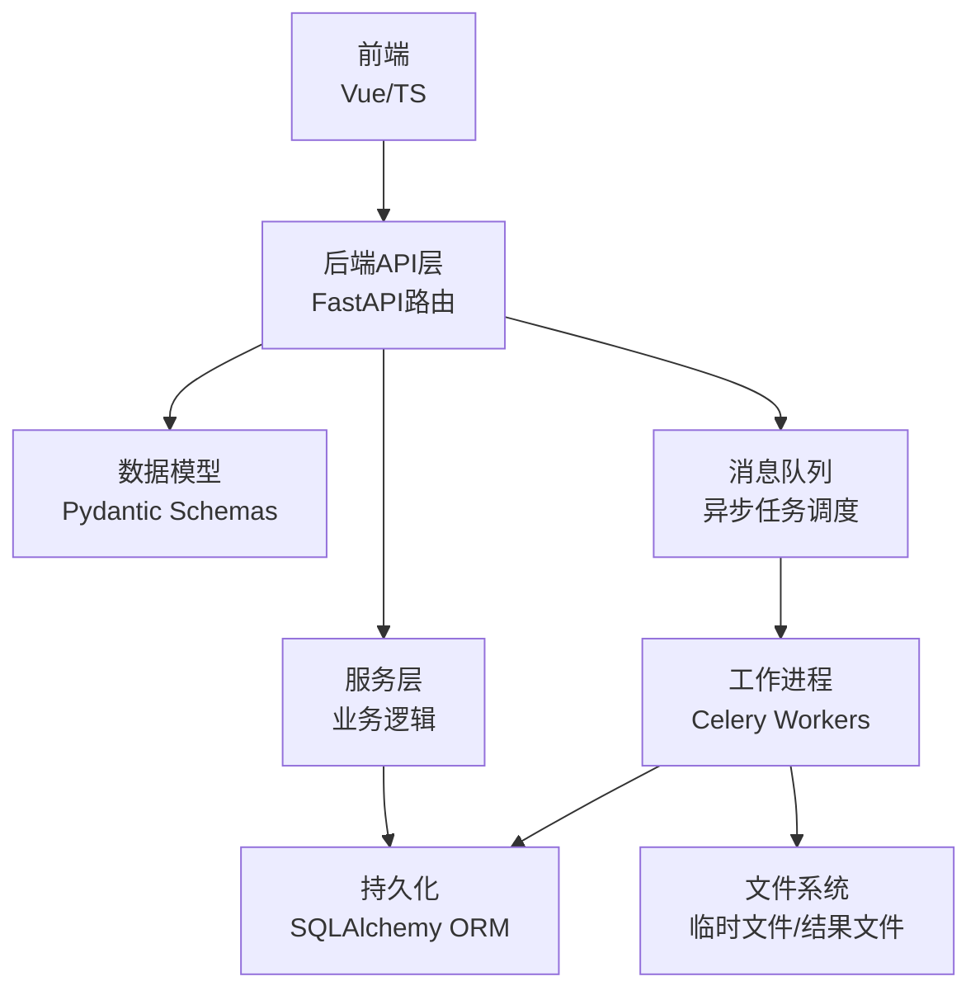
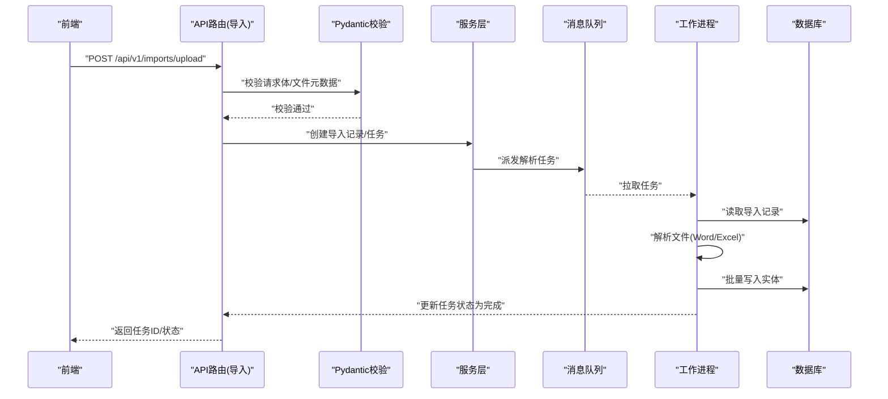
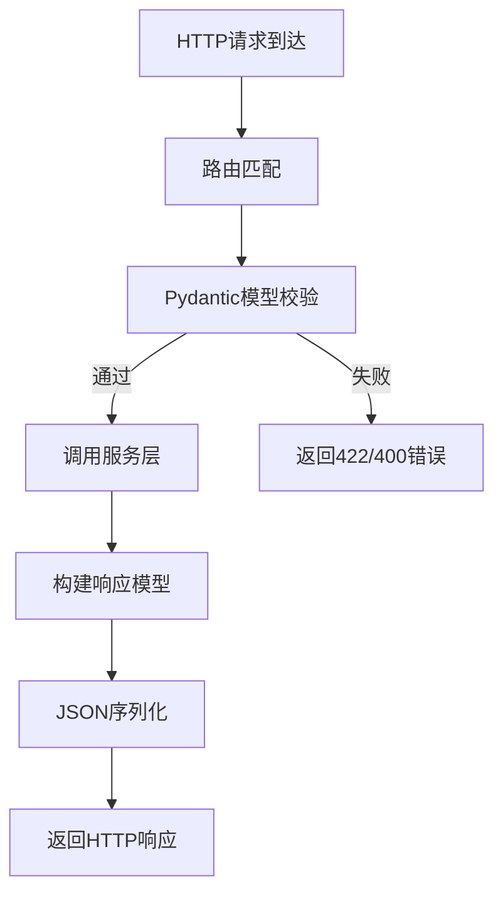
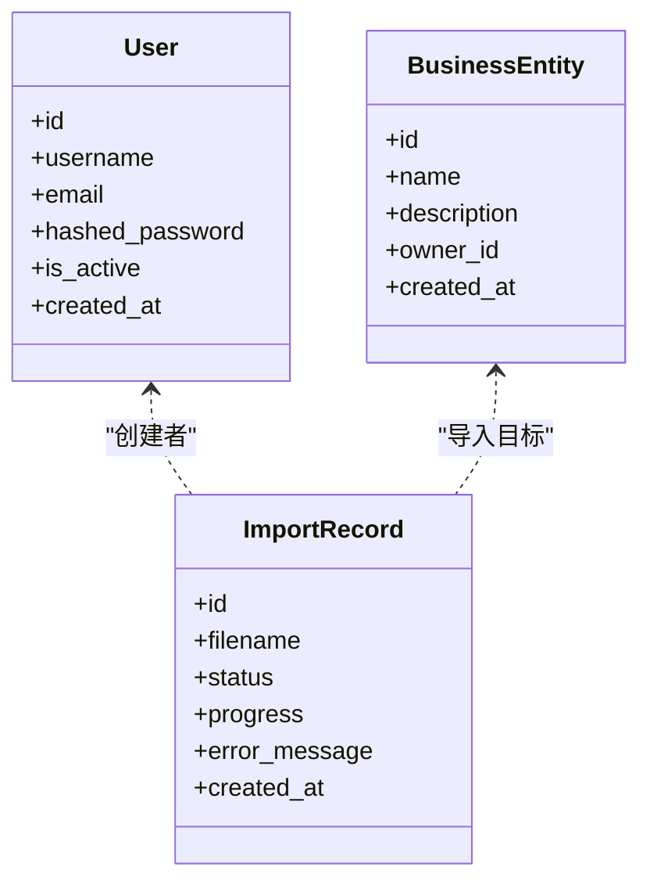
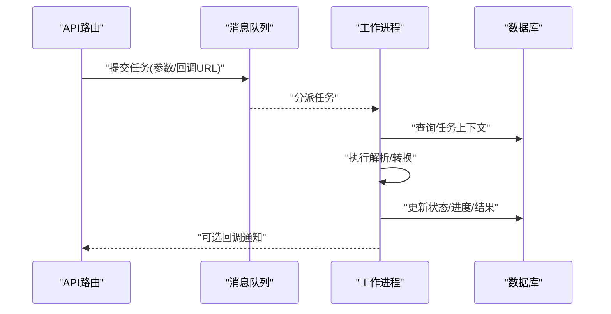
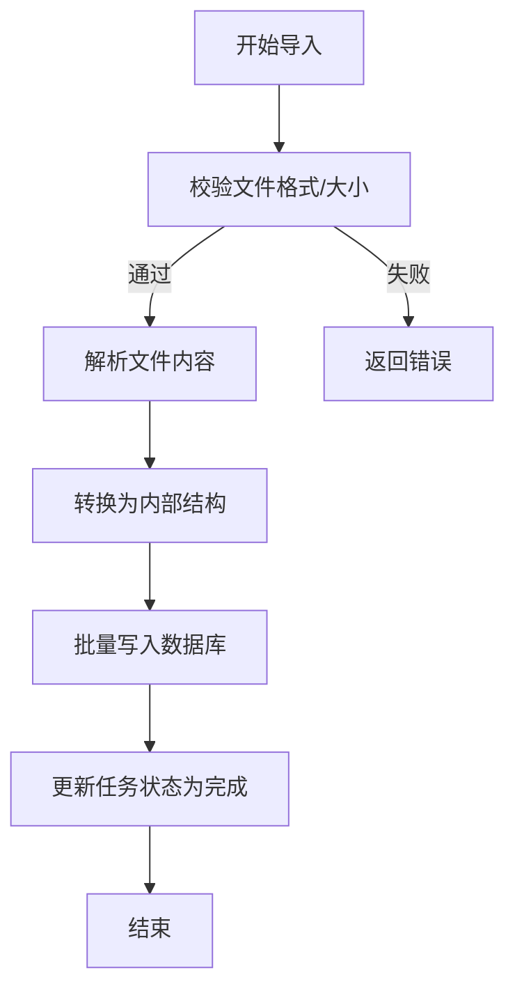
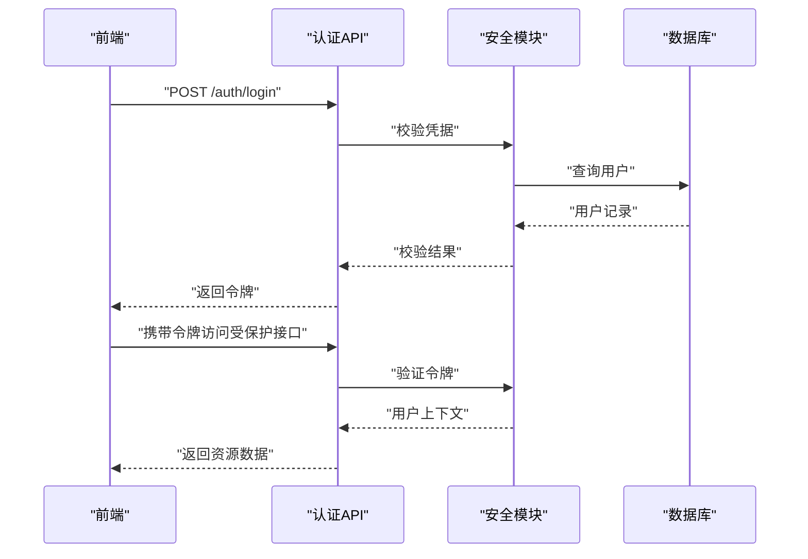
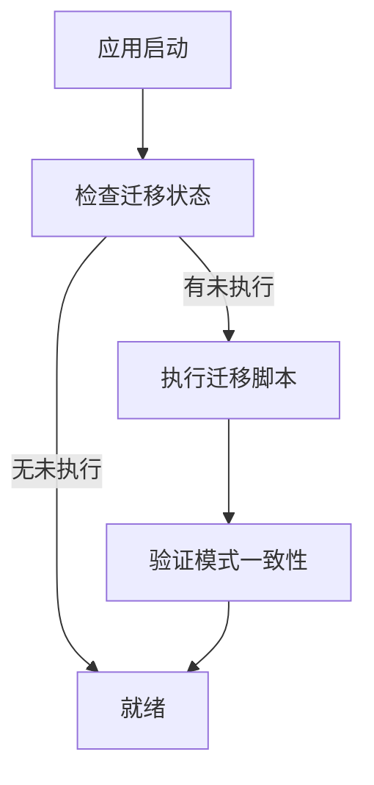
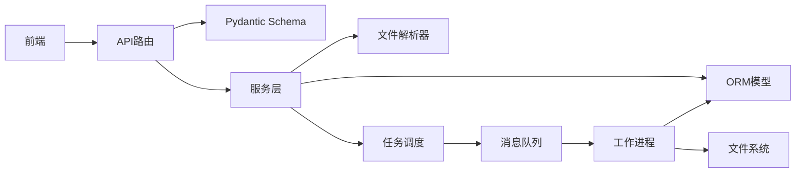
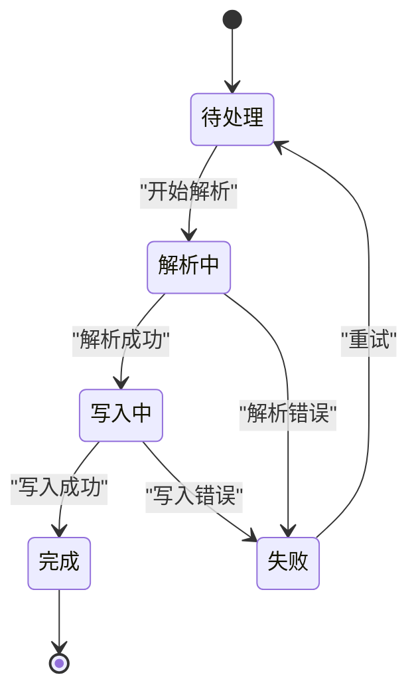

# 数据流架构

<cite>
**本文引用的文件**   
- [backend/app/main.py](file://backend/app/main.py)
- [backend/app/api/v1/auth.py](file://backend/app/api/v1/auth.py)
- [backend/app/api/v1/assets.py](file://backend/app/api/v1/assets.py)
- [backend/app/api/v1/imports.py](file://backend/app/api/v1/imports.py)
- [backend/app/api/v1/reports.py](file://backend/app/api/v1/reports.py)
- [backend/app/schemas.py](file://backend/app/schemas.py)
- [backend/app/models/business.py](file://backend/app/models/business.py)
- [backend/app/models/user.py](file://backend/app/models/user.py)
- [backend/app/models/imports.py](file://backend/app/models/imports.py)
- [backend/app/services/docx_parser.py](file://backend/app/services/docx_parser.py)
- [backend/app/services/exporter.py](file://backend/app/services/exporter.py)
- [backend/app/workers/main.py](file://backend/app/workers/main.py)
- [backend/app/workers/dispatch.py](file://backend/app/workers/dispatch.py)
- [backend/app/db.py](file://backend/app/db.py)
- [backend/alembic/env.py](file://backend/alembic/env.py)
- [frontend/src/api/client.ts](file://frontend/src/api/client.ts)
</cite>

## 目录
1. [简介](#简介)
2. [项目结构](#项目结构)
3. [核心组件](#核心组件)
4. [架构总览](#架构总览)
5. [详细组件分析](#详细组件分析)
6. [依赖关系分析](#依赖关系分析)
7. [性能考量](#性能考量)
8. [故障排查指南](#故障排查指南)
9. [结论](#结论)
10. [附录](#附录)

## 简介
本文件面向Talos系统的数据流架构，聚焦从前端用户操作到后端数据处理再到数据库存储的完整流转路径。文档涵盖：
- 请求-响应模式的API数据交换格式与Pydantic模型验证、序列化机制
- 异步任务的数据传递与处理流程（消息队列与任务状态跟踪）
- 文件导入导出管道（Excel、Word解析与转换）
- 缓存策略与数据一致性保证
- 数据迁移流程与版本兼容性处理
- 关键时序图与状态转换图

## 项目结构
Talos采用前后端分离架构：
- 前端：Vue + TypeScript，通过HTTP客户端发起REST API调用
- 后端：FastAPI应用，提供REST API、Pydantic校验、SQLAlchemy ORM、Alembic迁移、Celery异步任务
- 数据库：由ORM管理，使用Alembic进行版本化迁移
- 异步任务：通过消息队列驱动工作进程执行耗时任务（如导入、报告生成、导出）

**图表来源** 
- [backend/app/main.py](file://backend/app/main.py)
- [backend/app/api/v1/imports.py](file://backend/app/api/v1/imports.py)
- [backend/app/workers/main.py](file://backend/app/workers/main.py)
- [backend/app/db.py](file://backend/app/db.py)

**章节来源**
- [backend/app/main.py](file://backend/app/main.py)
- [backend/app/db.py](file://backend/app/db.py)

## 核心组件
- API路由层：定义REST接口，接收并返回JSON，使用Pydantic进行输入校验和输出序列化
- 服务层：封装业务逻辑，协调数据库访问、外部解析器、任务调度
- 数据模型：SQLAlchemy ORM模型映射数据库表；Pydantic Schema用于API边界校验
- 异步任务：基于消息队列的任务分发与执行，支持进度与状态追踪
- 文件处理：Word/Excel解析与转换，写入中间结构或持久化
- 迁移工具：Alembic管理数据库模式演进

**章节来源**
- [backend/app/schemas.py](file://backend/app/schemas.py)
- [backend/app/models/business.py](file://backend/app/models/business.py)
- [backend/app/models/user.py](file://backend/app/models/user.py)
- [backend/app/models/imports.py](file://backend/app/models/imports.py)
- [backend/app/services/docx_parser.py](file://backend/app/services/docx_parser.py)
- [backend/app/services/exporter.py](file://backend/app/services/exporter.py)
- [backend/app/workers/dispatch.py](file://backend/app/workers/dispatch.py)

## 架构总览
下图展示一次典型“导入”操作的端到端数据流：前端上传文件，后端校验并创建导入任务，工作进程解析文件、写入数据库，最终返回任务状态。

**图表来源** 
- [backend/app/api/v1/imports.py](file://backend/app/api/v1/imports.py)
- [backend/app/schemas.py](file://backend/app/schemas.py)
- [backend/app/workers/dispatch.py](file://backend/app/workers/dispatch.py)
- [backend/app/db.py](file://backend/app/db.py)

## 详细组件分析

### API层与Pydantic校验/序列化
- 所有API路由统一在v1命名空间下，请求进入后由Pydantic模型对入参进行严格校验（类型、必填、范围等），失败返回标准错误响应
- 响应数据通过Pydantic模型序列化为JSON，确保字段一致性与可预期性
- 认证相关接口对用户凭据进行校验并签发令牌，后续请求携带令牌访问受保护资源

**图表来源** 
- [backend/app/api/v1/auth.py](file://backend/app/api/v1/auth.py)
- [backend/app/api/v1/assets.py](file://backend/app/api/v1/assets.py)
- [backend/app/schemas.py](file://backend/app/schemas.py)

**章节来源**
- [backend/app/api/v1/auth.py](file://backend/app/api/v1/auth.py)
- [backend/app/api/v1/assets.py](file://backend/app/api/v1/assets.py)
- [backend/app/schemas.py](file://backend/app/schemas.py)

### 数据模型与ORM
- SQLAlchemy模型定义数据库表结构，包含主键、外键、索引与约束
- Pydantic Schema与ORM模型解耦，API层仅暴露必要的字段，避免敏感信息泄露
- 事务边界在服务层控制，保证批量写入的一致性

**图表来源** 
- [backend/app/models/user.py](file://backend/app/models/user.py)
- [backend/app/models/imports.py](file://backend/app/models/imports.py)
- [backend/app/models/business.py](file://backend/app/models/business.py)

**章节来源**
- [backend/app/models/user.py](file://backend/app/models/user.py)
- [backend/app/models/imports.py](file://backend/app/models/imports.py)
- [backend/app/models/business.py](file://backend/app/models/business.py)

### 异步任务与消息队列
- 导入、报告生成、导出等耗时操作以任务形式派发至消息队列
- 工作进程拉取任务，执行解析/转换逻辑，更新任务状态与进度
- 前端轮询或通过事件获取任务状态，实现长时任务的友好交互

**图表来源** 
- [backend/app/workers/main.py](file://backend/app/workers/main.py)
- [backend/app/workers/dispatch.py](file://backend/app/workers/dispatch.py)
- [backend/app/db.py](file://backend/app/db.py)

**章节来源**
- [backend/app/workers/main.py](file://backend/app/workers/main.py)
- [backend/app/workers/dispatch.py](file://backend/app/workers/dispatch.py)

### 文件导入导出管道
- 导入：接收Excel/Word文件，校验格式，解析内容，转换为内部数据结构，批量写入数据库
- 导出：根据查询条件聚合数据，生成Excel/Word文件，返回下载链接或直接流式传输

**图表来源** 
- [backend/app/api/v1/imports.py](file://backend/app/api/v1/imports.py)
- [backend/app/services/docx_parser.py](file://backend/app/services/docx_parser.py)
- [backend/app/services/exporter.py](file://backend/app/services/exporter.py)

**章节来源**
- [backend/app/api/v1/imports.py](file://backend/app/api/v1/imports.py)
- [backend/app/services/docx_parser.py](file://backend/app/services/docx_parser.py)
- [backend/app/services/exporter.py](file://backend/app/services/exporter.py)

### 认证与授权数据流
- 登录接口校验用户名/密码，成功后签发令牌
- 受保护接口需携带令牌，服务端验证令牌有效性并注入当前用户上下文
- 权限检查在服务层或依赖注入中完成，限制资源访问

**图表来源** 
- [backend/app/api/v1/auth.py](file://backend/app/api/v1/auth.py)
- [backend/app/core/security.py](file://backend/app/core/security.py)
- [backend/app/models/user.py](file://backend/app/models/user.py)

**章节来源**
- [backend/app/api/v1/auth.py](file://backend/app/api/v1/auth.py)
- [backend/app/core/security.py](file://backend/app/core/security.py)
- [backend/app/models/user.py](file://backend/app/models/user.py)

### 数据迁移与版本兼容
- Alembic维护数据库模式历史，每次变更生成迁移脚本
- 启动时自动检测并应用待执行的迁移，确保版本一致性
- 向前/向后兼容策略：新增字段默认值、删除字段软保留、枚举扩展兼容旧值

**图表来源** 
- [backend/alembic/env.py](file://backend/alembic/env.py)
- [backend/app/db.py](file://backend/app/db.py)

**章节来源**
- [backend/alembic/env.py](file://backend/alembic/env.py)
- [backend/app/db.py](file://backend/app/db.py)

## 依赖关系分析
- API路由依赖Pydantic Schema与服务层
- 服务层依赖ORM模型、文件解析器、任务调度器
- 工作进程依赖数据库与文件系统
- 前端依赖HTTP客户端与路由配置

**图表来源** 
- [backend/app/main.py](file://backend/app/main.py)
- [backend/app/api/v1/imports.py](file://backend/app/api/v1/imports.py)
- [backend/app/services/docx_parser.py](file://backend/app/services/docx_parser.py)
- [backend/app/workers/dispatch.py](file://backend/app/workers/dispatch.py)

**章节来源**
- [backend/app/main.py](file://backend/app/main.py)
- [backend/app/api/v1/imports.py](file://backend/app/api/v1/imports.py)
- [backend/app/services/docx_parser.py](file://backend/app/services/docx_parser.py)
- [backend/app/workers/dispatch.py](file://backend/app/workers/dispatch.py)

## 性能考量
- 批量写入：导入时使用事务包裹批量插入，减少IO开销
- 分页与过滤：列表接口支持分页与条件过滤，避免全量加载
- 异步处理：耗时任务放入队列，提升API响应速度
- 连接池：数据库连接池复用连接，降低握手成本
- 缓存建议：热点数据可使用Redis缓存，注意失效策略与一致性

[本节为通用指导，不直接分析具体文件]

## 故障排查指南
- 校验失败：检查Pydantic Schema字段类型与必填项，确认前端传参格式
- 任务失败：查看工作进程日志，定位解析错误或数据库写入异常
- 迁移冲突：核对迁移脚本顺序与依赖，必要时回滚或修复脚本
- 认证问题：检查令牌签发与验证逻辑，确认过期时间与密钥配置

**章节来源**
- [backend/app/schemas.py](file://backend/app/schemas.py)
- [backend/app/workers/main.py](file://backend/app/workers/main.py)
- [backend/alembic/env.py](file://backend/alembic/env.py)

## 结论
Talos系统通过清晰的层次划分与严格的模型校验，实现了稳定高效的数据流。API层负责契约与校验，服务层编排业务逻辑，异步任务解耦耗时操作，ORM与迁移保障数据一致性与演进能力。结合合理的缓存与批处理策略，系统具备良好的可扩展性与可维护性。

[本节为总结性内容，不直接分析具体文件]

## 附录

### 请求-响应数据交换格式（示例说明）
- 登录请求：用户名、密码；响应：令牌、用户基本信息
- 资产列表：查询参数（页码、每页数量、过滤条件）；响应：资产数组、总数
- 导入任务：上传文件与元数据；响应：任务ID；状态查询：任务ID；响应：状态、进度、错误信息
- 导出任务：选择导出范围；响应：任务ID；完成后返回下载链接

[本节为概念性说明，不直接分析具体文件]

### 状态转换图（导入任务）

**图表来源** 
- [backend/app/models/imports.py](file://backend/app/models/imports.py)
- [backend/app/workers/dispatch.py](file://backend/app/workers/dispatch.py)