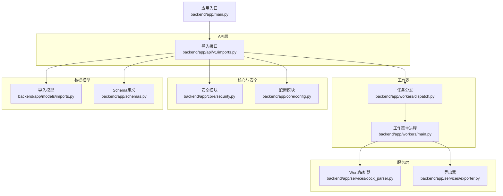
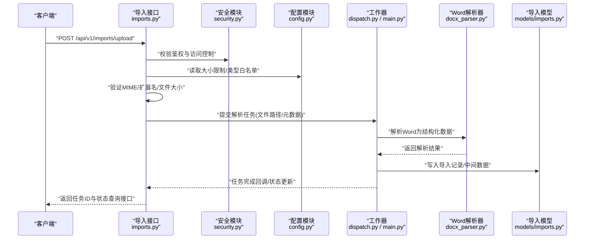
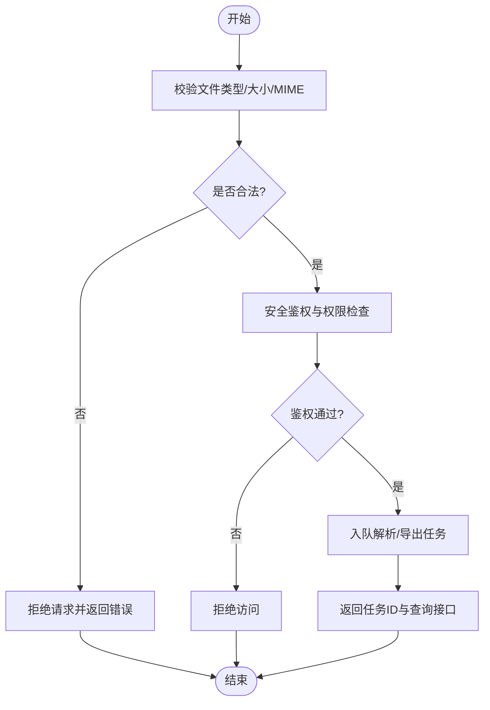
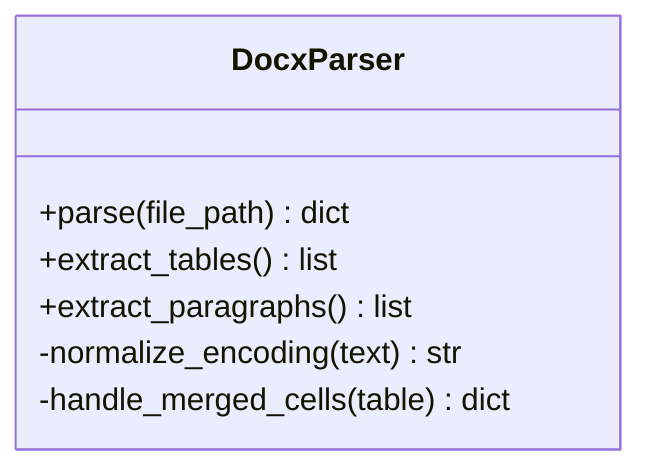
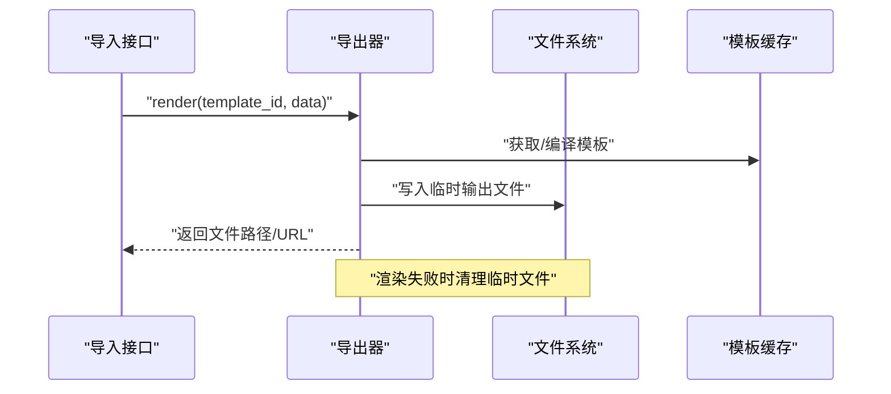
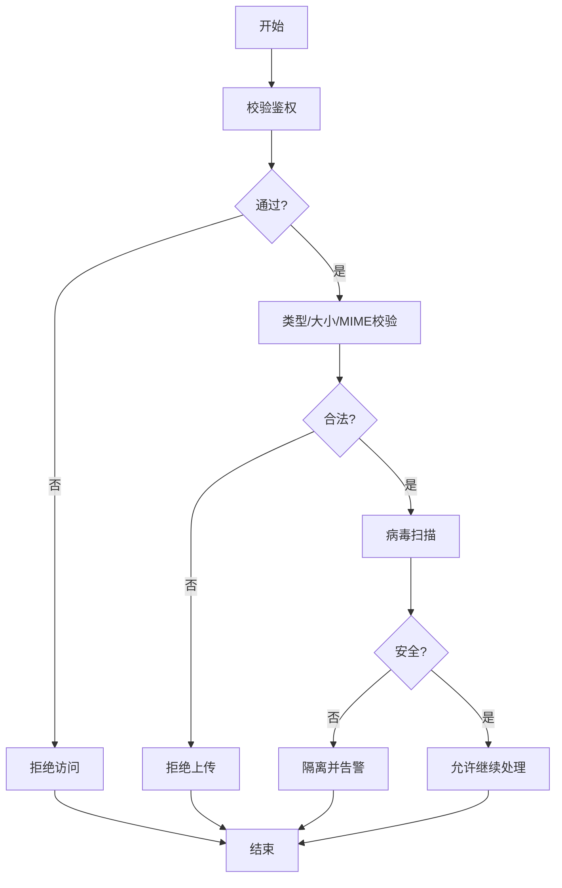
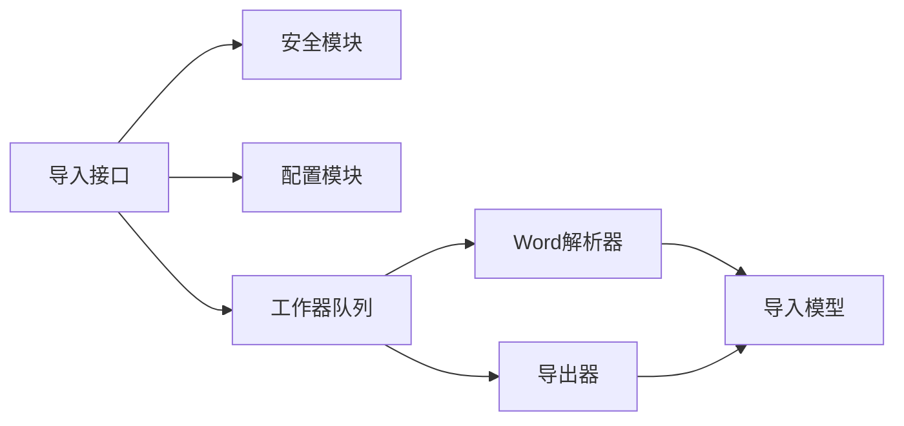

# 文件处理管道

<cite>
**本文引用的文件**   
- [backend/app/api/v1/imports.py](file://backend/app/api/v1/imports.py)
- [backend/app/services/docx_parser.py](file://backend/app/services/docx_parser.py)
- [backend/app/services/exporter.py](file://backend/app/services/exporter.py)
- [backend/app/core/security.py](file://backend/app/core/security.py)
- [backend/app/core/config.py](file://backend/app/core/config.py)
- [backend/app/models/imports.py](file://backend/app/models/imports.py)
- [backend/app/schemas.py](file://backend/app/schemas.py)
- [backend/app/main.py](file://backend/app/main.py)
- [backend/app/workers/dispatch.py](file://backend/app/workers/dispatch.py)
- [backend/app/workers/main.py](file://backend/app/workers/main.py)
</cite>

## 目录
1. [简介](#简介)
2. [项目结构](#项目结构)
3. [核心组件](#核心组件)
4. [架构总览](#架构总览)
5. [详细组件分析](#详细组件分析)
6. [依赖关系分析](#依赖关系分析)
7. [性能考量](#性能考量)
8. [故障排查指南](#故障排查指南)
9. [结论](#结论)
10. [附录](#附录)

## 简介
本文件面向Talos系统的“文件处理管道”，聚焦Excel与Word文档的导入解析、模板渲染与导出、上传下载安全机制（病毒扫描、大小限制、类型校验）、缓存策略与临时文件管理。文档通过架构图、序列图与流程图，帮助读者快速理解从前端请求到后端处理的完整链路，并提供错误处理策略与最佳实践建议。

## 项目结构
Talos后端采用FastAPI应用组织，文件处理相关能力分布在API层、服务层、模型与配置中：
- API层：导入接口定义与参数校验
- 服务层：Word解析、导出器、计划与报告构建等
- 工作器：异步任务分发与执行
- 安全与配置：安全策略、系统配置项
- 数据模型与Schema：导入记录、请求响应结构

**图表来源** 
- [backend/app/api/v1/imports.py](file://backend/app/api/v1/imports.py)
- [backend/app/services/docx_parser.py](file://backend/app/services/docx_parser.py)
- [backend/app/services/exporter.py](file://backend/app/services/exporter.py)
- [backend/app/workers/dispatch.py](file://backend/app/workers/dispatch.py)
- [backend/app/workers/main.py](file://backend/app/workers/main.py)
- [backend/app/core/security.py](file://backend/app/core/security.py)
- [backend/app/core/config.py](file://backend/app/core/config.py)
- [backend/app/models/imports.py](file://backend/app/models/imports.py)
- [backend/app/schemas.py](file://backend/app/schemas.py)
- [backend/app/main.py](file://backend/app/main.py)

**章节来源**
- [backend/app/main.py](file://backend/app/main.py)
- [backend/app/api/v1/imports.py](file://backend/app/api/v1/imports.py)

## 核心组件
- 导入接口：负责接收文件、校验格式与大小、触发解析或导出任务
- Word解析器：读取Word文档内容并转换为结构化数据
- 导出器：基于模板渲染生成目标文档（如Word/Excel）
- 安全模块：提供上传鉴权、类型白名单、大小限制、病毒扫描集成点
- 配置模块：集中管理存储路径、超时、并发、扫描开关等
- 工作器：异步处理耗时任务（解析、导出），避免阻塞请求
- 数据模型与Schema：统一导入记录结构与请求响应契约

**章节来源**
- [backend/app/api/v1/imports.py](file://backend/app/api/v1/imports.py)
- [backend/app/services/docx_parser.py](file://backend/app/services/docx_parser.py)
- [backend/app/services/exporter.py](file://backend/app/services/exporter.py)
- [backend/app/core/security.py](file://backend/app/core/security.py)
- [backend/app/core/config.py](file://backend/app/core/config.py)
- [backend/app/models/imports.py](file://backend/app/models/imports.py)
- [backend/app/schemas.py](file://backend/app/schemas.py)

## 架构总览
下图展示一次典型的“导入Word”请求在系统中的流转过程，包括安全校验、异步解析、结果持久化与状态反馈。

**图表来源** 
- [backend/app/api/v1/imports.py](file://backend/app/api/v1/imports.py)
- [backend/app/core/security.py](file://backend/app/core/security.py)
- [backend/app/core/config.py](file://backend/app/core/config.py)
- [backend/app/workers/dispatch.py](file://backend/app/workers/dispatch.py)
- [backend/app/workers/main.py](file://backend/app/workers/main.py)
- [backend/app/services/docx_parser.py](file://backend/app/services/docx_parser.py)
- [backend/app/models/imports.py](file://backend/app/models/imports.py)

## 详细组件分析

### 导入接口（uploads/imports）
- 职责
  - 接收文件上传，进行类型、大小、MIME校验
  - 调用安全模块进行鉴权与访问控制
  - 将解析/导出任务投递至工作器，返回任务ID供后续查询
- 关键流程
  - 参数校验：扩展名白名单、MIME类型、最大尺寸
  - 安全校验：鉴权、权限、防重放
  - 任务调度：异步解析或导出
  - 状态反馈：任务ID、进度、结果下载链接
- 错误处理
  - 非法类型/过大文件：立即拒绝并返回错误码
  - 解析失败：记录错误原因，支持重试或人工干预
  - 工作器异常：降级为同步失败提示，便于前端重试

**图表来源** 
- [backend/app/api/v1/imports.py](file://backend/app/api/v1/imports.py)
- [backend/app/core/security.py](file://backend/app/core/security.py)
- [backend/app/core/config.py](file://backend/app/core/config.py)

**章节来源**
- [backend/app/api/v1/imports.py](file://backend/app/api/v1/imports.py)
- [backend/app/core/security.py](file://backend/app/core/security.py)
- [backend/app/core/config.py](file://backend/app/core/config.py)

### Word解析器（docx_parser）
- 职责
  - 读取Word文档，提取段落、表格、图片等元素
  - 将非结构化内容转换为结构化数据（如JSON/对象列表）
  - 处理合并单元格、嵌套表格、页眉页脚等复杂结构
- 数据结构与复杂度
  - 表格遍历：O(R*C)，R为行数，C为列数
  - 文本抽取：线性扫描段落与运行节点
- 优化点
  - 流式读取大文档，降低内存峰值
  - 并行处理多个表格块
  - 缓存已解析的样式映射，减少重复计算
- 错误处理
  - 损坏文件：捕获异常并返回明确错误码
  - 空表/缺失字段：使用默认值或标记缺失
  - 编码问题：统一转UTF-8并记录警告

**图表来源** 
- [backend/app/services/docx_parser.py](file://backend/app/services/docx_parser.py)

**章节来源**
- [backend/app/services/docx_parser.py](file://backend/app/services/docx_parser.py)

### 导出器（exporter）
- 职责
  - 基于模板渲染生成Word/Excel文档
  - 填充数据、应用样式、插入图表/图片
  - 输出二进制流或落盘文件
- 模板与数据
  - 模板变量映射：字段名到占位符
  - 数据校验：必填字段、数据类型、范围约束
- 性能与稳定性
  - 分块渲染大文档，避免OOM
  - 模板缓存与编译缓存
  - 失败回滚与原子替换输出文件
- 错误处理
  - 模板缺失/变量未绑定：抛出可恢复错误
  - 渲染失败：记录上下文，支持重试

**图表来源** 
- [backend/app/services/exporter.py](file://backend/app/services/exporter.py)

**章节来源**
- [backend/app/services/exporter.py](file://backend/app/services/exporter.py)

### 安全模块（security）
- 职责
  - 鉴权与授权：令牌校验、角色权限
  - 上传安全：类型白名单、MIME校验、大小限制
  - 病毒扫描：集成外部扫描服务或本地引擎
- 策略要点
  - 最小权限原则：仅允许必要操作
  - 输入净化：文件名清洗、路径穿越防护
  - 扫描失败策略：隔离可疑文件并告警
- 错误处理
  - 鉴权失败：返回401/403
  - 扫描失败：拒绝上传并提示管理员介入

**图表来源** 
- [backend/app/core/security.py](file://backend/app/core/security.py)

**章节来源**
- [backend/app/core/security.py](file://backend/app/core/security.py)

### 配置模块（config）
- 职责
  - 集中管理文件处理相关配置：存储路径、大小限制、并发度、扫描开关、超时时间
  - 提供运行时可覆盖的环境变量或配置文件
- 关键点
  - 默认值与校验：确保配置有效性
  - 动态加载：支持热更新（如需要）
- 错误处理
  - 配置缺失：启动时报错并退出
  - 类型不匹配：转换失败时给出清晰提示

**章节来源**
- [backend/app/core/config.py](file://backend/app/core/config.py)

### 数据模型与Schema（models/imports.py, schemas.py）
- 导入模型
  - 记录导入任务ID、原始文件名、状态、错误信息、结果文件路径
  - 关联用户、创建时间、更新时间
- Schema
  - 定义上传请求体、响应体、任务状态枚举
  - 用于API参数校验与文档生成

**章节来源**
- [backend/app/models/imports.py](file://backend/app/models/imports.py)
- [backend/app/schemas.py](file://backend/app/schemas.py)

### 工作器（workers/dispatch.py, workers/main.py）
- 职责
  - 任务分发：将解析/导出任务路由到具体处理器
  - 工作器主进程：维护队列、监控健康、重启策略
- 设计要点
  - 幂等性：同一任务多次投递不会重复处理
  - 重试与退避：失败自动重试，指数退避
  - 资源隔离：每个任务独立环境，防止互相影响
- 错误处理
  - 任务失败：记录堆栈、通知管理员
  - 队列积压：扩容工作器实例

**章节来源**
- [backend/app/workers/dispatch.py](file://backend/app/workers/dispatch.py)
- [backend/app/workers/main.py](file://backend/app/workers/main.py)

## 依赖关系分析
- 耦合关系
  - API层依赖安全与配置，低耦合于解析与导出实现
  - 工作器解耦API，通过消息队列或进程间通信协作
  - 解析器与导出器各自独立，便于单元测试与替换
- 外部依赖
  - 病毒扫描服务（可选）
  - 模板引擎（如Jinja2/自定义）
  - 文档库（如python-docx/openpyxl）
- 潜在循环依赖
  - 通过分层与接口抽象避免循环引用

**图表来源** 
- [backend/app/api/v1/imports.py](file://backend/app/api/v1/imports.py)
- [backend/app/core/security.py](file://backend/app/core/security.py)
- [backend/app/core/config.py](file://backend/app/core/config.py)
- [backend/app/workers/dispatch.py](file://backend/app/workers/dispatch.py)
- [backend/app/services/docx_parser.py](file://backend/app/services/docx_parser.py)
- [backend/app/services/exporter.py](file://backend/app/services/exporter.py)
- [backend/app/models/imports.py](file://backend/app/models/imports.py)

**章节来源**
- [backend/app/api/v1/imports.py](file://backend/app/api/v1/imports.py)
- [backend/app/workers/dispatch.py](file://backend/app/workers/dispatch.py)

## 性能考量
- 解析性能
  - 流式读取大Word文档，避免一次性加载
  - 表格解析并行化，利用多核CPU
  - 预编译模板与样式映射，减少重复开销
- 导出性能
  - 分块渲染，控制内存峰值
  - 输出文件原子写入，避免部分写入导致的不一致
- 缓存策略
  - 模板编译缓存、样式映射缓存
  - 解析结果短期缓存（按任务ID），提高重复查询效率
- 存储优化
  - 临时文件及时清理，设置过期策略
  - 归档历史导入结果，冷数据迁移到低成本存储

[本节为通用指导，无需特定文件来源]

## 故障排查指南
- 常见问题
  - 上传失败：检查类型白名单、大小限制、MIME校验
  - 解析失败：查看解析器日志，确认文档结构是否符合预期
  - 导出失败：核对模板变量绑定、数据完整性
  - 病毒扫描拦截：隔离文件并联系安全团队复核
- 定位方法
  - 启用详细日志：记录请求ID、文件哈希、处理阶段
  - 监控指标：队列长度、处理时长、失败率
  - 健康检查：工作器存活、磁盘空间、外部服务连通性
- 恢复策略
  - 重试机制：对瞬时失败自动重试
  - 人工干预：提供后台工具重新处理失败任务
  - 降级方案：关闭扫描或解析功能，保障核心流程可用

**章节来源**
- [backend/app/core/security.py](file://backend/app/core/security.py)
- [backend/app/services/docx_parser.py](file://backend/app/services/docx_parser.py)
- [backend/app/services/exporter.py](file://backend/app/services/exporter.py)

## 结论
Talos的文件处理管道以清晰的层次划分与异步任务驱动为核心，实现了安全的文件导入、可靠的解析与高效的导出。通过严格的安全校验、完善的错误处理与灵活的缓存策略，系统在可扩展性与稳定性方面具备良好基础。建议在生产环境中持续监控关键指标，并结合业务需求优化解析与导出的性能。

[本节为总结性内容，无需特定文件来源]

## 附录
- 文件操作示例（路径参考）
  - 上传导入接口：[backend/app/api/v1/imports.py](file://backend/app/api/v1/imports.py)
  - Word解析实现：[backend/app/services/docx_parser.py](file://backend/app/services/docx_parser.py)
  - 模板导出实现：[backend/app/services/exporter.py](file://backend/app/services/exporter.py)
  - 安全策略配置：[backend/app/core/security.py](file://backend/app/core/security.py)
  - 系统配置项：[backend/app/core/config.py](file://backend/app/core/config.py)
  - 导入数据模型：[backend/app/models/imports.py](file://backend/app/models/imports.py)
  - 请求响应Schema：[backend/app/schemas.py](file://backend/app/schemas.py)
  - 工作器调度：[backend/app/workers/dispatch.py](file://backend/app/workers/dispatch.py), [backend/app/workers/main.py](file://backend/app/workers/main.py)

[本节为索引性内容，无需特定文件来源]