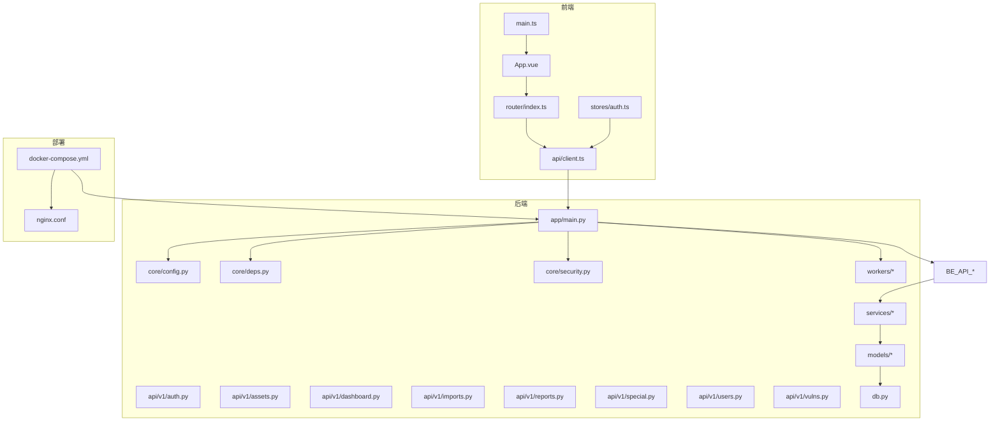
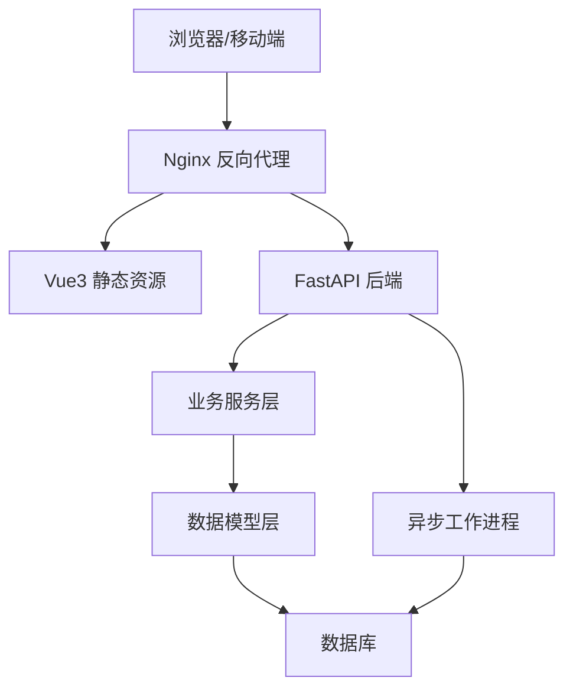
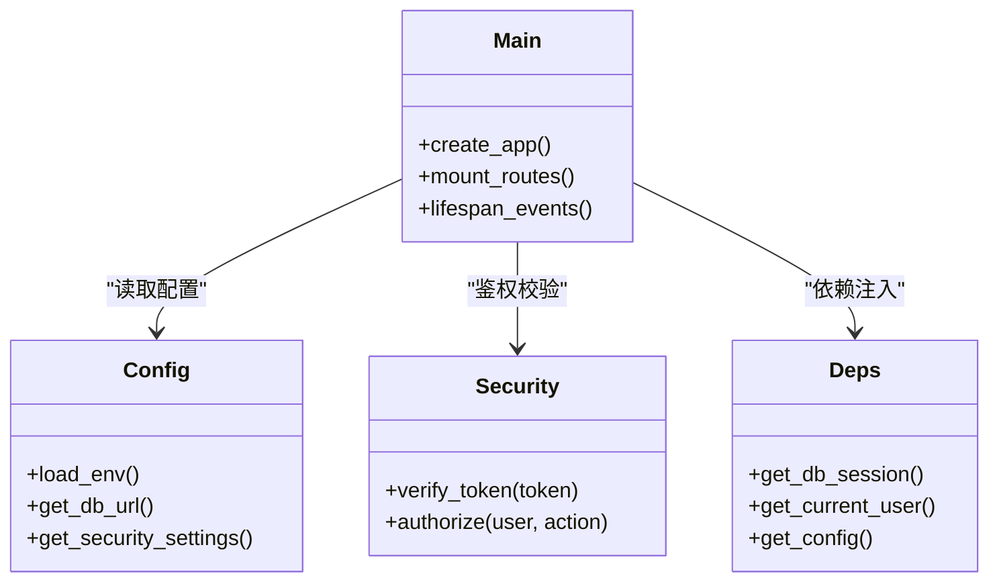
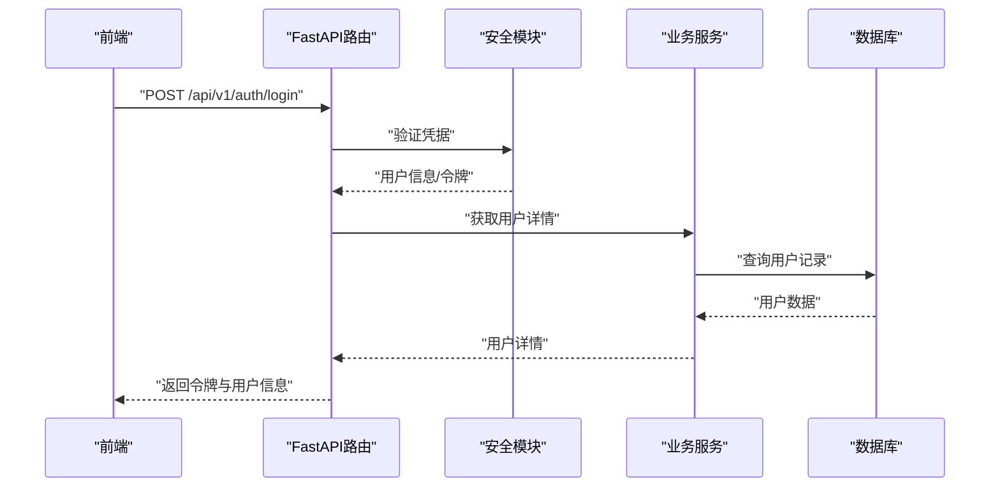
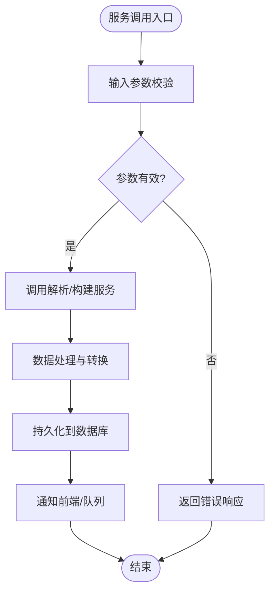
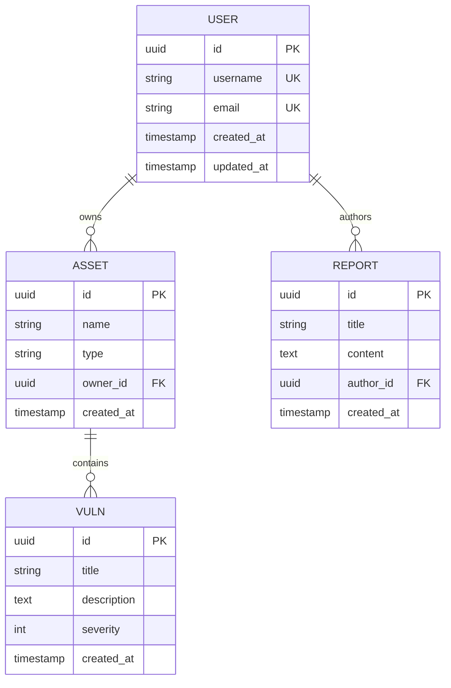
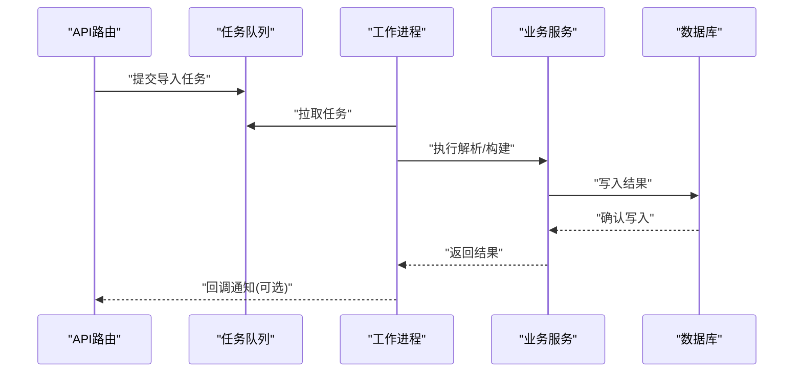
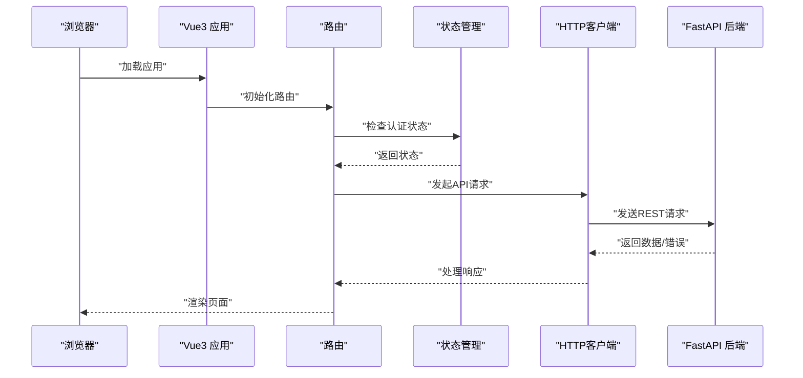
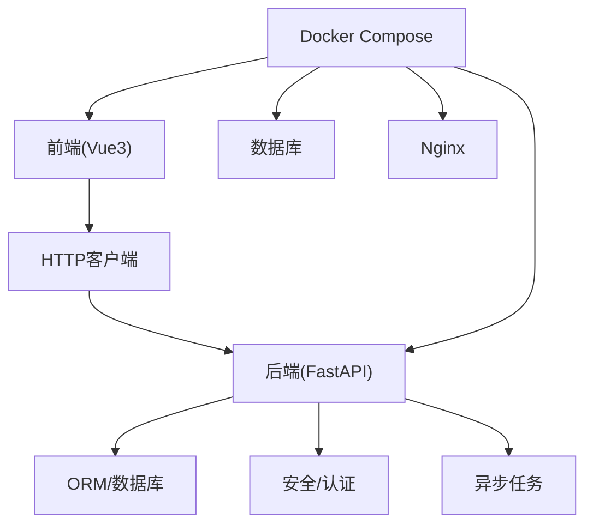

# 整体架构设计

<cite>
**本文引用的文件**   
- [backend/app/main.py](file://backend/app/main.py)
- [backend/app/core/config.py](file://backend/app/core/config.py)
- [backend/app/core/deps.py](file://backend/app/core/deps.py)
- [backend/app/core/security.py](file://backend/app/core/security.py)
- [backend/app/api/v1/auth.py](file://backend/app/api/v1/auth.py)
- [backend/app/api/v1/assets.py](file://backend/app/api/v1/assets.py)
- [backend/app/api/v1/dashboard.py](file://backend/app/api/v1/dashboard.py)
- [backend/app/api/v1/imports.py](file://backend/app/api/v1/imports.py)
- [backend/app/api/v1/reports.py](file://backend/app/api/v1/reports.py)
- [backend/app/api/v1/special.py](file://backend/app/api/v1/special.py)
- [backend/app/api/v1/users.py](file://backend/app/api/v1/users.py)
- [backend/app/api/v1/vulns.py](file://backend/app/api/v1/vulns.py)
- [backend/app/models/business.py](file://backend/app/models/business.py)
- [backend/app/models/imports.py](file://backend/app/models/imports.py)
- [backend/app/models/report.py](file://backend/app/models/report.py)
- [backend/app/models/special.py](file://backend/app/models/special.py)
- [backend/app/models/user.py](file://backend/app/models/user.py)
- [backend/app/services/docx_parser.py](file://backend/app/services/docx_parser.py)
- [backend/app/services/exporter.py](file://backend/app/services/exporter.py)
- [backend/app/services/plan_service.py](file://backend/app/services/plan_service.py)
- [backend/app/services/report_builder.py](file://backend/app/services/report_builder.py)
- [backend/app/services/vuln_service.py](file://backend/app/services/vuln_service.py)
- [backend/app/workers/dispatch.py](file://backend/app/workers/dispatch.py)
- [backend/app/workers/main.py](file://backend/app/workers/main.py)
- [backend/app/db.py](file://backend/app/db.py)
- [backend/Dockerfile](file://backend/Dockerfile)
- [frontend/src/main.ts](file://frontend/src/main.ts)
- [frontend/src/App.vue](file://frontend/src/App.vue)
- [frontend/src/router/index.ts](file://frontend/src/router/index.ts)
- [frontend/src/api/client.ts](file://frontend/src/api/client.ts)
- [frontend/src/stores/auth.ts](file://frontend/src/stores/auth.ts)
- [frontend/Dockerfile](file://frontend/Dockerfile)
- [frontend/nginx.conf](file://frontend/nginx.conf)
- [docker-compose.yml](file://docker-compose.yml)
</cite>

## 目录
1. [简介](#简介)
2. [项目结构](#项目结构)
3. [核心组件](#核心组件)
4. [架构总览](#架构总览)
5. [详细组件分析](#详细组件分析)
6. [依赖关系分析](#依赖关系分析)
7. [性能考虑](#性能考虑)
8. [故障排查指南](#故障排查指南)
9. [结论](#结论)
10. [附录](#附录)

## 简介
本文件面向Talos系统的整体架构设计，围绕前后端分离的架构模式展开，后端采用FastAPI构建RESTful API与异步任务处理，前端基于Vue3与TypeScript实现单页应用。文档重点阐述分层架构（表现层、业务逻辑层、数据访问层）的职责划分，微服务组件间的通信机制（REST与WebSocket），以及Docker容器化部署与服务编排策略。同时明确系统边界、外部依赖与集成点，并通过架构图展示组件依赖与数据流向。

## 项目结构
Talos采用前后端分离的工程组织方式：
- 后端（backend）：基于FastAPI的Python应用，包含API路由、领域模型、服务层、数据库配置、异步工作进程等。
- 前端（frontend）：基于Vue3与Vite的前端工程，提供用户界面、路由、状态管理与HTTP客户端封装。
- 部署（docker-compose.yml）：统一编排后端、前端、反向代理与数据库等容器。

图表来源
- [backend/app/main.py](file://backend/app/main.py)
- [backend/app/core/config.py](file://backend/app/core/config.py)
- [backend/app/core/deps.py](file://backend/app/core/deps.py)
- [backend/app/core/security.py](file://backend/app/core/security.py)
- [backend/app/api/v1/auth.py](file://backend/app/api/v1/auth.py)
- [backend/app/api/v1/assets.py](file://backend/app/api/v1/assets.py)
- [backend/app/api/v1/dashboard.py](file://backend/app/api/v1/dashboard.py)
- [backend/app/api/v1/imports.py](file://backend/app/api/v1/imports.py)
- [backend/app/api/v1/reports.py](file://backend/app/api/v1/reports.py)
- [backend/app/api/v1/special.py](file://backend/app/api/v1/special.py)
- [backend/app/api/v1/users.py](file://backend/app/api/v1/users.py)
- [backend/app/api/v1/vulns.py](file://backend/app/api/v1/vulns.py)
- [backend/app/models/business.py](file://backend/app/models/business.py)
- [backend/app/models/imports.py](file://backend/app/models/imports.py)
- [backend/app/models/report.py](file://backend/app/models/report.py)
- [backend/app/models/special.py](file://backend/app/models/special.py)
- [backend/app/models/user.py](file://backend/app/models/user.py)
- [backend/app/services/docx_parser.py](file://backend/app/services/docx_parser.py)
- [backend/app/services/exporter.py](file://backend/app/services/exporter.py)
- [backend/app/services/plan_service.py](file://backend/app/services/plan_service.py)
- [backend/app/services/report_builder.py](file://backend/app/services/report_builder.py)
- [backend/app/services/vuln_service.py](file://backend/app/services/vuln_service.py)
- [backend/app/workers/dispatch.py](file://backend/app/workers/dispatch.py)
- [backend/app/workers/main.py](file://backend/app/workers/main.py)
- [backend/app/db.py](file://backend/app/db.py)
- [frontend/src/main.ts](file://frontend/src/main.ts)
- [frontend/src/App.vue](file://frontend/src/App.vue)
- [frontend/src/router/index.ts](file://frontend/src/router/index.ts)
- [frontend/src/api/client.ts](file://frontend/src/api/client.ts)
- [frontend/src/stores/auth.ts](file://frontend/src/stores/auth.ts)
- [frontend/nginx.conf](file://frontend/nginx.conf)
- [docker-compose.yml](file://docker-compose.yml)

章节来源
- [backend/app/main.py](file://backend/app/main.py)
- [frontend/src/main.ts](file://frontend/src/main.ts)
- [docker-compose.yml](file://docker-compose.yml)

## 核心组件
- 后端入口与配置
  - FastAPI应用初始化、中间件注册、路由挂载与生命周期钩子由后端主模块负责；配置集中管理，安全策略与依赖注入在核心模块中定义。
- API路由层
  - 按领域划分的v1接口模块，包括认证、资产、仪表板、导入、报告、特殊功能、用户与漏洞管理等。
- 业务服务层
  - 将复杂业务逻辑从路由中解耦，如文档解析、报告生成、计划服务、漏洞服务等。
- 数据模型与访问
  - 领域模型定义实体结构与关系，数据库连接与ORM会话管理在独立模块中维护。
- 异步工作进程
  - 后台任务调度与执行，用于耗时操作（如导入解析、报告导出）。
- 前端应用
  - Vue3应用入口、路由、状态管理与HTTP客户端封装，通过REST调用后端API。

章节来源
- [backend/app/main.py](file://backend/app/main.py)
- [backend/app/core/config.py](file://backend/app/core/config.py)
- [backend/app/core/deps.py](file://backend/app/core/deps.py)
- [backend/app/core/security.py](file://backend/app/core/security.py)
- [backend/app/api/v1/auth.py](file://backend/app/api/v1/auth.py)
- [backend/app/api/v1/assets.py](file://backend/app/api/v1/assets.py)
- [backend/app/api/v1/dashboard.py](file://backend/app/api/v1/dashboard.py)
- [backend/app/api/v1/imports.py](file://backend/app/api/v1/imports.py)
- [backend/app/api/v1/reports.py](file://backend/app/api/v1/reports.py)
- [backend/app/api/v1/special.py](file://backend/app/api/v1/special.py)
- [backend/app/api/v1/users.py](file://backend/app/api/v1/users.py)
- [backend/app/api/v1/vulns.py](file://backend/app/api/v1/vulns.py)
- [backend/app/services/docx_parser.py](file://backend/app/services/docx_parser.py)
- [backend/app/services/exporter.py](file://backend/app/services/exporter.py)
- [backend/app/services/plan_service.py](file://backend/app/services/plan_service.py)
- [backend/app/services/report_builder.py](file://backend/app/services/report_builder.py)
- [backend/app/services/vuln_service.py](file://backend/app/services/vuln_service.py)
- [backend/app/models/business.py](file://backend/app/models/business.py)
- [backend/app/models/imports.py](file://backend/app/models/imports.py)
- [backend/app/models/report.py](file://backend/app/models/report.py)
- [backend/app/models/special.py](file://backend/app/models/special.py)
- [backend/app/models/user.py](file://backend/app/models/user.py)
- [backend/app/workers/dispatch.py](file://backend/app/workers/dispatch.py)
- [backend/app/workers/main.py](file://backend/app/workers/main.py)
- [backend/app/db.py](file://backend/app/db.py)
- [frontend/src/main.ts](file://frontend/src/main.ts)
- [frontend/src/router/index.ts](file://frontend/src/router/index.ts)
- [frontend/src/api/client.ts](file://frontend/src/api/client.ts)
- [frontend/src/stores/auth.ts](file://frontend/src/stores/auth.ts)

## 架构总览
Talos采用前后端分离的分层架构：
- 表现层（前端）：Vue3 + TypeScript，提供页面渲染、路由导航、状态管理与HTTP请求封装。
- 业务逻辑层（后端服务）：FastAPI路由接收请求，委托给服务层进行业务编排，服务层协调模型与外部工具。
- 数据访问层（后端模型与数据库）：ORM模型定义数据结构，数据库连接与会话管理确保数据一致性。
- 异步任务层（工作进程）：后台任务处理耗时操作，避免阻塞HTTP响应。
- 部署编排：Docker Compose统一编排后端、前端、Nginx与数据库等服务。

图表来源
- [frontend/src/main.ts](file://frontend/src/main.ts)
- [frontend/src/router/index.ts](file://frontend/src/router/index.ts)
- [frontend/src/api/client.ts](file://frontend/src/api/client.ts)
- [backend/app/main.py](file://backend/app/main.py)
- [backend/app/core/config.py](file://backend/app/core/config.py)
- [backend/app/core/deps.py](file://backend/app/core/deps.py)
- [backend/app/core/security.py](file://backend/app/core/security.py)
- [backend/app/api/v1/auth.py](file://backend/app/api/v1/auth.py)
- [backend/app/api/v1/assets.py](file://backend/app/api/v1/assets.py)
- [backend/app/api/v1/dashboard.py](file://backend/app/api/v1/dashboard.py)
- [backend/app/api/v1/imports.py](file://backend/app/api/v1/imports.py)
- [backend/app/api/v1/reports.py](file://backend/app/api/v1/reports.py)
- [backend/app/api/v1/special.py](file://backend/app/api/v1/special.py)
- [backend/app/api/v1/users.py](file://backend/app/api/v1/users.py)
- [backend/app/api/v1/vulns.py](file://backend/app/api/v1/vulns.py)
- [backend/app/services/docx_parser.py](file://backend/app/services/docx_parser.py)
- [backend/app/services/exporter.py](file://backend/app/services/exporter.py)
- [backend/app/services/plan_service.py](file://backend/app/services/plan_service.py)
- [backend/app/services/report_builder.py](file://backend/app/services/report_builder.py)
- [backend/app/services/vuln_service.py](file://backend/app/services/vuln_service.py)
- [backend/app/models/business.py](file://backend/app/models/business.py)
- [backend/app/models/imports.py](file://backend/app/models/imports.py)
- [backend/app/models/report.py](file://backend/app/models/report.py)
- [backend/app/models/special.py](file://backend/app/models/special.py)
- [backend/app/models/user.py](file://backend/app/models/user.py)
- [backend/app/workers/dispatch.py](file://backend/app/workers/dispatch.py)
- [backend/app/workers/main.py](file://backend/app/workers/main.py)
- [backend/app/db.py](file://backend/app/db.py)
- [frontend/nginx.conf](file://frontend/nginx.conf)
- [docker-compose.yml](file://docker-compose.yml)

## 详细组件分析

### 后端入口与依赖注入
- 应用启动与路由挂载：后端主模块负责创建FastAPI实例、注册中间件、挂载API路由并暴露健康检查与生命周期钩子。
- 配置与安全：配置模块集中管理环境变量与运行时参数；安全模块提供鉴权、令牌校验与权限控制。
- 依赖注入：核心依赖模块提供数据库会话、配置对象与安全上下文，供路由与服务层复用。

图表来源
- [backend/app/main.py](file://backend/app/main.py)
- [backend/app/core/config.py](file://backend/app/core/config.py)
- [backend/app/core/security.py](file://backend/app/core/security.py)
- [backend/app/core/deps.py](file://backend/app/core/deps.py)

章节来源
- [backend/app/main.py](file://backend/app/main.py)
- [backend/app/core/config.py](file://backend/app/core/config.py)
- [backend/app/core/deps.py](file://backend/app/core/deps.py)
- [backend/app/core/security.py](file://backend/app/core/security.py)

### API路由层与领域接口
- 认证接口：处理登录、令牌签发与刷新，结合安全模块完成身份验证。
- 资产管理接口：提供资产的增删改查与批量操作。
- 仪表板接口：聚合统计信息，返回前端所需的数据视图。
- 导入接口：支持文件上传与解析，触发异步任务处理。
- 报告接口：报告模板管理、内容编辑与导出。
- 特殊功能接口：扩展能力，如自定义规则或第三方集成。
- 用户管理接口：用户CRUD与角色权限管理。
- 漏洞管理接口：漏洞条目维护与关联资产。

图表来源
- [backend/app/api/v1/auth.py](file://backend/app/api/v1/auth.py)
- [backend/app/core/security.py](file://backend/app/core/security.py)
- [backend/app/models/user.py](file://backend/app/models/user.py)
- [backend/app/db.py](file://backend/app/db.py)

章节来源
- [backend/app/api/v1/auth.py](file://backend/app/api/v1/auth.py)
- [backend/app/api/v1/assets.py](file://backend/app/api/v1/assets.py)
- [backend/app/api/v1/dashboard.py](file://backend/app/api/v1/dashboard.py)
- [backend/app/api/v1/imports.py](file://backend/app/api/v1/imports.py)
- [backend/app/api/v1/reports.py](file://backend/app/api/v1/reports.py)
- [backend/app/api/v1/special.py](file://backend/app/api/v1/special.py)
- [backend/app/api/v1/users.py](file://backend/app/api/v1/users.py)
- [backend/app/api/v1/vulns.py](file://backend/app/api/v1/vulns.py)

### 业务服务层
- 文档解析服务：解析Word文档，提取结构化数据供导入流程使用。
- 报告构建服务：组装报告模板与内容，生成可导出的报告文件。
- 计划服务：管理测试计划与任务编排。
- 漏洞服务：维护漏洞条目与关联关系，提供查询与更新能力。
- 导出服务：将数据导出为多种格式，支持异步任务。

图表来源
- [backend/app/services/docx_parser.py](file://backend/app/services/docx_parser.py)
- [backend/app/services/report_builder.py](file://backend/app/services/report_builder.py)
- [backend/app/services/plan_service.py](file://backend/app/services/plan_service.py)
- [backend/app/services/vuln_service.py](file://backend/app/services/vuln_service.py)
- [backend/app/services/exporter.py](file://backend/app/services/exporter.py)

章节来源
- [backend/app/services/docx_parser.py](file://backend/app/services/docx_parser.py)
- [backend/app/services/report_builder.py](file://backend/app/services/report_builder.py)
- [backend/app/services/plan_service.py](file://backend/app/services/plan_service.py)
- [backend/app/services/vuln_service.py](file://backend/app/services/vuln_service.py)
- [backend/app/services/exporter.py](file://backend/app/services/exporter.py)

### 数据模型与数据访问层
- 领域模型：定义用户、资产、报告、导入、漏洞等业务实体的属性与关系。
- 数据库连接：统一管理数据库连接池、会话生命周期与事务边界。
- ORM映射：模型与表结构映射，支持查询、更新与关联操作。

图表来源
- [backend/app/models/user.py](file://backend/app/models/user.py)
- [backend/app/models/business.py](file://backend/app/models/business.py)
- [backend/app/models/report.py](file://backend/app/models/report.py)
- [backend/app/models/imports.py](file://backend/app/models/imports.py)
- [backend/app/models/special.py](file://backend/app/models/special.py)
- [backend/app/db.py](file://backend/app/db.py)

章节来源
- [backend/app/models/user.py](file://backend/app/models/user.py)
- [backend/app/models/business.py](file://backend/app/models/business.py)
- [backend/app/models/report.py](file://backend/app/models/report.py)
- [backend/app/models/imports.py](file://backend/app/models/imports.py)
- [backend/app/models/special.py](file://backend/app/models/special.py)
- [backend/app/db.py](file://backend/app/db.py)

### 异步工作进程
- 任务调度：工作进程主模块负责任务队列监听与分发。
- 任务执行：根据任务类型调用相应服务进行处理，完成后更新状态并通知前端。

图表来源
- [backend/app/workers/main.py](file://backend/app/workers/main.py)
- [backend/app/workers/dispatch.py](file://backend/app/workers/dispatch.py)
- [backend/app/services/docx_parser.py](file://backend/app/services/docx_parser.py)
- [backend/app/services/exporter.py](file://backend/app/services/exporter.py)
- [backend/app/db.py](file://backend/app/db.py)

章节来源
- [backend/app/workers/main.py](file://backend/app/workers/main.py)
- [backend/app/workers/dispatch.py](file://backend/app/workers/dispatch.py)

### 前端应用与HTTP客户端
- 应用入口：初始化Vue应用、插件与全局样式。
- 路由管理：定义页面路由与导航守卫，保护需要认证的页面。
- HTTP客户端：封装请求拦截器、错误处理与重试策略。
- 状态管理：认证状态与用户信息存储，配合路由守卫实现权限控制。

图表来源
- [frontend/src/main.ts](file://frontend/src/main.ts)
- [frontend/src/router/index.ts](file://frontend/src/router/index.ts)
- [frontend/src/api/client.ts](file://frontend/src/api/client.ts)
- [frontend/src/stores/auth.ts](file://frontend/src/stores/auth.ts)
- [backend/app/api/v1/auth.py](file://backend/app/api/v1/auth.py)

章节来源
- [frontend/src/main.ts](file://frontend/src/main.ts)
- [frontend/src/router/index.ts](file://frontend/src/router/index.ts)
- [frontend/src/api/client.ts](file://frontend/src/api/client.ts)
- [frontend/src/stores/auth.ts](file://frontend/src/stores/auth.ts)

## 依赖关系分析
- 前端依赖：Vue3生态（路由、状态管理、构建工具）、HTTP客户端库。
- 后端依赖：FastAPI框架、ORM与数据库驱动、安全与认证库、异步任务库。
- 部署依赖：Docker与Compose、Nginx反向代理、数据库服务。

图表来源
- [frontend/src/main.ts](file://frontend/src/main.ts)
- [frontend/src/api/client.ts](file://frontend/src/api/client.ts)
- [backend/app/main.py](file://backend/app/main.py)
- [backend/app/core/security.py](file://backend/app/core/security.py)
- [backend/app/workers/main.py](file://backend/app/workers/main.py)
- [backend/app/db.py](file://backend/app/db.py)
- [docker-compose.yml](file://docker-compose.yml)
- [frontend/nginx.conf](file://frontend/nginx.conf)

章节来源
- [docker-compose.yml](file://docker-compose.yml)
- [frontend/nginx.conf](file://frontend/nginx.conf)
- [backend/app/main.py](file://backend/app/main.py)
- [frontend/src/api/client.ts](file://frontend/src/api/client.ts)

## 性能考虑
- 异步处理：后端使用FastAPI的异步特性提升并发处理能力；耗时操作通过工作进程异步执行，避免阻塞请求。
- 缓存策略：对热点数据引入缓存层（如Redis）减少数据库压力。
- 数据库优化：合理索引与查询优化，避免N+1问题；分页与限流保护系统稳定性。
- 前端优化：代码分割、懒加载与静态资源压缩，提升首屏加载速度。
- 容器化：通过Docker限制资源使用，结合编排工具进行水平扩展与负载均衡。

[本节为通用指导，不直接分析具体文件]

## 故障排查指南
- 认证失败：检查安全模块的令牌校验逻辑与前端请求头是否正确携带令牌。
- 数据库连接异常：确认数据库连接字符串、网络连通性与权限设置。
- 异步任务失败：检查工作进程日志与任务队列状态，定位服务层错误。
- 前端请求错误：查看HTTP客户端的错误处理与重试策略，确认后端接口返回码与消息。

章节来源
- [backend/app/core/security.py](file://backend/app/core/security.py)
- [backend/app/db.py](file://backend/app/db.py)
- [backend/app/workers/main.py](file://backend/app/workers/main.py)
- [frontend/src/api/client.ts](file://frontend/src/api/client.ts)

## 结论
Talos系统通过前后端分离与分层架构实现了清晰的职责划分与良好的可扩展性。FastAPI与Vue3的技术选型提升了开发效率与运行性能；RESTful API与工作进程异步任务保障了系统的稳定与高效；Docker容器化与Compose编排简化了部署与维护。未来可在缓存、监控与灰度发布等方面进一步增强系统能力。

[本节为总结性内容，不直接分析具体文件]

## 附录
- 技术选型原因
  - FastAPI：高性能、异步原生、自动文档生成，适合构建现代REST API。
  - Vue3：响应式数据绑定、组合式API与生态完善，适合构建交互式单页应用。
  - Docker与Compose：标准化环境、快速部署与弹性扩展，降低运维复杂度。
- WebSocket实时通信
  - 当前系统以REST为主，如需实时推送可在后端引入WebSocket服务，前端通过事件订阅实现实时更新。

[本节为概念性内容，不直接分析具体文件]