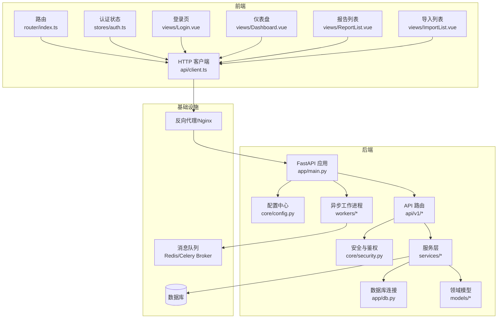
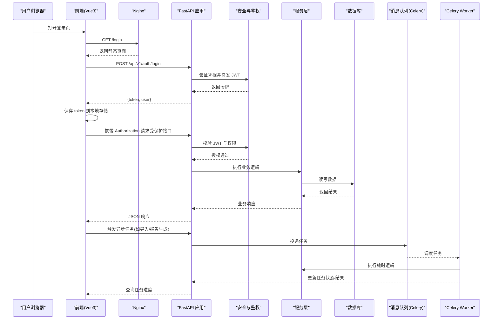
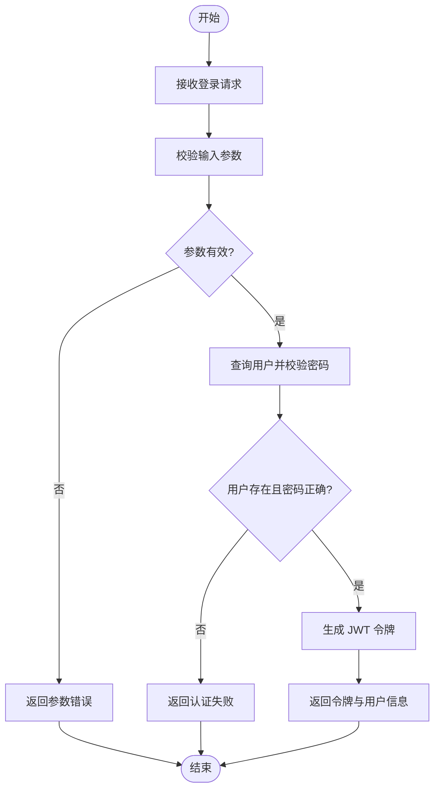
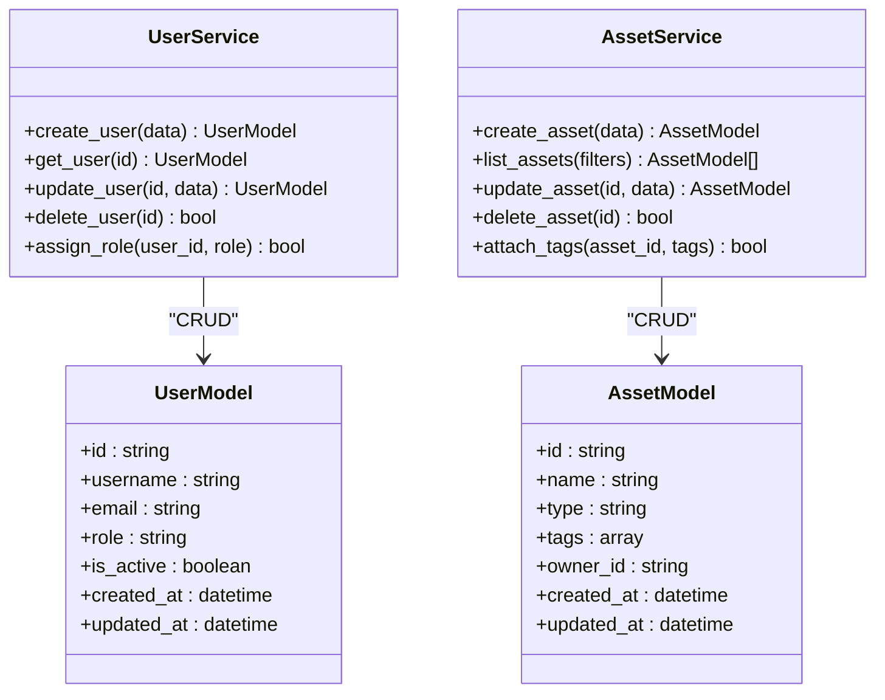
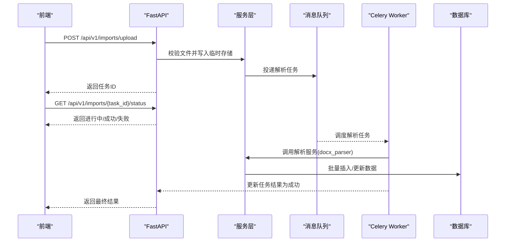
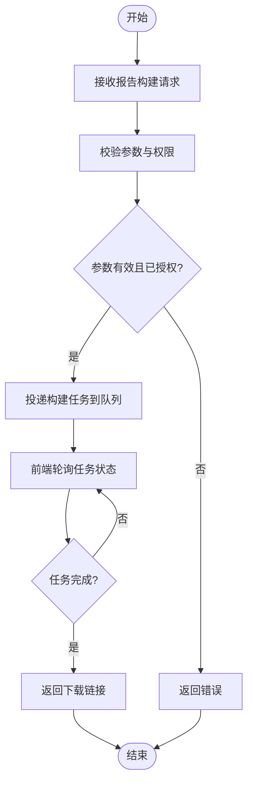
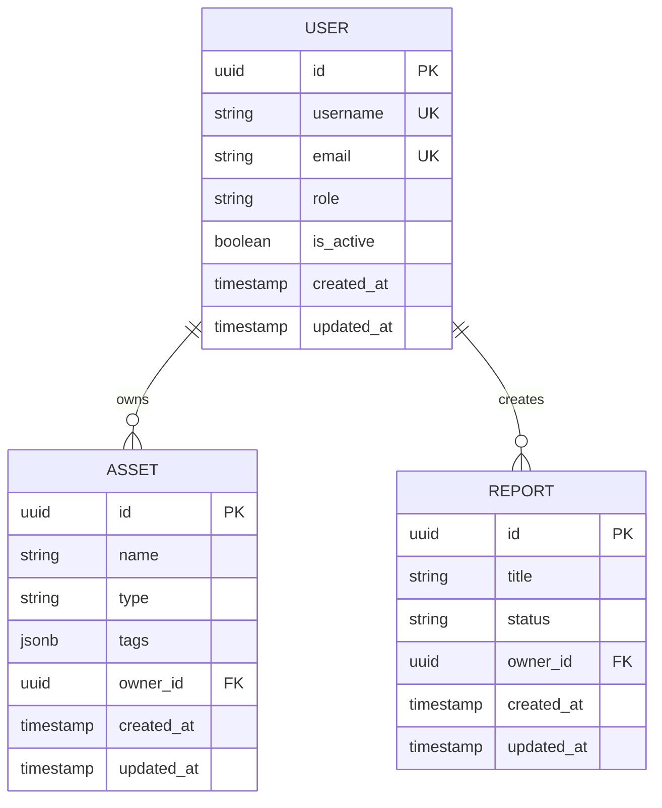
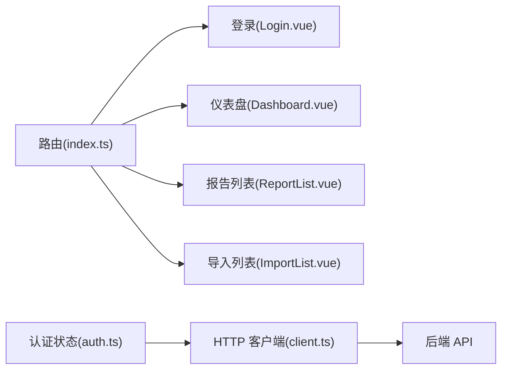
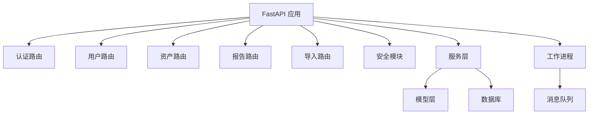
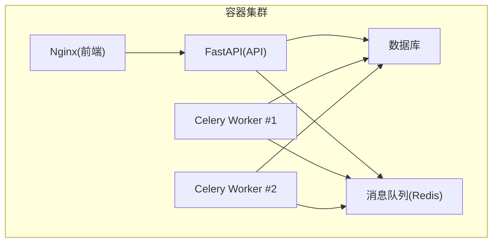

# 系统架构

<cite>
**本文引用的文件**   
- [backend/app/main.py](file://backend/app/main.py)
- [backend/app/core/config.py](file://backend/app/core/config.py)
- [backend/app/core/security.py](file://backend/app/core/security.py)
- [backend/app/api/v1/auth.py](file://backend/app/api/v1/auth.py)
- [backend/app/api/v1/users.py](file://backend/app/api/v1/users.py)
- [backend/app/api/v1/assets.py](file://backend/app/api/v1/assets.py)
- [backend/app/api/v1/reports.py](file://backend/app/api/v1/reports.py)
- [backend/app/api/v1/imports.py](file://backend/app/api/v1/imports.py)
- [backend/app/db.py](file://backend/app/db.py)
- [backend/app/models/business.py](file://backend/app/models/business.py)
- [backend/app/models/user.py](file://backend/app/models/user.py)
- [backend/app/models/report.py](file://backend/app/models/report.py)
- [backend/app/services/docx_parser.py](file://backend/app/services/docx_parser.py)
- [backend/app/services/exporter.py](file://backend/app/services/exporter.py)
- [backend/app/services/report_builder.py](file://backend/app/services/report_builder.py)
- [backend/app/workers/dispatch.py](file://backend/app/workers/dispatch.py)
- [backend/app/workers/main.py](file://backend/app/workers/main.py)
- [frontend/src/router/index.ts](file://frontend/src/router/index.ts)
- [frontend/src/stores/auth.ts](file://frontend/src/stores/auth.ts)
- [frontend/src/api/client.ts](file://frontend/src/api/client.ts)
- [frontend/src/views/Login.vue](file://frontend/src/views/Login.vue)
- [frontend/src/views/Dashboard.vue](file://frontend/src/views/Dashboard.vue)
- [frontend/src/views/ReportList.vue](file://frontend/src/views/ReportList.vue)
- [frontend/src/views/ImportList.vue](file://frontend/src/views/ImportList.vue)
- [docker-compose.yml](file://docker-compose.yml)
</cite>

## 目录
1. [简介](#简介)
2. [项目结构](#项目结构)
3. [核心组件](#核心组件)
4. [架构总览](#架构总览)
5. [详细组件分析](#详细组件分析)
6. [依赖关系分析](#依赖关系分析)
7. [性能考量](#性能考量)
8. [故障排查指南](#故障排查指南)
9. [结论](#结论)
10. [附录](#附录)

## 简介
本文件为 Talos 系统的详细架构文档，面向前后端分离的 Web 应用与微服务化部署。后端基于 FastAPI，提供 RESTful API；前端基于 Vue3 + TypeScript，通过 HTTP 与后端交互。系统采用异步任务处理（Celery）以支撑导入、报告生成等耗时操作，并通过数据库持久化业务数据。安全方面采用 JWT 认证与权限控制，结合配置中心化管理敏感信息。整体设计强调可扩展性、可观测性与高可用。

## 项目结构
Talos 仓库包含后端、前端、编排与文档等模块：
- 后端（backend）：FastAPI 应用、API 路由、领域模型、服务层、工作进程、数据库迁移与测试。
- 前端（frontend）：Vue3 SPA、路由、状态管理、HTTP 客户端、页面视图与构建配置。
- 编排（docker-compose.yml）：容器化编排，统一启动 API、Worker、Nginx 等组件。
- 文档（docs）：发布说明与路线图。

图表来源
- [backend/app/main.py](file://backend/app/main.py)
- [backend/app/core/config.py](file://backend/app/core/config.py)
- [backend/app/core/security.py](file://backend/app/core/security.py)
- [backend/app/api/v1/auth.py](file://backend/app/api/v1/auth.py)
- [backend/app/api/v1/users.py](file://backend/app/api/v1/users.py)
- [backend/app/api/v1/assets.py](file://backend/app/api/v1/assets.py)
- [backend/app/api/v1/reports.py](file://backend/app/api/v1/reports.py)
- [backend/app/api/v1/imports.py](file://backend/app/api/v1/imports.py)
- [backend/app/db.py](file://backend/app/db.py)
- [backend/app/models/business.py](file://backend/app/models/business.py)
- [backend/app/models/user.py](file://backend/app/models/user.py)
- [backend/app/models/report.py](file://backend/app/models/report.py)
- [backend/app/services/docx_parser.py](file://backend/app/services/docx_parser.py)
- [backend/app/services/exporter.py](file://backend/app/services/exporter.py)
- [backend/app/services/report_builder.py](file://backend/app/services/report_builder.py)
- [backend/app/workers/dispatch.py](file://backend/app/workers/dispatch.py)
- [backend/app/workers/main.py](file://backend/app/workers/main.py)
- [frontend/src/router/index.ts](file://frontend/src/router/index.ts)
- [frontend/src/stores/auth.ts](file://frontend/src/stores/auth.ts)
- [frontend/src/api/client.ts](file://frontend/src/api/client.ts)
- [frontend/src/views/Login.vue](file://frontend/src/views/Login.vue)
- [frontend/src/views/Dashboard.vue](file://frontend/src/views/Dashboard.vue)
- [frontend/src/views/ReportList.vue](file://frontend/src/views/ReportList.vue)
- [frontend/src/views/ImportList.vue](file://frontend/src/views/ImportList.vue)
- [docker-compose.yml](file://docker-compose.yml)

章节来源
- [backend/app/main.py](file://backend/app/main.py)
- [frontend/src/router/index.ts](file://frontend/src/router/index.ts)
- [docker-compose.yml](file://docker-compose.yml)

## 核心组件
- 前端（Vue3 SPA）
  - 路由与页面：集中式路由定义，登录、仪表盘、报告与导入等页面。
  - 状态管理：认证状态存储，维护 Token 与用户信息。
  - HTTP 客户端：封装请求拦截器、错误处理与基础 URL。
- 后端（FastAPI）
  - 应用入口：注册中间件、路由、生命周期事件与全局配置。
  - 配置中心：环境变量与密钥管理，统一加载。
  - 安全与鉴权：JWT 签发与校验、密码哈希、权限装饰器。
  - API 路由：按领域划分（认证、用户、资产、报告、导入等）。
  - 服务层：解析、导出、报告构建等业务逻辑。
  - 数据访问：ORM 模型与数据库连接。
  - 异步工作进程：Celery Worker 与任务分发。
- 基础设施
  - 数据库：持久化业务数据。
  - 消息队列：Celery Broker 与结果后端（通常为 Redis）。
  - 反向代理：Nginx 静态资源与 HTTPS 终止。

章节来源
- [backend/app/core/config.py](file://backend/app/core/config.py)
- [backend/app/core/security.py](file://backend/app/core/security.py)
- [backend/app/api/v1/auth.py](file://backend/app/api/v1/auth.py)
- [backend/app/api/v1/users.py](file://backend/app/api/v1/users.py)
- [backend/app/api/v1/assets.py](file://backend/app/api/v1/assets.py)
- [backend/app/api/v1/reports.py](file://backend/app/api/v1/reports.py)
- [backend/app/api/v1/imports.py](file://backend/app/api/v1/imports.py)
- [backend/app/services/docx_parser.py](file://backend/app/services/docx_parser.py)
- [backend/app/services/exporter.py](file://backend/app/services/exporter.py)
- [backend/app/services/report_builder.py](file://backend/app/services/report_builder.py)
- [backend/app/workers/dispatch.py](file://backend/app/workers/dispatch.py)
- [backend/app/workers/main.py](file://backend/app/workers/main.py)
- [frontend/src/api/client.ts](file://frontend/src/api/client.ts)
- [frontend/src/stores/auth.ts](file://frontend/src/stores/auth.ts)

## 架构总览
Talos 采用前后端分离与微服务化部署：
- 前端通过 Nginx 暴露静态资源与反向代理到后端 API。
- 后端 FastAPI 作为 API 网关与业务聚合层，路由至各领域控制器与服务。
- 异步任务通过 Celery Worker 消费队列中的任务，避免阻塞主线程。
- 数据库与消息队列作为关键外部依赖，确保数据一致性与任务可靠性。

图表来源
- [backend/app/main.py](file://backend/app/main.py)
- [backend/app/core/security.py](file://backend/app/core/security.py)
- [backend/app/api/v1/auth.py](file://backend/app/api/v1/auth.py)
- [backend/app/api/v1/imports.py](file://backend/app/api/v1/imports.py)
- [backend/app/api/v1/reports.py](file://backend/app/api/v1/reports.py)
- [backend/app/workers/dispatch.py](file://backend/app/workers/dispatch.py)
- [backend/app/workers/main.py](file://backend/app/workers/main.py)
- [frontend/src/api/client.ts](file://frontend/src/api/client.ts)
- [frontend/src/stores/auth.ts](file://frontend/src/stores/auth.ts)
- [frontend/src/views/Login.vue](file://frontend/src/views/Login.vue)
- [frontend/src/views/ImportList.vue](file://frontend/src/views/ImportList.vue)
- [frontend/src/views/ReportList.vue](file://frontend/src/views/ReportList.vue)

## 详细组件分析

### 认证与授权流程（JWT）
- 登录：前端提交用户名与密码，后端校验并签发 JWT。
- 鉴权：后续请求携带 Authorization 头，后端校验签名、过期时间与角色权限。
- 权限控制：基于角色的访问控制（RBAC），在路由或装饰器中声明所需角色。

图表来源
- [backend/app/api/v1/auth.py](file://backend/app/api/v1/auth.py)
- [backend/app/core/security.py](file://backend/app/core/security.py)
- [frontend/src/views/Login.vue](file://frontend/src/views/Login.vue)
- [frontend/src/stores/auth.ts](file://frontend/src/stores/auth.ts)

章节来源
- [backend/app/api/v1/auth.py](file://backend/app/api/v1/auth.py)
- [backend/app/core/security.py](file://backend/app/core/security.py)
- [frontend/src/stores/auth.ts](file://frontend/src/stores/auth.ts)
- [frontend/src/views/Login.vue](file://frontend/src/views/Login.vue)

### 用户与资产管理（CRUD）
- 用户管理：创建、查询、更新、删除用户，支持角色分配与状态管理。
- 资产管理：资产登记、分类、标签、关联漏洞与报告。
- 数据模型：使用 ORM 定义实体与关系，保证数据完整性。

图表来源
- [backend/app/models/user.py](file://backend/app/models/user.py)
- [backend/app/models/business.py](file://backend/app/models/business.py)
- [backend/app/api/v1/users.py](file://backend/app/api/v1/users.py)
- [backend/app/api/v1/assets.py](file://backend/app/api/v1/assets.py)

章节来源
- [backend/app/models/user.py](file://backend/app/models/user.py)
- [backend/app/models/business.py](file://backend/app/models/business.py)
- [backend/app/api/v1/users.py](file://backend/app/api/v1/users.py)
- [backend/app/api/v1/assets.py](file://backend/app/api/v1/assets.py)

### 报告与导入（异步任务）
- 报告构建：根据模板与数据生成报告，支持多种格式导出。
- 导入处理：解析上传文件（如 Word），提取结构化数据入库。
- 异步机制：将耗时任务投递到队列，Worker 消费并更新状态，前端轮询进度。

图表来源
- [backend/app/api/v1/imports.py](file://backend/app/api/v1/imports.py)
- [backend/app/services/docx_parser.py](file://backend/app/services/docx_parser.py)
- [backend/app/workers/dispatch.py](file://backend/app/workers/dispatch.py)
- [backend/app/workers/main.py](file://backend/app/workers/main.py)
- [frontend/src/views/ImportList.vue](file://frontend/src/views/ImportList.vue)

章节来源
- [backend/app/api/v1/imports.py](file://backend/app/api/v1/imports.py)
- [backend/app/services/docx_parser.py](file://backend/app/services/docx_parser.py)
- [backend/app/workers/dispatch.py](file://backend/app/workers/dispatch.py)
- [backend/app/workers/main.py](file://backend/app/workers/main.py)
- [frontend/src/views/ImportList.vue](file://frontend/src/views/ImportList.vue)

### 报告生成（导出与构建）
- 报告构建：组合数据与模板，生成 PDF/Word 等格式。
- 导出服务：封装导出逻辑，支持并发与重试。
- 任务状态：记录生成进度与结果，供前端查询。

图表来源
- [backend/app/api/v1/reports.py](file://backend/app/api/v1/reports.py)
- [backend/app/services/report_builder.py](file://backend/app/services/report_builder.py)
- [backend/app/services/exporter.py](file://backend/app/services/exporter.py)
- [frontend/src/views/ReportList.vue](file://frontend/src/views/ReportList.vue)

章节来源
- [backend/app/api/v1/reports.py](file://backend/app/api/v1/reports.py)
- [backend/app/services/report_builder.py](file://backend/app/services/report_builder.py)
- [backend/app/services/exporter.py](file://backend/app/services/exporter.py)
- [frontend/src/views/ReportList.vue](file://frontend/src/views/ReportList.vue)

### 数据库与模型
- 连接管理：统一数据库连接与会话管理，支持连接池与事务。
- 模型定义：实体字段、关系与约束，确保数据一致性。
- 迁移管理：Alembic 版本化迁移，保障数据结构演进。

图表来源
- [backend/app/models/user.py](file://backend/app/models/user.py)
- [backend/app/models/business.py](file://backend/app/models/business.py)
- [backend/app/models/report.py](file://backend/app/models/report.py)
- [backend/app/db.py](file://backend/app/db.py)

章节来源
- [backend/app/db.py](file://backend/app/db.py)
- [backend/app/models/user.py](file://backend/app/models/user.py)
- [backend/app/models/business.py](file://backend/app/models/business.py)
- [backend/app/models/report.py](file://backend/app/models/report.py)

### 前端路由与状态管理
- 路由：集中式路由配置，按需加载页面组件。
- 状态：认证状态与用户信息存储在本地，随请求携带 Token。
- 页面：登录、仪表盘、报告与导入等页面实现用户交互。

图表来源
- [frontend/src/router/index.ts](file://frontend/src/router/index.ts)
- [frontend/src/stores/auth.ts](file://frontend/src/stores/auth.ts)
- [frontend/src/api/client.ts](file://frontend/src/api/client.ts)
- [frontend/src/views/Login.vue](file://frontend/src/views/Login.vue)
- [frontend/src/views/Dashboard.vue](file://frontend/src/views/Dashboard.vue)
- [frontend/src/views/ReportList.vue](file://frontend/src/views/ReportList.vue)
- [frontend/src/views/ImportList.vue](file://frontend/src/views/ImportList.vue)

章节来源
- [frontend/src/router/index.ts](file://frontend/src/router/index.ts)
- [frontend/src/stores/auth.ts](file://frontend/src/stores/auth.ts)
- [frontend/src/api/client.ts](file://frontend/src/api/client.ts)
- [frontend/src/views/Login.vue](file://frontend/src/views/Login.vue)
- [frontend/src/views/Dashboard.vue](file://frontend/src/views/Dashboard.vue)
- [frontend/src/views/ReportList.vue](file://frontend/src/views/ReportList.vue)
- [frontend/src/views/ImportList.vue](file://frontend/src/views/ImportList.vue)

## 依赖关系分析
- 组件耦合
  - API 路由依赖服务层与鉴权模块，低耦合高内聚。
  - 服务层依赖模型与数据库，屏蔽底层细节。
  - 工作进程独立于 API，通过消息队列解耦。
- 外部依赖
  - 数据库：持久化存储。
  - 消息队列：任务调度与结果存储。
  - Nginx：静态资源与反向代理。

图表来源
- [backend/app/main.py](file://backend/app/main.py)
- [backend/app/api/v1/auth.py](file://backend/app/api/v1/auth.py)
- [backend/app/api/v1/users.py](file://backend/app/api/v1/users.py)
- [backend/app/api/v1/assets.py](file://backend/app/api/v1/assets.py)
- [backend/app/api/v1/reports.py](file://backend/app/api/v1/reports.py)
- [backend/app/api/v1/imports.py](file://backend/app/api/v1/imports.py)
- [backend/app/core/security.py](file://backend/app/core/security.py)
- [backend/app/workers/dispatch.py](file://backend/app/workers/dispatch.py)
- [backend/app/workers/main.py](file://backend/app/workers/main.py)

章节来源
- [backend/app/main.py](file://backend/app/main.py)
- [backend/app/core/security.py](file://backend/app/core/security.py)
- [backend/app/workers/dispatch.py](file://backend/app/workers/dispatch.py)

## 性能考量
- 异步任务：将耗时操作（导入、报告生成）放入队列，避免阻塞请求线程。
- 连接池：数据库连接池减少握手开销，提升吞吐。
- 缓存策略：热点数据缓存（如用户信息、字典表）降低数据库压力。
- 限流与熔断：对高频接口实施限流，防止雪崩。
- 水平扩展：无状态 API 节点横向扩展，Worker 多实例并行消费。
- 监控与日志：结构化日志与指标采集，便于定位瓶颈。

[本节为通用指导，不直接分析具体文件]

## 故障排查指南
- 认证失败
  - 检查 JWT 签名与过期时间，确认客户端是否正确携带 Authorization 头。
  - 查看用户状态与角色是否匹配。
- 任务失败
  - 检查消息队列连通性与 Worker 状态。
  - 查看任务日志与异常堆栈，定位解析或服务层错误。
- 数据库问题
  - 检查连接池配置与慢查询，优化索引与 SQL。
  - 确认迁移版本与数据一致性。
- 前端错误
  - 检查网络请求与跨域配置，确认 Nginx 转发规则。
  - 查看本地存储中的 Token 是否有效。

章节来源
- [backend/app/core/security.py](file://backend/app/core/security.py)
- [backend/app/workers/dispatch.py](file://backend/app/workers/dispatch.py)
- [backend/app/db.py](file://backend/app/db.py)
- [frontend/src/api/client.ts](file://frontend/src/api/client.ts)

## 结论
Talos 系统通过前后端分离与微服务化设计，实现了清晰的职责划分与良好的扩展性。FastAPI 提供高性能 API，Vue3 前端提供流畅用户体验，Celery 异步任务支撑耗时操作，数据库与消息队列保障数据与任务可靠性。安全方面采用 JWT 与 RBAC，结合配置中心化管理敏感信息。整体架构具备高可用、易扩展与可观测性，适合持续演进与规模化部署。

[本节为总结，不直接分析具体文件]

## 附录
- 部署架构图（容器化）

图表来源
- [docker-compose.yml](file://docker-compose.yml)
- [backend/app/main.py](file://backend/app/main.py)
- [backend/app/workers/main.py](file://backend/app/workers/main.py)

章节来源
- [docker-compose.yml](file://docker-compose.yml)