# 部署架构

<cite>
**本文引用的文件**   
- [docker-compose.yml](file://docker-compose.yml)
- [backend/Dockerfile](file://backend/Dockerfile)
- [frontend/Dockerfile](file://frontend/Dockerfile)
- [frontend/nginx.conf](file://frontend/nginx.conf)
- [backend/app/main.py](file://backend/app/main.py)
- [backend/app/core/config.py](file://backend/app/core/config.py)
- [backend/app/db.py](file://backend/app/db.py)
- [backend/alembic.ini](file://backend/alembic.ini)
- [backend/requirements.txt](file://backend/requirements.txt)
- [frontend/package.json](file://frontend/package.json)
- [dev.sh](file://dev.sh)
- [dev.ps1](file://dev.ps1)
</cite>

## 目录
1. [简介](#简介)
2. [项目结构](#项目结构)
3. [核心组件](#核心组件)
4. [架构总览](#架构总览)
5. [详细组件分析](#详细组件分析)
6. [依赖关系分析](#依赖关系分析)
7. [性能考量](#性能考量)
8. [故障排查指南](#故障排查指南)
9. [结论](#结论)
10. [附录](#附录)

## 简介
本文件面向Talos系统的部署与运维，聚焦Docker容器化策略、多阶段构建与镜像优化、容器编排（docker-compose）、生产环境拓扑（负载均衡、反向代理、静态资源服务）、环境变量与配置中心策略、监控告警、备份恢复与灾难恢复、不同环境的部署清单与模板，以及CI/CD流水线设计与自动化部署流程。文档基于仓库中的Dockerfile、nginx配置、应用入口与数据库连接代码进行解读，并结合通用最佳实践给出可操作的部署建议。

## 项目结构
Talos采用前后端分离的模块化结构：
- 后端：Python FastAPI应用，包含API路由、数据模型、服务层、工作进程与迁移工具。
- 前端：Vue/Vite构建产物，使用Nginx作为静态资源服务器与反向代理。
- 编排：docker-compose统一编排开发/测试/预发环境；生产环境推荐Kubernetes或更高级编排平台。
- 基础设施：PostgreSQL、Redis等外部服务通过环境变量注入与应用解耦。

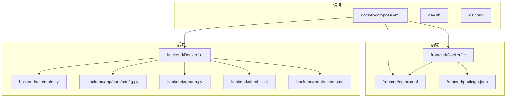

**图表来源** 
- [docker-compose.yml](file://docker-compose.yml)
- [backend/Dockerfile](file://backend/Dockerfile)
- [frontend/Dockerfile](file://frontend/Dockerfile)
- [frontend/nginx.conf](file://frontend/nginx.conf)
- [backend/app/main.py](file://backend/app/main.py)
- [backend/app/core/config.py](file://backend/app/core/config.py)
- [backend/app/db.py](file://backend/app/db.py)
- [backend/alembic.ini](file://backend/alembic.ini)
- [backend/requirements.txt](file://backend/requirements.txt)
- [frontend/package.json](file://frontend/package.json)
- [dev.sh](file://dev.sh)
- [dev.ps1](file://dev.ps1)

**章节来源**
- [docker-compose.yml](file://docker-compose.yml)
- [backend/Dockerfile](file://backend/Dockerfile)
- [frontend/Dockerfile](file://frontend/Dockerfile)
- [frontend/nginx.conf](file://frontend/nginx.conf)
- [backend/app/main.py](file://backend/app/main.py)
- [backend/app/core/config.py](file://backend/app/core/config.py)
- [backend/app/db.py](file://backend/app/db.py)
- [backend/alembic.ini](file://backend/alembic.ini)
- [backend/requirements.txt](file://backend/requirements.txt)
- [frontend/package.json](file://frontend/package.json)
- [dev.sh](file://dev.sh)
- [dev.ps1](file://dev.ps1)

## 核心组件
- 后端服务：FastAPI应用，提供REST API，依赖PostgreSQL与Redis，支持Alembic迁移与工作进程异步任务。
- 前端服务：Vite构建的静态资源，由Nginx托管并反向代理到后端API。
- 编排与脚本：docker-compose定义服务依赖、网络与卷；dev.sh/dev.ps1用于本地开发快速启动。

关键职责划分：
- 应用层：API路由、业务逻辑、数据访问、任务调度。
- 数据层：PostgreSQL持久化存储，Redis缓存与会话。
- 接入层：Nginx静态资源与反向代理，可选负载均衡器。
- 运维层：镜像构建、环境变量管理、监控与日志、备份恢复。

**章节来源**
- [backend/app/main.py](file://backend/app/main.py)
- [backend/app/core/config.py](file://backend/app/core/config.py)
- [backend/app/db.py](file://backend/app/db.py)
- [frontend/nginx.conf](file://frontend/nginx.conf)
- [docker-compose.yml](file://docker-compose.yml)

## 架构总览
下图展示从客户端到各服务的请求路径与依赖关系，包括反向代理、静态资源、后端API、数据库与缓存。

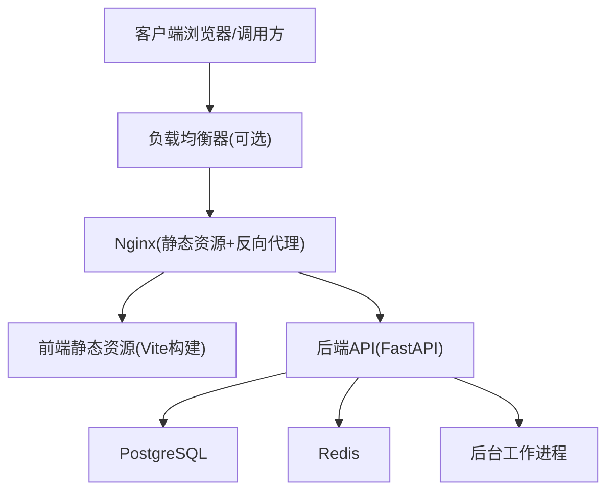

**图表来源** 
- [frontend/nginx.conf](file://frontend/nginx.conf)
- [backend/app/main.py](file://backend/app/main.py)
- [backend/app/db.py](file://backend/app/db.py)
- [docker-compose.yml](file://docker-compose.yml)

## 详细组件分析

### Docker镜像构建与优化（多阶段构建）
- 前端镜像：
  - 构建阶段：安装依赖、执行Vite构建生成静态资源。
  - 运行阶段：仅包含Nginx与构建产物，最小化镜像体积。
- 后端镜像：
  - 构建阶段：安装Python依赖，编译C扩展（如有）。
  - 运行阶段：仅包含运行时依赖与应用程序代码，避免携带构建工具链。
- 优化要点：
  - 分层缓存：将依赖安装与代码拷贝分离，提升构建速度。
  - 多阶段构建：减少最终镜像大小，降低攻击面。
  - 非root用户运行：增强安全性。
  - 健康检查：为关键服务添加健康检查探针。

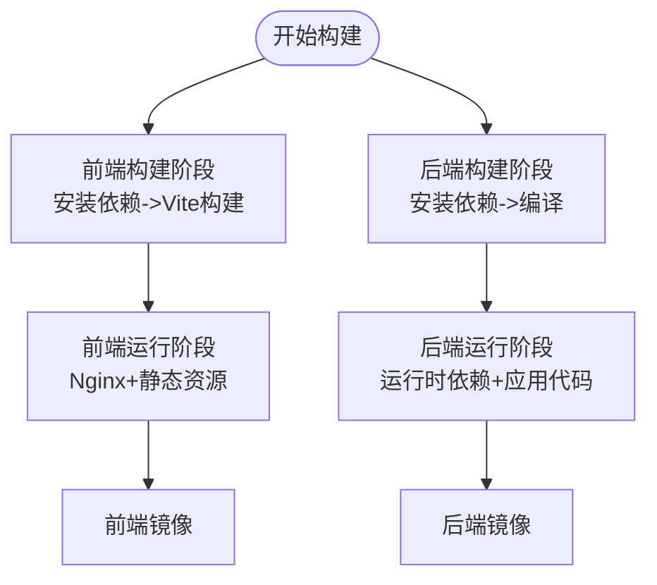

**图表来源** 
- [frontend/Dockerfile](file://frontend/Dockerfile)
- [backend/Dockerfile](file://backend/Dockerfile)

**章节来源**
- [frontend/Dockerfile](file://frontend/Dockerfile)
- [backend/Dockerfile](file://backend/Dockerfile)

### docker-compose服务编排与依赖关系
- 服务定义：
  - 前端：Nginx服务，挂载静态资源目录。
  - 后端：FastAPI服务，暴露API端口，依赖数据库与缓存。
  - 数据库：PostgreSQL，数据持久化到卷。
  - 缓存：Redis，用于会话与缓存。
  - 工作进程：异步任务处理，依赖消息队列或共享状态。
- 依赖关系：
  - 后端依赖数据库与缓存。
  - 前端依赖后端API。
  - 工作进程依赖后端提供的接口或消息通道。
- 网络与卷：
  - 自定义网络隔离服务间通信。
  - 数据卷保障数据库持久化。

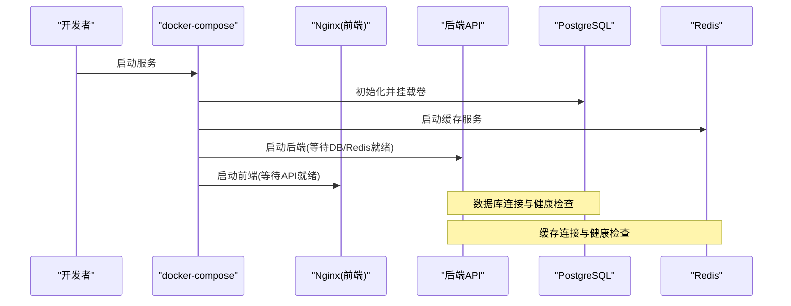

**图表来源** 
- [docker-compose.yml](file://docker-compose.yml)

**章节来源**
- [docker-compose.yml](file://docker-compose.yml)

### 反向代理与静态资源配置（Nginx）
- 静态资源：Nginx直接提供前端构建产物，提高加载性能。
- 反向代理：将API请求转发至后端服务，统一入口。
- 安全与性能：启用Gzip压缩、缓存控制、HTTPS终止（可选）。

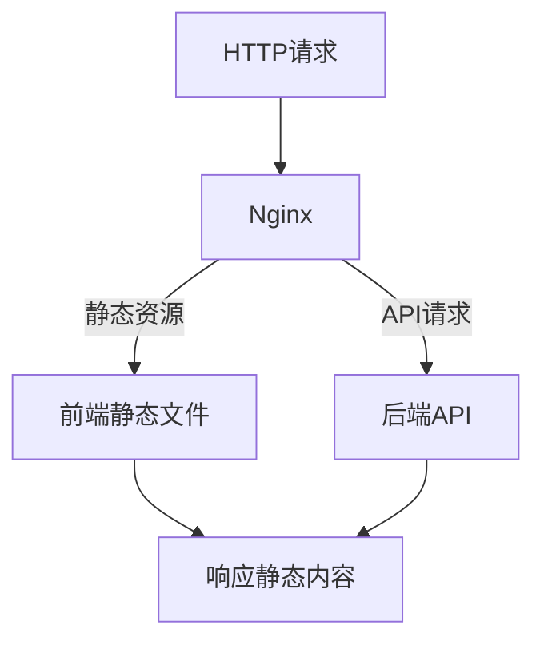

**图表来源** 
- [frontend/nginx.conf](file://frontend/nginx.conf)

**章节来源**
- [frontend/nginx.conf](file://frontend/nginx.conf)

### 环境变量管理与配置中心策略
- 环境变量：
  - 数据库连接串、Redis地址、JWT密钥、日志级别等通过环境变量注入。
  - 不同环境（开发、测试、预发、生产）使用独立的环境文件。
- 配置中心（建议）：
  - 引入集中式配置（如Consul、Etcd、Vault），实现动态配置更新与密钥管理。
  - 应用启动时拉取配置，支持热更新与版本回滚。
- 安全最佳实践：
  - 敏感信息不入库，使用密钥管理服务。
  - 限制环境变量可见范围，按服务最小权限分配。

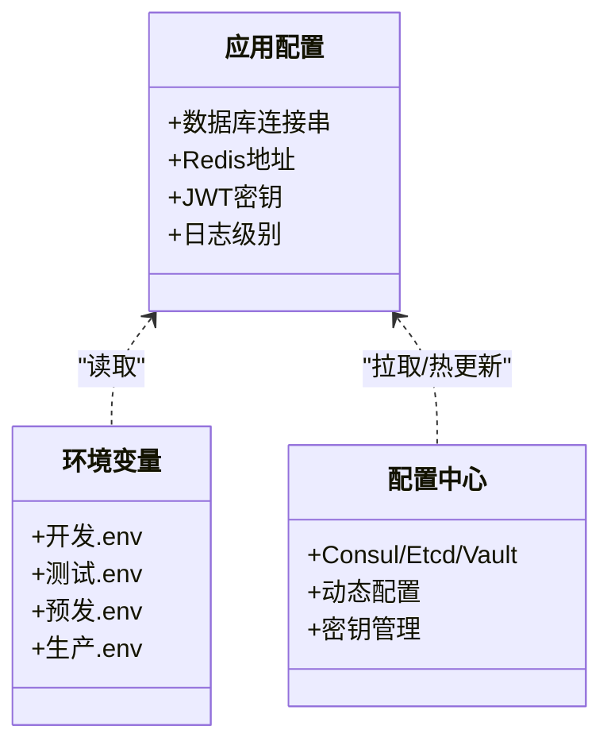

**图表来源** 
- [backend/app/core/config.py](file://backend/app/core/config.py)

**章节来源**
- [backend/app/core/config.py](file://backend/app/core/config.py)

### 数据库与迁移（Alembic）
- 数据库连接：应用通过连接字符串与认证参数连接PostgreSQL。
- 迁移管理：Alembic负责数据库schema变更，支持版本控制与回滚。
- 迁移执行：在容器启动前或CI/CD中执行迁移，确保数据一致性。

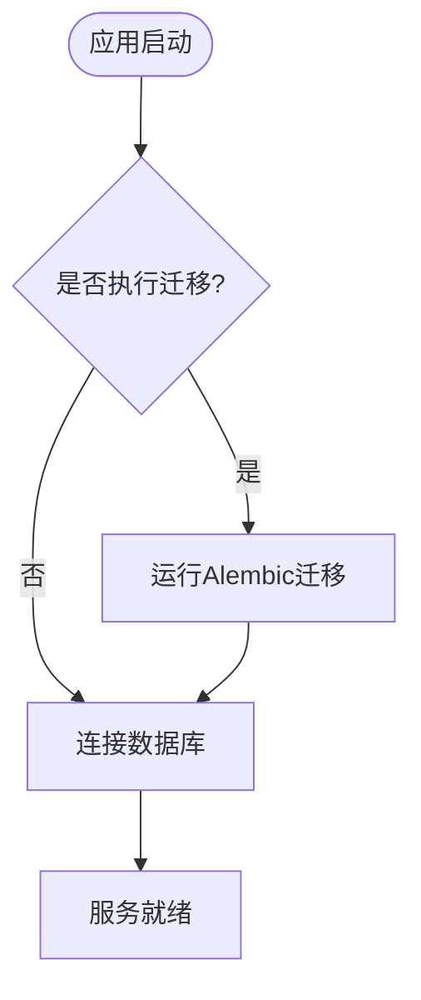

**图表来源** 
- [backend/app/db.py](file://backend/app/db.py)
- [backend/alembic.ini](file://backend/alembic.ini)

**章节来源**
- [backend/app/db.py](file://backend/app/db.py)
- [backend/alembic.ini](file://backend/alembic.ini)

### 工作进程与异步任务
- 工作进程：处理耗时任务（如报告生成、导入解析），与API服务解耦。
- 任务分发：可通过消息队列或直接调用后端接口。
- 伸缩性：根据负载水平调整工作进程数量。

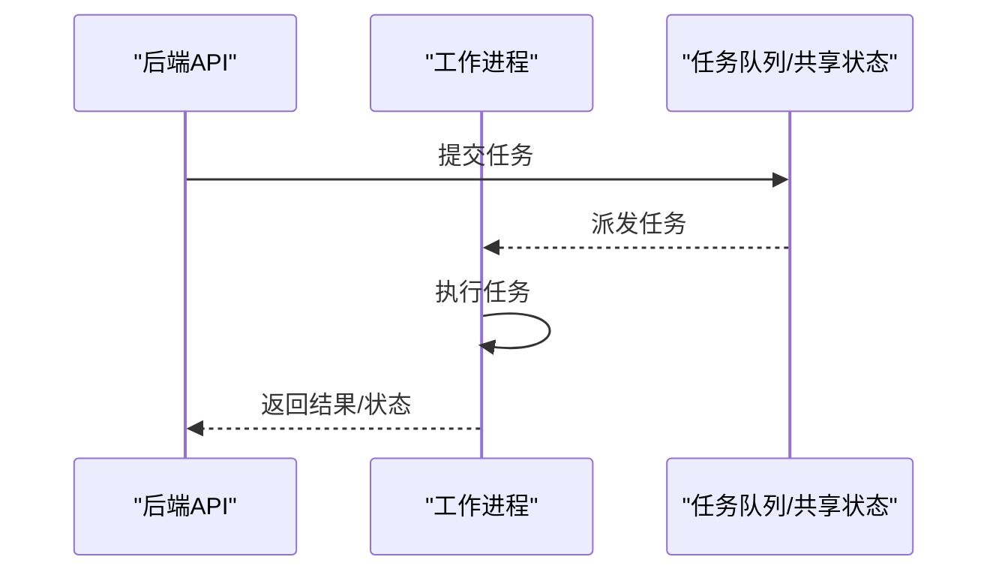

**图表来源** 
- [backend/app/workers/main.py](file://backend/app/workers/main.py)
- [backend/app/workers/dispatch.py](file://backend/app/workers/dispatch.py)

**章节来源**
- [backend/app/workers/main.py](file://backend/app/workers/main.py)
- [backend/app/workers/dispatch.py](file://backend/app/workers/dispatch.py)

### 监控告警系统部署与配置
- 指标采集：Prometheus抓取应用与基础设施指标。
- 可视化：Grafana展示仪表盘与告警规则。
- 日志收集：ELK或Loki集中管理日志。
- 告警通知：集成邮件、企业微信、Slack等渠道。

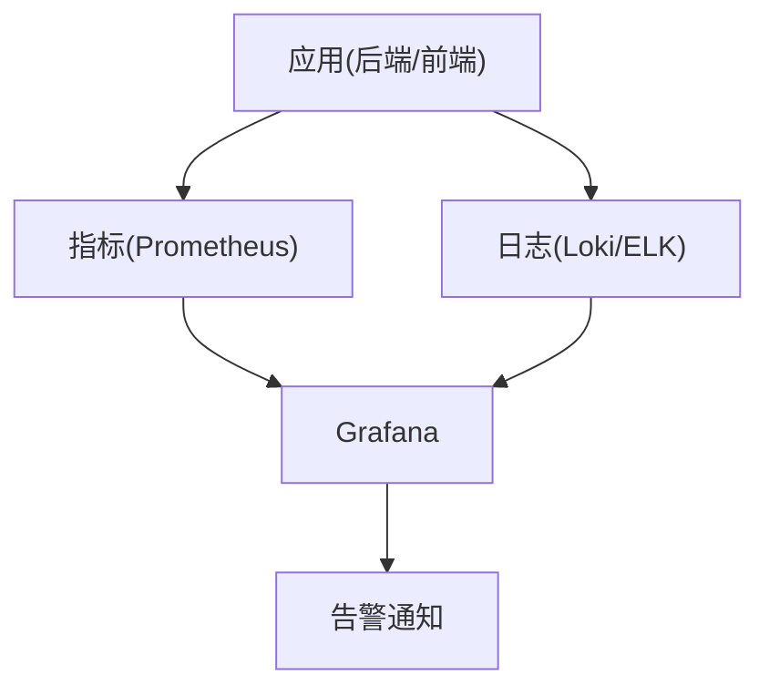

[此图为概念性流程图，未直接映射具体源码文件]

### 备份恢复与灾难恢复
- 数据库备份：定期全量与增量备份，保留策略与异地存储。
- 缓存与临时数据：可重建，无需持久化。
- 恢复演练：定期验证备份可用性与恢复时间目标（RTO/RPO）。
- 灾难恢复：多可用区部署，自动故障转移与数据同步。

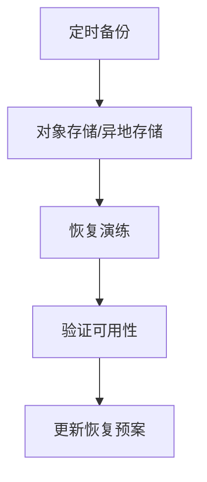

[此图为概念性流程图，未直接映射具体源码文件]

### 不同环境的部署清单与配置模板
- 环境划分：开发、测试、预发、生产。
- 配置差异：数据库地址、缓存地址、日志级别、功能开关。
- 模板管理：使用环境变量文件或配置中心统一管理。

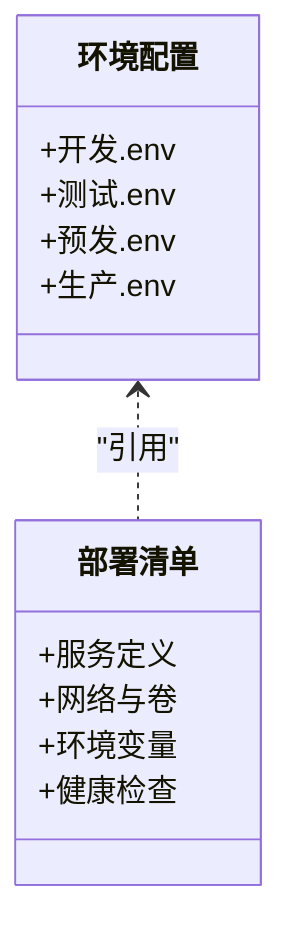

[此图为概念性类图，未直接映射具体源码文件]

### CI/CD流水线设计与自动化部署
- 构建阶段：多阶段构建镜像，扫描漏洞，生成制品。
- 测试阶段：单元测试、集成测试、安全扫描。
- 发布阶段：灰度发布、蓝绿部署、回滚策略。
- 监控与反馈：部署后自动验证与告警。

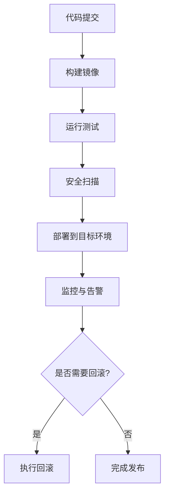

[此图为概念性流程图，未直接映射具体源码文件]

## 依赖关系分析
- 服务依赖：
  - 后端依赖数据库与缓存。
  - 前端依赖后端API。
  - 工作进程依赖后端或消息队列。
- 外部依赖：
  - PostgreSQL、Redis、可能的消息队列与对象存储。
- 内部依赖：
  - Alembic迁移与数据库schema。
  - 环境变量与配置中心。

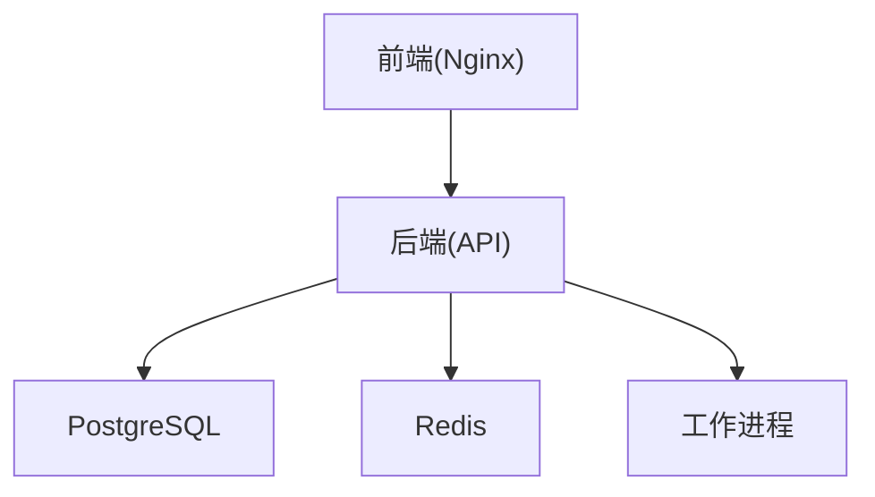

**图表来源** 
- [docker-compose.yml](file://docker-compose.yml)
- [backend/app/main.py](file://backend/app/main.py)
- [backend/app/db.py](file://backend/app/db.py)

**章节来源**
- [docker-compose.yml](file://docker-compose.yml)
- [backend/app/main.py](file://backend/app/main.py)
- [backend/app/db.py](file://backend/app/db.py)

## 性能考量
- 镜像优化：多阶段构建、精简基础镜像、禁用非必要依赖。
- 资源限制：为容器设置CPU与内存上限，避免资源争用。
- 连接池：数据库与缓存连接池调优，提升并发能力。
- 缓存策略：合理设置HTTP缓存与CDN加速静态资源。
- 水平扩展：无状态服务横向扩展，有状态服务主从复制与分片。

[本节为通用指导，不直接分析具体文件]

## 故障排查指南
- 常见问题：
  - 数据库连接失败：检查连接串、网络连通性与权限。
  - 缓存不可用：确认Redis地址与密码，检查防火墙。
  - 静态资源404：核对Nginx挂载目录与构建产物路径。
  - 迁移失败：查看Alembic日志与数据库版本。
- 诊断步骤：
  - 查看容器日志与事件。
  - 使用健康检查探针验证服务状态。
  - 逐步缩小问题范围，定位依赖服务。

**章节来源**
- [backend/app/db.py](file://backend/app/db.py)
- [frontend/nginx.conf](file://frontend/nginx.conf)
- [backend/alembic.ini](file://backend/alembic.ini)

## 结论
Talos系统采用前后端分离与容器化部署，通过docker-compose实现服务编排，Nginx提供静态资源与反向代理，PostgreSQL与Redis支撑数据与缓存。生产环境建议引入负载均衡、配置中心、监控告警与备份恢复机制，结合CI/CD实现自动化发布与回滚。遵循镜像优化与安全最佳实践，确保系统高可用与可维护性。

[本节为总结性内容，不直接分析具体文件]

## 附录
- 开发脚本：dev.sh与dev.ps1用于本地快速启动与调试。
- 依赖管理：backend/requirements.txt与frontend/package.json管理项目依赖。
- 应用入口：backend/app/main.py定义API路由与生命周期。

**章节来源**
- [dev.sh](file://dev.sh)
- [dev.ps1](file://dev.ps1)
- [backend/requirements.txt](file://backend/requirements.txt)
- [frontend/package.json](file://frontend/package.json)
- [backend/app/main.py](file://backend/app/main.py)