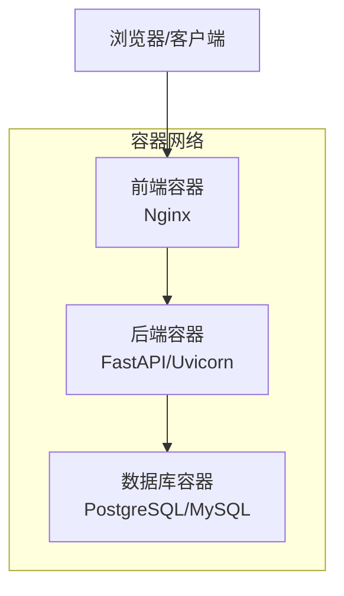
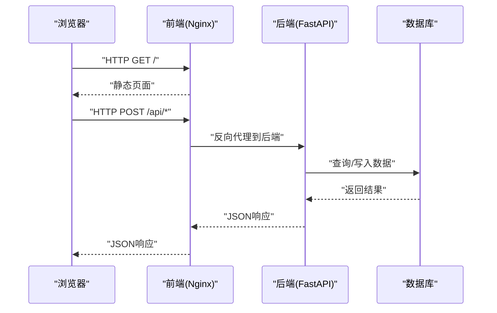
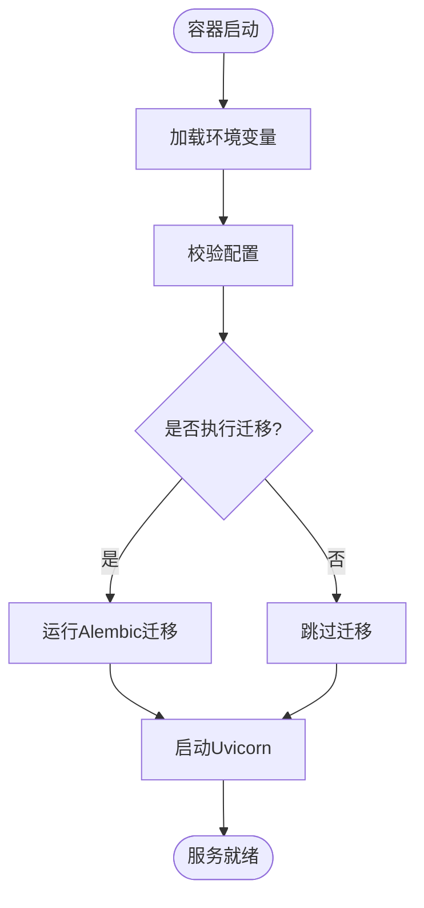
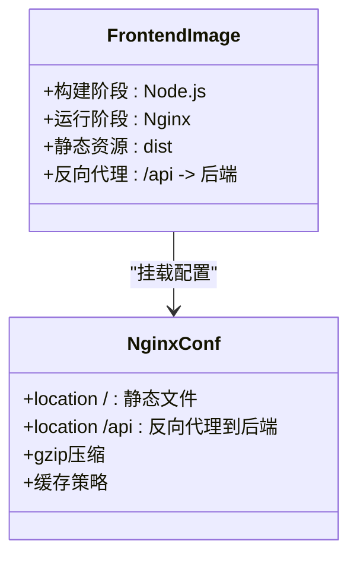
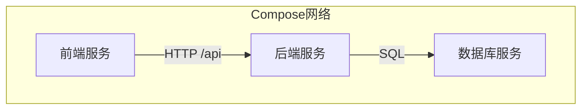
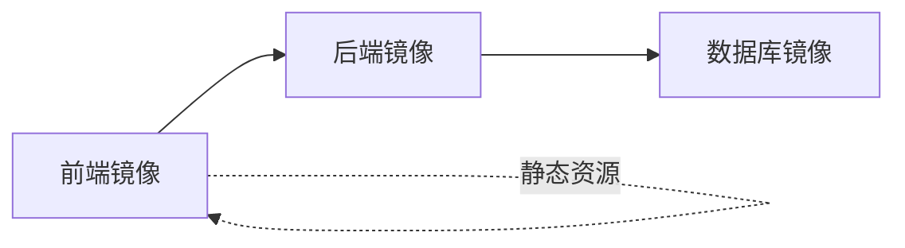

# Docker容器化部署

<cite>
**本文引用的文件**   
- [backend/Dockerfile](file://backend/Dockerfile)
- [backend/.dockerignore](file://backend/.dockerignore)
- [backend/requirements.txt](file://backend/requirements.txt)
- [backend/app/main.py](file://backend/app/main.py)
- [backend/app/core/config.py](file://backend/app/core/config.py)
- [backend/app/db.py](file://backend/app/db.py)
- [backend/alembic.ini](file://backend/alembic.ini)
- [frontend/Dockerfile](file://frontend/Dockerfile)
- [frontend/nginx.conf](file://frontend/nginx.conf)
- [frontend/package.json](file://frontend/package.json)
- [frontend/vite.config.ts](file://frontend/vite.config.ts)
- [docker-compose.yml](file://docker-compose.yml)
</cite>

## 目录
1. [简介](#简介)
2. [项目结构](#项目结构)
3. [核心组件](#核心组件)
4. [架构总览](#架构总览)
5. [详细组件分析](#详细组件分析)
6. [依赖关系分析](#依赖关系分析)
7. [性能考虑](#性能考虑)
8. [故障排查指南](#故障排查指南)
9. [结论](#结论)
10. [附录](#附录)

## 简介
本文件面向Talos平台的Docker容器化部署，覆盖镜像构建、编排配置、服务通信、环境差异、常用操作命令、日志与监控集成、资源限制与性能调优等。目标是帮助读者从零开始完成本地开发到生产环境的容器化交付。

## 项目结构
Talos平台采用前后端分离架构：
- 后端：Python FastAPI应用，使用Alembic进行数据库迁移，通过Uvicorn运行。
- 前端：Vue/Vite构建产物由Nginx静态托管。
- 编排：docker-compose统一编排后端、前端（Nginx）、数据库等组件。

图表来源
- [docker-compose.yml](file://docker-compose.yml)
- [frontend/nginx.conf](file://frontend/nginx.conf)
- [backend/app/main.py](file://backend/app/main.py)

章节来源
- [backend/Dockerfile](file://backend/Dockerfile)
- [frontend/Dockerfile](file://frontend/Dockerfile)
- [docker-compose.yml](file://docker-compose.yml)

## 核心组件
- 后端镜像构建
  - 多阶段构建：构建阶段安装依赖并编译扩展；运行阶段仅包含运行时依赖，减小镜像体积。
  - 依赖管理：requirements.txt锁定版本，确保可重复构建。
  - 启动入口：Uvicorn作为ASGI服务器加载FastAPI应用。
- 前端镜像构建
  - 构建阶段：Node.js安装依赖并执行Vite构建，生成静态资源。
  - 运行阶段：Nginx提供静态文件服务，反向代理API请求至后端。
- 编排与服务发现
  - docker-compose定义服务、网络、数据卷、环境变量。
  - 容器间通过Compose内置DNS解析服务名进行通信。

章节来源
- [backend/Dockerfile](file://backend/Dockerfile)
- [backend/requirements.txt](file://backend/requirements.txt)
- [backend/app/main.py](file://backend/app/main.py)
- [frontend/Dockerfile](file://frontend/Dockerfile)
- [frontend/nginx.conf](file://frontend/nginx.conf)
- [frontend/package.json](file://frontend/package.json)
- [frontend/vite.config.ts](file://frontend/vite.config.ts)
- [docker-compose.yml](file://docker-compose.yml)

## 架构总览
下图展示容器化后的整体交互：浏览器访问Nginx（前端），Nginx将API请求转发给后端，后端读写数据库。

图表来源
- [frontend/nginx.conf](file://frontend/nginx.conf)
- [backend/app/main.py](file://backend/app/main.py)
- [docker-compose.yml](file://docker-compose.yml)

## 详细组件分析

### 后端镜像构建与运行
- 多阶段构建
  - 构建阶段：基于Python基础镜像，安装系统依赖与Python依赖，预编译C扩展（如有）。
  - 运行阶段：仅拷贝必要文件与依赖，设置工作目录与用户权限，暴露端口，指定启动命令。
- 依赖管理
  - requirements.txt集中声明依赖，建议固定版本号以保证可重现性。
- 启动流程
  - Uvicorn加载FastAPI应用，监听指定端口，处理HTTP请求。
- 配置与环境变量
  - 通过环境变量注入数据库连接、密钥、调试开关等。
  - 配置文件读取顺序：默认值 -> 环境变量 -> 可选的外部配置。
- 数据库迁移
  - Alembic在容器启动前或独立任务中执行迁移脚本，确保表结构与代码一致。

图表来源
- [backend/Dockerfile](file://backend/Dockerfile)
- [backend/app/main.py](file://backend/app/main.py)
- [backend/app/core/config.py](file://backend/app/core/config.py)
- [backend/alembic.ini](file://backend/alembic.ini)

章节来源
- [backend/Dockerfile](file://backend/Dockerfile)
- [backend/requirements.txt](file://backend/requirements.txt)
- [backend/app/main.py](file://backend/app/main.py)
- [backend/app/core/config.py](file://backend/app/core/config.py)
- [backend/alembic.ini](file://backend/alembic.ini)

### 前端镜像构建与Nginx配置
- 多阶段构建
  - 构建阶段：Node.js安装依赖并执行Vite构建，输出静态资源到dist目录。
  - 运行阶段：Nginx镜像复制dist内容，加载nginx.conf提供服务。
- 反向代理
  - nginx.conf将/api路径转发到后端服务域名（通常为后端服务名加端口）。
- 构建优化
  - 利用缓存层加速依赖安装与构建。
  - 清理不必要的中间文件，减少镜像大小。

图表来源
- [frontend/Dockerfile](file://frontend/Dockerfile)
- [frontend/nginx.conf](file://frontend/nginx.conf)
- [frontend/package.json](file://frontend/package.json)
- [frontend/vite.config.ts](file://frontend/vite.config.ts)

章节来源
- [frontend/Dockerfile](file://frontend/Dockerfile)
- [frontend/nginx.conf](file://frontend/nginx.conf)
- [frontend/package.json](file://frontend/package.json)
- [frontend/vite.config.ts](file://frontend/vite.config.ts)

### docker-compose编排与服务发现
- 服务定义
  - 后端服务：映射端口、挂载代码/数据卷、注入环境变量、依赖数据库服务。
  - 前端服务：映射80/443端口、挂载静态资源与nginx配置、依赖后端服务。
  - 数据库服务：持久化数据卷、初始化脚本、密码等敏感信息。
- 网络配置
  - 默认桥接网络，服务间通过服务名解析IP。
  - 可按需自定义网络隔离不同环境。
- 数据卷挂载
  - 数据库数据目录持久化，避免重启丢失。
  - 日志目录可挂载到宿主机便于收集。
- 环境变量管理
  - 使用.env文件或compose中的environment字段注入。
  - 敏感信息建议使用Secrets或外部密钥管理服务。

图表来源
- [docker-compose.yml](file://docker-compose.yml)

章节来源
- [docker-compose.yml](file://docker-compose.yml)

### 容器间通信机制与服务发现
- DNS解析：Compose为每个服务分配一个稳定的服务名，容器内可通过服务名访问。
- 健康检查：可为关键服务添加healthcheck，确保依赖就绪后再启动依赖方。
- 重试与超时：在应用层实现重试逻辑，避免瞬时失败导致请求中断。

章节来源
- [docker-compose.yml](file://docker-compose.yml)
- [frontend/nginx.conf](file://frontend/nginx.conf)
- [backend/app/main.py](file://backend/app/main.py)

### 开发与生产环境差异化配置
- 开发环境
  - 启用热重载、详细日志、调试模式。
  - 代码目录挂载到容器，便于即时修改。
  - 数据库可使用轻量级实例或内存数据库。
- 生产环境
  - 关闭调试、最小化镜像、只读根文件系统（可选）。
  - 使用环境变量或外部配置中心注入配置。
  - 启用HTTPS、限流、访问控制等安全策略。

章节来源
- [backend/app/core/config.py](file://backend/app/core/config.py)
- [frontend/vite.config.ts](file://frontend/vite.config.ts)
- [docker-compose.yml](file://docker-compose.yml)

## 依赖关系分析
- 后端依赖
  - Python包依赖通过requirements.txt管理。
  - 数据库驱动与ORM依赖需在镜像构建时安装。
- 前端依赖
  - Node.js依赖通过package.json管理，构建产物为静态资源。
- 服务依赖
  - 前端依赖后端API可用性。
  - 后端依赖数据库可用性与迁移完成。

图表来源
- [backend/requirements.txt](file://backend/requirements.txt)
- [frontend/package.json](file://frontend/package.json)
- [docker-compose.yml](file://docker-compose.yml)

章节来源
- [backend/requirements.txt](file://backend/requirements.txt)
- [frontend/package.json](file://frontend/package.json)
- [docker-compose.yml](file://docker-compose.yml)

## 性能考虑
- 镜像优化
  - 多阶段构建减少最终镜像体积。
  - 合并RUN指令、清理缓存、使用.dockerignore排除无关文件。
- 运行时优化
  - 调整Uvicorn worker数量与线程数。
  - 启用Gzip压缩与静态资源缓存。
  - 数据库连接池与查询优化。
- 资源限制
  - 在compose中设置CPU与内存上限，防止单容器占用过多资源。
  - 合理设置日志轮转与保留策略，避免磁盘占满。

[本节为通用指导，不直接分析具体文件]

## 故障排查指南
- 常见错误
  - 数据库连接失败：检查环境变量、网络连通性、服务名解析。
  - 前端无法访问API：确认nginx.conf反向代理路径与后端端口。
  - 权限问题：确保容器用户有足够权限读写挂载目录。
- 日志查看
  - 使用docker logs查看容器标准输出与错误。
  - 将应用日志输出到文件并挂载到宿主机，便于长期留存与分析。
- 健康检查
  - 为后端与健康端点添加healthcheck，确保服务就绪。
  - 前端可通过HTTP状态码判断静态资源加载情况。

章节来源
- [backend/app/main.py](file://backend/app/main.py)
- [frontend/nginx.conf](file://frontend/nginx.conf)
- [docker-compose.yml](file://docker-compose.yml)

## 结论
通过多阶段构建、合理的依赖管理与编排配置，Talos平台实现了从开发到生产的稳定容器化部署。遵循本文档的构建、编排、监控与调优建议，可显著提升系统的可维护性与可靠性。

[本节为总结性内容，不直接分析具体文件]

## 附录

### 常用操作命令
- 构建镜像
  - 后端镜像：在backend目录下执行构建命令。
  - 前端镜像：在frontend目录下执行构建命令。
- 启动服务
  - 使用docker-compose up启动所有服务。
  - 后台运行：docker-compose up -d。
- 停止与重启
  - 停止：docker-compose down。
  - 重启单个服务：docker-compose restart <服务名>。
- 查看日志
  - 实时日志：docker-compose logs -f <服务名>。
  - 历史日志：docker logs <容器ID>。
- 进入容器
  - 交互式终端：docker-compose exec <服务名> bash。

[本节为通用指导，不直接分析具体文件]

### 日志收集与监控集成方案
- 日志收集
  - 使用docker logging驱动（如json-file、fluentd、gelf）将日志发送到集中式存储。
  - 应用层输出结构化日志（JSON格式），便于解析与检索。
- 监控集成
  - 暴露Prometheus指标端点，采集应用与系统指标。
  - 使用Grafana可视化指标，设置告警规则。
  - 健康检查端点用于负载均衡与健康探测。

[本节为通用指导，不直接分析具体文件]

### 容器资源限制与性能调优建议
- 资源限制
  - 在compose中设置cpus与mem_limit，避免资源争用。
  - 数据库与后端分别限制最大连接数与内存使用。
- 性能调优
  - 调整Uvicorn workers与threads以匹配CPU核数。
  - 启用Nginx缓存与Gzip压缩，提升静态资源加载速度。
  - 数据库索引优化与慢查询分析。

[本节为通用指导，不直接分析具体文件]