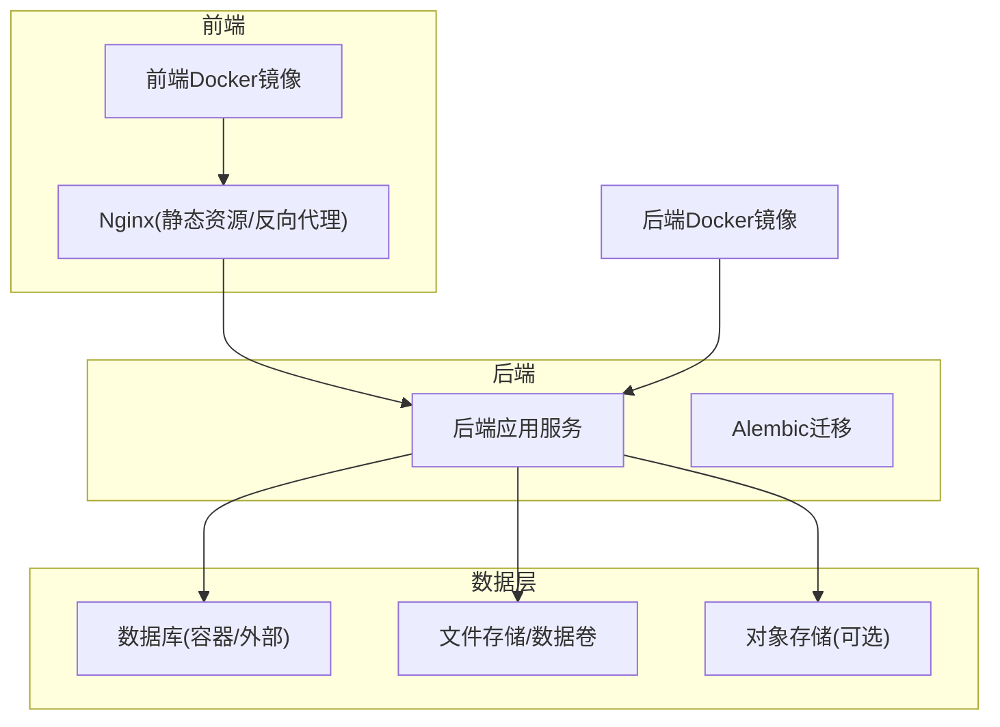
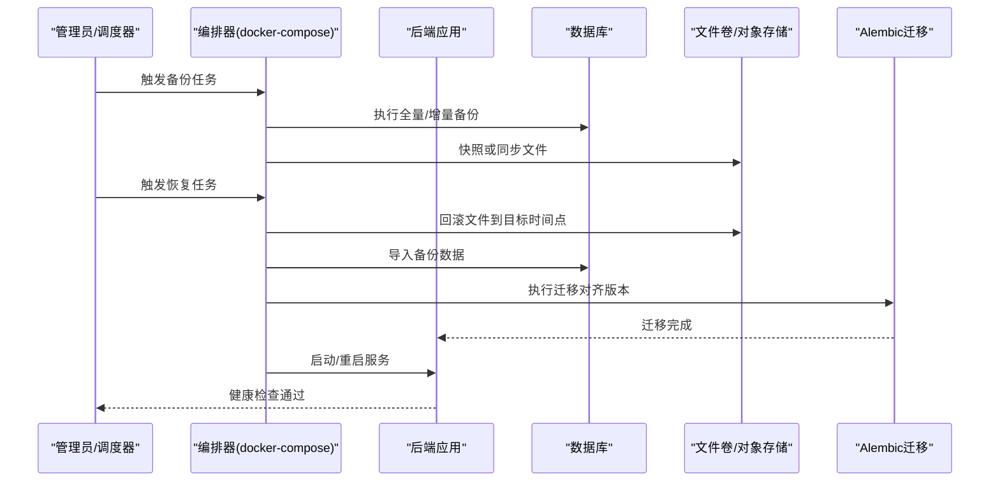
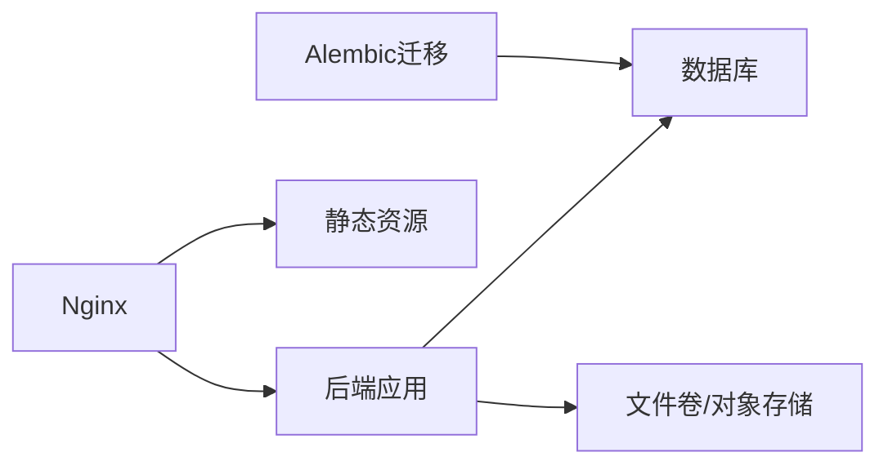

# 备份恢复策略

<cite>
**本文引用的文件**   
- [docker-compose.yml](file://docker-compose.yml)
- [backend/app/main.py](file://backend/app/main.py)
- [backend/app/db.py](file://backend/app/db.py)
- [backend/alembic/env.py](file://backend/alembic/env.py)
- [backend/alembic.ini](file://backend/alembic.ini)
- [frontend/nginx.conf](file://frontend/nginx.conf)
- [backend/Dockerfile](file://backend/Dockerfile)
- [frontend/Dockerfile](file://frontend/Dockerfile)
</cite>

## 目录
1. [简介](#简介)
2. [项目结构](#项目结构)
3. [核心组件](#核心组件)
4. [架构总览](#架构总览)
5. [详细组件分析](#详细组件分析)
6. [依赖关系分析](#依赖关系分析)
7. [性能考虑](#性能考虑)
8. [故障排查指南](#故障排查指南)
9. [结论](#结论)
10. [附录](#附录)

## 简介
本文件为Talos平台的备份与恢复策略文档，面向运维与研发人员，覆盖数据库备份（全量、增量、定时任务）、文件存储与数据卷备份、灾难恢复流程、备份数据存储位置与保留策略、自动化脚本与调度配置、备份验证与完整性检查、跨地域备份与高可用架构设计等内容。文档基于仓库中的容器编排与后端服务实现进行说明，确保策略可落地执行。

## 项目结构
Talos平台采用前后端分离的容器化部署：
- 前端通过Nginx提供静态资源与反向代理
- 后端基于Python Web框架提供服务，使用Alembic管理数据库迁移
- 数据库与对象存储等外部依赖通过docker-compose编排挂载或连接

图表来源
- [docker-compose.yml](file://docker-compose.yml)
- [frontend/nginx.conf](file://frontend/nginx.conf)
- [backend/app/main.py](file://backend/app/main.py)
- [backend/app/db.py](file://backend/app/db.py)

章节来源
- [docker-compose.yml](file://docker-compose.yml)
- [frontend/nginx.conf](file://frontend/nginx.conf)
- [backend/app/main.py](file://backend/app/main.py)
- [backend/app/db.py](file://backend/app/db.py)

## 核心组件
- 数据库与迁移：后端通过db模块连接数据库，使用Alembic进行版本化管理与迁移
- 文件与对象存储：用户上传与静态资源可通过本地数据卷或对象存储持久化
- 容器编排：docker-compose统一管理服务、网络、卷与依赖
- 前端静态资源：由Nginx托管并缓存，需纳入备份范围

章节来源
- [backend/app/db.py](file://backend/app/db.py)
- [backend/alembic/env.py](file://backend/alembic/env.py)
- [backend/alembic.ini](file://backend/alembic.ini)
- [frontend/nginx.conf](file://frontend/nginx.conf)

## 架构总览
下图展示备份与恢复在系统中的关键交互点：数据库快照/逻辑导出、文件卷快照、对象存储同步、迁移脚本执行与服务重启顺序。

图表来源
- [docker-compose.yml](file://docker-compose.yml)
- [backend/app/main.py](file://backend/app/main.py)
- [backend/alembic/env.py](file://backend/alembic/env.py)
- [backend/alembic.ini](file://backend/alembic.ini)

## 详细组件分析

### 数据库备份策略
- 全量备份
  - 适用场景：首次完整备份、周期性归档
  - 方法：使用数据库原生工具导出逻辑备份或物理快照；建议对事务一致性有要求的场景使用快照
  - 频率：每日一次（低峰期）
- 增量备份
  - 适用场景：降低备份窗口与存储占用
  - 方法：启用数据库增量机制（如WAL/Binlog），按小时或更短周期归档
  - 频率：每小时或根据RPO要求调整
- 定时备份任务
  - 调度方式：系统cron或容器内定时任务；也可通过编排器编排一次性任务
  - 任务内容：执行全量/增量备份、校验备份完整性、上传至远端存储、清理过期备份

章节来源
- [backend/app/db.py](file://backend/app/db.py)
- [backend/alembic/env.py](file://backend/alembic/env.py)
- [backend/alembic.ini](file://backend/alembic.ini)

### 文件存储与数据卷备份方案
- 静态资源与用户上传文件
  - 本地数据卷：通过docker-compose挂载卷，定期快照或rsync同步
  - 对象存储：将文件上传至对象存储（S3兼容），利用其版本控制与跨区域复制能力
- 备份方法
  - 快照：文件系统级快照（支持在线/离线）
  - 同步：增量同步（如rclone/s3cmd）
  - 归档：打包压缩后上传至冷存储

章节来源
- [docker-compose.yml](file://docker-compose.yml)
- [frontend/nginx.conf](file://frontend/nginx.conf)

### 灾难恢复流程
- 恢复步骤
  1. 准备环境：确认目标节点/集群可用，安装必要依赖
  2. 恢复文件：从备份介质回滚文件卷或对象存储路径
  3. 恢复数据库：导入全量备份，再回放增量日志至目标时间点
  4. 执行迁移：运行Alembic迁移以对齐当前代码版本
  5. 启动服务：按顺序启动后端、前端、数据库相关服务
  6. 健康检查：验证API可用性、登录、报表生成、导入功能等
- 服务重启顺序
  - 数据库 → 文件存储/对象存储 → 后端应用 → 前端Nginx
- 数据一致性验证
  - 数据库：抽样核对关键表记录数、时间戳范围、业务指标
  - 文件：校验文件数量、哈希值、访问路径映射
  - 应用：冒烟测试关键接口与页面

章节来源
- [backend/alembic/env.py](file://backend/alembic/env.py)
- [backend/alembic.ini](file://backend/alembic.ini)
- [docker-compose.yml](file://docker-compose.yml)

### 备份数据的存储位置与保留策略
- 存储位置
  - 本地卷：用于快速恢复与热备
  - 远端对象存储：用于长期归档与跨地域容灾
- 保留策略
  - 全量备份：保留最近N份（如7/30天）
  - 增量备份：保留最近M个周期（如7天）
  - 归档：按季度/年度归档，长期保留
- 生命周期管理
  - 自动清理过期备份
  - 冷热分层（频繁访问的热数据与归档冷数据分离）

章节来源
- [docker-compose.yml](file://docker-compose.yml)

### 自动化备份脚本与任务调度配置
- 脚本职责
  - 数据库备份（全量/增量）
  - 文件卷快照/同步
  - 备份完整性校验（checksum/校验和）
  - 上传至远端存储
  - 清理过期备份
- 调度配置
  - 系统cron或容器内定时任务
  - 编排器编排一次性任务（如恢复演练）
- 监控与告警
  - 记录备份日志与结果
  - 失败重试与告警通知

章节来源
- [docker-compose.yml](file://docker-compose.yml)

### 备份验证与完整性检查方法
- 数据库校验
  - 逻辑备份：导入到测试库，比对关键表结构与数据
  - 物理快照：启动只读副本，验证可查询性
- 文件校验
  - 计算哈希值并与备份元数据对比
  - 抽样打开文件验证可读性
- 应用冒烟测试
  - 登录、创建/读取报告、导入数据等关键流程

章节来源
- [backend/app/main.py](file://backend/app/main.py)

### 跨地域备份与高可用备份架构设计
- 多地域复制
  - 对象存储开启跨区域复制
  - 数据库异地只读副本与定期导出
- 高可用设计
  - 主备数据库切换
  - 多可用区部署与负载均衡
  - 备份介质多副本冗余

章节来源
- [docker-compose.yml](file://docker-compose.yml)

## 依赖关系分析
- 后端依赖数据库与文件存储
- Alembic依赖数据库连接与迁移脚本
- Nginx依赖静态资源与后端API
- docker-compose统一管理上述组件

图表来源
- [backend/app/main.py](file://backend/app/main.py)
- [backend/app/db.py](file://backend/app/db.py)
- [backend/alembic/env.py](file://backend/alembic/env.py)
- [frontend/nginx.conf](file://frontend/nginx.conf)
- [docker-compose.yml](file://docker-compose.yml)

章节来源
- [backend/app/main.py](file://backend/app/main.py)
- [backend/app/db.py](file://backend/app/db.py)
- [backend/alembic/env.py](file://backend/alembic/env.py)
- [frontend/nginx.conf](file://frontend/nginx.conf)
- [docker-compose.yml](file://docker-compose.yml)

## 性能考虑
- 备份窗口：选择低峰期执行，避免影响业务
- 增量优先：减少I/O与网络开销
- 并行与分片：大库分库分表时并行备份
- 缓存与预热：恢复前预热热点数据
- 限流与退避：避免备份任务打满带宽与磁盘

[本节为通用指导，不直接分析具体文件]

## 故障排查指南
- 常见问题
  - 备份失败：检查权限、网络、存储空间、数据库连接
  - 恢复失败：确认备份版本与代码版本一致，迁移脚本正确
  - 数据不一致：核对时间线、事务提交点、文件哈希
- 定位手段
  - 查看备份日志与错误输出
  - 校验备份元数据与哈希
  - 在测试环境先行演练恢复

章节来源
- [backend/alembic/env.py](file://backend/alembic/env.py)
- [backend/alembic.ini](file://backend/alembic.ini)
- [docker-compose.yml](file://docker-compose.yml)

## 结论
本策略围绕数据库、文件与对象存储构建完整的备份与恢复体系，结合定时任务与自动化脚本保障可靠性与可维护性。通过跨地域复制与高可用设计提升容灾能力，配合严格的验证流程确保数据一致性与业务连续性。建议在生产环境定期演练恢复流程，持续优化备份窗口与存储成本。

[本节为总结性内容，不直接分析具体文件]

## 附录
- 术语
  - RTO：恢复时间目标
  - RPO：恢复点目标
- 参考实践
  - 数据库原生备份工具
  - 对象存储版本控制与跨区域复制
  - 容器编排的任务编排与监控

[本节为补充信息，不直接分析具体文件]