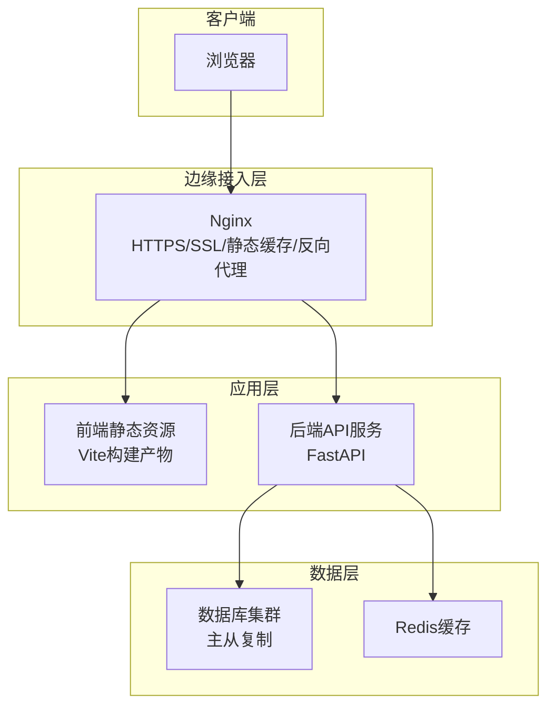
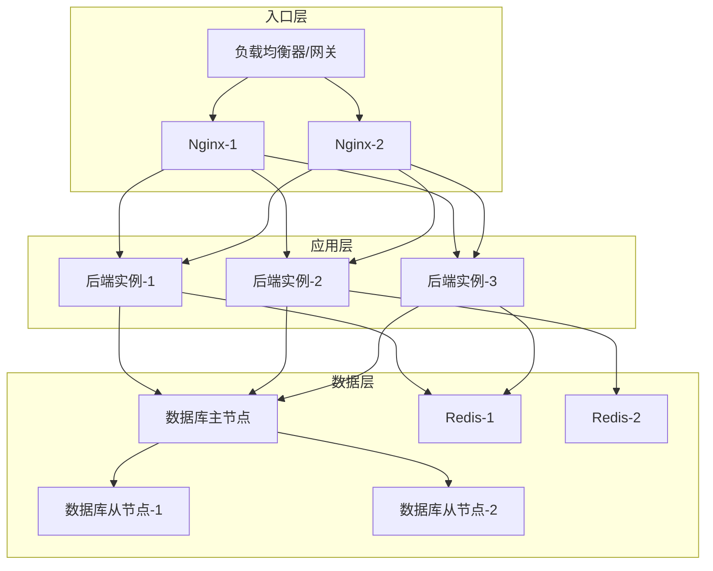
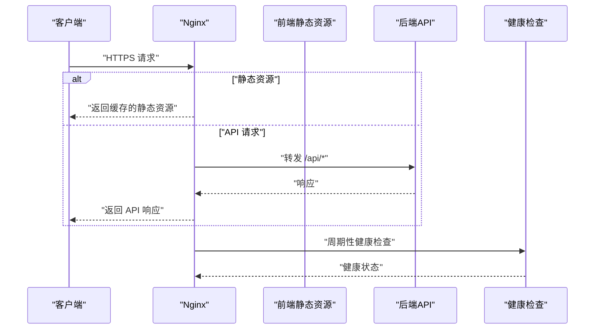
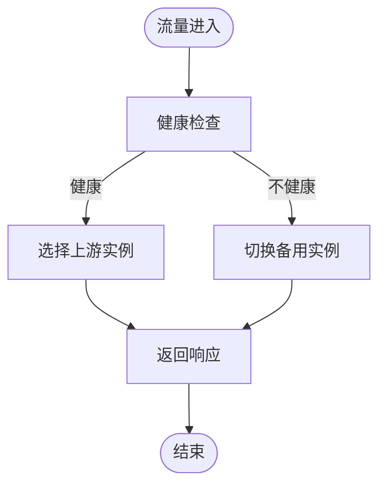
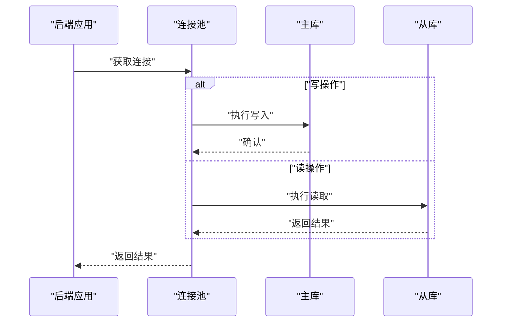
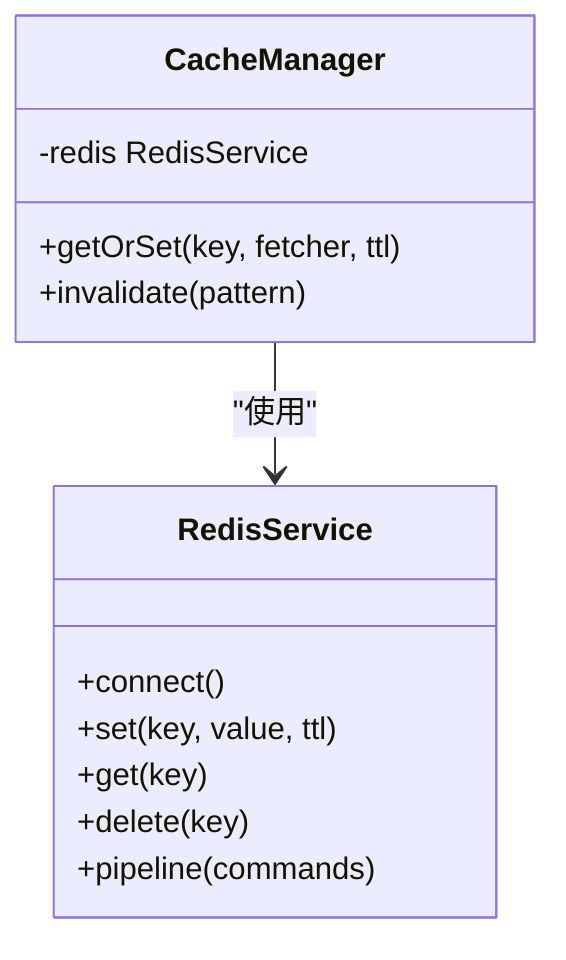
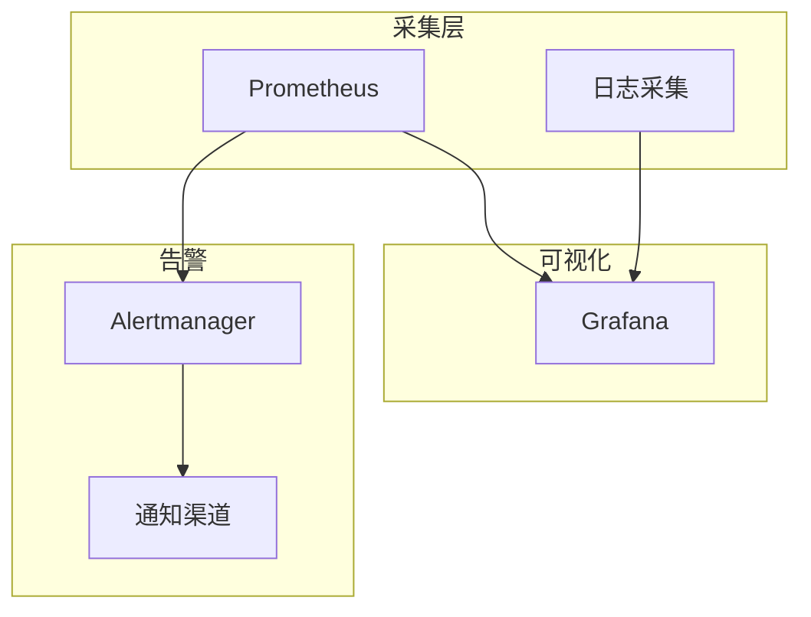
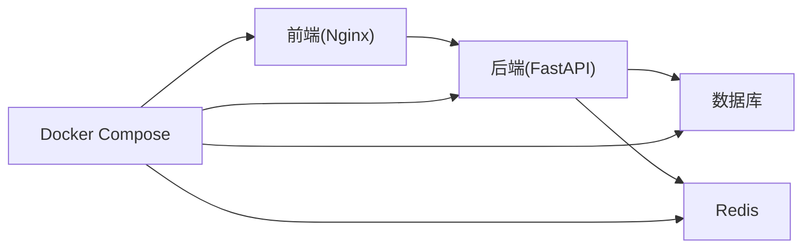

# 生产环境部署

<cite>
**本文引用的文件**   
- [docker-compose.yml](file://docker-compose.yml)
- [backend/Dockerfile](file://backend/Dockerfile)
- [backend/app/main.py](file://backend/app/main.py)
- [backend/app/core/config.py](file://backend/app/core/config.py)
- [backend/app/db.py](file://backend/app/db.py)
- [frontend/Dockerfile](file://frontend/Dockerfile)
- [frontend/nginx.conf](file://frontend/nginx.conf)
- [dev.sh](file://dev.sh)
</cite>

## 目录
1. [简介](#简介)
2. [项目结构](#项目结构)
3. [核心组件](#核心组件)
4. [架构总览](#架构总览)
5. [详细组件分析](#详细组件分析)
6. [依赖关系分析](#依赖关系分析)
7. [性能考虑](#性能考虑)
8. [故障排查指南](#故障排查指南)
9. [结论](#结论)
10. [附录](#附录)

## 简介
本指南面向在生产环境部署 Talos 平台的工程与运维人员，覆盖反向代理（Nginx）配置、HTTPS/SSL、静态资源缓存、请求转发、负载均衡与高可用、数据库集群（主从复制、连接池、备份）、Redis 缓存服务、安全加固、性能调优参数与环境变量、以及监控告警集成。文档以仓库现有配置文件为基础，给出可落地的部署步骤与最佳实践建议。

## 项目结构
Talos 采用前后端分离架构：
- 前端：Vue + Vite 构建产物由 Nginx 提供静态资源与反向代理。
- 后端：Python FastAPI 应用，通过容器化运行，暴露 API。
- 基础设施：Docker Compose 编排多服务，便于本地与生产一致化部署。

图表来源
- [frontend/nginx.conf](file://frontend/nginx.conf)
- [backend/app/main.py](file://backend/app/main.py)
- [docker-compose.yml](file://docker-compose.yml)

章节来源
- [docker-compose.yml](file://docker-compose.yml)
- [frontend/nginx.conf](file://frontend/nginx.conf)
- [backend/app/main.py](file://backend/app/main.py)

## 核心组件
- Nginx 反向代理与静态资源服务：负责 HTTPS 终止、静态资源缓存、API 转发与健康检查。
- 后端 FastAPI 服务：业务逻辑、鉴权、报表生成、任务调度等。
- 数据库：关系型数据库用于持久化存储，需主从复制与连接池优化。
- Redis：会话、缓存、任务队列等场景使用。
- 容器编排：Docker Compose 定义服务拓扑、网络、卷、环境变量。

章节来源
- [frontend/nginx.conf](file://frontend/nginx.conf)
- [backend/app/main.py](file://backend/app/main.py)
- [backend/app/core/config.py](file://backend/app/core/config.py)
- [backend/app/db.py](file://backend/app/db.py)
- [docker-compose.yml](file://docker-compose.yml)

## 架构总览
生产环境推荐的高可用架构如下：
- 入口层：双机或多机 Nginx（或前置 LB），启用 SSL 证书、HTTP/2、Gzip/Brotli、静态资源缓存。
- 应用层：多副本后端服务，无状态设计，水平扩展；可选 K8s 或容器编排平台。
- 数据层：数据库主从复制（读写分离），连接池（如 PgBouncer/MySQL Proxy），定期备份与恢复演练。
- 缓存层：Redis 集群或哨兵模式，避免单点故障。
- 监控告警：日志采集、指标收集、健康检查、告警规则与通知渠道。

[此图为概念性架构图，不直接映射具体源码文件]

## 详细组件分析

### Nginx 反向代理与 HTTPS/SSL
- 证书管理：建议使用自动化证书签发与续期（如 ACME/Let’s Encrypt），将证书与私钥挂载到 Nginx 容器。
- HTTPS 终止：启用 TLS1.2+，禁用不安全协议与弱加密套件，开启 HSTS。
- 静态资源缓存：对前端静态资源设置长期缓存与版本化文件名，配合 ETag/Last-Modified。
- 请求转发：将 /api 等路径转发至后端服务，支持健康检查与失败重试。
- 安全头：添加 X-Frame-Options、Content-Security-Policy、X-Content-Type-Options 等。
- 访问控制：限制管理接口 IP 白名单、基础认证或 OAuth 集成。

图表来源
- [frontend/nginx.conf](file://frontend/nginx.conf)

章节来源
- [frontend/nginx.conf](file://frontend/nginx.conf)

### 负载均衡与高可用
- 多实例后端：至少 2-3 个后端实例，保证横向扩展与故障转移。
- Nginx 上游组：配置 upstream 与权重、健康检查、失败重试。
- 会话保持：若后端有状态，启用 Cookie 或 IP Hash；尽量无状态化。
- 前端高可用：双机或多机 Nginx，结合 DNS/云厂商 LB 实现入口高可用。

[此图为概念性流程图，不直接映射具体源码文件]

### 数据库集群部署（主从复制、连接池、备份）
- 主从复制：主库写、从库读，确保延迟监控与自动切换策略。
- 连接池：使用连接池中间件（如 PgBouncer/ProxySQL）减少连接开销。
- 备份策略：全量+增量备份，异地容灾，定期恢复演练。
- 权限最小化：为应用创建专用账号，限制只读/只写权限。
- 监控指标：QPS、慢查询、复制延迟、连接数、锁等待。

[此图为概念性序列图，不直接映射具体源码文件]

章节来源
- [backend/app/db.py](file://backend/app/db.py)
- [backend/app/core/config.py](file://backend/app/core/config.py)

### Redis 缓存服务部署与配置
- 部署模式：单机/哨兵/集群，根据容量与可用性需求选择。
- 内存策略：淘汰策略（LRU/LFU）、最大内存限制、持久化（AOF/RDB）。
- 连接优化：连接池大小、超时、重试与退避。
- 安全：密码认证、ACL、仅内网访问。

[此图为概念性类图，不直接映射具体源码文件]

章节来源
- [backend/app/core/config.py](file://backend/app/core/config.py)

### 安全加固措施
- 防火墙：仅开放必要端口（80/443、SSH、监控端口），限制源 IP。
- 访问控制：API 鉴权、RBAC、IP 白名单、速率限制。
- 敏感信息：环境变量注入密钥，禁止硬编码；使用密钥管理服务。
- 传输安全：强制 HTTPS、HSTS、TLS 强套件。
- 审计与日志：集中日志、脱敏、留存周期与合规要求。

章节来源
- [backend/app/core/config.py](file://backend/app/core/config.py)
- [docker-compose.yml](file://docker-compose.yml)

### 性能调优参数与环境变量
- Nginx：worker_processes、keepalive、gzip/brotli、缓存路径与大小、ssl_session_cache。
- 后端：并发 worker 数量、线程池、异步 I/O、数据库连接池大小、超时与重试。
- 数据库：缓冲池、连接数、索引优化、慢查询阈值。
- Redis：maxmemory、淘汰策略、持久化频率。
- 环境变量：数据库连接串、Redis 地址、JWT 密钥、日志级别、特性开关。

章节来源
- [backend/app/core/config.py](file://backend/app/core/config.py)
- [backend/app/db.py](file://backend/app/db.py)
- [frontend/nginx.conf](file://frontend/nginx.conf)

### 监控告警系统集成
- 指标采集：Prometheus/Grafana 采集 Nginx、后端、数据库、Redis 指标。
- 日志采集：ELK/EFK 集中日志，结构化输出，关键事件告警。
- 健康检查：Liveness/Readiness 探针，自动重启与扩缩容。
- 告警规则：错误率、延迟、资源使用率、复制延迟、磁盘空间。
- 通知渠道：邮件、企业微信、钉钉、Slack、PagerDuty。

[此图为概念性架构图，不直接映射具体源码文件]

## 依赖关系分析
- 前端依赖 Nginx 提供静态资源与反向代理。
- 后端依赖数据库与 Redis，通过环境变量配置连接。
- Docker Compose 统一编排服务，定义网络、卷、环境变量与启动顺序。

图表来源
- [docker-compose.yml](file://docker-compose.yml)
- [frontend/nginx.conf](file://frontend/nginx.conf)
- [backend/app/main.py](file://backend/app/main.py)

章节来源
- [docker-compose.yml](file://docker-compose.yml)
- [frontend/nginx.conf](file://frontend/nginx.conf)
- [backend/app/main.py](file://backend/app/main.py)

## 性能考虑
- 静态资源：启用 HTTP/2、Gzip/Brotli、CDN 加速、长缓存与版本化。
- 反向代理：合理设置 keepalive、超时、缓冲区、限流与熔断。
- 后端：异步处理、批量操作、缓存热点数据、分页与索引优化。
- 数据库：读写分离、连接池、慢查询优化、分区与归档。
- Redis：热点键预热、分片与集群、内存上限与淘汰策略。
- 监控：基于指标的弹性伸缩与容量规划。

[本节为通用指导，不直接分析具体文件]

## 故障排查指南
- Nginx：检查证书有效性、SSL 握手错误、4xx/5xx 错误码、缓存命中与回源。
- 后端：查看启动日志、异常堆栈、数据库连接失败、Redis 超时。
- 数据库：复制延迟、锁等待、慢查询、连接耗尽。
- Redis：内存不足、持久化失败、网络抖动。
- 常用命令：容器日志、端口监听、健康检查、资源使用。

章节来源
- [backend/app/main.py](file://backend/app/main.py)
- [backend/app/db.py](file://backend/app/db.py)
- [frontend/nginx.conf](file://frontend/nginx.conf)

## 结论
通过合理的 Nginx 反向代理与 HTTPS 配置、多副本后端与负载均衡、数据库主从与连接池、Redis 缓存与安全加固，Talos 平台可在生产环境获得高可用、高性能与易维护的部署形态。建议结合监控告警体系持续优化，并定期进行容量评估与应急演练。

[本节为总结性内容，不直接分析具体文件]

## 附录
- 快速启动：参考开发脚本与 Compose 文件进行本地验证。
- 环境变量清单：数据库、Redis、JWT、日志级别、功能开关等。
- 备份与恢复：全量/增量策略、异地容灾、恢复演练流程。
- 安全基线：最小权限、密钥管理、审计与合规。

章节来源
- [dev.sh](file://dev.sh)
- [docker-compose.yml](file://docker-compose.yml)
- [backend/app/core/config.py](file://backend/app/core/config.py)