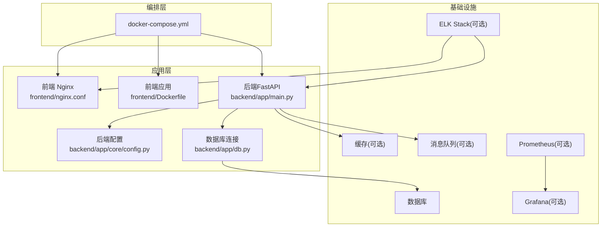
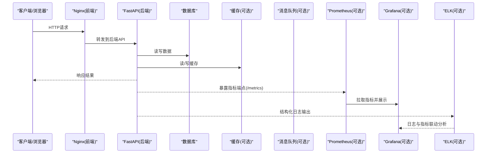
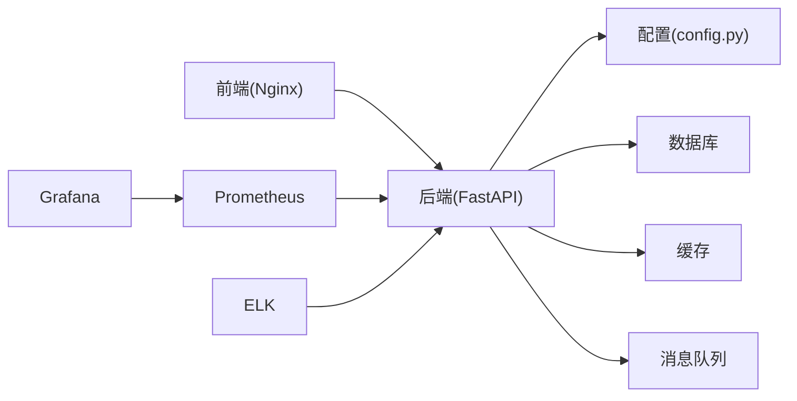

# 监控告警配置

<cite>
**本文引用的文件**   
- [docker-compose.yml](file://docker-compose.yml)
- [backend/app/main.py](file://backend/app/main.py)
- [backend/app/core/config.py](file://backend/app/core/config.py)
- [backend/app/db.py](file://backend/app/db.py)
- [backend/Dockerfile](file://backend/Dockerfile)
- [frontend/nginx.conf](file://frontend/nginx.conf)
- [frontend/Dockerfile](file://frontend/Dockerfile)
- [backend/requirements.txt](file://backend/requirements.txt)
</cite>

## 目录
1. [简介](#简介)
2. [项目结构](#项目结构)
3. [核心组件](#核心组件)
4. [架构总览](#架构总览)
5. [详细组件分析](#详细组件分析)
6. [依赖关系分析](#依赖关系分析)
7. [性能考量](#性能考量)
8. [故障排查指南](#故障排查指南)
9. [结论](#结论)
10. [附录](#附录)

## 简介
本文件面向Talos平台的运维与SRE团队，提供一套完整的监控、告警、日志聚合与可视化配置指南。内容覆盖应用性能监控（APM）、基础设施监控、数据库与缓存指标、告警规则、日志采集与分析、健康检查与自动恢复、仪表板与可视化、以及性能基准测试与容量规划建议。文档基于仓库现有代码与容器编排配置进行落地说明，确保可操作、可复现。

## 项目结构
- 后端为Python FastAPI服务，包含API路由、数据模型、服务层、任务调度等模块；通过Docker镜像构建并运行。
- 前端为Vue/Vite应用，使用Nginx作为静态资源与反向代理服务器，同样通过Docker打包。
- docker-compose.yml负责编排后端、前端、数据库、缓存、消息队列及可选的监控栈组件。

图表来源
- [docker-compose.yml](file://docker-compose.yml)
- [frontend/nginx.conf](file://frontend/nginx.conf)
- [backend/app/main.py](file://backend/app/main.py)
- [backend/app/core/config.py](file://backend/app/core/config.py)
- [backend/app/db.py](file://backend/app/db.py)

章节来源
- [docker-compose.yml](file://docker-compose.yml)
- [backend/app/main.py](file://backend/app/main.py)
- [frontend/nginx.conf](file://frontend/nginx.conf)

## 核心组件
- 后端服务：FastAPI应用入口、配置加载、数据库连接、API路由与业务逻辑。
- 前端服务：Nginx反向代理与静态资源托管，承载Vue应用。
- 基础设施：数据库、缓存、消息队列（按需），以及可选的监控与日志组件（Prometheus、Grafana、ELK）。
- 编排与部署：docker-compose统一编排各组件生命周期与网络。

章节来源
- [backend/app/main.py](file://backend/app/main.py)
- [backend/app/core/config.py](file://backend/app/core/config.py)
- [backend/app/db.py](file://backend/app/db.py)
- [frontend/nginx.conf](file://frontend/nginx.conf)
- [backend/Dockerfile](file://backend/Dockerfile)
- [frontend/Dockerfile](file://frontend/Dockerfile)
- [docker-compose.yml](file://docker-compose.yml)

## 架构总览
下图展示Talos平台在容器编排下的整体监控与日志采集路径，包括应用指标暴露、系统指标抓取、日志集中化与可视化展示。

图表来源
- [backend/app/main.py](file://backend/app/main.py)
- [frontend/nginx.conf](file://frontend/nginx.conf)
- [docker-compose.yml](file://docker-compose.yml)

## 详细组件分析

### 应用性能监控（APM）
- 指标采集
  - 在FastAPI应用中暴露标准指标端点（如/metrics），供Prometheus抓取。
  - 关键指标包括：HTTP请求量、延迟分布、错误率、GC行为、线程/协程状态、数据库连接池使用率、缓存命中率等。
  - 建议在中间件或依赖注入中埋点，统计接口耗时与异常计数。
- 日志收集
  - 后端输出结构化JSON日志（含trace_id、level、service、endpoint、duration等字段）。
  - 通过Filebeat或Fluent Bit将容器日志汇聚至ELK（Elasticsearch + Logstash + Kibana）。
- 错误追踪
  - 集成分布式追踪（如OpenTelemetry），为每个请求生成trace_id，贯穿Nginx→API→DB/Cache/MQ链路。
  - 在异常捕获处记录堆栈与上下文信息，便于快速定位问题。

章节来源
- [backend/app/main.py](file://backend/app/main.py)
- [backend/app/core/config.py](file://backend/app/core/config.py)
- [backend/app/db.py](file://backend/app/db.py)
- [docker-compose.yml](file://docker-compose.yml)

### 基础设施监控
- 服务器资源使用率
  - 通过Node Exporter采集CPU、内存、磁盘I/O、网络吞吐等指标。
  - 在Prometheus中配置抓取目标，并在Grafana中创建主机资源仪表板。
- 数据库性能
  - 采集慢查询数量、连接数、锁等待、缓冲命中率等指标。
  - 结合SQL执行计划与索引使用情况，优化热点查询。
- 缓存命中率
  - 采集缓存命中/未命中次数、过期键数量、内存碎片率等。
  - 针对命中率低的情况，调整TTL策略与预热机制。

章节来源
- [docker-compose.yml](file://docker-compose.yml)
- [backend/app/db.py](file://backend/app/db.py)

### 告警规则配置
- 阈值设置
  - 定义关键指标的阈值（如CPU>80%持续5分钟、错误率>1%、P95延迟>500ms、数据库连接池耗尽等）。
  - 使用PromQL编写规则，支持多条件组合与抑制规则。
- 通知渠道
  - 集成邮件、企业微信、钉钉、Slack等通知方式。
  - 通过Alertmanager进行告警路由、去重与升级策略。
- 告警级别
  - 分为提示、警告、严重三个级别，对应不同处理流程与响应SLA。
  - 对生产环境启用静默期与值班轮转。

章节来源
- [docker-compose.yml](file://docker-compose.yml)

### 日志聚合与分析（ELK Stack）
- 采集器
  - Filebeat/Fluent Bit从容器stdout/stderr采集日志，推送至Logstash或直接写入Elasticsearch。
- 存储与索引
  - 按天滚动索引，保留策略（如30天热数据、90天温数据）。
  - 设置合适的分片与副本，平衡查询性能与存储成本。
- 分析与可视化
  - Kibana创建日志检索面板，关联Trace ID进行链路分析。
  - 与Grafana联动，实现指标与日志的统一视图。

章节来源
- [docker-compose.yml](file://docker-compose.yml)
- [backend/app/main.py](file://backend/app/main.py)

### 健康检查端点与自动恢复
- 健康检查
  - 提供/healthz与/readiness探针，返回服务状态与依赖可用性（数据库、缓存、MQ）。
  - 在Nginx与Kubernetes/编排工具中配置存活与就绪探针。
- 自动恢复
  - 当健康检查失败时，触发重启或切换备用实例。
  - 对数据库连接失败进行重试与退避策略。

章节来源
- [backend/app/main.py](file://backend/app/main.py)
- [frontend/nginx.conf](file://frontend/nginx.conf)
- [docker-compose.yml](file://docker-compose.yml)

### 监控仪表板与可视化
- Prometheus + Grafana
  - 导入官方或自定义仪表板模板，涵盖应用、数据库、缓存、主机资源等维度。
  - 配置变量与过滤，支持按服务、环境、实例筛选。
- Kibana
  - 创建日志搜索与聚合面板，支持时间范围、关键字、字段过滤。
  - 与APM集成，展示调用链与错误分布。

章节来源
- [docker-compose.yml](file://docker-compose.yml)

### 性能基准测试与容量规划
- 基准测试
  - 使用JMeter/Locust对关键接口进行压测，模拟峰值流量与异常场景。
  - 关注TPS、延迟分布、错误率、资源利用率等指标。
- 容量规划
  - 根据压测结果评估CPU、内存、磁盘I/O、网络带宽需求。
  - 设计水平扩展策略（无状态服务扩缩容、数据库读写分离、缓存集群扩容）。

章节来源
- [backend/app/main.py](file://backend/app/main.py)
- [docker-compose.yml](file://docker-compose.yml)

## 依赖关系分析
- 后端依赖数据库、缓存、消息队列（可选），并通过配置中心加载环境变量。
- 前端通过Nginx反向代理访问后端API，静态资源由Nginx直接提供。
- 监控与日志组件通过docker-compose网络互通，Prometheus抓取后端指标，ELK采集日志。

图表来源
- [backend/app/core/config.py](file://backend/app/core/config.py)
- [backend/app/db.py](file://backend/app/db.py)
- [backend/app/main.py](file://backend/app/main.py)
- [frontend/nginx.conf](file://frontend/nginx.conf)
- [docker-compose.yml](file://docker-compose.yml)

章节来源
- [backend/app/core/config.py](file://backend/app/core/config.py)
- [backend/app/db.py](file://backend/app/db.py)
- [backend/app/main.py](file://backend/app/main.py)
- [frontend/nginx.conf](file://frontend/nginx.conf)
- [docker-compose.yml](file://docker-compose.yml)

## 性能考量
- 指标采集频率与采样率需平衡精度与开销，避免对主链路造成阻塞。
- 日志采样与异步写入可降低IO压力，生产环境建议批量发送。
- 数据库连接池大小与超时策略需根据负载动态调整。
- 缓存命中率提升可减少数据库压力，注意热点Key与内存淘汰策略。
- 监控组件自身资源占用需纳入容量规划，避免成为瓶颈。

[本节为通用指导，不直接分析具体文件]

## 故障排查指南
- 常见问题
  - 指标缺失：检查Prometheus抓取配置与后端/metrics端点可达性。
  - 日志丢失：确认Filebeat/Fluent Bit权限与ES连接配置。
  - 健康检查失败：查看依赖服务状态与网络连通性。
- 排查步骤
  - 使用Grafana查看指标趋势，定位异常时间点。
  - 在Kibana中按trace_id检索相关日志，分析调用链。
  - 检查容器日志与系统资源使用，识别资源瓶颈。

章节来源
- [docker-compose.yml](file://docker-compose.yml)
- [backend/app/main.py](file://backend/app/main.py)

## 结论
通过本配置指南，Talos平台可实现端到端的监控、告警、日志聚合与可视化能力。建议在生产环境逐步引入APM与分布式追踪，完善告警规则与自动化恢复机制，持续优化性能与稳定性。

[本节为总结性内容，不直接分析具体文件]

## 附录
- 参考文件
  - [backend/app/main.py](file://backend/app/main.py)
  - [backend/app/core/config.py](file://backend/app/core/config.py)
  - [backend/app/db.py](file://backend/app/db.py)
  - [frontend/nginx.conf](file://frontend/nginx.conf)
  - [backend/Dockerfile](file://backend/Dockerfile)
  - [frontend/Dockerfile](file://frontend/Dockerfile)
  - [docker-compose.yml](file://docker-compose.yml)
  - [backend/requirements.txt](file://backend/requirements.txt)