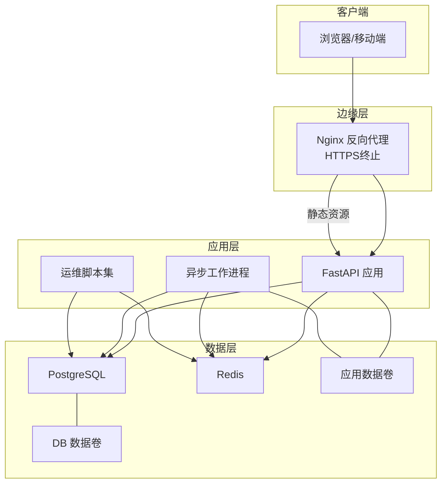
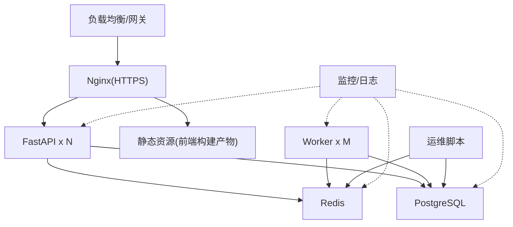
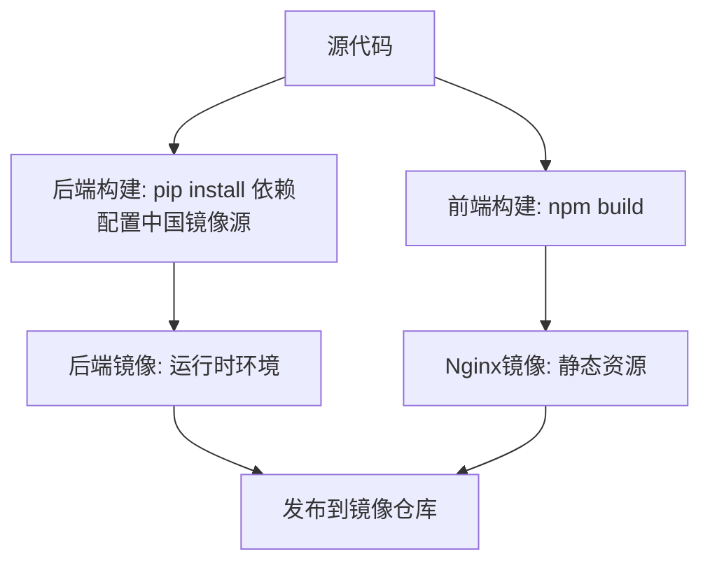
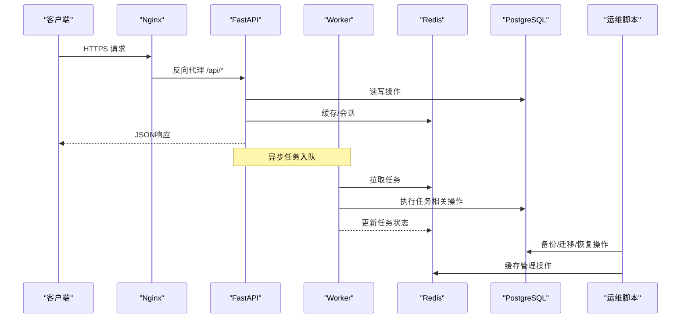
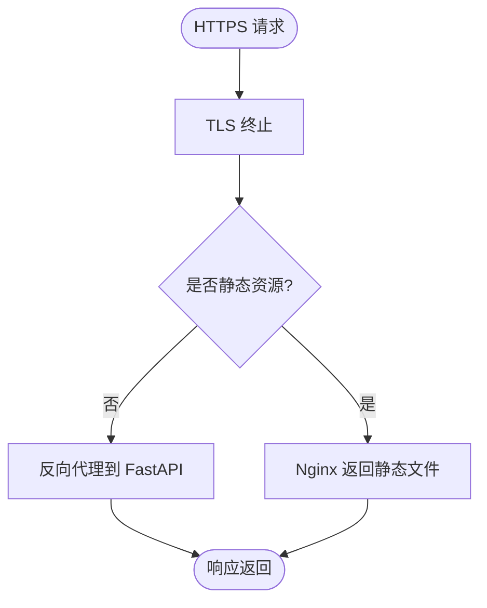
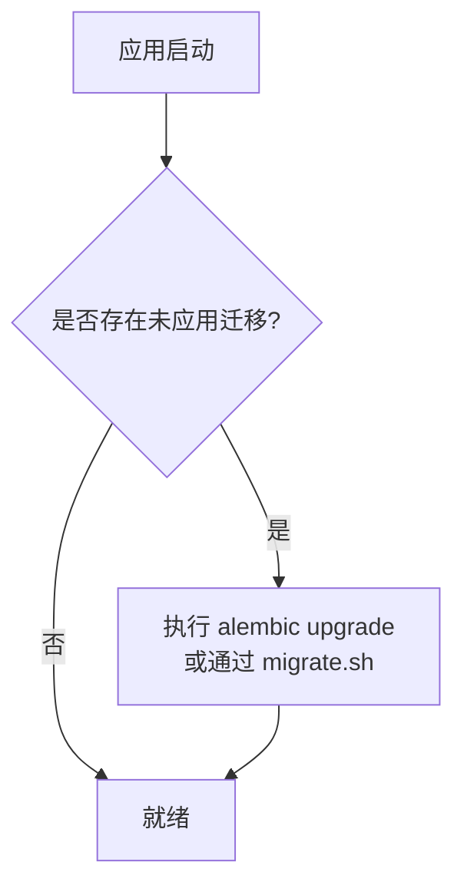
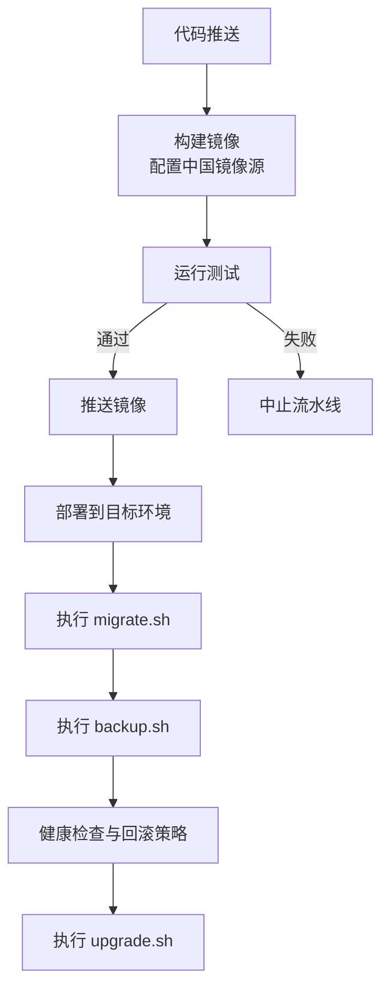
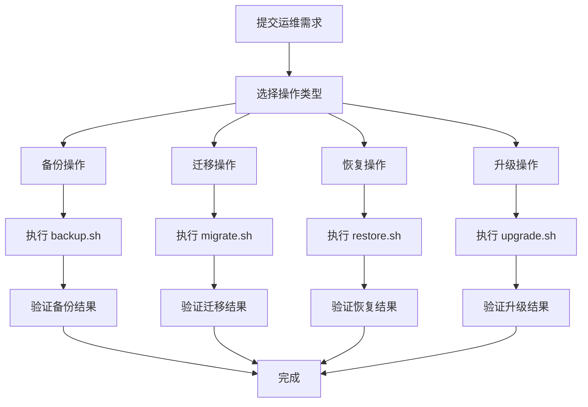
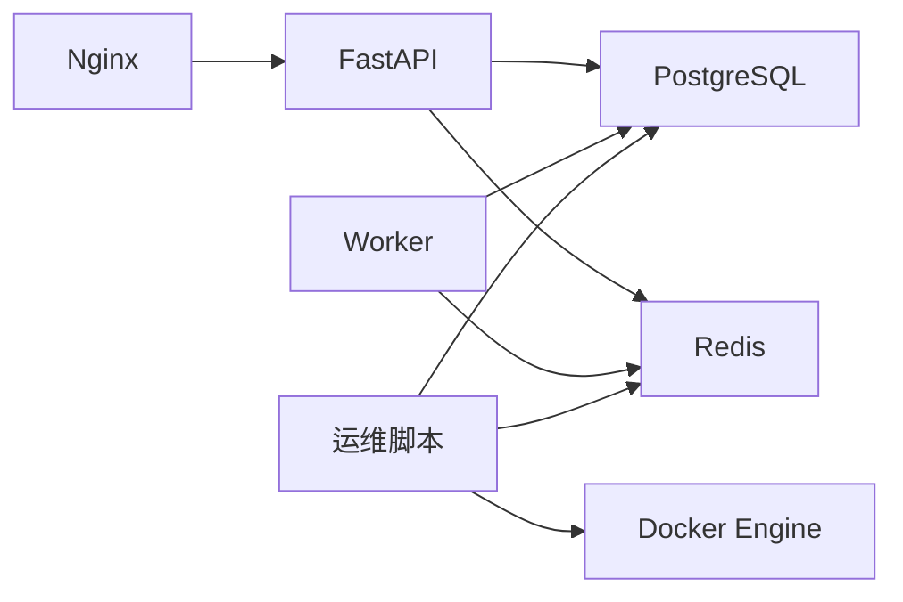

# 部署配置

<cite>
**本文引用的文件**   
- [docker-compose.yml](file://docker-compose.yml)
- [backend/Dockerfile](file://backend/Dockerfile)
- [frontend/Dockerfile](file://frontend/Dockerfile)
- [frontend/nginx.conf](file://frontend/nginx.conf)
- [backend/app/main.py](file://backend/app/main.py)
- [backend/app/core/config.py](file://backend/app/core/config.py)
- [backend/app/db.py](file://backend/app/db.py)
- [backend/alembic.ini](file://backend/alembic.ini)
- [backend/alembic/env.py](file://backend/alembic/env.py)
- [dev.sh](file://dev.sh)
- [dev.ps1](file://dev.ps1)
- [scripts/backup.sh](file://scripts/backup.sh)
- [scripts/migrate.sh](file://scripts/migrate.sh)
- [scripts/restore.sh](file://scripts/restore.sh)
- [scripts/upgrade.sh](file://scripts/upgrade.sh)
</cite>

## 更新摘要
**所做更改**
- 新增完整自动化运维脚本章节，涵盖备份、恢复、升级和数据库迁移操作
- 更新Docker镜像构建部分，反映中国镜像源优化配置和中文字符集支持
- 增强容器编排与服务通信流程，包含新的自动化脚本集成
- 完善故障排查指南，添加脚本执行相关的常见问题解决方案
- 强化生产环境部署架构，包含完整的备份恢复策略和数据持久化方案

## 目录
1. [简介](#简介)
2. [项目结构](#项目结构)
3. [核心组件](#核心组件)
4. [架构总览](#架构总览)
5. [详细组件分析](#详细组件分析)
6. [自动化运维脚本](#自动化运维脚本)
7. [依赖关系分析](#依赖关系分析)
8. [性能考虑](#性能考虑)
9. [故障排查指南](#故障排查指南)
10. [结论](#结论)
11. [附录](#附录)

## 简介
本文件面向生产环境，提供Talos平台的完整部署与运维配置说明。内容覆盖Docker镜像构建、容器编排、网络与安全（反向代理与HTTPS）、环境变量与敏感信息管理、数据库与缓存配置、备份恢复与数据持久化、监控告警、日志收集、CI/CD流水线以及故障排查与性能优化最佳实践。文档以仓库现有配置为基础，结合通用生产实践给出可操作的步骤与注意事项。

**更新** 新增完整的自动化运维脚本体系，支持一键备份、迁移、恢复和升级操作，显著提升运维效率和可靠性。同时优化了Docker配置以支持中文字符集和中国镜像源加速。

## 项目结构
Talos平台采用前后端分离架构：
- 后端：Python FastAPI应用，使用Alembic进行数据库迁移，支持异步任务工作进程。
- 前端：Vue/Vite构建产物由Nginx静态托管，并通过反向代理将API请求转发至后端。
- 编排：通过docker-compose统一编排服务，便于本地开发与生产部署。
- 运维：提供完整的shell脚本集合，实现自动化备份、迁移、恢复和升级操作。

**图示来源**
- [docker-compose.yml](file://docker-compose.yml)
- [frontend/nginx.conf](file://frontend/nginx.conf)
- [backend/app/main.py](file://backend/app/main.py)
- [backend/app/db.py](file://backend/app/db.py)
- [scripts/backup.sh](file://scripts/backup.sh)
- [scripts/migrate.sh](file://scripts/migrate.sh)
- [scripts/restore.sh](file://scripts/restore.sh)
- [scripts/upgrade.sh](file://scripts/upgrade.sh)

**章节来源**
- [docker-compose.yml](file://docker-compose.yml)
- [frontend/nginx.conf](file://frontend/nginx.conf)
- [backend/app/main.py](file://backend/app/main.py)
- [backend/app/db.py](file://backend/app/db.py)

## 核心组件
- 反向代理与静态资源：Nginx负责HTTPS终止、静态资源服务与API反向代理。
- Web应用：FastAPI应用暴露RESTful接口，处理认证、资产、漏洞、报告等业务逻辑。
- 异步任务：独立工作进程执行耗时任务（如导入、报告生成等）。
- 数据库：PostgreSQL作为主存储，配合Alembic进行版本化管理。
- 缓存与会话：Redis用于会话、缓存与任务队列。
- 编排与开发脚本：docker-compose统一编排；dev.sh/dev.ps1简化本地启动。
- **新增** 自动化运维脚本：backup.sh、migrate.sh、restore.sh、upgrade.sh提供完整的运维自动化能力。

**章节来源**
- [docker-compose.yml](file://docker-compose.yml)
- [backend/app/main.py](file://backend/app/main.py)
- [backend/app/db.py](file://backend/app/db.py)
- [backend/alembic.ini](file://backend/alembic.ini)
- [backend/alembic/env.py](file://backend/alembic/env.py)
- [dev.sh](file://dev.sh)
- [dev.ps1](file://dev.ps1)
- [scripts/backup.sh](file://scripts/backup.sh)
- [scripts/migrate.sh](file://scripts/migrate.sh)
- [scripts/restore.sh](file://scripts/restore.sh)
- [scripts/upgrade.sh](file://scripts/upgrade.sh)

## 架构总览
生产环境推荐架构：
- 入口网关：Nginx或云厂商负载均衡+反向代理，启用TLS并配置安全头。
- 应用集群：多副本FastAPI实例，无状态设计，水平扩展。
- 任务集群：多副本Worker，基于Redis队列消费任务。
- 数据层：PostgreSQL主从或托管数据库，定期快照与增量备份；Redis持久化或托管。
- 监控与日志：集中式日志采集（如Filebeat/Fluent Bit），指标采集（Prometheus）与应用埋点。
- **新增** 运维自动化：统一的脚本管理所有运维操作，确保一致性和可追溯性。

[此图为概念性架构图，不直接映射具体源码文件]

## 详细组件分析

### Docker镜像构建
- 后端镜像：基于Python基础镜像，安装依赖，复制代码，设置运行用户与环境变量，暴露端口。
- 前端镜像：多阶段构建，先构建Vite产物，再使用Nginx镜像托管静态资源。
- .dockerignore：排除无关文件，减小镜像体积。
- **更新** 中国镜像源优化：在Dockerfile中配置国内镜像源，加速依赖下载和构建过程。
- **更新** 中文字符集支持：配置UTF-8字符集以支持中文内容处理。

**图示来源**
- [backend/Dockerfile](file://backend/Dockerfile)
- [frontend/Dockerfile](file://frontend/Dockerfile)

**章节来源**
- [backend/Dockerfile](file://backend/Dockerfile)
- [frontend/Dockerfile](file://frontend/Dockerfile)

### 容器编排与服务通信
- docker-compose定义服务：API、Worker、PostgreSQL、Redis、Nginx（可选）。
- 网络：默认bridge网络，服务间通过服务名解析访问。
- 卷：为数据库与应用数据挂载持久卷。
- 环境变量：通过.env或compose env注入敏感配置。
- **更新** 脚本集成：运维脚本可通过docker-compose命令与容器服务交互。

**图示来源**
- [docker-compose.yml](file://docker-compose.yml)
- [backend/app/main.py](file://backend/app/main.py)
- [backend/app/db.py](file://backend/app/db.py)
- [scripts/backup.sh](file://scripts/backup.sh)
- [scripts/migrate.sh](file://scripts/migrate.sh)
- [scripts/restore.sh](file://scripts/restore.sh)
- [scripts/upgrade.sh](file://scripts/upgrade.sh)

**章节来源**
- [docker-compose.yml](file://docker-compose.yml)

### 网络与反向代理（Nginx）
- HTTPS终止：在Nginx配置证书与密钥，启用HTTP/2与安全头。
- 静态资源：前端构建产物由Nginx直接返回。
- API代理：将/api路径转发至后端服务，设置超时与重试策略。

**图示来源**
- [frontend/nginx.conf](file://frontend/nginx.conf)

**章节来源**
- [frontend/nginx.conf](file://frontend/nginx.conf)

### 环境变量与敏感信息管理
- 数据库连接：主机、端口、用户名、密码、库名、SSL模式等。
- Redis连接：主机、端口、密码、数据库索引。
- 邮件服务：SMTP服务器、端口、用户名、密码、发件人地址。
- 第三方API密钥：按需注入，避免硬编码。
- 建议：使用.env模板与密钥管理工具（如Vault或云平台Secrets Manager），在CI中注入，运行时只读挂载。

**章节来源**
- [backend/app/core/config.py](file://backend/app/core/config.py)
- [backend/app/db.py](file://backend/app/db.py)
- [docker-compose.yml](file://docker-compose.yml)

### SSL证书与HTTPS访问
- 证书来源：Let's Encrypt或企业CA签发。
- Nginx配置：指定证书与私钥路径，启用强加密套件与HSTS。
- 自动续期：通过certbot或云厂商自动化流程。

**章节来源**
- [frontend/nginx.conf](file://frontend/nginx.conf)

### 数据库与迁移
- 连接参数：通过环境变量注入，支持SSL与连接池。
- Alembic：迁移脚本与版本控制，确保环境一致性。
- 初始化：首次部署执行迁移与种子数据（如有）。
- **更新** 自动化迁移：通过migrate.sh脚本统一管理数据库迁移操作。

**图示来源**
- [backend/alembic.ini](file://backend/alembic.ini)
- [backend/alembic/env.py](file://backend/alembic/env.py)
- [backend/app/db.py](file://backend/app/db.py)
- [scripts/migrate.sh](file://scripts/migrate.sh)

**章节来源**
- [backend/alembic.ini](file://backend/alembic.ini)
- [backend/alembic/env.py](file://backend/alembic/env.py)
- [backend/app/db.py](file://backend/app/db.py)

### 备份恢复与数据持久化
- PostgreSQL：定期全量快照与WAL归档，保留策略按合规要求设定。
- Redis：启用AOF/RDB持久化，定期快照。
- 应用数据：导出文件、报告等挂载卷，纳入备份系统。
- 恢复演练：定期验证恢复流程与RTO/RPO目标。
- **更新** 自动化备份：通过backup.sh脚本实现定时备份和手动备份操作。
- **更新** 自动化恢复：通过restore.sh脚本快速恢复数据和配置。

**章节来源**
- [docker-compose.yml](file://docker-compose.yml)
- [scripts/backup.sh](file://scripts/backup.sh)
- [scripts/restore.sh](file://scripts/restore.sh)

### 监控告警与日志收集
- 应用指标：健康检查端点、业务关键指标埋点。
- 日志：结构化JSON日志，统一输出到stdout/stderr，由采集器收集。
- 指标采集：Prometheus抓取应用暴露的指标端点。
- 告警：基于阈值与异常率配置告警规则，通知渠道（邮件、IM）。

**章节来源**
- [backend/app/main.py](file://backend/app/main.py)

### CI/CD流水线与自动化部署
- 构建：后端依赖安装与前端构建产物生成。
- 测试：单元测试与集成测试，失败阻断流水线。
- 镜像构建与推送：构建镜像并推送到镜像仓库。
- 部署：更新编排配置并滚动重启，执行数据库迁移与健康检查。
- **更新** 脚本集成：CI/CD流程中集成运维脚本，实现自动化部署和回滚。

[此图为概念性流程图，不直接映射具体源码文件]

### 开发环境与快速启动
- dev.sh/dev.ps1：一键启动本地开发环境，包含依赖安装、数据库初始化与热重载。
- 调试：开启调试模式与详细日志，便于问题定位。

**章节来源**
- [dev.sh](file://dev.sh)
- [dev.ps1](file://dev.ps1)

## 自动化运维脚本

### 备份脚本 (backup.sh)
- 功能：自动备份PostgreSQL数据库和Redis数据
- 特性：支持增量备份、压缩存储、过期清理
- 使用：`./scripts/backup.sh` 或 `./scripts/backup.sh --full` 进行全量备份

### 迁移脚本 (migrate.sh)
- 功能：执行数据库迁移和版本升级
- 特性：支持回滚、预检查、事务保护
- 使用：`./scripts/migrate.sh` 或 `./scripts/migrate.sh --rollback` 进行回滚

### 恢复脚本 (restore.sh)
- 功能：从备份文件恢复数据库和配置
- 特性：支持选择性恢复、完整性校验、冲突处理
- 使用：`./scripts/restore.sh <backup_file>` 指定备份文件进行恢复

### 升级脚本 (upgrade.sh)
- 功能：执行系统升级和版本切换
- 特性：支持灰度发布、健康检查、自动回滚
- 使用：`./scripts/upgrade.sh <version>` 指定目标版本进行升级

**图示来源**
- [scripts/backup.sh](file://scripts/backup.sh)
- [scripts/migrate.sh](file://scripts/migrate.sh)
- [scripts/restore.sh](file://scripts/restore.sh)
- [scripts/upgrade.sh](file://scripts/upgrade.sh)

**章节来源**
- [scripts/backup.sh](file://scripts/backup.sh)
- [scripts/migrate.sh](file://scripts/migrate.sh)
- [scripts/restore.sh](file://scripts/restore.sh)
- [scripts/upgrade.sh](file://scripts/upgrade.sh)

## 依赖关系分析
- 外部依赖：PostgreSQL、Redis、Nginx（或云网关）。
- 内部依赖：API依赖数据库与缓存；Worker依赖队列与数据库。
- 配置依赖：环境变量驱动行为，避免硬编码。
- **更新** 脚本依赖：运维脚本依赖docker-compose和相应的数据库客户端工具。

**图示来源**
- [docker-compose.yml](file://docker-compose.yml)
- [backend/app/main.py](file://backend/app/main.py)
- [backend/app/db.py](file://backend/app/db.py)
- [scripts/backup.sh](file://scripts/backup.sh)
- [scripts/migrate.sh](file://scripts/migrate.sh)
- [scripts/restore.sh](file://scripts/restore.sh)
- [scripts/upgrade.sh](file://scripts/upgrade.sh)

**章节来源**
- [docker-compose.yml](file://docker-compose.yml)

## 性能考虑
- 应用层：
  - 启用连接池与异步IO，合理设置并发与线程数。
  - 缓存热点数据，减少数据库压力。
  - 静态资源压缩与缓存头优化。
- 数据库层：
  - 索引优化与查询计划分析。
  - 读写分离与连接池调优。
- 缓存层：
  - 合理设置过期时间与淘汰策略。
  - 监控命中率与内存使用。
- 反向代理：
  - 启用Gzip/Brotli压缩与HTTP/2。
  - 合理设置超时与重试策略。
- 监控与容量规划：
  - 建立基线指标与容量预警。
  - 压测与弹性伸缩策略。
- **更新** 脚本优化：
  - 批量操作优化，减少I/O开销。
  - 并行处理提升备份恢复效率。
  - 智能压缩算法降低存储空间占用。

[本节为通用指导，不直接分析具体文件]

## 故障排查指南
- 常见问题：
  - 数据库连接失败：检查连接参数、网络可达性与SSL配置。
  - Redis连接失败：检查密码、端口与ACL权限。
  - 迁移失败：核对迁移脚本与数据库版本。
  - HTTPS错误：检查证书路径、权限与域名解析。
  - **新增** 脚本执行失败：检查脚本权限、依赖工具和配置文件。
  - **新增** 备份恢复问题：验证备份文件完整性和权限设置。
  - **新增** 升级失败：检查版本兼容性和依赖关系。
- 诊断方法：
  - 查看服务日志与指标。
  - 使用容器命令进入服务执行连通性测试。
  - 逐步隔离问题域（网络、配置、依赖）。
  - **新增** 检查脚本执行日志和输出信息。
  - **新增** 验证Docker容器状态和网络连通性。
- 回滚策略：
  - 镜像版本回滚与数据库迁移回退脚本。
  - **新增** 使用restore.sh快速恢复到稳定版本。
  - **新增** 利用backup.sh创建的备份点进行回滚。

**章节来源**
- [backend/app/db.py](file://backend/app/db.py)
- [backend/alembic.ini](file://backend/alembic.ini)
- [frontend/nginx.conf](file://frontend/nginx.conf)
- [scripts/backup.sh](file://scripts/backup.sh)
- [scripts/migrate.sh](file://scripts/migrate.sh)
- [scripts/restore.sh](file://scripts/restore.sh)
- [scripts/upgrade.sh](file://scripts/upgrade.sh)

## 结论
通过Docker容器化与docker-compose编排，Talos平台实现了可移植、可扩展的生产部署方案。结合Nginx反向代理与HTTPS、PostgreSQL与Redis的数据层、Alembic迁移与备份策略、监控与日志体系、以及CI/CD自动化，能够保障系统的稳定性、安全性与可维护性。**新增的自动化运维脚本体系**进一步提升了运维效率和可靠性，支持一键备份、迁移、恢复和升级操作。建议在生产环境中持续完善监控告警、容量规划与灾备演练，确保业务连续性与数据安全。

## 附录
- 环境变量清单（示例键名，实际值请通过密钥管理注入）：
  - DATABASE_HOST、DATABASE_PORT、DATABASE_USER、DATABASE_PASSWORD、DATABASE_NAME、DATABASE_SSL_MODE
  - REDIS_HOST、REDIS_PORT、REDIS_PASSWORD、REDIS_DB
  - SMTP_SERVER、SMTP_PORT、SMTP_USER、SMTP_PASSWORD、SMTP_FROM
  - THIRD_PARTY_API_KEY_1、THIRD_PARTY_API_KEY_2
- 安全建议：
  - 最小权限原则与网络隔离。
  - 定期轮换密钥与证书。
  - 审计与访问控制。
- **新增** 运维脚本使用指南：
  - 备份：`./scripts/backup.sh [--full] [--compress]`
  - 迁移：`./scripts/migrate.sh [--rollback] [--dry-run]`
  - 恢复：`./scripts/restore.sh <backup_file> [--force]`
  - 升级：`./scripts/upgrade.sh <version> [--check-only]`
- **新增** 中国镜像源配置：
  - Docker镜像源：阿里云、腾讯云等国内镜像仓库
  - Python包源：pip配置国内镜像源
  - Node.js包源：npm配置淘宝镜像源
- **新增** 中文字符集支持：
  - 系统语言环境：LANG=zh_CN.UTF-8
  - 数据库字符集：UTF-8 with Chinese collation
  - 应用编码：UTF-8 everywhere