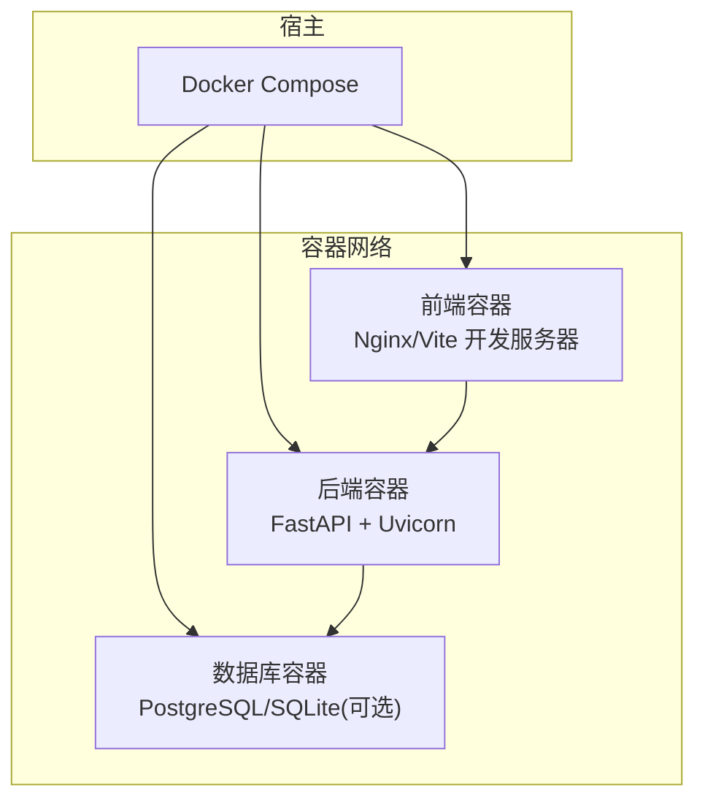
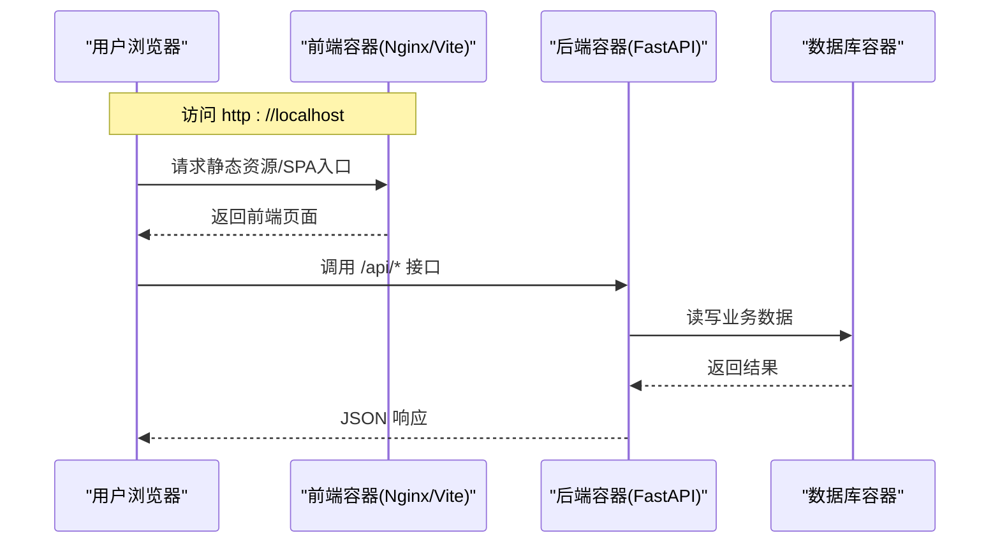
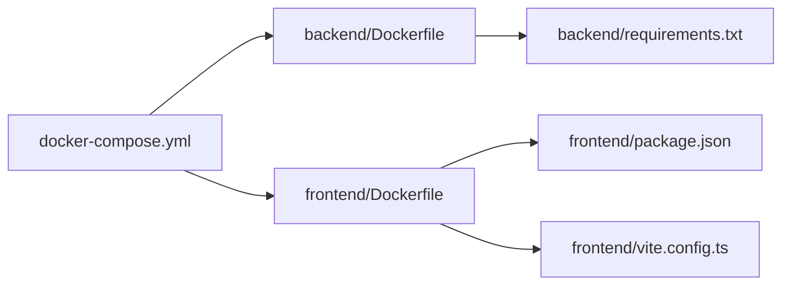

# 快速开始

<cite>
**本文引用的文件**   
- [docker-compose.yml](file://docker-compose.yml)
- [backend/Dockerfile](file://backend/Dockerfile)
- [backend/app/main.py](file://backend/app/main.py)
- [backend/requirements.txt](file://backend/requirements.txt)
- [frontend/Dockerfile](file://frontend/Dockerfile)
- [frontend/package.json](file://frontend/package.json)
- [frontend/vite.config.ts](file://frontend/vite.config.ts)
- [dev.sh](file://dev.sh)
- [dev.ps1](file://dev.ps1)
</cite>

## 目录
1. [简介](#简介)
2. [项目结构](#项目结构)
3. [核心组件](#核心组件)
4. [架构总览](#架构总览)
5. [详细组件分析](#详细组件分析)
6. [依赖分析](#依赖分析)
7. [性能考虑](#性能考虑)
8. [故障排查指南](#故障排查指南)
9. [结论](#结论)
10. [附录](#附录)

## 简介
本指南面向首次使用 Talos 漏洞管理平台的用户与开发者，提供从环境准备、一键部署到本地开发、首次登录与基本操作的完整流程。通过 Docker Compose 可一键拉起前后端服务；同时提供独立的前后端开发模式，便于快速迭代。文末包含常见问题排查与安装验证方法，帮助你快速上手并稳定运行平台。

## 项目结构
Talos 采用前后端分离架构：
- 后端：基于 Python（FastAPI）的 REST API，含数据库迁移、任务调度与导出等能力。
- 前端：基于 Vue + TypeScript + Vite 的单页应用，提供资产管理、漏洞管理、报告编辑等功能界面。
- 容器化：根目录提供 docker-compose.yml 统一编排；前后端各自提供 Dockerfile。
- 开发脚本：提供 dev.sh 与 dev.ps1 用于本地快速启动开发环境。

图表来源
- [docker-compose.yml](file://docker-compose.yml)
- [backend/Dockerfile](file://backend/Dockerfile)
- [frontend/Dockerfile](file://frontend/Dockerfile)

章节来源
- [docker-compose.yml](file://docker-compose.yml)
- [backend/Dockerfile](file://backend/Dockerfile)
- [frontend/Dockerfile](file://frontend/Dockerfile)

## 核心组件
- 后端服务：提供认证、资产、漏洞、报表、导入导出、仪表盘等 API。
- 前端应用：路由、页面组件、状态管理与 API 客户端封装。
- 数据层：数据库模型与迁移脚本，支持版本化管理。
- 任务系统：后台工作进程处理耗时任务（如解析、导出）。
- 构建与运行：Docker 镜像构建、环境变量配置、端口映射。

章节来源
- [backend/app/main.py](file://backend/app/main.py)
- [backend/requirements.txt](file://backend/requirements.txt)
- [frontend/package.json](file://frontend/package.json)
- [frontend/vite.config.ts](file://frontend/vite.config.ts)

## 架构总览
下图展示生产与开发两种典型运行方式的关键交互路径。

图表来源
- [docker-compose.yml](file://docker-compose.yml)
- [backend/app/main.py](file://backend/app/main.py)
- [frontend/Dockerfile](file://frontend/Dockerfile)

## 详细组件分析

### 环境准备要求
- 操作系统：Windows 10/11、macOS、Linux（推荐 x86_64）
- Docker 与 Docker Compose：用于一键部署与本地开发
- Node.js（仅本地开发）：建议 LTS 版本
- Python（仅本地开发）：建议 3.10+
- 端口占用：默认 80/443（生产 Nginx）、8000（后端 API），请确保未被占用

说明：
- 生产环境仅需 Docker 与 Docker Compose。
- 本地开发需额外安装 Node.js 与 Python，以便独立启动前后端并启用热重载。

章节来源
- [docker-compose.yml](file://docker-compose.yml)
- [frontend/package.json](file://frontend/package.json)
- [backend/requirements.txt](file://backend/requirements.txt)

### 使用 Docker Compose 一键部署
步骤概览：
1. 克隆仓库至本地。
2. 进入项目根目录。
3. 根据需要修改配置文件（见“配置文件说明”）。
4. 执行 docker compose up -d 启动所有服务。
5. 打开浏览器访问 http://localhost（或配置的端口）。

配置文件说明：
- 端口映射：可在编排文件中调整前端与后端端口。
- 环境变量：后端可通过环境变量注入数据库连接、密钥等敏感信息。
- 数据持久化：数据库卷挂载路径可按需修改。

启动后验证：
- 浏览器访问前端地址，确认页面加载正常。
- 调用后端健康检查接口（如有）确认服务可用。

章节来源
- [docker-compose.yml](file://docker-compose.yml)
- [backend/Dockerfile](file://backend/Dockerfile)
- [frontend/Dockerfile](file://frontend/Dockerfile)

### 本地开发环境搭建（前后端独立启动）
目标：实现前后端分离开发，具备热重载与调试能力。

前置条件：
- 已安装 Docker、Node.js、Python。
- 数据库建议使用容器化 PostgreSQL，或使用 SQLite（轻量测试）。

后端开发：
- 安装依赖：根据 requirements.txt 安装 Python 依赖。
- 设置环境变量：配置数据库连接、JWT 密钥等。
- 启动服务：运行后端主程序，监听 8000 端口（可配置）。
- 数据库迁移：执行 Alembic 迁移以初始化表结构。

前端开发：
- 安装依赖：根据 package.json 安装 Node 依赖。
- 配置代理：在 vite.config.ts 中配置 /api 代理到后端 8000 端口。
- 启动开发服务器：运行 Vite 开发服务器，默认端口 5173。
- 热重载：修改代码即时生效，提升开发效率。

跨域与代理：
- 开发阶段通过 Vite 代理转发 /api 请求至后端，避免 CORS 问题。
- 生产阶段由 Nginx 统一反向代理。

章节来源
- [backend/requirements.txt](file://backend/requirements.txt)
- [backend/app/main.py](file://backend/app/main.py)
- [frontend/package.json](file://frontend/package.json)
- [frontend/vite.config.ts](file://frontend/vite.config.ts)

### 首次登录与基本操作教程
首次登录：
- 访问前端地址，进入登录页。
- 使用管理员账号登录（若未预置，按提示创建或通过后端接口初始化）。
- 登录后进入仪表盘，查看系统概览。

基本操作：
- 资产管理：新增、编辑、删除资产，批量导入。
- 漏洞管理：录入漏洞、关联资产、更新状态。
- 报告编辑：在线编辑报告内容，导出为文档。
- 用户管理：分配角色与权限。

提示：
- 首次使用前建议先导入基础数据（资产模板、漏洞库等）。
- 定期备份数据库与上传文件。

章节来源
- [frontend/src/views/Login.vue](file://frontend/src/views/Login.vue)
- [frontend/src/views/Dashboard.vue](file://frontend/src/views/Dashboard.vue)
- [backend/app/api/v1/auth.py](file://backend/app/api/v1/auth.py)
- [backend/app/api/v1/assets.py](file://backend/app/api/v1/assets.py)
- [backend/app/api/v1/vulns.py](file://backend/app/api/v1/vulns.py)
- [backend/app/api/v1/reports.py](file://backend/app/api/v1/reports.py)

### 常见环境问题与解决方案
- 端口冲突：修改编排文件中的端口映射，或停止占用端口的进程。
- 数据库连接失败：检查环境变量、网络连通性与凭据是否正确。
- 前端无法访问后端：确认代理配置正确，后端服务已启动且端口可达。
- 权限不足：确保运行用户对数据卷有读写权限。
- 镜像拉取失败：检查网络与镜像源，必要时更换镜像仓库。

章节来源
- [docker-compose.yml](file://docker-compose.yml)
- [backend/app/main.py](file://backend/app/main.py)
- [frontend/vite.config.ts](file://frontend/vite.config.ts)

### 验证安装成功的测试方法与演示
- 前端页面：访问 http://localhost，确认无报错。
- 后端接口：调用健康检查或获取当前用户信息接口，确认返回正常。
- 数据写入：新增一个资产或漏洞，刷新列表确认存在。
- 报告导出：生成一份报告并下载，确认文件可用。

章节来源
- [backend/app/main.py](file://backend/app/main.py)
- [frontend/src/views/AssetList.vue](file://frontend/src/views/AssetList.vue)
- [frontend/src/views/VulnList.vue](file://frontend/src/views/VulnList.vue)
- [frontend/src/views/ReportEditor.vue](file://frontend/src/views/ReportEditor.vue)

## 依赖分析
- 后端依赖：Python 包通过 requirements.txt 管理，运行时由 Docker 镜像安装。
- 前端依赖：Node 包通过 package.json 管理，开发时安装依赖，构建时打包静态资源。
- 容器编排：docker-compose.yml 定义服务、网络、卷与端口映射。

图表来源
- [docker-compose.yml](file://docker-compose.yml)
- [backend/Dockerfile](file://backend/Dockerfile)
- [frontend/Dockerfile](file://frontend/Dockerfile)
- [backend/requirements.txt](file://backend/requirements.txt)
- [frontend/package.json](file://frontend/package.json)
- [frontend/vite.config.ts](file://frontend/vite.config.ts)

章节来源
- [docker-compose.yml](file://docker-compose.yml)
- [backend/requirements.txt](file://backend/requirements.txt)
- [frontend/package.json](file://frontend/package.json)

## 性能考虑
- 数据库连接池：合理设置连接数，避免过多连接导致资源耗尽。
- 缓存策略：对热点数据（如字典、配置）引入缓存减少重复查询。
- 异步任务：将耗时操作放入后台任务队列，避免阻塞请求。
- 前端优化：按需加载路由与组件，开启 Gzip/Brotli 压缩。
- 容器资源限制：为各服务设置 CPU/内存上限，防止相互影响。

[本节为通用指导，不直接分析具体文件]

## 故障排查指南
- 日志收集：查看容器日志定位错误堆栈与上下文。
- 网络连通性：使用 curl 或浏览器测试后端接口是否可达。
- 数据库状态：检查迁移是否成功、表是否存在、索引是否正常。
- 权限问题：确认文件与目录权限，尤其是上传目录与数据库卷。
- 环境变量：核对密钥、URL、端口等关键变量是否配置正确。

章节来源
- [docker-compose.yml](file://docker-compose.yml)
- [backend/app/main.py](file://backend/app/main.py)

## 结论
通过本指南，你可以快速完成 Talos 的环境准备、一键部署与本地开发搭建，并完成首次登录与基础操作。遇到问题时，参考故障排查部分即可高效定位与解决。建议在生产环境做好备份、监控与安全加固，保障平台稳定运行。

## 附录
- 常用命令：
  - 启动：docker compose up -d
  - 停止：docker compose down
  - 查看日志：docker compose logs -f
  - 重建镜像：docker compose build --no-cache
- 开发脚本：
  - 使用 dev.sh 或 dev.ps1 快速启动本地开发环境（视操作系统选择）。

章节来源
- [dev.sh](file://dev.sh)
- [dev.ps1](file://dev.ps1)
- [docker-compose.yml](file://docker-compose.yml)