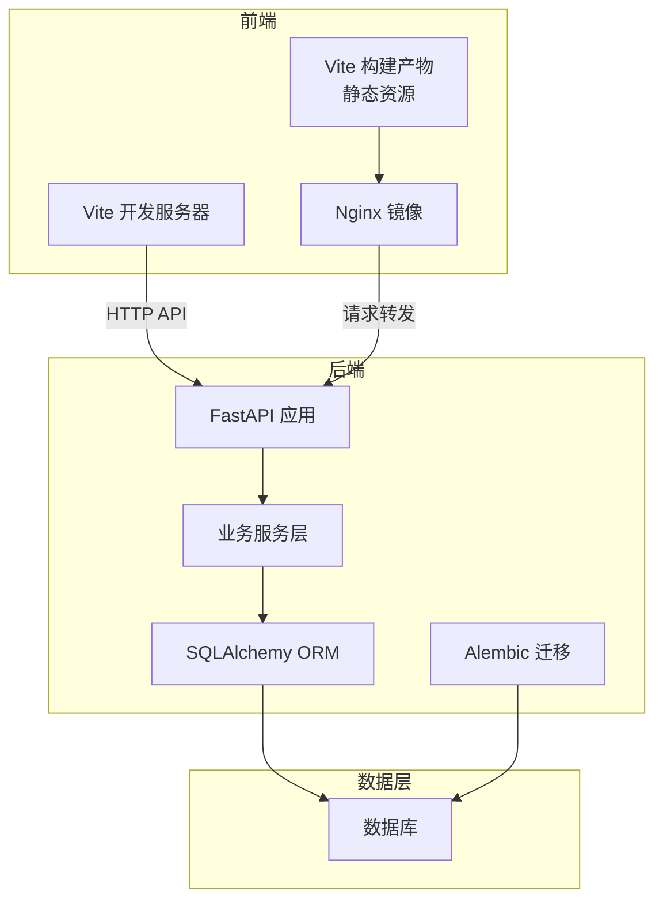
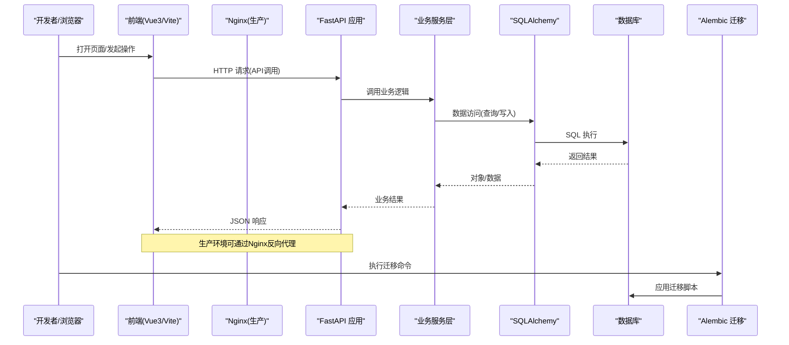
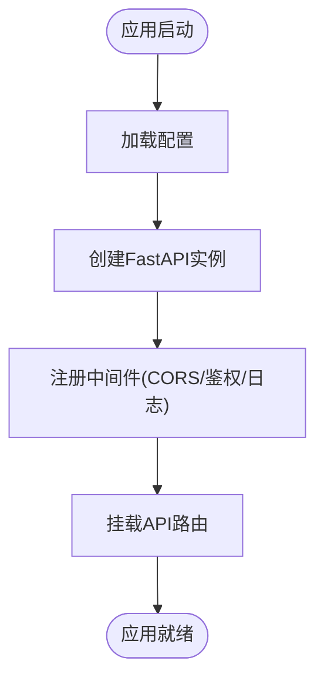
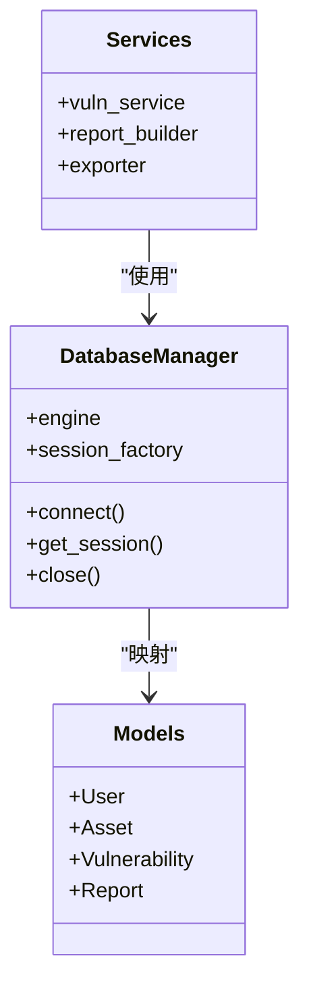
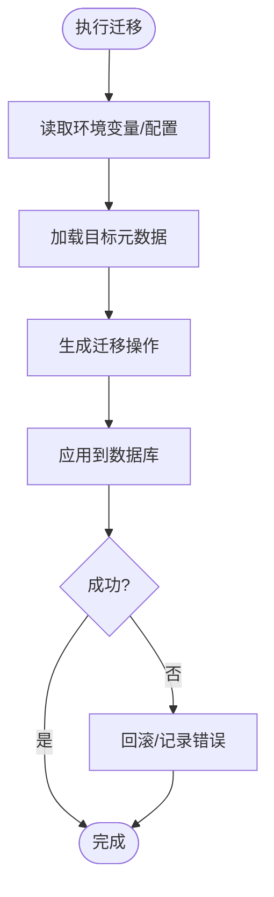
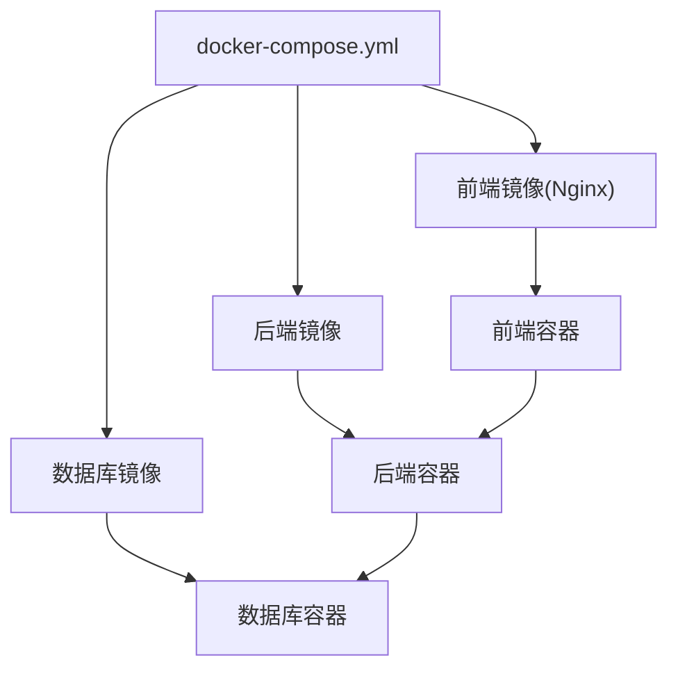

# 技术栈介绍

<cite>
**本文引用的文件**   
- [backend/app/main.py](file://backend/app/main.py)
- [backend/app/core/config.py](file://backend/app/core/config.py)
- [backend/app/db.py](file://backend/app/db.py)
- [backend/alembic.ini](file://backend/alembic.ini)
- [backend/alembic/env.py](file://backend/alembic/env.py)
- [backend/Dockerfile](file://backend/Dockerfile)
- [frontend/package.json](file://frontend/package.json)
- [frontend/vite.config.ts](file://frontend/vite.config.ts)
- [frontend/tailwind.config.js](file://frontend/tailwind.config.js)
- [frontend/Dockerfile](file://frontend/Dockerfile)
- [docker-compose.yml](file://docker-compose.yml)
</cite>

## 目录
1. [简介](#简介)
2. [项目结构](#项目结构)
3. [核心组件](#核心组件)
4. [架构总览](#架构总览)
5. [详细组件分析](#详细组件分析)
6. [依赖与兼容性分析](#依赖与兼容性分析)
7. [性能考量](#性能考量)
8. [故障排查指南](#故障排查指南)
9. [结论](#结论)
10. [附录](#附录)

## 简介
本章节面向Talos漏洞管理平台的技术栈，系统阐述后端FastAPI + SQLAlchemy + Alembic、前端Vue3 + TypeScript + Vite + TailwindCSS以及Docker容器化部署的选型原因与优势，并给出前后端分离架构图和数据流向说明。文档同时覆盖版本兼容性与依赖关系、性能优化建议与常见问题排查路径，帮助读者快速理解并高效使用平台。

## 项目结构
项目采用前后端分离的组织方式：
- 后端位于 backend 目录，基于Python生态，包含FastAPI应用入口、配置、数据库连接、Alembic迁移、API路由、领域模型与服务层等。
- 前端位于 frontend 目录，基于Vue3 + TypeScript + Vite构建，使用TailwindCSS进行样式开发，并通过Nginx镜像进行静态资源服务。
- 根目录提供 docker-compose.yml 用于编排后端、前端与数据库等服务的联合启动。

**图表来源** 
- [backend/app/main.py](file://backend/app/main.py)
- [backend/app/db.py](file://backend/app/db.py)
- [backend/alembic/env.py](file://backend/alembic/env.py)
- [frontend/vite.config.ts](file://frontend/vite.config.ts)
- [frontend/Dockerfile](file://frontend/Dockerfile)
- [docker-compose.yml](file://docker-compose.yml)

**章节来源**
- [backend/app/main.py](file://backend/app/main.py)
- [backend/app/db.py](file://backend/app/db.py)
- [backend/alembic/env.py](file://backend/alembic/env.py)
- [frontend/vite.config.ts](file://frontend/vite.config.ts)
- [frontend/Dockerfile](file://frontend/Dockerfile)
- [docker-compose.yml](file://docker-compose.yml)

## 核心组件
- 后端框架：FastAPI
  - 优势：异步高性能、自动OpenAPI文档生成、类型提示驱动、依赖注入体系完善，适合高并发API场景。
  - 关键实现点：应用入口初始化、中间件注册、路由挂载、依赖注入与配置管理。
- ORM与数据库：SQLAlchemy
  - 优势：成熟的对象关系映射、事务支持、连接池、异步扩展友好，便于复杂查询与模型维护。
  - 关键实现点：引擎与会话管理、模型定义、查询封装、错误处理。
- 数据库迁移：Alembic
  - 优势：版本化管理、可回滚、与环境解耦，保障多环境一致性。
  - 关键实现点：迁移脚本组织、环境变量驱动的数据库URL、自动化迁移执行。
- 前端工程化：Vue3 + TypeScript + Vite + TailwindCSS
  - 优势：TypeScript增强类型安全；Vite极速开发与构建；TailwindCSS原子化样式提升开发效率；Vue3组合式API提升组件复用性。
  - 关键实现点：路由、状态管理、API客户端封装、构建与样式管线。
- 容器化与编排：Docker + docker-compose
  - 优势：环境一致、一键部署、可扩展性强，支持前后端与数据库统一编排。

**章节来源**
- [backend/app/main.py](file://backend/app/main.py)
- [backend/app/core/config.py](file://backend/app/core/config.py)
- [backend/app/db.py](file://backend/app/db.py)
- [backend/alembic.ini](file://backend/alembic.ini)
- [backend/alembic/env.py](file://backend/alembic/env.py)
- [frontend/package.json](file://frontend/package.json)
- [frontend/vite.config.ts](file://frontend/vite.config.ts)
- [frontend/tailwind.config.js](file://frontend/tailwind.config.js)
- [frontend/Dockerfile](file://frontend/Dockerfile)
- [backend/Dockerfile](file://backend/Dockerfile)
- [docker-compose.yml](file://docker-compose.yml)

## 架构总览
下图展示Talos平台的整体架构：前端通过Nginx或Vite开发服务器访问后端FastAPI接口；后端通过SQLAlchemy与数据库交互；Alembic负责数据库迁移；docker-compose协调各服务运行。

**图表来源** 
- [backend/app/main.py](file://backend/app/main.py)
- [backend/app/db.py](file://backend/app/db.py)
- [backend/alembic/env.py](file://backend/alembic/env.py)
- [frontend/vite.config.ts](file://frontend/vite.config.ts)
- [frontend/Dockerfile](file://frontend/Dockerfile)
- [docker-compose.yml](file://docker-compose.yml)

## 详细组件分析

### FastAPI 应用与配置
- 应用入口与生命周期
  - 应用初始化、中间件注册、路由挂载、异常处理与日志配置。
- 配置管理
  - 集中化的配置加载（如数据库URL、密钥、跨域设置），支持环境变量注入。
- 依赖注入
  - 通过依赖注入获取数据库会话、认证上下文、权限校验等，提高模块内聚与可测试性。

**图表来源** 
- [backend/app/main.py](file://backend/app/main.py)
- [backend/app/core/config.py](file://backend/app/core/config.py)

**章节来源**
- [backend/app/main.py](file://backend/app/main.py)
- [backend/app/core/config.py](file://backend/app/core/config.py)

### SQLAlchemy ORM 与数据库连接
- 连接与会话
  - 引擎创建、连接池参数、会话工厂与异步支持。
- 模型与查询
  - 领域模型定义、关系映射、常用查询封装、事务边界控制。
- 错误处理
  - 数据库异常捕获、重试策略、降级与告警。

**图表来源** 
- [backend/app/db.py](file://backend/app/db.py)

**章节来源**
- [backend/app/db.py](file://backend/app/db.py)

### Alembic 数据库迁移
- 迁移脚本与环境
  - env.py 中读取数据库URL、目标元数据、批量模式与脚本模板。
- 版本管理与回滚
  - 通过 alembic.ini 配置迁移目录与脚本，支持升级、降级与历史版本查看。
- 自动化集成
  - 在CI/CD或容器启动时执行迁移，确保数据一致性。

**图表来源** 
- [backend/alembic/env.py](file://backend/alembic/env.py)
- [backend/alembic.ini](file://backend/alembic.ini)

**章节来源**
- [backend/alembic/env.py](file://backend/alembic/env.py)
- [backend/alembic.ini](file://backend/alembic.ini)

### 前端工程化：Vue3 + TypeScript + Vite + TailwindCSS
- 构建与开发体验
  - Vite提供极速热更新与按需编译；TypeScript增强类型安全与IDE支持；Vue3组合式API提升组件复用。
- 样式与主题
  - TailwindCSS原子化类名，减少自定义CSS，提升一致性与可维护性。
- 路由与状态
  - 前端路由管理页面跳转；状态管理模块（如认证状态）与API客户端封装。

**图表来源** 
- [frontend/vite.config.ts](file://frontend/vite.config.ts)
- [frontend/tailwind.config.js](file://frontend/tailwind.config.js)
- [frontend/package.json](file://frontend/package.json)

**章节来源**
- [frontend/vite.config.ts](file://frontend/vite.config.ts)
- [frontend/tailwind.config.js](file://frontend/tailwind.config.js)
- [frontend/package.json](file://frontend/package.json)

### Docker 容器化部署
- 后端镜像
  - 基于轻量级Python基础镜像，安装依赖、拷贝代码、暴露端口、健康检查。
- 前端镜像
  - 构建静态资源后由Nginx提供服务，减少运行时依赖。
- 编排与服务发现
  - docker-compose 统一管理后端、前端、数据库等服务的网络、卷与依赖顺序。

**图表来源** 
- [backend/Dockerfile](file://backend/Dockerfile)
- [frontend/Dockerfile](file://frontend/Dockerfile)
- [docker-compose.yml](file://docker-compose.yml)

**章节来源**
- [backend/Dockerfile](file://backend/Dockerfile)
- [frontend/Dockerfile](file://frontend/Dockerfile)
- [docker-compose.yml](file://docker-compose.yml)

## 依赖与兼容性分析
- 后端依赖
  - FastAPI：与Python版本、Uvicorn/Gunicorn、Pydantic、Starlette的版本需匹配，确保异步IO与中间件行为稳定。
  - SQLAlchemy：与数据库驱动（如psycopg2、asyncpg）版本需兼容，注意连接池与事务语义差异。
  - Alembic：与SQLAlchemy版本绑定，迁移脚本需遵循其API演进。
- 前端依赖
  - Vue3：与TypeScript、Vite、TailwindCSS版本需协同，避免构建期不兼容。
  - Vite：插件生态与Node版本相关，需关注ESM与CJS兼容。
- 容器化依赖
  - Docker镜像基础版本（Python、Node、Nginx）影响运行时行为与安全补丁。
  - docker-compose 版本与Compose文件格式需匹配。

[本节为通用指导，不直接分析具体文件]

## 性能考量
- 后端
  - 异步I/O：充分利用FastAPI与SQLAlchemy异步能力，减少阻塞。
  - 连接池：合理设置连接池大小与超时，避免连接耗尽。
  - 缓存：热点数据引入Redis等缓存层，降低数据库压力。
  - 序列化：使用Pydantic v2优化序列化性能。
- 前端
  - 构建优化：开启Tree Shaking、代码分割、懒加载。
  - 资源压缩：启用Gzip/Brotli，图片与字体优化。
  - 样式优化：TailwindCSS按需生成，减少冗余CSS体积。
- 容器与编排
  - 镜像分层优化：合并RUN指令、清理缓存、使用多阶段构建。
  - 资源限制：为容器设置CPU/内存限制，避免资源争用。

[本节为通用指导，不直接分析具体文件]

## 故障排查指南
- 后端问题
  - 启动失败：检查环境变量（数据库URL、密钥）、端口占用、依赖安装完整性。
  - 数据库连接失败：确认数据库服务可达、用户名密码正确、连接池参数合理。
  - 迁移失败：核对Alembic版本与SQLAlchemy版本、迁移脚本语法与依赖。
- 前端问题
  - 构建失败：检查Node版本、依赖锁定文件（package-lock.json）与插件兼容性。
  - 运行时错误：查看浏览器控制台与网络面板，确认API路径与跨域配置。
- 容器问题
  - 容器无法启动：查看容器日志、端口冲突、卷挂载权限。
  - 编排失败：检查docker-compose.yml语法、服务依赖顺序与健康检查。

**章节来源**
- [backend/app/core/config.py](file://backend/app/core/config.py)
- [backend/app/db.py](file://backend/app/db.py)
- [backend/alembic/env.py](file://backend/alembic/env.py)
- [frontend/vite.config.ts](file://frontend/vite.config.ts)
- [docker-compose.yml](file://docker-compose.yml)

## 结论
Talos漏洞管理平台采用FastAPI + SQLAlchemy + Alembic的后端技术栈，结合Vue3 + TypeScript + Vite + TailwindCSS的前端现代化工程化方案，并通过Docker容器化与docker-compose编排实现一致化部署。该组合在高并发、可维护性、开发体验与部署便捷性方面具备显著优势。建议在后续迭代中持续优化连接池、缓存策略与构建产物体积，以提升整体性能与稳定性。

[本节为总结性内容，不直接分析具体文件]

## 附录
- 参考文件清单
  - 后端应用与配置：[backend/app/main.py](file://backend/app/main.py)、[backend/app/core/config.py](file://backend/app/core/config.py)
  - 数据库与迁移：[backend/app/db.py](file://backend/app/db.py)、[backend/alembic/env.py](file://backend/alembic/env.py)、[backend/alembic.ini](file://backend/alembic.ini)
  - 前端工程化：[frontend/package.json](file://frontend/package.json)、[frontend/vite.config.ts](file://frontend/vite.config.ts)、[frontend/tailwind.config.js](file://frontend/tailwind.config.js)
  - 容器化与编排：[backend/Dockerfile](file://backend/Dockerfile)、[frontend/Dockerfile](file://frontend/Dockerfile)、[docker-compose.yml](file://docker-compose.yml)

[本节为索引性内容，不直接分析具体文件]