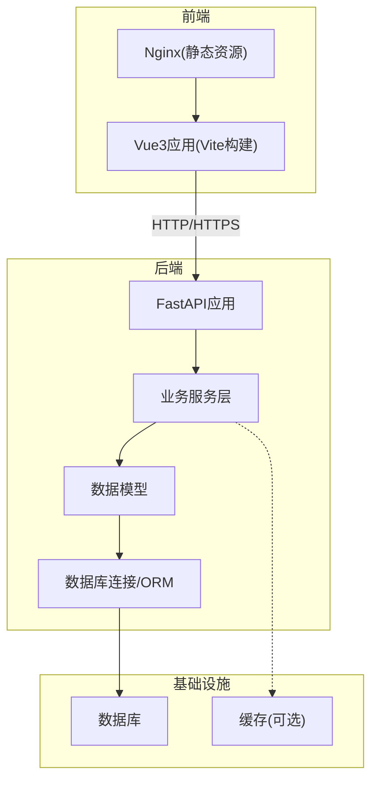
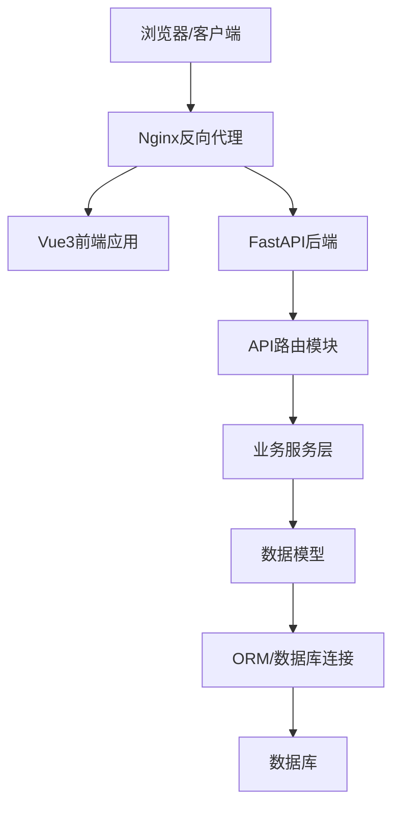
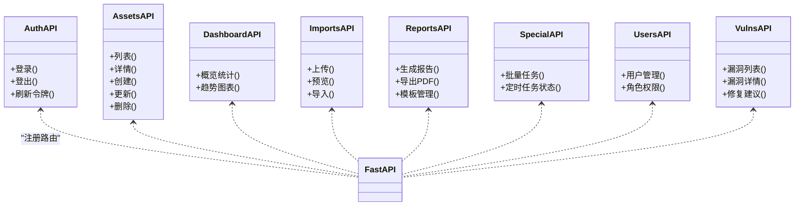
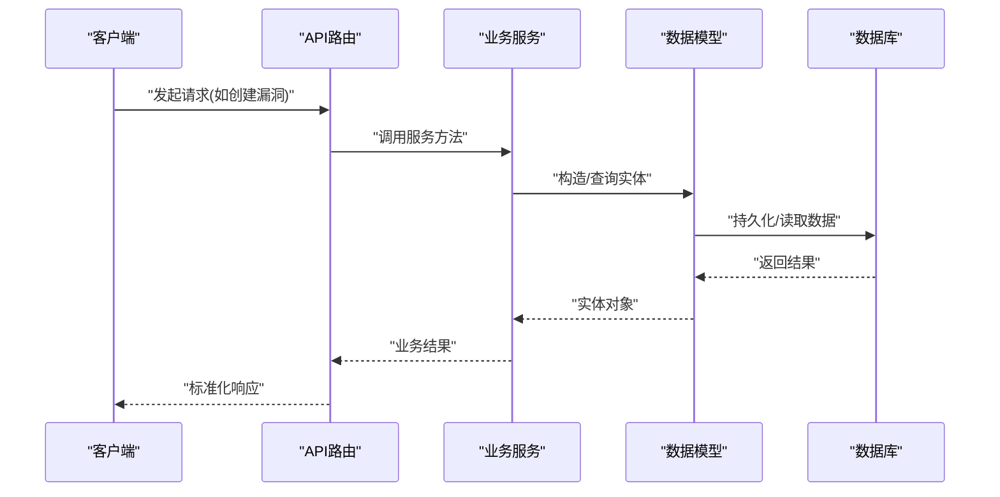
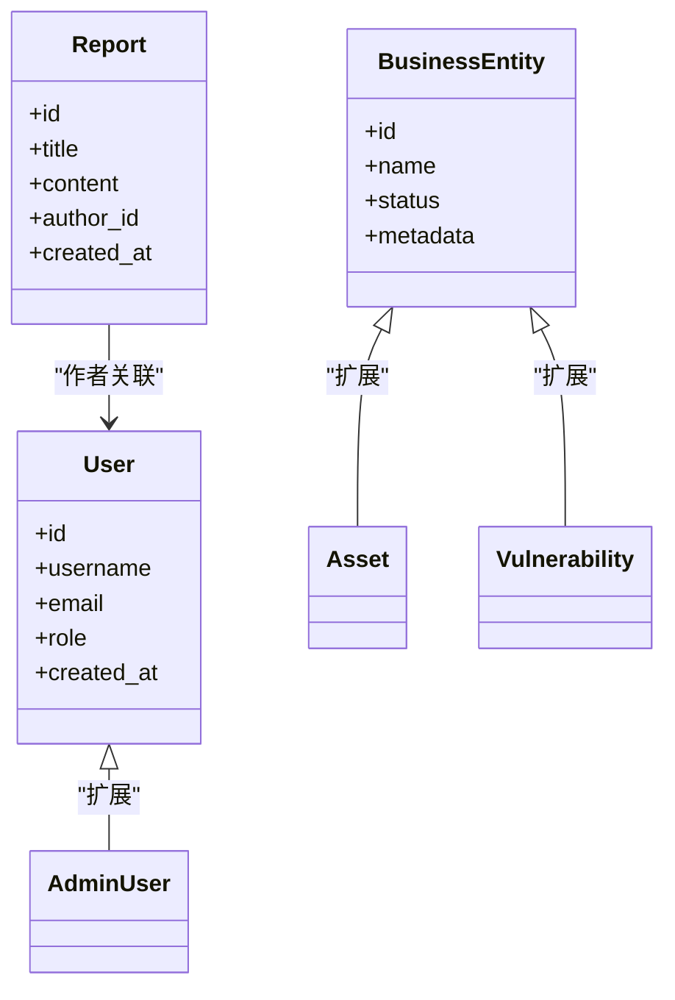
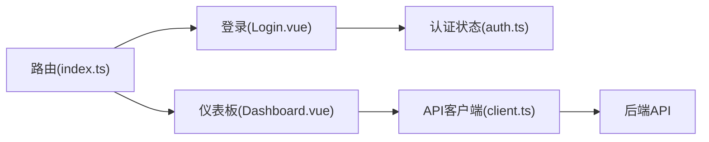
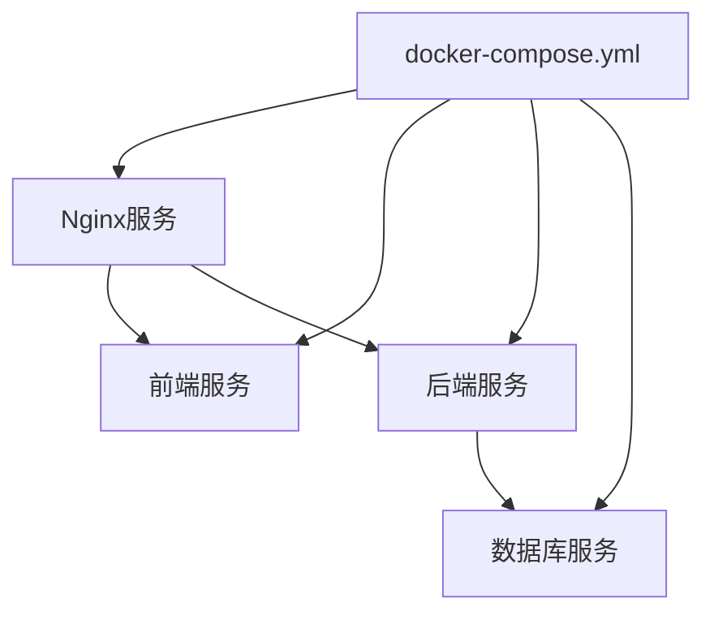
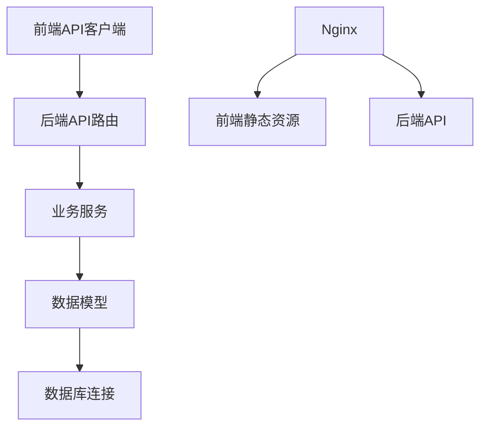

# 架构设计概览

<cite>
**本文引用的文件**   
- [backend/app/main.py](file://backend/app/main.py)
- [backend/app/api/v1/auth.py](file://backend/app/api/v1/auth.py)
- [backend/app/api/v1/assets.py](file://backend/app/api/v1/assets.py)
- [backend/app/api/v1/dashboard.py](file://backend/app/api/v1/dashboard.py)
- [backend/app/api/v1/imports.py](file://backend/app/api/v1/imports.py)
- [backend/app/api/v1/reports.py](file://backend/app/api/v1/reports.py)
- [backend/app/api/v1/special.py](file://backend/app/api/v1/special.py)
- [backend/app/api/v1/users.py](file://backend/app/api/v1/users.py)
- [backend/app/api/v1/vulns.py](file://backend/app/api/v1/vulns.py)
- [backend/app/core/config.py](file://backend/app/core/config.py)
- [backend/app/core/deps.py](file://backend/app/core/deps.py)
- [backend/app/core/security.py](file://backend/app/core/security.py)
- [backend/app/models/business.py](file://backend/app/models/business.py)
- [backend/app/models/user.py](file://backend/app/models/user.py)
- [backend/app/services/vuln_service.py](file://backend/app/services/vuln_service.py)
- [backend/app/services/report_builder.py](file://backend/app/services/report_builder.py)
- [backend/app/db.py](file://backend/app/db.py)
- [backend/Dockerfile](file://backend/Dockerfile)
- [frontend/src/router/index.ts](file://frontend/src/router/index.ts)
- [frontend/src/stores/auth.ts](file://frontend/src/stores/auth.ts)
- [frontend/src/api/client.ts](file://frontend/src/api/client.ts)
- [frontend/src/views/Login.vue](file://frontend/src/views/Login.vue)
- [frontend/src/views/Dashboard.vue](file://frontend/src/views/Dashboard.vue)
- [frontend/nginx.conf](file://frontend/nginx.conf)
- [frontend/Dockerfile](file://frontend/Dockerfile)
- [docker-compose.yml](file://docker-compose.yml)
</cite>

## 目录
1. [简介](#简介)
2. [项目结构](#项目结构)
3. [核心组件](#核心组件)
4. [架构总览](#架构总览)
5. [详细组件分析](#详细组件分析)
6. [依赖关系分析](#依赖关系分析)
7. [性能考虑](#性能考虑)
8. [故障排查指南](#故障排查指南)
9. [结论](#结论)
10. [附录](#附录)

## 简介
本概览面向Talos漏洞管理平台的开发者与运维人员，系统性阐述前后端分离、FastAPI后端RESTful API与Vue3前端组件化架构的设计思路。文档重点说明微服务风格的模块划分（API层、服务层、数据访问层职责分离），以及Docker容器化部署的整体方案（Nginx反向代理、应用服务、数据库服务的编排）。同时给出从前端请求到后端处理再到数据库存储的完整数据流，并配以系统架构图、组件交互图和数据流图，帮助读者快速把握整体设计与技术决策。

## 项目结构
- 后端采用FastAPI构建RESTful API，按功能域拆分API路由（v1），业务逻辑下沉至services层，模型定义在models层，配置与安全集中在core层，数据库连接与迁移由db与alembic管理。
- 前端基于Vue3 + TypeScript，使用Vite构建，通过api客户端统一调用后端接口；路由、状态管理与页面视图分层清晰。
- 部署层面，使用Docker Compose编排Nginx反向代理、前端静态资源服务、后端应用服务与数据库服务，实现一体化交付。

**图示来源** 
- [backend/app/main.py](file://backend/app/main.py)
- [frontend/nginx.conf](file://frontend/nginx.conf)
- [docker-compose.yml](file://docker-compose.yml)

**章节来源**
- [backend/app/main.py](file://backend/app/main.py)
- [frontend/src/router/index.ts](file://frontend/src/router/index.ts)
- [frontend/nginx.conf](file://frontend/nginx.conf)
- [docker-compose.yml](file://docker-compose.yml)

## 核心组件
- API层：按领域划分的RESTful路由模块，负责请求校验、鉴权、参数解析与响应封装。
- 服务层：封装复杂业务逻辑，协调多个模型与外部依赖，提供可复用的业务能力。
- 数据访问层：通过ORM/SQLAlchemy抽象数据库操作，保证数据一致性与事务边界。
- 安全与配置：集中管理认证、授权、密钥与运行期配置。
- 前端：Vue3组件化视图、路由与状态管理，统一的API客户端封装。

**章节来源**
- [backend/app/api/v1/auth.py](file://backend/app/api/v1/auth.py)
- [backend/app/api/v1/assets.py](file://backend/app/api/v1/assets.py)
- [backend/app/api/v1/dashboard.py](file://backend/app/api/v1/dashboard.py)
- [backend/app/api/v1/imports.py](file://backend/app/api/v1/imports.py)
- [backend/app/api/v1/reports.py](file://backend/app/api/v1/reports.py)
- [backend/app/api/v1/special.py](file://backend/app/api/v1/special.py)
- [backend/app/api/v1/users.py](file://backend/app/api/v1/users.py)
- [backend/app/api/v1/vulns.py](file://backend/app/api/v1/vulns.py)
- [backend/app/core/config.py](file://backend/app/core/config.py)
- [backend/app/core/security.py](file://backend/app/core/security.py)
- [backend/app/services/vuln_service.py](file://backend/app/services/vuln_service.py)
- [backend/app/services/report_builder.py](file://backend/app/services/report_builder.py)
- [backend/app/db.py](file://backend/app/db.py)
- [frontend/src/api/client.ts](file://frontend/src/api/client.ts)
- [frontend/src/stores/auth.ts](file://frontend/src/stores/auth.ts)

## 架构总览
系统采用前后端分离与微服务风格的分层架构：
- 前端通过Nginx对外暴露静态资源与反向代理，将API请求转发至后端。
- 后端FastAPI作为API网关入口，路由分发到各业务API模块，再交由服务层处理。
- 服务层组合数据模型与外部能力，完成核心业务编排。
- 数据访问层通过ORM与数据库交互，确保数据持久化与一致性。

**图示来源** 
- [frontend/nginx.conf](file://frontend/nginx.conf)
- [backend/app/main.py](file://backend/app/main.py)
- [backend/app/api/v1/auth.py](file://backend/app/api/v1/auth.py)
- [backend/app/services/vuln_service.py](file://backend/app/services/vuln_service.py)
- [backend/app/db.py](file://backend/app/db.py)

**章节来源**
- [frontend/nginx.conf](file://frontend/nginx.conf)
- [backend/app/main.py](file://backend/app/main.py)
- [docker-compose.yml](file://docker-compose.yml)

## 详细组件分析

### 后端API层与路由组织
- 路由按领域划分，如认证、资产、仪表板、导入、报告、特殊任务、用户与漏洞等。
- 每个路由模块负责接收请求、参数校验、权限控制，并调用服务层方法返回结果。
- 中间件与依赖注入用于横切关注点（如鉴权、限流、日志）的统一处理。

**图示来源** 
- [backend/app/api/v1/auth.py](file://backend/app/api/v1/auth.py)
- [backend/app/api/v1/assets.py](file://backend/app/api/v1/assets.py)
- [backend/app/api/v1/dashboard.py](file://backend/app/api/v1/dashboard.py)
- [backend/app/api/v1/imports.py](file://backend/app/api/v1/imports.py)
- [backend/app/api/v1/reports.py](file://backend/app/api/v1/reports.py)
- [backend/app/api/v1/special.py](file://backend/app/api/v1/special.py)
- [backend/app/api/v1/users.py](file://backend/app/api/v1/users.py)
- [backend/app/api/v1/vulns.py](file://backend/app/api/v1/vulns.py)
- [backend/app/main.py](file://backend/app/main.py)

**章节来源**
- [backend/app/api/v1/auth.py](file://backend/app/api/v1/auth.py)
- [backend/app/api/v1/assets.py](file://backend/app/api/v1/assets.py)
- [backend/app/api/v1/dashboard.py](file://backend/app/api/v1/dashboard.py)
- [backend/app/api/v1/imports.py](file://backend/app/api/v1/imports.py)
- [backend/app/api/v1/reports.py](file://backend/app/api/v1/reports.py)
- [backend/app/api/v1/special.py](file://backend/app/api/v1/special.py)
- [backend/app/api/v1/users.py](file://backend/app/api/v1/users.py)
- [backend/app/api/v1/vulns.py](file://backend/app/api/v1/vulns.py)
- [backend/app/main.py](file://backend/app/main.py)

### 服务层与业务编排
- 服务层封装跨模块的业务流程，例如漏洞扫描结果聚合、报告构建、计划执行等。
- 通过依赖注入获取数据访问对象与外部工具，保持高内聚低耦合。
- 对异常进行统一捕获与转换，向上层返回一致的错误码与消息。

**图示来源** 
- [backend/app/api/v1/vulns.py](file://backend/app/api/v1/vulns.py)
- [backend/app/services/vuln_service.py](file://backend/app/services/vuln_service.py)
- [backend/app/models/business.py](file://backend/app/models/business.py)
- [backend/app/db.py](file://backend/app/db.py)

**章节来源**
- [backend/app/services/vuln_service.py](file://backend/app/services/vuln_service.py)
- [backend/app/services/report_builder.py](file://backend/app/services/report_builder.py)
- [backend/app/models/business.py](file://backend/app/models/business.py)
- [backend/app/db.py](file://backend/app/db.py)

### 数据访问层与模型
- 数据模型定义实体结构与关系，配合ORM进行CRUD操作。
- 数据库连接与会话管理集中在db模块，确保连接池与事务的正确性。
- 通过Alembic进行数据库版本管理与迁移。

**图示来源** 
- [backend/app/models/user.py](file://backend/app/models/user.py)
- [backend/app/models/business.py](file://backend/app/models/business.py)
- [backend/app/db.py](file://backend/app/db.py)

**章节来源**
- [backend/app/models/user.py](file://backend/app/models/user.py)
- [backend/app/models/business.py](file://backend/app/models/business.py)
- [backend/app/db.py](file://backend/app/db.py)

### 前端组件化架构
- 路由：集中管理页面路由与导航守卫。
- 状态：认证状态与全局配置通过store管理。
- API客户端：统一封装HTTP请求、拦截器与错误处理。
- 视图：页面级组件按功能划分，复用通用组件。

**图示来源** 
- [frontend/src/router/index.ts](file://frontend/src/router/index.ts)
- [frontend/src/stores/auth.ts](file://frontend/src/stores/auth.ts)
- [frontend/src/api/client.ts](file://frontend/src/api/client.ts)
- [frontend/src/views/Login.vue](file://frontend/src/views/Login.vue)
- [frontend/src/views/Dashboard.vue](file://frontend/src/views/Dashboard.vue)

**章节来源**
- [frontend/src/router/index.ts](file://frontend/src/router/index.ts)
- [frontend/src/stores/auth.ts](file://frontend/src/stores/auth.ts)
- [frontend/src/api/client.ts](file://frontend/src/api/client.ts)
- [frontend/src/views/Login.vue](file://frontend/src/views/Login.vue)
- [frontend/src/views/Dashboard.vue](file://frontend/src/views/Dashboard.vue)

### 容器化与编排
- 后端镜像：基于Python环境构建FastAPI应用，包含依赖安装与启动脚本。
- 前端镜像：构建静态资源并通过Nginx提供服务。
- 编排：docker-compose定义Nginx、前端、后端、数据库等服务及其网络与卷挂载。

**图示来源** 
- [docker-compose.yml](file://docker-compose.yml)
- [frontend/nginx.conf](file://frontend/nginx.conf)
- [frontend/Dockerfile](file://frontend/Dockerfile)
- [backend/Dockerfile](file://backend/Dockerfile)

**章节来源**
- [docker-compose.yml](file://docker-compose.yml)
- [frontend/nginx.conf](file://frontend/nginx.conf)
- [frontend/Dockerfile](file://frontend/Dockerfile)
- [backend/Dockerfile](file://backend/Dockerfile)

## 依赖关系分析
- 后端API模块依赖服务层，服务层依赖数据模型与数据库连接。
- 前端通过API客户端依赖后端REST接口，认证状态由store维护。
- 容器编排中，Nginx作为反向代理统一入口，前端静态资源与后端API路径分离。

**图示来源** 
- [frontend/src/api/client.ts](file://frontend/src/api/client.ts)
- [backend/app/api/v1/auth.py](file://backend/app/api/v1/auth.py)
- [backend/app/services/vuln_service.py](file://backend/app/services/vuln_service.py)
- [backend/app/models/business.py](file://backend/app/models/business.py)
- [backend/app/db.py](file://backend/app/db.py)
- [frontend/nginx.conf](file://frontend/nginx.conf)

**章节来源**
- [frontend/src/api/client.ts](file://frontend/src/api/client.ts)
- [backend/app/api/v1/auth.py](file://backend/app/api/v1/auth.py)
- [backend/app/services/vuln_service.py](file://backend/app/services/vuln_service.py)
- [backend/app/models/business.py](file://backend/app/models/business.py)
- [backend/app/db.py](file://backend/app/db.py)
- [frontend/nginx.conf](file://frontend/nginx.conf)

## 性能考虑
- 连接池与会话管理：数据库连接池避免频繁建立连接，提升吞吐。
- 异步处理：长耗时任务（如报告生成、导入解析）建议使用后台任务或队列。
- 缓存策略：热点数据（如仪表板统计）可通过缓存降低数据库压力。
- 前端优化：静态资源压缩、懒加载与按需引入减少首屏体积。
- 反向代理：Nginx启用Gzip与缓存策略，提升静态资源传输效率。

[本节为通用指导，不直接分析具体文件]

## 故障排查指南
- 认证失败：检查JWT签发与验证逻辑、令牌有效期与刷新机制。
- 路由404：确认Nginx反向代理规则与后端路由前缀是否匹配。
- 数据库连接失败：检查环境变量、连接字符串与端口映射。
- 前端请求跨域：确认CORS配置与Nginx代理头设置。
- 构建失败：核对依赖版本与镜像基础环境。

**章节来源**
- [backend/app/core/security.py](file://backend/app/core/security.py)
- [frontend/nginx.conf](file://frontend/nginx.conf)
- [backend/app/db.py](file://backend/app/db.py)
- [backend/app/core/config.py](file://backend/app/core/config.py)

## 结论
Talos漏洞管理平台采用前后端分离与微服务风格的分层架构，后端以FastAPI为核心提供RESTful API，前端以Vue3构建组件化界面，通过Nginx统一入口与Docker Compose编排实现一体化部署。该设计在保证可维护性与可扩展性的同时，提供了清晰的职责边界与数据流向，便于团队协作与持续演进。

[本节为总结性内容，不直接分析具体文件]

## 附录
- 关键配置文件路径参考：
  - 后端主入口与路由注册：[backend/app/main.py](file://backend/app/main.py)
  - 认证与安全：[backend/app/core/security.py](file://backend/app/core/security.py)、[backend/app/core/config.py](file://backend/app/core/config.py)
  - 数据库与模型：[backend/app/db.py](file://backend/app/db.py)、[backend/app/models/business.py](file://backend/app/models/business.py)
  - 前端路由与状态：[frontend/src/router/index.ts](file://frontend/src/router/index.ts)、[frontend/src/stores/auth.ts](file://frontend/src/stores/auth.ts)
  - 容器编排与Nginx：[docker-compose.yml](file://docker-compose.yml)、[frontend/nginx.conf](file://frontend/nginx.conf)