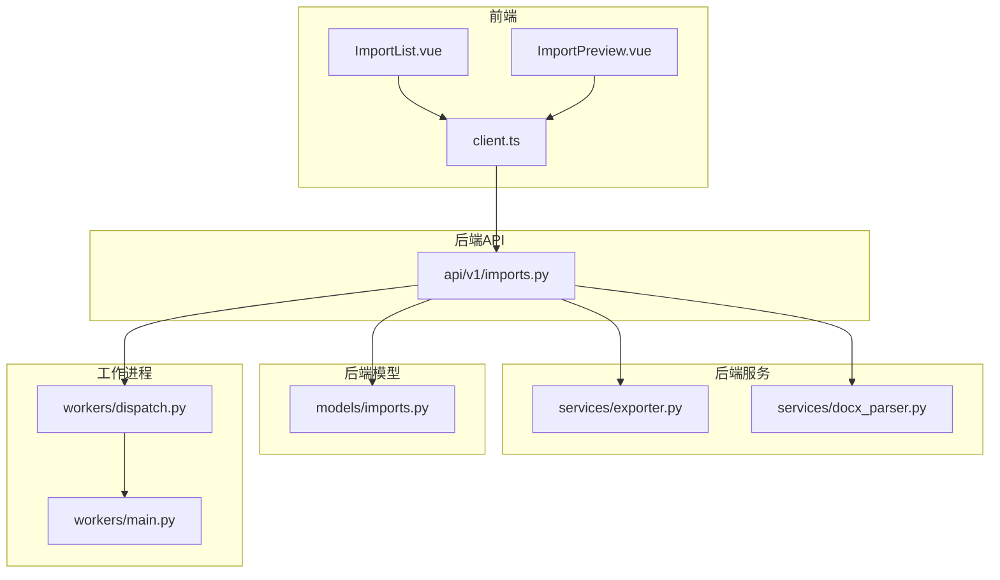
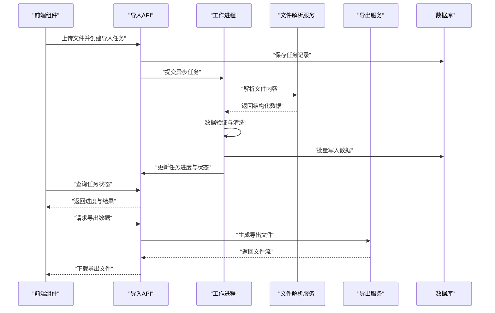
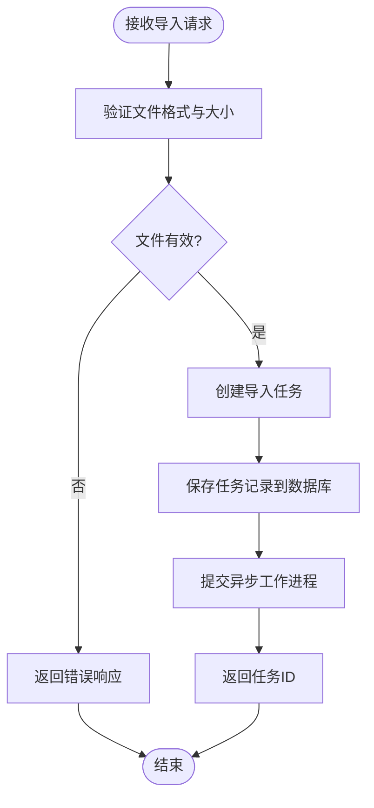
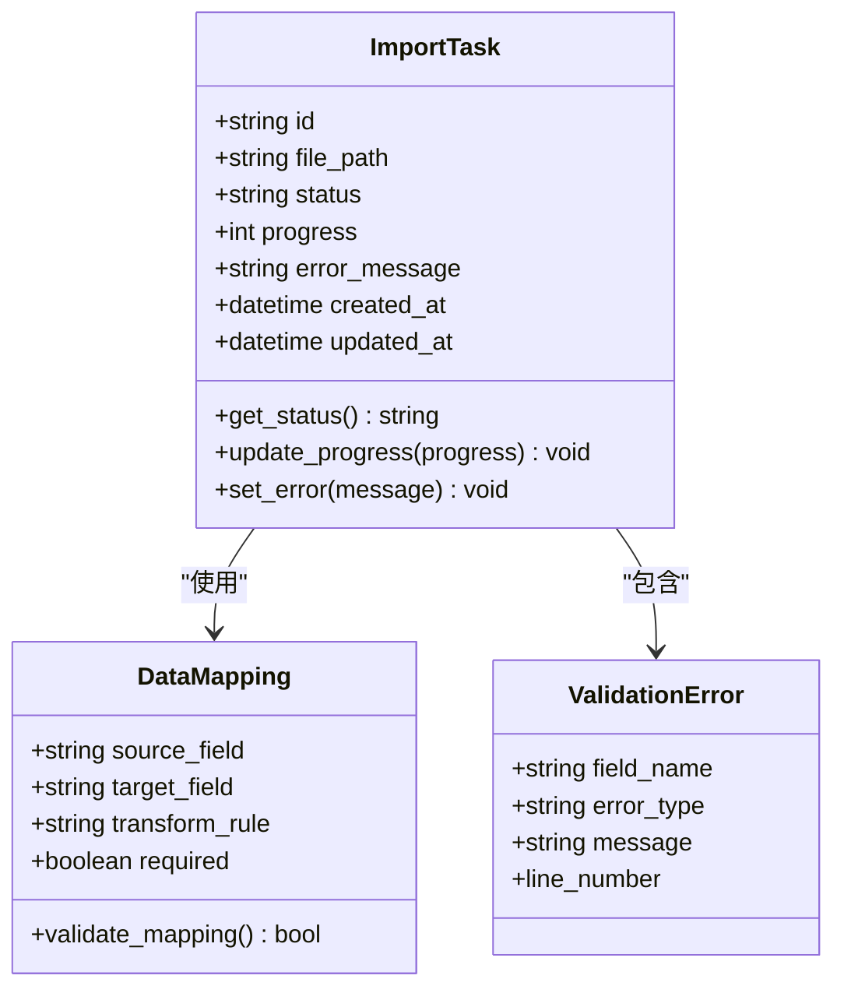
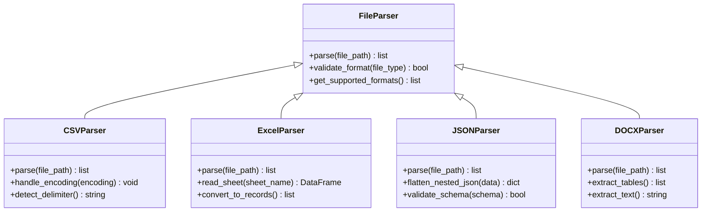
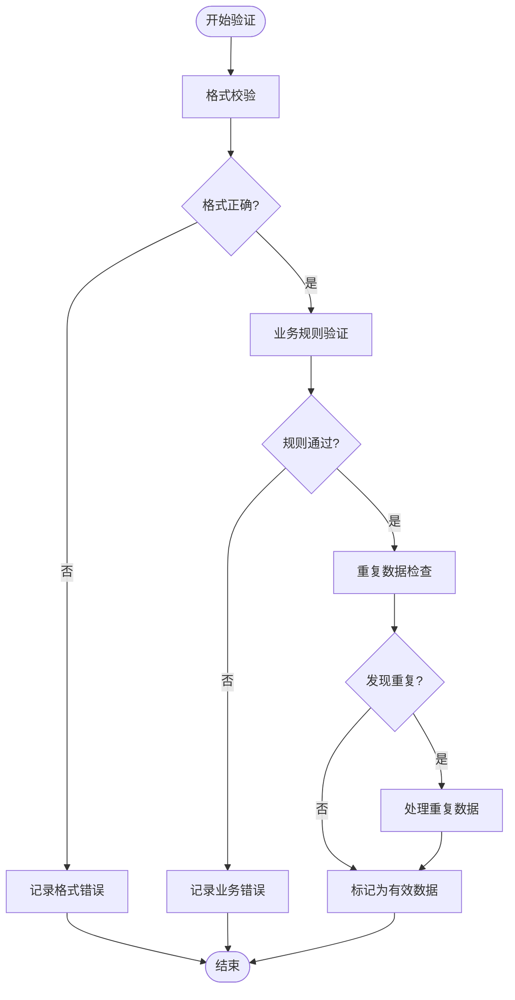
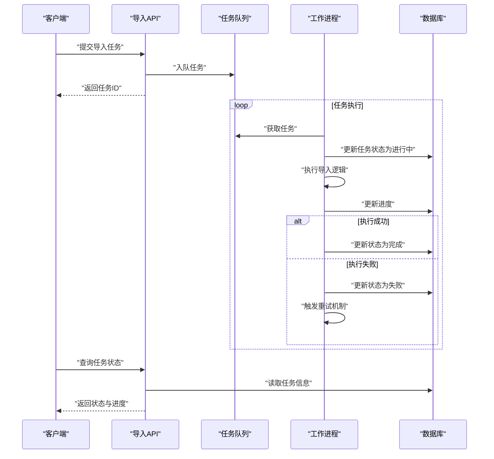
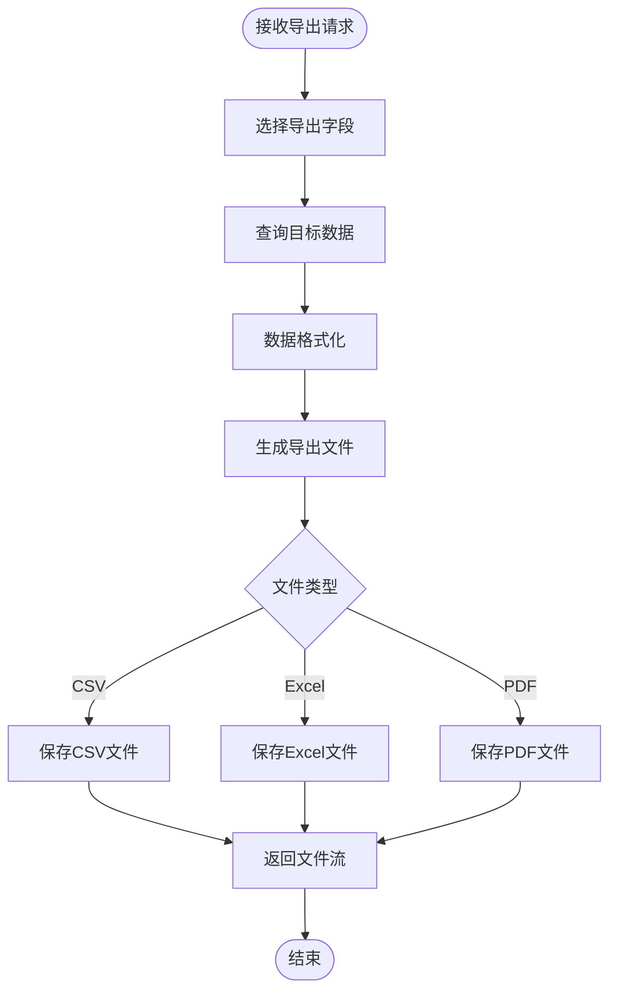
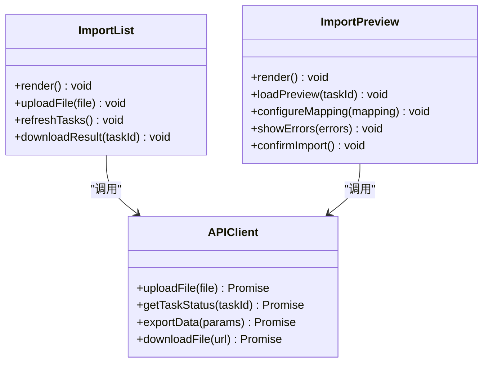
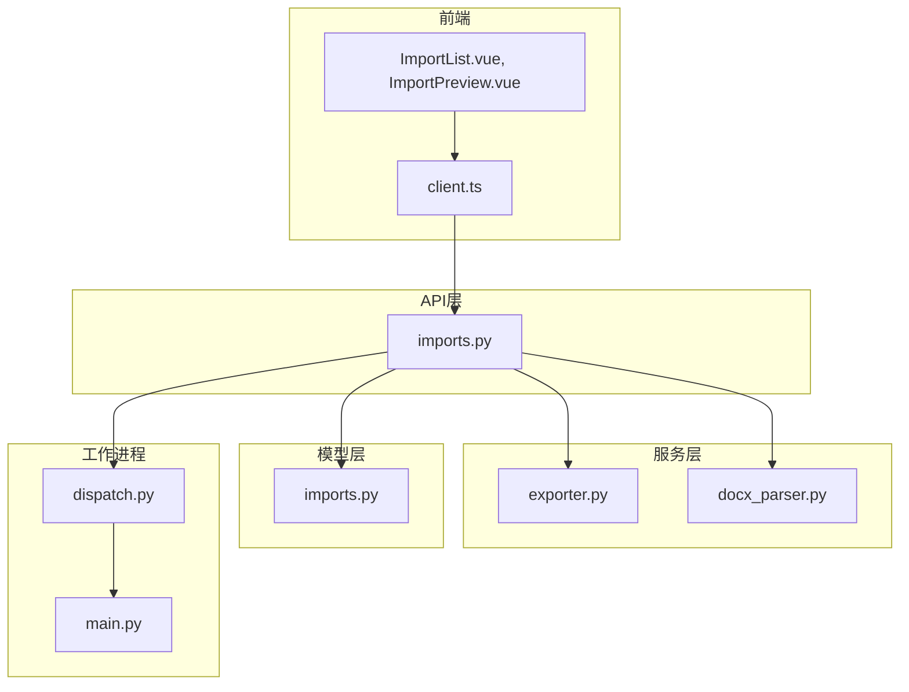

# 导入导出模块

<cite>
**本文引用的文件**   
- [backend/app/api/v1/imports.py](file://backend/app/api/v1/imports.py)
- [backend/app/models/imports.py](file://backend/app/models/imports.py)
- [backend/app/services/exporter.py](file://backend/app/services/exporter.py)
- [backend/app/services/docx_parser.py](file://backend/app/services/docx_parser.py)
- [backend/app/workers/main.py](file://backend/app/workers/main.py)
- [backend/app/workers/dispatch.py](file://backend/app/workers/dispatch.py)
- [frontend/src/views/ImportList.vue](file://frontend/src/views/ImportList.vue)
- [frontend/src/views/ImportPreview.vue](file://frontend/src/views/ImportPreview.vue)
- [frontend/src/api/client.ts](file://frontend/src/api/client.ts)
</cite>

## 目录
1. [简介](#简介)
2. [项目结构](#项目结构)
3. [核心组件](#核心组件)
4. [架构总览](#架构总览)
5. [详细组件分析](#详细组件分析)
6. [依赖关系分析](#依赖关系分析)
7. [性能考虑](#性能考虑)
8. [故障排查指南](#故障排查指南)
9. [结论](#结论)
10. [附录](#附录)

## 简介
本模块为Talos平台提供统一的批量数据导入与导出能力，支持CSV、Excel、JSON、DOCX等多种文件格式的解析与处理。系统内置数据验证机制（格式校验、业务规则校验、重复数据处理），并提供导入预览、错误信息展示、异步任务管理（进度跟踪、错误处理、重试）以及可定制的字段选择与格式化输出。前端提供导入列表与预览界面，后端通过API暴露接口并配合后台工作进程完成异步任务调度与执行。

## 项目结构
导入导出相关代码主要分布在后端API层、模型层、服务层与工作进程层，以及前端视图与API客户端中：
- API层：定义导入导出相关的HTTP接口
- 模型层：定义导入任务、映射配置等数据模型
- 服务层：实现文件解析、数据导出、文档解析等核心逻辑
- 工作进程：负责异步任务的调度与执行
- 前端：提供导入列表、预览、模板管理等交互界面

**图表来源** 
- [backend/app/api/v1/imports.py](file://backend/app/api/v1/imports.py)
- [backend/app/services/exporter.py](file://backend/app/services/exporter.py)
- [backend/app/services/docx_parser.py](file://backend/app/services/docx_parser.py)
- [backend/app/models/imports.py](file://backend/app/models/imports.py)
- [backend/app/workers/main.py](file://backend/app/workers/main.py)
- [backend/app/workers/dispatch.py](file://backend/app/workers/dispatch.py)
- [frontend/src/views/ImportList.vue](file://frontend/src/views/ImportList.vue)
- [frontend/src/views/ImportPreview.vue](file://frontend/src/views/ImportPreview.vue)
- [frontend/src/api/client.ts](file://frontend/src/api/client.ts)

**章节来源**
- [backend/app/api/v1/imports.py](file://backend/app/api/v1/imports.py)
- [backend/app/models/imports.py](file://backend/app/models/imports.py)
- [backend/app/services/exporter.py](file://backend/app/services/exporter.py)
- [backend/app/services/docx_parser.py](file://backend/app/services/docx_parser.py)
- [backend/app/workers/main.py](file://backend/app/workers/main.py)
- [backend/app/workers/dispatch.py](file://backend/app/workers/dispatch.py)
- [frontend/src/views/ImportList.vue](file://frontend/src/views/ImportList.vue)
- [frontend/src/views/ImportPreview.vue](file://frontend/src/views/ImportPreview.vue)
- [frontend/src/api/client.ts](file://frontend/src/api/client.ts)

## 核心组件
- 导入API接口：提供上传文件、创建导入任务、查询任务状态、下载结果等功能
- 数据模型：定义导入任务、映射配置、错误记录等数据结构
- 文件解析服务：支持CSV、Excel、JSON、DOCX等格式的解析与标准化
- 导出服务：支持自定义字段选择、格式化输出（如CSV、Excel、PDF等）
- 工作进程：异步执行导入任务，支持进度更新、错误处理与重试
- 前端组件：导入列表与预览界面，支持数据映射配置与错误展示

**章节来源**
- [backend/app/api/v1/imports.py](file://backend/app/api/v1/imports.py)
- [backend/app/models/imports.py](file://backend/app/models/imports.py)
- [backend/app/services/exporter.py](file://backend/app/services/exporter.py)
- [backend/app/services/docx_parser.py](file://backend/app/services/docx_parser.py)
- [backend/app/workers/main.py](file://backend/app/workers/main.py)
- [backend/app/workers/dispatch.py](file://backend/app/workers/dispatch.py)
- [frontend/src/views/ImportList.vue](file://frontend/src/views/ImportList.vue)
- [frontend/src/views/ImportPreview.vue](file://frontend/src/views/ImportPreview.vue)
- [frontend/src/api/client.ts](file://frontend/src/api/client.ts)

## 架构总览
导入导出模块采用前后端分离架构，前端通过RESTful API与后端交互，后端使用工作进程处理耗时操作，确保用户体验流畅。

**图表来源** 
- [backend/app/api/v1/imports.py](file://backend/app/api/v1/imports.py)
- [backend/app/workers/main.py](file://backend/app/workers/main.py)
- [backend/app/services/docx_parser.py](file://backend/app/services/docx_parser.py)
- [backend/app/services/exporter.py](file://backend/app/services/exporter.py)

## 详细组件分析

### 导入API接口
导入API提供完整的导入生命周期管理，包括文件上传、任务创建、状态查询和结果下载。

**图表来源** 
- [backend/app/api/v1/imports.py](file://backend/app/api/v1/imports.py)

**章节来源**
- [backend/app/api/v1/imports.py](file://backend/app/api/v1/imports.py)

### 数据模型设计
导入任务模型包含任务ID、文件路径、状态、进度、错误信息等关键字段，支持任务的生命周期管理。

**图表来源** 
- [backend/app/models/imports.py](file://backend/app/models/imports.py)

**章节来源**
- [backend/app/models/imports.py](file://backend/app/models/imports.py)

### 文件解析服务
文件解析服务支持多种格式的文件处理，包括CSV、Excel、JSON和DOCX格式，提供统一的数据接口。

**图表来源** 
- [backend/app/services/docx_parser.py](file://backend/app/services/docx_parser.py)

**章节来源**
- [backend/app/services/docx_parser.py](file://backend/app/services/docx_parser.py)

### 数据验证机制
数据验证机制包含格式校验、业务规则验证和重复数据处理，确保导入数据的完整性和准确性。

**图表来源** 
- [backend/app/api/v1/imports.py](file://backend/app/api/v1/imports.py)

**章节来源**
- [backend/app/api/v1/imports.py](file://backend/app/api/v1/imports.py)

### 异步任务管理
异步任务管理系统支持任务调度、进度跟踪、错误处理和重试机制，确保大规模数据处理的高效性。

**图表来源** 
- [backend/app/workers/main.py](file://backend/app/workers/main.py)
- [backend/app/workers/dispatch.py](file://backend/app/workers/dispatch.py)

**章节来源**
- [backend/app/workers/main.py](file://backend/app/workers/main.py)
- [backend/app/workers/dispatch.py](file://backend/app/workers/dispatch.py)

### 数据导出功能
导出功能支持自定义字段选择和多种格式化输出，满足不同场景的数据导出需求。

**图表来源** 
- [backend/app/services/exporter.py](file://backend/app/services/exporter.py)

**章节来源**
- [backend/app/services/exporter.py](file://backend/app/services/exporter.py)

### 前端组件说明
前端组件提供用户友好的导入导出界面，支持文件上传、预览、映射配置和错误展示。

**图表来源** 
- [frontend/src/views/ImportList.vue](file://frontend/src/views/ImportList.vue)
- [frontend/src/views/ImportPreview.vue](file://frontend/src/views/ImportPreview.vue)
- [frontend/src/api/client.ts](file://frontend/src/api/client.ts)

**章节来源**
- [frontend/src/views/ImportList.vue](file://frontend/src/views/ImportList.vue)
- [frontend/src/views/ImportPreview.vue](file://frontend/src/views/ImportPreview.vue)
- [frontend/src/api/client.ts](file://frontend/src/api/client.ts)

## 依赖关系分析
导入导出模块各组件之间的依赖关系清晰，遵循单一职责原则，便于维护和扩展。

**图表来源** 
- [backend/app/api/v1/imports.py](file://backend/app/api/v1/imports.py)
- [backend/app/services/exporter.py](file://backend/app/services/exporter.py)
- [backend/app/services/docx_parser.py](file://backend/app/services/docx_parser.py)
- [backend/app/models/imports.py](file://backend/app/models/imports.py)
- [backend/app/workers/main.py](file://backend/app/workers/main.py)
- [backend/app/workers/dispatch.py](file://backend/app/workers/dispatch.py)
- [frontend/src/views/ImportList.vue](file://frontend/src/views/ImportList.vue)
- [frontend/src/views/ImportPreview.vue](file://frontend/src/views/ImportPreview.vue)
- [frontend/src/api/client.ts](file://frontend/src/api/client.ts)

**章节来源**
- [backend/app/api/v1/imports.py](file://backend/app/api/v1/imports.py)
- [backend/app/services/exporter.py](file://backend/app/services/exporter.py)
- [backend/app/services/docx_parser.py](file://backend/app/services/docx_parser.py)
- [backend/app/models/imports.py](file://backend/app/models/imports.py)
- [backend/app/workers/main.py](file://backend/app/workers/main.py)
- [backend/app/workers/dispatch.py](file://backend/app/workers/dispatch.py)
- [frontend/src/views/ImportList.vue](file://frontend/src/views/ImportList.vue)
- [frontend/src/views/ImportPreview.vue](file://frontend/src/views/ImportPreview.vue)
- [frontend/src/api/client.ts](file://frontend/src/api/client.ts)

## 性能考虑
- 文件解析优化：使用流式处理大文件，避免内存溢出
- 批量操作：采用批量插入减少数据库交互次数
- 异步处理：将耗时的导入操作移至后台任务
- 缓存策略：对常用模板和映射配置进行缓存
- 分页加载：前端采用分页加载大量数据
- 连接池：数据库连接池优化并发访问

## 故障排查指南
- 文件解析错误：检查文件格式是否正确，编码是否匹配
- 数据验证失败：查看错误日志，确认数据是否符合业务规则
- 任务执行超时：检查工作进程资源使用情况
- 数据库连接问题：检查连接池配置和网络连通性
- 权限问题：确认用户是否有相应的导入导出权限

**章节来源**
- [backend/app/api/v1/imports.py](file://backend/app/api/v1/imports.py)
- [backend/app/workers/main.py](file://backend/app/workers/main.py)

## 结论
Talos平台的导入导出模块提供了完整的数据导入导出解决方案，支持多种文件格式、强大的数据验证机制、异步任务管理和灵活的导出选项。通过前后端分离的架构设计和清晰的组件划分，系统具备良好的可扩展性和维护性。建议在生产环境中合理配置工作进程数量和资源限制，以确保系统的稳定性和性能。

## 附录

### API接口规范
- 文件上传接口：POST /api/v1/import/upload
- 任务状态查询：GET /api/v1/import/{task_id}/status
- 结果下载接口：GET /api/v1/import/{task_id}/result
- 数据导出接口：POST /api/v1/export/data
- 模板管理接口：GET/POST /api/v1/import/templates

### 支持的导入格式
- CSV：逗号分隔值文件，支持UTF-8编码
- Excel：.xlsx和.xls格式，支持多工作表
- JSON：标准JSON格式，支持嵌套对象扁平化
- DOCX：Word文档，支持表格和文本提取

### 错误代码说明
- 400：请求参数错误
- 401：未授权访问
- 403：权限不足
- 404：资源不存在
- 413：文件过大
- 415：不支持的文件格式
- 500：服务器内部错误