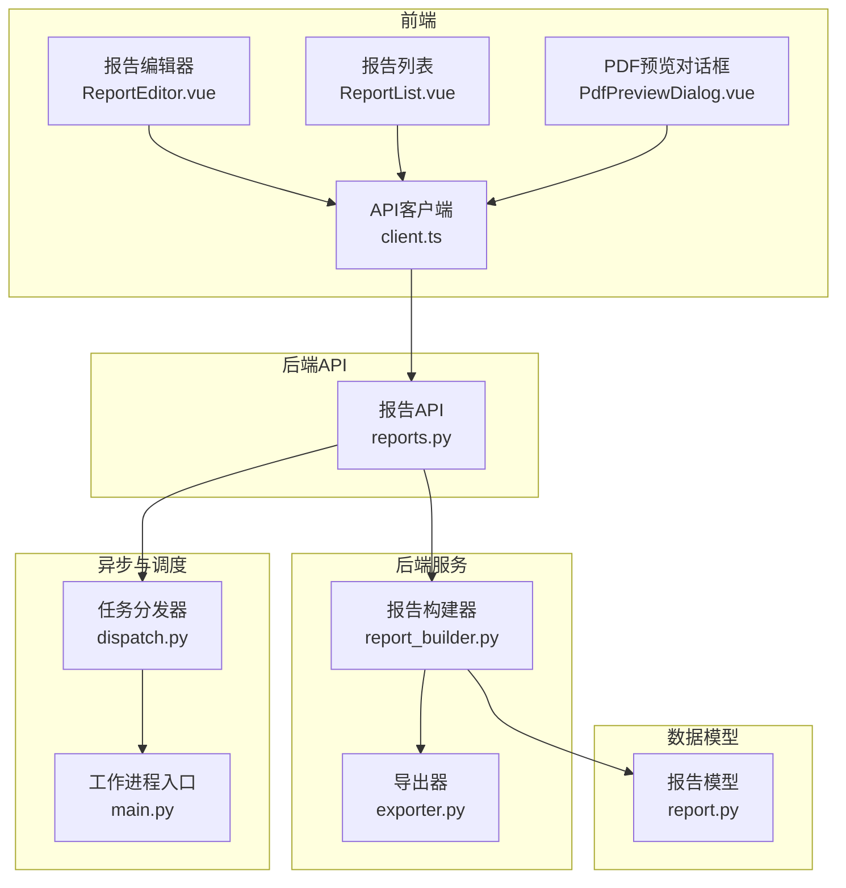
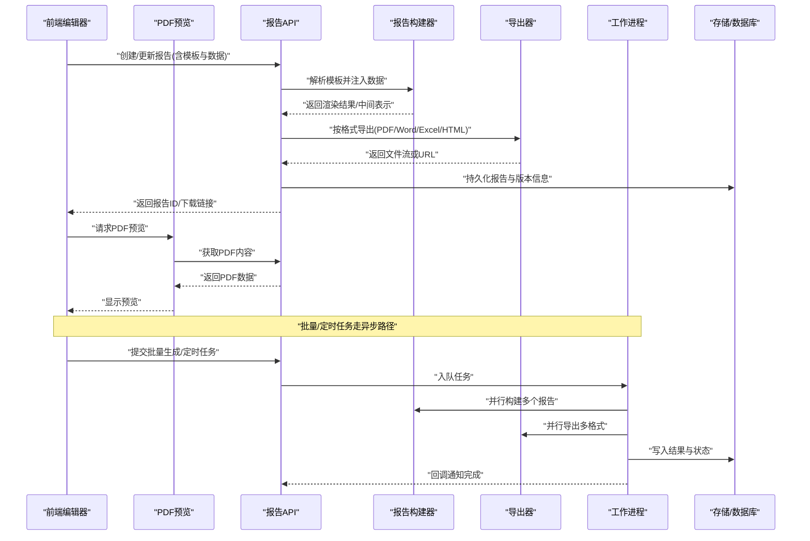
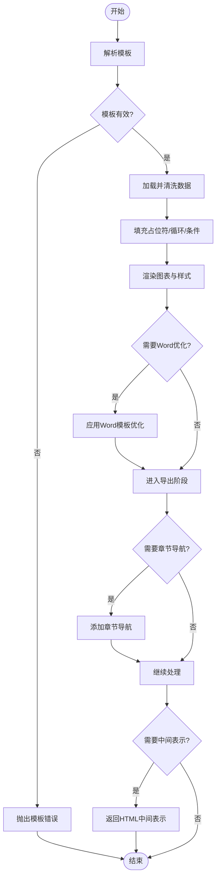
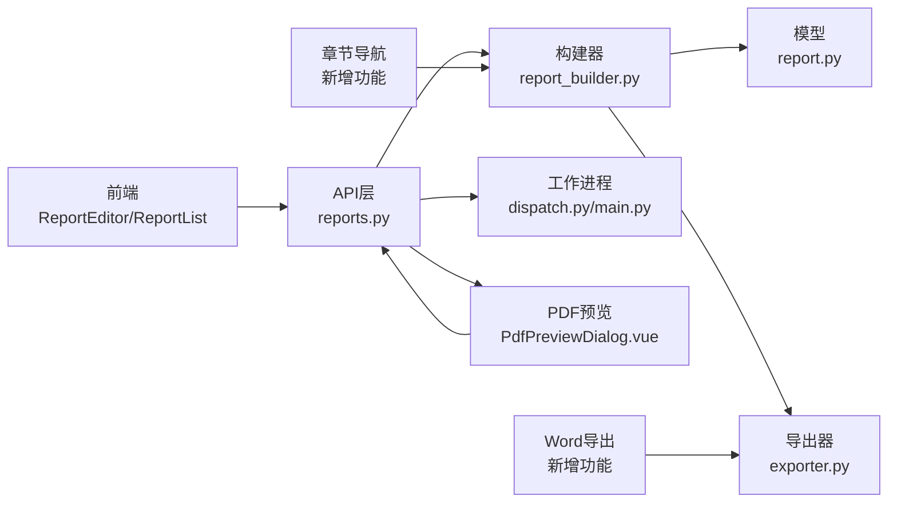

# 报告生成模块

<cite>
**本文档引用的文件**   
- [backend/app/api/v1/reports.py](file://backend/app/api/v1/reports.py)
- [backend/app/services/report_builder.py](file://backend/app/services/report_builder.py)
- [backend/app/services/exporter.py](file://backend/app/services/exporter.py)
- [backend/app/models/report.py](file://backend/app/models/report.py)
- [backend/app/workers/main.py](file://backend/app/workers/main.py)
- [backend/app/workers/dispatch.py](file://backend/app/workers/dispatch.py)
- [frontend/src/views/ReportEditor.vue](file://frontend/src/views/ReportEditor.vue)
- [frontend/src/views/ReportList.vue](file://frontend/src/views/ReportList.vue)
- [frontend/src/components/PdfPreviewDialog.vue](file://frontend/src/components/PdfPreviewDialog.vue)
- [frontend/src/api/client.ts](file://frontend/src/api/client.ts)
</cite>

## 更新摘要
**所做更改**   
- 新增Word文档导出功能，支持专业的文档格式输出
- 改进PDF预览功能，增强章节导航和实时字段保存
- 优化版本控制系统，实现更精细的版本管理
- 提升模板渲染质量，支持更复杂的文档结构
- 增强前端编辑器，提供更直观的模板编辑体验

## 目录
1. [简介](#简介)
2. [项目结构](#项目结构)
3. [核心组件](#核心组件)
4. [架构总览](#架构总览)
5. [详细组件分析](#详细组件分析)
6. [依赖关系分析](#依赖关系分析)
7. [性能考虑](#性能考虑)
8. [故障排查指南](#故障排查指南)
9. [结论](#结论)
10. [附录](#附录)

## 简介
本模块为Talos平台的报告生成子系统，提供自动化报告引擎、模板系统、数据填充与格式渲染能力。支持漏洞摘要报告、合规性报告和风险评估报告等类型；支持PDF、Word、Excel和HTML多格式导出；具备版本管理与历史追溯、调度执行、批量生成与定时任务配置；并提供API接口规范、模板开发指南与前端编辑器使用说明。

**最新更新**：系统现已支持增强的Word文档导出功能、改进的PDF预览体验、优化的章节导航和实时字段保存机制，为用户提供更加专业和高效的报告创建与管理体验。

## 项目结构
后端采用FastAPI分层架构：API层暴露REST接口，服务层封装报告构建与导出逻辑，模型层定义数据实体，工作进程负责异步任务与调度。前端基于Vue实现报告列表与可视化编辑器，通过TypeScript客户端调用后端API。

**图表来源**
- [backend/app/api/v1/reports.py](file://backend/app/api/v1/reports.py)
- [backend/app/services/report_builder.py](file://backend/app/services/report_builder.py)
- [backend/app/services/exporter.py](file://backend/app/services/exporter.py)
- [backend/app/models/report.py](file://backend/app/models/report.py)
- [backend/app/workers/main.py](file://backend/app/workers/main.py)
- [backend/app/workers/dispatch.py](file://backend/app/workers/dispatch.py)
- [frontend/src/views/ReportEditor.vue](file://frontend/src/views/ReportEditor.vue)
- [frontend/src/views/ReportList.vue](file://frontend/src/views/ReportList.vue)
- [frontend/src/components/PdfPreviewDialog.vue](file://frontend/src/components/PdfPreviewDialog.vue)
- [frontend/src/api/client.ts](file://frontend/src/api/client.ts)

## 核心组件
- 报告API（reports.py）：提供报告的创建、查询、更新、删除、预览、导出、版本管理、批量生成与调度接口。
- 报告构建器（report_builder.py）：解析模板、注入数据、渲染图表与样式，输出中间表示或目标格式。
- 导出器（exporter.py）：将中间表示转换为PDF、Word、Excel、HTML等多格式文件。
- 报告模型（report.py）：定义报告实体、模板引用、版本字段、状态与元数据。
- 工作进程（workers/main.py, dispatch.py）：异步执行耗时任务（如批量生成、定时任务），并处理失败重试与结果回写。
- 前端编辑器（ReportEditor.vue, ReportList.vue）：可视化编辑模板、预览报告、触发导出与调度。
- PDF预览对话框（PdfPreviewDialog.vue）：提供实时PDF预览功能，支持缩放、分页浏览和下载。
- 前端API客户端（client.ts）：统一封装对后端报告的HTTP请求。

**最新更新**：新增Word文档导出功能，改进PDF预览的章节导航和实时字段保存机制，提升整体用户体验。

## 架构总览
报告生成流水线分为"模板解析—数据装配—渲染—导出—归档"五个阶段，由API层协调，构建器与导出器协作完成，异步任务用于批量与定时场景。

**图表来源**
- [backend/app/api/v1/reports.py](file://backend/app/api/v1/reports.py)
- [backend/app/services/report_builder.py](file://backend/app/services/report_builder.py)
- [backend/app/services/exporter.py](file://backend/app/services/exporter.py)
- [backend/app/workers/main.py](file://backend/app/workers/main.py)
- [backend/app/workers/dispatch.py](file://backend/app/workers/dispatch.py)

## 详细组件分析

### 报告API（reports.py）
- 职责：接收前端请求，校验参数，路由到构建器或工作进程，返回结果或任务ID。
- 关键能力：
  - 报告CRUD与版本管理：创建新版本、切换基线版本、查看历史。
  - 预览与导出：同步预览HTML/PDF，或异步导出多格式。
  - 批量生成：传入多个报告定义，返回任务ID，轮询进度。
  - 定时任务：创建/启停/删除调度规则，支持Cron表达式。
  - **新增**：Word文档导出接口，支持专业的Word格式输出。
  - **新增**：增强的PDF预览接口，支持章节导航和实时字段保存。
- 错误处理：参数校验失败、模板缺失、渲染异常、导出失败等均有明确状态码与消息。

**更新内容**：新增Word文档导出功能和增强的PDF预览接口，支持章节导航和实时字段保存。

**章节来源**
- [backend/app/api/v1/reports.py](file://backend/app/api/v1/reports.py)

### 报告构建器（report_builder.py）
- 职责：模板解析、数据装配、图表渲染、样式应用，产出可导出的中间表示。
- 模板系统：
  - 支持占位符替换、条件块、循环遍历、子模板包含。
  - 自定义字段扩展：通过字段注册表动态注入业务字段。
  - 图表引擎：集成折线/柱状/饼图数据源，支持主题与响应式布局。
- 数据填充：
  - 从数据源聚合指标（漏洞数、风险等级分布、合规项通过率）。
  - 支持分页与过滤，避免大对象内存压力。
- 渲染机制：
  - HTML作为中间表示，便于后续转PDF/Word/Excel。
  - 样式配置：字体、颜色、页眉页脚、水印、打印边距。
  - **新增**：增强的Word模板支持，改进表格、图片和样式渲染。
  - **新增**：章节导航支持，自动生成文档目录和跳转链接。

**图表来源**
- [backend/app/services/report_builder.py](file://backend/app/services/report_builder.py)

**更新内容**：新增Word模板优化流程和章节导航功能，提升文档质量和可读性。

**章节来源**
- [backend/app/services/report_builder.py](file://backend/app/services/report_builder.py)

### 导出器（exporter.py）
- 职责：将中间表示转换为PDF、Word、Excel、HTML文件。
- 能力：
  - PDF：页面设置、页眉页脚、书签、超链接、图片嵌入。
  - Word：**新增**段落样式、表格、图表、目录生成、章节导航。
  - Excel：多Sheet、公式、条件格式、冻结窗格。
  - HTML：静态资源打包、内联CSS/JS、离线可用。
- 优化：分块导出、并发导出、缓存已生成文件、断点续传。
- **新增**：增强的PDF生成质量，支持更好的中文排版和图片处理。
- **新增**：Word文档的专业格式支持，包括样式继承和格式保留。

**更新内容**：新增Word文档导出功能，改进PDF生成质量，支持章节导航和专业格式。

**章节来源**
- [backend/app/services/exporter.py](file://backend/app/services/exporter.py)

### 报告模型（report.py）
- 字段：
  - 基本信息：名称、描述、类型（漏洞摘要/合规性/风险评估）、模板ID、作者、时间戳。
  - 版本控制：版本号、父版本ID、变更说明、状态（草稿/已发布/已归档）。
  - 导出记录：格式、文件大小、哈希值、存储位置。
  - 调度信息：Cron表达式、下次执行时间、运行历史。
  - **新增**：章节导航信息、Word格式标记、实时字段保存状态。
- 约束：唯一性、外键关联、审计字段（创建/更新时间）。

**更新内容**：新增章节导航信息和Word格式相关字段，支持更丰富的报告属性。

**章节来源**
- [backend/app/models/report.py](file://backend/app/models/report.py)

### 工作进程与调度（workers/main.py, dispatch.py）
- 职责：消费任务队列，执行耗时操作（批量生成、定时任务），上报状态。
- 特性：
  - 任务优先级与重试策略。
  - 分布式扩展：多worker实例共享队列。
  - 监控：任务生命周期日志、失败告警、超时保护。
  - **新增**：Word文档生成的专用处理流程。
  - **新增**：PDF预览任务的实时状态跟踪。

**更新内容**：新增Word文档生成和PDF预览相关的任务处理流程。

**章节来源**
- [backend/app/workers/main.py](file://backend/app/workers/main.py)
- [backend/app/workers/dispatch.py](file://backend/app/workers/dispatch.py)

### 前端编辑器与列表（ReportEditor.vue, ReportList.vue）
- 报告编辑器：
  - 可视化模板编辑：拖拽组件、插入占位符、配置图表数据源。
  - 实时预览：即时渲染HTML，支持缩放与分页预览。
  - 导出与调度：一键导出多格式，配置定时任务。
  - **新增**：增强的编辑界面，提供更好的用户体验和操作反馈。
  - **新增**：Word文档导出选项和章节导航配置。
- 报告列表：
  - 搜索与筛选：按类型、状态、时间范围。
  - 版本对比：差异高亮、回滚至指定版本。
  - 批量操作：批量导出、批量删除、批量启用/禁用调度。
  - **新增**：实时字段保存状态指示。

**更新内容**：新增Word文档导出选项、章节导航配置和实时字段保存状态指示。

**章节来源**
- [frontend/src/views/ReportEditor.vue](file://frontend/src/views/ReportEditor.vue)
- [frontend/src/views/ReportList.vue](file://frontend/src/views/ReportList.vue)

### PDF预览对话框（PdfPreviewDialog.vue）
- 职责：提供PDF文档的实时预览功能。
- 功能特性：
  - 实时预览：直接显示生成的PDF文档内容。
  - 交互控制：支持缩放、旋转、全屏模式。
  - 分页浏览：支持翻页导航和页面缩略图。
  - 下载功能：一键下载PDF文件。
  - 响应式设计：适配不同屏幕尺寸。
  - **新增**：章节导航面板，支持快速跳转到指定章节。
  - **新增**：实时字段保存状态显示。

**更新内容**：新增章节导航面板和实时字段保存状态显示，提升用户交互体验。

**章节来源**
- [frontend/src/components/PdfPreviewDialog.vue](file://frontend/src/components/PdfPreviewDialog.vue)

### 前端API客户端（client.ts）
- 封装：统一的请求头、鉴权、错误处理、重试与取消。
- 方法：
  - 报告CRUD、预览、导出、版本管理、批量任务、调度管理。
  - 文件下载：Blob流处理、进度回调、文件名提取。
  - **新增**：PDF预览相关接口，支持实时预览功能。
  - **新增**：Word文档导出接口。
  - **新增**：章节导航数据获取接口。

**更新内容**：新增Word文档导出接口、PDF预览接口和章节导航数据获取接口。

**章节来源**
- [frontend/src/api/client.ts](file://frontend/src/api/client.ts)

## 依赖关系分析
- 耦合度：API层与服务层松耦合，通过函数/类接口交互；导出器独立于构建器，便于替换渲染引擎。
- 外部依赖：
  - 模板引擎：字符串插值与结构化模板解析。
  - 图表库：数据绑定与渲染。
  - 文档库：PDF/Word/Excel生成工具链。
  - 任务队列：Celery/RQ等（根据实际部署选择）。
- 潜在循环依赖：无直接循环，构建器不依赖导出器，导出器不反向依赖构建器。

**图表来源**
- [backend/app/api/v1/reports.py](file://backend/app/api/v1/reports.py)
- [backend/app/services/report_builder.py](file://backend/app/services/report_builder.py)
- [backend/app/services/exporter.py](file://backend/app/services/exporter.py)
- [backend/app/models/report.py](file://backend/app/models/report.py)
- [backend/app/workers/main.py](file://backend/app/workers/main.py)
- [backend/app/workers/dispatch.py](file://backend/app/workers/dispatch.py)
- [frontend/src/views/ReportEditor.vue](file://frontend/src/views/ReportEditor.vue)
- [frontend/src/views/ReportList.vue](file://frontend/src/views/ReportList.vue)
- [frontend/src/components/PdfPreviewDialog.vue](file://frontend/src/components/PdfPreviewDialog.vue)

## 性能考虑
- 构建器：
  - 大数据集分页加载，避免一次性载入内存。
  - 图表数据预聚合与缓存，减少重复计算。
  - **新增**：Word模板优化缓存，提升渲染性能。
  - **新增**：章节导航预生成，减少实时计算开销。
- 导出器：
  - 分块生成与流式输出，降低峰值内存。
  - 并发导出限制，防止I/O瓶颈。
  - **新增**：PDF生成优化，支持增量渲染。
  - **新增**：Word文档分块导出，提升大文档处理效率。
- 工作进程：
  - 合理设置worker数量与队列分区。
  - 任务超时与重试上限，避免僵尸任务。
  - **新增**：Word文档生成的专用worker池。
- 前端：
  - 懒加载预览内容，按需渲染图表。
  - 文件下载断点续传与进度反馈。
  - **新增**：PDF预览虚拟滚动，提升大文档浏览性能。
  - **新增**：章节导航缓存，减少重复请求。

## 故障排查指南
- 模板解析失败：检查占位符语法、变量存在性、嵌套层级。
- 数据填充异常：确认数据源连接、字段映射、空值处理。
- 导出失败：验证文件格式支持、资源路径、权限与磁盘空间。
- 任务堆积：检查队列消费者健康、worker资源、依赖服务可用性。
- 版本不一致：核对基线版本、变更说明、回滚流程。
- **新增**：PDF预览问题：检查PDF生成状态、网络请求、浏览器兼容性。
- **新增**：Word导出问题：验证Word模板兼容性、样式支持、字符编码。
- **新增**：章节导航问题：检查章节标记语法、导航数据结构、前端渲染。

**更新内容**：新增Word导出和章节导航相关的故障排查指导。

## 结论
报告生成模块以清晰的层次结构与松耦合设计，实现了模板驱动、数据装配、多格式导出与异步调度的完整闭环。通过版本管理与历史追溯，保障报告的可审计性与可回溯性；借助前端编辑器与API，提升模板定制与使用效率。

**最新改进**：系统现已集成增强的Word文档导出功能、改进的PDF预览体验、优化的章节导航和实时字段保存机制，为用户提供了更加专业和高效的报告创建与管理体验。建议在生产环境完善监控告警、资源配额与备份策略，确保稳定可靠。

## 附录

### API接口规范（摘要）
- 报告CRUD
  - POST /api/v1/reports：创建报告（含模板与初始数据）
  - GET /api/v1/reports/{id}：获取报告详情
  - PUT /api/v1/reports/{id}：更新报告
  - DELETE /api/v1/reports/{id}：删除报告
- 预览与导出
  - POST /api/v1/reports/{id}/preview：预览HTML
  - **新增** POST /api/v1/reports/{id}/pdf-preview：预览PDF
  - **新增** POST /api/v1/reports/{id}/word-export：导出Word文档
  - POST /api/v1/reports/{id}/export：导出PDF/Word/Excel/HTML
- 版本管理
  - POST /api/v1/reports/{id}/versions：创建新版本
  - GET /api/v1/reports/{id}/versions：列出版本历史
  - POST /api/v1/reports/{id}/versions/{vid}/publish：发布版本
- 批量与调度
  - POST /api/v1/reports/batch：批量生成（返回任务ID）
  - GET /api/v1/tasks/{tid}：查询任务状态
  - POST /api/v1/reports/schedules：创建定时任务
  - PUT /api/v1/reports/schedules/{sid}：更新调度
  - DELETE /api/v1/reports/schedules/{sid}：删除调度
- **新增** 章节导航
  - GET /api/v1/reports/{id}/chapter-nav：获取章节导航数据
  - POST /api/v1/reports/{id}/update-chapters：更新章节结构

**更新内容**：新增Word文档导出接口、PDF预览接口和章节导航相关接口。

### 模板开发指南
- 占位符：使用{{field}}插入字段，支持默认值与格式化。
- 条件与循环：/控制显示逻辑。
- 子模板：复用片段。
- 图表：定义数据源、类型、样式与交互。
- 样式：全局主题、局部覆盖、打印适配。
- **新增**：Word模板优化：使用特定的样式类和布局指令，提升Word文档质量。
- **新增**：章节导航：使用{#chapter#}标记定义章节，自动生成导航结构。
- **新增**：实时字段：使用{{live_field}}标记支持实时数据更新。

**更新内容**：新增Word模板优化指导、章节导航标记和实时字段支持。

### 前端编辑器使用说明
- 模板编辑：拖拽组件、插入占位符、配置数据绑定。
- 实时预览：缩放、分页、导出预览。
- 版本管理：新建版本、对比差异、回滚。
- 导出与调度：选择格式、设置参数、配置定时任务。
- **新增**：PDF预览：点击预览按钮即可在对话框中查看PDF文档，支持缩放、下载和章节导航。
- **新增**：Word导出：选择Word格式导出，支持专业文档格式和样式保留。
- **新增**：章节管理：在编辑器中定义章节结构，自动生成导航目录。

**更新内容**：新增PDF预览、Word导出和章节管理功能的使用说明。

### 导入工作流集成
- 支持从多种数据源导入报告模板和数据。
- 提供模板转换工具，兼容主流报告格式。
- 自动识别数据结构，智能映射字段。
- 支持批量导入和增量更新。
- **新增**：Word模板导入支持，自动转换格式并保持样式。
- **新增**：章节结构识别，智能构建导航体系。

**新增功能**：完整的导入工作流集成，简化报告创建过程，新增Word模板和章节结构支持。