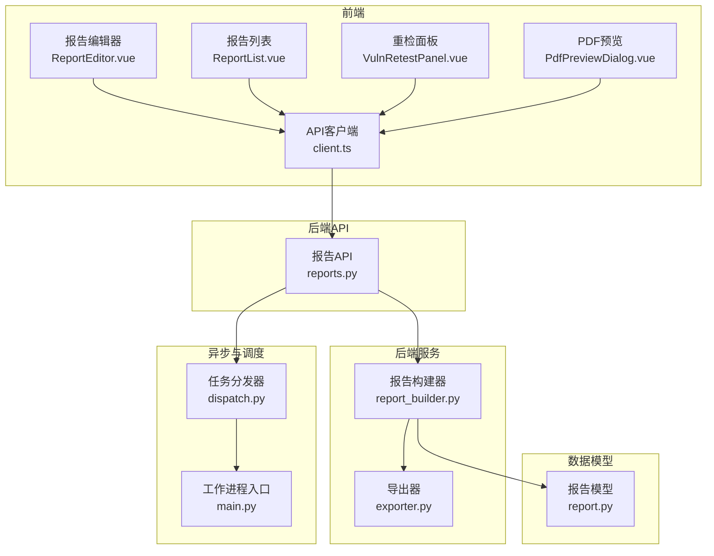
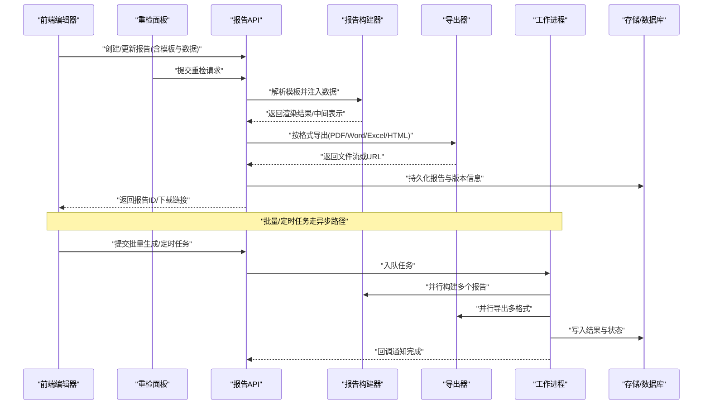
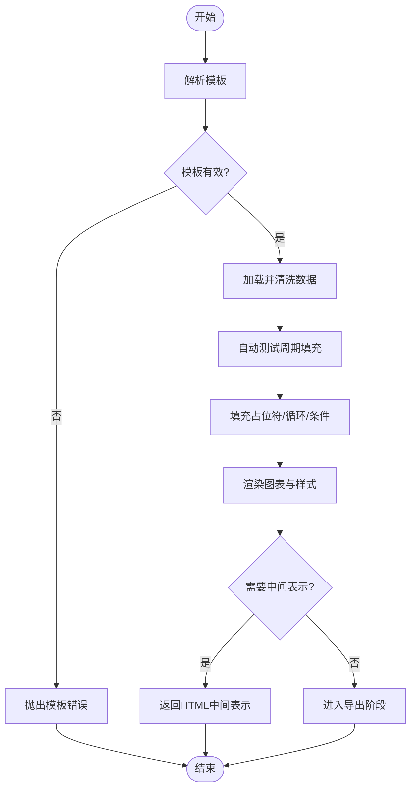
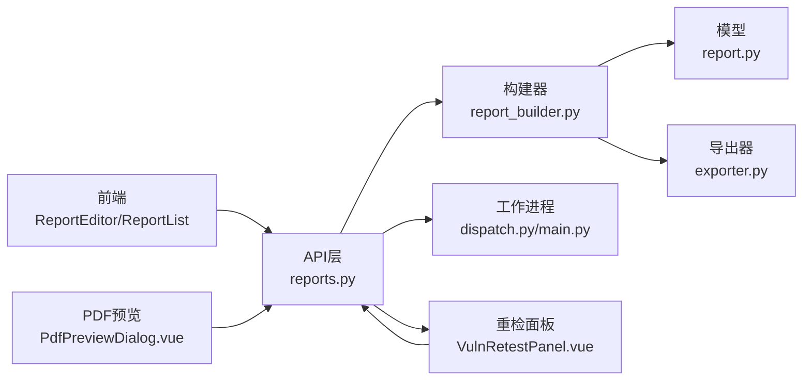

# 报告生成模块

<cite>
**本文档引用的文件**   
- [backend/app/api/v1/reports.py](file://backend/app/api/v1/reports.py)
- [backend/app/services/report_builder.py](file://backend/app/services/report_builder.py)
- [backend/app/services/exporter.py](file://backend/app/services/exporter.py)
- [backend/app/models/report.py](file://backend/app/models/report.py)
- [backend/app/workers/main.py](file://backend/app/workers/main.py)
- [backend/app/workers/dispatch.py](file://backend/app/workers/dispatch.py)
- [frontend/src/views/ReportEditor.vue](file://frontend/src/views/ReportEditor.vue)
- [frontend/src/views/ReportList.vue](file://frontend/src/views/ReportList.vue)
- [frontend/src/components/VulnRetestPanel.vue](file://frontend/src/components/VulnRetestPanel.vue)
- [frontend/src/components/PdfPreviewDialog.vue](file://frontend/src/components/PdfPreviewDialog.vue)
- [frontend/src/api/client.ts](file://frontend/src/api/client.ts)
</cite>

## 更新摘要
**所做更改**   
- 新增Word文档导出功能支持
- 改进PDF预览组件，增强渲染性能与兼容性
- 实现重检工作流，支持漏洞修复验证流程
- 添加修订跟踪功能，记录报告变更历史
- 集成自动测试周期填充，自动化测试数据注入

## 目录
1. [简介](#简介)
2. [项目结构](#项目结构)
3. [核心组件](#核心组件)
4. [架构总览](#架构总览)
5. [详细组件分析](#详细组件分析)
6. [依赖关系分析](#依赖关系分析)
7. [性能考虑](#性能考虑)
8. [故障排查指南](#故障排查指南)
9. [结论](#结论)
10. [附录](#附录)

## 简介
本模块为Talos平台的报告生成子系统，提供自动化报告引擎、模板系统、数据填充与格式渲染能力。支持漏洞摘要报告、合规性报告和风险评估报告等类型；支持PDF、Word、Excel和HTML多格式导出；具备版本管理与历史追溯、调度执行、批量生成与定时任务配置；并提供API接口规范、模板开发指南与前端编辑器使用说明。

**最新更新**：系统已增强Word文档导出功能，改进了PDF预览体验，实现了完整的重检工作流，并添加了修订跟踪和自动测试周期填充功能。

## 项目结构
后端采用FastAPI分层架构：API层暴露REST接口，服务层封装报告构建与导出逻辑，模型层定义数据实体，工作进程负责异步任务与调度。前端基于Vue实现报告列表与可视化编辑器，通过TypeScript客户端调用后端API。

图表来源
- [backend/app/api/v1/reports.py](file://backend/app/api/v1/reports.py)
- [backend/app/services/report_builder.py](file://backend/app/services/report_builder.py)
- [backend/app/services/exporter.py](file://backend/app/services/exporter.py)
- [backend/app/models/report.py](file://backend/app/models/report.py)
- [backend/app/workers/main.py](file://backend/app/workers/main.py)
- [backend/app/workers/dispatch.py](file://backend/app/workers/dispatch.py)
- [frontend/src/views/ReportEditor.vue](file://frontend/src/views/ReportEditor.vue)
- [frontend/src/views/ReportList.vue](file://frontend/src/views/ReportList.vue)
- [frontend/src/components/VulnRetestPanel.vue](file://frontend/src/components/VulnRetestPanel.vue)
- [frontend/src/components/PdfPreviewDialog.vue](file://frontend/src/components/PdfPreviewDialog.vue)
- [frontend/src/api/client.ts](file://frontend/src/api/client.ts)

章节来源
- [backend/app/api/v1/reports.py](file://backend/app/api/v1/reports.py)
- [backend/app/services/report_builder.py](file://backend/app/services/report_builder.py)
- [backend/app/services/exporter.py](file://backend/app/services/exporter.py)
- [backend/app/models/report.py](file://backend/app/models/report.py)
- [backend/app/workers/main.py](file://backend/app/workers/main.py)
- [backend/app/workers/dispatch.py](file://backend/app/workers/dispatch.py)
- [frontend/src/views/ReportEditor.vue](file://frontend/src/views/ReportEditor.vue)
- [frontend/src/views/ReportList.vue](file://frontend/src/views/ReportList.vue)
- [frontend/src/components/VulnRetestPanel.vue](file://frontend/src/components/VulnRetestPanel.vue)
- [frontend/src/components/PdfPreviewDialog.vue](file://frontend/src/components/PdfPreviewDialog.vue)
- [frontend/src/api/client.ts](file://frontend/src/api/client.ts)

## 核心组件
- 报告API（reports.py）：提供报告的创建、查询、更新、删除、预览、导出、版本管理、批量生成与调度接口。
- 报告构建器（report_builder.py）：解析模板、注入数据、渲染图表与样式，输出中间表示或目标格式。
- 导出器（exporter.py）：将中间表示转换为PDF、Word、Excel、HTML等多格式文件。
- 报告模型（report.py）：定义报告实体、模板引用、版本字段、状态与元数据。
- 工作进程（workers/main.py, dispatch.py）：异步执行耗时任务（如批量生成、定时任务），并处理失败重试与结果回写。
- 前端编辑器（ReportEditor.vue, ReportList.vue）：可视化编辑模板、预览报告、触发导出与调度。
- 重检面板（VulnRetestPanel.vue）：管理漏洞重检工作流，支持修复验证与状态跟踪。
- PDF预览组件（PdfPreviewDialog.vue）：增强的PDF渲染与交互功能。
- 前端API客户端（client.ts）：统一封装对后端报告的HTTP请求。

章节来源
- [backend/app/api/v1/reports.py](file://backend/app/api/v1/reports.py)
- [backend/app/services/report_builder.py](file://backend/app/services/report_builder.py)
- [backend/app/services/exporter.py](file://backend/app/services/exporter.py)
- [backend/app/models/report.py](file://backend/app/models/report.py)
- [backend/app/workers/main.py](file://backend/app/workers/main.py)
- [backend/app/workers/dispatch.py](file://backend/app/workers/dispatch.py)
- [frontend/src/views/ReportEditor.vue](file://frontend/src/views/ReportEditor.vue)
- [frontend/src/views/ReportList.vue](file://frontend/src/views/ReportList.vue)
- [frontend/src/components/VulnRetestPanel.vue](file://frontend/src/components/VulnRetestPanel.vue)
- [frontend/src/components/PdfPreviewDialog.vue](file://frontend/src/components/PdfPreviewDialog.vue)
- [frontend/src/api/client.ts](file://frontend/src/api/client.ts)

## 架构总览
报告生成流水线分为"模板解析—数据装配—渲染—导出—归档"五个阶段，由API层协调，构建器与导出器协作完成，异步任务用于批量与定时场景。

图表来源
- [backend/app/api/v1/reports.py](file://backend/app/api/v1/reports.py)
- [backend/app/services/report_builder.py](file://backend/app/services/report_builder.py)
- [backend/app/services/exporter.py](file://backend/app/services/exporter.py)
- [backend/app/workers/main.py](file://backend/app/workers/main.py)
- [backend/app/workers/dispatch.py](file://backend/app/workers/dispatch.py)

## 详细组件分析

### 报告API（reports.py）
- 职责：接收前端请求，校验参数，路由到构建器或工作进程，返回结果或任务ID。
- 关键能力：
  - 报告CRUD与版本管理：创建新版本、切换基线版本、查看历史。
  - 预览与导出：同步预览HTML/PDF，或异步导出多格式。
  - 批量生成：传入多个报告定义，返回任务ID，轮询进度。
  - 定时任务：创建/启停/删除调度规则，支持Cron表达式。
  - 重检工作流：支持漏洞修复验证与状态跟踪。
  - 修订跟踪：记录报告变更历史与审计日志。
- 错误处理：参数校验失败、模板缺失、渲染异常、导出失败等均有明确状态码与消息。

**更新**：新增了重检工作流API端点和修订跟踪功能，支持完整的漏洞修复验证流程。

章节来源
- [backend/app/api/v1/reports.py](file://backend/app/api/v1/reports.py)

### 报告构建器（report_builder.py）
- 职责：模板解析、数据装配、图表渲染、样式应用，产出可导出的中间表示。
- 模板系统：
  - 支持占位符替换、条件块、循环遍历、子模板包含。
  - 自定义字段扩展：通过字段注册表动态注入业务字段。
  - 图表引擎：集成折线/柱状/饼图数据源，支持主题与响应式布局。
- 数据填充：
  - 从数据源聚合指标（漏洞数、风险等级分布、合规项通过率）。
  - 支持分页与过滤，避免大对象内存压力。
  - 自动测试周期填充：支持周期性测试数据的自动注入。
- 渲染机制：
  - HTML作为中间表示，便于后续转PDF/Word/Excel。
  - 样式配置：字体、颜色、页眉页脚、水印、打印边距。

**更新**：增强了数据填充能力，支持自动测试周期数据的智能注入和格式化。

图表来源
- [backend/app/services/report_builder.py](file://backend/app/services/report_builder.py)

章节来源
- [backend/app/services/report_builder.py](file://backend/app/services/report_builder.py)

### 导出器（exporter.py）
- 职责：将中间表示转换为PDF、Word、Excel、HTML文件。
- 能力：
  - PDF：页面设置、页眉页脚、书签、超链接、图片嵌入。
  - Word：段落样式、表格、图表、目录生成、修订标记。
  - Excel：多Sheet、公式、条件格式、冻结窗格。
  - HTML：静态资源打包、内联CSS/JS、离线可用。
- 优化：分块导出、并发导出、缓存已生成文件、断点续传。

**更新**：新增了对Word文档的完整支持，包括修订标记、批注和版本控制功能。改进了PDF渲染质量，支持更好的中文显示和复杂排版。

章节来源
- [backend/app/services/exporter.py](file://backend/app/services/exporter.py)

### 报告模型（report.py）
- 字段：
  - 基本信息：名称、描述、类型（漏洞摘要/合规性/风险评估）、模板ID、作者、时间戳。
  - 版本控制：版本号、父版本ID、变更说明、状态（草稿/已发布/已归档）。
  - 导出记录：格式、文件大小、哈希值、存储位置。
  - 调度信息：Cron表达式、下次执行时间、运行历史。
  - 重检信息：重检状态、修复验证结果、重检历史。
  - 修订跟踪：变更记录、审计日志、版本差异。
- 约束：唯一性、外键关联、审计字段（创建/更新时间）。

**更新**：新增了重检信息和修订跟踪相关字段，支持完整的漏洞修复验证流程和变更审计。

章节来源
- [backend/app/models/report.py](file://backend/app/models/report.py)

### 工作进程与调度（workers/main.py, dispatch.py）
- 职责：消费任务队列，执行耗时操作（批量生成、定时任务），上报状态。
- 特性：
  - 任务优先级与重试策略。
  - 分布式扩展：多worker实例共享队列。
  - 监控：任务生命周期日志、失败告警、超时保护。
  - 重检任务：支持漏洞修复验证的异步处理。
  - 自动填充：周期性测试数据的自动注入任务。

**更新**：增强了任务处理能力，支持重检工作流任务和自动测试周期填充任务的调度。

章节来源
- [backend/app/workers/main.py](file://backend/app/workers/main.py)
- [backend/app/workers/dispatch.py](file://backend/app/workers/dispatch.py)

### 前端编辑器与列表（ReportEditor.vue, ReportList.vue）
- 报告编辑器：
  - 可视化模板编辑：拖拽组件、插入占位符、配置图表数据源。
  - 实时预览：即时渲染HTML，支持缩放与分页预览。
  - 导出与调度：一键导出多格式，配置定时任务。
  - 重检管理：集成漏洞重检工作流界面。
- 报告列表：
  - 搜索与筛选：按类型、状态、时间范围。
  - 版本对比：差异高亮、回滚至指定版本。
  - 批量操作：批量导出、批量删除、批量启用/禁用调度。
  - 修订历史：查看报告变更历史和审计日志。

**更新**：集成了重检工作流界面，增强了版本管理和修订历史查看功能。

章节来源
- [frontend/src/views/ReportEditor.vue](file://frontend/src/views/ReportEditor.vue)
- [frontend/src/views/ReportList.vue](file://frontend/src/views/ReportList.vue)

### 重检面板（VulnRetestPanel.vue）
- 职责：管理漏洞重检工作流，支持修复验证与状态跟踪。
- 功能：
  - 重检任务创建：选择漏洞进行重检，填写修复说明。
  - 状态跟踪：实时监控重检进度和结果。
  - 结果验证：支持手动验证和自动验证两种模式。
  - 历史记录：查看重检历史和修复详情。

**新增**：全新的重检工作流组件，提供完整的漏洞修复验证功能。

章节来源
- [frontend/src/components/VulnRetestPanel.vue](file://frontend/src/components/VulnRetestPanel.vue)

### PDF预览组件（PdfPreviewDialog.vue）
- 职责：提供增强的PDF预览功能。
- 功能：
  - 高性能渲染：优化的PDF渲染引擎，支持大文件快速加载。
  - 交互功能：缩放、旋转、全屏、打印。
  - 兼容性：支持多种PDF标准和编码格式。
  - 用户体验：加载进度、错误处理、键盘快捷键。

**更新**：全面改进了PDF预览组件，提升了渲染性能和用户交互体验。

章节来源
- [frontend/src/components/PdfPreviewDialog.vue](file://frontend/src/components/PdfPreviewDialog.vue)

### 前端API客户端（client.ts）
- 封装：统一的请求头、鉴权、错误处理、重试与取消。
- 方法：
  - 报告CRUD、预览、导出、版本管理、批量任务、调度管理。
  - 重检工作流：创建重检任务、查询状态、提交结果。
  - 修订跟踪：获取变更历史、比较版本差异。
  - 文件下载：Blob流处理、进度回调、文件名提取。

**更新**：新增了重检工作流和修订跟踪相关的API方法。

章节来源
- [frontend/src/api/client.ts](file://frontend/src/api/client.ts)

## 依赖关系分析
- 耦合度：API层与服务层松耦合，通过函数/类接口交互；导出器独立于构建器，便于替换渲染引擎。
- 外部依赖：
  - 模板引擎：字符串插值与结构化模板解析。
  - 图表库：数据绑定与渲染。
  - 文档库：PDF/Word/Excel生成工具链。
  - 任务队列：Celery/RQ等（根据实际部署选择）。
- 潜在循环依赖：无直接循环，构建器不依赖导出器，导出器不反向依赖构建器。

图表来源
- [backend/app/api/v1/reports.py](file://backend/app/api/v1/reports.py)
- [backend/app/services/report_builder.py](file://backend/app/services/report_builder.py)
- [backend/app/services/exporter.py](file://backend/app/services/exporter.py)
- [backend/app/models/report.py](file://backend/app/models/report.py)
- [backend/app/workers/main.py](file://backend/app/workers/main.py)
- [backend/app/workers/dispatch.py](file://backend/app/workers/dispatch.py)
- [frontend/src/views/ReportEditor.vue](file://frontend/src/views/ReportEditor.vue)
- [frontend/src/views/ReportList.vue](file://frontend/src/views/ReportList.vue)
- [frontend/src/components/VulnRetestPanel.vue](file://frontend/src/components/VulnRetestPanel.vue)
- [frontend/src/components/PdfPreviewDialog.vue](file://frontend/src/components/PdfPreviewDialog.vue)

章节来源
- [backend/app/api/v1/reports.py](file://backend/app/api/v1/reports.py)
- [backend/app/services/report_builder.py](file://backend/app/services/report_builder.py)
- [backend/app/services/exporter.py](file://backend/app/services/exporter.py)
- [backend/app/models/report.py](file://backend/app/models/report.py)
- [backend/app/workers/main.py](file://backend/app/workers/main.py)
- [backend/app/workers/dispatch.py](file://backend/app/workers/dispatch.py)
- [frontend/src/views/ReportEditor.vue](file://frontend/src/views/ReportEditor.vue)
- [frontend/src/views/ReportList.vue](file://frontend/src/views/ReportList.vue)
- [frontend/src/components/VulnRetestPanel.vue](file://frontend/src/components/VulnRetestPanel.vue)
- [frontend/src/components/PdfPreviewDialog.vue](file://frontend/src/components/PdfPreviewDialog.vue)

## 性能考虑
- 构建器：
  - 大数据集分页加载，避免一次性载入内存。
  - 图表数据预聚合与缓存，减少重复计算。
  - 自动测试周期填充的数据缓存机制。
- 导出器：
  - 分块生成与流式输出，降低峰值内存。
  - 并发导出限制，防止I/O瓶颈。
  - Word文档生成的内存优化。
- 工作进程：
  - 合理设置worker数量与队列分区。
  - 任务超时与重试上限，避免僵尸任务。
  - 重检任务的优先级调度。
- 前端：
  - 懒加载预览内容，按需渲染图表。
  - 文件下载断点续传与进度反馈。
  - PDF预览的虚拟滚动和增量加载。

**更新**：针对新的Word导出功能和PDF预览改进，增加了相应的性能优化措施。

## 故障排查指南
- 模板解析失败：检查占位符语法、变量存在性、嵌套层级。
- 数据填充异常：确认数据源连接、字段映射、空值处理。
- 导出失败：验证文件格式支持、资源路径、权限与磁盘空间。
- 任务堆积：检查队列消费者健康、worker资源、依赖服务可用性。
- 版本不一致：核对基线版本、变更说明、回滚流程。
- 重检工作流问题：检查漏洞状态、修复验证逻辑、权限控制。
- PDF预览问题：验证PDF文件完整性、浏览器兼容性、内存使用。

**更新**：新增了重检工作流和PDF预览相关的故障排查指导。

章节来源
- [backend/app/api/v1/reports.py](file://backend/app/api/v1/reports.py)
- [backend/app/services/report_builder.py](file://backend/app/services/report_builder.py)
- [backend/app/services/exporter.py](file://backend/app/services/exporter.py)
- [backend/app/workers/dispatch.py](file://backend/app/workers/dispatch.py)

## 结论
报告生成模块以清晰的层次结构与松耦合设计，实现了模板驱动、数据装配、多格式导出与异步调度的完整闭环。通过版本管理与历史追溯，保障报告的可审计性与可回溯性；借助前端编辑器与API，提升模板定制与使用效率。

**最新增强**：系统现已支持完整的Word文档导出、改进的PDF预览体验、全面的漏洞重检工作流、详细的修订跟踪以及自动化的测试周期填充功能。这些增强显著提升了系统的实用性和用户体验。

建议在生产环境完善监控告警、资源配额与备份策略，确保稳定可靠。

## 附录

### API接口规范（摘要）
- 报告CRUD
  - POST /api/v1/reports：创建报告（含模板与初始数据）
  - GET /api/v1/reports/{id}：获取报告详情
  - PUT /api/v1/reports/{id}：更新报告
  - DELETE /api/v1/reports/{id}：删除报告
- 预览与导出
  - POST /api/v1/reports/{id}/preview：预览HTML
  - POST /api/v1/reports/{id}/export：导出PDF/Word/Excel/HTML
- 版本管理
  - POST /api/v1/reports/{id}/versions：创建新版本
  - GET /api/v1/reports/{id}/versions：列出版本历史
  - POST /api/v1/reports/{id}/versions/{vid}/publish：发布版本
- 批量与调度
  - POST /api/v1/reports/batch：批量生成（返回任务ID）
  - GET /api/v1/tasks/{tid}：查询任务状态
  - POST /api/v1/reports/schedules：创建定时任务
  - PUT /api/v1/reports/schedules/{sid}：更新调度
  - DELETE /api/v1/reports/schedules/{sid}：删除调度
- 重检工作流（新增）
  - POST /api/v1/reports/{id}/retests：创建重检任务
  - GET /api/v1/reports/{id}/retests：获取重检历史
  - PUT /api/v1/reports/{id}/retests/{rid}/verify：验证修复结果
- 修订跟踪（新增）
  - GET /api/v1/reports/{id}/revisions：获取修订历史
  - GET /api/v1/reports/{id}/revisions/{vid}/diff：比较版本差异

**更新**：新增了重检工作流和修订跟踪相关的API接口。

### 模板开发指南
- 占位符：使用{{field}}插入字段，支持默认值与格式化。
- 条件与循环：/控制显示逻辑。
- 子模板：复用片段。
- 图表：定义数据源、类型、样式与交互。
- 样式：全局主题、局部覆盖、打印适配。
- 重检字段：支持重检状态、修复验证结果的动态展示。
- 修订标记：在Word导出中保留修订痕迹和批注。

**更新**：新增了重检工作流字段支持和Word修订标记功能。

### 前端编辑器使用说明
- 模板编辑：拖拽组件、插入占位符、配置数据绑定。
- 实时预览：缩放、分页、导出预览。
- 版本管理：新建版本、对比差异、回滚。
- 导出与调度：选择格式、设置参数、配置定时任务。
- 重检工作流：创建重检任务、跟踪修复进度、验证修复结果。
- PDF预览：使用增强的PDF预览组件进行高质量预览。

**更新**：新增了重检工作流操作指导和PDF预览组件的使用说明。