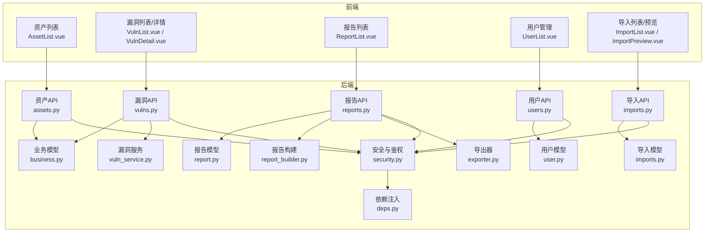
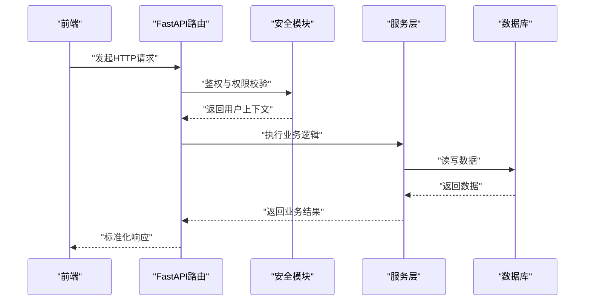
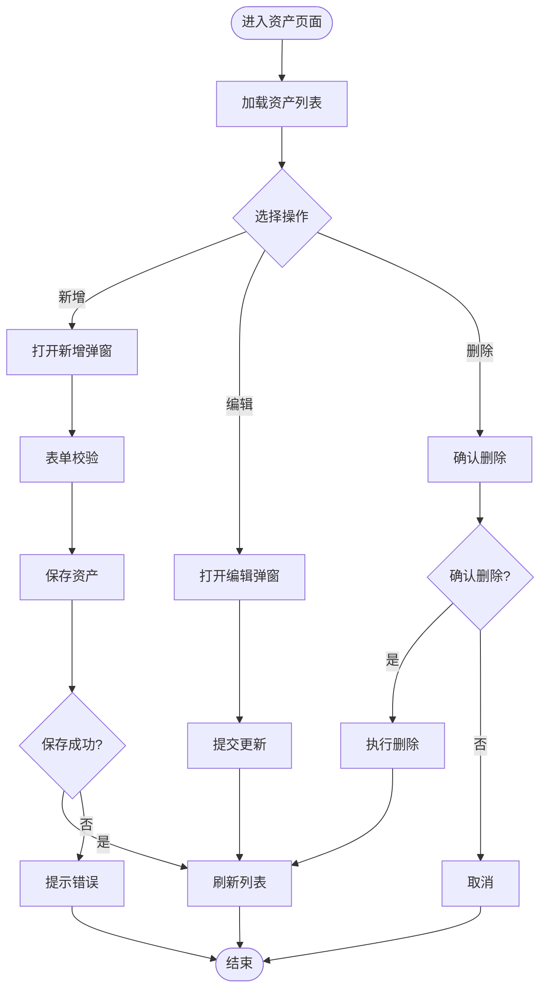
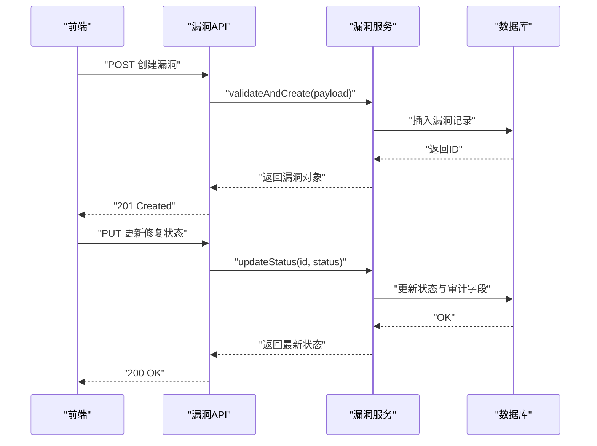
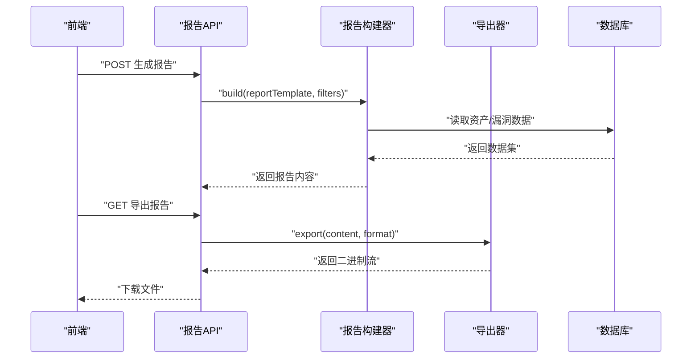
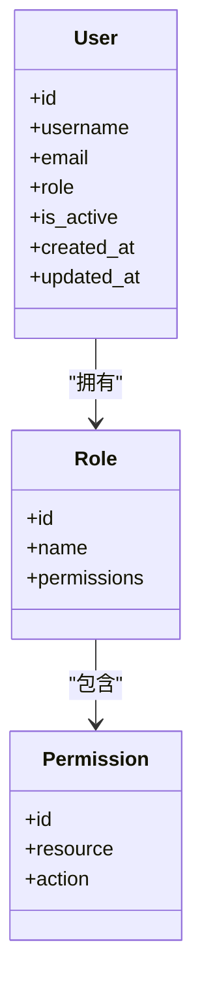
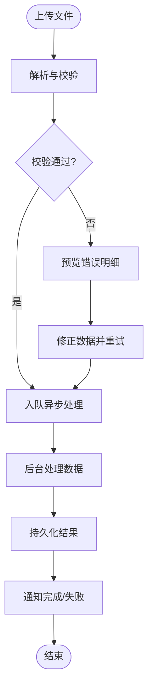
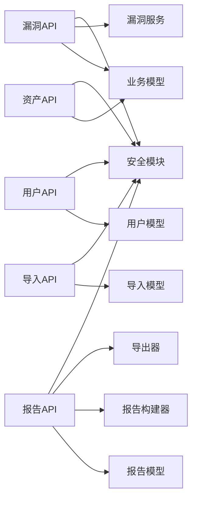

# 核心功能概述

<cite>
**本文引用的文件**   
- [backend/app/main.py](file://backend/app/main.py)
- [backend/app/api/v1/assets.py](file://backend/app/api/v1/assets.py)
- [backend/app/api/v1/auth.py](file://backend/app/api/v1/auth.py)
- [backend/app/api/v1/users.py](file://backend/app/api/v1/users.py)
- [backend/app/api/v1/vulns.py](file://backend/app/api/v1/vulns.py)
- [backend/app/api/v1/reports.py](file://backend/app/api/v1/reports.py)
- [backend/app/api/v1/imports.py](file://backend/app/api/v1/imports.py)
- [backend/app/models/business.py](file://backend/app/models/business.py)
- [backend/app/models/user.py](file://backend/app/models/user.py)
- [backend/app/models/report.py](file://backend/app/models/report.py)
- [backend/app/models/imports.py](file://backend/app/models/imports.py)
- [backend/app/services/report_builder.py](file://backend/app/services/report_builder.py)
- [backend/app/services/exporter.py](file://backend/app/services/exporter.py)
- [backend/app/services/vuln_service.py](file://backend/app/services/vuln_service.py)
- [backend/app/core/security.py](file://backend/app/core/security.py)
- [backend/app/core/deps.py](file://backend/app/core/deps.py)
- [frontend/src/views/AssetList.vue](file://frontend/src/views/AssetList.vue)
- [frontend/src/views/VulnList.vue](file://frontend/src/views/VulnList.vue)
- [frontend/src/views/VulnDetail.vue](file://frontend/src/views/VulnDetail.vue)
- [frontend/src/views/ReportList.vue](file://frontend/src/views/ReportList.vue)
- [frontend/src/views/UserList.vue](file://frontend/src/views/UserList.vue)
- [frontend/src/views/ImportList.vue](file://frontend/src/views/ImportList.vue)
- [frontend/src/views/ImportPreview.vue](file://frontend/src/views/ImportPreview.vue)
- [frontend/src/components/AssetFormDialog.vue](file://frontend/src/components/AssetFormDialog.vue)
</cite>

## 目录
1. [简介](#简介)
2. [项目结构](#项目结构)
3. [核心组件](#核心组件)
4. [架构总览](#架构总览)
5. [详细组件分析](#详细组件分析)
6. [依赖分析](#依赖分析)
7. [性能考虑](#性能考虑)
8. [故障排查指南](#故障排查指南)
9. [结论](#结论)
10. [附录](#附录)

## 简介
本文件面向开发者与实施人员，系统性梳理Talos漏洞管理平台的“资产管理、漏洞管理、报告生成、用户管理、导入导出”五大核心模块。文档聚焦各模块的业务目标、关键能力、数据流与交互流程，并辅以流程图帮助理解业务逻辑与实现要点。

## 项目结构
后端采用FastAPI分层架构：路由层（api）、领域模型（models）、服务层（services）、安全与依赖注入（core），以及异步任务（workers）。前端基于Vue3+TypeScript，按视图与组件组织，通过API客户端与后端交互。

图表来源
- [backend/app/main.py](file://backend/app/main.py)
- [backend/app/api/v1/assets.py](file://backend/app/api/v1/assets.py)
- [backend/app/api/v1/vulns.py](file://backend/app/api/v1/vulns.py)
- [backend/app/api/v1/reports.py](file://backend/app/api/v1/reports.py)
- [backend/app/api/v1/users.py](file://backend/app/api/v1/users.py)
- [backend/app/api/v1/imports.py](file://backend/app/api/v1/imports.py)
- [backend/app/core/security.py](file://backend/app/core/security.py)
- [backend/app/core/deps.py](file://backend/app/core/deps.py)
- [backend/app/models/business.py](file://backend/app/models/business.py)
- [backend/app/models/user.py](file://backend/app/models/user.py)
- [backend/app/models/report.py](file://backend/app/models/report.py)
- [backend/app/models/imports.py](file://backend/app/models/imports.py)
- [backend/app/services/report_builder.py](file://backend/app/services/report_builder.py)
- [backend/app/services/exporter.py](file://backend/app/services/exporter.py)
- [backend/app/services/vuln_service.py](file://backend/app/services/vuln_service.py)

章节来源
- [backend/app/main.py](file://backend/app/main.py)

## 核心组件
- 资产管理：提供资产的增删改查、分类管理与状态跟踪，支撑后续漏洞扫描与修复闭环。
- 漏洞管理：支持漏洞录入、分类、优先级设置、修复跟踪与生命周期流转。
- 报告生成：自动化报告构建、模板定制与多格式导出。
- 用户管理：角色与权限控制、认证机制与访问审计。
- 导入导出：批量数据处理、预览校验与结果回写。

章节来源
- [backend/app/api/v1/assets.py](file://backend/app/api/v1/assets.py)
- [backend/app/api/v1/vulns.py](file://backend/app/api/v1/vulns.py)
- [backend/app/api/v1/reports.py](file://backend/app/api/v1/reports.py)
- [backend/app/api/v1/users.py](file://backend/app/api/v1/users.py)
- [backend/app/api/v1/imports.py](file://backend/app/api/v1/imports.py)
- [backend/app/models/business.py](file://backend/app/models/business.py)
- [backend/app/models/user.py](file://backend/app/models/user.py)
- [backend/app/models/report.py](file://backend/app/models/report.py)
- [backend/app/models/imports.py](file://backend/app/models/imports.py)
- [backend/app/services/report_builder.py](file://backend/app/services/report_builder.py)
- [backend/app/services/exporter.py](file://backend/app/services/exporter.py)
- [backend/app/services/vuln_service.py](file://backend/app/services/vuln_service.py)

## 架构总览
系统采用前后端分离架构。前端通过RESTful API调用后端接口；后端以FastAPI暴露路由，结合Pydantic进行请求/响应校验，使用SQLAlchemy模型持久化数据，并通过服务层封装业务逻辑。安全模块负责认证授权，依赖注入贯穿控制器与服务。

图表来源
- [backend/app/core/security.py](file://backend/app/core/security.py)
- [backend/app/core/deps.py](file://backend/app/core/deps.py)
- [backend/app/api/v1/assets.py](file://backend/app/api/v1/assets.py)
- [backend/app/api/v1/vulns.py](file://backend/app/api/v1/vulns.py)
- [backend/app/api/v1/reports.py](file://backend/app/api/v1/reports.py)
- [backend/app/api/v1/users.py](file://backend/app/api/v1/users.py)
- [backend/app/api/v1/imports.py](file://backend/app/api/v1/imports.py)

## 详细组件分析

### 资产管理模块
- 功能特性
  - 资产CRUD：创建、查询、更新、删除资产实体。
  - 分类管理：按类型/标签对资产进行分类，便于筛选与统计。
  - 状态跟踪：记录资产生命周期状态（如在线、离线、维护中）。
- 数据模型
  - 资产实体包含名称、IP/域名、分类、状态、描述等字段，关联用户与时间戳。
- 前端交互
  - 列表页展示分页与筛选；编辑弹窗提交表单；支持批量操作。
- 业务流程
  - 新增资产时进行基础校验，落库后返回标准响应；更新时保留审计字段。

图表来源
- [backend/app/api/v1/assets.py](file://backend/app/api/v1/assets.py)
- [backend/app/models/business.py](file://backend/app/models/business.py)
- [frontend/src/views/AssetList.vue](file://frontend/src/views/AssetList.vue)
- [frontend/src/components/AssetFormDialog.vue](file://frontend/src/components/AssetFormDialog.vue)

章节来源
- [backend/app/api/v1/assets.py](file://backend/app/api/v1/assets.py)
- [backend/app/models/business.py](file://backend/app/models/business.py)
- [frontend/src/views/AssetList.vue](file://frontend/src/views/AssetList.vue)
- [frontend/src/components/AssetFormDialog.vue](file://frontend/src/components/AssetFormDialog.vue)

### 漏洞管理模块
- 功能特性
  - 漏洞录入：支持标题、描述、CVSS评分、影响范围、复现步骤等。
  - 分类与优先级：按漏洞类型与严重级别分类，设置修复优先级。
  - 修复跟踪：记录修复状态、责任人、计划修复时间与验证结果。
- 数据模型
  - 漏洞实体关联资产、用户、分类与优先级枚举，含状态机流转字段。
- 服务层
  - 提供漏洞计算、聚合、统计与修复建议的封装方法。
- 前端交互
  - 列表页支持筛选与排序；详情页展示全量信息与修复历史。

图表来源
- [backend/app/api/v1/vulns.py](file://backend/app/api/v1/vulns.py)
- [backend/app/services/vuln_service.py](file://backend/app/services/vuln_service.py)
- [backend/app/models/business.py](file://backend/app/models/business.py)
- [frontend/src/views/VulnList.vue](file://frontend/src/views/VulnList.vue)
- [frontend/src/views/VulnDetail.vue](file://frontend/src/views/VulnDetail.vue)

章节来源
- [backend/app/api/v1/vulns.py](file://backend/app/api/v1/vulns.py)
- [backend/app/services/vuln_service.py](file://backend/app/services/vuln_service.py)
- [backend/app/models/business.py](file://backend/app/models/business.py)
- [frontend/src/views/VulnList.vue](file://frontend/src/views/VulnList.vue)
- [frontend/src/views/VulnDetail.vue](file://frontend/src/views/VulnDetail.vue)

### 报告生成模块
- 功能特性
  - 自动化报告：根据资产与漏洞数据自动生成报告草稿。
  - 模板定制：支持多种报告模板与样式配置。
  - 多格式导出：导出为PDF/Word等常用格式。
- 服务层
  - 报告构建器负责组装数据、渲染模板；导出器负责格式转换与下载。
- 前端交互
  - 报告列表页支持新建、预览、导出与版本管理。

图表来源
- [backend/app/api/v1/reports.py](file://backend/app/api/v1/reports.py)
- [backend/app/services/report_builder.py](file://backend/app/services/report_builder.py)
- [backend/app/services/exporter.py](file://backend/app/services/exporter.py)
- [backend/app/models/report.py](file://backend/app/models/report.py)
- [frontend/src/views/ReportList.vue](file://frontend/src/views/ReportList.vue)

章节来源
- [backend/app/api/v1/reports.py](file://backend/app/api/v1/reports.py)
- [backend/app/services/report_builder.py](file://backend/app/services/report_builder.py)
- [backend/app/services/exporter.py](file://backend/app/services/exporter.py)
- [backend/app/models/report.py](file://backend/app/models/report.py)
- [frontend/src/views/ReportList.vue](file://frontend/src/views/ReportList.vue)

### 用户管理模块
- 功能特性
  - 权限控制：基于角色的访问控制（RBAC），细粒度到资源与操作。
  - 角色管理：定义角色、分配权限集，支持继承与覆盖。
  - 安全认证：登录、令牌签发与校验、会话管理。
- 安全与依赖
  - 安全模块提供密码哈希、令牌生成与校验；依赖注入统一获取当前用户与权限上下文。
- 前端交互
  - 用户列表页支持新增、编辑、禁用与角色分配。

图表来源
- [backend/app/models/user.py](file://backend/app/models/user.py)
- [backend/app/core/security.py](file://backend/app/core/security.py)
- [backend/app/core/deps.py](file://backend/app/core/deps.py)
- [backend/app/api/v1/users.py](file://backend/app/api/v1/users.py)
- [frontend/src/views/UserList.vue](file://frontend/src/views/UserList.vue)

章节来源
- [backend/app/models/user.py](file://backend/app/models/user.py)
- [backend/app/core/security.py](file://backend/app/core/security.py)
- [backend/app/core/deps.py](file://backend/app/core/deps.py)
- [backend/app/api/v1/users.py](file://backend/app/api/v1/users.py)
- [frontend/src/views/UserList.vue](file://frontend/src/views/UserList.vue)

### 导入导出功能
- 功能特性
  - 批量导入：支持CSV/Excel等格式的批量数据导入，含预览与校验。
  - 批量导出：将资产/漏洞/报告数据导出为标准格式。
  - 任务调度：后台异步处理大文件导入，避免阻塞主线程。
- 数据模型
  - 导入任务记录任务状态、进度、错误信息，支持重试与回滚。
- 前端交互
  - 导入列表页显示任务状态；预览页展示校验结果与差异对比。

图表来源
- [backend/app/api/v1/imports.py](file://backend/app/api/v1/imports.py)
- [backend/app/models/imports.py](file://backend/app/models/imports.py)
- [frontend/src/views/ImportList.vue](file://frontend/src/views/ImportList.vue)
- [frontend/src/views/ImportPreview.vue](file://frontend/src/views/ImportPreview.vue)

章节来源
- [backend/app/api/v1/imports.py](file://backend/backend/app/api/v1/imports.py)
- [backend/app/models/imports.py](file://backend/app/models/imports.py)
- [frontend/src/views/ImportList.vue](file://frontend/src/views/ImportList.vue)
- [frontend/src/views/ImportPreview.vue](file://frontend/src/views/ImportPreview.vue)

## 依赖分析
- 模块耦合
  - 路由层依赖服务层，服务层依赖模型与外部工具（如报告构建器、导出器）。
  - 安全模块被所有受保护的路由复用，保证统一的鉴权策略。
- 外部集成
  - 报告构建器可能依赖模板引擎与文档库；导出器依赖格式转换库。
  - 导入模块可能依赖第三方解析库（如Excel/CSV解析）。
- 潜在风险
  - 服务层与模型间存在紧耦合，需关注变更传播。
  - 大文件导入与报告导出需考虑内存与I/O瓶颈。

图表来源
- [backend/app/api/v1/assets.py](file://backend/app/api/v1/assets.py)
- [backend/app/api/v1/vulns.py](file://backend/app/api/v1/vulns.py)
- [backend/app/api/v1/reports.py](file://backend/app/api/v1/reports.py)
- [backend/app/api/v1/users.py](file://backend/app/api/v1/users.py)
- [backend/app/api/v1/imports.py](file://backend/app/api/v1/imports.py)
- [backend/app/models/business.py](file://backend/app/models/business.py)
- [backend/app/models/report.py](file://backend/app/models/report.py)
- [backend/app/models/user.py](file://backend/app/models/user.py)
- [backend/app/models/imports.py](file://backend/app/models/imports.py)
- [backend/app/services/vuln_service.py](file://backend/app/services/vuln_service.py)
- [backend/app/services/report_builder.py](file://backend/app/services/report_builder.py)
- [backend/app/services/exporter.py](file://backend/app/services/exporter.py)
- [backend/app/core/security.py](file://backend/app/core/security.py)

章节来源
- [backend/app/api/v1/assets.py](file://backend/app/api/v1/assets.py)
- [backend/app/api/v1/vulns.py](file://backend/app/api/v1/vulns.py)
- [backend/app/api/v1/reports.py](file://backend/app/api/v1/reports.py)
- [backend/app/api/v1/users.py](file://backend/app/api/v1/users.py)
- [backend/app/api/v1/imports.py](file://backend/app/api/v1/imports.py)
- [backend/app/models/business.py](file://backend/app/models/business.py)
- [backend/app/models/report.py](file://backend/app/models/report.py)
- [backend/app/models/user.py](file://backend/app/models/user.py)
- [backend/app/models/imports.py](file://backend/app/models/imports.py)
- [backend/app/services/vuln_service.py](file://backend/app/services/vuln_service.py)
- [backend/app/services/report_builder.py](file://backend/app/services/report_builder.py)
- [backend/app/services/exporter.py](file://backend/app/services/exporter.py)
- [backend/app/core/security.py](file://backend/app/core/security.py)

## 性能考虑
- 数据库层面
  - 合理使用索引（如资产IP、漏洞优先级、状态字段）提升查询效率。
  - 分页与过滤在前端与后端协同实现，避免一次性拉取大量数据。
- 服务层优化
  - 报告构建与导出采用异步任务队列，避免阻塞请求。
  - 大文件导入分批处理，降低内存峰值。
- I/O与缓存
  - 报告模板与字典数据可缓存，减少重复计算。
  - 导出文件流式传输，避免整文件驻留内存。

[本节为通用指导，不直接分析具体文件]

## 故障排查指南
- 常见问题
  - 鉴权失败：检查令牌有效性、角色权限配置与依赖注入上下文。
  - 导入失败：查看导入任务的错误明细与校验日志，定位数据格式问题。
  - 报告导出异常：确认模板可用性与依赖库安装情况。
- 调试建议
  - 启用详细日志，记录请求链路、参数与响应码。
  - 使用测试用例覆盖关键路径，确保回归稳定性。

章节来源
- [backend/app/core/security.py](file://backend/app/core/security.py)
- [backend/app/api/v1/imports.py](file://backend/app/api/v1/imports.py)
- [backend/app/models/imports.py](file://backend/app/models/imports.py)
- [backend/app/services/report_builder.py](file://backend/app/services/report_builder.py)
- [backend/app/services/exporter.py](file://backend/app/services/exporter.py)

## 结论
Talos平台围绕资产、漏洞、报告、用户与导入导出五大模块构建了完整的漏洞管理闭环。通过清晰的分层架构与模块化设计，系统在可扩展性、可维护性与安全性方面具备良好基础。建议在后续迭代中持续完善权限模型、性能优化与监控告警，以提升整体用户体验与运维效率。

[本节为总结性内容，不直接分析具体文件]

## 附录
- 使用场景示例
  - 资产上新：从CMDB批量导入资产，自动分类与状态初始化。
  - 漏洞录入：手动或扫描结果导入漏洞，设置优先级并指派修复责任人。
  - 报告输出：按季度生成合规报告，导出PDF供管理层审阅。
  - 用户权限：为新成员分配只读角色，限制敏感操作。
  - 批量导入：定期导入外部扫描结果，预览校验后入库。

[本节为概念性内容，不直接分析具体文件]