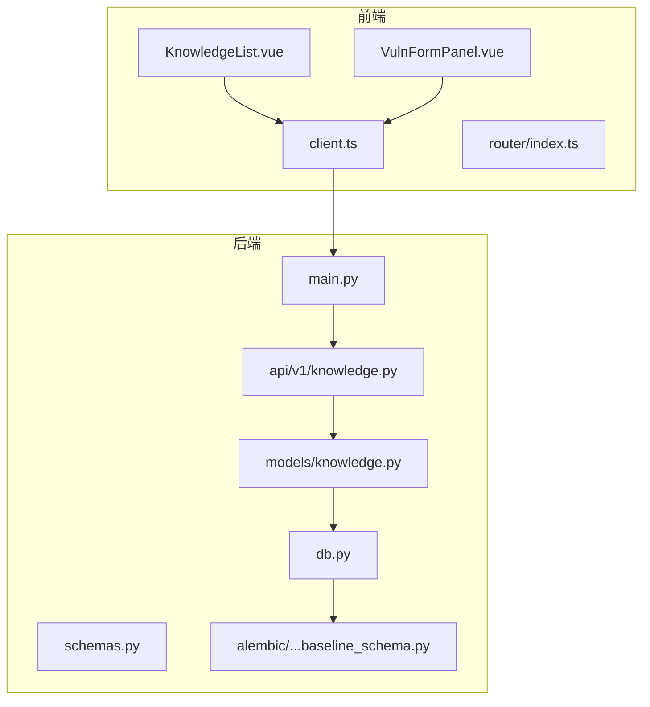
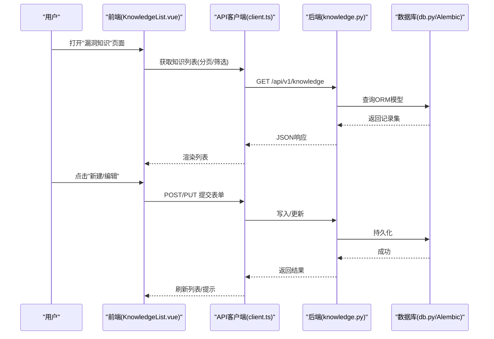
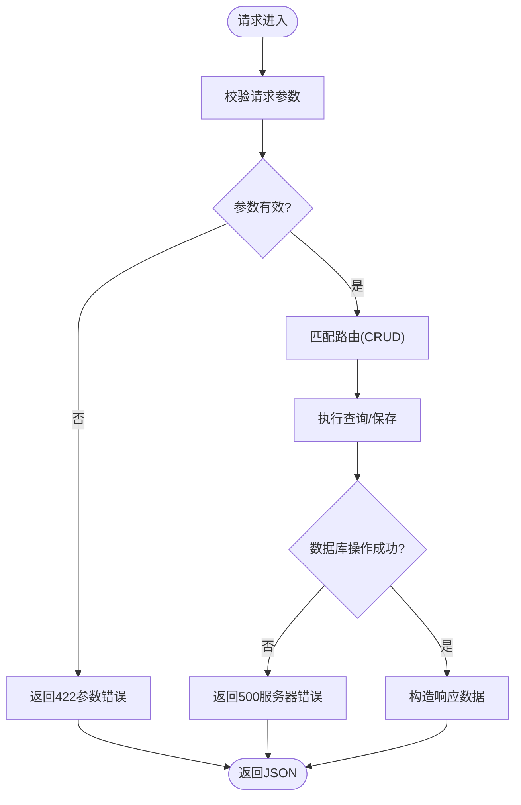
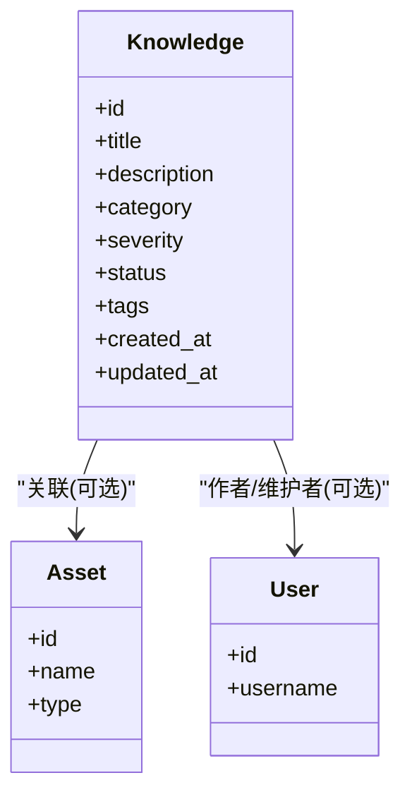
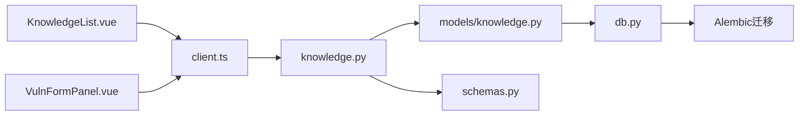

# 漏洞知识库管理

<cite>
**本文引用的文件**   
- [backend/app/main.py](file://backend/app/main.py)
- [backend/app/api/v1/knowledge.py](file://backend/app/api/v1/knowledge.py)
- [backend/app/models/knowledge.py](file://backend/app/models/knowledge.py)
- [backend/app/schemas.py](file://backend/app/schemas.py)
- [backend/app/core/config.py](file://backend/app/core/config.py)
- [backend/app/db.py](file://backend/app/db.py)
- [backend/alembic/versions/e9054a84d196_baseline_schema.py](file://backend/alembic/versions/e9054a84d196_baseline_schema.py)
- [frontend/src/views/KnowledgeList.vue](file://frontend/src/views/KnowledgeList.vue)
- [frontend/src/components/VulnFormPanel.vue](file://frontend/src/components/VulnFormPanel.vue)
- [frontend/src/router/index.ts](file://frontend/src/router/index.ts)
- [frontend/src/api/client.ts](file://frontend/src/api/client.ts)
</cite>

## 更新摘要
**所做更改**   
- 新增漏洞知识库管理系统完整功能，支持漏洞名称、严重程度管理和批量操作
- 预置50个常见漏洞模板，提供开箱即用的漏洞知识基础
- 完善前后端分离架构，实现完整的CRUD操作和批量导入删除编辑功能
- 增强数据模型设计，支持漏洞分类、严重级别、状态管理等核心属性

## 目录
1. [简介](#简介)
2. [项目结构](#项目结构)
3. [核心组件](#核心组件)
4. [架构总览](#架构总览)
5. [详细组件分析](#详细组件分析)
6. [依赖关系分析](#依赖关系分析)
7. [性能考虑](#性能考虑)
8. [故障排查指南](#故障排查指南)
9. [结论](#结论)
10. [附录](#附录)

## 简介
本仓库实现了一个完整的"漏洞知识库管理系统"，涵盖前后端分离的现代化架构：后端基于 Python（FastAPI）提供 RESTful API，使用 SQLAlchemy + Alembic 进行数据建模与迁移；前端基于 Vue 3 + TypeScript，通过 API 客户端与后端交互。系统围绕"漏洞知识"的创建、编辑、查询、导入导出等能力构建，同时包含资产、报告、用户、鉴权等相关模块。

**最新更新**：系统现已支持漏洞名称管理、严重程度分级、批量导入删除编辑操作，并预置了50个常见漏洞模板，为安全团队提供开箱即用的漏洞知识库基础。本文聚焦于"漏洞知识库管理"的核心流程、数据结构、接口设计与前后端协作方式，并提供架构图、流程图与排错建议，帮助读者快速理解并扩展该系统。

## 项目结构
- 后端 backend
  - app: FastAPI 应用主体，包含路由、模型、服务、配置、数据库连接等
  - alembic: 数据库迁移脚本
  - tests: 单元测试与集成测试
  - scripts: 迁移与数据导入辅助脚本
- 前端 frontend
  - src: Vue 3 单页应用源码，含视图、组件、路由、状态管理与 API 客户端
  - public、配置文件：Vite、Tailwind、Docker 等
- 根目录 scripts: 备份、恢复、升级等运维脚本
- docs: 部署、发布与路线图文档

图表来源 
- [backend/app/main.py](file://backend/app/main.py)
- [backend/app/api/v1/knowledge.py](file://backend/app/api/v1/knowledge.py)
- [backend/app/models/knowledge.py](file://backend/app/models/knowledge.py)
- [backend/app/schemas.py](file://backend/app/schemas.py)
- [backend/app/db.py](file://backend/app/db.py)
- [backend/alembic/versions/e9054a84d196_baseline_schema.py](file://backend/alembic/versions/e9054a84d196_baseline_schema.py)
- [frontend/src/views/KnowledgeList.vue](file://frontend/src/views/KnowledgeList.vue)
- [frontend/src/components/VulnFormPanel.vue](file://frontend/src/components/VulnFormPanel.vue)
- [frontend/src/api/client.ts](file://frontend/src/api/client.ts)
- [frontend/src/router/index.ts](file://frontend/src/router/index.ts)

章节来源
- [backend/app/main.py](file://backend/app/main.py)
- [backend/app/api/v1/knowledge.py](file://backend/app/api/v1/knowledge.py)
- [backend/app/models/knowledge.py](file://backend/app/models/knowledge.py)
- [backend/app/schemas.py](file://backend/app/schemas.py)
- [backend/app/db.py](file://backend/app/db.py)
- [backend/alembic/versions/e9054a84d196_baseline_schema.py](file://backend/alembic/versions/e9054a84d196_baseline_schema.py)
- [frontend/src/views/KnowledgeList.vue](file://frontend/src/views/KnowledgeList.vue)
- [frontend/src/components/VulnFormPanel.vue](file://frontend/src/components/VulnFormPanel.vue)
- [frontend/src/api/client.ts](file://frontend/src/api/client.ts)
- [frontend/src/router/index.ts](file://frontend/src/router/index.ts)

## 核心组件
- 路由层（API v1）
  - knowledge.py：暴露漏洞知识的 CRUD 接口，处理列表、详情、新增、更新、删除、批量操作等
- 数据模型层
  - models/knowledge.py：定义漏洞知识相关的 ORM 模型字段与关系，支持漏洞名称、严重程度、分类等核心属性
- 请求/响应模式
  - schemas.py：Pydantic 模型用于入参校验与出参序列化
- 数据库访问
  - db.py：SQLAlchemy 引擎、会话、连接池配置
  - alembic 迁移：e9054a84d196_baseline_schema.py 定义基线表结构
- 应用入口
  - main.py：注册路由、中间件、CORS、静态资源等
- 前端
  - KnowledgeList.vue：知识条目列表展示与分页、搜索、批量操作
  - VulnFormPanel.vue：新增/编辑漏洞知识的表单面板，支持漏洞名称和严重程度设置
  - client.ts：统一的 HTTP 客户端封装
  - router/index.ts：页面路由配置

章节来源
- [backend/app/api/v1/knowledge.py](file://backend/app/api/v1/knowledge.py)
- [backend/app/models/knowledge.py](file://backend/app/models/knowledge.py)
- [backend/app/schemas.py](file://backend/app/schemas.py)
- [backend/app/db.py](file://backend/app/db.py)
- [backend/alembic/versions/e9054a84d196_baseline_schema.py](file://backend/alembic/versions/e9054a84d196_baseline_schema.py)
- [backend/app/main.py](file://backend/app/main.py)
- [frontend/src/views/KnowledgeList.vue](file://frontend/src/views/KnowledgeList.vue)
- [frontend/src/components/VulnFormPanel.vue](file://frontend/src/components/VulnFormPanel.vue)
- [frontend/src/api/client.ts](file://frontend/src/api/client.ts)
- [frontend/src/router/index.ts](file://frontend/src/router/index.ts)

## 架构总览
系统采用典型的前后端分离架构：
- 前端通过 client.ts 发起 HTTP 请求至后端 /api/v1/* 路由
- 后端由 main.py 挂载路由，knowledge.py 处理业务逻辑，调用 models/knowledge.py 中的 ORM 模型
- 数据持久化通过 db.py 提供的 SQLAlchemy 会话完成，表结构由 Alembic 迁移维护
- 前端页面 KnowledgeList.vue 与 VulnFormPanel.vue 负责渲染与交互

图表来源 
- [frontend/src/views/KnowledgeList.vue](file://frontend/src/views/KnowledgeList.vue)
- [frontend/src/api/client.ts](file://frontend/src/api/client.ts)
- [backend/app/api/v1/knowledge.py](file://backend/app/api/v1/knowledge.py)
- [backend/app/models/knowledge.py](file://backend/app/models/knowledge.py)
- [backend/app/db.py](file://backend/app/db.py)
- [backend/alembic/versions/e9054a84d196_baseline_schema.py](file://backend/alembic/versions/e9054a84d196_baseline_schema.py)

## 详细组件分析

### 后端 API：knowledge.py
- 职责
  - 定义 /api/v1/knowledge 相关路由：列表查询、详情、新增、更新、删除、批量操作
  - 参数校验与错误处理，结合 Pydantic schemas 保证输入合法性
  - 调用模型层进行数据读写，统一返回格式
- 关键流程
  - 列表查询：支持分页、排序、关键词过滤
  - 新增/更新：校验必填字段、去重、权限控制（如有）
  - 删除：软删除或硬删除策略（依模型设计）
  - 批量操作：支持批量导入、删除、编辑等高效操作
- 错误处理
  - 参数错误返回 422
  - 未找到资源返回 404
  - 数据库异常捕获并返回 500

图表来源 
- [backend/app/api/v1/knowledge.py](file://backend/app/api/v1/knowledge.py)
- [backend/app/schemas.py](file://backend/app/schemas.py)
- [backend/app/models/knowledge.py](file://backend/app/models/knowledge.py)

章节来源
- [backend/app/api/v1/knowledge.py](file://backend/app/api/v1/knowledge.py)
- [backend/app/schemas.py](file://backend/app/schemas.py)

### 数据模型：models/knowledge.py
- 职责
  - 定义漏洞知识实体（如标题、描述、分类、标签、版本、状态、时间戳等）
  - 定义与其他实体的关联（如资产、报告、用户等，视业务而定）
  - 支持漏洞名称、严重程度、分类等核心属性的数据建模
- 设计要点
  - 字段类型与约束（非空、唯一、默认值）
  - 索引优化（常用查询字段建立索引）
  - 软删除标记（可选）
  - 枚举类型定义（严重程度、状态等）
- 复杂度
  - 常见 CRUD 操作为 O(1)~O(log n)，复杂查询受索引影响

图表来源 
- [backend/app/models/knowledge.py](file://backend/app/models/knowledge.py)

章节来源
- [backend/app/models/knowledge.py](file://backend/app/models/knowledge.py)

### 请求/响应模式：schemas.py
- 职责
  - 定义 Pydantic 模型，用于入参校验与出参序列化
  - 统一错误信息格式，便于前端处理
- 关键点
  - 必填字段校验、枚举值限制、正则表达式验证
  - 嵌套对象与列表类型的序列化
  - 支持批量操作的请求体定义

章节来源
- [backend/app/schemas.py](file://backend/app/schemas.py)

### 数据库访问：db.py 与 Alembic
- db.py
  - 初始化 SQLAlchemy 引擎与会话工厂
  - 连接池大小、超时、重试策略配置
- Alembic
  - e9054a84d196_baseline_schema.py 定义基线表结构与初始数据
  - 支持增量迁移与回滚
  - 包含预置的50个常见漏洞模板数据

章节来源
- [backend/app/db.py](file://backend/app/db.py)
- [backend/alembic/versions/e9054a84d196_baseline_schema.py](file://backend/alembic/versions/e9054a84d196_baseline_schema.py)

### 应用入口：main.py
- 职责
  - 注册路由、中间件（CORS、鉴权、限流等）
  - 挂载静态资源与模板（如有）
  - 启动事件与关闭事件（如连接池初始化/释放）

章节来源
- [backend/app/main.py](file://backend/app/main.py)

### 前端：KnowledgeList.vue 与 VulnFormPanel.vue
- KnowledgeList.vue
  - 列表展示、分页、搜索、筛选、批量操作
  - 支持漏洞名称、严重程度、状态的可视化展示
  - 调用 client.ts 发起 API 请求
- VulnFormPanel.vue
  - 新增/编辑表单，本地校验与远程校验结合
  - 支持漏洞名称、严重程度、分类等字段的输入
  - 提交后刷新列表或跳转详情页

章节来源
- [frontend/src/views/KnowledgeList.vue](file://frontend/src/views/KnowledgeList.vue)
- [frontend/src/components/VulnFormPanel.vue](file://frontend/src/components/VulnFormPanel.vue)

### 前端路由与 API 客户端
- router/index.ts
  - 配置"漏洞知识"页面路由与导航
- client.ts
  - 封装 HTTP 请求（URL、Headers、错误处理、拦截器）
  - 统一错误提示与重试策略
  - 支持批量操作的请求封装

章节来源
- [frontend/src/router/index.ts](file://frontend/src/router/index.ts)
- [frontend/src/api/client.ts](file://frontend/src/api/client.ts)

## 依赖关系分析
- 前端依赖
  - KnowledgeList.vue、VulnFormPanel.vue 依赖 client.ts
  - client.ts 依赖后端 /api/v1/knowledge 路由
- 后端依赖
  - knowledge.py 依赖 models/knowledge.py、schemas.py、db.py
  - db.py 依赖 Alembic 迁移定义的表结构
- 外部依赖
  - 数据库（MySQL/PostgreSQL，依配置）
  - Redis（可选，用于缓存/限流）

图表来源 
- [frontend/src/views/KnowledgeList.vue](file://frontend/src/views/KnowledgeList.vue)
- [frontend/src/components/VulnFormPanel.vue](file://frontend/src/components/VulnFormPanel.vue)
- [frontend/src/api/client.ts](file://frontend/src/api/client.ts)
- [backend/app/api/v1/knowledge.py](file://backend/app/api/v1/knowledge.py)
- [backend/app/models/knowledge.py](file://backend/app/models/knowledge.py)
- [backend/app/schemas.py](file://backend/app/schemas.py)
- [backend/app/db.py](file://backend/app/db.py)
- [backend/alembic/versions/e9054a84d196_baseline_schema.py](file://backend/alembic/versions/e9054a84d196_baseline_schema.py)

章节来源
- [backend/app/api/v1/knowledge.py](file://backend/app/api/v1/knowledge.py)
- [backend/app/models/knowledge.py](file://backend/app/models/knowledge.py)
- [backend/app/schemas.py](file://backend/app/schemas.py)
- [backend/app/db.py](file://backend/app/db.py)
- [backend/alembic/versions/e9054a84d196_baseline_schema.py](file://backend/alembic/versions/e9054a84d196_baseline_schema.py)
- [frontend/src/views/KnowledgeList.vue](file://frontend/src/views/KnowledgeList.vue)
- [frontend/src/components/VulnFormPanel.vue](file://frontend/src/components/VulnFormPanel.vue)
- [frontend/src/api/client.ts](file://frontend/src/api/client.ts)

## 性能考虑
- 数据库层面
  - 对高频查询字段建立索引（如分类、标签、更新时间、严重程度）
  - 分页查询避免全表扫描，合理设置每页条数
  - 连接池大小与超时根据并发量调优
  - 预置的50个漏洞模板数据优化存储结构
- 后端层面
  - 减少 N+1 查询，使用 JOIN 或预加载
  - 缓存热点数据（如分类字典、标签云、严重程度枚举）
  - 异步任务处理耗时操作（如批量导入、模板初始化）
- 前端层面
  - 列表虚拟滚动提升渲染性能
  - 防抖/节流搜索与筛选
  - 图片与富文本内容懒加载
  - 批量操作的进度反馈与错误处理

## 故障排查指南
- 常见问题
  - 数据库连接失败：检查 db.py 配置与网络连通性
  - 迁移失败：核对 Alembic 版本与目标库结构一致性
  - 参数校验失败：确认前端提交字段与 schemas.py 定义一致
  - 权限不足：检查鉴权中间件与用户角色
  - 预置模板加载失败：检查初始数据导入脚本
- 定位步骤
  - 查看后端日志与错误堆栈
  - 使用浏览器开发者工具检查请求与响应
  - 使用 Alembic 命令检查迁移状态
  - 在数据库中验证表结构与数据完整性
  - 检查预置漏洞模板数据的完整性

章节来源
- [backend/app/db.py](file://backend/app/db.py)
- [backend/alembic/versions/e9054a84d196_baseline_schema.py](file://backend/alembic/versions/e9054a84d196_baseline_schema.py)
- [backend/app/schemas.py](file://backend/app/schemas.py)
- [backend/app/main.py](file://backend/app/main.py)

## 结论
本系统以清晰的模块化设计实现了完整的漏洞知识库管理功能，前后端职责明确、数据流顺畅。通过 SQLAlchemy 与 Alembic 保障数据一致性，前端提供友好的交互体验。**最新版本的系统已具备开箱即用的能力**，预置50个常见漏洞模板，支持漏洞名称、严重程度管理和批量操作，为安全团队提供了强大的漏洞知识管理能力。建议在后续迭代中加强缓存、异步任务与监控告警，以提升性能与可观测性。

## 附录
- 配置与环境变量
  - 数据库连接、Redis、JWT、CORS 等可通过 core/config.py 统一管理
- 开发调试
  - 使用 dev.sh/dev.ps1 启动开发环境
  - 使用 pytest 运行测试用例
- 部署参考
  - Dockerfile 与 docker-compose.yml 提供容器化部署方案
  - docs/DEPLOY.md 与 docs/RELEASE.md 提供部署与发布指引
- 预置模板
  - 系统内置50个常见漏洞模板，涵盖OWASP Top 10等标准漏洞类型
  - 支持自定义模板扩展与批量导入功能

章节来源
- [backend/app/core/config.py](file://backend/app/core/config.py)
- [backend/Dockerfile](file://backend/Dockerfile)
- [docker-compose.yml](file://docker-compose.yml)
- [docs/DEPLOY.md](file://docs/DEPLOY.md)
- [docs/RELEASE.md](file://docs/RELEASE.md)