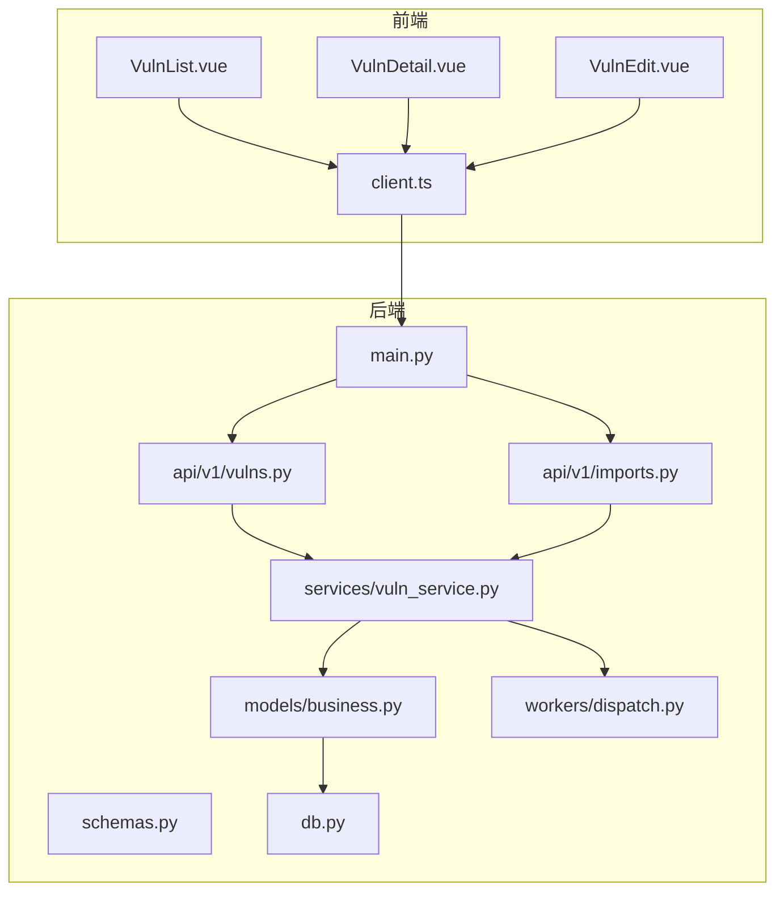
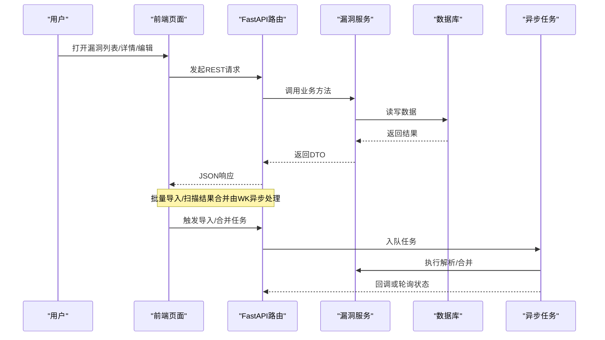
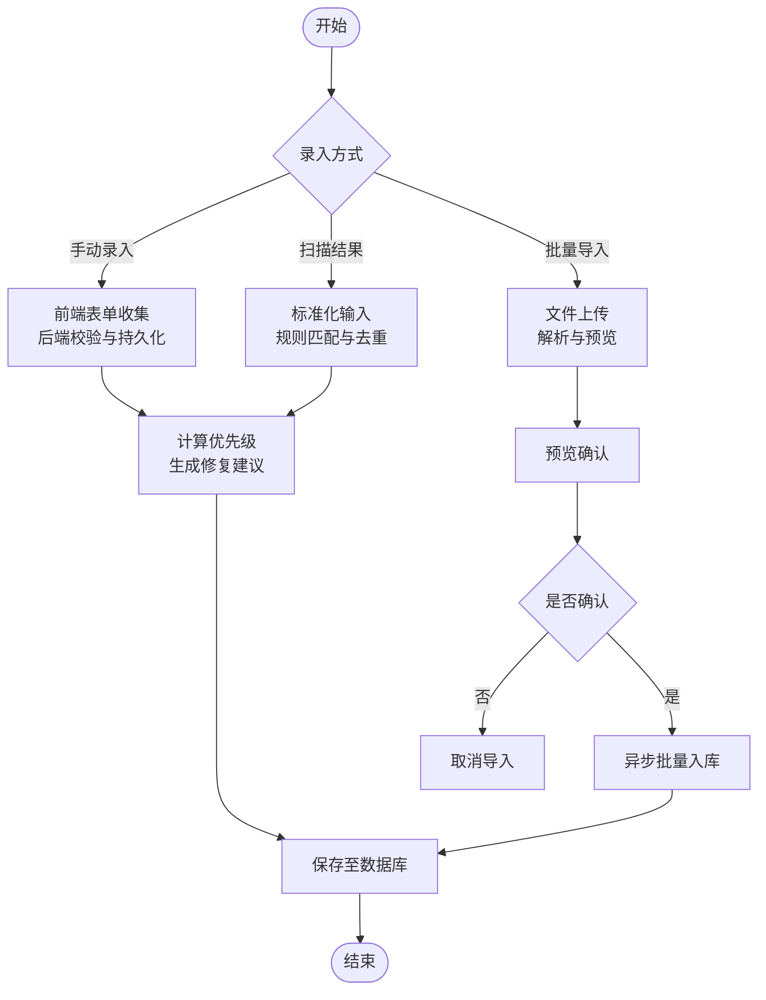
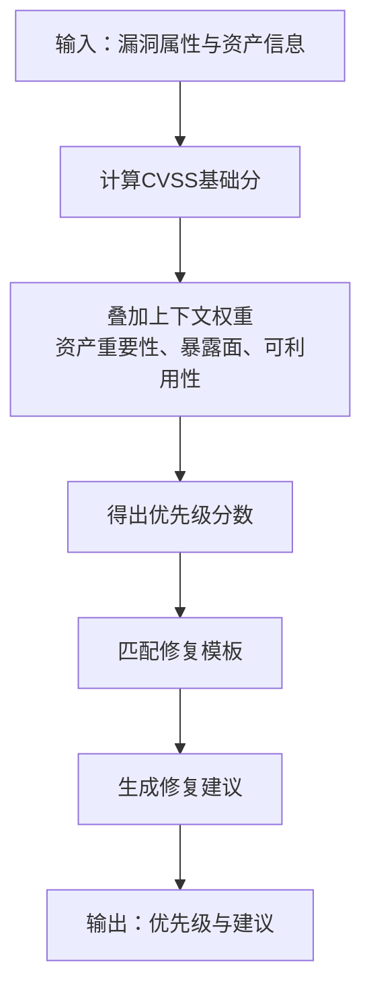
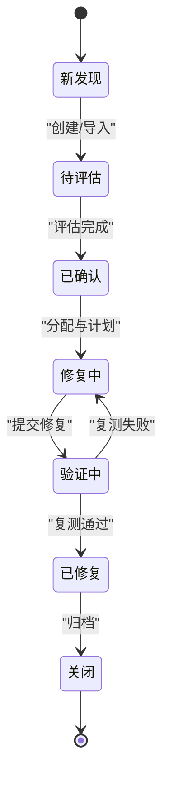
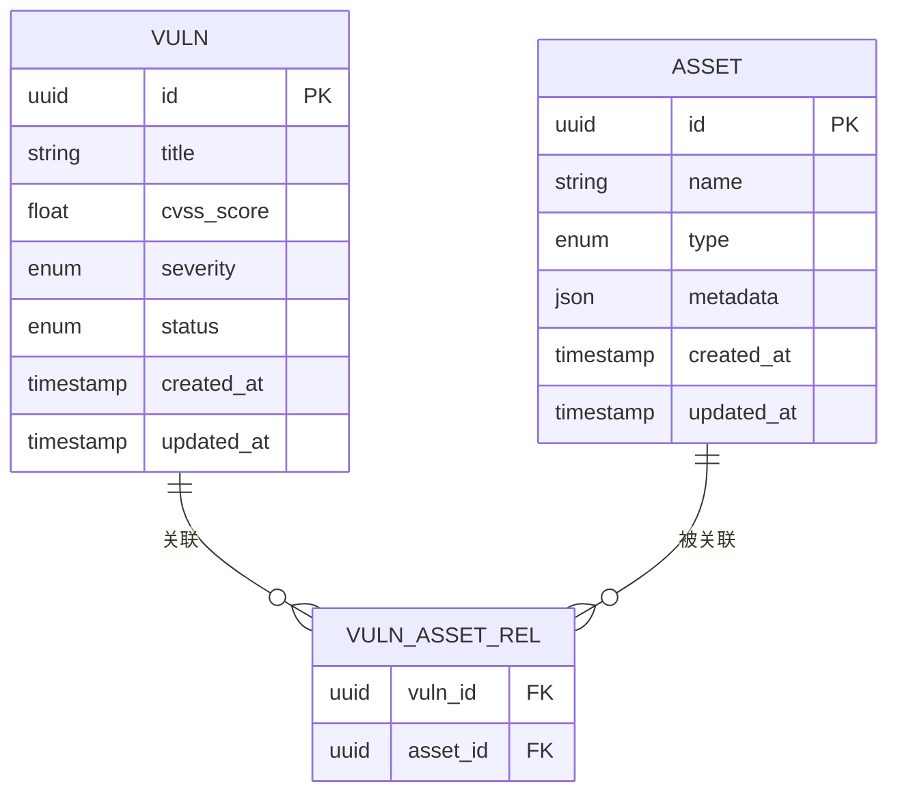
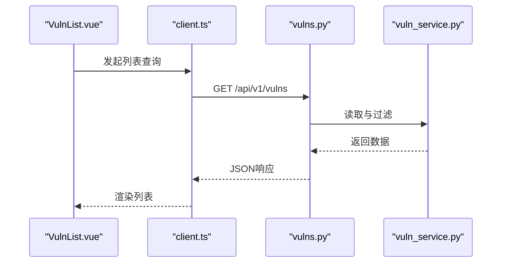
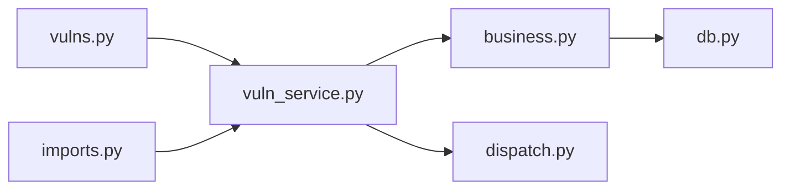

# 漏洞管理模块

<cite>
**本文引用的文件**   
- [backend/app/main.py](file://backend/app/main.py)
- [backend/app/api/v1/vulns.py](file://backend/app/api/v1/vulns.py)
- [backend/app/api/v1/imports.py](file://backend/app/api/v1/imports.py)
- [backend/app/services/vuln_service.py](file://backend/app/services/vuln_service.py)
- [backend/app/models/business.py](file://backend/app/models/business.py)
- [backend/app/schemas.py](file://backend/app/schemas.py)
- [backend/app/db.py](file://backend/app/db.py)
- [backend/app/workers/dispatch.py](file://backend/app/workers/dispatch.py)
- [frontend/src/views/VulnList.vue](file://frontend/src/views/VulnList.vue)
- [frontend/src/views/VulnDetail.vue](file://frontend/src/views/VulnDetail.vue)
- [frontend/src/views/VulnEdit.vue](file://frontend/src/views/VulnEdit.vue)
- [frontend/src/api/client.ts](file://frontend/src/api/client.ts)
</cite>

## 目录
1. [简介](#简介)
2. [项目结构](#项目结构)
3. [核心组件](#核心组件)
4. [架构总览](#架构总览)
5. [详细组件分析](#详细组件分析)
6. [依赖分析](#依赖分析)
7. [性能考虑](#性能考虑)
8. [故障排查指南](#故障排查指南)
9. [结论](#结论)
10. [附录](#附录)

## 简介
本文件面向Talos平台的“漏洞管理模块”，覆盖以下目标：
- 漏洞录入流程：手动录入、批量导入、自动扫描结果整合处理
- 分类体系：CVSS评分、漏洞类型、影响范围与严重级别定义
- 优先级算法与修复建议生成机制
- 生命周期管理：从发现到修复验证的完整流程
- 资产关联与依赖分析
- 搜索过滤、批量操作与状态跟踪
- API接口文档、数据模型说明与前端集成指南

## 项目结构
后端采用FastAPI分层架构，包含路由层（API）、服务层（业务逻辑）、模型层（ORM）、数据库连接与迁移、异步任务调度等；前端基于Vue3+TypeScript，提供漏洞列表、详情、编辑等页面，并通过统一HTTP客户端调用后端API。

**图表来源** 
- [backend/app/main.py](file://backend/app/main.py)
- [backend/app/api/v1/vulns.py](file://backend/app/api/v1/vulns.py)
- [backend/app/api/v1/imports.py](file://backend/app/api/v1/imports.py)
- [backend/app/services/vuln_service.py](file://backend/app/services/vuln_service.py)
- [backend/app/models/business.py](file://backend/app/models/business.py)
- [backend/app/schemas.py](file://backend/app/schemas.py)
- [backend/app/db.py](file://backend/app/db.py)
- [backend/app/workers/dispatch.py](file://backend/app/workers/dispatch.py)
- [frontend/src/views/VulnList.vue](file://frontend/src/views/VulnList.vue)
- [frontend/src/views/VulnDetail.vue](file://frontend/src/views/VulnDetail.vue)
- [frontend/src/views/VulnEdit.vue](file://frontend/src/views/VulnEdit.vue)
- [frontend/src/api/client.ts](file://frontend/src/api/client.ts)

**章节来源**
- [backend/app/main.py](file://backend/app/main.py)
- [backend/app/api/v1/vulns.py](file://backend/app/api/v1/vulns.py)
- [backend/app/api/v1/imports.py](file://backend/app/api/v1/imports.py)
- [backend/app/services/vuln_service.py](file://backend/app/services/vuln_service.py)
- [backend/app/models/business.py](file://backend/app/models/business.py)
- [backend/app/schemas.py](file://backend/app/schemas.py)
- [backend/app/db.py](file://backend/app/db.py)
- [backend/app/workers/dispatch.py](file://backend/app/workers/dispatch.py)
- [frontend/src/views/VulnList.vue](file://frontend/src/views/VulnList.vue)
- [frontend/src/views/VulnDetail.vue](file://frontend/src/views/VulnDetail.vue)
- [frontend/src/views/VulnEdit.vue](file://frontend/src/views/VulnEdit.vue)
- [frontend/src/api/client.ts](file://frontend/src/api/client.ts)

## 核心组件
- 路由层（API）
  - 漏洞相关接口：创建、更新、查询、删除、批量操作、状态流转
  - 导入相关接口：文件上传、解析预览、确认入库
- 服务层（vuln_service）
  - 漏洞CRUD、优先级计算、修复建议生成、与资产关联、依赖分析
- 模型层（business）
  - 漏洞实体、资产实体、导入记录、报告实体等ORM映射
- 数据校验（schemas）
  - Pydantic模型用于请求/响应校验与序列化
- 数据库（db）
  - SQLAlchemy引擎、会话、迁移配置
- 异步任务（workers/dispatch）
  - 导入解析、扫描结果合并、批量处理的队列化执行

**章节来源**
- [backend/app/api/v1/vulns.py](file://backend/app/api/v1/vulns.py)
- [backend/app/api/v1/imports.py](file://backend/app/api/v1/imports.py)
- [backend/app/services/vuln_service.py](file://backend/app/services/vuln_service.py)
- [backend/app/models/business.py](file://backend/app/models/business.py)
- [backend/app/schemas.py](file://backend/app/schemas.py)
- [backend/app/db.py](file://backend/app/db.py)
- [backend/app/workers/dispatch.py](file://backend/app/workers/dispatch.py)

## 架构总览
系统遵循“前端页面 -> HTTP客户端 -> FastAPI路由 -> 服务层 -> ORM模型 -> 数据库”的分层模式，并引入异步任务处理耗时操作（如导入解析、扫描结果合并）。

**图表来源** 
- [backend/app/api/v1/vulns.py](file://backend/app/api/v1/vulns.py)
- [backend/app/api/v1/imports.py](file://backend/app/api/v1/imports.py)
- [backend/app/services/vuln_service.py](file://backend/app/services/vuln_service.py)
- [backend/app/workers/dispatch.py](file://backend/app/workers/dispatch.py)
- [backend/app/db.py](file://backend/app/db.py)

## 详细组件分析

### 漏洞录入流程
- 手动录入
  - 前端通过表单提交漏洞信息（标题、描述、CVSS、类型、影响范围、严重级别、修复建议等），后端路由接收后交由服务层进行校验、计算优先级、生成修复建议并持久化。
- 批量导入
  - 支持CSV/Excel/JSON等格式，前端上传文件后，后端解析为中间结构，进入预览阶段供用户确认，确认后由异步任务批量入库，并与现有资产进行匹配去重。
- 自动扫描结果整合
  - 外部扫描器输出（如CVE、NVD、厂商公告）经标准化后进入导入流程，服务层进行规则匹配、重复检测、严重级别归一化，并生成修复建议。

**图表来源** 
- [backend/app/api/v1/vulns.py](file://backend/app/api/v1/vulns.py)
- [backend/app/api/v1/imports.py](file://backend/app/api/v1/imports.py)
- [backend/app/services/vuln_service.py](file://backend/app/services/vuln_service.py)
- [backend/app/workers/dispatch.py](file://backend/app/workers/dispatch.py)

**章节来源**
- [backend/app/api/v1/vulns.py](file://backend/app/api/v1/vulns.py)
- [backend/app/api/v1/imports.py](file://backend/app/api/v1/imports.py)
- [backend/app/services/vuln_service.py](file://backend/app/services/vuln_service.py)
- [backend/app/workers/dispatch.py](file://backend/app/workers/dispatch.py)

### 漏洞分类体系
- CVSS评分
  - 依据通用漏洞评分标准，结合基础指标（可利用性、影响面）与上下文指标（环境差异）计算综合分数，用于严重级别判定与优先级排序。
- 漏洞类型
  - 常见类型包括注入、跨站脚本、权限提升、敏感信息泄露、配置错误等，便于统计分析与治理策略制定。
- 影响范围
  - 按资产维度（主机、容器、应用、服务）与业务域划分，支持多资产关联与依赖关系建模。
- 严重级别
  - 通常分为低、中、高、危急四级，与CVSS区间映射，同时结合业务重要性动态调整。

**章节来源**
- [backend/app/services/vuln_service.py](file://backend/app/services/vuln_service.py)
- [backend/app/models/business.py](file://backend/app/models/business.py)
- [backend/app/schemas.py](file://backend/app/schemas.py)

### 优先级算法与修复建议生成
- 优先级算法
  - 以CVSS为基础分，叠加资产重要性权重、暴露面（公网/内网）、可利用性、业务关键度、修复难度等因素，形成最终优先级分数，用于排障与SLA管理。
- 修复建议生成
  - 基于漏洞类型与CVSS指标，匹配知识库模板，结合资产环境参数生成可操作的修复步骤，必要时附加参考链接与回滚方案。

**图表来源** 
- [backend/app/services/vuln_service.py](file://backend/app/services/vuln_service.py)

**章节来源**
- [backend/app/services/vuln_service.py](file://backend/app/services/vuln_service.py)

### 生命周期管理
- 状态流转
  - 新发现 -> 待评估 -> 已确认 -> 修复中 -> 验证中 -> 已修复 -> 关闭
  - 支持退回与重新评估，确保闭环管理。
- 关键动作
  - 评估：补充CVSS、类型、影响范围
  - 分配：指派责任人/团队
  - 修复：记录修复版本、补丁号、变更单
  - 验证：复测通过后关闭

**图表来源** 
- [backend/app/services/vuln_service.py](file://backend/app/services/vuln_service.py)
- [backend/app/models/business.py](file://backend/app/models/business.py)

**章节来源**
- [backend/app/services/vuln_service.py](file://backend/app/services/vuln_service.py)
- [backend/app/models/business.py](file://backend/app/models/business.py)

### 资产关联与依赖分析
- 关联关系
  - 漏洞与资产多对多关联，支持按资产维度聚合统计与趋势分析。
- 依赖分析
  - 基于资产拓扑与服务依赖图，评估漏洞传播路径与影响面，辅助定位根因与修复顺序。

**图表来源** 
- [backend/app/models/business.py](file://backend/app/models/business.py)

**章节来源**
- [backend/app/models/business.py](file://backend/app/models/business.py)

### 搜索过滤、批量操作与状态跟踪
- 搜索过滤
  - 支持按标题、类型、严重级别、CVSS区间、资产标签、状态、时间范围等多条件组合筛选。
- 批量操作
  - 批量更新状态、分配责任人、批量导入确认、批量导出报表。
- 状态跟踪
  - 每个漏洞维护状态历史与审计日志，支持回溯与责任追踪。

**章节来源**
- [backend/app/api/v1/vulns.py](file://backend/app/api/v1/vulns.py)
- [backend/app/services/vuln_service.py](file://backend/app/services/vuln_service.py)

### API接口文档
- 漏洞管理（/api/v1/vulns）
  - 创建漏洞：POST /api/v1/vulns
  - 更新漏洞：PUT /api/v1/vulns/{id}
  - 获取详情：GET /api/v1/vulns/{id}
  - 列表查询：GET /api/v1/vulns?filters...
  - 删除漏洞：DELETE /api/v1/vulns/{id}
  - 批量操作：POST /api/v1/vulns/batch
  - 状态流转：PATCH /api/v1/vulns/{id}/status
- 导入管理（/api/v1/imports）
  - 上传文件：POST /api/v1/imports/upload
  - 预览数据：GET /api/v1/imports/{id}/preview
  - 确认入库：POST /api/v1/imports/{id}/confirm
  - 任务状态：GET /api/v1/imports/{id}/status

**章节来源**
- [backend/app/api/v1/vulns.py](file://backend/app/api/v1/vulns.py)
- [backend/app/api/v1/imports.py](file://backend/app/api/v1/imports.py)

### 数据模型说明
- 漏洞实体
  - 字段：标识、标题、描述、CVSS评分、类型、严重级别、状态、影响范围、修复建议、创建/更新时间等
- 资产实体
  - 字段：标识、名称、类型、元数据、创建/更新时间等
- 关联表
  - 漏洞-资产多对多关系，支持扩展属性（如置信度、证据）
- 导入记录
  - 标识、文件名、状态、进度、错误信息等

**章节来源**
- [backend/app/models/business.py](file://backend/app/models/business.py)
- [backend/app/schemas.py](file://backend/app/schemas.py)

### 前端组件集成指南
- 列表页（VulnList.vue）
  - 展示过滤条件、分页、批量选择与操作按钮
  - 调用client.ts封装的API进行数据加载与交互
- 详情页（VulnDetail.vue）
  - 展示漏洞详情、资产关联、状态历史、修复建议
  - 支持跳转到编辑页与验证操作
- 编辑页（VulnEdit.vue）
  - 表单编辑、校验提示、保存与取消
- HTTP客户端（client.ts）
  - 统一封装请求头、错误处理、重试策略与拦截器

**图表来源** 
- [frontend/src/views/VulnList.vue](file://frontend/src/views/VulnList.vue)
- [frontend/src/api/client.ts](file://frontend/src/api/client.ts)
- [backend/app/api/v1/vulns.py](file://backend/app/api/v1/vulns.py)
- [backend/app/services/vuln_service.py](file://backend/app/services/vuln_service.py)

**章节来源**
- [frontend/src/views/VulnList.vue](file://frontend/src/views/VulnList.vue)
- [frontend/src/views/VulnDetail.vue](file://frontend/src/views/VulnDetail.vue)
- [frontend/src/views/VulnEdit.vue](file://frontend/src/views/VulnEdit.vue)
- [frontend/src/api/client.ts](file://frontend/src/api/client.ts)

## 依赖分析
- 组件耦合
  - 路由层仅负责请求分发与校验，业务逻辑集中在服务层，降低耦合度
  - 模型层通过ORM与数据库解耦，便于迁移与替换存储
- 外部依赖
  - 异步任务调度用于导入与扫描结果合并，避免阻塞主线程
- 潜在循环依赖
  - 当前分层清晰，未发现直接循环引用

**图表来源** 
- [backend/app/api/v1/vulns.py](file://backend/app/api/v1/vulns.py)
- [backend/app/api/v1/imports.py](file://backend/app/api/v1/imports.py)
- [backend/app/services/vuln_service.py](file://backend/app/services/vuln_service.py)
- [backend/app/models/business.py](file://backend/app/models/business.py)
- [backend/app/db.py](file://backend/app/db.py)
- [backend/app/workers/dispatch.py](file://backend/app/workers/dispatch.py)

**章节来源**
- [backend/app/api/v1/vulns.py](file://backend/app/api/v1/vulns.py)
- [backend/app/api/v1/imports.py](file://backend/app/api/v1/imports.py)
- [backend/app/services/vuln_service.py](file://backend/app/services/vuln_service.py)
- [backend/app/models/business.py](file://backend/app/models/business.py)
- [backend/app/db.py](file://backend/app/db.py)
- [backend/app/workers/dispatch.py](file://backend/app/workers/dispatch.py)

## 性能考虑
- 导入与扫描结果合并使用异步任务，避免长事务阻塞
- 列表查询支持索引与分页，减少大结果集传输
- 缓存热点数据（如字典表、修复模板）以降低数据库压力
- 批量操作采用事务与分批提交，提高吞吐与稳定性

[本节为通用指导，不直接分析具体文件]

## 故障排查指南
- 常见问题
  - 导入失败：检查文件格式、字段映射、必填项校验
  - 优先级异常：核对CVSS输入、资产权重与业务关键度设置
  - 状态流转错误：确认前置状态与权限控制
- 调试手段
  - 查看导入任务状态与错误日志
  - 启用详细日志与审计追踪
  - 使用测试用例复现问题

**章节来源**
- [backend/app/api/v1/imports.py](file://backend/app/api/v1/imports.py)
- [backend/app/workers/dispatch.py](file://backend/app/workers/dispatch.py)

## 结论
Talos平台的漏洞管理模块通过清晰的分层架构与异步任务机制，实现了从录入、分类、优先级计算、修复建议生成到生命周期管理的完整闭环。结合资产关联与依赖分析，能够有效支撑企业级漏洞治理与合规要求。

[本节为总结性内容，不直接分析具体文件]

## 附录
- 术语表
  - CVSS：通用漏洞评分标准
  - SLA：服务等级协议
  - DTO：数据传输对象
- 最佳实践
  - 保持CVSS输入准确，定期校准权重
  - 建立修复模板库，持续优化建议质量
  - 强化审计与追溯，确保合规与问责

[本节为补充信息，不直接分析具体文件]